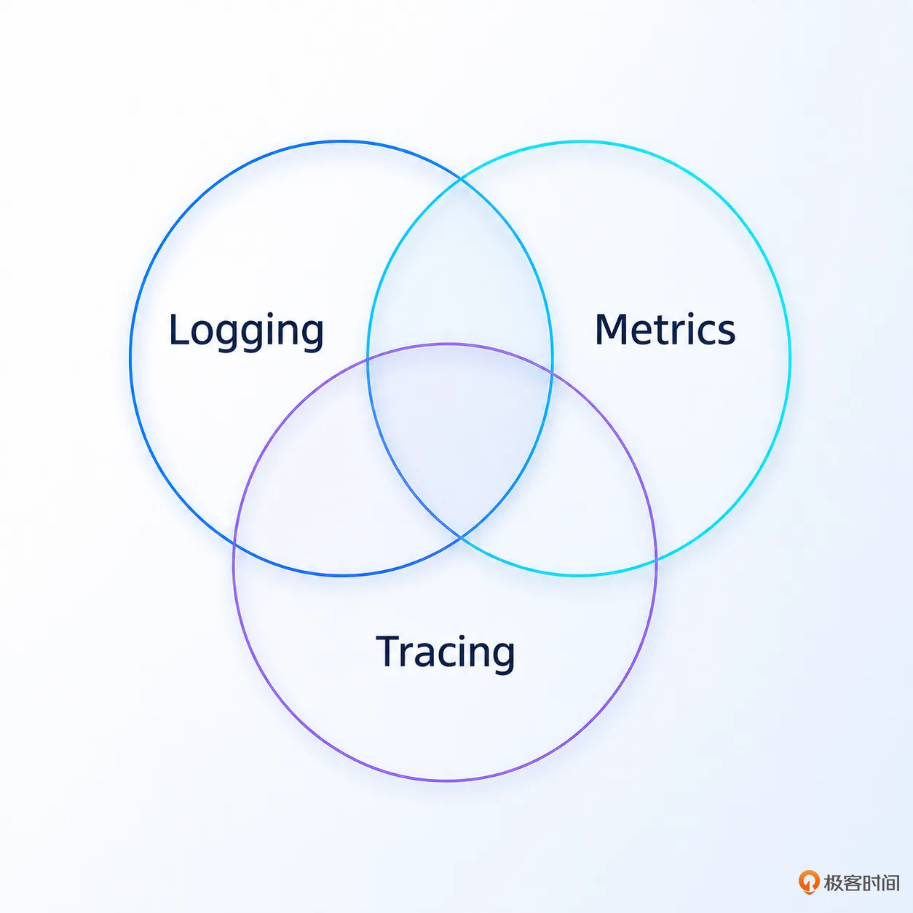
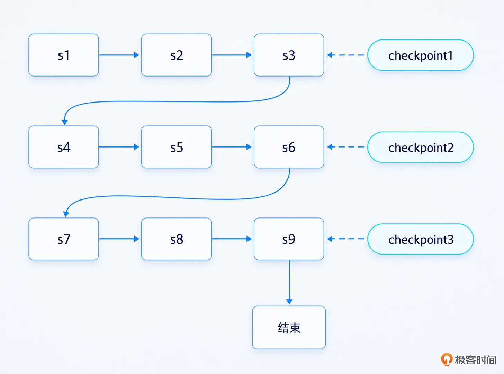
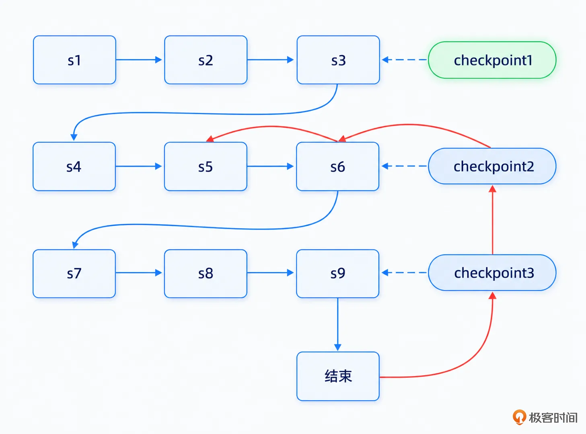
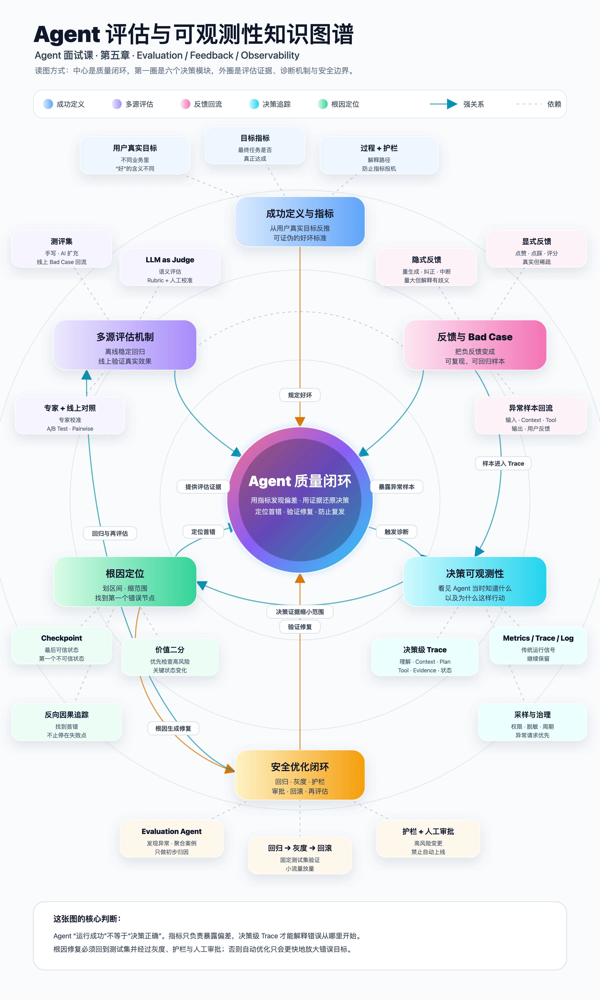

# 24｜用户：Agent，你知错了吗，错在哪儿了？
你好，我是大明。

做过传统后端开发的人，对可观测性都不陌生。线上接口变慢了，就看 Metrics、Trace 和 Log，顺着调用链找到慢查询、超时或者异常节点。

但是到了 Agent 里面，事情就麻烦了。比如用户明确要求推荐一台 8000 元以内的笔记本，Agent 最后却推荐了一台 9999 元的游戏本。你打开监控一看：HTTP 200，大模型调用成功，商品检索成功，数据库正常，整个请求甚至没有任何异常。

**所有监控都是绿的，但答案就是错的。**

这就是 Agent 可观测性的独特问题：系统正常运行，不代表 Agent 正确运行。

所以 Agent 的可观测性除了回答“系统有没有挂”，还必须回答：Agent 当时看到了什么？为什么这么决定？究竟从哪一步开始错了？

这一讲，我们就来讨论怎么把 Agent 的执行过程真正“看见”，以及出了问题之后，怎么顺着执行链找到真正的根因。

## 从传统可观测性说起

在讨论 Agent 的可观测性之前，我们先回到传统软件工程里面看看“可观测性”到底是干什么的，也就是所谓的 **Metrics、Trace 和 Log**。如这个经典图片：

- Metrics 可以翻译为指标、度量等，是可聚合的指标。解决的是“系统整体怎么样”。比如说包括 QPS，RT/P99 RT，错误率，CPU 使用率等。

- Trace 可以翻译为链路追踪，解决的是“一次请求到底经历了什么”。比如说一个请求经过网关 -> 订单服务 -> 商品服务 -> Redis -> MySQL，如果整个请求耗时 2 秒，而 Trace 告诉你其中 1.8 秒都花在 MySQL 上，那么排查范围瞬间就缩小了。

- Log 是指日志信息，解决的是“这个节点具体发生了什么”。比如说你继续查看数据库相关日志，最后发现某条 SQL 没有走索引，一次查询扫了几百万行。那么到这里，这次故障基本上就定位清楚了：SQL 未命中索引的问题。

所以传统可观测性真正解决的，其实就是两件事情：

- **系统出问题的时候，我要尽快知道。**

- **知道出问题以后，我要能够还原现场，找到根因。**

这套思想到了 Agent 里面依然成立，Metrics、Trace、Log 一个都不会消失。但是麻烦在于，Agent 引入了一类传统系统里面没有那么突出的问题：系统本身没有出错，但是“决策”错了。

HTTP 可以是 200，工具调用可以成功，大模型也可以正常返回，甚至整条 Trace 都没有任何异常，但是 Agent 最后就是给了用户一个错误答案。所以接下来真正的问题就变成了：传统可观测性已经能看见程序怎么运行了，那么到了 Agent 时代，我们还需要额外看见什么？

## Agent 可观测性的基础做法

最基础的思路其实并不复杂： **传统的 Metrics、Trace 和 Log 继续保留，只不过你需要把 Agent 自己的执行过程也记录下来。**

传统系统的 Trace 通常记录的是调用链路，比如说网关 -> 服务 A -> 服务 B -> 服务 C 这种。

而 Agent 的 Trace 也差不多，本质上也可以看做是记录调用链路。但是相对来说，传统 Trace 主要关注的是 **请求经过了哪些系统组件**，而 Agent Trace 还要关注 **Agent 经历了哪些决策节点**。

这是两者一个非常重要的区别。例如，用户最后拿到了一个错误答案，你至少应该能够从 Trace 里面看到：

- Agent 最终将用户输入理解成了什么；

- 识别出来的 Intent、Slot、硬约束是什么；

- 这一轮给大模型注入了哪些 Context；

- 当前 Plan 是什么，执行到了哪一步；

- 为什么选择了这个 Tool；

- Tool 调用的参数是什么；

- Tool 返回了什么；

- Agent 如何处理这个 Observation；

- 中间有没有 Retry、Replan、Rollback；

- 最终生成了什么答案。

这里尤其要注意 **Context**。传统系统排查问题的时候，你很少需要关心“这个函数当时究竟看到了哪些知识”，但是 Agent 不一样。大模型最后做出的决策高度依赖于它当时窗口里面有什么。例如用户明明说了：预算不能超过 8000。最终 Agent 却推荐了 9999 元的商品。

那么你排查的时候至少需要知道：

- 用户输入中有没有 8000？

- Slot Filling 有没有提取 budget\_max=8000？

- Context 中有没有保留 budget\_max=8000？

- 思考的时候有没有带上 budget\_max = 8000？

- 推荐 Action 参数有没有 price\_max=8000？

- Tool 返回结果有没有超过 8000？

只要其中某一环出了问题，最终结果就可能出错。

所以我一般建议 Agent 至少记录几类核心信息： **输入和理解结果、Context、决策、Tool 调用、Observation / Evidence、状态变化以及最终输出。** 本质上就是记录你排查问题要用的东西。

当然，这并不意味着你要把所有 Prompt、所有上下文、所有 Tool Result 全量永久保存下来。这样不仅数据量很大，还可能带来隐私和安全问题。实践中可以按照重要程度来处理。比如说完整 Prompt、完整 Context、完整 Tool Result，可以只针对抽样请求、异常请求或者短期保存。

Metrics 也是一样。除了传统的 RED（Rate，Error，Duration），你还应该增加一些 Agent 特有的指标，例如：

- Tool 调用失败率；

- Retry / Replan 比例；

- 平均 ReAct 循环次数；

- 检索空结果比例；

- 用户纠正率；

- 约束违反率；

- 最终任务成功率。

所以从基础做法上来说，Agent 可观测性应该看做是传统工程的升级加强版：不仅要记录“程序做了什么”，还要尽可能记录“Agent 为什么这么做，以及它当时依据了什么”。

有了这些东西，我们才有资格继续讨论下一个问题：Agent 最终输出了一坨垃圾，我究竟该从哪里开始查？下面我介绍两种常见方法：Checkpoint 检查和二分法。

### 借助 Checkpoint 快速定位

第一个方法就是借助前面 Plan 里面提到的 **Checkpoint**。

这个思路其实和 Replan 里面讨论的“回溯定位根因”是一回事。区别无非是：Replan 场景下是 Agent 自己根据 Checkpoint 判断应该回退到哪里，而这里是我们人工拿着 Trace、Log 和中间状态去排查。

假设一个任务的执行链是：

现在用户反馈最终结果错了。这个时候犯不着从 S9、S8、S7 一路往前翻。你可以先检查几个 Checkpoint，当你遇到第一个毫无问题的 Checkpoint，就说明出错的地方在上一个有问题的 Checkpoint 到这个 Checkpoint 之间。如图：

红线，这就是你的排查路线。

- 先找 Checkpoint3，发现它确实是有问题的

- 再找 Checkpoint2，发现它也有问题

- 找 Checkpoint1，发现它毫无破绽

- 推测问题出在 Checkpoint1 和 Checkpoint2 之间

- 从 Checkpoint2 往前找，直到定位到 s5。

这就是 Checkpoint 在可观测性里面另外一个非常重要的作用， **它不只是用来运行时发现 Agent 有没有走偏，还可以作为事后排查的可信锚点。**

这和我前面讲 Plan 时的设计是一致的。Checkpoint 本身就应该保存检查结果和 Evidence，后续既可以用于 Replan，也可以用于根因查找。所以如果你的 Agent 本身已经有比较完善的 Checkpoint 机制，那么可观测性实际上可以直接复用这些数据。包括：

- 当时的任务状态；

- 关键 Context；

- 中间产物；

- 约束是否满足；

- Evidence；

- Check Result。

然后寻找 **最后一个可信的 Checkpoint，以及第一个不可信的 Checkpoint。** 真正的错误大概率就发生在两者之间。

从这个角度来说，Checkpoint 设计得越好，Agent 出问题之后就越容易排查。反过来说，如果你所谓的 Checkpoint 只是简单记录一句 `step_success=true`，那么它对根因定位几乎没什么帮助。

Replan 里面我们是让 Agent 自动完成这件事情：找到最后一个可信状态，再决定局部 Replan 还是更大范围回滚；而可观测性这里，则是工程师人工完成同样的工作。

### 借助二分法进一步缩小范围

但是 Checkpoint 也有一个问题，你不太好确定在什么地方设置 Checkpoint **。** 如果 Checkpoint 太密，运行成本会很高；如果太稀，那么两个 Checkpoint 之间可能隔着几十个步骤。

这时候就可以借鉴一个非常朴素的算法： **二分法。** 我相信你在传统工程的错误排查里面应该做得很多了。

理论上，一个包含几十甚至上百个步骤的执行链，可以通过很少几次检查，就把范围缩小到几个步骤之内。

当然，实践中这里不需要真的死板地按照 `1/2` 来切。而是可以考虑结合以下因素来切：

- 先查看最容易出错的节点，所谓的前科累累的节点。

- 关键节点：这一类节点会持续影响后面的流程，所以要先检查。这些节点包括：

- Context 发生了明显变化；

- 产生了关键中间结果；

- 切换了执行路径；

- 调用了外部工具；

- 发生了 Replan；

- 修改了关键状态。

- 你的直觉告诉你可能出了问题的节点，我不是在开玩笑，我当年就是号称人肉探测机，直觉非常敏锐，一找一个准。尤其是当这个 Agent 是你开发的，你的直觉会更准。

这些节点天然就是更加有价值的“二分点”。所以所谓二分法，核心并不是数学意义上的严格二等分，而是不断选择一个最容易出错/最有价值的中间节点，判断错误发生在它之前还是之后，然后快速缩小排查范围。

最终等错误范围缩小到三五个步骤之后，再使用自后向前的方式检查上下文，寻找真正的第一个错误节点。

另外，你也可以进一步结合 Checkpoint 来使用：Checkpoint 先确定大区间，二分法继续缩小范围，最后再反向追踪因果链。

这样才比简单地“打开 Trace，从最后一步往前翻”高效得多。

最后我要给你几个表格，这些表格是你在建设可观测性上要考虑收集的指标。

## 常见指标（仅供参考）

指标

含义

任务成功率

（Task Success Rate）

最终成功完成用户任务的比例，是衡量 Agent 整体效果最重要的结果指标之一。

难点在判断“什么才是成功”，比如典型做法是通过 LLM as a Judge 来分析。

用户纠正率

（User Correction Rate）

用户出现“不是这个意思”“你理解错了”“重新来”等纠正行为的比例，能够反映 Agent 理解、决策和输出质量。

可以考虑在用户输入之后，立刻分析并记录这个指标。

约束违反率

（Constraint Violation Rate）

Agent 违反用户硬约束、业务规则或安全约束的比例。例如用户要求预算不超过 8000 元，结果推荐了 9000 元商品。

不太好采集，可能需要在发现用户不满意之后进一步用 LLM as a Judge 来分析。

意图识别准确率

（Intent Accuracy）

Agent 意图识别正确的比例。意图识别错误通常会导致后续 Context、Tool 和执行流程整体走偏。

同样不好提取，需要依靠 LLM as a Judge 来分析意图是否提取正确。

槽位 / 约束提取准确率

（Slot / Constraint Extraction Accuracy）

用户输入中的关键参数、硬约束和软偏好是否被正确提取，用于发现“最开始就理解错了”的问题。

如果要从语义上确定提取出来的参数对不对，同样还是得靠 LLM as a Judge。

工具选择准确率

（Tool Selection Accuracy）

Agent 选择的 Tool 是否符合当前目标和状态，用于衡量 Action 决策质量。

要考虑借助 LLM as a Judge 来分析是否选对了工具。

工具调用成功率

（Tool Success Rate）

Tool 实际调用成功的比例，主要用于发现外部接口、MCP、数据库等依赖的稳定性问题。

工具重试率

（Tool Retry Rate）

Tool 调用需要重试的比例。突然升高通常意味着下游系统不稳定、参数质量下降或者 Agent 选错工具。

最好分工具统计。

工具调用耗时

（Tool Latency）

Tool 调用的耗时，可以用于发现某个外部依赖是否正在拖慢整个 Agent。

分工具统计，不要混一起。

检索空结果率

（Retrieval Empty Rate）

发起检索之后没有召回有效结果的比例。升高可能意味着 Query 构造、索引、知识库或者检索策略出现问题。

检索命中率 / 相关性

（Retrieval Hit / Relevance Rate）

召回结果中真正包含解决当前问题所需信息的比例，用于衡量检索质量。

同样要借助 LLM as a Judge，不然怎么知道是否包含所需信息。

证据覆盖率

（Evidence Coverage Rate）

Agent 最终关键结论中，能够找到明确 Evidence 支撑的比例。过低意味着幻觉风险较高。

可以通过简单检测 evidences 这种字段是否为空来统计，如果要从语义上分析证据是否正确以及是否真的能支撑结论，还是要借助 LLM as a Judge。

无依据结论率

（Unsupported Claim Rate）

最终回答中无法关联到 Context、检索结果或 Tool Result 的关键结论比例，可用于监控无依据生成。

上下文 Token 使用量

（Context Token Usage）

每次 Agent 调用实际注入的 Context Token 数，用于观察上下文膨胀和成本变化。

上下文利用率

（Context Utilization Rate）

放入 Context 的信息中，实际被后续决策或者最终答案使用的比例，可用于发现大量无效上下文。

要借助 LLM as a Judge。

上下文遗漏率

（Context Miss Rate）

某条完成任务所需的信息实际上存在，但当时没有被注入 Context 的比例，反映 Context Selection 的问题。

要借助 LLM as a Judge。

上下文 / 约束丢失率

（Context / Constraint Loss Rate）

用户已经明确提供的重要事实或约束，在后续步骤中丢失的比例，可用于监控 Context Drift。

要借助 LLM as a Judge。

ReAct 平均循环次数

（ReAct Loop Count）

一次任务平均经历多少轮 Think / Action / Observation。突然增加通常意味着 Agent 正在反复试错或者陷入循环。

最大循环次数命中率

（Max Loop Hit Rate）

因达到最大循环次数而被迫退出的任务比例，可以发现 Agent 是否经常无法正常收敛。

重试率

（Retry Rate）

Agent 因模型输出异常、工具失败等原因重新执行当前步骤的比例。

重计划触发率

（Replan Rate）

执行过程中触发 Replan 的任务比例。适量属于正常容错，突然上升通常说明原始 Plan、Context 或外部环境出现问题。

重计划成功率

（Replan Success Rate）

触发 Replan 后最终能够恢复并完成任务的比例，用于判断 Replan 机制是否真正有效。

回滚率

（Rollback Rate）

Agent 需要回滚到之前状态或者 Checkpoint 的比例。过高可能意味着执行路径不稳定。

检查点失败率

（Checkpoint Failure Rate）

Checkpoint 校验失败的比例。按照不同 Checkpoint 分组后，可以快速发现最容易发生偏差的执行阶段。

计划完成率

（Plan Completion Rate）

Agent 能够按照 Plan 执行到结束的比例。它不等价于任务成功率，但能够反映计划本身的可执行性。

你要小心 Agent 撒谎的问题，即它没有按照计划执行，但是声称自己按照计划执行。

步骤成功率

（Step Success Rate）

Plan 中各步骤执行成功的比例。按照 Step 类型拆分后，可以快速找到系统中的薄弱环节。

如果要从语义上判断成功，那么要借助 LLM as a Judge。否则只要没出错就可以认为是成功了。

大模型调用耗时

（LLM Call Latency）

每次大模型调用的耗时，可以按照意图识别、Plan、Replan、Rerank、最终生成等不同节点分别统计。

大模型调用错误率

（LLM Error Rate）

大模型超时、限流、格式错误、Schema 校验失败等调用异常的比例。

Token 消耗量

（Token Consumption）

单次任务或者单个步骤消耗的 Input / Output Token，用于成本和上下文膨胀监控。

单任务成本

（Cost per Task）

完成一次用户任务平均消耗的模型、检索和 Tool 成本，比单纯统计 Token 更接近真实业务成本。

端到端耗时

（End-to-End Latency）

从用户输入到 Agent 最终返回结果的整体耗时，直接反映最终用户体验。

降级 / 兜底触发率

（Fallback Rate）

Agent 无法按照正常路径继续，需要降级模型、切换 Tool、人工介入或者其它兜底方案的比例。

人工介入率

（Human Intervention Rate）

必须由人工接管或者人工确认才能继续的任务比例，对于企业级 Agent 尤其重要。

实践中并不需要把所有指标全部监控起来，而是根据 Agent 的业务特点选择核心指标。例如 RAG Agent 应重点关注 Retrieval Empty Rate、Evidence Coverage Rate；长任务 Agent 则更加关注 Replan Rate、Checkpoint Failure Rate 和 ReAct Loop Count。

真正重要的是当某个指标出现异常的时候，你能够顺着 Trace 进一步定位到具体的 Agent 执行节点。

## 总结

这一讲我们从传统可观测性出发，讨论了 Agent 为什么需要进一步记录决策、Context、Tool、Evidence 和状态变化。

Agent 最大的问题是 **系统没报错，不代表 Agent 没犯错。** 我觉得 Agent 的这个特性就有点像你不省心的同事，每次问他搞好了吗，他都说搞好了。而后你真的去检查过程和结果，发现没一个对的。出了问题以后，你可以先借助 Checkpoint 缩小范围，再使用二分法定位错误区间，最后沿执行链找到真正的根因。

最后提醒你一个面试中的关键点： **讲可观测性一定要准备数据。** 比如任务成功率、用户纠正率、Tool 成功率、Replan Rate、平均循环次数，以及优化前后的变化。否则你只能证明你做了监控，却无法证明你的 Agent 做得怎么样。所以面试之前，至少准备几组自己能够解释清楚的核心指标。没有数据，就很难证明你的优化真的有效。

## 思考题

如果任务成功率没有变化，但是 Replan Rate、平均 ReAct 循环次数明显上升，这说明 Agent 可能发生了什么？欢迎你在留言区分享自己的思路，也欢迎你把这节课分享给其他朋友，我们下节课再见！

## 附录

