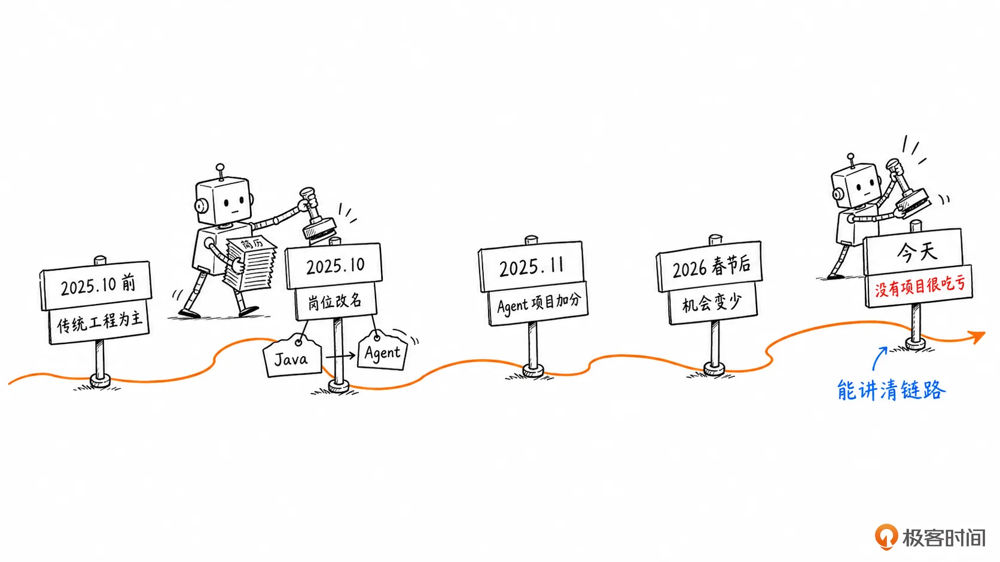
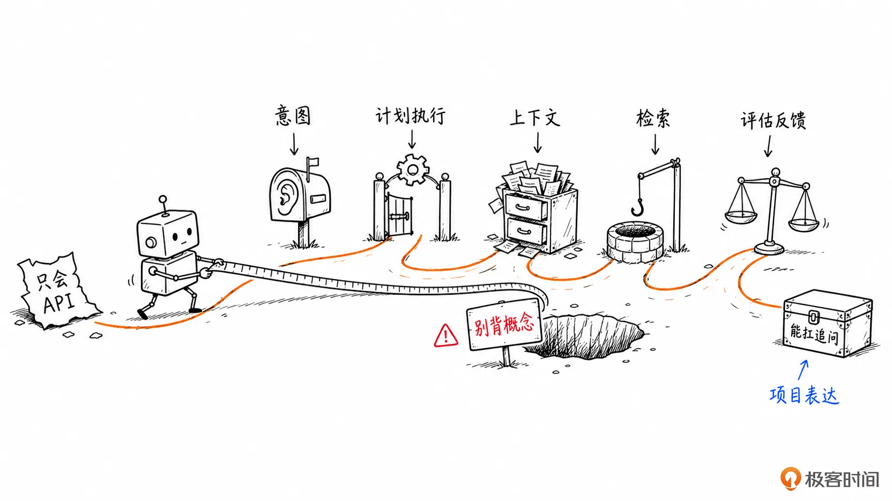
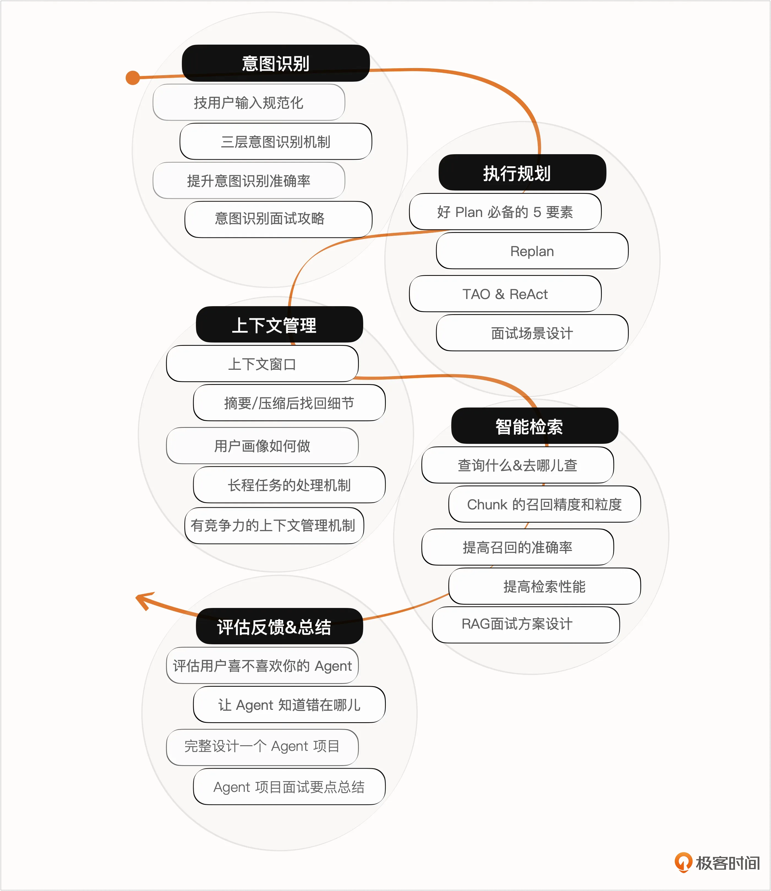
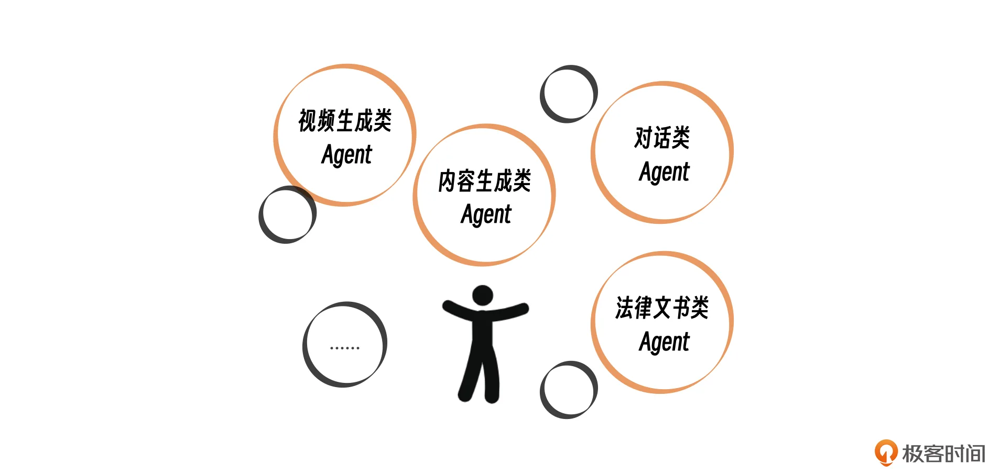

# 开篇词｜百场面试录音复盘，我总结出一套 Agent 面经
你好，我是大明，好久不见。

这一次，我想和你聊一个已经躲不开的问题：AI 时代来了，软件工程师到底该怎么准备下一轮求职？

过去几年，很多人把 AI 当成一个热点：看看新闻，试试工具，写几个 Prompt，觉得离自己的日常工作还很远。但从我这一年做面试辅导和项目辅导的观察来看，事情已经变了。 **它不再只是一个“加分项”，而是正在变成很多岗位筛人的新门槛。**

更准确地说，招聘市场正在从“你会不会用 AI”转向“你能不能讲清楚一个 Agent 项目”。

- 你有没有做过 Agent？

- Agent 怎么理解用户意图？

- 怎么规划任务？

- 怎么调用工具？

- 怎么管理上下文？

- 怎么评估效果？

这些问题正在越来越频繁地出现在面试里。

所以，这个专栏不是一门泛泛而谈的 AI 科普课，也不是一门试图把 Agent 所有理论都讲透的工程课。它的定位很直接： **帮工程师们用面试能听懂、项目能落地、表达能站住的方式，补上 Agent 这一块能力。**

## 为什么现在开这个专栏？

其实 2025 年，就有不少小伙伴问我：大明哥，你为什么不开 AI 或 Agent 相关的课？

我当时没有开，不是因为不想追热点，而是因为我自己也还在探索。那时候我对 Agent 的理解还不够稳定，项目经验也不够完整。如果只是把网上流行的概念重新讲一遍，那不叫课程，叫资料搬运，我不想这么干。

现在为什么敢开？不是因为我觉得自己已经站在 Agent 工程的最高处，而是因为我对“工程师该如何准备 Agent 面试”这件事，已经有了足够多的一线样本。

过去几年，我陆陆续续做过不少一对一面试辅导，也听过上百份面试录音做复盘，还帮一些同学改过简历、拆过项目表达。这里有一个变化，我印象非常深。

在 2025 年 10 月之前，招聘还是传统后端那一套为主。高并发、高可用、性能优化、故障排查这些内容，只要准备扎实，面试基本还能打。但 2025 年 10 月前后，风向明显变了。很多 Java 岗位“不见了”，Java 工程师岗变成了 Agent 工程师岗。名字一改，筛人的逻辑也跟着改。

到了 2025 年 11 月，这个变化就更明显了。我当时帮一个社招同学调整简历。他原本几乎没有 Agent 相关内容，面试机会很少。后来我们补了一个能讲清楚的 Agent 项目，把用户意图、执行规划、工具调用、上下文管理这些点串起来，面试机会很快就变多了。一周能有三四场面试，第二周就拿到了一个做 Agent 的公司的 Offer，薪资也不低。

这件事对我的刺激很大。这说明 **Agent 项目不再只是“锦上添花”的新概念，而是在一些岗位里变成了筛选入口**。你没有，别人有，机会就会先流向别人。

2026 年春节后，我做这类辅导少了很多，忙着创业。但直面市场反而让我更加确定了一件事：如果没有 Agent 项目，求职难度会明显上升。因为越来越多的岗位转向了 AI 应用、Agent 平台、智能助手、企业内部自动化。

到今天，大厂的要求又往前走了一步。普通 demo、内部小工具、套一层大模型 API 的玩具项目，已经越来越难打动人了。面试官开始看你有没有真实场景、有没有复杂链路、有没有评估指标、有没有失败处理。换句话说，Agent 项目还要有分量，不能只是“我也调过模型”。

这就是我开这个专栏的原因：不是为了制造焦虑，而是因为 **窗口期已经出现**。你现在补 Agent 项目、补 Agent 表达、补 Agent 工程判断，还来得及。等大部分候选人都补上了，门槛就会继续抬高，难度也会越来越大。

## 这门课解决什么问题？

你可以把这个专栏理解成《后端工程师的高阶面经》的 AI 版本。但我得先把边界讲清楚：

第一，它不会把你训练成大模型研究员。我们不会从 Transformer 数学细节一路讲到前沿论文，也不会假装几篇文章就能让你掌握所有 Agent 工程。

第二，它也不是只教你“背八股”。Agent 面试最大的坑，恰恰是只会背概念。你背了 Plan、ReAct、RAG、Memory、Tool Calling，但一问到项目里为什么这么设计、哪里会失败、怎么评估、怎么兜底，就露馅。

第三，它会 **围绕面试和项目表达来组织内容**。也就是说，我更关心一个软件工程师怎么把 Agent 讲清楚，怎么把项目做得不像玩具，怎么在面试里体现工程判断，而不是堆一堆时髦名词。

这个专栏的目标很朴素：让你面对 Agent 相关岗位时，不再只会说“我用过大模型 API”，而是能 **讲清楚一个 Agent 系统从输入、计划、执行、上下文、检索、评估到反馈的完整链路。**

### 课程设计

整个专栏会按照 Agent 相关主题拆开，每个主题下面有几讲内容。每讲都会尽量抓住一个核心问题，不追求把所有边角料都铺满，而是优先讲最适合面试、最容易落到项目里的部分。

**第一章：意图识别**

Agent 的第一步不是调用工具，而是理解用户到底想要什么。很多项目看起来失败在执行，其实一开始就理解错了目标。

**第二章：计划和执行**

这里会讨论 Agent 怎么拆任务、怎么选择下一步、怎么设计 Plan，怎么在 TAO 之间循环，以及这些机制在面试中应该怎么讲，才不像背概念。

**第三章：上下文管理**

你会看到窗口、记忆、用户画像、压缩、历史摘要、细节召回这些概念，本质上都绕不开同一个问题：什么信息应该在什么时候进入模型上下文。理解这一点，你再看很多新概念，就不会被名词吓住。

**第四章：检索，不止 RAG**

核心当然包括 RAG，但不会只停留在 RAG。真正的问题是：在大量外部知识、历史状态和业务数据里，Agent 怎么找到当前最需要的信息，并且不过度污染上下文。

**第五章：评估和反馈**

Agent 不是一次性脚本，而是一个会持续迭代的系统。你需要知道怎么设计指标，怎么采集结果，怎么判断效果真的变好了，而不是只看模型回答得顺不顺。

在这些主题之外，我还会穿插讲一些项目包装和面试表达的方法。把一个真实项目讲得更有结构、更有分量。很多同学吃亏不是因为没做东西，而是做了也讲不出来，或者说讲得不好。

## 天时还在，时不我待

我对今年的判断很直接：Agent 相关岗位还处在快速变化中。标准没有完全统一，很多公司自己也在摸索，面试官之间的理解差异也很大。

这对普通候选人来说反而是机会。因为在标准彻底稳定之前，一个结构完整、表达清楚、能体现工程判断的 Agent 项目，会比很多只堆概念的简历更有竞争力。

但你不能把这个机会理解成投机。真正危险的想法是：赌面试官不懂，所以我随便包装一个 demo 就能过。短期也许有人能靠这个拿到面试，但只要遇到懂行的人，几轮追问就会被打穿。

更靠谱的做法是： **用面试倒逼学习**。你不需要一开始就做一个完美的 Agent 系统，但你至少要讲清楚它解决什么问题、用了哪些组件、为什么这么设计、哪里可能失败、如何评估效果、下一步怎么迭代。

这也是这个专栏想帮你完成的事： **不神化 Agent，也不贬低传统工程；不鼓励投机，但承认求职就是竞争**。让你在有限时间内，把最能提升面试胜率的内容先补起来。

## 和你聊聊我做 Agent 的经历

你可能会问：大明，你到底做过什么 Agent，有底气写这个专栏？

我不想把自己包装成什么 AI 大师。坦白说，和我在传统后端工程上的积累相比，我在 AI 应用和 Agent 上的时间并不算长。从 2023 年开始尝试用大模型构建应用，到现在也就是几年时间。

但这几年里，我确实做过一些真实项目，也看过不少真实面试反馈。这里我简单讲几个，不展开太细，主要是让你知道：我不是只看了几篇文章就来讲 Agent。

第一个是 **内容生成类的 Agent**。AI 生图刚起来的时候，我做过面向本地商家的菜单、宣传图、菜品图、商品介绍图生成工具。这个方向最有意思的地方在于，它不是做一个网站等用户自己来订阅，而是直接交付结果：商家要的是一张能发朋友圈、能上菜单、能放店里的图，不是一个复杂系统。

这个项目跑通了，也赚过钱，但很快就卷了。原因也简单：门槛看起来低，大家一拥而上，最后比拼的就不是谁更懂 AI，而是谁更会获客、谁交付更快、谁成本更低。

类似的，我也试过 **视频生成类的 Agent**。比如把一个产品素材自动套进短视频模板里，批量生成本地商家能用的宣传视频。这个方向听起来很香，但落地时会遇到几个硬问题：强模型成本高，弱模型效果不稳定，素材质量参差不齐。不过下半年我觉得这个产品还是可以考虑再做做，想想怎么营销，还是能做出利润的。

第二个是 **法律文书辅助类 Agent**。它不是直接面向普通用户，而是给一些小型债务处理、债务催收相关团队做工具，帮助他们整理材料、生成文书草稿、跟进处理进度。这门生意归属法律范畴，没有 Agent 是做不了的，所以算是知识平权带来的收益。可惜的是现在已经是红海了。

第三个是 **对话类 Agent**。我参与过一个模拟真人聊天的项目，主要解决的不是“怎么让模型会聊天”，而是怎么建用户画像、怎么让对话前后保持一致、怎么避免一句话一个人格。这个项目我只参与了其中一部分，做完用户画像建模相关的工作就退出了。因为这类项目越往后走，业务边界越敏感，我不想陷太深。

第四个是 **自动化数据采集和分析类 Agent**。它会控制 OpenClaw 去操作手机 App 或网页，采集公开或半公开的数据，再结合业务规则做分析判断。比如我做过类似法拍房分析的方向：拉取房源信息、估算法拍价、参考同小区成交情况、计算装修和资金成本，再判断是否值得参与。它的问题也很明显：数据来源不稳定，合规边界复杂，重资产决策风险高。这类项目技术上能做，不代表商业上值得做，更不代表风险上划算。

所以你会发现，我做过的这些 Agent 有一个共同点：都是“ **野路子**”。它们不是什么实验室里的漂亮 demo，而是贴着真实业务跑出来的，有的赚钱，有的失败，有的因为风险太高主动停掉。但正是这些项目让我知道，一个 Agent 项目在简历里看起来很漂亮，真正落地时会卡在哪里；也让我知道，面试官追问时，哪些回答像背概念，哪些回答像真的踩过坑。

所以我在这个专栏里不会只讲“正确答案”。我会尽量告诉你：一个方案为什么在面试里有表达价值，为什么在实践里可能不稳定，以及你应该怎么把边界讲清楚。

## 最后我想说

AI 时代不是一个口号，它已经开始改变岗位、项目和面试标准。你可以不喜欢这种变化，但不能假装它不存在。

如果你是一名软件工程师，接下来最现实的策略不是丢掉过去的工程能力，转身去追每一个新名词；也不是守着传统经验，等市场自己回头。

更务实的选择是：把传统工程能力变成你的底盘，再补上 Agent 时代需要的新表达、新项目和新判断。这门课就从这里开始。