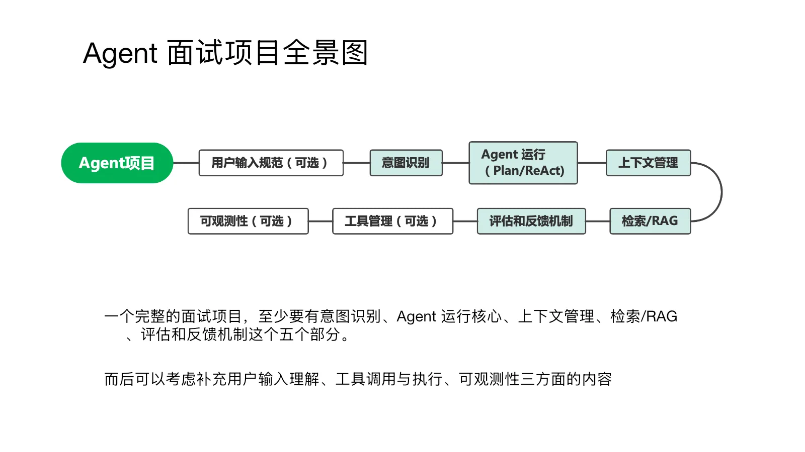
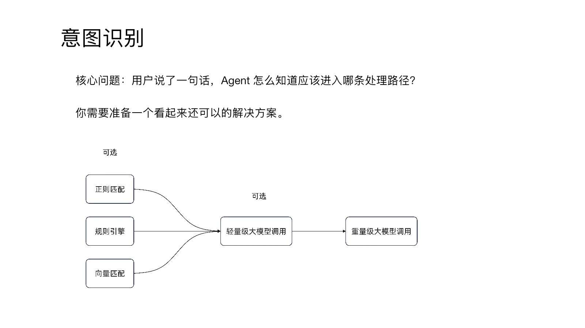
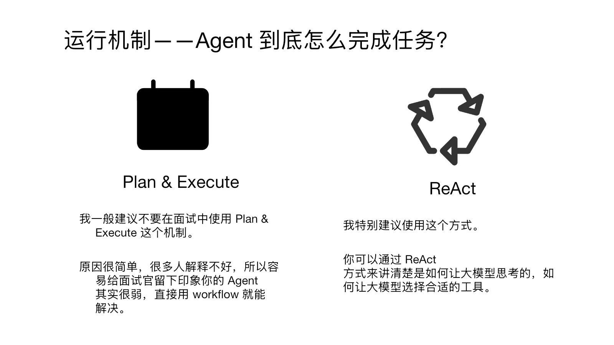
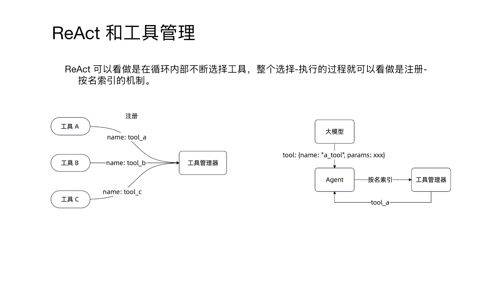
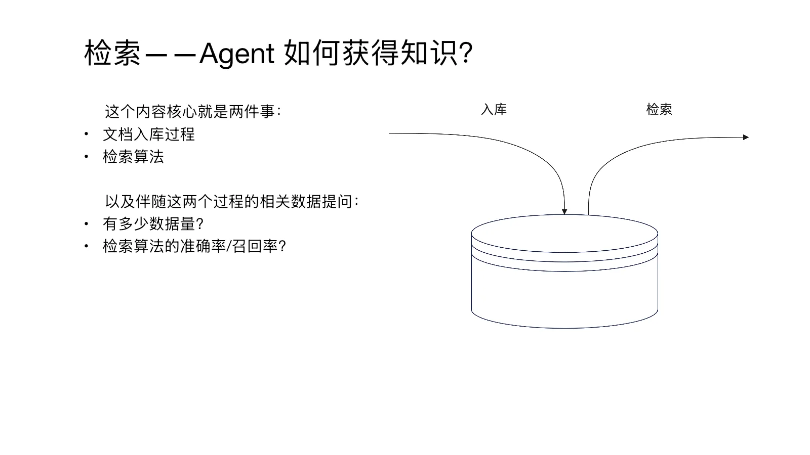
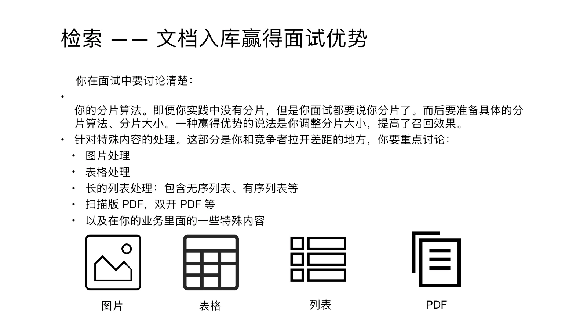
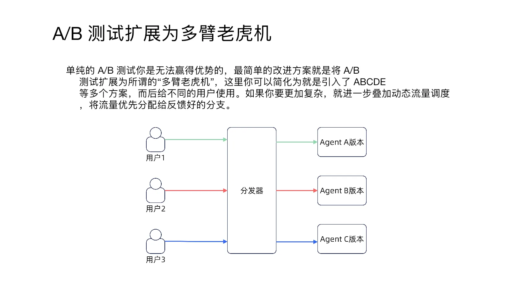
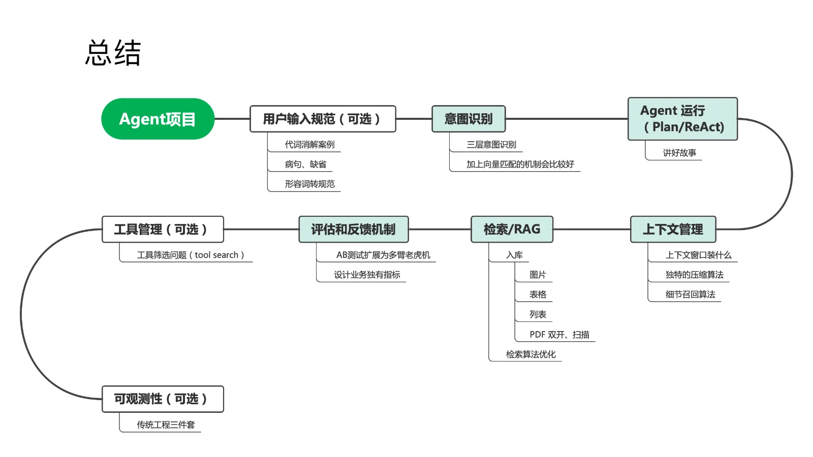

# 直播回放｜如何准备 Agent 面试项目：从调用大模型到完整的 Agent 工程体系
> 【直播时间】2026年 7 月 13 日
>
> 【分享大纲】
>
> Part 1：很多 Agent 项目没有面试竞争力的原因
>
> Part 2：Agent 面试项目的全景图
>
> Part 3：意图识别、运行机制、工具管理、上下文管理、检索、评估反馈，可观测

## 一、为什么很多 Agent 项目没有面试竞争力？

所以今天的核心议题是： **如何准备一个 Agent 面试项目。**

很多朋友现在还在做传统工程，并没有真实的 Agent 项目。今天我要教你们的，就是怎么按照一套思路，把一个 Agent 面试项目设计出来。具体细节，你们后面可以借助 ChatGPT、Claude Code 等工具继续补充完善，但整体思路可以参考今天这套方法。

当然，先要反思一个问题：为什么很多 Agent 项目没有面试竞争力？

### 1\. 业务场景过于简单

业务场景太简单，面试官听完以后就会觉得：这明明用 Workflow 就能解决，为什么要搞 Agent？你的 Agent 可能本质上就是一个 Workflow，根本不需要引入 ReAct 或其他复杂机制。

### 2\. 只有技术组件，没有运行机制

你只能介绍用了什么开源项目、用了什么技巧、具体怎样实现，却没有办法给面试官建立一幅完整的运行图景。对方听到的是一堆技术细节，却不知道这个 Agent 究竟怎么完成任务。

### 3\. 只有 Happy Path，没有异常处理

这不仅是 Agent 面试的问题，传统工程面试里大家也经常犯这个错误。你们还记不记得我讲后端工程师高阶面经时说过：面试时真正能赢得竞争优势的，往往是性能调优、问题排查和非功能性问题。正常的 Happy Path，谁感兴趣呢？

### 4\. 无法解释 Agent 为什么这样决策

这句话有两层含义：第一，你为什么把系统设计成这样；第二，Agent 为什么在当时决定这么做。

如果解释不清，面试官会觉得你只是调用了一下大模型，并没有真正理解 Agent，也没有真正理解业务。

### 5\. 没有评估与反馈闭环

绝大多数小伙伴面试时最怕什么？数据题。

传统工程会问响应时间、错误率、超时率，再问这些数据有没有问题、问题怎样解决。到了 Agent 面试，这类问题只会被进一步放大。

你只要说“这个地方做得很好”，面试官一定会追问一句：“你怎么知道？”如果没有提前准备评估与反馈闭环，你的讲述就没有证据支撑。

所以，如果你不知道怎样准备 Agent 面试项目，今天的分享就比较适合你。

## 二、Agent 面试项目的全景图

一个 Agent 面试项目究竟要准备哪些内容？看这张图就行。

我把它分为五个必选部分和三个可选部分。

五个必选部分是：

1. 意图识别；

2. Agent 运行核心；

3. 上下文管理；

4. 检索 / RAG；

5. 评估与反馈机制。

只要面试聊到 Agent，这五个部分你都应该提前准备好。

三个可选部分是：

1. 用户输入理解，也可以叫用户输入规范；

2. 工具调用与执行，也就是工具管理；

3. 可观测性。

为什么说它们可选？因为相比前五个部分，面试里问得没有那么频繁。不过，可观测性从 2025 年底到 2026 年初开始明显升温，这个趋势值得注意。

## 三、意图识别：Agent 怎么知道该走哪条路径？

意图识别解决的核心问题是：用户说了一句话，Agent 怎么知道应该进入哪条处理路径？围绕这个问题，你需要准备一套看起来还可以、能够解释的方案。

### 1\. 一套三层意图识别方案

我给大家一个很通用的方案。完整方案可以分成三层。

第一层是代码层面的意图识别，不调用大模型。可用的方式包括关键词匹配、规则引擎和向量匹配等。第一层是可选的，但加上之后，方案会显得更完整。

第二层是轻量级大模型调用。这里的轻量级模型，是指 mini、Flash 这类追求速度、能够快速响应、但不强调深度推理的模型。

第三层是重量级大模型调用，也就是把前两层无法判断的复杂输入交给深度推理模型。

最基础的方案，可以只有一次重量级大模型调用。面试官通常会问 Prompt 怎么写：无非是列出候选意图，说明什么情况下选择、什么情况下不选择，再加入一些 Few-shot 示例。

如果想让方案更高级一点，可以在前面加入轻量级模型。为什么？为了速度。领域 Agent 中，用户在多轮对话里通常不会轻易改变主意图：第一轮要求售后退款，第二轮大概率还在讨论退款。除非出现复杂的指代消解或意图切换，否则轻量级模型已经可以处理得不错。

轻量级模型还可以做微调。现在一些云平台提供可视化微调功能，准备数据、设置参数、提交训练就能完成。你在面试时就可以讲清楚：准备了什么数据，设置了哪些参数，微调之后解决了什么问题。

如果还想更进一步，就在最前面加入代码层面的识别，我比较推荐向量匹配。于是整个方案就变成：

> 代码 / 向量匹配 → 轻量级模型 → 重量级模型

它可能有一点过度设计，但作为面试方案会比较完整。你可以根据自己的掌握程度选择：最基础的是重量级模型；再好一点是加入轻量级模型；再往上是微调轻量级模型；完整版本则在前面再加一层代码或向量匹配。

### 2\. 数据准备比方案本身更容易被追问

意图识别方案讲完以后，还要准备数据。比如：

- 意图识别准确率是多少？

- 这个准确率是怎样采集和计算出来的？

- 准确率太高或太低时，怎样解释？

- 还能怎样优化？

- 横向对比其他方案，你做得怎么样？

比如你说 Top 1 准确率是 95%。从实践来看，这个数字已经不低了。如果面试官质疑为什么这么高，可以解释：这是一个领域专属 Agent，业务范围没有那么发散。客服、售后、售前推荐、金融咨询等垂直场景，用户输入通常围绕明确的领域，不会无限发散，所以准确率能够做到相对较高。

这里有一个通用的连问：

> 你的数据是多少？怎么计算的？怎么采集的？

Agent 里面几乎所有数据都可能被这样问，你一定要扛得住。

如果面试官问“还能怎么优化”，一个简单技巧是：完整方案假设有 10 分，你先讲已经落地的 8 分，把剩下 2 分作为下一步优化。例如，现在只有两层，就把第三层作为优化；还没有微调，就把微调作为下一步。但不要把未实施的方案说成已经做完。

至于横向对比，我不建议过度拉踩别人的方案。轻微比较可以，太过头会显得很讨厌，面试官反而可能往死里追问你。

## 四、可选亮点：用户输入规范

用户输入规范和意图识别，实践中经常是一体两面。你可以在一次大模型调用里，同时完成输入规范和意图识别。

这个点为什么在面试中好用？因为讨论它的人还比较少。面试官很少遇到候选人主动讲，候选人自己也不太容易想到，所以你讲出来通常会有一定区分度。

我给大家三个可用方向。一般选择其中一个讲透就够了。

### 1\. 代词与指代消解

准备一个案例，讲你怎样解决“他”“它”“第一个”“第二个”等指代问题。

比如社交类 Agent 可以维护人物表；涉及大量人物和物品的上下文，可以维护实体表，记录所有人和物，再借助实体表进行指代消解。

### 2\. 病句和缺省信息补全

准备一个案例，说明怎样纠正和补全用户句子，尤其是结合上下文补全缺失的主语或宾语。你可以讲之前为什么推测错了、产生了什么后果，后来怎样改进、改进后有什么变化。

### 3\. 把形容词转化为评判标准

我非常建议大家使用这个方向，因为形容词太常见了。

很多 Prompt 会写“选择一个好的”“推荐一个优秀的”“找一个有性价比的”，问题是没有量化标准。什么叫好？什么叫有性价比？

你可以维护一套领域专属的形容词词表。一旦识别到这些词，就触发规则转换，把模糊的形容词变成明确标准。

例如，用户要求推荐“有性价比的衣服”，你可以把“有性价比”解释成：同样价格优先选择材料更好或品牌更可靠的；同样质量优先选择价格更低的；或者在特定预算下优先国产而非进口。这个标准还可以继续进入 ReAct 思考和工具检索。

用户天然会使用很多模糊形容词，不会主动给你明确的工程标准。你要做的，就是把这些词解释清楚。这个点既容易落地，也容易在面试里讲深。

## 五、运行机制：Agent 到底怎样完成任务？

前面解决了用户输入和意图识别，接下来要讲：识别意图以后，Agent 究竟怎样实现用户目标？这就是运行机制。

### 1\. 为什么更推荐 ReAct？

从面试角度，我建议大家谨慎讲 Workflow。你一旦把自己的 Agent 说成固定 Workflow，面试官很容易质疑：既然流程固定，为什么还需要 Agent？

Plan & Execute 也不是不能用。你如果能把计划、重规划和回溯讲清楚，它会很强。但很多人的表达能力不够，讲着讲着就退化成 Workflow。所以我更推荐 ReAct。它本质上是一个循环，你可以借助这个循环讲清楚：大模型怎样思考，怎样选择工具，怎样根据结果继续决策。

### 2\. 准备一个多轮对话故事

ReAct 怎么讲？记住一句话： **准备一个故事，讲清楚循环究竟是怎么循环的。**

这个故事至少要覆盖以下过程。

#### 第一步：根据意图加载不同的思考方式

比如用户说：“给我推荐一条裤子。”意图识别应该能够判断，这是商品推荐。

商品推荐和售后服务的思考过程明显不同。商品推荐要考虑预算、偏好、款式；售后服务要先确认哪个订单、是退款还是退货。你可以说：系统根据意图加载不同的思考 Prompt，或者路由到不同的子 Agent。

#### 第二步：根据上下文补全缺失信息

推荐裤子，至少要知道预算和用户偏好。三百块、五百块、一两千块，推荐结果肯定不一样；有人喜欢牛仔裤，有人喜欢休闲裤，有人因为工作必须西装革履，也完全不一样。

Agent 思考后发现用户没有提供预算，用户画像也没有加载出来，于是做出决策：调用工具加载用户画像，同时向用户追问预算。

经过几轮迭代，信息补齐：用户喜欢牛仔裤，预算大约三百元。

#### 第三步：先生成业务规格，再真正执行

真正调用商品服务之前，我建议先生成一份规格说明或清单。清单里可以列出：

- 预算：300—500 元；

- 类型：牛仔裤；

- 颜色：深蓝、黑色等；

- 材料：氨纶、莫代尔等；

- 品牌偏好；

- 必须满足和可以放宽的约束。

然后把清单转换成商品服务的检索请求。注意，电商场景里通常不是直接去 ES 搜商品，而是调用商品服务提供的 SKU / SPU 搜索接口。拿到结果后，再选择相关性较高的几个商品返回给用户。

业务还可以更复杂，例如投流或广告商品可能轻微突破预算约束。这个是否合理，要由具体业务规则决定。

#### 第四步：模拟用户不满意后的第二轮

一定要讲多轮对话。没有多轮，面试官很容易说：“这不就是 Workflow 吗？”

假设 Agent 推荐了三条裤子，用户回答：“我比较喜欢第一条，但价格太高，能不能推荐更有性价比的？”

第二轮里，Agent 不需要重新加载已经存在的用户画像，也知道预算和前一轮推荐结果。它只需要理解新的约束——“更有性价比”。这里正好可以和前面的用户输入规范结合：同品牌、同材质但更便宜，或者同价格但材质和品牌更好。

Agent 更新推荐清单，重新调用商品接口，并把上一批商品 ID 作为排除条件，避免重复推荐。

如果用户第三轮说：“我很喜欢第三条，我要买。”系统就识别出意图由推荐切换成下单，创建订单并引导支付。

如果记不住复杂版本，就记住简化版：

1. 意图识别；

2. 补全参数；

3. 执行业务；

4. 用户反馈；

5. 根据反馈重新运行。

用故事讲 Agent 运行机制，面试官很容易在脑中建立清楚的运行图景，比干巴巴地解释 Thinking Prompt 好得多。不好解释的技术，就用一个具体故事讲给面试官听。

## 六、工具管理：工具多了以后，Agent 怎么选？

ReAct 很自然地和工具管理混在一起。不过，如果你的 Agent 很简单，工具管理可以不重点展开，所以它属于可选项。

最基础的工具管理，就是“注册—按名索引—选择—执行”。

系统先在工具管理器中注册工具；运行时，大模型输出要使用的工具名称和参数；系统找到对应工具，执行以后再把结果返回给大模型。LangChain 等框架在初始化 Agent 时传入工具，本质上也是类似机制。

这个基础流程本身没有太多亮点。真正容易拉开差距的问题是： **工具很多时，怎样筛选？**

现实中，有些大型 Agent 的确可能有几十个甚至几百个工具。工具粒度切得很细以后，不可能每轮都把全部工具描述塞进上下文，让模型从中盲选。数量太多会占用窗口，也会降低选择准确率。

我给大家三个简单、好用的方案。

### 1\. 按照意图分配工具

有些工具和意图强绑定，只在特定意图下使用。例如退款、退货工具只会出现在售后流程，不会出现在商品推荐流程。

可以把工具分为通用工具和意图专属工具。用户画像加载工具可能是通用的；退款、订单取消、换货等则属于售后专属。识别意图以后，只把“通用工具 \+ 当前意图专属工具”交给模型。

假设系统有七八十个工具，分配后每轮只传一二十个，工具选择准确率通常会明显改善。

### 2\. 按照标签分配工具

为工具增加标签，例如订单、售后、搜索、用户画像等。大模型先判断当前需要哪类工具，系统根据标签筛出候选集合，再让大模型从候选中选择真正要调用的工具。

### 3\. 结合搜索筛选工具

把工具描述和适用场景放进 ES 或向量数据库，通过关键词或向量检索找候选工具。

注意，如果工具描述中同时包含“适用场景”和“不适用场景”，检索时要谨慎处理“不适用场景”。处理不好，搜索反而可能把不该使用的工具选出来。

完整流程是：大模型先生成标签或搜索条件，Agent 到工具管理器或搜索系统中取回候选工具，再把候选集交给大模型完成最终选择。这和现在常说的 Tool Search、渐进式加载有相似之处。

还需要准备数据：候选数量从多少降到多少，准确率如何变化，数据怎样测得。不能只说“显著提升”，却没有测试依据。

## 七、上下文管理：不要只会讲“短期记忆、长期记忆”

上下文管理在面试里不太好讲，原因是很难证明自己做得特别好。

我在专栏里有一个“暴论”： **记忆系统并不是一个特别好用的词。** 很多时候，给大家解释短期记忆、长期记忆、不同层次记忆，反而很费劲。你不如统一把它们看作 Context Item，也就是上下文内容。

准备上下文管理，要从几个维度交叉展开。

### 1\. 上下文里有什么？

可以参考短期记忆和长期记忆的划分，但不需要穷举所有内容，只列出几个典型项。

短期内容可能包括：

- 当前多轮对话；

- 已加载的用户画像；

- 当前任务状态；

- 用户明确提出的硬约束。

例如，用户说“我只要牛仔裤，不要推荐休闲裤”，这就是当前任务的硬约束。

长期内容可能包括长期用户画像、历史偏好、过去的关键行为和跨会话信息等。某些内容在短期和长期存储中都可能存在一份，只是用途和更新方式不同。

### 2\. 每一项怎样存储、怎样查找？

其实没有那么多花里胡哨的选择：内存、Redis、数据库、ES、向量数据库，大体就是这些地方。

- 内存和 Redis 通常使用 Key-Value、List、Hash、Set 等结构；

- 用户画像经常存储在 MySQL 等数据库中，通过用户 ID 查询；

- 对话细节、历史事件或语义相似内容，可以使用 ES 或向量数据库检索。

你要讲清楚：这个 Context Item 放在哪里，什么时候写入，什么时候查找，依据什么条件找回来。

### 3\. 是否压缩？压缩后怎样召回细节？

理论上所有上下文内容都可以压缩，实践中没有必要全部压缩。

例如，“用户只要牛仔裤”已经是一句很短的硬约束，再压缩也没有意义。真正经常需要压缩的是长对话：用户输入一段，模型输出一段，多轮以后内容会越来越长。

压缩之后，怎样在需要时把细节找回来，是上下文管理的核心问题之一。尤其是跨会话的细节召回，现在很多产品做得并不理想：今天聊过理财，明天新开一个窗口继续聊，系统很可能已经不记得昨天的关键内容。作为用户，你会觉得它一点都不懂你。

如果面试的是更高阶岗位，还可以讨论两个问题：

- **时效性**：某条信息有没有过期时间？多久以后可信度下降？

- **冲突裁决**：用户前后输入矛盾时听哪一个？例如一会儿说不要牛仔裤，一会儿又说要牛仔裤，怎样判断最新意图和约束优先级？

### 4\. 三种容易形成亮点的设计

上下文管理要赢得竞争优势，可以选择以下三种思路。用一种讲透就可以，三种全部叠加会显著提高复杂度。

#### 思路一：设计动态的窗口装载算法

假设模型窗口是 128K，但全部上下文加起来有 1024K。什么放进去，什么不放？放原文、摘要，还是摘要的摘要，也就是索引？这需要一个动态选择机制。

例如：

- 剩余窗口充足时，优先放原文；

- 窗口已经使用一半时，开始放摘要；

- 接近上限时，对现有内容重新压缩；

- 窗口满了以后，淘汰价值较低的内容，换入当前任务更关键的信息。

实现上可以抽象成 Strategy：不同窗口状态调用不同策略，每个策略决定怎样将内容装入模型窗口。

这套说法比单纯讲“滑动窗口”更完整，也比较容易体现系统设计能力。

#### 思路二：设计多级压缩算法

压缩不是简单对模型说“帮我总结一下”。至少要给出明确规则：哪些内容必须保留，哪些可以省略，哪些数字、实体和约束不能丢。

还可以设计不同压缩级别：

- L0：原文；

- L1：初步压缩；

- L2：中等压缩；

- L3：极致压缩；

- L4：一句话索引。

剩余窗口越少，使用的压缩级别越高；当前步骤与某段内容的相关性越低，也可以使用更高压缩级别。

我自己实践中做过类似的三级结构，有时候确实是“大炮打蚊子”，实际使用频率没有想象中高。但从面试表达上，它能够说明你思考过摘要规则、信息损失和窗口预算，不只是随手调用一次模型。

#### 思路三：设计细节召回算法

细节召回既能证明上下文管理做得好，也可以和后面的检索 / RAG 形成组合。核心是：先用摘要或索引判断哪些历史内容可能相关，再回到原文或更细粒度的片段中检索细节。

### 5\. 上下文相关的数据问题

上下文数据在面试中问得相对少，但也要有心理准备：

- 大模型窗口多大？

- 平均使用多少？

- 压缩比是多少？

- 细节召回准确率怎样？

注意，模型支持 128K，不代表每次一定要塞满 128K。上下文越长，推理效果可能越差：更容易忽略细节、产生幻觉，甚至忽略系统 Prompt 中的硬约束。

所以不是放得越多越好。具体应该使用多少，要由任务和评测决定。直播里我给过“50% 左右”这种相对稳妥的面试说法，但实践中 20%、30%、70% 都可能合理。真正站得住的答案，仍然是结合任务复杂度、成本、延迟和评测数据说明，而不是死记一个比例。

## 八、检索 / RAG：文档怎样入库，知识怎样找到？

检索通常可以理解成 RAG，但 RAG 只是其中一种常见实现。面试中至少要准备两个过程：

1. 文档入库；

2. 检索算法。

同时还要准备与它们相关的数据：数据量有多大，检索准确率和召回率是多少。

一定要把入库和检索两个过程都讲清楚。有些面试官会重点问入库，有些会重点问检索，缺一不可。

### 1\. 文档入库：分片与特殊内容处理

第一个问题是分片。即使你的原始项目很简单、文档可以直接入库，也应该理解分片的意义、适用条件、分片大小和边界策略。不要只说“我分片了”，要解释为什么需要、怎样分、分片以后效果发生了什么变化。

这里直播里的原话很直接：“我不管你实践有没有分片，你出去面试都得有分片。”我还拿传统工程类比：工作几年以后，面试项目里经常会被期待讲微服务、分库分表，本质上是在迎合市场对项目复杂度的预期。

这也是整个分享里最有争议的一类表达。它准确反映了我的面试辅导思路，但从整理稿的角度仍然要把边界写清楚：你可以为了学习而补做分片方案，也可以说明自己为什么设计了分片实验；没有做过的内容如果直接说成生产实践，一旦被追问实现和数据，很容易穿帮。

第二个问题是特殊内容处理，这是更容易拉开差距的地方：

- 图片；

- 表格；

- 长列表，包括有序和无序列表；

- 扫描版 PDF；

- 左右双栏 PDF；

- 业务中特有的复杂内容。

图片和表格不一定需要发明独特算法，但要能讲清处理链路。

例如图片可以先 OCR，再让多模态模型生成摘要，把原图上传到 OSS 获得 URL，最后在原文位置放入摘要和图片引用。流程图、状态图则可以让模型按节点和步骤进行结构化解释，再把结构化文本用于检索。

这类能力在 2026、2027 年可能还是加分项。继续卷下去，到了后面可能会变成基本操作：讲不出来扣分，讲出来也不再额外加分。所以窗口期确实存在，越晚转型，要求通常越高。

### 2\. 检索算法怎样形成亮点？

从零发明一个真正有效的新检索算法，其实很难。实践中设计过几个新方案，最后效果可能也没有好到哪里去。

面试里可以从两个方向准备。

第一个方向，是设计有业务特点的混合检索机制。例如在多路召回中加入权重，或者组合 BM25、稀疏向量、稠密向量等多路结果，再设计重排和融合策略。

但不要为了“三路、四路、五路”而盲目增加路数。真正要回答的是：新增的一路解决了什么漏召回问题，怎样融合，效果是否经过测试。

第二个方向，是优化现有检索算法。所有检索算法或多或少都有参数，例如 Top K、相似度阈值、分片大小、重排候选数、融合权重等。你可以讲清楚参数从 A 调到 B 后，为什么可能带来改善。

## 九、评估与反馈：准备线下、线上两套机制

准备 Agent 面试方案时，要有线下和线上两套评估与反馈机制。这是一套可以复用到多数 Agent 项目中的基础框架。它未必能让你形成巨大优势，但至少不会在这个环节拖后腿。

### 1\. 测试开发阶段：线下评估

最重要的是测试集。理论上，任何关键环节都可以建立测试集：

- 怎样知道意图识别效果好？因为有意图识别测试集；

- 怎样知道检索效果好？因为有检索评测集；

- 怎样知道优化是正向优化而不是负向优化？因为有改动前后的回归结果。

第二种方式是手工评估。受制于人力成本，通常只能在关键环节或抽样场景中进行。

有些领域还需要专家评估，而且会非常贵。例如金融 Agent 需要金融专家，教育 Agent 可能需要阅卷或学科专家。专家按天计费，成本可能相当高，所以不能把专家评估当成可以无限使用的资源。

第三种方式是 LLM as Judge。它的优势是覆盖范围广，可以对大量测试用例进行自动评估。但 Judge 本身也需要校准，尤其要关注评价标准、稳定性和与人工判断的一致性。

### 2\. 线上运行阶段：抽样、反馈和实验

线上数据量通常很大，人工评估和 LLM as Judge 都不一定适合全量执行，可以进行抽样，优先查看用户反馈差、模型低置信度或出现异常的样本。

用户界面可以提供点赞、点踩，并通过适当奖励提高用户参与热情。

A/B 测试也是常见方法。可以测试两个 Agent 全流程，也可以只测试其中某个环节，甚至只测试两个 Prompt 版本。这本质上是实验粒度的问题。

线上 LLM as Judge 可以在低峰期批量运行，调用批处理接口以控制成本。如果业务规模足够大，也可以和模型服务商沟通批量调用价格。

### 3\. 从 A/B 测试扩展到多臂老虎机

单纯说 A/B 测试比较常规，不容易形成亮点。一个扩展思路是多臂老虎机。

简化理解，可以同时准备 A、B、C、D、E 多个方案，分配给不同用户。如果再进一步，就加入动态流量调度：哪个分支反馈更好，就逐步向它倾斜流量。

例如 A 分支持续获得更多点赞，系统就慢慢提高 A 的流量占比，最终可能把大多数流量切到 A。但如果你声称使用了真正的多臂老虎机，就要理解探索与利用、流量分配和收敛条件，不能只把“多版本测试”换一个名字。

面试官还可能追问：A/B 究竟测试什么？答案可以是整条 Agent 流程，也可以是检索策略、某个步骤或某个 Prompt。要结合你真实做过的实验回答。

### 4\. 设计业务独有的指标

这个点很适合后几轮面试，尤其是总监或 CTO 面，因为它同时体现业务理解和技术理解。业务指标必须足够合理，最好有一定创新性。

- 商品推荐 Agent 可以使用最终下单率或转化率。比如推荐十次，最终产生两次购买，转化率是 20%。但 20% 往往已经非常高，具体数字必须结合业务基线判断。

- 社交类 Agent 可以使用“接话率”：Agent 回复后，用户是否继续围绕这条回复往下聊。像打乒乓球一样，有来有回，说明回复真正推动了对话。

- 情感陪伴类 Agent 还可能设计情绪改变率或情绪向好率，不过这类指标怎样安全、准确地采集和评测，需要更加谨慎，尤其涉及心理健康场景时不能随便下结论。

指标设计完以后，一定要回答：

1. 指标怎样采集？

2. 指标怎样计算？

3. 当前数值是多少？

4. 这个数值是否合理？

例如 Agent 推荐了商品 A，但用户没有从 Agent 页面直接下单，而是后来从正常商品页购买，怎样判断这次购买受到了推荐影响？可以设计归因窗口：推荐后的 24 小时内，只要用户购买了同一商品，就计为一次有效推荐。这和广告归因有相似之处。

不要只设计一个看起来高级的指标，还要把采集、归因和合理区间讲清楚。

## 十、可观测性：沿用传统工程三件套

可观测性在 Agent 面试中还不算最热门，但已经开始出现。我的建议是先沿用传统工程思路：Logging、Metrics、Trace。

### Logging

日志可以记录：

- 每个步骤的执行信息；

- 工具调用的输入和输出；

- 模型请求和结果摘要；

- 异常、重试和降级路径；

- 任何对问题定位有帮助的关键状态。

### Metrics

可以参考 RED，也就是 Rate、Error、Duration：

- 工具调用次数、响应时间、错误率、超时率；

- 大模型首字符响应时间和整体响应时间；

- Agent 面向用户的总响应时间；

- 任务完成率、循环次数和失败率。

大模型响应时间和 Agent 响应时间不是一回事。前者是一次模型调用的耗时，后者是用户输入到最终回答之间整条链路的耗时，不要搞混。

### Trace

Agent 同样可以建立 Trace：

- 每个步骤是一个 Span；

- 每次工具调用是一个 Span；

- 每次大模型调用是一个 Span。

如果觉得只讲传统工程三件套不够贴近 Agent，也可以介绍 Langfuse 等专门工具，说明它帮助你解决了哪些问题。工具名称本身不是亮点，怎样通过 Trace 定位一次真实故障才是。

## 十一、总结：完整项目与面试亮点

最后总结一下，你的 Agent 项目应该包含哪些内容。

五个核心部分：

1. 意图识别；

2. Agent 运行核心；

3. 上下文管理；

4. 检索 / RAG；

5. 评估与反馈机制。

三个可选部分：

1. 用户输入规范；

2. 工具管理；

3. 可观测性。

对应的亮点可以这样准备：

- **用户输入规范**：代词消解、病句与缺省补全、形容词标准化，三选一讲透；

- **意图识别**：代码 / 向量匹配、轻量级模型、重量级模型的多层机制；

- **Agent 运行**：讲好一个包含多轮对话、参数补全和用户反馈的 ReAct 故事；

- **工具管理**：按意图、标签或 Tool Search 筛选大量工具；

- **上下文管理**：窗口装载算法、多级压缩、细节召回；

- **检索 / RAG**：文档入库、特殊内容处理、混合检索和参数优化；

- **评估与反馈**：测试集、LLM as Judge、实验机制和业务指标；

- **可观测性**：Logging、Metrics、Trace，以及真正定位过的问题。

我今天讲的是怎样设计和表达一个 Agent 面试项目，不是完整地教大家从零实现生产级 Agent。你们出去面试时，最好同时准备一个传统工程项目和一个 Agent 项目。

直播里我说了很多“捏项目”“包装”“糊弄面试”之类的话，这就是我的说话风格，也来自我过去辅导学员的经验。我当时甚至直接说：“你有没有做过 Agent 不重要。去年到现在，我给好多个同学无中生有捏过 Agent 项目，或者把一个很垃圾的项目捏成看得过去的项目。现在很多面试官不具备辨别和打假能力。”

说完我自己都觉得：“这显得我好猥琐。”还开玩笑让大家出去不要说是我教的，“日后徒儿惹出祸端，只要不说我是你的师傅就可以了。”这些原话就保留在这里，不替讲师粉饰。

但大家也要明白：面试官最终追问的是你的理解、实践、数据和取舍。你如果只是把八股文背下来，没有亲手做过，碰到真正懂行、具备打假能力的面试官，风险仍然很高。