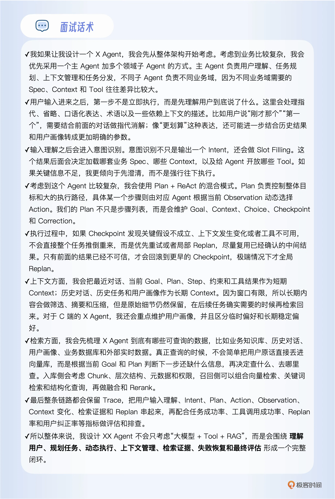

# 结束语｜如何设计一个具体领域的 Agent？
你好，我是大明。

到这里，专栏最核心的内容已经全部讨论完毕。终于来到最后一讲，我还想再多叮嘱几句 —— 学习这个专栏的小伙伴，有些是刚毕业的学生，还有很大一部分是希望转型 Agent 的初、中级软件工程师。所以在结束语里，我想继续强调一个问题：如果让你设计一个具体领域的 Agent，你会怎么做？具体的面试“骨架”是怎样的？这道题让不少小伙伴折戟沉沙，非常值得在课程最后再串一遍。

前面二十多讲已经把相关知识详细展开过，这一讲我们要做的是把它们串联起来，整理出一套通用的回答框架，确保你能从容应对。就像开考前老师划重点一样。先明确一点： **不同级别、不同目标薪资，回答的复杂度必然不同。**

如果你是初级工程师，能把“大模型 \+ Tool + RAG”讲清楚，基本就够用了。但如果面试的是高级工程师及以上岗位，就必须体现出 Agent 的工程复杂度。下面这套回答框架偏向高级工程师及以上版本，你可以根据自己的项目经历做相应删减。

## 先定整体架构：优先考虑多 Agent 协作

如果面试官没有明确表达不喜欢多 Agent，也不是一个明显简单到一句 Prompt 就能搞定的场景，那么你可以优先设计 **主 Agent + 多个领域子 Agent 架构模式。**

主 Agent 负责用户理解、任务规划、上下文管理和任务调度；子 Agent 根据业务拆分，例如检索 Agent、推荐 Agent、售后 Agent、执行 Agent 等。

我可以明确说，在实践中我不太推荐什么多 Agent 协作架构，但是面试就是喜欢多 Agent 架构。正如同在互联网里面，我也不建议搞微服务，但是架不住面试官就喜欢微服务。而且你可能还要给出一个为什么用多 Agent 架构的解释：不同业务域需要的 Spec、Context 和 Tool 差异比较大，所以通过子 Agent 做隔离。

说清楚这一点就够了，不要继续展开架构细节。

## 第一站：先听懂用户到底在说什么

接着你介绍在 Agent 里面收到用户输入之后，不要马上开始执行，要先处理用户输入规范化，包括：

- “这个”“那个”“第一个”的指代消解；

- 省略信息补全；

- 口语、病句、黑话、缩写；

- “更划算”“更高级”“最近”这种需要进一步解释的表达。

这里最适合埋一个面试钩子，比如说“我们还专门处理过跨多轮指代，以及性价比这种需要结合上下文、用户画像甚至工具结果才能量化的表达。”说到这里停下来。面试官如果追问，你再展开前面的内容。

## 第二站：意图识别不能只是调用一次大模型

用户输入理解之后，你要说 Agent 需要考虑做意图识别，当然你也可以说做目标识别。也就是理解用户的目标。重点不在于介绍你用了什么模型，而是告诉面试官 **意图识别决定后续加载什么 Spec、组织什么 Context、开放什么 Tool，以及进入什么业务流程。**

输出也不要只有一个 Intent，要说是一个结构化的输出，至少包括意图以及意图所需的参数。缺参数就澄清，系统不支持就拒识，不要什么输入都强行往某个意图里面塞。

如果你想刷一个亮点，可以提一句意图特别多的时候，不要全部塞给大模型，而是先召回候选意图，再做最终识别。然后等面试官追问。

## 第三站：复杂任务使用 Plan + ReAct

在面试中我建议你使用 Plan + ReAct 的混合形态，比较复杂，在面试中好展开。你要记住，没有简单的 Agent，如果你的 Agent 很简单，那就说明你没有深入思考。

这部分你要说 Plan 决定总体目标、任务步骤和依赖关系；执行到具体步骤之后，再让对应 Agent 根据当前 Observation 动态选择 Action。然后顺手带出专栏中的 G4C：

> Goal、Context、Choice、Checkpoint、Correction。

但是不要重新解释五个词。只需要告诉面试官的Plan 不是一个简单步骤列表，而是一个能够检查和纠偏的运行时对象。这句话已经够用了，剩下的如果面试官追问你再回答。

## 第四站：有 Plan，就一定要提 Replan

这是非常值得主动补的一句话。你要告诉面试官Plan 执行过程中如果上下文发生变化、关键假设不成立、工具不可用或者 Checkpoint 没通过，会进入 Correction。但 Correction 不等于马上重新生成整个 Plan。

你要优先Retry ，而后考虑当前步骤调整，再考虑局部 Replan ，实在不行则考虑回滚 Checkpoint，逼不得已全局 Replan。这样能够体现你对长任务的理解。

如果还想展现亮点，可以补一句对严重依赖外部工具的关键步骤，你会考虑先做最小化 Try，确认关键依赖成立之后再正式扩大执行。不要主动把 TCC 全讲完，等面试官追问。

## 第五站：一定要提上下文管理

如果你的 Agent 已经讲到了 Plan、ReAct 和多轮执行，还完全不谈 Context，那就会显得非常奇怪。这里不需要重新介绍整套上下文理论，你只需要结合业务举例。例如短期 Context 可能有最近对话、当前 Goal、Plan、Step、约束、工具结果。长期 Context 可能有历史对话、历史任务、用户画像、长期事实。

而后补充说明上下文不能无限塞，所以会做筛选、压缩和摘要；原始细节仍然保留，需要的时候再召回。这样就把上下文管理、摘要和细节召回全部带到了。

### C 端 Agent，尽量主动提用户画像

如果是电商、教育、社交、内容推荐之类的 C 端 Agent，我建议你尽量主动提用户画像。但是不能直说我记录用户喜欢什么，你要高级一点，比如说谈到用户画像，会区分短期偏好和长期稳定偏好，不会因为用户偶尔说了一句话就永久修改画像。

这句话非常适合引导面试官继续追问怎么区分临时性偏好和永久性偏好修改。接下来你就可以进入准备好的用户画像内容。

## 第六站：检索要同时讲“有什么数据”和“怎么查”

讲 RAG 的时候，不要直接开始背Embedding 、向量库、Top-K 和 Rerank。你要先结合XX Agent 说明它能查询哪些东西。例如业务知识库、历史对话、用户画像、业务数据库、实时状态、外部搜索、历史任务结果。然后说明你的核心思想： **不是把用户原话直接拿去搜，而是根据当前 Goal 和 Plan 判断还缺什么信息，再决定查什么、去哪里查。**

最后简单补充入库侧会处理 Chunk、层次文档、元数据和权限；检索侧使用向量、关键词、结构化查询、多路召回和 Rerank。差不多就够了，真正的 RAG 细节等面试官追问。

## 最后一句带过可观测性

可观测性一般不是这道题的核心，所以一两句话结束。你可以说整条链路会有 Trace，把 Intent、Plan、Action、Observation、Context 变化、检索证据和 Replan 串起来，同时采集任务成功率、工具成功率、Replan 率、用户纠正率等指标。

这样面试官至少知道你的 Agent 不是一个黑盒。

# 最终通用话术模板

下面这一段才是这一讲最重要的东西。你可以把 **X** **X** **Agent** 替换成电商 Agent、营销 Agent、客服 Agent、保险 Agent、教育 Agent 等任何业务。

如果面试官听完还觉得不太理解，你就可以参考我在 ReAct 部分总结的内容，你讲一个故事，将这些都串起来，就基本没有破绽了。

## 最后：不要只准备答案，要准备证据

这套模板只是骨架，不能代替项目经验。面试前，你至少要准备一个完整案例，并能回答下面这些问题：

01. 用户要完成什么任务？

02. 最初采用了什么方案？

03. 这个方案在哪里失败了？

04. 你用什么数据证明它失败了？

05. 为什么选择现在的架构？

06. 你放弃过哪些替代方案？

07. 当前方案增加了什么成本和风险？

08. 工具失败或用户改需求时，系统如何恢复？

09. 你怎样评测它是否真的变好了？

10. 如果重新做一次，你会改变什么？

面试结束后，也要及时记录面试官追问了什么、自己在哪些地方回答得含糊、哪些判断缺少数据支持。

多参加几次面试，确实能帮助你了解市场要求。但更重要的不是摸清面试官“喜欢听什么”，而是逐渐发现自己哪里还欠缺。这才是从会背 Agent 概念，到真正具备 Agent 系统设计能力的分界线。

好了，这个专栏结束了，希望可以帮助你拿到自己想要的Offer，最后我准备了一份 [结课问卷](https://geekbang.feishu.cn/share/base/form/shrcnvygnxgypq6BTxjxlteATMf "xxx")，你可以花两分钟时间填写一下。

