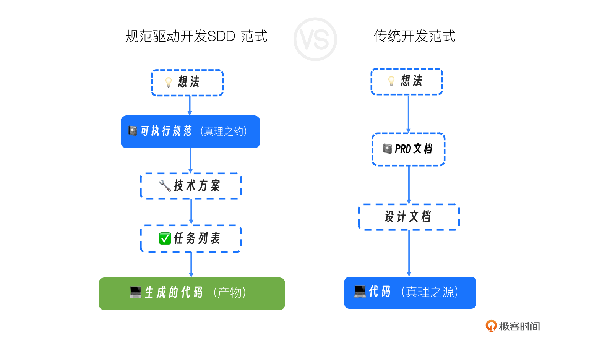
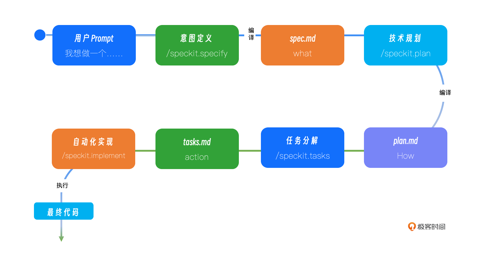
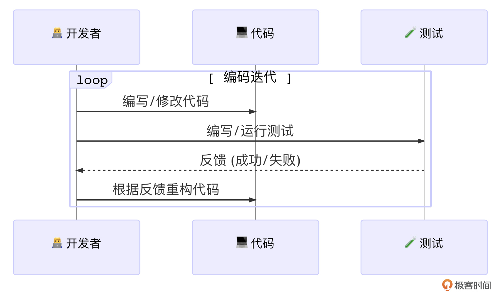
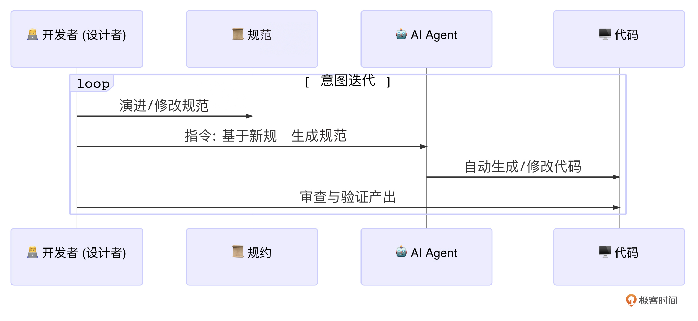

# 02｜核心引擎：AI原生开发第一性原理——规范驱动开发
你好，我是Tony Bai。

在上一讲，我们共同建立了一个“AI-开发者集成成熟度模型”，并清晰地描绘了开发者在AI原生时代的角色演进：从代码的生产者，转变为 **规范的设计者**、 **工作流的指挥家** 和 **质量的治理者**。

你可能会好奇，这三个新角色中，为什么“规范设计师”排在第一位？

答案很简单：在AI原生开发范式中，一份高质量的、可被机器精确理解的规范（Specification），是驱动整个开发工作流的起点和核心引擎。没有它，AI的强大能力就如同无的之矢，无法精准地作用于我们的工程目标。

所以，今天这一讲，我们将深入整个专栏最核心的方法论：规范驱动开发（Spec-Driven Development, SDD）。你将理解它为何是AI原生开发的“第一性原理”，并学会运用它的核心产物—— `spec.md`、 `plan.md` 和 `tasks.md`，将一个模糊的软件构想，一步步精确地“编译”成高质量的实现。

## 软件开发中“失落的翻译”问题

在深入SDD之前，我们必须先直面一个困扰了软件行业数十年的根本矛盾：意图（Intent）与实现（Implementation）之间的鸿沟。

在传统的开发流程中，我们是这样工作的：

1. 产品经理将业务构想，翻译成一份自然语言描述的PRD（产品需求文档）。

2. 架构师和开发者阅读PRD，进行“人脑编译”，将其翻译成技术设计文档。

3. 开发者再次进行“人脑编译”，将设计文档翻译成一行行具体的代码。

这个过程充满了“ **失落的翻译**”。每一次“翻译”，都不可避免地引入了信息的损耗、歧义和主观臆断。PRD中的一句“界面需要响应迅速”，到了开发者这里，可能被理解成“API响应时间小于500ms”，也可能被忽略。

更糟糕的是，这些文档（PRD、设计文档）与最终的“真理之源”——代码，是 **完全脱节** 的。一旦项目开始迭代，代码飞速演进，而文档却被遗忘在角落，迅速腐烂，变成“代码考古”的障碍。

几十年来，我们发明了敏捷、Scrum、UML等无数方法和工具，试图弥合这条鸿沟，但收效甚微。因为我们始终默认了一个前提： **文档是代码的“指南”，而代码才是“真理”**。

而AI时代的到来，给了我们一个彻底颠覆这个前提的机会。

## 权力的反转：当规范成为“真理之源”

规范驱动开发（SDD）的核心思想，可以用一句话来概括： **实现一次“权力的反转”**。

在SDD范式中，不再是文档服务于代码，而是 **代码服务于规范**。那份结构化的、无歧义的、可被机器理解的规范，取代了代码，成为了项目唯一的、至高无上的“真理之源”（Single Source of Truth）。

代码，则降级为这份“真理之源”在某个特定技术栈（比如Go + Gin + PostgreSQL）下的一个自动渲染产物或编译结果。

我们可以用一张图来直观地感受这场“权力反转”带来的颠覆性变化：

在这场反转中：

- **维护软件的核心**，从“修改代码”，变成了“演进规范”。
- **调试Bug的核心**，从“修复错误代码”，变成了“修正产生错误代码的规范或方案”。
- **技术重构的核心**，从“大规模迁移代码”，变成了“基于同一份规范，生成一个全新技术栈的实现”。

这听起来很美好，但要实现它，就要求我们的“规范”必须具备一个前所未有的特性： **可被机器精确理解和执行**。这就引出了一个贯穿本讲的核心隐喻。

## 编译意图：AI Agent扮演的新角色

在讲解具体流程前，我必须先解释清楚一个关键的隐喻：在SDD中，我们常说AI Agent在“编译”我们的想法。

这里的“编译”并非传统意义上将高级语言（如Go）转换为机器码。在AI原生开发中，“编译”指的是一个由AI驱动的、将高层级、模糊的、非结构化的人类意图，逐步转换、细化，并最终固化为低层级、精确的、结构化的机器可执行指令（即代码）的全过程。

在这个过程中，AI Agent扮演了多个“编译器”的角色：

- **需求编译器：** 将你用自然语言描述的模糊想法，“编译”成一份结构化的、无歧义的需求规范（ `spec.md`）。

- **方案编译器：** 将需求规范与你的技术约束（如使用Go语言）相结合，“编译”成一份详尽的技术实现蓝图（ `plan.md`）。

- **任务编译器：** 将技术蓝图，“编译”成一份带依赖关系的、原子化的任务指令集（ `tasks.md`）。

- **代码编译器（生成器）：** 最终，它根据任务指令集，生成最终的可执行代码。

理解了这个隐喻，你就能明白，我们在SDD中所做的一切，都是在为AI的“多阶段编译”过程提供高质量的“源代码”（即规范），并监督每一步“编译”的结果。

## SDD工作流的四个通用阶段

现在，让我们抛开任何具体的工具，来抽象地看一下规范驱动开发（SDD）通用的工作流。它通常分为四个阶段，每个阶段都产出一份愈发具体的标准化文档。

### 第一阶段：意图定义

- **目标：** 澄清并固化“做什么”（WHAT）和“为什么做”（WHY）。

- **输入：** 开发者或产品经理提出的高层级、模糊的自然语言想法。

- **核心活动：** 人机协作进行头脑风暴，挖掘边缘场景，澄清模糊地带，定义验收标准。

- **输出产物：** `spec.md` 需求规范。这份文档的核心是 **完全与技术实现解耦**，它只关心用户故事、功能需求和成功标准。它是后续所有阶段的唯一输入和“宪法”。

### 第二阶段：技术规划

- **目标：** 决定“如何做”（HOW）。

- **输入：** `spec.md` 和开发者提供的技术栈约束。

- **核心活动：** AI Agent基于规范，结合自身的工程知识和项目已有的“宪法”（constitution.md），进行技术选型、架构设计、模块划分、API契约定义。

- **输出产物：** `plan.md`（技术方案）及其附属文档（如data-model.md、api-spec.json）。这份方案将业务需求精确地映射到技术实现上。

### 第三阶段：任务分解

- **目标：** 将“如何做”分解为“一步步怎么做”（ACTIONS）。

- **输入：** `plan.md` 及其所有附属设计文档。

- **核心活动：** AI Agent分析技术方案，将其拆解成一系列具体的、原子化的、可执行的开发任务。关键在于，它需要识别任务之间的依赖关系和可并行点。

- **输出产物：** `tasks.md`（任务列表）。这份文档是AI Agent的“待办事项清单”，其格式和内容必须是机器友好的。

### 第四阶段：自动化实现

- **目标：** 完成所有任务，生成最终产物。

- **输入：** `tasks.md`。

- **核心活动：** AI Agent严格按照 `tasks.md` 的指令，逐一执行任务，包括创建文件、编写代码、运行测试等。开发者在此阶段的核心职责是监督、审批高风险操作，以及对最终结果进行验收。

- **输出产物：** 可运行的软件代码、测试用例、文档等。

这四个阶段，构成了一个从“抽象意图”到“具体实现”的完整逻辑链条。

## 一个具体实现：以GitHub的spec-kit为例

理论总是有些枯燥，现在让我们看看一个真实的、业界领先的开源项目——GitHub的 `spec-kit` 是如何通过一系列标准化的 **Slash Commands**（斜杠指令）来实现上述四个阶段的。 `spec-kit` 是规范驱动开发思想的一个杰出实现，而Claude Code等AI Agent正是执行这套流程的理想工具。

让我们以 `spec-kit` README中的“照片相册应用”为例，走一遍这个流程：

1. 意图输入（/speckit.specify）：你向AI Agent输入一个自然语言的想法：“ `Build an application that can help me organize my photos...`”。

2. “编译”成规范（spec.md）：AI Agent扮演产品经理的角色，与你互动（或基于内置模板），将你的模糊想法“编译”成一份结构化的 `spec.md`。同时，它会自动为你创建一个新的Git分支，如 `001-photo-albums`。

3. 技术选型（/speckit.plan）：你进入技术决策阶段，告诉AI：“The application uses Vite…vanilla HTML, CSS, and JavaScript…SQLite database.”。

4. “编译”成方案 (plan.md)：AI Agent扮演架构师的角色，将技术选型与 `spec.md` 的需求结合，生成一份详尽的 `plan.md`。

5. 生成任务列表 (/speckit.tasks)：你下达指令，不需额外参数。

6. “编译”成“字节码” (tasks.md)：AI Agent扮演技术组长的角色，它读取 `plan.md`，将其分解为上百个具体的、带依赖关系和并行标记的原子任务，生成 `tasks.md`。

7. 执行实现 (/speckit.implement)：你下达最终执行指令。

8. “执行”字节码（Code）：AI Agent像一个勤奋的程序员，严格按照 `tasks.md` 的指令列表，逐一完成编码、测试、创建文件等所有工作，最终交付可运行的应用程序。

通过这个例子，你可以清晰地看到，像 `spec-kit` 这样的框架，就是将SDD的通用思想，固化为了一套可执行、可重复的工程实践。

## 新范式下的开发循环

SDD的引入，不仅改变了项目的启动流程，更从根本上重塑了我们日常的开发迭代循环。

### 传统开发循环：以“代码”为中心

我们熟悉的敏捷开发，其核心是一个以代码为中心的Code -> Test -> Refactor循环。

这个循环非常高效，但它的半径很小，始终围绕着“实现”这个层面。当需求发生较大变更时，这个小循环往往需要被打破，回到更上游的设计阶段，成本很高。

### AI原生开发循环：以“规范”为中心

而在SDD范式下，开发循环被提升到了一个更高的维度，变成了一个以“规范”为中心的Spec -> Generate -> Validate循环。

在这个新循环中，开发者的主要工作不再是直接编写和重构海量代码，而是：

- **演进规范：** 思考并修改 `spec.md` 来响应需求变化。

- **触发生成：** 指挥AI Agent基于新的规范重新生成实现。

- **审查验证：** 验收AI的产出是否符合规范的意图。

这个循环的半径更大，它直接作用于“意图”层面。它的优势在于， **迭代的成本大大降低了**。因为AI接管了最耗时、最易出错的“代码翻译”环节，我们可以用前所未有的速度，试验不同的需求、不同的架构，甚至不同的技术栈。

## SDD为什么是AI原生开发的未来？

理解了SDD的理念和流程，你就能明白，它为何不仅仅是一种新方法，而是与AI Agent能力天然契合、相辅相成的核心引擎。

**它有助于解决AI的“模糊性”难题：** 大模型本质上是基于统计的，对模糊指令的理解存在不确定性。SDD通过结构化的规范，将模糊的自然语言，转化为AI可以精确执行的“机器语言”，极大地提升了输出的可靠性。你不再需要祈祷AI“猜对”你的心思，而是通过一份严谨的规范来精确地“编程”AI的行为。

**它加速了软件的“迭代”循环：** 在传统模式下，需求变更意味着昂贵的人工代码修改成本。在SDD模式下，“业务逻辑”的核心被固化在更高层次的 `spec.md` 中。当需求变化时，我们只需修改规范，然后快速地“重新编译”整个实现。软件开发的迭代速度，从“周/天”级别，提升到了“小时/分钟”级别。这使得真正的敏捷——快速响应变化，成为了可能。

**它释放了AI的“并行”潜力：** `tasks.md` 中的并行标记 `[P]`，为多个AI Agent协同工作，或单个AI Agent并发执行任务提供了可能。这突破了人类开发者线性工作的瓶颈，为实现真正的“10倍效能”打开了大门。

**它创造了真正的“活文档”：** 当文档（规范）成为驱动代码生成的唯一源头时，“文档与代码不一致”这个困扰我们几十年的毒瘤，便被彻底根除了。规范即文档，文档即代码，代码即实现。

**它最终赋能了“开发者”：** SDD将开发者从繁琐、重复的实现细节中解放出来，让我们能将更多的智慧和精力，投入到更高价值的业务建模、架构设计和工作流优化中去。这完美地呼应了我们在上一讲中提到的开发者角色的三大转变。

当然，我们也必须清醒地认识到，在今天，要实现一套完全无缝、100%自动化的规范驱动开发（SDD）流程，仍然存在着一定的门槛和挑战。这主要受限于当前大语言模型在超长链条、复杂逻辑推理上的稳定性，以及像Claude Code这类客户端智能体工具在任务执行的鲁棒性和上下文环境感知深度上的局限。

但这是否意味着SDD只是一个遥不可及的“空中楼阁”呢？

恰恰相反。 **这正是我们现在系统性地学习和实践它的最佳时机。**

SDD为我们描绘了一幅清晰的、通往AI原生开发终局的蓝图，它定义了人与AI在软件工程中最高效、最可扩展的协作接口。我们今天学习的每一项技能——如何编写精确的规范、如何设计可被AI调用的工具、如何构建自动化的验证闭环——都是在为那个完全自主的 **Level 4** 时代的到来铺设最坚实的基础。随着AI大模型与智能体工具的飞速迭代，我们有理由相信，完全基于SDD的软件工程范式，不仅是可能的，而且是必然的未来。

## 本讲小结：理解SDD，是掌握AI原生开发的第一步

今天，我们深入了AI原生开发方法论的核心引擎——规范驱动开发（Spec-Driven Development）。这不仅是一种新的技术，更是一种足以重塑我们开发哲学的“第一性原理”。

首先，我们直面了传统开发中“意图”与“实现”之间的鸿沟，即“ **失落的翻译**”问题。接着，我们学习了SDD的核心思想——权力的反转，即规范取代代码，成为唯一的“真理之源”。并引入了“编译意图”这一核心隐喻，将AI Agent定位为将人类意图逐步编译为代码的多阶段编译器。

我们将SDD的工作流抽象为四个通用阶段： **意图定义、技术规划、任务分解和自动化实现**。并以GitHub的 `spec-kit` 为例，展示了这套通用流程在真实世界中的一个具体实现。我们还对比了新旧两种开发循环，揭示了从“以代码为中心”的Code -> Test -> Refactor，到“以规范为中心”的Spec -> Generate -> Validate的根本性转变。

最后，我们理性地探讨了SDD的现状与未来。虽然完全实现它尚有挑战，但我们明确了它就是通往AI原生开发终局（Level 4）的蓝图和必经之路。掌握SDD，是你从一个AI工具的“使用者”，转变为一个AI工作流“指挥家”的必经之路。它为你提供了一套强大的思想武器，让你能够结构化地、系统化地驾驭AI的强大能力。

下一讲，我们将回归更广阔的视野，扫描当前命令行AI Agent的生态全景。我将带你了解除了Claude Code，还有哪些值得关注的工具，并最终解释清楚，为什么我们选择Claude Code作为本专栏后续所有内容以及实战的核心载体。

## 思考题

请你回想一个你最近参与开发的功能。尝试用我们今天学习的SDD三大产物的思想来解构它：

1. 你能否用 `spec.md` 的原则（纯粹的WHAT和WHY，无技术实现），为这个功能写一个简要的用户故事和几个验收标准？

2. 在你当时的技术方案中，哪些决策可以被归入 `plan.md`？

3. 你实际的编码过程，能否被拆解为一系列像 `tasks.md` 中那样原子化的、带依赖关系的任务？

这个练习将帮助你更好地理解SDD思想，并发现它与你当前工作流的异同。欢迎在评论区分享你的尝试和思考，与我一起交流讨论，我们下节课再见！