# 08｜自定义指令：精通Slash Commands，打造你的私人命令集
你好，我是Tony Bai。

在前面的几讲中，我们已经学会了如何通过 `@` 指令为AI提供精准的上下文，以及如何通过 `CLAUDE.md` 和 `constitution.md` 为它注入持久的“记忆”和“原则”。现在，我们的AI伙伴已经足够“博学”，能够“懂你项目”了。

但是，一个新的效率瓶颈又出现了。你可能会发现，自己每天都在输入一些类似但冗长的指令：

- “请帮我审查一下 `@internal/api/` 这个包里的Go代码，重点关注错误处理和是否符合我们的 `constitution.md`。”

- “请为我刚才写的 `@utils/parser.go` 这个文件生成一份单元测试，确保覆盖所有分支，并使用表格驱动的风格。”

- “请分析 `!git diff --staged` 的输出，并为我生成一条符合Conventional Commits规范的提交信息。”


这些指令虽然有效，但每次都手动输入，不仅繁琐，而且容易出错。它们就像 Shell 脚本出现之前，我们每次都要手动敲打一长串的 `find | xargs | grep` 组合一样。 **有没有一种方法，可以将这些高频、复杂的、蕴含了我们最佳实践的工作流，封装成一个简单的、可复用的指令呢？**

答案是肯定的。这正是我们今天要精通的核心工具—— **Slash Commands（斜杠指令）**。正如Anthropic在其官方最佳实践指南中提到的，对于重复性的工作流——无论是调试、日志分析还是代码审查——将提示模板存储为Slash Commands是提升效率的关键。

今天这一讲，我们将系统地学习Claude Code的指令体系。先熟悉那些能极大提升日常效率的 **内置指令**，然后深入学习如何创造属于我们自己和团队的 **自定义指令**。学完之后，你将完成一次关键的角色转变：从一个被动向AI提问的“使用者”，进化为一个主动为AI定义能力的“ **指令设计师**”。

【此刻时间为2026年9月17日，与Neo佬商定做出标注Linux首发，用来判定某些二次搬运的恶心之人。这条内容非原资料内容，请忽略】

## 内置指令精讲：日常提效的瑞士军刀

Claude Code内置了大约二十多个Slash Commands，它们就像一把功能丰富的瑞士军刀，为我们的日常AI协作提供了极大的便利。我们不必逐一记忆，只需掌握其中最高频、最有价值的几个，就能让生产力倍增。

我将这些核心指令分为四大类： **会话与上下文管理**、 **环境与配置**、 **项目与协作**，以及 **元信息与帮助**，并为你逐一深度剖析。

### 会话与上下文管理类：掌控你的“AI记忆”

这类指令是最高频的，它们的核心是管理AI的“短期工作记忆”，确保AI始终聚焦于正确的任务。

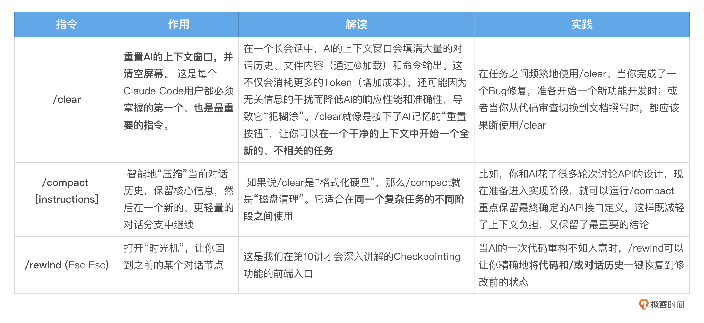

### 环境与配置类：你的AI“控制面板”

这类指令让你能够实时地查看和修改Claude Code的运行配置，将其调校到最称手的状态。

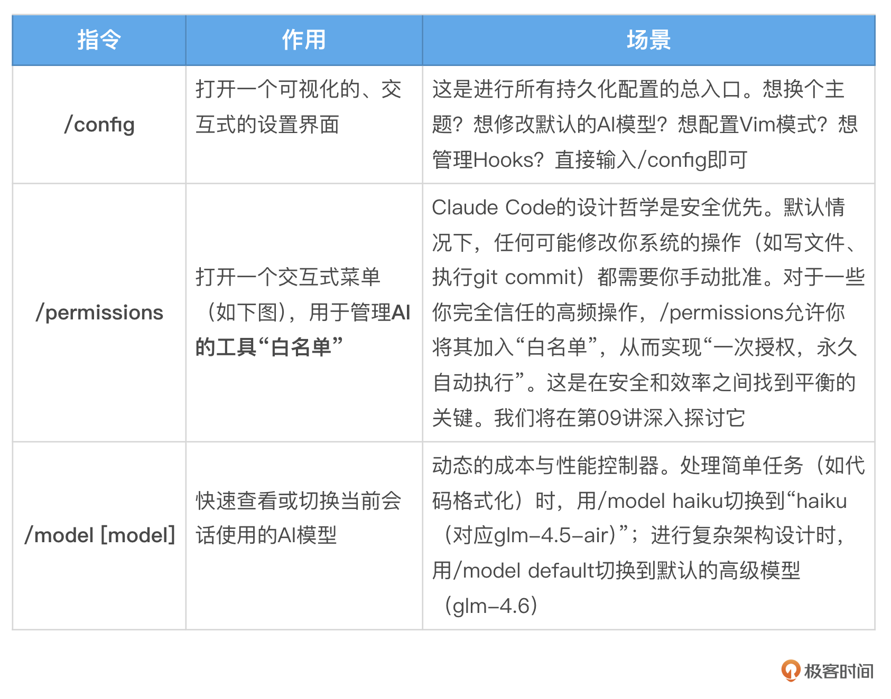

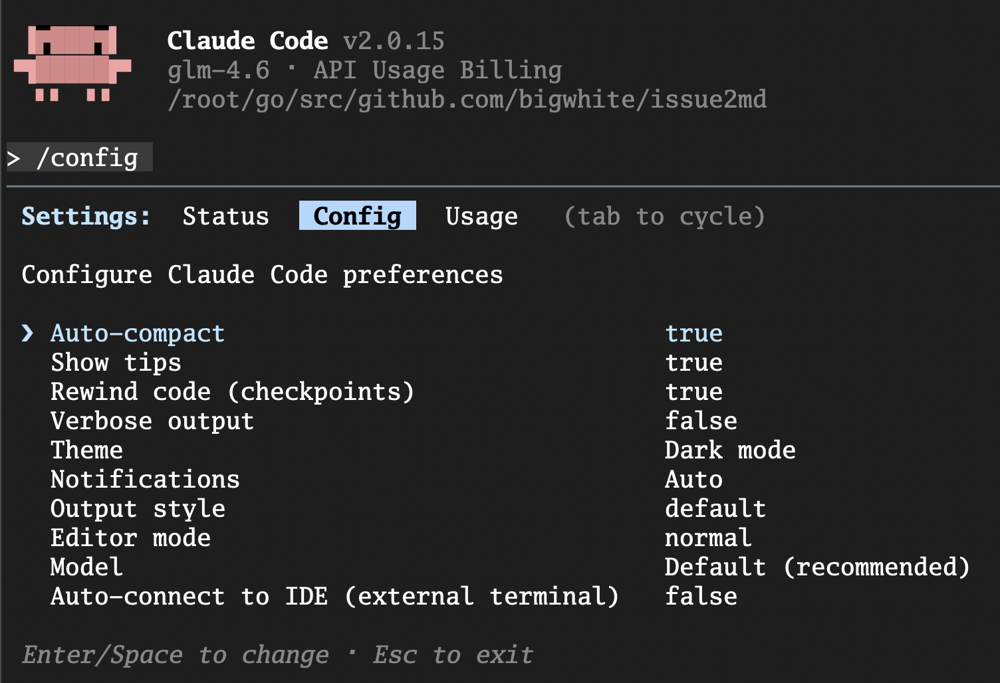

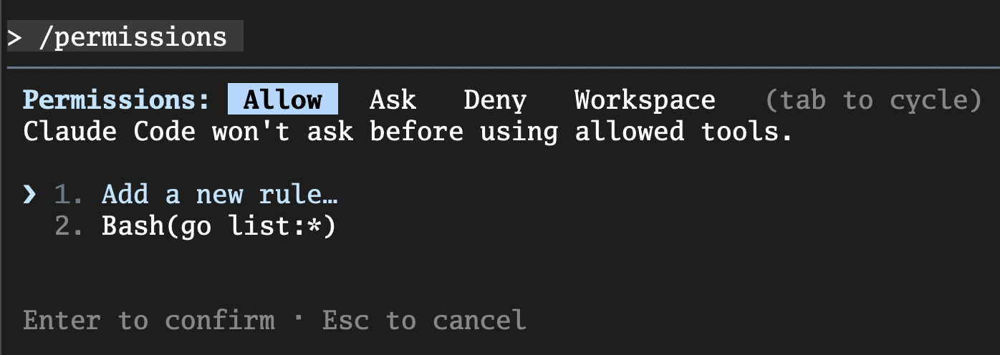

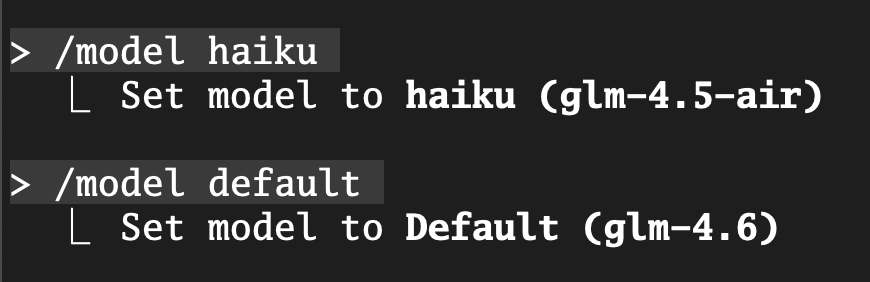

### 项目与协作类：将AI融入工程实践

这类指令与具体的软件工程任务紧密相关。

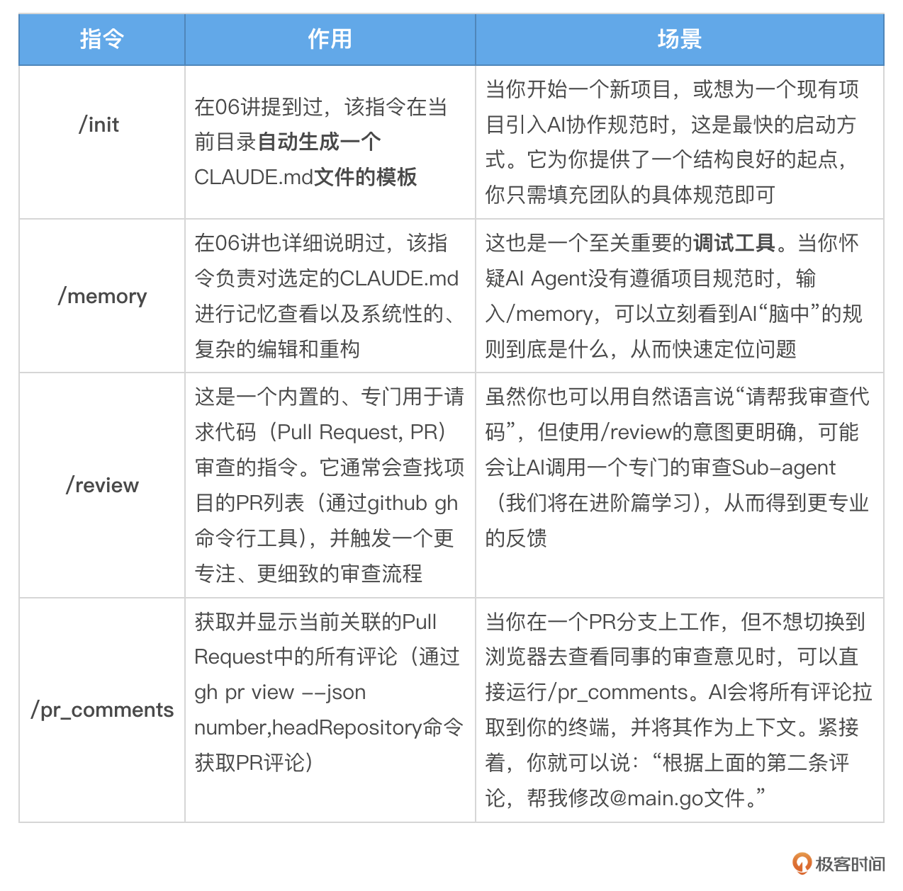

### 元信息与帮助类：你的实时“说明书”

这类指令帮助你随时了解工具的状态和获取帮助。

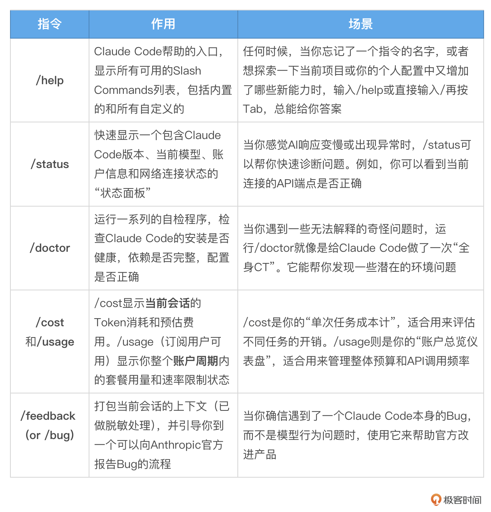

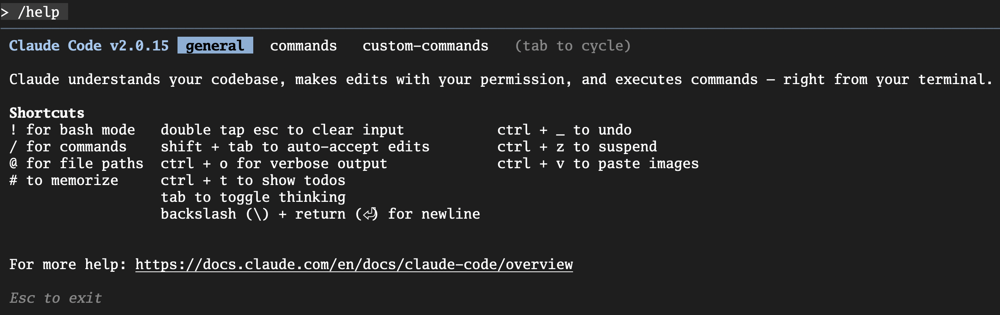

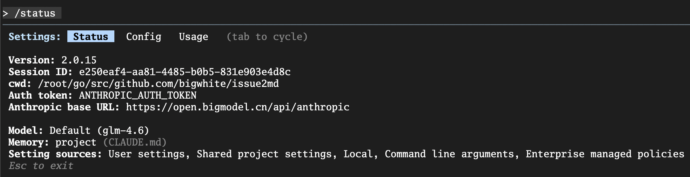

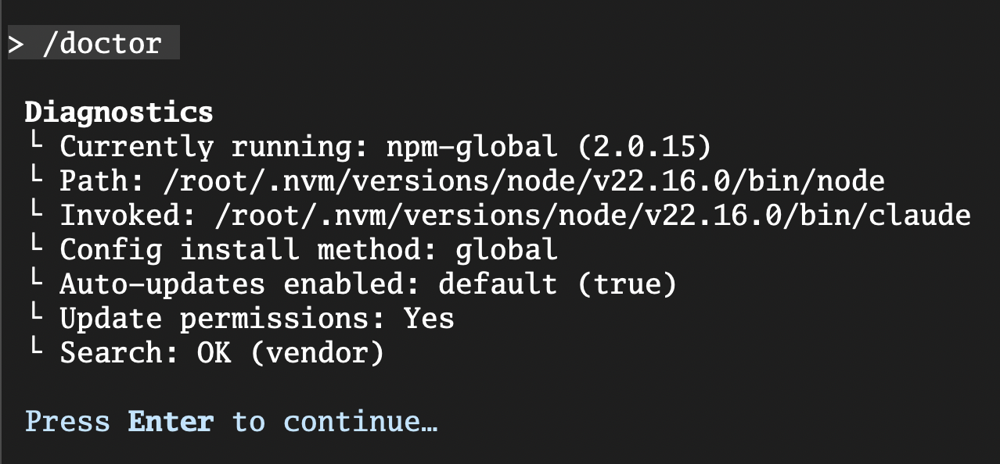

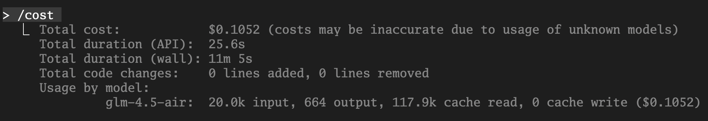

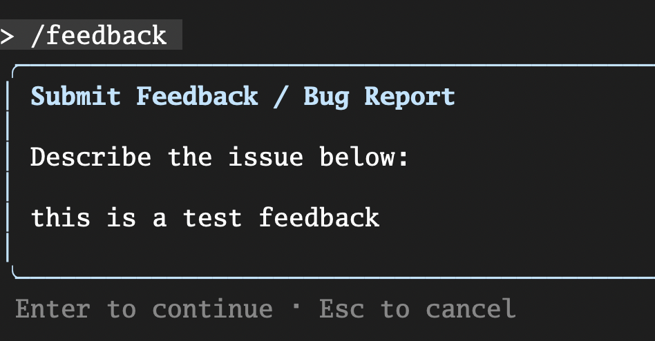

熟练地将这些内置指令融入你的肌肉记忆，你的AI协作效率就已经能超越大多数人了。但真正的革命，发生在我们从“使用指令”转向“创造指令”的那一刻。

## 自定义指令：从“使用者”到“指令设计师”

自定义Slash Commands，是AI原生开发范式中，开发者角色从“任务执行者”转向“工作流指挥家”的 **第一个、也是最重要的一步**。它让你能够将自己的经验、团队的最佳实践，沉淀为AI可以理解和执行的标准化指令。

### 核心理念：将“高频工作流”封装为斜杠指令

让我们回到开篇时提到的那几个场景。它们有三个共同点：一是高频，你每天可能都要做好几次，甚至更多。二是模式化，每次执行的步骤和核心意图都高度相似。三是蕴含隐性知识，比如“符合我们团队规范”这个要求，背后包含了大量的上下文和约束。

自定义指令的核心，就是将这些模式化的、蕴含隐性知识的高频工作流，从一个需要你每次都详细描述的“ **动态Prompt**”，变成一个固化下来、可一键调用的“ **静态模板**”。

### Project级与User级指令：团队共享与个人专属

Claude Code为自定义指令提供了两级作用域，完美地平衡了团队协作和个人效率。

**Project级指令（团队共享）**

- **存放位置：** 项目根目录下的 `./.claude/commands/` 目录。

- **特点：这些指令文件（ `.md` 格式）会随着你的项目一起被提交到Git仓库**。团队中的任何成员，只要克隆了项目，就能立即使用这些指令。在 `/help` 菜单中，它们会以 `(project)` 或 `(project:子目录)` 的形式被标记。

- **场景：极度适合封装团队的公共工作流和最佳实践**。例如： `/review-code`, `/gen-test-for-service`, `/deploy-to-staging` 等。


**User级指令（个人专属）**

- **存放位置：** 你用户主目录下的 `~/.claude/commands/` 目录。

- **特点：** 这些指令只存在于你自己的机器上，与任何具体项目无关，可以在你所有的项目中随时调用。在 `/help` 菜单中，它们会以 `(gitignored)` 的形式被标记。

- **场景：非常适合封装你个人的高频习惯和常用工具集**。例如： `/summarize-diff`, `/find-todos-in-code`, `/translate-to-english` 等。


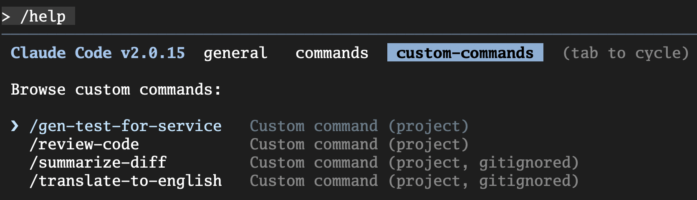

### 参数的力量：让你的指令“活”起来

如果自定义指令只是一个静态的文本模板，那它的威力将大打折扣。真正让它变得强大的，是其灵活的参数系统。自定义指令的参数有两种形式，我们逐一看一下。

#### `$ARGUMENTS`：捕获所有

这个占位符会被替换为你在指令名之后输入的所有文本。比如：我们下面创建一个用于修复GitHub Issue的指令fix-github-issue： `./.claude/commands/fix-github-issue.md`

```markdown
Please analyze and fix the GitHub issue: $ARGUMENTS.

Follow these steps:
1. Use `gh issue view` to get the issue details.
2. Understand the problem described in the issue.
3. Search the codebase for relevant files.
4. Implement the necessary changes to fix the issue.
5. Write and run tests to verify the fix.
6. Ensure code passes linting and type checking.
7. Create a descriptive commit message.
8. Push and create a PR.

Remember to use the GitHub CLI (`gh`) for all GitHub-related tasks.

```

当我们像下面这样调用fix-github-issue指令时：

```bash
> /fix-github-issue 1234

```

AI收到的最终Prompt： `Please analyze and fix the GitHub issue: 1234...`

#### `$1、2、3…`：捕获单个

这类参数类似于Shell脚本的位置参数， `$1` 代表第一个参数，2代表第二个，以此类推。参数之间用空格分隔。我们创建一个更结构化的PR审查指令来看看这类参数的用法：

`./.claude/commands/review-pr.md`

```markdown
Please review Pull Request #$1.
The priority for this review is: $2.
Please focus your review on the changes made by author: $3.

```

当我们像下面这样调用review-pr时：

```bash
> /review-pr 456 high tonybai

```

AI收到的最终Prompt为： `Please review Pull Request #456. The priority for this review is: high. Please focus your review on the changes made by author: tonybai.`

$ARGUMENTS和位置参数这两种形式在日常使用时，也是很好选择的。

- 当你的指令需要接收的是一段不确定长度的、完整的自然语言描述或单一ID时，使用 $ARGUMENTS。
- 当你的指令需要接收的是几个固定的、有明确顺序和含义的结构化参数时，使用位置参数 $1、2、3…。

> 位置参数 $2就是第二位
>
> 位置参数 $3就是第三位

接下来，我们再来看两个自定义斜杠指令的高级技巧。

### 高级技巧（一）：利用Frontmatter定义元数据

对于更专业的指令，你可以在Markdown文件的顶部，使用YAML Frontmatter（即由 `---` 包围的区域）来定义更丰富的元数据，比如下面这个 `/gen-test-for-service` 的例子：

```markdown
---
description: 为指定的Go函数生成符合团队规范的单元测试。
argument-hint: [file_path] [function_name]
model: opus
allowed-tools: Bash(go test:*), Write
---

根据我们在 `constitution.md` 中定义的“测试先行”和“表格驱动”原则，为 `@<!--§§MATH_0§§-->2` 函数编写一份完整的单元测试。

测试文件应该命名为 `XXX_test.go`。
...

```

让我们来解读一下Frontmatter区域使用的这些高级选项：

- `description`：定义了当你在 `/` 菜单中看到这个指令时，它旁边显示的描述文字。

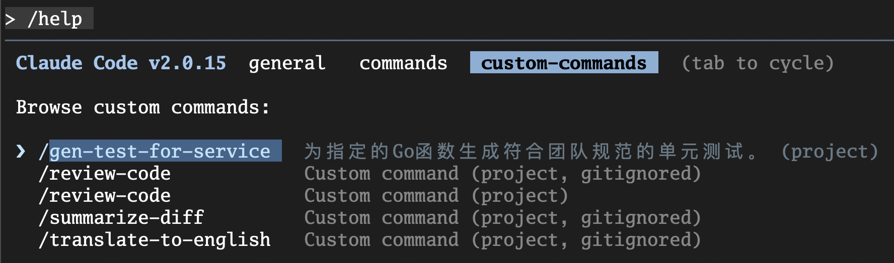

- `argument-hint`：定义了参数的提示信息。当用户输入 `/gen-test-for-service` 并按下空格时，Claude Code会提示他接下来应该输入 `[file_path]` 和 `[function_name]`。

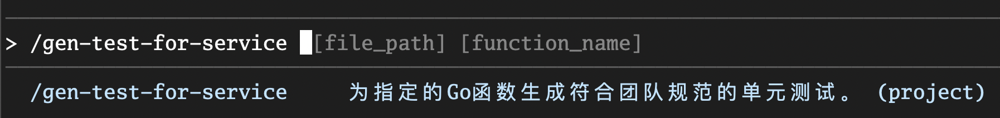

- `model`：允许你为这个特定的指令 **强制指定一个AI模型**。

- `allowed-tools`：为这个指令 **单独设置一套权限**。这是一个极其强大的安全和规范化工具。


通过Frontmatter，我们为指令赋予了丰富的元数据和清晰的“签名”。但这还不够，一个真正强大的指令，不仅应该能“说”，还应该能“做”。如果我们的指令在执行前，需要先从本地环境中动态地获取一些实时信息呢？接下来，我们就来看看自定义斜杠指令的第二个高级技巧。

### 高级技巧（二）：在指令中调用Shell命令!

这是自定义指令最强大的功能之一：你可以在指令模板内部， **嵌入 `!` 前缀的Shell命令**。当指令被调用时，这些Shell命令会 **首先被执行**，其 **输出结果会替换掉命令本身**，成为最终喂给AI的上下文的一部分。

下面我们就以 **创建一个智能的Commit Message生成指令** 为例，看看如何在指令中调用Shell命令。让我们先创建一个 `/commit` 指令( `./.claude/commands/commit.md`)，它能自动抓取当前的代码变更，并让AI生成提交信息。

```markdown
---
description: 根据当前暂存区的代码变更，生成一条符合Conventional Commits规范的Commit Message。
allowed-tools: Bash(git add:*)
---

你是一位Git专家。请根据以下代码变更的diff信息，为我生成一条符合Conventional Commits规范的、高质量的`git commit`消息。

**当前分支:**
!`git branch --show-current`

**暂存区变更 (Staged Changes):**
!`git diff --staged`

请只输出commit message本身，不要有任何额外的解释。

```

该斜杠命令的调用与执行流程大致如下：

1. 你在Claude Code终端中输入： `> /commit`。

2. Claude Code首先解析指令，发现了两个 `!` 命令。

3. 它执行 `git branch --show-current`，假设输出是 `feature/new-api`。

4. 它执行 `git diff --staged`，假设输出是几百行的代码diff。

5. 它将这两个命令的输出，替换回模板中的占位符。

6. 最终，它发送给AI的完整Prompt是：


```markdown
你是一位Git专家。请根据以下代码变更的diff信息...

**当前分支:**
feature/new-api

**暂存区变更 (Staged Changes):**
<此处是几百行的代码diff>

请只输出commit message本身...

```

7. AI基于这些实时、精准的上下文，为你生成一条完美的Commit Message。

看到了吗？通过在指令中嵌入 `!`，我们实现了一次 **上下文的自动化准备**。这比手动运行命令再复制粘贴，效率提升了不止一个数量级。

## 实战：创建一个 `/review-go-code` 的团队指令

理论已经足够，现在让我们将所有知识融会贯通，为我的Go项目 `bigwhite/issue2md` 创建一个强大、实用、可被整个团队共享的 `/review-go-code` 指令。这个实战将不仅仅是创建一个快捷方式，更是将我们前面学到的上下文艺术、指令设计哲学的一次综合演练。

### **第一步：明确我们的“工作流”**

在动手之前，我们先来设计一下我们理想中的“AI代码审查”工作流应该是什么样的。一个好的审查，不应该仅仅是让AI“凭感觉”去看代码，而应该是一个结合了 **确定性工具** 和 **AI深度分析** 的系统化过程。

我们的工作流设计如下：

1. 开发者提供需要审查的代码路径。

2. 系统首先运行Go语言官方的静态检查工具 `go vet`，对代码进行一次快速的、确定性的“体检”，捕获明显的语法和逻辑问题。

3. 然后，将 `go vet` 的检查报告，连同代码本身，以及我们项目最重要的 `constitution.md` **（开发宪法）**，一并作为上下文提供给AI。

4. 最后，AI在充分理解了所有这些信息的基础上，扮演“首席架构师”的角色，从更高维度的设计原则和最佳实践层面，给出一份深度审查报告。


### **第二步：创建指令文件**

根据我们设计的流程，我们在项目根目录下，创建这个团队共享的指令文件： `./.claude/commands/review-go-code.md`。

### **第三步：编写指令的“源代码”**

将以下内容完整地粘贴到我们刚刚创建的 `./.claude/commands/review-go-code.md` 文件中：

```markdown
---
description: 审查指定的Go代码文件或目录，并根据项目“宪法”和静态检查工具给出反馈。
argument-hint: [path_to_review]
model: opus
allowed-tools: Read, Grep, Glob, Bash(go vet:*)
---

你现在是 `issue2md` 项目的首席架构师，你的任务是审查一段代码。

**审查目标：**
请仔细阅读并分析`@$1`中的所有Go代码。

**静态检查初步分析结果：**
这是`go vet`工具对目标路径的检查报告。如果报告为空，则代表没有发现明显问题：
!`go vet $1`

**审查准则（必须严格遵守）：**
请结合上面的静态检查结果，并根据我们项目根目录下的`constitution.md`文件定义的开发宪法，对代码进行深入审查。你的审查报告必须围绕以下几条核心原则展开：

1.  **第一条：简单性原则。** 代码是否存在不必要的抽象？是否优先使用了标准库？
2.  **第三条：明确性原则。** 错误处理是否都使用了`fmt.Errorf("...: %w", err)`进行包装？是否存在被`_`丢弃的错误？依赖是否被清晰地注入？
3.  **第四条：单一职责原则。** 包、文件和函数的职责是否足够单一和内聚？

**输出格式：**
请以Markdown格式，生成一份结构化的审查报告。报告应包含以下部分：
- **总体评价：** 一句话总结代码的整体质量。
- **优点（做得好的地方）：** 列出1-2个最值得称赞的点。
- **待改进项（按优先级排序）：**
  - **[高优先级]:** 必须修改的问题（例如，违反了“宪法”的不可协商条款或`go vet`报告的错误）。
  - **[中优先级]:** 强烈建议修改的问题（例如，设计模式可以优化）。
  - **[低优先级]:** 一些代码风格或可读性的建议。

对于每一个待改进项，请明确指出**文件名、行号、问题描述**，并给出具体的**修改建议**。

```

### **第四步：深度剖析我们的指令**

让我们来仔细剖析这份指令的每一部分，理解其背后的设计哲学：

**Frontmatter部分：**

- `description`：“审查指定的Go代码文件或目录…” —— 给了用户清晰的指引。

- `argument-hint`： `[path_to_review]` —— 告诉用户这个指令需要一个路径参数。

- `model: opus` —— 我们强制将这次审查任务交给我们最强大的 `opus` 模型，确保审查的深度和质量，这正是“好钢用在刀刃上”。

- `allowed-tools: Read, Grep, Glob, Bash(go vet:*)` —— 这是设计的精髓所在。我们为这个指令设定了 **最小权限原则**。它只能进行 **只读操作**（ `Read`, `Grep`, `Glob`），以及 **唯一一个被允许的、安全的Shell命令**—— `go vet`。AI在这个指令下，绝对无法执行 `rm`、 `git` 或任何其他可能产生副作用的命令。


**指令主体部分：**

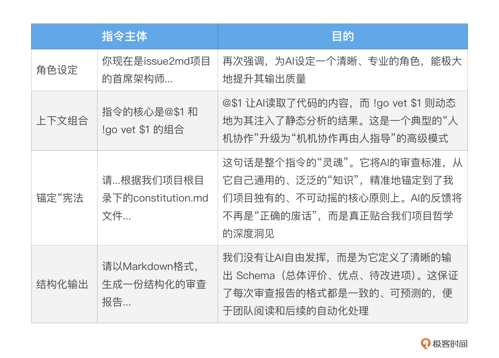

### **第五步：保存并测试**

现在，这个强大的团队能力已经被固化下来了。打开一个新的Claude Code会话（确保它能加载到我们新创建的指令），然后尝试调用它：

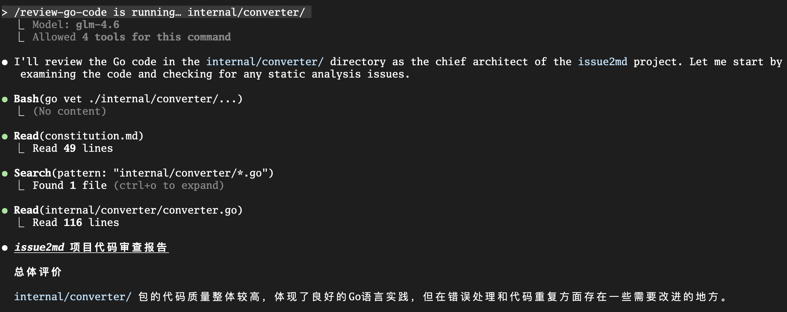

从图中，我们看到，Claude Code自动地、一气呵成地完成我们设计的整个工作流：

1. 切换到默认模型。
2. 执行 `go vet internal/converter/` 命令，并将结果呈现在上下文中。
3. 读取 `internal/converter/` 目录下的所有Go文件，以及项目根目录下的 `constitution.md` 文件。
4. 最终，在充分消化了所有这些信息之后，为你输出一份完全按照我们定义的格式、围绕我们定义的“宪法”原则展开的、高质量的代码审查报告。

```plain
● issue2md 项目代码审查报告

  总体评价

  internal/converter/ 包的代码质量整体较高，体现了良好的Go语言实践，但在错误处理和代码重复方面存在一些需要改进的地方。

  优点（做得好的地方）

  1.简单性原则体现良好：代码结构清晰，没有过度抽象，优先使用了标准库（strings.Builder、fmt、sort），完全符合宪法第一条的要求。
  2. 单一职责原则执行到位：converter包专注于将GitHub数据结构转换为Markdown格式，职责明确且内聚性强，符合宪法第四条。

  待改进项（按优先级排序）

  [高优先级]: 缺少错误处理机制

  文件: internal/converter/converter.go
  行号: 全部函数
  问题描述: 所有转换函数（IssueToMarkdown、PullRequestToMarkdown、DiscussionToMarkdown）都忽略了可能的错误情况，如空指针检查、
  数据验证等。这违反了宪法第三条关于错误处理的明确规定。

  修改建议:
  func IssueToMarkdown(issue *github.Issue, comments []github.Comment, enableUserLinks bool) (string, error) {
      if issue == nil {
          return "", fmt.Errorf("issue cannot be nil")
      }
      if issue.User.Login == "" {
          return "", fmt.Errorf("issue user login cannot be empty")
      }

      var sb strings.Builder
      // ... 其余代码保持不变
      return sb.String(), nil
  }

  [中优先级]: 代码重复严重

  文件: internal/converter/converter.go
  行号: 55-115
  问题描述: IssueToMarkdown、PullRequestToMarkdown和DiscussionToMarkdown三个函数存在大量重复代码，违反了DRY原则和简单性原则。

  修改建议:
  type ItemType interface {
      *github.Issue | *github.PullRequest | *github.Discussion
  }

  func itemToMarkdown[T ItemType](item T, itemType string, comments []github.Comment, enableUserLinks bool) (string, error) {
      var sb strings.Builder

      sb.WriteString(fmt.Sprintf("# %s\n\n", item.getTitle()))
      sb.WriteString(fmt.Sprintf("- **%s Number**: #%d\n", itemType, item.getNumber()))
      sb.WriteString(fmt.Sprintf("- **URL**: %s\n", item.getURL()))
      sb.WriteString(fmt.Sprintf("- **Created by**: %s\n\n", formatUser(item.getUser().Login, enableUserLinks)))
      sb.WriteString(fmt.Sprintf("## Description\n\n%s\n\n", item.getBody()))
      writeReactions(&sb, item.getReactions(), enableUserLinks)

      if len(comments) > 0 {
          sb.WriteString("## Comments\n\n")
          for i, comment := range comments {
              writeComment(&sb, i, comment.User, comment.Body, enableUserLinks)
              writeReactions(&sb, comment.Reactions, enableUserLinks)
          }
      }

      return sb.String(), nil
  }

  [中优先级]: 缺少公共API文档

  文件: internal/converter/converter.go
  行号: 55, 76, 97
  问题描述: 所有公共函数都缺少GoDoc注释，违反了宪法第三条关于"所有公共API都必须有清晰的GoDoc注释"的要求。

  修改建议:
  // IssueToMarkdown converts a GitHub issue and its comments to Markdown format.
  // It returns the formatted Markdown string or an error if the input is invalid.
  func IssueToMarkdown(issue *github.Issue, comments []github.Comment, enableUserLinks bool) (string, error) {
      // ... 实现
  }

  [低优先级]: 常量定义可以更灵活

  文件: internal/converter/converter.go
  行号: 11
  问题描述: githubBaseURL硬编码为"https://github.com"，缺少灵活性，虽然当前符合需求，但考虑到GitHub
  Enterprise的可能性，建议可配置化。

  修改建议:
  var githubBaseURL = strings.TrimSpace(getEnvOrDefault("GITHUB_BASE_URL", "https://github.com"))

  总结

  该包整体遵循了项目的核心开发原则，特别是在简单性和单一职责方面表现优秀。主要的改进空间在于增加适当的错误处理机制和减少代码重
  复。建议优先解决错误处理问题，然后重构重复代码以提高可维护性。

```

我们成功了！我们不仅创造了一个快捷方式，更是 **将团队最高水平的代码审查经验，固化成了一个任何成员（包括新成员）都可以一键调用的原子能力**。这，就是自定义指令的真正威力。

当然，除了我们今天学习的、基于Markdown文件的自定义指令，Claude Code的指令系统还支持一种更高级的形式，即由 **插件（Plugin）或MCP服务器** 动态提供的指令，例如 `/mcp__github__list_prs`。这类指令通常具备更强的动态交互和深度集成能力。不过，它们属于更高阶的扩展机制，我们将在后续讲解MCP的章节中再深入探讨。对于绝大多数日常工作流的封装，我们今天所学的斜杠指令已经绰绰有余，并且是理解所有指令系统的坚实基础。

## 本讲小结

今天，我们深入探索了Claude Code的指令中枢——Slash Commands。我们从一个被动的AI“提问者”，开始向一个主动的“指令设计师”转变。

我们系统性地学习了 **内置指令** 这一“瑞士军刀”，并将其分为会话与上下文管理、环境与配置、项目与协作、原信息与帮助四大类进行深度剖析。

我们深入了 **自定义指令** 的核心理念，理解了如何将高频工作流封装为原子能力，并通过 **Project级** 和 **User级** 指令，实现了团队协作与个人效率的平衡。然后，我们掌握了让指令“活”起来的关键—— **参数系统**，以及通过Frontmatter（定义元数据）和嵌入Shell命令（ `!`）进行高级定制的强大技巧。

最后，通过一个完整的实战，我们亲手为团队打造了一个升级版的 `/review-go-code` 指令，将静态检查与AI的深度分析完美结合，将团队的最佳实践沉淀为了可复用的AI能力。

Slash Commands是你将AI原生开发理念落地的第一块、也是最重要的一块基石。它让你能够开始“编程”AI，将你的智慧和经验，转化为AI可以理解和执行的指令。然而，我们今天创建的指令，其能力边界仍然受限于Claude Code的内置工具集和我们授权的Shell命令。如果我们想让AI执行一些更复杂、更专业的操作，比如连接数据库、调用一个内部API、或者执行一个复杂的安全扫描脚本，该怎么办呢？

这就是我们进阶篇要解决的核心问题。从下一讲开始，我们将进入AI能力扩展的深水区，首先从所有AI Agent都必须面对的基础—— **安全** 开始。我们将学习如何通过沙箱和权限控制，为AI戴上“安全镣铐”，为我们后续更大胆的能力扩展，奠定坚实的基础。

## 思考题

今天我们创建了一个强大的 `/commit` 指令，它能自动读取 `git diff --staged`。但它有一个小小的缺憾：如果开发者忘记了 `git add`，那么 `git diff --staged` 的输出就是空的，AI生成的Commit Message也会不准确。请你思考一下，如何 **改进** 这个 `/commit` 指令，让它变得更“智能”、更“健壮”？

**提示：**

1. 你可以在指令的Markdown文件中，使用 **自然语言** 来描述 **条件逻辑**（比如 “如果…那么…否则…”）。

2. 你可以组合使用 **多个 `!` 命令** 来获取不同的状态（比如，同时检查 `git diff --staged` 和 `git diff`）。


请尝试设计一个“防呆版”的 `/commit` 指令。当它发现暂存区为空，但工作区有修改时，它应该如何智能地与用户交互？欢迎在评论区分享你的指令设计，看看谁的方案最高效、最优雅！如果你觉得这节课的内容对你有帮助的话，也欢迎你分享给需要的朋友，我们下节课再见！