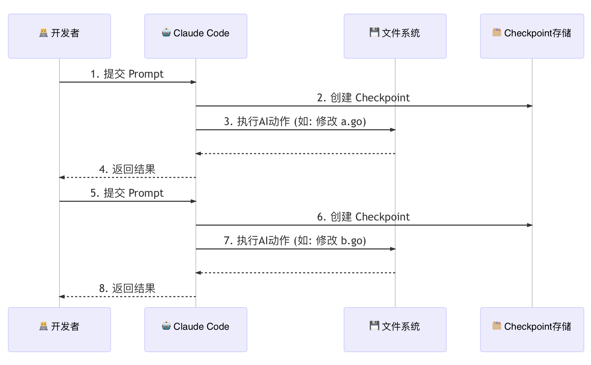
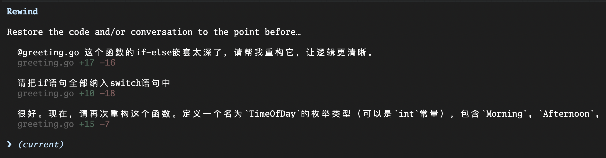
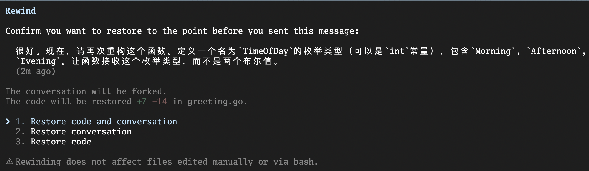
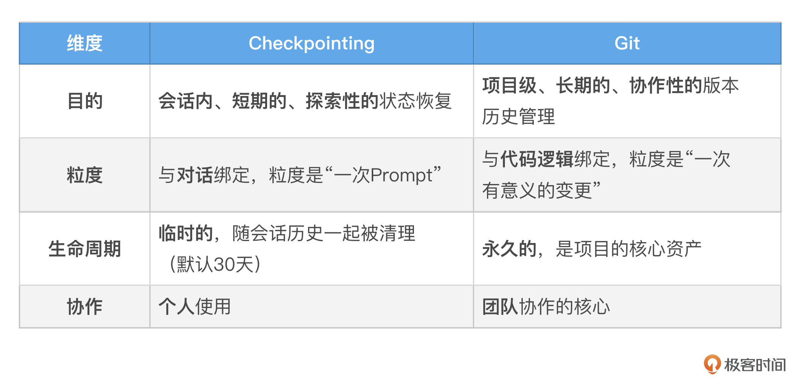

# 10｜安全基石（下）：Checkpointing，获得让AI“时光倒流”的超能力
你好，我是Tony Bai。

在上一讲，我们深入了Claude Code的权限体系和沙箱机制，学会了如何为AI戴上一副坚固的“安全镣铐”。我们通过精细的规则，确保了AI在 **行动之前** 是可控的、可预测的。

这解决了一个核心的信任问题：“我如何确保AI不会做坏事？”。但随之而来的是一个更微妙、也更常见的困境。想象一下这个场景：你正在让AI帮你重构一个祖传的、长达500行的Go函数。

1. 你下达了第一个指令：“先将这个函数拆分成三个更小的私有函数。” AI完成得很漂亮，你很满意，批准了它的文件修改。

2. 你信心大增，下达了第二个指令：“很好。现在，将这几个函数的核心逻辑，用Go的泛型进行重写，以提高复用性。”

3. AI再次动手，修改了多个文件，引入了新的类型参数。但这次，你看着生成的新代码，眉头紧锁。它虽然能跑，但设计得过于复杂，可读性反而下降了。

4. 你想反悔，回到上一步的状态。但AI已经修改了3个文件，共计15处地方。你是要手动 `Ctrl+Z` 15次，还是用 `git restore` 小心翼翼地恢复部分文件？无论哪种，都很痛苦，而且很容易出错。


**这就是我们所说的“重构的恐惧”：当AI的修改偏离了我们的轨道时，我们缺乏一个简单、可靠、能够一键“反悔”的机制。**

今天这一讲，我们就要彻底终结这种恐惧。我们将深入Claude Code的另一个独门绝技—— **Checkpointing（检查点）** 机制。你将学会如何获得让AI“时光倒流”的超能力，为所有大胆的AI实验，备上一剂强大的“后悔药”。

## Checkpointing工作原理：会话级的“Git快照”

Checkpointing的理念，对于爱玩游戏的小伙伴儿来说，可能会非常亲切。它就像是游戏中的 **自动存档（Auto-Save）** 机制。

在你即将进入一场艰难的Boss战（一次复杂的AI操作）之前，游戏会自动为你创建一个存档点。如果你在战斗中失败了，你可以轻松地“读档”，回到进入战斗前的那个完美状态，然后换个策略再试一次。

Claude Code的Checkpointing机制，就是你开发过程中的“自动存档系统”。它的工作原理可以概括为以下几点：

1. **触发时机：** 每当你（用户）提交一个新的Prompt时，Checkpointing系统就会被触发。它会在AI开始思考和行动之前，悄悄地为你的项目状态创建一个快照。

2. **保存内容：** 这个快照，并不仅仅是代码的备份。它完整地记录了那一刻的“时空切片”，主要包含两部分信息：


- **代码状态：** 当前会话中所有被AI“染指”过的文件（即被读取或修改过的文件）的完整内容。
- **对话状态：** 到那一刻为止的完整对话历史。

3. 为了更好地理解，你可以把它想象成一个由Claude Code在后台为你维护的、 **与你项目主仓库完全隔离的“影子Git仓库”**。

- 每当你提交Prompt，Claude Code就在这个“影子仓库”里帮你执行了一次 `git commit -a -m "Checkpoint before prompt N"`。
- 这个操作极其轻量，并且绝对不会污染你项目本身的 `.git` 历史。它所有的历史记录都存放在Claude Code的内部目录中（如 `~/.claude/ file-history/`）。

这个机制的精妙之处在于，它将你的对话历史和代码变更历史，在每一个关键节点上进行了精确的绑定。

我们可以用一张图来清晰地看到这个流程：



看，在AI对你的文件系统进行任何“写”操作之前，一个包含了“之前”所有状态的完美快照，已经被安全地存盘了。这，就是我们能够“时光倒流”的底气所在。

## 实战：使用 `/rewind` 在任意检查点间穿梭

理论已经清晰，现在让我们进入最激动人心的实战环节。我们将亲历一次从“大胆重构”到“从容反悔”的全过程。

**场景：** 假设我们正在维护一个Go函数，它根据不同的条件生成问候语。目前的代码充满了丑陋的 `if-else` 嵌套，可读性极差。

**初始代码** `greeting.go`

```go
package greeting

import "fmt"

// GetGreeting generates a greeting message.
// isFormal: whether to use a formal tone.
// isMorning: whether it is morning.
// isEvening: whether it is evening.
func GetGreeting(name string, isFormal bool, isMorning bool, isEvening bool) string {
    if isFormal {
        if isMorning {
            return fmt.Sprintf("Good morning, %s.", name)
        } else {
            if isEvening {
                return fmt.Sprintf("Good evening, %s.", name)
            } else {
                return fmt.Sprintf("Hello, %s.", name)
            }
        }
    } else {
        if isMorning {
            return fmt.Sprintf("Hey %s, good morning!", name)
        } else {
            if isEvening {
                return fmt.Sprintf("Hey %s, good evening!", name)
            } else {
                return fmt.Sprintf("Hey, %s!", name)
            }
        }
    }
}

```

### 第一步：第一次重构——走向清晰

我们向Claude Code下达第一个重构指令：

> `@greeting.go` 这个函数的if-else嵌套太深了，请帮我重构它，让逻辑更清晰。
>
> AI Agent分析后，可能会提议使用 `switch` 语句，并给出了修改方案。我们觉得很棒， **批准** 了这次修改。

**代码状态 V2 (第一次重构后)：**

```go
package greeting

import "fmt"

func GetGreeting(name string, isFormal bool, isMorning bool, isEvening bool) string {
    switch {
    case isFormal && isMorning:
        return fmt.Sprintf("Good morning, %s.", name)
    case isFormal && isEvening:
        return fmt.Sprintf("Good evening, %s.", name)
    case isFormal:
        return fmt.Sprintf("Hello, %s.", name)
    case !isFormal && isMorning:
        return fmt.Sprintf("Hey %s, good morning!", name)
    case !isFormal && isEvening:
        return fmt.Sprintf("Hey %s, good evening!", name)
    default:
        return fmt.Sprintf("Hey, %s!", name)
    }
}

```

这个版本比原来好多了。我们很满意。

### 第二步：第二次重构——一次“失败”的尝试

现在，我们想更进一步。我们觉得布尔参数太多了，想用一个枚举类型来代替 `isMorning` 和 `isEvening`。

我们下达了第二个指令：

> 很好。现在，请再次重构这个函数。定义一个名为 `TimeOfDay` 的枚举类型（可以是 `int` 常量），包含 `Morning`, `Afternoon`, `Evening`。让函数接收这个枚举类型，而不是两个布尔值。

AI再次动手，给出了一套新的实现方案，包括了新的类型定义和修改后的函数。但我们看了一下，觉得它引入的 `iota` 和常量组让代码反而变得不那么直观了，而且它把 `isFormal` 的逻辑和时间逻辑混在了一起，可读性不升反降。

但是，我们“手滑” **批准** 了这次修改。

**代码状态 V3（第二次重构后，我们不满意的版本)：**

```go
package greeting

import "fmt"

type TimeOfDay int

const (
    Morning TimeOfDay = iota
    Afternoon
    Evening
)

func GetGreeting(name string, isFormal bool, time TimeOfDay) string {
    // ... 一段我们不满意的、复杂的实现 ...
}

```

项目现在处于一个我们不想要的状态。怎么办？

### 第三步：启动“时光机”—— `/rewind`

现在，是时候召唤“后悔药”了。在Claude Code的输入框中，输入 `/rewind`（或者直接连按两次 `Esc` 键），“时光机”界面就会出现。

你会看到一个按时间顺序排列的 **检查点列表**（旧的在上面，新的在下面），每一个都对应你提交的一次Prompt：



更重要的是，当你通过方向键选择你要回退到的检查点并按下回车后，你会看到三个强大的“倒流”选项：



**Rewind code（只回退代码）：**

- **作用：** 将你的文件系统恢复到选定检查点的状态，但保留完整的对话历史。

- **心智模型：**“AI，我们刚才的讨论都很有价值，但我对你的具体实现不满意。让我们回到你动手之前，然后基于我们刚才的讨论，你再试一次。”

- **适用场景：** AI的思路正确，但代码实现有误。


**Rewind conversation（只回退对话）：**

- **作用：** 将你的对话历史回退到选定检查点，但保留文件系统的所有修改。

- **心智模型：**“AI，你刚才做的代码修改是对的，但我发现我给你的指令说错了。让我们保留现在的代码，然后从我上一个指令开始，我换个说法。”

- **适用场景：** 代码修改符合预期，但你想从一个早期的对话节点，探索另一个完全不同的方向。


**Rewind code and conversation（全部回退）：**

- **作用：彻底的“时光倒流”**。将文件系统和对话历史，都完美地恢复到选定检查点的状态。

- **心智模型：**“AI，我们刚才那段探索完全是条死胡同。让我们假装它从未发生过，从这个更早的时间点重新开始。”

- **适用场景：** 当你对AI的一系列修改和你们的整个讨论方向都不满意时，这是最彻底、最干净的“重置”按钮。


在我们的场景中，我们对第二次重构的整个方向（引入枚举）都不满意，所以我们选择Rewind code and conversation，然后按下回车。

瞬间，奇迹发生了：

1. 你的 `greeting.go` 文件内容，被完美地恢复到了我们满意的“代码状态 V2”。

2. 你的Claude Code对话界面，也回滚到了你下达第二次重构指令之前的状态。


一切都回到了那个“美好的时刻”。现在，你可以重新思考，然后给AI一个全新的、更好的指令。

## Checkpointing的边界：它不能做什么？

Checkpointing虽然强大，但它不是万能的。清晰地理解它的边界，能帮助我们避免错误的使用，并将其与我们已有的工具（如Git）进行更好的配合。

1. \*\*它不跟踪 `Bash` 命令的副作用：\*\*这是最重要，也是最容易被误解的限制。Checkpointing系统只快照文件内容的状态。对于通过 `!` 或 `Bash` 工具执行的命令所产生的副作用，它无能为力。例如，如果AI执行了：
   1. `! rm sensitive-data.log`

   2. `! git push --force`

   3. `! docker stop my-container`

**这些操作是不可逆的。** `/rewind` 无法帮你恢复被删除的文件、撤销强制推送，或重启被停止的容器。 这也是为什么我们在上一讲强调，对高风险的 `Bash` 命令，必须使用最严格的 `ask` 或 `deny` 权限规则。

2. **它不跟踪外部编辑：** Checkpointing的“眼睛”只盯着由Claude Code的内置编辑工具（如 `Write`, `Edit`）所修改的文件。如果你在与AI对话的同时，自己在VS Code或VIM里手动修改了 `greeting.go`，这个手动的修改不会被记录在Checkpointing的历史中。

这通常不是问题，但需要记住： `/rewind` 恢复的是上一个检查点时刻、由Claude Code所知晓的文件状态。

3. **它不是Git的替代品：** 这个误解必须澄清。Checkpointing和Git是解决两种不同问题的工具，它们是互补而非替代关系。



**最佳实践是：** 在一个功能开发的过程中，你可以自由地使用Checkpointing进行各种大胆的尝试和回滚。当你完成了一个有意义的、稳定的功能点时，再使用 `git commit`，将这个阶段性的成果，永久地记录到项目的“正式历史”中去。

## 本讲小结

今天，我们为我们的AI原生开发工作流，装上了最后一块、也是最关键的一块安全拼图。我们获得了在AI世界里“反悔”的权力。

首先，我们直面了与AI进行复杂协作时的“ **重构的恐惧**”，并明确了Checkpointing机制就是为了解决这个问题而生的“后悔药”。接着，我们深入了Checkpointing的工作原理，理解了它是一个由用户Prompt触发的、会话级的“Git快照”系统，能够同时保存代码和对话的状态。

然后，通过一个完整的Go代码重构实战，我们亲手掌握了 `/rewind` 这一“时光机”指令，并深刻理解了其 **三种不同回退模式**（只回退代码、只回退对话、全部回退）的精髓和适用场景。最后，我们清晰地划定了Checkpointing的边界，明确了它不能跟踪 `Bash` 命令的副作用，也不能替代Git作为正式的版本控制工具。

掌握了Checkpointing，你就拥有了驾驭AI进行更大规模、更具探索性任务的信心。从“只敢让AI写点小函数”，到“敢于让AI重构整个模块”，这正是从AI使用者到AI驾驭者的关键一跃。至此，我们的“安全基石”已经完全筑牢。我们学会了如何事前约束（权限与沙箱）和事后补救（Checkpointing）。现在，AI Agent对我们来说，已经是一个足够安全的伙伴了。

那么，我们是否可以让它变得更“主动”一些呢？除了我们下达指令，它能否在某些特定时机，自动地为我们做一些事情？比如，每次修改完代码后，自动运行 `gofmt`？这就是我们下一讲要探讨的主题： **自动化之触——Hooks机制**。我们将学习如何AI的生命周期中埋下“触发器”，实现更高阶的自动化。

## 思考题

除了今天我们演示的“代码重构”场景，请你再设想至少两个你认为Checkpointing机制能发挥巨大价值的日常开发场景。例如，探索一个新库的不同API用法？或者让AI生成多个不同风格的UI组件代码以供挑选？

请描述你的场景，并说明在这种场景下，你可能会更倾向于使用 `/rewind` 的哪种模式（只回退代码、只回退对话，或全部回退），以及为什么。欢迎在评论区分享你的创意工作流！如果你觉得今天的内容对你有帮助，也欢迎你分享给需要的朋友，我们下节课再见！