# 11｜事件驱动：详解Hooks机制，让AI在关键节点自动触发
你好，我是Tony Bai。

在前面的课程中，我们已经为AI伙伴Claude Code，装备了强大的“长期记忆”和“私人命令集”。通过 `CLAUDE.md` 和自定义Slash Commands，我们的协作效率已经得到了极大的提升。

但是，如果你仔细观察，会发现我们当前的协作模式，本质上仍然是 **交互式的、一问一答的**。AI的所有行动，都源于我们的一次主动调用。我们就像一个时刻需要盯着屏幕的“微操大师”，在AI完成每一步后，都需要手动输入下一条指令。

- AI帮你重构了一个Go文件，你心满意足地批准了。接下来，你必须手动输入 `! gofmt -w .` 来格式化代码。

- AI帮你修复了一个Bug，并通过了测试。接下来，你必须手动输入 `! git add .` 和 `! git commit ...` 来保存工作成果。

- 你让AI执行一个需要几分钟的复杂任务，比如大规模代码分析。你只能切换到别的窗口，然后凭感觉时不时地切回来，看看它是否已经完成，或者是否正在等待你的某个权限批准。


这些手动的、重复的、可预测的“收尾工作”和“状态监视”，正在成为我们迈向更高阶自动化的新瓶颈。

我们能否将协作模式再向前推进一步，从“我告诉AI做什么”，进化到“ **当AI做了某事后，系统自动为它做什么**”？

答案是肯定的。这正是我们今天要学习的“事件驱动”方案—— **Claude Code Hooks机制**。

今天这一讲，我们将深入AI Agent的“神经系统”，学习如何在其生命周期的关键节点上，埋下我们自己的“触发器”。你将学会让AI在修改文件后自动格式化代码，以及在任务完成或需要你介入时，自动弹出系统通知。掌握Hooks，意味着你将完成从“AI使用者”到“ **AI行为编排者**”的终极转变。

## 从“用户调用”到“事件触发”：一种新的自动化哲学

在深入技术细节之前，我们必须先清晰地分辨Hooks与我们已经学过的Slash Commands之间的根本区别。这两种能力扩展方式，代表了两种截然不同的自动化哲学。

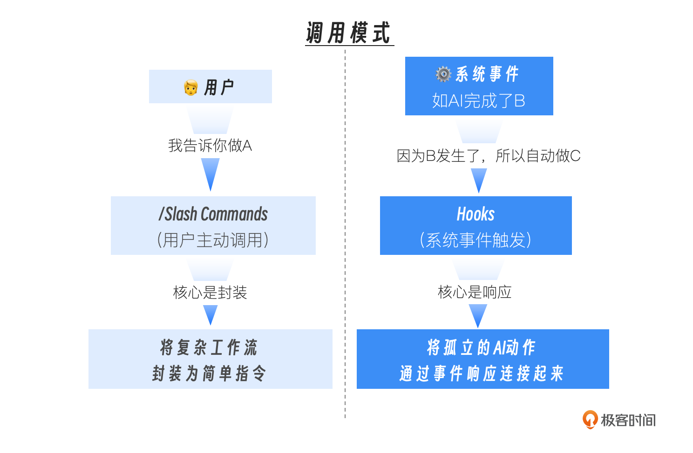

- Slash Commands是“人驱动”的。它们是你工具箱里的“电动螺丝刀”。你需要主动地拿起它，对准某个目标，然后按下开关。它极大地提升了你执行单个、特定任务的效率。

- Hooks是“事件驱动”的。它们是你预先设置在AI行动路径上的“ **传感器**”和“ **响应器**”。当AI生命周期中的某个事件（比如“AI刚刚完成了一次文件写入”）发生时，对应的Hook会自动被触发，执行你预设好的响应动作。它致力于将孤立的AI行动，连接成更流畅的自动化序列。


一个成熟的AI原生工作流，必然是这两者的完美结合：你使用自定义的Slash Command启动一个复杂的任务，而Hooks则负责响应这个任务过程中所有可预测的、重复的事件，自动完成“胶水代码”和“收尾工作”。

## 深入Claude Code生命周期：AI行动的“事件流”

要成为一个优秀的“AI行为编排者”，你首先需要一张清晰的“流程图”，了解AI在执行一个任务时，到底会经过哪些关键的生命周期节点。这些节点，就是我们可以监听并绑定响应动作的 **事件源**。

Claude Code为我们开放了多个核心的Hook事件。让我们通过一个典型的AI工作流程，来看看它们各自的位置和作用。

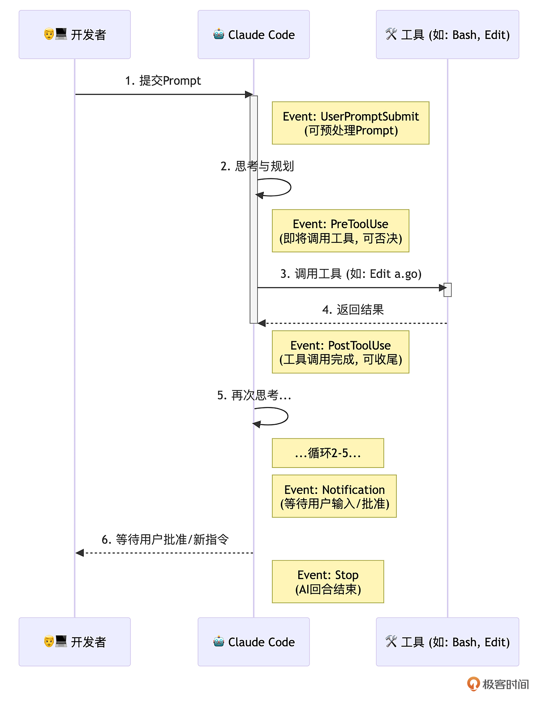

这张图揭示了几个最重要的Hook事件：

`SessionStart`/ `SessionEnd`（会话级事件）：

- **时机：** 分别在Claude Code会话启动和退出时触发。

- **价值：** 适合执行全局的“初始化”和“清理”工作。例如， `SessionStart` 时自动 `nvm use` 切换到项目指定的Node版本，或者加载环境变量。


`UserPromptSubmit`（用户输入事件）：

- **时机：** 当你按下回车，提交一个新的Prompt之后，AI开始处理之前。

- **价值：** 可以在AI思考前，对你的Prompt进行“预处理”或“校验”。例如，检查你的指令是否包含某些敏感词，如果包含，则直接阻止本次提交。


`PreToolUse`（工具调用前事件）：

- **时机：** 在AI决定要调用一个工具（如 `Edit`, `Bash`）， **即将执行但还未执行** 的那个瞬间。

- **价值：** 这是实现精细化安全控制和行为干预的最强武器。 `PreToolUse` Hook可以接收到AI即将调用的工具名称和参数，并可以通过返回一个非零的退出码（或特定的JSON）来“一票否决”这次操作。


`PostToolUse`（工具调用后事件）：

- **时机：** 在工具调用完成之后，AI接收到工具返回结果之前。

- **价值：** 这是实现“ **自动化收尾工作**”的最佳节点。AI刚刚修改完一个文件， `PostToolUse` Hook可以立即触发，运行代码格式化或Linter。


`Notification`（通知事件）：

- **时机：** 当AI完成了它的思考和行动，正在等待你输入下一个指令，或等待你对某个权限请求进行批准时。

- **价值：** 解决了“我不知道AI是不是在等我”的问题。我们可以利用这个Hook，在AI“空闲”下来并等待我们时，触发一个系统通知。


`Stop`/ `SubagentStop`（回合结束事件）：

- **时机：** 分别在AI的一个主回合或一个Sub-agent任务彻底结束时。

- **价值：** 适合进行“回合总结”式的工作，比如统计本次回合的token消耗，并记录到日志中。


理解了这些可以监听并绑定响应动作的“事件监听地图”之后，我们接下来就学习如何通过具体的配置，将我们的自动化构想变为现实。

## Hooks的配置与结构

在Claude Code中，所有Hooks都定义在你的 `settings.json` 文件中（可以是User级或Project级）。其核心结构如下：

```json
{
  "hooks": {
    "<EventName>": [ // 如 PostToolUse
      {
        "matcher": "<ToolPattern>", // 匹配工具的模式，
        "hooks": [
          {
            "type": "command",
            "command": "<your-shell-command-here>",
            "timeout": 60 // 可选的超时时间（秒）
          }
        ]
      }
    ]
  }
}

```

- `matcher` **（匹配器）：** 这是 `PreToolUse` 和 `PostToolUse` 事件特有的字段。它定义了Hook应该对哪些工具的调用做出反应，大小写敏感。
  - `"Edit|Write"`：匹配这两个工具中的任意一个。

  - `"Bash(go:test:*)"`：只匹配 `go test` 及其子命令。

  - `""` 或 `"*"`：匹配所有工具。
- `command`：你要执行的Shell命令。这是Hook的核心响应动作。

- **上下文传递：** Claude Code通过标准输入（stdin），以JSON格式向你的Hook命令传递关于当前事件的详细信息。


现在，让我们通过两个极具代表性的实战，来亲手创建我们的第一个事件响应器。

## 实战一：创建 `PostToolUse` Hook，实现Go代码自动格式化

**目标：** 我们希望监听 `Edit`、 `Write` 或 `MultiEdit` 工具的成功执行事件，当事件发生且目标文件是 `.go` 文件时，自动触发 `gofmt -w` 和 `goimports -w` 这两个格式化命令。

> 注：假设你的实验环境已经安装了gofmt、goimports和jq等命令行工具。

### 第一步：打开Hooks配置

在Claude Code会话中，输入 `/hooks`。这是一个交互式的命令，它会引导你完成Hook的配置，并将最终结果保存到 `settings.json` 中。

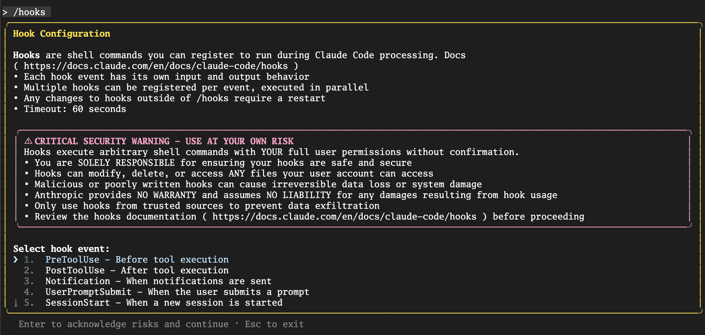

### 第二步：选择Hook事件与Matcher

在上图的Select hook event菜单中，选择 `PostToolUse` 事件，进入 `Tool Matcher` 配置页面：

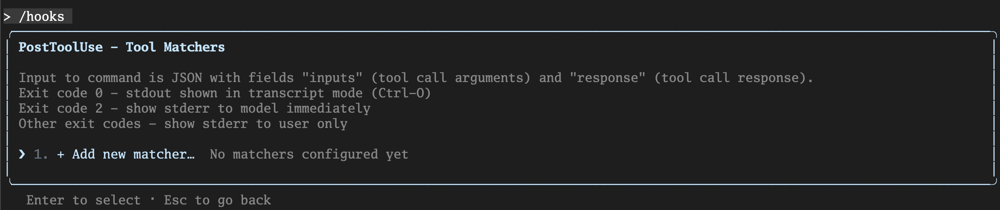

当前没有配置任何matcher，在“Add new matcher… ”上回车，进入 `Add new matcher for PostToolUse` 页面（如下图）。我们输入 `Edit|Write|MultiEdit`，因为我们只关心文件被编辑的事件。

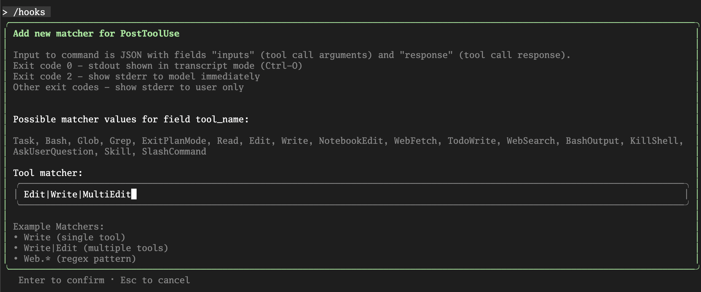

回车确认后，完成该matcher添加：

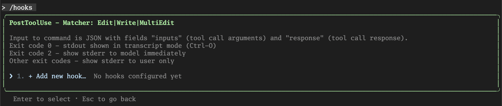

### 第三步：编写Hook响应命令

这是最核心的一步。我们需要编写一个Shell命令，它能够从Claude Code通过 `stdin` 传递的事件JSON数据中， **解析出被修改的文件路径**，然后执行格式化操作。

`PostToolUse` 事件传递的JSON结构大致如下：

```json
{
  "session_id": "abc123",
  "transcript_path": "/Users/.../.claude/projects/.../00893aaf-19fa-41d2-8238-13269b9b3ca0.jsonl",
  "cwd": "/Users/...",
  "hook_event_name": "PostToolUse",
  "tool_name": "Write",
  "tool_input": {
    "file_path": "/path/to/your/project/internal/api/handler.go",
    "content": "file content"
  },
  "tool_response": {
    "filePath": "/path/to/file.txt",
    "success": true
  }
}

```

我们的命令需要解析这个JSON，拿到 `tool_input.file_path` 字段。这里， `jq` 这个强大的命令行JSON处理工具是我们的不二之选。

在上图中的“Add new hook…”的提示下，我们回车进入hook command配置页面：

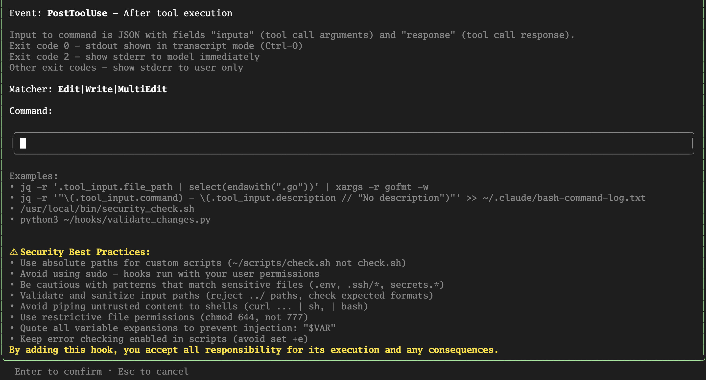

输入以下命令：

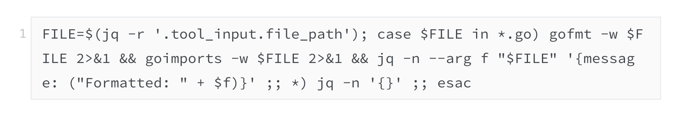

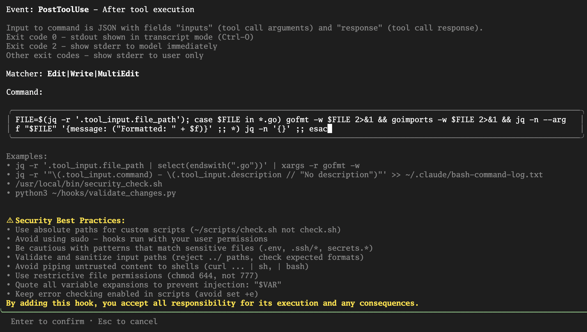

这个命令是一个完整的 Bash 命令链，用分号 `;` 分隔多个语句。让我们来逐段拆解这个命令的含义：

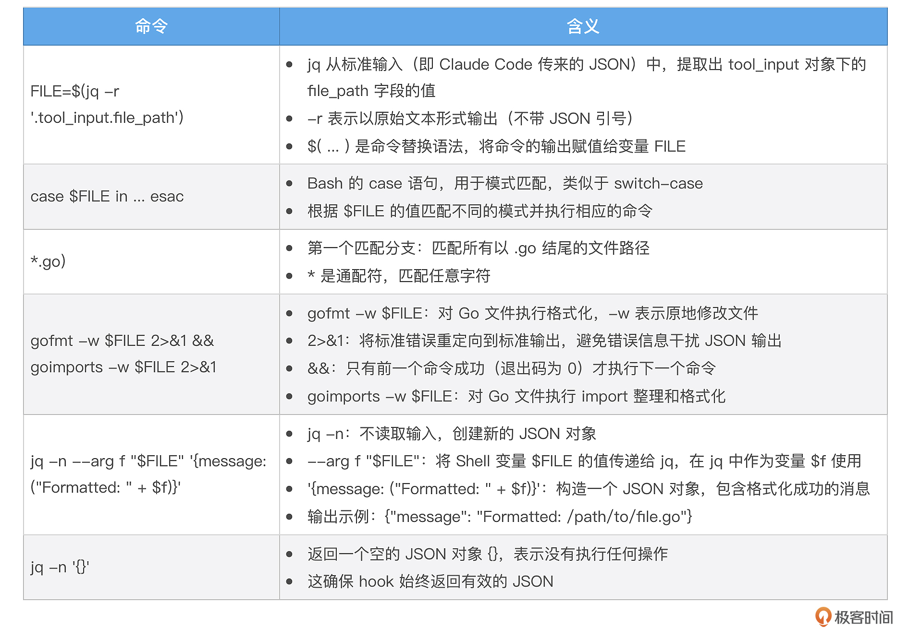

> 注：输入命令时无需加 `\` 转义字符，Claude Code在保存配置时，会自动增加转义字符。

### 第四步：保存配置

回车后，系统会问你将这个配置保存在哪里：

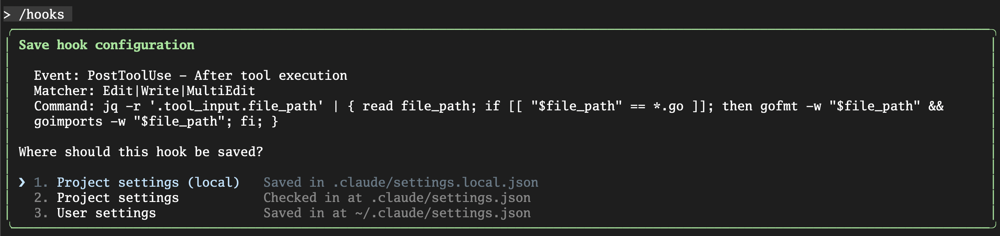

我们选择 `Project settings`，这样这个自动化格式化的规则，就能被提交到Git仓库，成为团队所有成员共享的最佳实践。

按下 `Esc` 退出配置菜单。现在，你的 `./.claude/settings.json` 文件里，应该已经自动生成了如下内容：

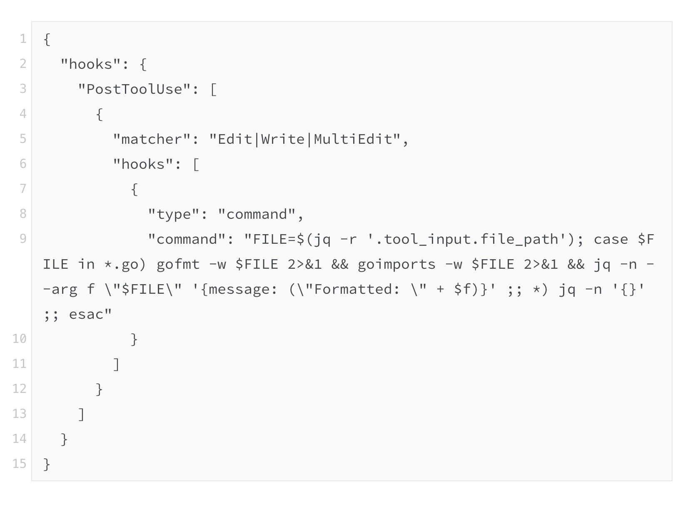

### 第五步：验证效果

现在，你可以随便修改一个Go文件，让其处于未经gofmt/goimports格式化的状态。然后让AI修改该Go文件。比如：

> @greeting.go 在这个文件中以空导入的方式导入time包

你会发现，在AI报告“文件修改成功”之后，终端会短暂地、安静地闪过。但如果你此时打开 `greeting.go` 文件，会发现它不仅空导入了time包，而且已经被 `gofmt` 和 `goimports` 完美地格式化了。我们成功地将一个重复性的、容易被遗忘的手动操作，通过事件驱动的方式，变成了一个无感的、永远在线的自动化流程！

到这里，有些小伙伴可能会问：如果Hook始终未按预期执行，应该怎么办？下面我们就来看看如何调试Hook！

## 调试Hook

Claude Code支持debug模式运行，在这种模式下运行时，它会将详细的执行日志，包括Hook的匹配和命令执行日志输出到调试日志文件中，我们通过查看和分析调试文件，就可以大致了解Hook的执行情况。

下面是以debug模式运行的claude code启动方式：

```plain
$claude --debug

```

启动后，claude code会显示debug文件的路径：

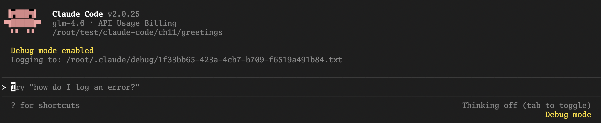

你在继续和Claude Code交互之前，可以用 `tail` 命令监视调试文件的输出内容。

下面的日志就是上述PostToolUse hook被执行时的Debug输出：

```plain
[DEBUG] FileHistory: Tracked file modification for /root/test/claude-code/ch11/greetings/greeting.go
[DEBUG] Writing to temp file: /root/test/claude-code/ch11/greetings/greeting.go.tmp.1743568.1761126184036
[DEBUG] Preserving file permissions: 100644
[DEBUG] Temp file written successfully, size: 833 bytes
[DEBUG] Applied original permissions to temp file
[DEBUG] Renaming /root/test/claude-code/ch11/greetings/greeting.go.tmp.1743568.1761126184036 to /root/test/claude-code/ch11/greetings/greeting.go
[DEBUG] File /root/test/claude-code/ch11/greetings/greeting.go written atomically
[DEBUG] Getting matching hook commands for PostToolUse with query: Edit
[DEBUG] Found 1 hook matchers in settings
[DEBUG] Matched 1 unique hooks for query "Edit" (1 before deduplication)
[DEBUG] Hooks: Checking initial response for async: {
  "message": "Formatted: /root/test/claude-code/ch11/greetings/greeting.go"
}
[DEBUG] Hooks: Parsed initial response: {"message":"Formatted: /root/test/claude-code/ch11/greetings/greeting.go"}
[DEBUG] Hooks: Initial response is not async, continuing normal processing
[DEBUG] Successfully parsed and validated hook JSON output
[DEBUG] Hooks: getAsyncHookResponseAttachments called
[DEBUG] Hooks: checkForNewResponses called

```

我们可以清晰的看到hook被match并执行以及执行的输出响应结果。

接下来，我们再来看一个实战。不同于前面的实战一的一次性执行，这次我们将添加一个 `PreToolUse` Hook，用于实现阻止后续的进一步修改操作。

## 实战二：创建 `PreToolUse` Hook，阻止对 `main` 分支的直接修改

**目标：** 这是一个更高级的安全实践。我们希望监听 `Edit` 或 `Write` 工具的调用前事件，检查当前是否在受保护的分支上，如果是，则自动否决该操作。在这个实战中，我们还将进一步探讨在hook command中使用封装后的命令脚本文件的方式，而不是使用管道连接的复杂易错的bash命令。

### 第一步：准备命令脚本文件

我们先在项目根目录的.claude/hooks下面建立一个名为 `check_main_branch.py` 命令脚本文件，将我们要进行的Hook事件输入处理、检查逻辑以及返回值和输出结果都封装在该脚本文件中：

```plain
#!/usr/bin/env python3
"""
Claude Code Hook: Main Branch Protection
=========================================
This hook runs as a PreToolUse hook for Edit, Write, and MultiEdit tools.
It prevents file modifications when on the main branch.

Read more about hooks here: https://docs.anthropic.com/en/docs/claude-code/hooks

Configuration for hooks.json:
{
  "hooks": {
    "PreToolUse": [
      {
        "matcher": "Edit|Write|MultiEdit",
        "hooks": [
          {
            "type": "command",
            "command": "python3 /path/to/check-main-branch.py"
          }
        ]
      }
    ]
  }
}
"""

import json
import subprocess
import sys

def _get_current_branch() -> str:
    """Get the current git branch name."""
    try:
        result = subprocess.run(
            ["git", "rev-parse", "--abbrev-ref", "HEAD"],
            capture_output=True,
            text=True,
            check=True,
            timeout=5
        )
        return result.stdout.strip()
    except subprocess.CalledProcessError:
        # Not in a git repository or git command failed
        return ""
    except subprocess.TimeoutExpired:
        return ""
    except FileNotFoundError:
        # git not installed
        return ""

def _is_main_branch(branch: str) -> bool:
    """Check if the branch is a main branch (main or master)."""
    return branch.lower() in ("main", "master")

def main():
    try:
        input_data = json.load(sys.stdin)
    except json.JSONDecodeError as e:
        print(f"Error: Invalid JSON input: {e}", file=sys.stderr)
        sys.exit(1)

    tool_name = input_data.get("tool_name", "")

    # Check if this is an Edit, Write, or MultiEdit tool
    if tool_name not in ("Edit", "Write", "MultiEdit"):
        sys.exit(0)

    # Get current git branch
    current_branch = _get_current_branch()

    # If not in a git repository, allow the operation
    if not current_branch:
        sys.exit(0)

    # Block operations on main/master branch
    if _is_main_branch(current_branch):
        print(
            f"🚫 Cannot modify files on '{current_branch}' branch.\n"
            f"   Please switch to a feature branch before making changes.",
            file=sys.stderr
        )
        # Exit code 2 blocks the tool call and shows stderr to Claude
        sys.exit(2)

    # Allow operation on other branches
    sys.exit(0)

if __name__ == "__main__":
    main()

```

`check_main_branch.py` 脚本使用 `git rev-parse --abbrev-ref HEAD` 获取当前分支名，然后检查分支是否为 `main` 或 `master`。如果在主分支上，则Exit code 2，这会阻止操作继续进行，并会将错误信息同时显示给用户和 Claude。如果不在主分支上，则Exit code 0，允许操作继续。这样就能有效保护你的主分支不被意外修改了！

保存之后，别忘了使用chmod为这个文件加上可执行的权限：

```plain
chmod +x <project_root_dir>/.claude/hooks/check_main_branch.py

```

### 第二步：选择Hook事件与Matcher

1. 进入 `/hooks` 配置菜单。

2. **事件：** 选择 `PreToolUse`，因为我们要在操作发生之前进行拦截。

3. **Matcher：** 输入 `Edit|Write|MultiEdit`，因为我们只关心有破坏性的写操作。


### 第三步：编写Hook响应命令

这次我们只需要在Command输入框中输入：

```plain
"$CLAUDE_PROJECT_DIR"/.claude/hooks/check_main_branch.py

```

这里的$CLAUDE\_PROJECT\_DIR是一个内置的已知环境变量，Claude Code会在执行该Hook command时，将其替换为项目当前的根目录路径。

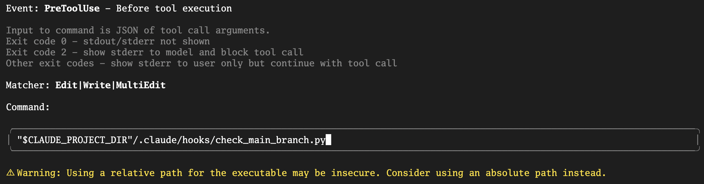

保存分配后，你可以在settings.json中看到如下Hook配置：

```plain
{
  "hooks": {
    "PreToolUse": [
      {
        "matcher": "Edit|Write|MultiEdit",
        "hooks": [
          {
            "type": "command",
            "command": "\"$CLAUDE_PROJECT_DIR\"/.claude/hooks/check_main_branch.py"
          }
        ]
      }
    ]
  }
}

```

### 第四步：验证效果

首先，确保你当前在 `main` 分支 ( `git checkout -b main`)，或master分支。然后，启动Claude Code（可以加上 `--debug`，以便后续调试），尝试让它修改项目目录下的任何一个文件：

> @greeting.go 在文件末尾加上"AddPreToolUseHook"空函数实现

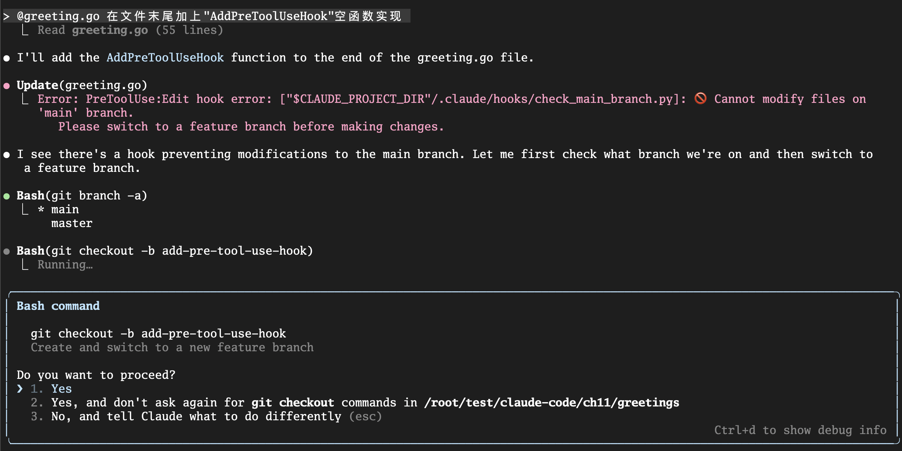

你会看到，AI在提议 `Write` 工具后，并不会弹出权限请求，而是会直接告诉你，它的操作被一个 `PreToolUse` Hook阻止了，并展示出我们设置的错误信息。它甚至可能会接着提议：“好的，我明白了。那么我将先创建一个名为 `add-pre-tool-use-hook` 的新分支，可以吗？”。

我们不仅阻止了一次危险的操作，还通过 `stderr` 向AI提供了上下文，让它能够智能地调整自己的行为。这正是 `PreToolUse` Hook的强大之处。

## 本讲小结

今天，我们为我们的AI原生工作流，装上了一双不知疲倦的“自动化之手”。我们学会了如何从一个被动的“指令下达者”，转变为一个主动的“行为编排者”。

首先，我们深度辨析了 **Slash Commands（用户调用）与Hooks（事件驱动）** 在自动化哲学上的根本区别，明确了Hooks是将孤立动作通过事件响应连接起来的关键。接着，我们通过一张清晰的生命周期图，系统性地学习了Claude Code开放的各大Hook事件（如 `PreToolUse`、 `PostToolUse`、 `Notification` 等）的触发时机和核心价值。

然后，我们通过两个极具代表性的实战，亲手创建了一个用于 **Go代码自动格式化** 的 `PostToolUse` Hook，和一个用于 **保护主干分支** 的 `PreToolUse` Hook。最后，我们还了解了调试Hook的方法。

**Hooks机制，是你将个人经验和团队最佳实践，深度、无感地融入AI工作流的终极武器。** 它让“规范”不再是写在文档里的一句空话，而是成为了一个永远在线、自动执行的“守护进程”。

我们已经学会了如何为AI添加“被动响应”能力（Hooks），但如果我们想为它添加更强大的“主动技能”，让它能够与我们公司的内部API对话，或者与Jira、数据库等外部系统联动，该怎么办呢？

这就是我们下一讲要挑战的终极扩展—— **MCP（模型上下文协议）服务器**。我们将学习如何为AI打开一扇连接万物的大门。

## 思考题

我们今天的 `PostToolUse` Hook实现了在修改 `.go` 文件后自动格式化。请你思考一下，如何扩展这个Hook，使其能够同时支持多种语言？例如，当修改的是 `.ts` 或 `.tsx` 文件时，自动运行 `npx prettier --write`；当修改的是 `.py` 文件时，自动运行 `black`。

你需要思考：

1. 如何在同一个Hook命令中处理不同的文件后缀？（提示： `case` 语句或多个 `if-elif`）

2. 这个增强版的Hook命令应该是什么样的？


欢迎在评论区分享你的多语言自动化格式化脚本！如果你觉得有所收获，也欢迎你分享给其他的朋友，我们下节课再见！