# 12｜终极扩展：深入MCP服务器，将AI连接到任何内外部系统
你好，我是Tony Bai。

在前面的几讲中，我们已经学会了如何通过自定义指令（Slash Commands）和钩子（Hooks）来扩展和自动化AI的行为。我们的AI伙伴已经变得非常“能干”和“主动”。

但是，它的能力边界，仍然被局限在Claude Code的内置工具集（读写文件、执行Shell命令）之内。

- 如果我们想让AI直接查询我们公司的内部知识库来回答问题，该怎么办？

- 如果我们想让AI在发现Bug后，自动到我们的Jira系统里创建一个工单，该怎么办？

- 如果我们想让AI在完成一个Feature的实现后，自动在我们的GitHub项目里创建一个PR，该怎么办？

- 如果我们想让AI直接操作我们的Figma设计稿，将设计转化为代码，又该怎么办？


这些任务，已经远远超出了内置工具的能力范畴。它们需要AI具备一种全新的、与外部世界——无论是公共的云服务，还是你公司内部的私有系统——进行 **结构化、安全** 通信的能力。

这，就是我们今天要解锁的AI Agent能力扩展—— **MCP（Model Context Protocol，模型上下文协议）服务器**。

今天这一讲，我们将深入AI Agent能力扩展的“圣杯”。你将理解MCP为何是连接AI与万物的关键协议，并手把手地学会如何发现、连接、认证和使用一个真实的MCP服务器——GitHub MCP Server。学完之后，你将拥有将AI接入任何API系统的能力，真正打开“连接万物”的大门。

## 超越内置工具：为什么我们需要MCP？

你可能会问，既然Claude Code已经有了强大的 `Bash` 工具，我为什么不能直接在AI的Prompt里，让它用 `curl` 命令去调用Jira的API呢？这是一个非常好的问题。直接使用 `curl` 确实可以在某些简单场景下工作，但这种方式存在着几个致命的缺陷，使得它在严肃的、生产级的应用中难当大任：

1. **脆弱性**：你需要将复杂的API调用细节（URL、请求头、JSON Body结构）全部写在自然语言的Prompt里。这不仅极其繁琐，而且极易出错。AI可能会误解你的意图，生成一个错误的 `curl` 命令，导致调用失败。

2. **安全性**：如果API需要认证，你就必须将你的 `API_KEY` 或 `TOKEN` 直接暴露在Prompt中。这存在着巨大的安全风险，你的密钥可能会被记录在对话历史中，甚至意外泄露。

3. **无状态**： `curl` 是无状态的。如果一个操作需要多步（比如OAuth认证），AI很难管理和维持这个状态。

4. **发现性差**：AI并不知道你的API到底有哪些能力（Endpoints）、需要什么参数。它完全依赖于你在Prompt中提供的“文档”。


**MCP的诞生，正是为了系统性地解决以上所有问题**。MCP并非一个具体的工具，而是一套 **开放的、为AI Agent量身设计的RPC（远程过程调用）协议**。它定义了一套标准的“对话语言”，让AI Agent可以与外部服务进行高效、安全、结构化的通信。它在AI Agent和外部世界之间，建立了一个安全的、标准化的、具备“服务发现”能力的“抽象层”。

## MCP工作原理：一种为AI设计的RPC协议

要真正精通MCP，我们必须首先理解其协议规范中定义的三个核心角色： **主机（Host）、客户端（Client）和服务器（Server）**。它本质上是一个经典的客户端-服务器模型，但增加了一个“主机”角色，专为AI Agent的复杂协作模式进行了深度优化。

**主机（Host）的角色定位是“总指挥”与“协调者**”。这是用户直接与之交互的应用程序。在我们的世界里：Claude Code本身就是主机。它有3个核心职责：

- 创建和管理与各个服务器连接的客户端实例。

- 执行安全策略，处理用户的权限批准。

- 作为AI大模型与所有客户端之间的桥梁，聚合上下文，分发任务。


**服务器（Server）的角色定位是“能力提供方**”。这是一个独立的程序，可以是本地脚本，也可以是远程服务。在我们的世界里，GitHub MCP Server、我们后面会实战的Airtable服务器等，都是服务器。

它的核心职责是向主机暴露自己的能力。根据MCP规范，服务器可以提供三类核心能力：

1. **工具（Tools）**：这是最核心的能力，即AI可以执行的动作。例如， `create_issue` 就是一个工具。

2. **资源（Resources）**：这是AI可以引用的数据。例如，一个服务器可以暴露 `@github:issue://123` 这样的资源，让AI可以通过 `@` 指令直接获取该Issue的上下文数据。

3. **提示（Prompts）**：这是用户可以调用的工作流模板。服务器可以将一个复杂的、内部优化过的Prompt，封装成一个简单的Slash Command供用户使用，例如 `/mcp__github__list_prs`。


**客户端（Client）的角色定位是“专线连接器”与“协议处理器”**。这是一个由主机在内部创建和管理的组件，用户通常无感知。

主机（Claude Code）为每一个它连接的服务器，都创建一个专属的客户端实例。这个客户端负责与那一个服务器建立 1对1的、有状态的会话，并处理所有底层的协议协商、消息路由和安全边界。

理解了这三个角色之后，我们就能更精确地描绘其核心工作流程。我们常说的“Claude Code与MCP服务器通信”，其背后更精确的描述是：

> 主机（Claude Code）接收到AI模型的Tool Call意图后，通过其内部为特定服务器创建的客户端实例，将这个意图封装成一个标准的MCP协议请求，并发送给该服务器。服务器执行内部逻辑后，通过同一条专线连接，将结果返回给客户端，最终由主机呈现给用户或再次提交给AI模型。

让我们用一个序列图来更直观地描绘一下这个过程：

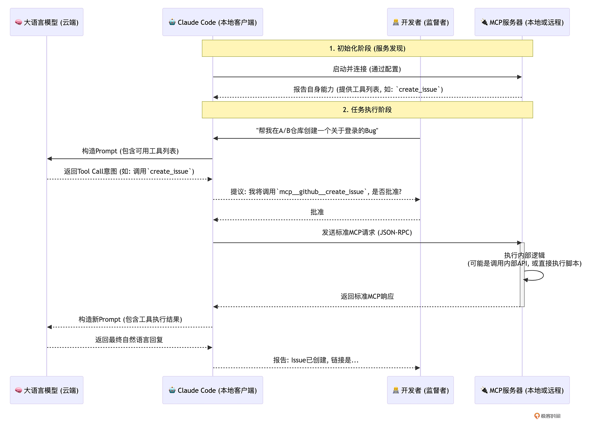

这个流程清晰地揭示了MCP的几个关键特性：

1. **服务发现：** 在连接之初，MCP服务器就会向Claude Code“自我介绍”，告诉AI自己拥有哪些工具（Tools）以及每个工具需要什么参数。

2. **责任分离：** AI大模型只负责根据可用工具列表，产生“调用哪个工具”的意图。Claude Code客户端负责将这个意图，翻译成标准的MCP协议请求。而MCP服务器则只负责响应这个标准协议，执行自身的业务逻辑。

3. **命名空间：** Claude Code会自动为来自不同MCP服务器的工具加上命名空间前缀，格式为 `mcp__<server_name>__<tool_name>`，避免冲突。

4. **认证解耦：** 这是MCP安全模型的核心。整个过程中，AI大模型本身完全不接触任何敏感的API Key或Token。认证凭证的配置发生在主机（Claude Code）侧。主机在启动时，会将这些配置好的凭证安全地注入到运行环境中（通常是通过环境变量）。


## 安装和配置MCP服务器： `claude mcp add` 与三大Scope

要将一个MCP服务器“注册”到Claude Code中，我们主要使用 `claude mcp add` 命令。根据服务器的部署方式，它支持三种 **传输协议（Transport）**：

- `--transport http`：用于连接远程的、通过HTTP提供服务的MCP服务器。

- `--transport sse`：(已废弃) 用于连接老的、通过Server-Sent Events提供服务的服务器。

- `--transport stdio`：用于连接在你 **本地** 运行的、通过标准输入/输出（stdin/stdout）进行通信的MCP服务器。


更重要的是，你需要决定这个服务器配置的 **作用域（Scope）**，这决定了它的可用范围和共享级别。

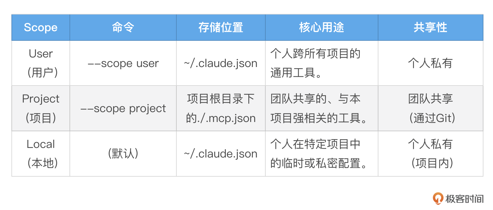

**【最佳实践】** 遵循一个简单的原则：需要团队所有成员都使用的服务，用 `--scope project`；只属于你自己的、跨项目通用的工具，用 `--scope user`；临时的、不想提交到Git的个人测试，使用默认的 `local` scope。

> 注：你可以通过 `claude mcp add/list/get/remove` 对MCP Server进行管理。

理论已经足够，现在让我们通过两个由简到繁的实战，来亲手将这些强大的能力集成到我们的工作流中。

## 实战一：从“Hello, World”开始——用Go构建你的第一个本地stdio服务器

让我们从一个最纯粹、最简单的场景开始：创建一个没有任何外部依赖、不需要任何API Key的“Hello, World”级别的本地MCP服务器。这个练习的目标，是让你抛开一切干扰，只聚焦于MCP的 **核心工作机制**，并且是在我们最熟悉的 **Go语言环境** 中。

我们将创建一个名为 `greet` 的工具，当你调用它并传入一个名字时，它会返回一句问候。

### 第一步：编写服务器Go程序（ `hello-mcp-server.go`）

在你的项目根目录下，创建一个名为 `hello-mcp-server.go` 的文件，并将以下Go代码完整地粘贴进去。

```go
// hello-mcp-server.go
package main

import (
    "bufio"
    "encoding/json"
    "fmt"
    "log"
    "os"
)

// 定义通用的请求和响应结构体，以匹配MCP的JSON-RPC格式
type Request struct {
    JSONRPC string          `json:"jsonrpc"`
    ID      any             `json:"id"`
    Method  string          `json:"method"`
    Params  json.RawMessage `json:"params"`
}

type Response struct {
    JSONRPC string `json:"jsonrpc"`
    ID      any    `json:"id"`
    Result  any    `json:"result,omitempty"`
    Error   *Error `json:"error,omitempty"`
}

type Error struct {
    Code    int    `json:"code"`
    Message string `json:"message"`
}

func main() {
    // MCP服务器通过标准输入/输出进行通信，所以我们需要一个扫描器来读取stdin
    scanner := bufio.NewScanner(os.Stdin)
    for scanner.Scan() {
        line := scanner.Bytes()

        // 读取每一行（通常是一个JSON-RPC请求），并尝试解析
        var req Request
        if err := json.Unmarshal(line, &req); err != nil {
            log.Printf("Error unmarshaling request: %v", err)
            continue
        }

        // 根据请求的Method字段，路由到不同的处理函数
        switch req.Method {
        case "initialize":
            handleInitialize(req)
        case "tools/list":
            handleToolsList(req)
        case "tools/call":
            handleToolCall(req)
        case "notifications/initialized":
            // 客户端发送的初始化完成通知，无需响应
            continue
        default:
            sendError(req.ID, -32601, "Method not found")
        }
    }
}

// handleInitialize负责向Claude Code"自我介绍"
func handleInitialize(req Request) {
    // 符合MCP协议的initialize响应
    initializeResult := map[string]any{
        "protocolVersion": "2024-11-05", // MCP协议版本
        "capabilities": map[string]any{
            "tools": map[string]any{}, // 声明支持工具能力
        },
        "serverInfo": map[string]any{
            "name":    "hello-server",
            "version": "1.0.0",
        },
    }
    sendResult(req.ID, initializeResult)
}

// handleToolsList返回可用工具列表
func handleToolsList(req Request) {
    toolsListResult := map[string]any{
        "tools": []map[string]any{
            {
                "name":        "greet",
                "description": "A simple tool that returns a greeting.",
                "inputSchema": map[string]any{
                    "type": "object",
                    "properties": map[string]any{
                        "name": map[string]any{
                            "type":        "string",
                            "description": "The name of the person to greet.",
                        },
                    },
                    "required": []string{"name"},
                },
            },
        },
    }
    sendResult(req.ID, toolsListResult)
}

// handleToolCall负责处理工具的实际调用
func handleToolCall(req Request) {
    var params map[string]any
    if err := json.Unmarshal(req.Params, &params); err != nil {
        sendError(req.ID, -32602, "Invalid params")
        return
    }

    toolName, _ := params["name"].(string)
    if toolName != "greet" {
        sendError(req.ID, -32601, "Tool not found")
        return
    }

    toolArguments, _ := params["arguments"].(map[string]any)
    name, _ := toolArguments["name"].(string)

    // 这是我们工具的核心逻辑
    greeting := fmt.Sprintf("Hello, %s! Welcome to the world of MCP in Go.", name)

    // MCP期望的响应格式
    toolResult := map[string]any{
        "content": []map[string]any{
            {
                "type": "text",
                "text": greeting,
            },
        },
    }
    sendResult(req.ID, toolResult)
}

// sendResult和sendError是辅助函数，用于向stdout发送格式化的JSON-RPC响应
func sendResult(id any, result any) {
    resp := Response{JSONRPC: "2.0", ID: id, Result: result}
    sendJSON(resp)
}

func sendError(id any, code int, message string) {
    resp := Response{JSONRPC: "2.0", ID: id, Error: &Error{Code: code, Message: message}}
    sendJSON(resp)
}

func sendJSON(v any) {
    encoded, err := json.Marshal(v)
    if err != nil {
        log.Printf("Error marshaling response: %v", err)
        return
    }
    // MCP协议要求每个JSON对象后都有一个换行符
    fmt.Println(string(encoded))
}

```

这个Go程序就是一个功能完整的MCP服务器。它虽然简单，但 **完美地实现了MCP stdio 协议的核心**：

1. 通过 `main` 函数循环读取标准输入。

2. 通过 `handleInitialize` 函数，响应客户端的初始化请求，声明服务器的协议版本、能力和基本信息。

3. 通过 `handleToolsList` 函数，响应工具列表查询请求，报告自己拥有一个名为 `greet` 的工具。

4. 通过 `handleToolCall` 函数，处理对 `greet` 工具的调用，执行业务逻辑，并返回结果。

5. 通过辅助函数，将所有响应以标准的JSON-RPC格式写回标准输出。


### 第二步：注册MCP服务器

现在，打开终端，执行以下命令，将这个本地Go程序“注册”为一个Claude Code可以调用的MCP服务器。

```bash
claude mcp add --transport stdio hello -- go run ./hello-mcp-server.go

```

让我们来深度解读这条命令：

- `claude mcp add`：我们正在添加一个新的MCP配置。

- `--transport stdio`：告诉Claude Code，这是一个通过标准输入输出通信的本地服务器。

- `hello`：我们给这个服务器命名为 `hello`，它将成为我们工具的命名空间。

- `--`：重要的分隔符，后面是启动服务器的实际命令。

- `go run ./hello-mcp-server.go`：这是编译并运行我们刚刚创建的Go程序的命令。Claude Code在需要时，会自动在后台执行这个命令来启动我们的服务器。


执行后，Claude Code会将这个配置保存在你项目本地（ `local` scope）。我们可以通过claude mcp list命令来验证该mcp服务器是否可以连接成功：

```plain
$claude mcp list
Checking MCP server health...

hello: go run ./hello-mcp-server.go - ✓ Connected

```

如果看到类似上面的 `Connected` 的输出，则说明我们的MCP Server是正常工作的！

### 第三步：验证与使用

启动Claude Code：

```bash
claude

```

在启动后，我们可以通过 `/mcp` 斜杠命令查看mcp server列表和状态：

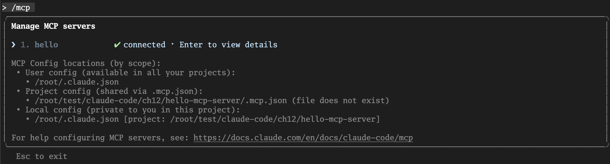

现在，让我们来调用这个全新的、由Go驱动的工具！请记住，工具的完整名称是 `mcp__<server_name>__<tool_name>`（这个我们在稍后的内容中还会有专门的说明）。

```bash
> 我想调用 mcp__hello__greet 工具，名字是 Tony Bai。

```

AI会理解你的意图，并向你提议一个工具调用。你批准后，会立即看到由我们的Go程序返回的结果：

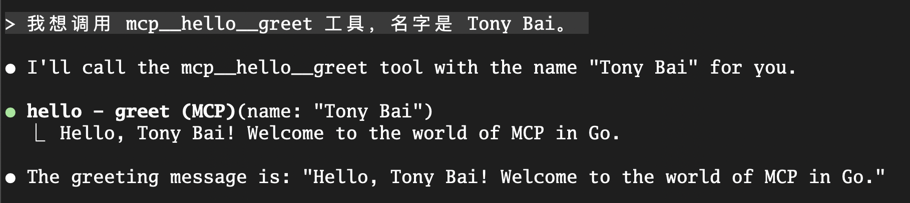

恭喜你！你已经成功地创建并连接了你的第一个、用Go语言编写的MCP服务器。这个简单的闭环，清晰地展示了从 **定义能力**（ `handleInitialize`），到 **注册能力**（ `claude mcp add`），再到 **调用能力**（自然语言 -\> Tool Call）的全过程。更重要的是，你现在已经亲手触摸到了MCP协议的底层脉搏。

掌握了如何构建和连接本地 `stdio` 服务器后，我们就拥有了为AI添加任何自定义脚本能力的基础。现在，让我们将视野从本地扩展到云端，挑战一个更强大、也更具普遍性的场景。

## 实战二：连接远程服务——集成GitHub MCP Server

在这个实战中，我们将不再自己编写服务器，而是学习如何 **连接和使用一个由第三方（在这里是GitHub官方）提供的、运行在云端的的远程MCP服务器**。这是你在实际工作中更常遇到的场景，例如连接公司内部的API网关，或集成SaaS服务。

我们将要集成的GitHub MCP Server，能赋予AI直接操作GitHub仓库的超能力，比如创建Issue、发表评论、搜索代码等等。

### 第一步：获取并配置认证 (Personal Access Token)

与外部服务交互，第一步永远是解决认证问题。与GitHub API通信，需要一个Personal Access Token (PAT)。

1. 前往你的GitHub开发者设置页面下的 [Personal access tokens 页面](https://github.com/settings/personal-access-tokens)。

2. 选择“Fine-grained tokens"菜单项，点击“Generate new token”。

3. 为这个Token命名，例如 `claude-code-mcp-token`。

4. **最关键的一步：授权**。你需要为这个Token授予相应的权限。对于我们接下来的实战，请在 `Repository access` 部分，选择 `Only select repositories`，找到你希望AI操作的目标仓库（例如我们的 `issue2md` 项目），并至少授予以下权限（如下图）：
   1. **Issues**：Read and write

   2. **Pull Requests**：Read and write

   3. **Contents**：Read-only (如果需要AI读取文件内容)

   4. **Metadata**：Read-only
5. 生成Token，并立即 **复制并妥善保管**。它只会出现一次。


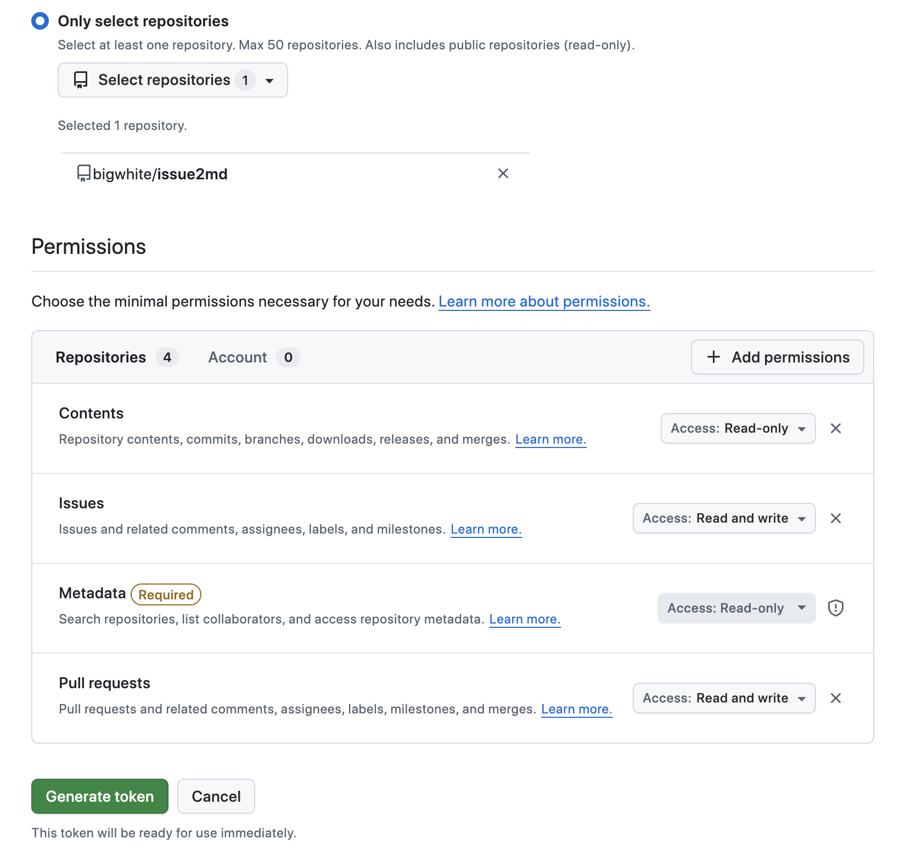

**【安全最佳实践】** 我们绝不能将这个Token硬编码到任何配置文件中。最安全、最灵活的方式，是将其设置为一个环境变量。在你的终端中执行：

```bash
export GITHUB_TOKEN="ghp_YourGitHubTokenHere"

```

请务必将 `ghp_...` 替换为你刚刚生成的真实Token。在每次开启新的终端会话时，你可能都需要重新设置这个环境变量。为了方便，你可以将这行命令添加到你的Shell配置文件中（如 `~/.zshrc` 或 `~/.bash_profile` 或 `~/.bashrc`）。

### 第二步：注册远程MCP服务器（HTTP Transport）

现在，我们将使用 `claude mcp add-json` 命令，将GitHub官方提供的远程MCP服务器“注册”到我们的Claude Code中。

打开终端，执行以下命令。请注意，你需要将 `<YOUR_GITHUB_PAT>` 替换为你刚刚生成的真实Token。

```bash
claude mcp add-json github '{"type":"http","url":"https://api.githubcopilot.com/mcp/","headers":{"Authorization":"Bearer ${GITHUB_TOKEN}"}}' --scope project

```

让我们来深度解读这条命令的每一个部分：

- `claude mcp add-json`：我们通过直接传递 JSON 配置的方式来添加一个新的 MCP 配置。

- `"type":"http"`：告诉Claude Code，这是一个通过HTTP协议进行通信的远程服务器。

- `github`：我们为这个服务器命名为 `github`，它将成为工具的命名空间前缀。

- `https://api.githubcopilot.com/mcp/`：这是GitHub官方提供的MCP服务器的端点URL。

- `--header "Authorization: Bearer <YOUR_GITHUB_PAT>"`：这是在远程、非交互式环境中进行认证的核心！通过 `--header` 参数，我们为所有发送到这个MCP服务器的HTTP请求，都预先设置了一个 `Authorization` 请求头。其值就是标准的 `Bearer` 认证方案，后面跟着你的Personal Access Token。这完美地解决了在远程虚拟机上无法打开浏览器进行OAuth 2.0认证的问题。

- `--scope project`：我们将这个配置保存在项目作用域。执行后，Claude Code会在你的当前目录下创建一个 `.mcp.json` 文件，并将这个服务器配置写进去。将这个文件提交到Git仓库，你的整个团队就能共享这个配置了（当然，每个成员都需要在自己的环境中设置各自的Token）。


执行成功后，你的 `.mcp.json` 文件内容会是这样的：

```json
{
  "mcpServers": {
    "github": {
      "type": "http",
      "url": "https://api.githubcopilot.com/mcp/",
      "headers": {
        "Authorization": "Bearer ${GITHUB_TOKEN}"
      }
    }
  }
}

```

### 第三步：检查MCP Server连接状态以及能力列表

配置完MCP Server后，我们可以通过下面命令查看该MCP Server的连接情况：

```plain
claude mcp list
Checking MCP server health...

github: https://api.githubcopilot.com/mcp/ (HTTP) - ✓ Connected

```

当然，我们也可以进入claude交互页面，通过 `/mcp` 斜杠命令查看：

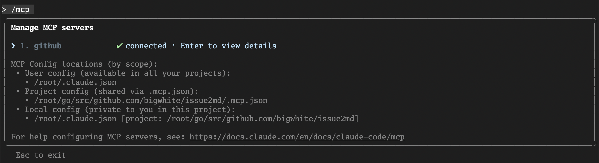

回车后，查看 `github` mcp服务器的详细信息：

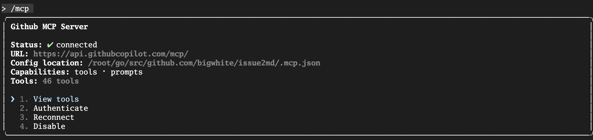

选择 `View tools`，我们将看到 `github` MCP服务器注册的能力列表：

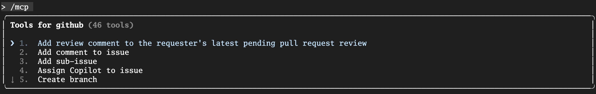

### 第四步：实战！用自然语言操作GitHub

万事俱备。现在，我们可以像与一位项目助理对话一样，用自然语言来操作GitHub了。

**任务**：在 `issue2md` 项目中，创建一个新的issue，标题为test issue for claude code，然后添加一条评论，最后关闭该issue。

我们先来创建一个新issue：

```bash
> 为该项目创建一个github issue，标题是"test for claude code"

```

下面是Claude Code的执行过程：

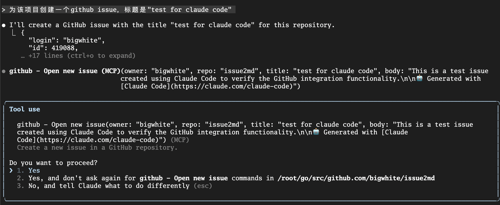

Claude Code思考后，发现这个任务需要调用github mcp server提供的创建issue工具( `mcp__github__create_issue`)。它会向你提议一个包含了创建issue的工具调用，你批准后，Claude Code会调用工具创建该issue：

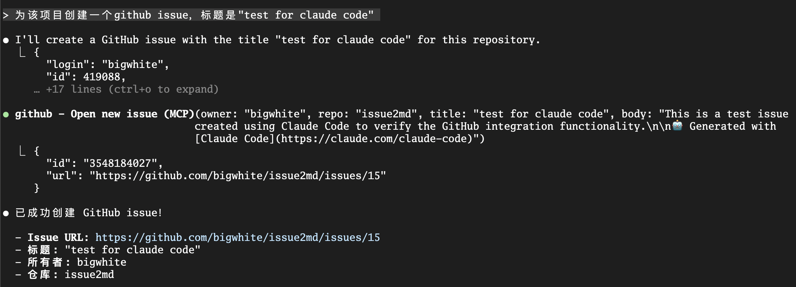

通过github页面，我们也能查看到新创建的issue：

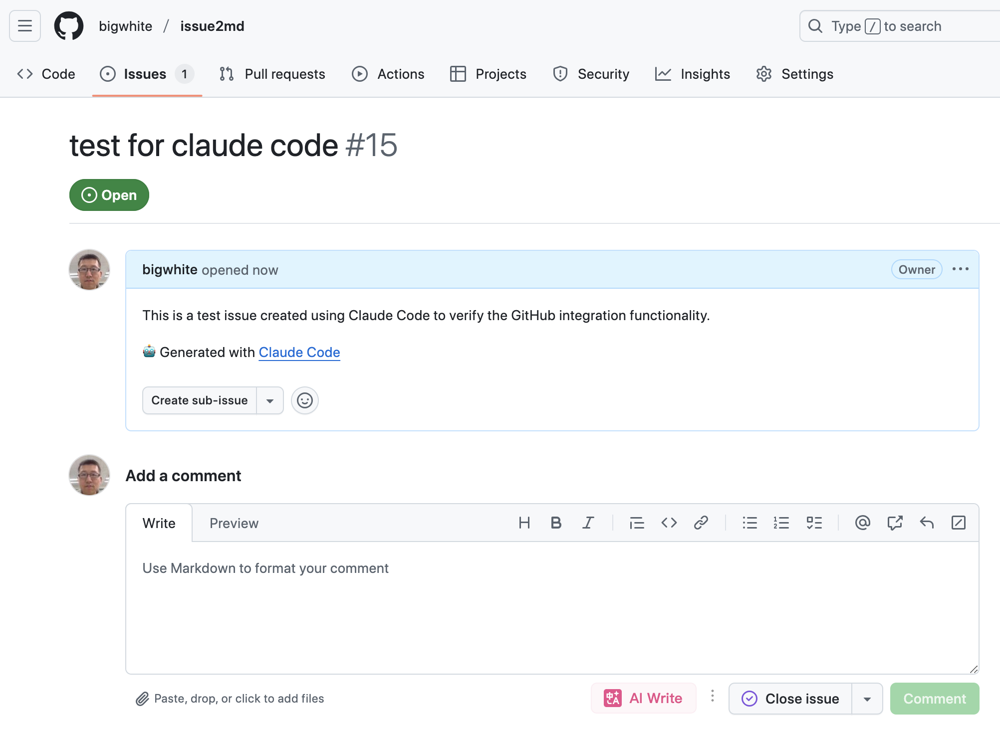

接下来，我们让Claude Code为该issue添加一条评论：

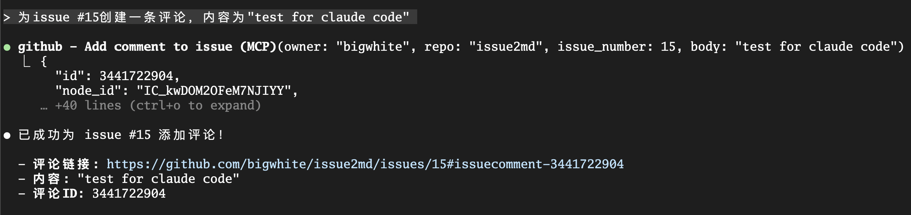

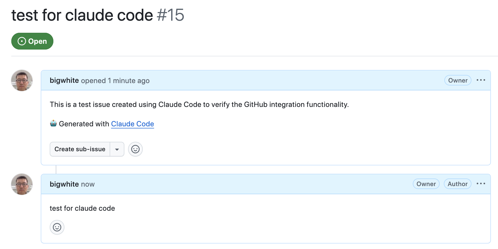

然后再关闭该issue：

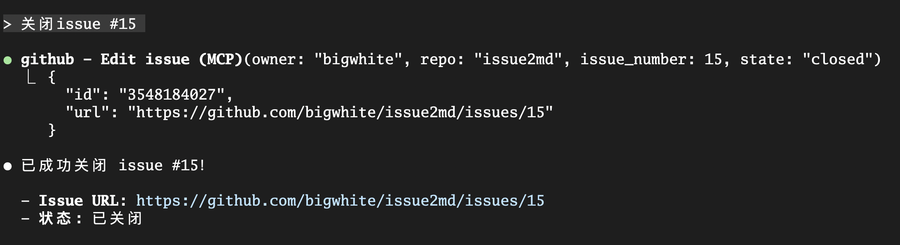

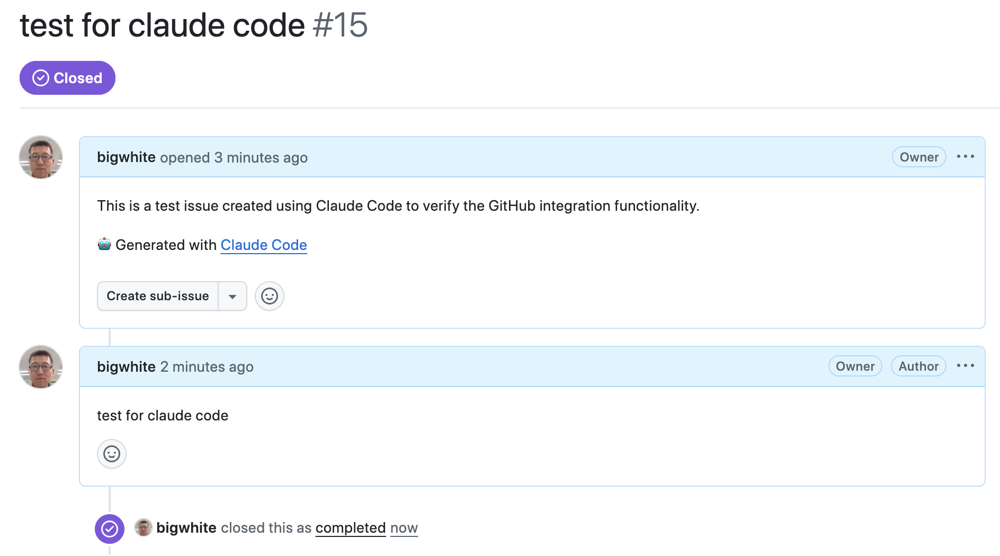

**这，就是远程MCP的威力。** 我们没有在本地运行任何复杂的服务，仅仅通过几行配置和一个环境变量，就将AI与一个强大的云端服务无缝地连接了起来。

## MCP的高级用法：将Prompts变为指令

MCP的强大之处，不仅在于暴露“工具（Tools）”，还在于可以暴露“ **提示（Prompts）**”。一个设计良好的MCP服务器，可以将其内部复杂的、经过优化的Prompt，封装成一个简单的Slash Command，供你在Claude Code中直接调用。

**工作原理：**

1. MCP服务器在向Claude Code“自我介绍”时，除了工具列表，还会提供一份“ **Prompt列表**”。
2. Claude Code会自动将这些Prompt，转换为 `mcp__<server_name>__<prompt_name>` 格式的Slash Commands。

**实战场景：**

假设GitHub MCP Server提供了一个名为 `list_prs` 的Prompt。你不再需要自己费力地去写：“请帮我调用 `mcp__github__list_issues` 工具，并使用 `is:pr is:open author:@me` 这样的查询…”，你只需要：

```bash
> /mcp__github__list_prs

```

按下回车，Claude Code就会自动执行那个预设好的、最优化的Prompt，直接为你列出所有你创建的、开放的PR。

这极大地降低了使用复杂工具的门槛，将MCP服务器作者的最佳实践，直接赋能给了最终用户。当你使用 `/` 并按 `Tab` 时，所有来自MCP服务器的指令都会出现在自动补全列表中。

## 本讲小结

今天，我们一起解锁了Claude Code乃至所有AI Agent最强大的能力——连接外部世界。我们不再满足于让AI在本地的“沙盒”里工作，而是为它装上了可以触及云端服务的“长臂”。

首先，我们深度理解了MCP的工作原理，精准地辨析了主机（Host）、服务器（Server）、客户端（Client）三个核心角色，以及服务器可以向主机暴露的 **工具、资源、提示** 三大能力类型。

接着，我们系统性地学习了如何通过 `claude mcp add` 命令和三种Scope（User、Project、Local）来安装和管理MCP服务器，为不同的协作场景建立了清晰的配置心智模型。

然后，也是最核心的部分，我们通过两个由简到繁的实战，获得了宝贵的动手经验：我们亲手用Go语言构建并连接了一个极简的本地 `stdio` 服务器，获得了第一手的协议体感；接着，我们更进一步，学会了如何连接一个强大的远程HTTP服务（GitHub），并掌握了在非交互式环境中通过 **环境变量安全管理密钥** 的关键实践。

最后，我们还了解了MCP的一个高级特性—— **将Prompts变为Slash Commands**，看到了将复杂工作流封装为简单指令的巨大潜力。

掌握了MCP，你的AI Agent才真正从一个“本地开发工具”，进化为了一个能够接入你的整个技术生态、具备无限潜能的“自动化中枢”。然而，我们到目前为止所学的扩展方式——无论是我们主动调用的Slash Commands，还是AI根据意图选择的MCP工具——都还是一种“授人以鱼”的模式。我们给了AI强大的“渔具”（工具），但还没有系统性地教会它在不同水域（场景）下的“钓鱼技巧”（成套的方法论）。

我们如何将一整套关于‘如何审查Go代码’的专家知识，打包成一个AI在看到 `.go` 文件时就能自主发现并加载的‘技能包’，而不是每次都依赖我们通过冗长的Prompt来指导？

这就是我们下一讲要探讨的主题：智能涌现的基石——精通Agent Skills，为AI植入专家能力。我们将学习如何将我们的知识和最佳实践，打包成AI可以自主发现和调用的“知识胶囊”，让AI从一个“熟练的工具使用者”，进化为一个能根据情境自主加载专家能力的“博学思考者”。

## 思考题

今天我们学习了如何连接GitHub MCP Server。请你打开思路，设想一个你认为最有价值的、可以被封装成MCP服务器的内部工具或服务。这个服务是做什么的？它可能会向AI暴露哪些工具（Tools）？将它接入Claude Code后，可以实现哪些目前难以完成的自动化工作流？例如，一个连接公司内部“代码片段知识库”的MCP Server？一个用于查询“线上服务监控指标”的MCP Server？欢迎在评论区分享你的脑洞和创意！如果你觉得这节课的内容对你有帮助的话，也欢迎你分享给需要的朋友，我们下节课再见！