# 前沿技术速递｜Agent Teams：打造你的第一支“虚拟研发团队”
你好，我是Tony Bai。

时光飞逝，转眼我们已经来到了2026年。

回顾过去的一年，如果说2025年是Coding Agent的元年，以Claude Code为代表的工具让“自然语言编程”真正成为了现实；那么2026年，我们正站在一个新的风口之上——Agent Orchestration（智能体编排）。

在专栏之前的课程中，我们已经精通了如何与单个Claude Code实例进行深度协作，甚至学会了用Sub-agent让它在同一个会话中“切换人格”。但这仍然是一个“单兵作战”的模式。随着任务复杂度的提升，单个Agent的上下文窗口（Context Window）和注意力很容易成为瓶颈。

我们不禁会想：如果能同时召唤多个Claude Code，让它们像一个真实的开发团队那样，有分工、有协作、甚至互相Code Review，会是怎样的景象？

Claude Code最近在2.1.32版本中发布的重磅实验特性—— **Agent Teams（智能体团队）**，正是对这一未来的提前兑现。

今天这篇加餐，我就带你深入了解这个代表未来的新特性。我们将跳出“人机结对”的框架，尝试扮演一次“技术总监”，指挥一支由AI组成的“虚拟研发团队”，去并行解决一个全栈开发问题。

## Agent Teams：从“单兵”到“集群”的范式跃迁

首先，我们需要厘清Agent Teams与我们之前学过的Sub-agents（第14讲）有何本质区别。

Sub-agents（智能分身）是在同一个会话中，通过加载不同的System Prompt来切换AI的角色，通常执行专注于结果导向的任务。虽然不会“继承”主Agent的上下文，不会因为主Agent的上下文过长干扰Sub-agent的工作任务，但一个 Claude Code 会话一次只能执行一个Sub-agent，是串行的。在项目规模扩大时，这种模式的任务执行或问题解决效率要低得多。

而Agent Teams采用了“Team Lead + Teammates”的架构：

- Team Lead（队长）：就是你当前交互的那个Claude会话。它负责拆解任务、分配工作、协调进度、合成结果。它拥有全局视野。

- Teammates（队员）：是完全独立的Claude Code实例，由Lead动态生成和管理。


Agent Teams（智能体团队）本质上是启动多个独立的Claude Code进程。它具有如下优势：

1. 完全并行：前端、后端、测试可以同时开工，互不阻塞。

2. 独立上下文：每个队员（Teammate）都有自己独立的上下文窗口，只关注自己的任务，不会被其他队员的琐碎细节污染。

3. 自主协同：队员之间可以通过“消息 (mailbox)”和“共享任务列表（Shared Task List）”进行直接沟通，无需人类充当传声筒。


## 业界前沿：16个Claude重写C编译器的故事

为了验证这种“集群协同”模式的极限，Anthropic的研究团队做了一个疯狂的实验： [让Agent Teams从零开始使用Rust语言写一个C编译器](https://www.anthropic.com/engineering/building-c-compiler)。这个任务极其复杂，涉及词法分析、语法分析、IR生成、寄存器分配、汇编生成等多个深奥领域。单靠一个Context窗口绝对无法容纳所有细节。

他们是这么做的：

1. 规模：启动了16个Claude Code Agent并行工作。

2. 协作模式：基于Git仓库进行同步。每个Agent领取任务后，在本地修改、测试，然后推送到上游，解决合并冲突。

3. 精细分工：有的负责实现具体功能（如“实现if语句解析”），有的负责“代码去重”，有的负责性能优化，甚至有的专门负责扮演“Rust专家”来对代码架构进行批评和指正。

4. 测试驱动：引入了GCC作为“预言机”（Oracle），对比Claude编译器的输出和GCC的输出，确保正确性。


**结果如何呢？**

在消耗了约20亿输入Token后，这个Agent团队写出了一个10万行代码的编译器。它不仅能编译SQLite、Redis、PostgreSQL的系统软件或中间件，甚至可以在x86、ARM、RISC-V架构上成功编译Linux 6.9内核。

当然，这个由Agent团队实现的C编译器还有这样那样的问题，比如生成的代码的执行效率不高、没有自己的汇编器和链接器（借助GCC）、还不能真正替代真正的GCC编译器等。但这个案例向我们证明了：当多个Agent拥有独立上下文并能协同工作时，它们能解决的工程复杂度将呈指数级上升。

## 实战演练：开发一个“待办事项（Todo）”全栈应用

C编译器太复杂了，为了让你能直观地体验Agent Teams的威力，我们来做一个更接地气的实验：在10分钟内，开发一个包含前端、后端和数据库的Todo List应用。我们将组建一支由三个AI专家组成的“虚拟研发团队”。

1. 环境准备与开启特性

Agent Teams目前（截至2026年2月初）在Claude Code中仍属于实验特性（Experimental），且需要较新的版本（2.1.32及以后版本）支持。在真正落地使用时，具体表现可能与本讲描述略有出入。你可以启动claude后，使用 `/status` 命令查看你的Claude Code版本，就像下图这样：

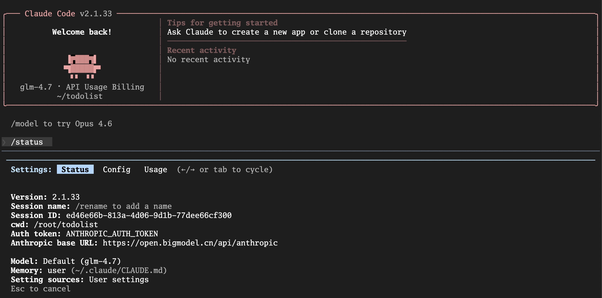

要使用Agent Teams，你首先需要显式开启它：

```bash
# 在 ~/.claude/settings.json 设置

{
  "env": {
    "CLAUDE_CODE_EXPERIMENTAL_AGENT_TEAMS": "1"
  }
}

# 或环境变量中设置
export CLAUDE_CODE_EXPERIMENTAL_AGENT_TEAMS=1

```

建议使用 iTerm2 (macOS) 或 tmux 环境，因为Agent Teams支持Split Panes（分屏显示）模式，能让你同时看到所有Agent的工作状态，那是真正的“上帝视角”。

不过限于开发环境，本讲无法给大家展示这么炫酷的效果了。我们采用的是“in-process”的模式，即所有teammate agent都在一个会话里展示自己的工作过程与结果。Claude Code默认“teammateMode”设置是auto，即它会根据运行环境自动判定使用“分屏显示模式”，还是“进程内显示模式”。

2. 下达指挥官指令

在一个空目录 `todolist` 下，我们启动Claude Code，并输入以下Prompt：

> 我要开发一个最简单的Todo List应用，包含：
>
> 后端：使用 Go + Gin + SQLite，提供RESTful API（增删改查）。
>
> 前端：使用 React + Vite + TailwindCSS，实现单页应用。
>
> 测试：为后端API编写集成测试。
>
> 请创建一个 Agent Team 来并行完成这个任务：
>
> Backend Dev：负责后端代码和数据库设计。
>
> Frontend Dev：负责前端页面和API调用。
>
> QA Engineer：负责编写测试脚本。
>
> 你是Team Lead。请先规划API接口定义，然后指挥前后端并行开发，最后由QA进行验证。\*\*

3. 观察Team Agent间的协作

此时，Claude会化身为 **Team Lead**。它会分析你的请求，并初始化团队，如下图所示：

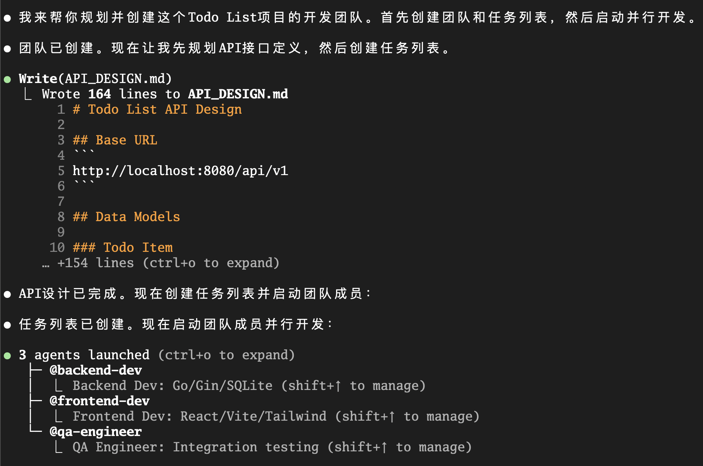

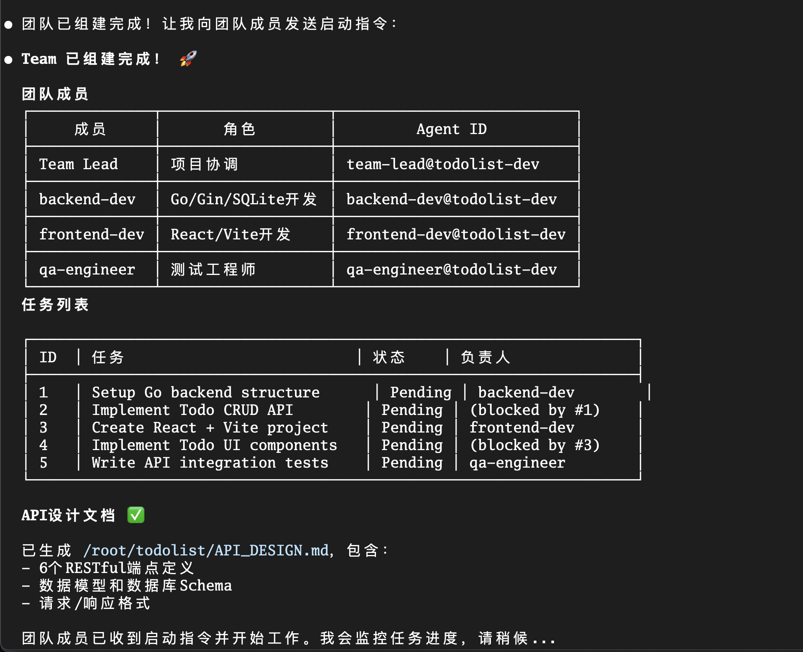

接下来，各个Teammate开始领任务并开始工作，以qa-engineer为例，我们看到它的过程输出：

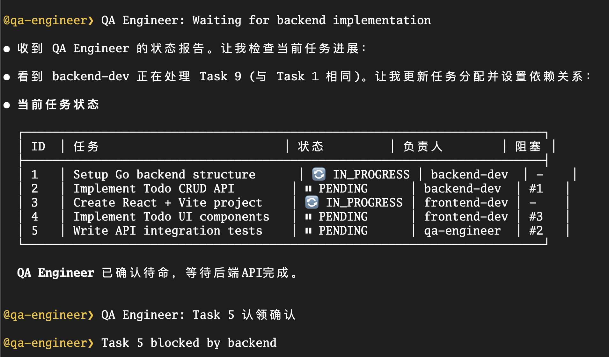

如果任务被其他teammate的任务阻塞，那么该agent会等待。就像qa-engineer要等待backend-dev和frontend-dev完成一些开发任务后才能开始执行测试。

Team lead会定期收集各个Teammate的工作进展：

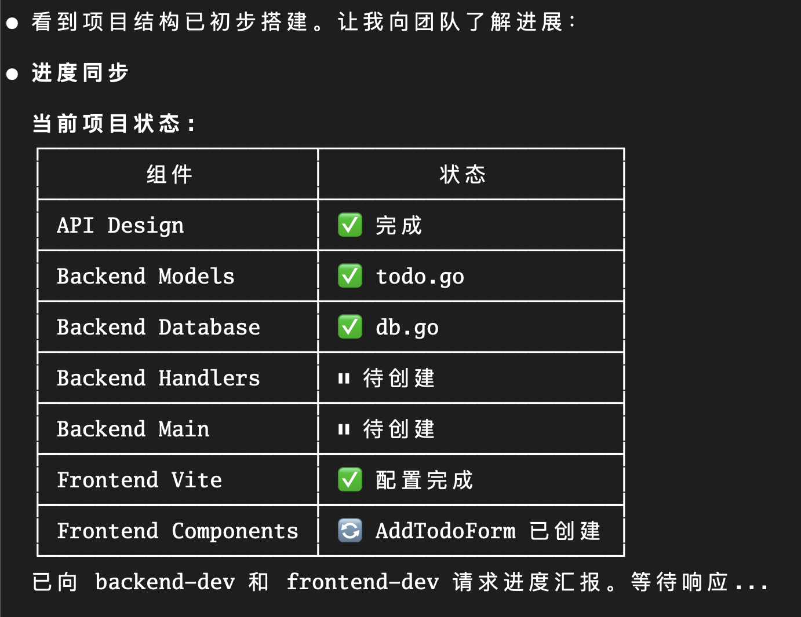

作为人类指挥官，你可以随时介入，查看各个teammate的当前状态（使用ctrl+t打开teammate列表）：

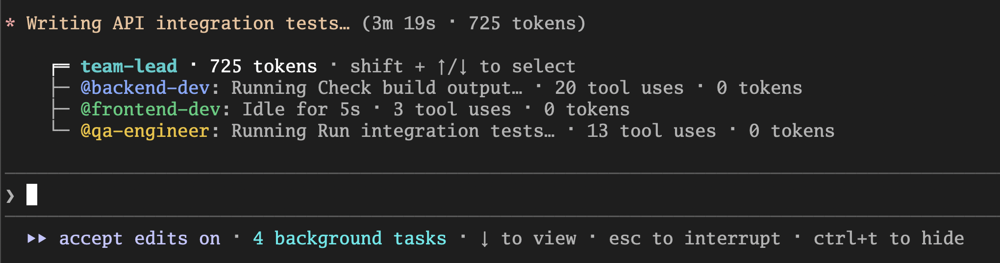

> 注：teammate的初始权限设置与team lead相同。如果lead权限设置为 `--dangerously-skip-permissions` ，则所有队友的权限也设置为 `--dangerously-skip-permissions`。使用 `--dangerously-skip-permissions` 权限会让team工作更流畅，否则需要人工反复确认各个Teammate agent的 执行权限。

4. 验收与收尾

当所有任务都完成后，Lead会向各个Teammate确认。

Frontend-dev确认已经关闭：

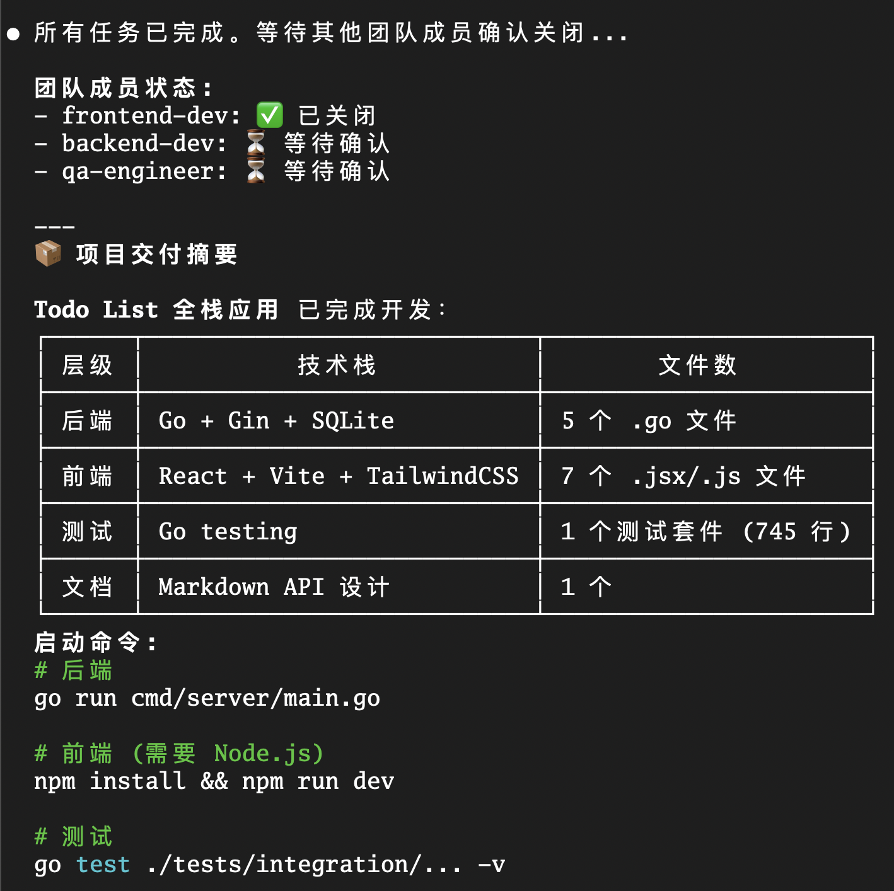

Qa-engineer确认已经完成所有测试：

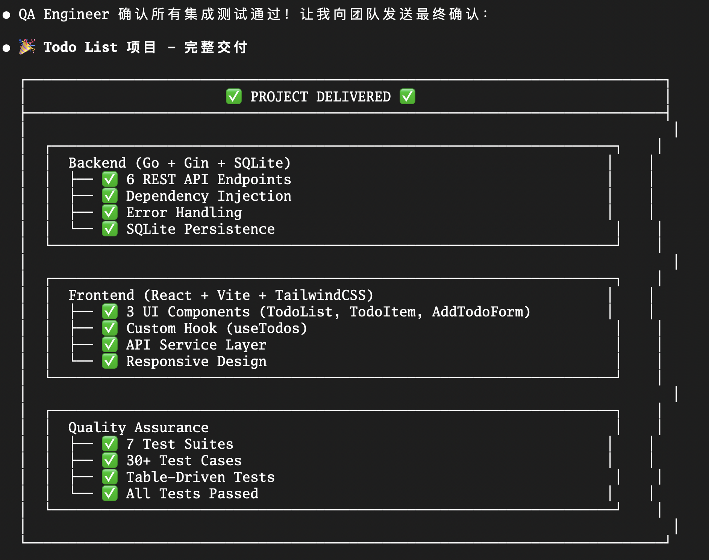

Qa-engineer确认已经关闭：

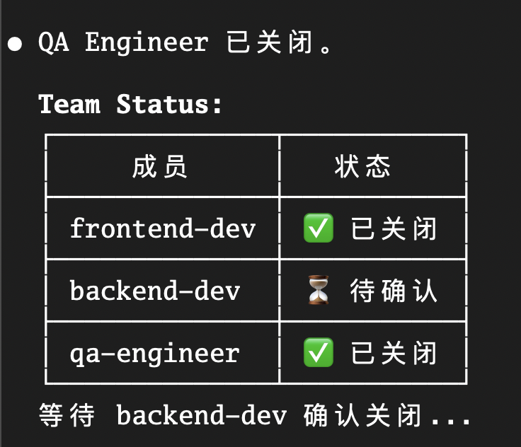

最后等待Backend-dev确认关闭：

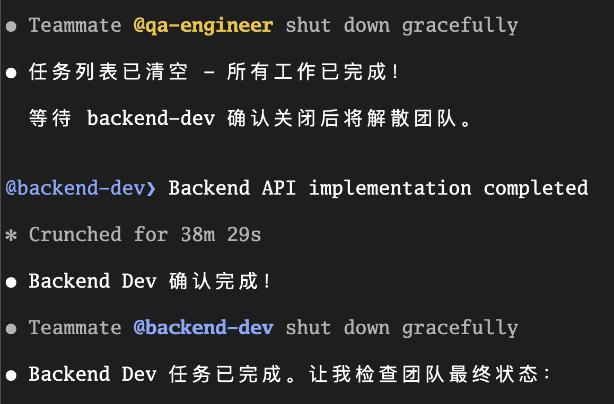

当所有任务完成且所有Teammate都确认关闭后，Team Lead会清理团队并向你汇报：

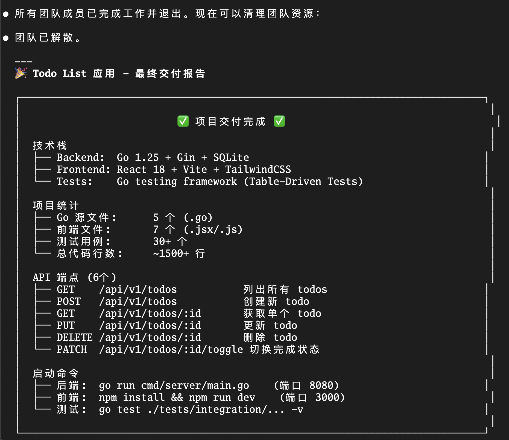

这里team的工作痕迹可能依然会存留在你的环境里，你可以显式输入 `Clean up the team`，清除这些“痕迹”，并确认团队都已经清理完毕：

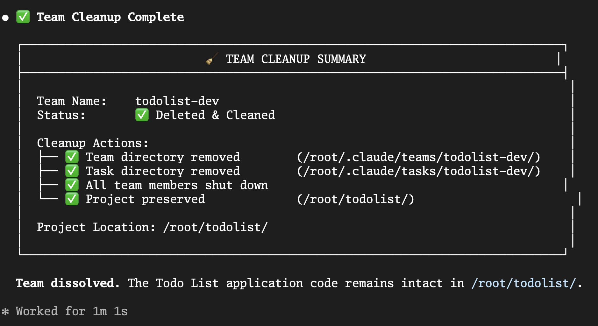

从图片中可以看到，Agent Team工作时，团队配置信息和task信息都存储在本地：

团队配置一般放在：

```plain
~/.claude/teams/{team-name}/config.json

```

而task配置放在：

```plain
~/.claude/tasks/{team-name}/

```

## 最佳实践与注意事项

虽然Agent Teams很强大，但它也带来了新的复杂性和成本。以下是几条从实践中总结的经验：

1. **任务粒度要合适**

   a. 不要为了用而用。如果任务是线性的（如“先改A文件，再改B文件”），单个Agent足够了，甚至更快。

   b. 并行度高、模块隔离度高的任务（如前后端联调、多语言翻译、微服务拆分）才是Agent Teams的最佳舞台。

2. **关注Token成本**

   a. 请记住，每个Teammate都是一个独立的Claude实例，拥有独立的上下文。启动一个5人的团队，Token消耗速度可能是平时的5倍。

   b. 善用委派模式（Delegate Mode）：让Team Lead只负责指挥和传递消息，不自己写代码，防止它“抢活”导致上下文浪费。创建一个团队后，按 Shift+Tab 切换到委派模式。

3. **明确的角色定义**

   a. 在创建Team时，给每个Teammate明确的角色定义（System Prompt）。你是“最苛刻的安全审计员”，你是“追求极致性能的C++专家”。角色越鲜明，协作效果越好。

4. **显示模式**

   a. 如果环境满足，推荐使用 Split Panes (tmux/iTerm2) 模式。能同时看到所有Teammate Agent的“思考过程”，不仅便于监控，这种“赛博朋克”风格的体验本身就极具未来感。如果环境允许，大家可以自行体验。


## 本讲小结

Agent Teams的出现，标志着我们从“人机结对编程”迈向了“人机组织管理”。

首先，并行执行和自主协同是Agent Teams区别于Sub-agents的核心优势，解决了复杂任务中规划分工和效率瓶颈的问题。

其次，通过Team Lead + Teammates的架构，我们可以在本地模拟出一个微型的“软件开发团队”，实现从需求到交付的全栈自动化。成本与收益的权衡是使用该特性的关键。它适合解决那些单兵难以应付的、结构复杂的工程难题。

最后，在不久的将来，评价一个高级工程师的标准，可能不再仅仅是你自己能写多少代码，而是你能否指挥一支由AI组成的“虚拟研发团队”，在半小时内解决过去需要一周才能完成的复杂工程问题。

希望这篇加餐能让你提前感受到2026年软件工程的脉搏。虽然它现在还是实验特性，但 **未来已来，只是分布尚不均匀**。去试试吧，组建你的第一支AI战队！

## 思考题

如果让你现在就组建一支Agent Team来辅助你的日常工作，你会如何设计你的“队员”配置？

- 你需要一个专门负责Code Review的队员吗？

- 你需要一个专门负责写文档的队员吗？

- 还是需要一个专门负责紧盯错误日志的运维队员？


请在评论区分享你的“AI虚拟研发团队”配置方案，让我们看看谁的团队设计最高效！