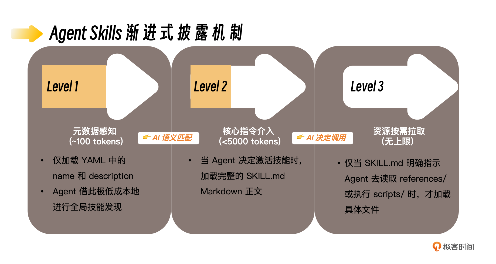

# 前沿技术速递｜告别“方言”：全面解析 Agent Skills 行业标准与高阶编写心法
你好，我是Tony Bai。

时间过得真快，我们的专栏从2025年底一路走来，伴随着大家在AI原生开发的道路上不断打怪升级，如今已是2026年的春天。

相比于专栏正文那些严密、紧凑的工程实战，今天的这篇加餐，我想和大家用稍微轻松一点的节奏，聊一聊一个正处于高速爆发期，且与我们息息相关的话题—— **Agent Skills（智能体技能）的最新进化，以及那些真正能拉开差距的高阶编写心法**。

## 技能的进化：从“私有方言”到“行业普通话”

在专栏的 [第 13 讲](https://time.geekbang.org/column/article/933778?utm_campaign=geektime_search&utm_content=geektime_search&utm_medium=geektime_search&utm_source=geektime_search&utm_term=geektime_search) 中，我们首次接触了 Agent Skills 的概念。当时，我们亲手把一个 Slash Command 改造为了 Skill，让 Claude Code 拥有了“自主发现并调用能力”的特性。那时，Skill 还是 Anthropic 刚刚推出的一个实验性功能。

但仅仅过去了小半年，如果你一直保持对前沿 AI 开发圈的关注，你会发现 **Skill 已经成了 Coding Agent，甚至是整个AI Agent 领域的“重头戏”**。

在 2025 年底，大家还在各自的工具里用不同的格式写 Prompt，这就好比各个诸侯国在说自己的“私有方言”。你的经验无法复用，生态极其碎片化。

而到了 2026 年初，一个标志性的事件发生了：Claude Code 的母公司 Anthropic，正式推出了 **agentskills.io** ，发布了Agent Skill的标准。这就像是当年秦始皇“书同文，车同轨”，在业界建立了一个全新的、跨平台以及Agent的 Skill 规范。

很快，目前AI界大厂的编码智能体，比如OpenAI的Codex、Google的Gemini Cli、Github的Copilot等，以及近一个月来大热的AI私人助手全能智能体 **OpenClaw（** 前身为 clawdbot/moltbot 等）迅速跟进，宣布全面兼容这一标准。

这释放了一个明确的信号： **继 MCP（模型上下文协议）统一了 AI 连接外部系统的“物理接口”之后，Agent Skills 正式统一了 AI 扩展自身能力的“软性知识与逻辑”标准。** 只要你的 Skill 遵循这个规范，它就能像 Docker 镜像一样，在不同的 AI 智能体之间无缝流转和运行。

## 规范探索：最新的 Agent Skills Spec 有何不同？

既然有了官方标准，我们在第13讲中介绍的早期 Skill 结构，自然也迎来了升级。为了不让大家在未来的实践中踩坑，我们先来简单对齐一下最新的规范差异。

一个标准的 Skill 依然是一个目录，核心依然是那个 `SKILL.md` 文件。但在 YAML Frontmatter（前置元数据）的定义上，最新规范引入了更严谨的约束和更丰富的语意。

**1\. 严格的命名规范（ `name`）**

早期的 `name` 比较随意，现在被严格限制为 1-64 个字符，且 **只能包含小写字母、数字和连字符（-）**，不能以连字符开头或结尾，也不能有连续的连字符。这完全对标了 npm 包或容器镜像的命名规范，为未来的“技能集市”打下了基础。

**2\. 新增 `compatibility` （兼容性）字段**

这是最新规范中非常实用的一个新增字段。如果你的 Skill 依赖特定的环境，你可以明确声明。

```yaml
compatibility: 需要 Python 3.11+ 以及 jq 命令行工具，需要公网访问权限。

```

这样，Agent 在决定是否调用你之前，就能评估环境是否满足，避免执行到一半报错。

**3\. 新增 `license` 和 `metadata` 字段**

规范化带来了生态的繁荣。你现在可以为你的 Skill 指定开源协议（如 `license: Apache-2.0`），也可以在 `metadata` 中留下你的大名和版本号。

**4\. 正式确立了“渐进式披露”（Progressive Disclosure）机制**

在第13讲我们提过，Skill 会按需加载。最新的规范将其正式抽象为三个层级，这也是我们在架构大型 Skill 时必须遵循的铁律：



这就要求我们， **主 `SKILL.md` 文件最好不要超过 500 行**。如果内容过长，说明你把太多的底层细节一股脑塞进了 AI 的初始工作记忆中。这不仅会严重挤占宝贵的上下文窗口（Context Window），还容易让 AI 迷失在冗余信息里。正确的做法是，把那些非高频使用的参考资料拆分到 references/ 目录下，让 AI 像查字典一样去按需“翻书”。

## 高阶心法：如何写出让 AI “秒懂”的技能？

了解了规范，仅仅是知道了“语法”。但真正拉开开发者差距的，是如何用好这些语法，写出高质量、高鲁棒性的 Skill。

在过去小半年的 AI 原生开发实践中，我也踩过无数的坑，也研究了业界优秀的开源 Skill。在这里，我把提炼出的几条实践心法和技巧分享给大家。

### 心法一：编写 Skill，需要人类的“同理心”和“共情能力”

这可能听起来有些反直觉。我们在写代码时，面对的是冷冰冰的编译器；但在写 Skill 时，我们面对的是具有极强“心智理论能力”的大语言模型（如 Gemini 3.x pro、Claude 4.6、GPT 5.x等）。

过去，我们在写 Prompt 时有一种很不好的习惯——喜欢用大写的“ **MUST**”“ **NEVER**”去“恐吓”大模型，试图用极其死板的格式约束把它逼到一个死角里。

> ❌ 旧式“恐吓型”写法：“你必须（MUST）使用单例模式！绝不允许（NEVER）创建多个实例！你的输出必须完全遵照下方的格式，差一个标点符号都不行！！！”

我在实践中发现，这是一种既不“人道”，且效果欠佳的做法。因为如果遇到稍微偏离你预设边缘的场景，被死板规则束缚的 AI 就容易“崩溃”或产生幻觉。

真正的高阶实践是：把 AI 当作一个绝顶聪明，但暂时缺乏你公司业务上下文的新入职高级同事。你要对它展现出“同理心”，不仅要告诉它“怎么做”，更要向它 **解释“为什么（The Why）”。**

> ✅ 具有“共情能力”的写法：“在处理数据库连接时，请采用单例模式。因为我们的云函数环境并发量很大，频繁创建连接会导致下游数据库连接池耗尽，曾引发过严重的线上故障。为了方便团队审查，请在输出分析时，保持结构清晰，优先使用标题和要点列表。”

当你把业务背景、痛点和潜在风险解释清楚时，模型会深刻理解你的意图。你会惊讶地发现，它不仅能完美遵循你的要求，甚至能在遇到未定义的突发状况时，基于你传达的“核心价值观”做出最优的变通。

### 心法二：榨干 `description` 的触发潜能

一个 Skill 写得再好，如果 AI 在关键时刻“想不起来”去调用它，那就等于零。目前的 LLM 存在一种“触发不足”（undertrigger）的倾向。对于一些简单的任务，它往往倾向于用基础工具（如直接用 `Read` 和 `Bash`）自己去干，而不是老老实实去调用你写好的专业 Skill。

因此，你的 `description` 必须写得“ **略带攻击性**”，你要像一个推销员一样，把触发场景定义到极致。

> ❌ 软弱的描述：“提取 PDF 文本并格式化数据。”
>
> ✅ 高触发率的描述：“提取 PDF 文本，识别段落结构，并能精准提取表格数据。请务必在用户上传了 PDF 文件、提到 PDF 解析、表单填写，或者要求从文档中提取结构化数据时，立即且优先使用本技能，哪怕用户没有直接说出‘PDF提取’几个字！”

你需要在大脑里构建 **正例**（什么时候必须触发）和 **反例**（什么时候容易被忽略），并在描述中把正例的边界尽可能地拓宽。

### 心法三：将“确定性”剥离，拥抱“脚本化/程序化”

很多人写 Skill 时，喜欢在 Markdown 里长篇大论地教 AI 怎么用正则表达式去清洗一段日志。

**千万别用 LLM 去做确定性的计算！** 这不仅极其浪费 Token，而且错误率极高，鲁棒性极差。

高质量的 Skill 架构，一定是“LLM 负责控制流与意图理解，脚本负责数据流与确定性执行”。

如果你发现你的 Skill 要求 AI 按照死板的 10 个步骤去操作文件字符串，你应该立刻停下来。写一个 Python 脚本放在 `scripts/` 目录，或写一个Go程序，放到 `$PATH` 下，然后在 `SKILL.md` 中这样写（以Python脚本为例）：

> “当提取出关键数据后，请不要自行格式化。请直接调用 `Bash(python scripts/formatter.py data.json)`。脚本会返回最终的格式化结果。”

让上帝的归上帝，凯撒的归凯撒。各司其职！

### 心法四：评测驱动（Eval-Driven）—— 为英语写单元测试

我们怎么判断修改了 `description` 或者调整了一段提示词后，Skill 是变好了还是变坏了？

**Skill 本身就是代码，代码就必须有测试。**

在我的工作流中，每写一个重要的 Skill，我都会附带几段“测试 Prompt”（Evals），以及对应的 **客观断言（Assertions）**。

你要测试的是 **规范表达的质量**，而不是 AI 的代码逻辑。

- ❌ **差的断言（测试了实现）：**“验证 AI 生成的代码能否成功启动 HTTP 服务。”（这太容易受偶发因素影响）。

- ✅ **好的断言（测试了规范质量）：**“技能执行日志中显示调用了附带的 `lint.sh` 脚本”；或“针对用户未说明的数据库选项，技能在其输出报告中明确提出了 `[NEEDS CLARIFICATION]` 标记”。


只有当你能用客观的条件（证据）去评判一次 Skill 执行的优劣时，你的 Skill 才能稳定地迭代升级。

## 简单实战：打造一个高阶的“PR Changelog 提炼师”

纸上得来终觉浅。让我们结合上面的心法，快速构建一个符合最新规范、高鲁棒性的 Skill。

**场景：** 团队要求在每次提 PR 前，必须根据所有的 commit 历史，生成一份结构化的 Changelog，并且要按照特定的中英双语格式。

**目录结构：**

```plain
pr-changelog-generator/
├── SKILL.md
└── scripts/
    └── extract_commits.sh

```

`scripts/extract_commits.sh` **（提取确定性逻辑）**

```bash
#!/bin/bash
# 仅仅负责把过去 10 条 commit 提取出来，不让大模型去猜 Git 命令
git log -n 10 --pretty=format:"%h - %s (%an)"

```

`SKILL.md` **（注入同理心与渐进式披露）**

```markdown
---
name: pr-changelog-generator
description: 自动分析 Git 提交历史，生成规范的 PR Changelog。当用户准备提 PR、请求总结代码变更、或是要求“写一下更新日志”时，请务必优先触发本技能。
allowed-tools: Bash Read
metadata:
  author: tonybai
---

# PR Changelog Generator 技能指南

这个技能旨在帮助我们的开发者减轻提 PR 时的负担。我们团队非常看重 Review 的效率，一份结构清晰、重点突出的 Changelog 能极大节约 Reviewer 的时间，减少沟通摩擦。

## 执行步骤

当决定使用本技能时，请遵循以下流程：

### 1. 收集数据 (确定性执行)

请不要自己去猜测 Git 命令。请直接调用我们准备好的安全脚本来获取原始提交数据：

执行 `Bash(sh scripts/extract_commits.sh)`

### 2. 意图理解与提炼 (你的强项)

仔细阅读脚本返回的 commits。你需要发挥你的理解能力：

- 剔除那些无意义的提交（如 "fix typo", "update"）。
- 将连续相关的提交合并为一个功能点。
- **重点：** 请站在 Reviewer 的角度，思考他们最关心哪些变更？把高风险、大范围的改动排在最前面。

### 3. 结构化输出

请使用以下模板输出。**为什么要中英双语？因为我们是一个跨国协作团队，这能确保不同母语的同事都能快速理解。**

    ## 🚀 Changes (变更内容)
    * **[Feature/Fix]**: (English description) / (中文描述)
    * ...

```

这个例子虽然简单，但它完美践行了：符合最新规范、极具攻击性的 Description 触发、脚本剥离确定性逻辑、以及饱含“同理心”地解释了中英双语和总结重点的 Why。

## 终极建议：用 AI 创造 Skill，方为上策

最后，我想和大家分享一个可能略显“残酷”的真相。虽然我教了大家这么多编写 Skill 的技巧，但随着 AI 应用的深入，你会发现，仅靠人类的脑力去覆盖所有的 Edge Cases（边缘场景），去精调 `description` 以获得零误差的触发率，已经变得越来越困难，甚至是不可能完成的任务。

人类考虑问题的角度，在面对海量的上下文和概率模型时，其周密程度已经慢慢不如 AI 了。

因此， **编写高质量 Skill 的最高效、也是最终极的方式，是利用 AI 来生成和测试 AI Skill。**

业界已经出现了专门干这事的元技能（Meta-skills）。比如 Anthropic 开源过的 [skill-creator 工具](https://github.com/anthropics/skills/tree/main/skills/skill-creator) 理念，它本质上就是在主Agent的控制下启动多个 SubAgent：

1. **主** **Agent** 负责采访你，帮你写 `SKILL.md`，并拿着刚写好的 Skill 跑几十个你没想到的测试用例。

2. **Grader Agent** 像个严厉的老师一样无情地打分。

3. **Comparator 和 Analyzer Agent** 进行双盲测试，告诉你修改后的版本到底好在哪里，是哪句描述导致了触发失败，并自动为你优化代码。


**用魔法打败魔法！** 当你跳出“逐字敲击 Prompt”的泥潭，开始利用类似 `skill-creator` 这样的高阶工具，让 AI 团队帮你去提炼、测试、迭代你的专属技能时，你才真正触碰到了 2026 年软件工程的最前沿。

## 本讲小结

今天这篇加餐，我们不仅深入到了 Agent Skills 的最新规范，更探讨了编写高质量 Skill 的实践心法。

我们认识了 agentskills.io 标准，这是未来 AI Agent 之间共享能力的通用“接口协议”。它通过严格的 **YAML 元数据** 和 **渐进式披露机制** 实现了跨平台的兼容和对宝贵上下文的极致压榨。

我们升级了“写 Prompt”的认知：放弃命令式、恐吓式的死板约束，转向具有“ **同理心**”、 **解释“Why（为什么）”** 的沟通模式，充分利用现代大模型的心智理论能力。

我们掌握了高阶 Skill 编写的实战技巧：写出具有 **“攻击性”的 Description** 以确保触发率； **将确定性逻辑剥离给脚本**，让 LLM 专注于意图理解；以及树立“代码即需评测（Eval-Driven）”的意识。

当 AI Agent 的能力越来越强，我们作为“人类指挥官”的核心竞争力，不再是比拼谁脑子里的 API 记得多，而是谁能抽象出更高质量的规范（Spec），谁能将团队的隐性知识沉淀为最容易被触发的（Skills）资产。

“提示词工程（Prompt Engineering）”正在向更严谨的“技能工程（Skill Engineering）”演进。

## 互动环节

我们正处于一个激动人心的时代，大家都在“摸着石头过河”。 今天分享的这些，也是我一路趟过来的经验，起到一个抛砖引玉的作用。AI 原生开发，从来不是比拼谁的语法更熟练，而是比拼谁的心智模型更高级。希望这篇加餐，能为你打开一扇通往更高维度的大门。

关于编写 Agent Skills，你有什么独门的“避坑指南”或“绝妙心法”吗？你是如何测试你的 Prompt 和 Skill 的？非常欢迎在留言区分享你的实战心得，我们一起探讨，一起在这个 AI 原生时代持续进化！