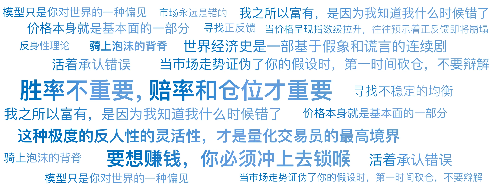

# 04｜索罗斯的炼金术：利用错误的暴利艺术
你好，我是陈旸。

上一讲，我们见识了西蒙斯如何用冷冰冰的数据，挖掘市场的微小漏洞。今天，我们要从微观的捡芝麻，转向宏观的屠龙。我们要聊的这个人，乔治·索罗斯，曾在一夜之间赚走了10亿英镑，逼得英国央行举手投降；他在1997年横扫东南亚，让无数国家的货币体系崩溃。他被称为金融大鳄，也被称为哲学家。

你可能会问：“这种宏观投机的大佬，跟我们做量化有什么关系？他又不看K线，也不跑Python代码。”如果你这么想，那你就错过了一个最重要的量化模型。

索罗斯的思维方式，其实解决了量化交易中一个最棘手的难题： **当市场疯了的时候，原本有效的模型为什么会失效？以及，我们该如何骑上泡沫的背脊？** 今天，我们就用量化的手术刀，解剖索罗斯那本晦涩难懂的《金融炼金术》。

## **市场永远是错的：打破均衡的幻想**

在传统的经济学教科书（以及早期的量化模型）里，有一个核心假设叫：一般均衡理论。它认为：

1. 市场是理性的。

2. 价格围绕价值上下波动。

3. 如果价格偏离了价值，市场会自动把它拉回来（均值回归）。

这就像一个恒温器：温度高了，空调就制冷；温度低了，暖气就加热。系统总是趋向于稳定。如果世界真是这样，那西蒙斯和巴菲特就够用了。但索罗斯冷笑一声： **“世界经济史是一部基于假象和谎言的连续剧。”**

索罗斯认为，传统经济学忽略了一个核心变量：人的偏见。在物理世界，你看着天气，天气不会因为你看着它而改变。但在金融世界， **你看好一支股票，你买入它，股价就会涨；股价涨了，基本面（融资能力、品牌形象）竟然真的变好了，于是你更看好它……** 这就是著名的反身性理论。

用控制论的语言翻译一下： 传统市场理论假设市场是负反馈系统（涨多了会跌，趋向稳定）；索罗斯认为市场经常变成正反馈系统（涨了因，因又推高果，越涨越涨，直到崩溃）。想象你在KTV唱歌，如果你把麦克风（输入）靠得离音箱（输出）太近，会发生什么？啸叫。 声音会被无限放大，直到震破耳膜。索罗斯做的，就是寻找那个麦克风靠近音箱的时刻。

## **特斯拉、比特币与反身性循环**

为了让你听懂这个抽象的哲学，我们不讲1992年的英镑，我们讲讲大家都熟悉的特斯拉（或者任何一个大牛股）。在量化思维里，一个标准的索罗斯式正反馈循环是这样运行的：

**阶段1：起步（偏见引入）**

特斯拉刚开始只是一个亏损的电动车厂。但马斯克讲了一个性感的故事（火星、清洁能源）。此时，股价开始上涨。

- \*传统量化模型（价值因子）：\*这是一个垃圾股，做空它！

- \*索罗斯思维：\*等等，看故事能不能自我实现。

**阶段2：加速（自我强化）**

股价上涨，特斯拉市值变大了。神奇的事情发生了：因为市值大，特斯拉可以高位增发股票，融到了几十亿美元的真金白银。有了钱，它真的建起了超级工厂，产能真的提升了，车真的造出来了。原本是吹牛的基本面，因为股价的上涨，变成了真的基本面。

**阶段3：疯狂（正反馈高潮）**

基本面变好，吸引更多机构买入，股价继续暴涨。股价暴涨，吸引更好的人才，获得更低的贷款利率，品牌成为全球顶流，基本面好上加好。

- \*此时的现象：\*所有看空它的量化模型（均值回归策略）全部被打爆。

- \*索罗斯的操作：\*在泡沫中游泳。 他知道这是泡沫，但他不会做空，他会做多，因为正反馈还没断。

**阶段4：崩溃（反向反身性）**

直到某一个临界点（比如产能瓶颈、宏观加息），故事讲不下去了。股价下跌 => 融资困难 => 工厂停工 => 业绩下滑 =\> 股价更跌。原来的正反馈螺旋，瞬间变成向下的死亡螺旋。

**量化视角的启示：**

所谓的基本面，并不是客观存在的锚。 **价格本身就是基本面的一部分。** 如果你在做量化因子分析时，只看财务报表（滞后数据），而不看价格动量对基本面的反作用，你就会死在黎明前的黑暗里。

## **1992年：那一记封喉的做空**

理解了理论，我们再来看索罗斯的封神之战——狙击英镑。这根本不是一次赌博，而是一次基于逻辑的必然性套利。

**背景：** 1990年代，欧洲搞了一体化，英国加入了欧洲汇率机制（ERM）。这意味着，英镑必须锁定马克，汇率不能波动太大。但是，德国为了抑制通胀，把利息定得很高；英国经济衰退，急需降息刺激。

**矛盾（失衡点）：** 英国如果不加息，英镑就会跌穿下限（违反ERM）；如果加息，英国经济就会崩盘。这就形成了一个不可能三角。索罗斯敏锐地嗅到了这个不稳定的均衡 **。** 他知道，英国央行在死撑。 这种死撑，就是市场最大的错误定价。

### **量化分析（盈亏比计算）**

**如果做空英镑：**

- 情况A（大概率）：英国撑不住，退出ERM，英镑暴跌。赚几十倍。

- 情况B（小概率）：英国死撑到底，英镑维持原价。亏损极小（只是付一点利息成本）。

这是一笔风险有限，收益无限的单向赌博。当索罗斯的助手德鲁肯米勒跑来说：“乔治，我算过了，我们要把所有资金都压上去做空英镑。”索罗斯说出了那句流传千古的名言：“这就是你的建仓规模？要想赚钱，你必须冲上去锁喉。”

最终，索罗斯动用了两倍杠杆，建立了100亿美元的空头头寸。那一晚，英国央行动用了几百亿美元的外汇储备买入英镑，但在索罗斯引领的全球空头大军面前，如同杯水车薪。第二天，英国宣布退出ERM，英镑暴跌。索罗斯净赚10亿美元。

**量化思维的第二次顿悟：胜率不重要，赔率和仓位才重要。** 很多量化策略追求高胜率（如网格交易），但一次黑天鹅就亏光。索罗斯追求的是非对称机会——当我错了，我亏一点点；当我对了，我要赚这辈子都花不完的钱。

## **如何把哲学写进代码？**

你可能会问：“道理我都懂，但在QMT里怎么写索罗斯策略？”索罗斯的反身性很难直接编程，但我们可以捕捉它的影子。在现代量化中，这演变成了拥挤度和趋势跟随策略。

1. **拥挤度指标**

索罗斯最喜欢在趋势最疯狂的时候离场。量化如何判断疯狂？

- **换手率因子：** 当一只股票换手率达到历史极值，说明所有想买的人都买进去了，剩下的全是潜在卖家。

- **相关性因子：** 当所有股票不管好坏都在涨，市场相关性趋近于1，说明是情绪驱动，而非价值驱动。

2. **动量加速**

普通的动量策略是涨了就买。索罗斯式的动量策略是看二阶导数——涨得越来越快。当价格呈现指数级拉升（Log-Periodic Power Law，LPPL模型），往往预示着正反馈即将崩塌。

3. **情绪分析**

利用AI读取新闻和社交媒体。当媒体充满了“新范式、改变世界、这次不一样”等词汇时，这就是偏见的量化读数。AI可以给这种偏见打分，当偏见分数过高时，就是反转的信号。

在《QMT实战训练营》里，我会教你如何计算 “RSI背离、乖离率以及资金流向”，这些其实就是微观层面的索罗斯指标。

## **索罗斯的遗产：易错性**

最后，我想谈谈索罗斯思维中最核心，也最容易被忽视的一点：易错性。西蒙斯相信模型是完美的，巴菲特相信公司是完美的。但索罗斯相信：我是错的。他曾说：“我之所以富有，是因为我知道我什么时候错了。”

在他背部剧烈疼痛的时候，他会清空仓位，因为他相信身体在向他报警，说明有些潜意识发现的风险还没被显意识捕捉到。这听起来很迷信，但翻译成量化语言，这就是动态风控。很多量化交易者死扛亏损，是因为他们太相信回测数据，太相信模型。他们会说：“历史数据显示这里应该反弹了，模型不会错，是市场错了。”这就是死期。

索罗斯教给我们的是： **模型只是你对世界的一种偏见。当市场走势证伪了你的假设时，第一时间砍仓，不要辩解。** 在索罗斯的基金里，没有自尊心这个词。今天做多，明天发现错了，立马反手做空，毫不脸红。 **这种极度的反人性的灵活性，才是量化交易员的最高境界。**

## **AI量化策略建议**

这一讲稍微有点抽象，我们总结一下索罗斯给我们的三个量化锦囊：

1. **寻找正反馈**：不要轻易做空泡沫。在泡沫初期和中期，反身性会让泡沫越来越大。要学会利用泡沫，而不是过早地站在泡沫的对立面。

2. **寻找不稳定的均衡**：当某个价格被政策强行固定（如固定汇率、甚至某种被操纵的股价），而基本面又不支持时，这就是最大的暴利机会。

3. **活着承认错误**：不管你的AI模型回测多完美，一定要给它装一个红色按钮。当实盘亏损超过阈值，无条件止损。因为市场总有你不知道的偏见。

## 本讲金句弹幕

## **课后思考题**

回想一下最近的金融市场，比如一波AI概念股的暴涨，或者是虚拟IP盲盒概念股的暴涨。你能找出其中的反身性循环吗？是哪个故事启动了上涨？上涨又是如何反过来强化这个故事的？如果是你，你会选择在哪个节点切入，又在哪个信号出现时离场？

欢迎你把你的想法留在评论区，也欢迎你把这节课分享给对量化感兴趣的朋友。下一讲，我们将离开哲学的云端，落回到数学的地面。既然索罗斯说：“当我对了，我要赚大钱”。那么问题来了：到底下注多少才叫赚大钱，同时又不会把自己赔光？我们将介绍那个让无数天才破产，又让无数天才暴富的终极数学公式——凯利公式。