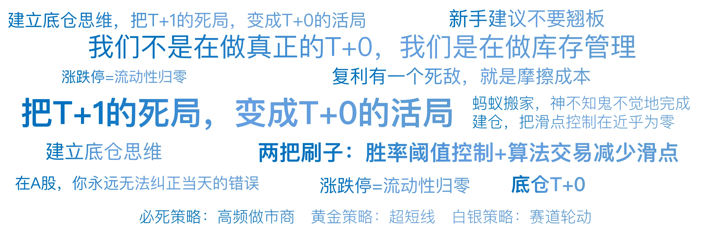

# 06｜A股的生存法则：T+1、涨跌停与印花税
你好，我是陈旸。

在正式开始讲具体的量化策略之前，我们需要先上一堂地理课。很多从海外留学归来的金融高材生，或者习惯了美股、虚拟货币交易的朋友，一回到A股做量化，往往会水土不服。他们的模型可能在华尔街跑得风生水起，但在A股就频繁回撤，甚至无法执行。

这是为什么呢？因为A股是世界上规则最独特、散户占比最高、政策频繁的市场之一。这就好比你在玩一款网络游戏。美股的服务器规则是“自由PK，无限复活（T+0），没有边界（无涨跌幅限制）”。而A股的服务器规则是“回合制战斗（T+1），地图有空气墙（涨跌停），每次出招要收印花税”。

如果你不懂这些规则，拿着冲锋枪进回合制游戏，你会被按在地上摩擦。今天，我们就来拆解A股的三大生存法则。然后我们思考下AI量化交易员如何利用这些规则，带着镣铐跳出最美的舞步。

## **时间的镣铐：T+1与伪T+0工厂**

### **痛苦的关门打狗**

A股最核心的规则是 T+1。

• **T（Trade）**：交易日。

• **T+1**：今天买入的股票，必须要等到下一个交易日才能卖出。

对于散户来说，这是一种保护，防止你过度频繁交易。但对于量化交易（特别是高频交易）来说，这是致命的枷锁。想象一下：上午10点，你的AI模型监测到重大利空，发出强烈卖出信号。但因为这只股票是你上午9点半刚买的，你只能眼睁睁看着它跌停，毫无还手之力。这就叫关门打狗。

这意味着，在A股，你永远无法纠正当天的错误。风险暴露时间至少是4小时（全天交易时间）甚至更久（隔夜风险）。

### **量化的破解之道：底仓T+0**

既然规则不能打破，量化交易员就发明了一种绕过规则的方法——底仓T+0。

**原理**：虽然你不能卖今天买的股票，但你可以卖昨天买的股票。只要你的账户里一直持有一部分股票（底仓），你就可以实现变相的T+0。

**实战场景**：假设你长期看好贵州茅台，你想做它的波段，但又怕T+1的风险。

- **底仓状态**：你账户里原本就有1000股茅台（昨天之前买的）。

- **早盘信号**：上午10:00，AI判断股价要涨，立刻买入1000股。
  - 此时持仓：2000股（1000老股+1000新股）。
- **午盘信号**：下午14:00，股价果然涨了2%，AI判断上涨乏力，要回调，立刻卖出1000股。
  - 注意：系统卖出的是那1000股老股。

  - 此时持仓：1000股（全是新股）。

**结果**：收盘时，你依然持有1000股茅台，底仓数量没变。但是，你通过这一买一卖，赚到了那2%的日内差价。

这就是A股所有日内高频策略的底层逻辑。 **我们不是在做真正的T+0，我们是在做库存管理**。量化机构甚至会专门开设T+0工厂，雇佣大量的交易员或者运行AI算法，专门针对大户的底仓进行日内高抛低吸，以此来不断降低持仓成本。

**AI的应用：** 人类做T+0很难，因为很难克服贪婪（想多赚点）和恐惧（跌了不敢补）。AI在做T+0时，就像一个没有感情的搬运工。它利用分钟级别的波动率。只要波动幅度超过了交易成本（手续费），它就敢开枪。积少成多，一年下来，它可以帮你把持仓成本降低20%-30%。

## **空间的镣铐：涨跌停板与磁吸效应**

1. **流动性的黑洞**

美股有熔断（跌7%暂停15分钟），但没有个股的硬顶。一只股票一天可以涨100%，也可以跌99%。A股有个股的硬顶：

- **主板**：涨跌幅限制 10%。

- **科创板/创业板**：涨跌幅限制 20%。

- **北交所**：涨跌幅限制 30%。


对于散户，涨停是喜悦，跌停是悲伤。对于量化，涨跌停意味着一件事：流动性归零。

- **涨停板**：你想买，买不进（全是买单封死，没人卖）。

- **跌停板**：你想卖，卖不出（全是卖单封死，没人买）。


2. **磁吸效应**

这是A股独有的微观结构特征。当股价上涨到 +8% 或 +9% 时，离 +10% 的涨停板只有一步之遥。

这时候，市场上的持筹者会想：“马上要涨停了，我不卖了，等明天溢价。”（卖盘消失）

场外的踏空者会想：“再不买就封板买不到了，快抢！”（买盘涌入）

这种心理会导致股价像被磁铁吸引一样，瞬间吸向涨停板。这就是磁吸效应。反之亦然。当股价跌到 -8% 时，恐慌盘会争先恐后地出逃，导致股价加速撞向跌停板。

### **量化的破解之道：打板与翘板**

针对这个规则，A股诞生了两个全世界独一无二的策略流派。

**流派一：打板策略**

这是游资和动量量化的最爱。逻辑：既然涨停意味着买不到，那么如果我能在它封死涨停的前一秒买进去，明天大概率会高开（因为今天没买到的人明天会继续抢）。这是利用溢价预期。

**AI如何优化打板**？传统的游资靠盘感，看谁封单快。AI靠计算封板概率。

- AI会实时计算买单的速率（Tick数据）。

- 如果发现买单像洪水一样涌入，且卖单在快速撤退，AI会在价格还是 +9.8% 的时候，提前挂涨停价抢筹（扫单）。


这就是为什么现在散户很难打到好板的原因，因为机器比你快几毫秒。

**流派二：翘板策略**

这是高风险高回报的策略。逻辑：当一只股票跌停时，如果AI判断这是情绪错杀，且检测到跌停板上有巨额买单在悄悄吃货（主力进场），AI会跟随买入，赌它打开跌停，甚至上演地天板（从-10%涨到+10%，单日浮盈20%）。

**风险提示**：对于新手，建议你不要翘板。因为一旦没翘开，明天可能直接低开5%，加上今天的亏损，两天亏10%是常事。

## **摩擦的镣铐：印花税与佣金**

### **每一笔交易都在失血**

在无限游戏那一讲，我们说了复利。但复利有一个死敌，就是摩擦成本。在A股，摩擦成本由三部分组成：

1. **印花税**：目前是卖出方单边征收0.05%（注：2023年新规之前是0.1%）。注意，只收卖出的钱。

2. **券商佣金**：你可以和券商谈具体的佣金，如果你的资金体量比较大，这里我们按照万分之三（0.03%）计算，最低5元。买卖双向收取。

3. **过户费**：极低，可忽略不计。


这意味着，你完成一次完整的买卖（Round Trip），你的成本大约是：0.03% (买) + 0.03% (卖) + 0.05% (税) ≈ 0.11%。

看起来不高？如果你每天做一次T+0，一年交易250次。总成本 = 0.11% × 250 = 27.5%。也就是说，哪怕你每天不赚不赔，仅仅是频繁交易，一年后你的本金也会缩水近30%。你是在给券商和税务局打工。

### **量化的破解之道：降维打击**

AI量化在处理成本时，有两把刷子。

**第一把刷子：胜率阈值控制**

在写策略代码时，我们不仅仅是看信号（Signal），还要看期望收益。AI模型里会有一个硬性的过滤器：

```plain
if (Predicted_Return - Transaction_Cost) < Threshold: Pass

```

翻译过来就是：如果预测这次交易赚的钱，扣掉手续费后，利润太薄（比如不到0.2%），那就不做了。AI不会为了微薄的利润去频繁换手，它只在胜率和盈亏比极高的时候才开枪。

**第二把刷子：算法交易减少滑点**

除了显性的税费，还有一个隐性的成本叫滑点。你想买成10.00元，结果手一抖（或者单子太大把价格买上去了），成交均价变成了10.02元。这0.2%就是滑点。对于大资金量化，滑点比印花税更可怕。

AI会使用 TWAP（时间加权平均） 或 VWAP（成交量加权平均） 算法来拆单。

- **场景**：你要买100万股。

- **人工**：一笔梭哈，股价瞬间拉升3个点，成本极高。

- **AI**：把100万股拆成1000个小单，每隔几十秒，趁着盘口有卖单的时候悄悄吃一点。就像蚂蚁搬家，神不知鬼不觉地完成建仓，把滑点控制在近乎为零。


## **策略适应性：A股特有的量化生态**

了解了以上三个规则，你就明白了为什么有些策略在A股特别火，而有些策略必死无疑。

1. **必死策略：高频做市商**

在美股，做市商靠极高的换手率赚取买卖价差。但在A股，由于T+1限制（买入当天不能卖）和印花税（交易成本高），传统的高频做市策略在A股几乎无法生存。所以，不要轻信那些号称高频刷单的软件，除非它是基于底仓的T+0。

2. **黄金策略：超短线**

由于T+1，A股诞生了独特的隔日超短模式。

- **今天买**：在尾盘（14:50）买入强势股。

- **明天卖**：在次日早盘冲高时卖出。


**逻辑**：将持仓时间压缩到最短（不到24小时），只吃情绪最热的那一段溢价，以此规避长期持仓的风险。这是A股游资和量化结合最紧密的领域。

3. **白银策略：赛道轮动**

由于涨跌停板限制了单日的爆发力，A股的行情往往呈现趋势延续性。一个热点板块（如新能源、AI），往往会持续炒作一个月。量化策略不需要做T+0，只需要通过动量因子，每周调仓一次，买入最强的板块ETF，就能获得非常好的收益。

## **AI量化策略建议**

这一讲虽然讲的是规则，但其实讲的是敬畏。作为普通投资者，要在A股这个困难模式的服务器里生存，你需要做三件事：

1. **检查你的手续费**

打开你的交割单，算一算你的佣金率是多少。通常较高的资金量，可以要求你的客户经理给你调到更低的手续费率。不要小看这万分之几的差别，复利下来就是一辆车。

2. **建立底仓思维**

不要总是满仓进满仓出。尝试建立底仓。比如你看好一只股票，先买50%，留50%资金。利用AI网格工具（我们在第15讲会细讲），对着这只股票做T **。** 这能让你把T+1的死局，变成T+0的活局。

3. **远离伪量化**

市面上有很多软件吹嘘“T+0自动交易，每天稳赚1%”。请保持警惕。在A股的规则下，没有底仓是做不了T+0的。如果有软件告诉你不需要底仓也能做T+0，那它一定是违法的（比如场外配资或虚拟盘），请立刻远离。

## 本讲金句弹幕



## **课后思考题**

假设你有10万资金，全仓买入了一只创业板股票（20%涨跌幅）。当天上午它涨停了（+20%）。下午大盘跳水，它打开涨停，一路跌到了跌停（-20%）。请算一下：

1. 你当天的账户浮亏是多少比例？（注意：是从最高点算起的心理落差）

2. 由于T+1，你无法卖出。如果第二天它低开10%，你的总亏损将达到多少？

3. 如果是一个理性的AI交易员，它会在涨停板打开的那一瞬间做什么决策（假设它有底仓）？


算完这笔账，你会对A股的残酷性有更深的理解。欢迎你把你的计算结果留在评论区，如果你觉得这节课的内容对你有帮助，也欢迎你分享给其他朋友。下一讲，我们要离开充满限制的A股，去看看外面的世界。那里有24小时不打烊的赌场，有自带百倍杠杆的武器。看看那里是天堂，还是地狱？