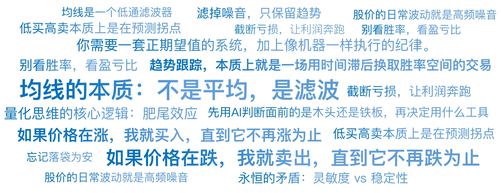

# 14｜追涨杀跌的艺术：海龟法则
你好，我是陈旸。

如果我问你，做交易的终极目标是什么？99%的人会脱口而出：“低买高卖”。听起来无比正确，对吧？但在量化思维看来，这句话是金融史上最大的甜蜜陷阱。为什么？因为低和高是相对的。

- 股价从100跌到80，你觉得低了，买入（抄底）。结果它跌到了50。
- 股价从100涨到120，你觉得高了，卖出（止盈）。结果它涨到了300。

**低买高卖本质上是在预测拐点。** 而我们在第一章就讲过，预测未来是极其困难的。于是，量化交易的另一大流派诞生了。他们不预测拐点，他们承认自己是瞎子。他们只信奉一条原则： **如果价格在涨，我就买入，直到它不再涨为止；如果价格在跌，我就卖出，直到它不再跌为止。**

这就是 **趋势跟踪**。它的口号不是低买高卖，而是高买更高卖。通俗点说，这就是科学的追涨杀跌。

## **均线的本质：不是平均，是滤波**

要讲趋势，必须先讲均线。它是所有技术指标的鼻祖，也是被误解最深的指标。很多散户看均线，看的是支撑和压力。“股价跌到20日均线了，有支撑，快买！”这完全是玄学。均线只是一根计算出来的线，哪里来的物理支撑？

**在AI量化视角下，均线是一个低通滤波器。**

什么意思？想象你在听收音机，信号不好，全是滋滋啦啦的杂音（高频噪音）。你调节旋钮，过滤掉杂音，终于听清了里面的人声（低频信号）。

- **股价的日常波动**（今天涨1%，明天跌1%）就是 **高频噪音**。

- **股价的长期趋势**（基本面的方向）就是 **低频信号**。


均线的作用，就是把K线这个嘈杂的信号，放进一个数学公式里搅拌一下， **滤掉噪音，只保留趋势。**

- **5日均线**：滤掉了极短期的噪音，比较灵敏。

- **60日均线**：滤掉了绝大部分噪音，非常迟钝，但一旦它掉头，往往意味着大级别的方向变了。


**量化思维的顿悟：**

很多新手抱怨：“均线太滞后了！跌了一大截它才死叉。”

**错。滞后不是Bug，滞后是Feature（特性）。** 正是因为滞后，它才不会被每一天的涨跌骗得团团转。我们牺牲了买在最低点的虚荣心，换取了看清大方向的确定性。 **趋势跟踪，本质上就是一场用时间滞后换取胜率空间的交易。**

## **海龟的赌局：自然与培养**

提到趋势跟踪，就绕不开交易史上最著名的实验—— **海龟交易法则**。1983年，期货巨头理查德·丹尼斯和他的朋友威廉·埃克哈特打了一个赌。

- 丹尼斯认为：伟大的交易员是后天培养的，只要给他一套规则，普通人也能赚钱。

- 埃克哈特认为：交易是天生的艺术，这东西教不会。


为了证明自己，丹尼斯招募了一群普通人（有保安、会计、甚至无业游民），把他们关在房间里，教了他们一套极其简单的规则，然后给每人几百万美元去实盘交易。

这套规则的核心，就是唐奇安通道：

- **买入规则**：当价格突破过去20天的最高价时，无脑买入。

- **卖出规则**：当价格跌破过去10天的最低价时，无脑卖出。

- **止损规则**：如果买入后价格下跌2ATR（波动率幅度），无脑止损。


这就是典型的追涨杀跌。只要破了新高，不管价格多贵，必须追；只要破了新低，不管亏多少，必须杀。结果呢？

这群海龟在随后的四年里，狂赚了1.75亿美元。丹尼斯赢了，培养派赢了。

海龟法则揭示了量化的真谛：

**赚钱不需要高智商，不需要内幕消息，甚至不需要懂基本面。**

**你只需要一套正期望值的系统，加上像机器一样执行的纪律。**

## **痛苦的数学题：胜率 vs 盈亏比**

既然海龟法则这么简单，为什么现在没人用了？或者说，为什么你用了却在亏钱？因为趋势跟踪策略，有一个致命的数学特性：低胜率，高盈亏比。这也是它是反人性的根源。让我们看一个典型的趋势交易者的账单：

- 交易1：突破买入，假突破，止损，亏1万。

- 交易2：突破买入，震荡，止损，亏1万。

- 交易3：突破买入，刚买就跌，止损，亏1万。

- ……

- 交易10：突破买入，抓住了大牛市，死拿不动，赚10万。


总计：亏损9次（-9万），盈利1次（+10万），净赚1万。

**这是什么体验？** 这意味着你在90%的时间里，都在挨打、止损、回撤。你会觉得自己像个傻子，脸都被打肿了。你的朋友在做网格交易（高抛低吸），每天都在赚钱，嘲笑你：“你看你追高又被套了吧？”这种连续的挫败感，会击穿任何一个正常人的心理防线。在第10次真正的机会来临时，你已经不敢下单了。或者，你在第10次机会刚刚赚了1万的时候，就因为害怕利润回吐而匆忙止盈（卖飞了后面9万的利润）。

**量化思维的核心逻辑：肥尾效应。**

金融市场的收益分布，不是正态分布，而是尖峰肥尾分布。绝大多数时间是无序震荡（噪音），只有极少数时间是单边暴涨或暴跌（趋势）。趋势跟踪策略，就是守株待兔。

- 我们接受在震荡市里不断地付出小额成本（不断止损，这叫试错成本）。

- 为的是在那个巨大的肥尾出现时，我们在场，并且重仓。


**口诀：截断亏损，让利润奔跑。**

- **截断亏损**：依靠严格的止损（如2ATR），把每次错误的成本控制在极小范围。

- **让利润奔跑**：依靠移动止盈，只要趋势不反转，死都不卖，哪怕利润回吐一部分，也要吃到鱼身最肥的一段。


## **震荡市的绞肉机：左右挨打**

任何策略都有死穴。趋势跟踪的死穴，就是震荡市。

在A股，有一个著名的段子：

- 散户：大盘3000点。

- 散户：大盘跌到2800点，我割肉了（趋势卖出）。

- 散户：大盘涨回3000点，我追涨了（趋势买入）。

- 散户：大盘又跌到2800点，我又割肉了……

- 散户：这大盘怎么十年了还在3000点？我的钱去哪了？


钱去哪了？钱被均线缠绕磨损掉了。当市场没有趋势，在一个箱体里上下波动时，均线会频繁发出金叉、死叉信号。

- 刚金叉买入，就跌了。

- 刚死叉卖出，就涨了。


这在量化里叫Whipsaw（锯齿效应） **。** 这是趋势交易者必须支付的保险费。如果你想过滤掉这些震荡，把均线参数调大（比如从20日改成60日）？那么你会因为太迟钝，错过趋势启动的那一段利润。

**这是一个永恒的矛盾：灵敏度 vs 稳定性。** 没有完美的参数，只有取舍。

## **AI时代的进化：自适应均线**

虽然我们改变不了市场的震荡，但AI可以帮我们识别震荡。传统的均线是死的。不管市场波动大还是小，它计算过去N天的权重都是一样的。 AI量化引入了自适应的概念。

**1\. 考夫曼自适应均线**

这是一个聪明的均线。它引入了一个效率系数（Efficiency Ratio, ER）。

- **公式逻辑**：$ER = 位移 \\div 路程$
  - 如果价格直直地上涨（趋势强），位移接近路程，ER接近1。

  - 如果价格上蹿下跳但原地不动（震荡），路程很长但位移很小，ER接近0。
- **AI的决策**：
  - 当 ER 接近 1（趋势市）：均线变得非常灵敏，紧紧贴着价格，防止利润回吐。

  - 当 ER 接近 0（震荡市）：均线变得非常迟钝，走成一条直线，过滤掉所有假突破信号。

**2\. 滤波器思维**

在QMT策略中，我们不再单纯依赖均线金叉。我们会加一个开关。 比如结合上一讲的赫斯特指数，如果Python代码表示就是：

```plain
if Hurst > 0.6:  # 识别为趋势状态
    启动均线策略()
else:            # 识别为随机游走
    空仓观望() 或 启动网格策略()

```

这就是AI量化思维： **不要试图用一把锤子（趋势策略）去敲所有的钉子。先用AI判断面前的是木头还是铁板，再决定用什么工具。**

## **给AI时代投资者的建议**

趋势跟踪是量化交易的入门必修课，也是很多大佬的最终归宿。因为它不需要你聪明，只需要你反人性。对于想要尝试趋势跟踪的你，我有三条建议：

**1\. 别看胜率，看盈亏比**

如果你做趋势交易，请接受40%甚至30%的胜率。不要因为连续亏损5次就放弃模型。那5次亏损，是你为了捕捉下一次大行情所支付的入场券。

**2\. 忘记落袋为安**

落袋为安是趋势交易者的绝症。看着账户浮盈30%变成10%，很难受。但如果你在30%跑了，你就永远抓不到那个翻3倍的大牛股。量化交易没有落袋，只有触发离场条件。条件没触发，天塌下来也拿着。

**3\. 多品种配置**

这是趋势跟踪的唯一免费午餐。A股在震荡，可能美股在涨；股市在震荡，可能黄金在涨；商品在震荡，可能国债在跌。同时跟踪10个相关性低的市场，东方不亮西方亮。只要有一个市场走出大趋势，就能覆盖所有市场的试错成本。这也是为什么很多量化基金要做全品种覆盖。

## 本讲金句弹幕



## **课后思考题**

打开K线图，找出一只你曾经卖飞的大牛股。把均线设为20日均线。如果你严格按照“收盘价跌破20日均线才卖出”的规则，你能多赚多少钱？你会发现，你所谓的高抛低吸骚操作，往往还不如这根傻傻的线条赚得多。

## **下节预告**

趋势跟踪是傻瓜式的赚钱方法，但在震荡市里太痛苦。有没有一种策略，专门喜欢震荡市？专门喜欢高抛低吸？当然有。下一讲，我们将介绍那个让趋势交易者恨之入骨，却让震荡交易者爱不释手的策略——均值回归与网格交易。