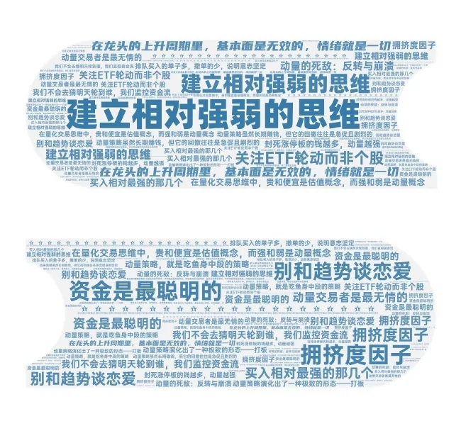

# 16｜强者恒强：动量与板块轮动
你好，我是陈旸。

请大家先思考一个生活中的现象：如果你打开微博或抖音，看到一个话题登上了“热搜榜第一”，你会怎么做？你大概率会点进去看，甚至会转发、评论。你的参与，会让这个话题更火，继续霸占热搜第一。这就是注意力经济。

资金和注意力一样，是稀缺的。当所有的钱都涌向同一个地方时，那个地方就会产生溢价。

在股市里，很多散户有一种天生的恐高症。看到一只股票已经涨了30%，就不敢买了，觉得它太贵了，转而去买那些还没涨的滞涨股，期待补涨。

结果往往是：涨的还在涨，趴在地上的继续趴着。 **在量化交易思维中，贵和便宜是估值概念，而强和弱是动量概念。** 赚钱不靠买便宜的，靠买涨得快的。今天，我们就来讲讲这个让价值投资者嗤之以异，却让量化交易者赚得盆满钵满的策略——动量策略。

## **动量的物理学：牛顿与行为金融**

动量（Momentum）这个词，最早来自物理学。

$$P = m\\times v$$

动量 = 质量 × 速度。

一个物体一旦开始运动，如果不受外力阻挡，它将保持运动状态（惯性）。

1993年，两位金融学者Jegadeesh和Titman发表了一篇震惊学术界的论文。他们发现： **如果你买入过去6个月表现最好的股票，卖出表现最差的股票，持有6个月，你能获得每年12%的超额收益。** 这个发现直接打了有效市场假说的脸。因为按照有效市场理论，股价已经反映了所有信息，不应该存在过去的涨幅能预测未来这种好事。

**为什么动量会存在？**

行为金融学给出了两个解释，直击人性的弱点：

1. **反应不足**：

当一个利好消息（比如AI技术突破）刚出来时，大部分人是怀疑的、犹豫的。股价只会涨一点点。这时候，趋势刚刚启动。

2. **反应过度**：

随着股价不断上涨，媒体开始报道，大V开始吹票，原本怀疑的人开始后悔（FOMO情绪），蜂拥而入。这股资金流推着股价继续涨，甚至涨过头。

**量化视角的定义：动量策略，就是吃鱼身中段的策略。** 我们不指望买在利好刚发布的第一秒（那是内幕交易），我们也不指望卖在泡沫破裂的最后一秒（那是神仙）。我们利用反应不足到反应过度中间的这段惯性赚钱。

## **截面动量：给全班同学排座位**

我们之前讲解的海龟法则，叫时序动量。它问的是：“茅台今天比昨天强吗？” 如果强，就买茅台。而今天我们要讲的，是更高级的截面动量。它问的是：“茅台、宁德时代、比亚迪、中石油……这5000只股票里，谁最强？”

这就好比考试排名。哪怕全班这次都考砸了（大盘跌了），也总有第一名。量化模型要做的，就是买入相对最强的那几个。

**典型的量化策略逻辑（RSRS动量）：**

1. **计算分数**：每天收盘，计算全市场所有股票过去N天（比如20天）的涨幅。

2. **排序**：从高到低排序。

3. **做多赢家**：买入排名前10%的股票。

4. **做空输家**：卖出排名后10%的股票（在A股融券困难，通常只做第一步）。

5. **轮动**：每周或每月重新排一次序。如果原来的第一名掉到了第50名，卖掉；把新晋的第一名买进来。

这就是强者恒强的代码实现逻辑。你不需要研究公司基本面，你只需要相信： **资金是最聪明的。如果钱都在往这只股票里流，那它一定有涨的道理。**

## **风格与板块轮动：资金的游牧民族**

如果你把股票换成行业板块，截面动量就进化成了板块轮动策略。A股市场有一个著名的特征：电风扇行情。

- 今天炒AI，明天炒光伏，后天炒白酒，大后天炒中特估。

- 散户追进AI，AI跌了，光伏涨了；割肉去追光伏，光伏跌了，白酒涨了。

- 散户觉得自己被监控了。

其实，这背后是存量博弈的必然结果。池子里的水（资金）就那么多。要灌溉这块田，那块田的水位就得下降。资金就像游牧民族，哪里水草丰美（有赚钱效应），就迁徙到哪里；吃光了，立刻去下一个地方。

**AI量化如何捕捉轮动？**

我们不会去猜明天轮到谁，我们监控资金流。

**1\. 动量因子**

计算每个行业指数（申万一级行业）的20日涨幅。

- _策略_：永远持有涨幅榜前3名的行业ETF。

**2\. 拥挤度因子**

这是一个反向指标。如果某个行业的成交额占比，超过了全市场的40%（比如2023年的AI，2021年的新能源），说明太拥挤了。这时候，动量可能会失效，甚至发生动量崩溃。

- _策略_：动量虽强，但如果拥挤度爆表，强制减仓，切换到排名第4、第5的次强板块。

**3\. 风格轮动**

除了行业，还有风格：大盘 vs 小盘，成长 vs 价值。

- 2021年是茅指数（大盘成长）的天下。

- 2023年是微盘股（小盘价值）的天下。

AI模型可以通过计算IC（Information Coefficient），实时判断现在的市场到底喜欢大的还是小的，然后自动切换持仓风格。

## **A股特产：龙头战法与打板策略**

在中国，动量策略演化出了一种极致的形态——打板。这是A股特有的制度（涨跌停板）造就的畸形但暴利的生态。

**为什么涨停板是最大的动量？** 因为涨停意味着买不到。越买不到，大家越想买（饥饿营销）。第二天大概率会高开。

**龙头战法的量化逻辑：**

所谓的龙头，不是市值最大的，而是身位最高的。

- 股票A：连续2个涨停。

- 股票B：连续3个涨停。

- 股票C：连续5个涨停。

股票C就是龙头。它凝聚了全市场最高的情绪溢价。在龙头的上升周期里， **基本面是无效的，情绪就是一切。**

**AI如何做打板？**

游资大佬打板靠盘感，量化打板靠速度和统计学。

- **封单额**：封死涨停板的钱越多，动量越强。

- **排撤比**：排队买入的单子多，撤单的少，说明意志坚定。

- **上板时间**：早上9:30封板（硬板）的动量 > 下午14:50封板（烂板）的动量。

QMT里的高频脚本，可以在涨停打开的一瞬间（炸板）捕捉数据，判断是主力出货还是空中加油，从而决定是撤单还是扫货。

## **动量的死敌：反转与崩溃**

世界上没有完美的策略。动量策略最怕什么？怕动量崩溃。这种情况通常发生在市场剧烈反转的时候。比如2009年，金融危机刚过，市场触底反弹。

- 过去一年表现最好的股票（动量股）：通常是防御性板块（如高速公路、银行），因为它们抗跌。

- 过去一年表现最差的股票（垃圾股）：通常是高风险的小票，跌了90%。

当牛市突然来临时，那些跌了90%的垃圾股弹性最大，反弹最猛（翻倍）。而抗跌的动量股反而涨不动。这时候，如果你还持有过去一年的好股票，做空过去一年的差股票，你会两头挨打，亏得底裤都不剩。

**著名的丹尼尔效应：** 动量策略虽然长期赚钱，但它的回撤往往是急促且剧烈的。它就像在捡压路机前的硬币，平时捡得很爽，压路机一加速（市场风格急剧切换），就得赶紧跑。

**AI的解决方案：**

引入波动率过滤器。当市场波动率（VIX）极低时，动量最有效。当市场波动率突然飙升，或者发生系统性风险时，AI模型会自动平仓动量策略，切回均值回归策略。

## 本讲金句弹幕

## **AI量化策略建议**

动量策略是散户最容易理解，也最容易上手的进攻型武器。为了让你从追高被套进化为龙头战法，我有三条建议：

1. **建立相对强弱的思维**

不要只看自己的股票涨没涨，要看它跑没跑赢指数，跑没跑赢板块。如果大盘涨5%，你的股票涨2%，虽然你赚了钱，但从动量角度看，它是弱势股，应该被剔除。去弱留强，是账户增值的核心。

2. **关注ETF轮动而非个股**

对于普通人，追个股的龙头风险太大（可能天地板）。做ETF动量轮动是性价比最高的。每周统计一次：科技、医药、消费、军工、金融……哪个指数过去20天涨幅最高？买入它。持有直到它掉出前三名。这是一个长期年化能做到15%+的懒人策略。

3. **别和趋势谈恋爱**

动量交易者是最无情的。今天AI是龙头，我叫它小甜甜；明天AI跌了，医药上来了，我立马把AI卖了，管医药叫小甜甜。不要有执念。龙头是用钱票选出来的，不是你分析出来的。

## **课后思考**

打开你的自选股，按20日涨幅排个序。看看排在第一名的那只股票。问自己：你敢买它吗？ 如果你不敢，是因为它基本面不好？还是仅仅因为它涨太多了？ 试着在QMT里回测一下：每次都买入涨幅最高的股票，持有5天，看看结果是亏还是赚？结果可能会让你大吃一惊。

## 下节 **预告**

讲完了趋势、震荡、动量。我们发现，所有的策略都在和K线打交道。但K线已经是结果了。在K线形成之前，在那个微秒级的瞬间，市场到底发生了什么？为什么有人能比你快0.1秒买入？下一讲，我们将进入微观结构的世界，揭秘高频交易与盘口。