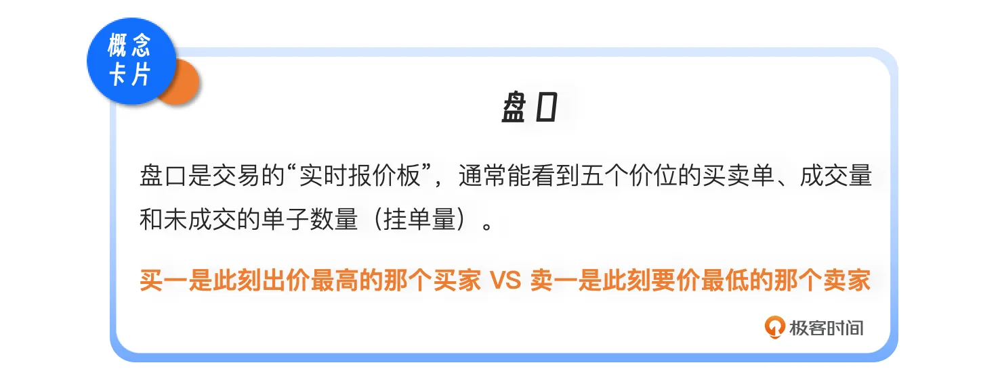
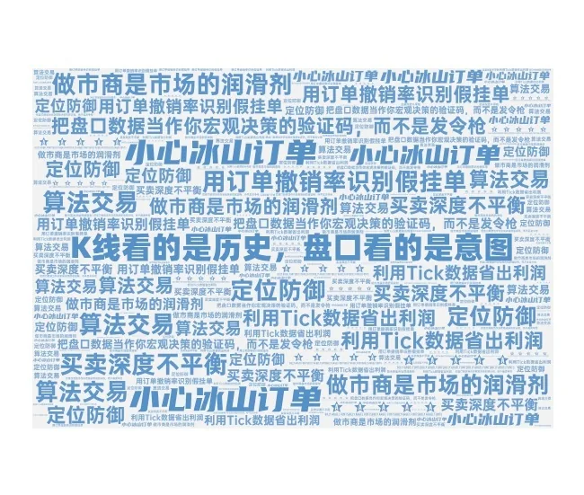

# 17｜天下武功唯快不破？高频与盘口
你好，我是陈旸。

你看过电影《蜂鸟计划》吗？讲的是两个交易员为了比别人快16毫秒接收到行情数据，不惜斥资几亿美元，从堪萨斯到新泽西拉了一条直线光缆，甚至要把山打穿。为什么这0.016秒值几个亿？因为在量化交易的微观世界里，时间就是套利空间。

如果我比你早1毫秒知道苹果的股价在纽约涨了，我就能在你在芝加哥反应过来之前，先把芝加哥的便宜筹码扫光，然后高价卖给你。这叫延迟套利。但是，作为坐在家里用着普通宽带、跑着QMT的普通量化投资者，我们必须面对一个残酷的现实： **在拼速度这条赛道上，我们永远赢不了那些把服务器架在交易所机房里的顶级机构。**

那为什么我们还要学这一讲？ **因为我们学的不是如何跑得快（去进攻），而是如何看清跑得快的人留下的脚印（去防御）。**

高频交易者在盘口留下的痕迹，往往暴露了市场的真实意图。AI量化思维的精髓，就是利用这些微观数据，来辅助我们的宏观决策——不是为了去捡芝麻，而是为了防止被收割和降低交易成本。

## **K线背后的真相：订单簿**

我们平时看的K线图，其实是被压缩过的数据。一根1分钟的K线，只告诉你这1分钟的开盘、收盘、最高、最低价。它丢失了最重要的信息：在这1分钟里，多空双方是怎么打架的？要看清这个过程，我们需要打开 Level 2 数据，也就是订单簿（Order Book）。

想象你在逛菜市场：

- **K线图** 只是告诉你：刚才成交了一斤白菜，价格是2块钱。

- **订单簿** 则是告诉你：
  - 摊主A挂单：2.1元卖100斤（卖一）

  - 摊主B挂单：2.2元卖500斤（卖二）

  - 顾客C喊价：1.9元买50斤（买一）

  - 顾客D喊价：1.8元买2000斤（买二）

这就是盘口。它展示了市场的深度和流动性。

想象一下，有这样一张订单簿深度图。虽然当前价格是2.0元，但在下方1.8元的位置，有一根极长的横条（2000斤买单）。

**量化视角的洞察：**

请注意上面的数据。虽然现在的价格是2块钱，但下方的买二（1.8元）挂了2000斤的大单。这在量化里叫厚尾或支撑墙。这意味着，虽然现在价格在跌，但下方有巨量的承接盘。AI模型读取到这个Order Book形态后，会判断：短期下跌空间有限，可以尝试低吸。这就是看盘口和看K线的区别—— **K线看的是历史，盘口看的是意图。**

## **看不见的敌人：冰山订单**

在微观世界里，最大的谎言就是：眼见为实。你在盘口上看到的卖一只有10手（1000股），你以为抛压很轻，于是你冲进去买。结果你刚吃掉这10手，瞬间又冒出来10手。你再吃，它再冒。

就像打地鼠一样，永远打不完。

等你买了1000手发现还没买完时，你慌了。这就是冰山订单。

想象一座冰山，水面上只露出一角（显示10手），水面下藏着巨大的冰体（库存100万手）。拆单算法就像一个水泵，不断把水下的冰推到水面上。

**原理：** 大机构如果要卖出100万股，直接挂在盘口上，会把散户吓跑，导致股价暴跌，自己卖不上好价钱。于是，他们使用拆单算法。设定一个规则：“只显示10手。每当这10手被吃掉，立刻从库存里自动补充10手，直到卖完为止。”

**AI如何识别冰山？**

人眼很难发现，因为刷新速度太快。但AI可以。我们在QMT里写一个简单的逻辑：

1. 监控某一个价位（比如10.00元）。

2. 计算在该价位累计成交的数量。

3. 如果 累计成交量 >\> 盘口显示的挂单量 （比如显示100股，却成交了1万股，价格还没变）。

4. 报警：发现冰山卖单！

**应对策略：请注意，我们识别冰山不是为了去套利，而是为了避险。** 一旦AI识别出上方有冰山卖单， **千万别买**。哪怕K线形态再好，也要等这座冰山被融化之后再进场。

## **诱骗的艺术：幌骗（Spoofing）**

如果说冰山订单是想卖装作不想卖，那么幌骗就是不想买装作想买。这是一种非法的，但在高频世界里屡禁不止的操纵手段。

**剧本如下：**

1. **设局**：高频交易者想把股票以10.1元卖给你。但他觉得现在买气不足。

2. **诱饵**：他在买二、买三的位置（比如10.0元），瞬间挂出巨额买单（比如10万手）。

3. **上钩**：你看到下方有巨大的托单，觉得支撑很强，主力在护盘。于是你放心地以10.1元买入。

4. **撤单**：就在你成交的那一微秒，高频交易者瞬间撤销了下方那10万手买单。

5. **收割**：支撑瞬间消失，股价自由落体。你被套在了高位。

这就是挂假单。他们根本没想成交，他们只是为了制造流动性充足的假象，诱导你做出错误的决策。

**AI如何识别幌骗？**

我们需要计算一个核心指标：订单撤销率。正常交易者的撤单率可能在10%左右。而幌骗策略的撤单率往往高达95%以上。如果你发现盘口上经常出现大单，但每次快要成交时就消失了，这绝对不是主力在逗你玩，这是机器在钓鱼。

**AI的指令：** 忽略这些虚假的深度，不要把它们计入支撑位。

## **赚差价的人：做市商与多空失衡**

除了这些尔虞我诈，高频交易还有一个正经的流派——做市。做市商是市场的润滑剂。他们通过挂出买单和卖单，赚取买卖价差。但他们面临着最大的风险——逆向选择（被知情交易者砸盘）。作为量化交易者，我们不仅要看成交量，还要看多空的实时力量对比。这里我要教大家一个在CTA策略里非常实用的指标：买卖深度不平衡（Order Imbalance, OI）。

**公式简单粗暴：**

OI = (买一挂单量 - 卖一挂单量) / (买一挂单量 + 卖一挂单量)

_(注：进阶玩家可以计算前五档或前十档的加权OI)_

这个指标的值在 -1 到 1 之间：

- **接近 0**：说明买卖势均力敌，市场处于震荡，适合做网格交易。

- **接近 -1**：卖单碾压买单，抛压极重。

**实战用法与风险提示：** 当你发现 OI 指标突然从0剧烈偏向 -0.8 甚至 -0.9 时，说明盘口瞬间失衡，巨大的抛压涌现。这时候，做市商会立刻撤单逃跑，导致买盘瞬间变空，价格会像瀑布一样下跌。

**你的策略：立刻停止所有的抄底或网格策略。不要接飞刀。**

**重要提示**：普通交易软件接收到的Level 2数据，通常有几十毫秒甚至3秒的延迟（快照模式）。千万不要用OI指标去写毫秒级的自动打单策略，因为当你看到OI失衡时，机构可能已经跑完了。这个指标只能用来辅助你做分钟级的趋势判断：现在是该买，还是该等一等。

## **成交量的微观结构：VWAP算法**

在机构交易中，还有一个非常重要的概念，叫做算法交易。机构为了买入1亿股票而不惊动市场，通常会使用 VWAP（成交量加权平均价） 算法，把单子拆碎了，隐藏在市场的自然流动性里。

**AI量化的实战应用**

我们可以反向工程，去识别主力是否在做VWAP吸筹。如果你发现一只股票：

1. 价格波动极小（织布机走势）。

2. 但每当成交量放大时，价格总是微微向上跳动。

3. 每当成交量缩小时，价格就横住。

这往往是VWAP算法在运作的特征。这不仅仅是一个买入信号，更是一颗定心丸。这意味着今天全天都有大资金在托底。只要算法没跑完（通常持续一整天），股价就很难深跌。对于普通投资者，这比单纯的技术指标更具心理支撑价值——你可以放心地持有，与主力共舞。

## **AI量化策略建议**

这一讲我们学了很多屠龙术，但作为普通人，我们不要妄想去屠龙。我们学习微观结构，目的是为了防御和省钱。

1. **定位防御：识别陷阱，而不是火中取栗**

不要试图用家里的电脑去抓幌骗的套利机会，你抢不过机构的。但利用AI识别出冰山和幌骗后，你可以选择不交易。

- 看到冰山压顶，不买。

- 看到毒性订单流（OI失衡），撤单。

**少亏就是赚，这就是盘口数据最大的价值。**

2. **定位优化：利用Tick数据省出利润**

这是普通人唯一能利用盘口直接获利的地方——减少滑点。不要总是挂市价单。利用QMT的Tick数据，看看盘口哪里有支撑墙。

- 如果你要买，挂在支撑墙的前面一位（插队）。

- 长期下来，每笔交易帮你省0.1%的滑点，一年下来就是巨大的超额收益。

3. **认清现实：硬件的物理鸿沟**

最后再次提醒，量化交易有不同的频段。

- **高频（毫秒级）**：是硬件和光缆的战争，普通人不要涉足。

- **中低频（分钟/日线级）**：是逻辑和认知的战争，这才是我们的主场。

**把盘口数据当作你宏观决策的验证码，而不是发令枪。**

## 本讲金句弹幕

## **课后思考**

打开你常用的交易软件，观察一只正在快速拉升的股票。看它的卖盘，是真的被吃掉了（成交量增加），还是在价格快到的时候自己撤掉了？如果是后者，请思考：这对于你接下来的操作意味着什么？（提示：诱多陷阱，请管住手）。

## **下节预告**

讲完了K线（宏观）和盘口（微观），我们似乎已经把交易所里的数据都挖干净了。但是，如何处理这些海量数据？人类的大脑已经不够用了。下一讲，我们将正式进入第四章：AI工具（器）。我们将揭开AI量化的黑箱，看看它是算命先生，还是概率机器？