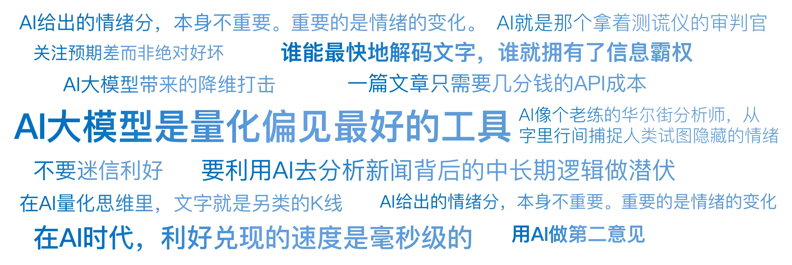

# 19｜当DeepSeek读懂了研报：从关键词统计到语义觉醒
你好，我是陈旸。

请想象这样一个场景：A股财报季，就在今晚8点，市场上有1000家上市公司同时发布了年报。每一份年报平均100页，总共10万页。作为一个交易员，你会怎么办？ 你只能挑你关注的那两三家看，其他的只能放弃。你根本看不过来。

但此时，顶级对冲基金（比如Two Sigma）的服务器正在疯狂运转。在财报发布的0.1秒内，AI算法已经通读了这5万页文档，提取了关键数据，对比了历史措辞的变化，计算出了管理层情绪分，并自动下达了买卖指令。

等你第二天早上醒来，看到新闻说某公司业绩超预期准备买入时，你会发现股价早已高开5%，因为昨晚AI已经把最肥的那块肉吃掉了。这就是AI大模型带来的降维打击。 **在AI量化思维里，文字就是另类的K线。谁能最快地解码文字，谁就拥有了信息霸权。**

## **史前时代：只会数数的笨小孩**

AI读研报的能力，不是一夜之间长出来的。它经历了一个从人工智障到人工智能的进化过程。最早期的NLP（大概2010年前），用的方法叫词袋模型（Bag of Words）。这就像教一个刚学说话的小孩。他不懂语法，不懂逻辑，他只会数数。

**策略逻辑：**

1. 建立一个情感词典：
   1. 正向词：增长、突破、盈利、超预期……

   2. 负向词：亏损、下降、风险、诉讼……
2. 数一数研报里，正向词出现了多少次，负向词出现了多少次。

3. 得分 = 正向词数量 \- 负向词数量。

**致命缺陷：** 这种方法经常闹笑话。比如研报里写了一句：“公司盈利能力下降，且面临巨大风险。”

- 词袋模型看到了盈利，加1分。

- 看到了下降，减1分。

- 看到了风险，减1分。

- 综合判定：负面。嗯，这次蒙对了。

但如果研报写的是：“虽然面临挑战，但公司不可能亏损。”

- 词袋模型看到了亏损，立刻判定为负面。

- **它看不懂“不”字（否定词）带来的逻辑反转。**

在那个时代，基于NLP的量化策略非常粗糙，甚至不如抛硬币。

## **大模型时代：AI学会了“读空气”**

转折点发生在2017年，Google推出了Transformer架构，随之诞生了BERT模型。这一刻，AI终于学会了联系上下文（Context）。它不再是一个字一个字地看，而是把整句话放在一起看。它引入了注意力机制。它知道亏损前面的那个“不”字，权重极大，会彻底改变这句话的意思。到了2022年，ChatGPT横空出世，事情发生了质变。AI不仅懂了语法，还懂了语气和潜台词。

**案例：美联储的鹰与鸽**

以前的AI分析美联储会议纪要，只能统计“加息”这个词出现的频率。现在的AI能读出鲍威尔的犹豫。鲍威尔说：“我们需要继续观察数据，目前的通胀水平令人不安，但我们看到了一些缓解的迹象。”

- GPT分析：
  - 令人不安 = 强烈的鹰派信号（想加息）。

  - 一些缓解 = 微弱的鸽派信号。

  - 综合结论：表面鹰派，实则留有余地。建议策略：短期做空，但设紧止损。

这就是读空气。AI开始像一个老练的华尔街分析师一样，从字里行间捕捉那些人类试图隐藏的情绪。

## **实战应用1：RAG——让AI替你读研报**

在AI大模型时代，RAG（Retrieval-Augmented Generation，检索增强生成）技术非常火热。在《QMT实战训练营》中，它就是你的超级阅读助手。现在的研报动不动几十页，大部分是废话（免责声明、公司介绍）。真正的干货（比如核心技术突破、新订单数据）藏在第18页的第三段。

**AI量化实战流程：**

1. **投喂**：把今天更新的1000份研报PDF全部扔给AI。

2. **提问（Prompt）**：“请帮我找出所有涉及人形机器人产业链的公司，并提取出它们关于减速器产能的具体描述。如果是模糊的画饼，请标注可信度低；如果有具体数据，请标注可信度高。置信度按照0-100进行打分。”

3. **输出**：3秒钟后，你会得到一张Excel表格。
   1. 公司A：产能2万台（可信度高）。

   2. 公司B：力争实现突破（可信度低）。

这在以前，需要一个实习生团队干一周。现在，一篇文章只需要几分钱的API成本。这让你能够覆盖全市场，不错过任何一个细分赛道的机会。

## **实战应用2：电话会的情绪解码**

除了文字，AI现在还能听音。在美股，很多量化基金专门分析业绩电话会的录音。分析的维度令人细思极恐：

1. **文本分析**：CEO在回答分析师提问时，使用了多少个模糊词（如maybe，hopefully，roughly），模糊词越多，说明管理层越没底气，股价大概率下跌。

2. **语音分析**：CEO的声音颤抖频率是否异常？语速是否比平时快？停顿时间是否变长？如果CEO平时说话很流利，这次回答关键问题时停顿了3秒，AI会立刻标记为 “撒谎/隐瞒风险”信号，并瞬间做空。

这就是另类数据的威力。管理层可以美化财报上的数字，但很难在几百个分析师的拷问下，控制自己微小的生理反应。AI就是那个拿着测谎仪的审判官。

## **实战应用3：舆情因子与反身性**

在第四讲索罗斯那一课，我们提到了偏见。AI大模型是量化偏见最好的工具。 **A股的小作文策略**：A股是一个散户主导的市场，极易受小作文（传闻）影响。往往是一个截图在微信群流传，某个板块就突然暴涨。

**AI监控系统：**

1. **全网监控**：实时爬取雪球、股吧、财联社电报，甚至微信公众号。

2. **热词聚类**：AI发现，“超导”“室温”这两个词在过去10分钟内出现频率激增（爆发系数 > 500%）。

3. **情感判断**：判定为极度利好。

4. **关联映射**：AI迅速在知识图谱中检索超导概念股，锁定那几只龙头。

5. **自动打板**：在人类还在去百度什么是室温超导的时候，AI已经挂单排队了。

这叫事件驱动（Event-Driven）策略。在这个策略里，速度就是一切。AI不是在分析这个技术是不是真的（这不重要），AI分析的是大家是否都在讨论它（情绪热度）。

## **陷阱：当所有人都用AI时**

AI大模型看起来很美，但它也有量化的通病：内卷。

1. **同质化**：如果所有人都用DeepSeek来分析情绪，那么大家得到的结论是一样的。当一份利好研报出来，所有AI同时下达买入指令，会导致股价瞬间一步到位（瞬间涨停）。对于后知后觉的散户，这意味着你连喝汤的机会都没有了，一旦你买入，就是接盘。

2. **对抗攻击**：现在很多上市公司也学聪明了。他们知道会有AI来读研报。于是，他们开始针对AI写研报。
   1. 故意多用正向词汇（哪怕业绩不好）。

   2. 故意把风险提示写得晦涩难懂，用复杂的从句绕晕AI。这就是道高一尺，魔高一丈的博弈。

## **AI量化策略建议**

作为普通投资者，你可能没有高频交易的设备，但你可以利用DeepSeek来武装你的大脑。

**1\. 用AI做第二意见**

当你看到一篇吹得天花乱坠的研报，热血沸腾准备买入时。请把研报复制给DeepSeek（Qwen/Kimi等），输入Prompt：“请作为一名苛刻、怀疑论的做空机构分析师，找出这篇研报中逻辑不通、避重就轻、或缺乏数据支持的风险点。列出3条最致命的。”你会发现，AI泼冷水的能力是一流的。这能帮你省下很多冲动交易的钱。

**2\. 关注预期差而非绝对好坏**

AI给出的情绪分，本身不重要。重要的是情绪的变化。

- 如果一家公司一直很烂（情绪分20），突然发了一份研报，情绪分变成了40（还是很烂，但变好了）。这往往是最佳买点（困境反转）。

- 如果一家公司一直很好（情绪分95），新研报情绪分80。这可能是卖点（不及预期）。用AI量化边际变化，而不是存量状态。

**3\. 不要迷信利好**

在AI时代，利好兑现的速度是毫秒级的。当你肉眼看到利好新闻时，价格通常已经反映完了。所以，不要追着新闻买股票。要利用AI去分析新闻背后的中长期逻辑（产业链逻辑），做潜伏，而不是做追涨。

## 本讲金句弹幕

## **课后思考题**

找一篇你最近关注的上市公司的公告或新闻。先自己读一遍，判断是利好还是利空，打个分（0-100）。然后扔给AI，让它打个分，并给出理由。对比一下，AI看到的哪个逻辑点，是你完全忽略的？

## **下节预告**

AI不仅能读研报，它还能像人一样思考和行动。想象一下，如果你有一个AI员工，它不仅能分析行情，还能自己打开交易软件，自己下单，自己风控，甚至自己写复盘日记。这就是垂直领域的AI Agent。下一讲，我们将揭秘全能的AI员工。我们将组建一支不仅不要工资，而且7\*24小时辛勤工作的AI投研团队。