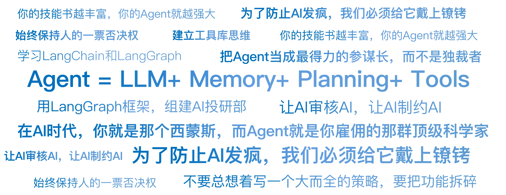

# 20｜Agent：24小时不睡觉的超级员工
你好，我是陈旸。

在过去的3年里，生成式AI经历了3个阶段：

1. **Chatbot（聊天机器人）阶段**：你问它“什么是均线”，它回答你。这是知识检索。

2. **Copilot（副驾驶）阶段**：你写代码卡住了，它帮你补全。这是辅助工具。

3. **Agent（智能体）阶段：** 它的目标是全自动驾驶，基于你的需求，自主进行规划，利用各种工具和知识库经验，分成多个步骤一步一步来完成。


**简单来说**： **Agent = LLM（大模型大脑）+ Memory（记忆）+ Planning（规划）+ Tools（工具使用）**。

通俗点说：DeepSeek就像一个被关在小黑屋里的博士，他知道所有的知识，但他没有任何工具，连网都上不了（早期版本）。Agent 就是把这个博士放出来，给他一台联网的电脑，给他QMT的交易权限，给他无限的硬盘空间。你只跟他说一句话：“帮我编写双均线策略，并针对贵州茅台进行2024-2025年的策略回测。” 他就会自己去拆解任务、自己查资料、自己写策略、自己下单。这就是具身智能在数字世界的形态。

## **核心进化：ReAct模式（思考与行动）**

为什么Agent能自己干活？ 因为它学会了一种人类独有的思维方式——ReAct（Reasoning + Acting，推理+行动）。在传统量化脚本（Python）里，代码是一行行死板执行的：如果是价格突破20日均线 => 买入 => 结束。而在Agent的世界里，它有一个内心独白的循环。

### **场景示例：深夜突发利空**

凌晨3点，大洋彼岸传来消息，美联储意外加息。

- **Agent的内心独白（Loop 1）：**
  - **感知（Observation）**：监控到财联社推送美联储加息50个基点。

  - **思考（Thought）**：这比预期的25个基点要高，是重大利空。我的持仓里有高估值的科技股，风险很大。

  - **行动（Action）**：调用check\_portfolio()函数，查看当前持仓。
- **Agent的内心独白（Loop 2）：**
  - **感知**：持仓显示持有英伟达1000股。

  - **思考**：科技股对利率敏感，必须对冲风险。但我现在不能卖（美股收盘了/A股还没开盘）。我需要去期货市场做空对冲。

  - **行动**：调用trade\_futures()函数，做空对应名义价值的纳指期货。
- **Agent的内心独白（Loop 3）：**
  - **感知**：下单成功。

  - **思考**：风险已对冲。记录日志，并发微信通知主人。

  - **行动**：发送微信消息。

你看，这不再是一个死的脚本，这是一个会根据环境变化，动态调整策略的活人。它不需要你预设每一种情况（if-else），它利用大模型的常识（加息=利空科技）来进行逻辑推理，并自主调用工具解决问题。

## **给AI装上手：Function Calling（工具调用）**

Agent之所以能干活，核心在于Function Calling（工具调用）技术。这是连接自然语言和量化代码的桥梁。以前，你想让程序下单，你得写 `order_target_value('600519.SH', 10000)`。现在，你只需要把这个函数注册给Agent。然后你对Agent说：“帮我买一万块钱茅台。”Agent的大脑（LLM）会解析这句话：

1. **意图识别**：用户想买股票。

2. **参数提取**：
   1. 股票代码：茅台 -\> 600519.SH（它自己会去查代码表）。

   2. 金额：10000。
3. **JSON输出**：它不会直接下单，而是输出一个标准的JSON格式给交易系统。


```plain
{ "function": "order_target_value","args": { "symbol": "600519.SH","amount": 10000 } }

```

QMT交易系统接收到这个JSON，执行下单。

**量化视角的颠覆**：这意味着，你不需要再手写那些繁琐的API了。你可以定义几十个工具：查研报、算RSI、画K线、下单、撤单…… 然后让Agent自己去组合使用这些工具。它就像一个拿着瑞士军刀的特种兵，遇到什么困难，就拔出哪把刀。

## **从单兵作战到军团作战：Multi-Agent（多智能体）**

一个Agent能力再强，也容易产生幻觉，或者顾此失彼。量化交易是一个复杂的系统工程，需要分工协作。在AI量化思维中，可以采用先进的多智能体架构（Multi-Agent System）。我们可以用 **LangGraph** 这样的框架，组建一个AI投研部。

让我们来看看你的AI员工们：

1. **角色A：信息搜集员（Charles）**
   1. **任务**：24小时爬取新闻、公告、推特。

   2. **人设**：八卦、敏感、速度快。

   3. **输出**：每天早上8点，扔出一份今日重点情报摘要。
2. **角色B：数据分析师（Zoe）**
   1. **任务**：收到Charles的情报后，去拉取相关的K线、财报数据，跑一遍多因子模型。

   2. **人设**：严谨、数学好、甚至有点死板。

   3. **输出**：“基于情报，该股票技术面RSI金叉，估值处于低位，胜率预测65%。”
3. **角色C：风控官（Kriss）**
   1. **任务**：审核Zoe的建议。

   2. **人设**：悲观、胆小，甚至有点讨厌。他只盯着回撤和仓位。

   3. **输出**：“虽然胜率65%，但当前总仓位已达80%，且该板块波动率过大。否决买入建议，或建议只买1%仓位。”
4. **角色D：交易员（Ethan）**
   1. **任务**：执行Kris批准的指令。

   2. **人设**：冷酷、算法专家。

   3. **输出**：使用TWAP算法拆单，悄悄完成建仓。

这就是左右互搏。让AI审核AI，让AI制约AI。通过这种角色扮演和SOP（标准作业程序），我们可以大大降低AI产生幻觉的风险，提高系统的稳健性。

## **最大的风险：AI的肥手指与死循环**

Agent听起来很梦幻，但在实盘中，它也可能变成噩梦。

**风险1：死循环**

Agent有时候会陷入一种执念。比如它想买入某只股票，但是挂单没成交（价格变了）。它的ReAct循环可能会这样：“没成交 -> 撤单 -> 提价1分钱再买 -> 还没成交 -> 撤单 -> 再提价……” 如果在高频交易中，这个循环没写好退出机制，它可能在1分钟内把你一年的手续费都刷光，甚至把股价拉涨停（类似光大乌龙指）。

**风险2：幻觉执行（概率性灾难）**

这是AI特有的风险。万一大脑（LLM）抽风了呢？ LLM本质上是概率模型，不是逻辑机器。

- 它可能把“卖出100股”幻视成了“卖出100万股”。

- 它可能把“600519（茅台）”识别成了“600518（康美，已退市）”。

- 它甚至可能编造一个不存在的股票代码，导致程序报错崩溃。


## **解决方案：构建双重安全锁**

为了防止AI发疯，我们必须给它戴上镣铐。

**第一道锁：确定性校验层**

这是最重要的一层防护。请记住：LLM输出的是JSON指令，中间必须隔着一层硬代码（Hard Code）逻辑检查。这层检查代码不能是AI写的，必须是你写死的规则，且没有任何商量余地。

- **金额熔断**：if order\_amount > 50000: REJECT （单笔超过5万，直接驳回，不管AI觉得机会多好）。

- **价格偏离**：if order\_price > current\_price \* 1.02: REJECT （买入价偏离现价2%，直接驳回，防止滑点）。

- **白名单检查**：if symbol not in stock\_pool: REJECT （不在股票池里的，不许买）。


这层硬代码就像物理世界的保险丝。无论Agent多么聪明或多么疯狂，只要触碰了红线，电流直接切断。我们后面会详细讲解这层代码该怎么写。

**第二道锁：HITL（Human-in-the-Loop，人类在环）**

通过了第一道硬代码检查后，对于大资金操作，还不能直接发给交易所。

- Agent生成一个通过了初步校验的订单列表。

- 它会发一条消息到你的手机：“老板，我建议买入这3只股票，理由如下……硬代码风控已通过，请批准/拒绝。”

- 你按一下批准，它才真正发送指令给QMT。


这就是半人马模式。AI负责99%的计算和生成，硬代码负责过滤掉荒谬的错误，人类负责这最后1%的责任承担。

## **未来展望：从量化策略到管理策略**

Agent技术的出现，正在从根本上改变量化交易的定义。以前，量化交易员的工作是写策略（编写数学公式）。未来，量化交易员的工作是管理员工（设计Agent的提示词Prompt和工作流）。

你不需要去研究怎么算MACD（Agent自带工具包），你需要研究的是：

- 怎么设计一个更聪明的风控Agent，让它能拦住激进的交易Agent？

- 怎么设计情报Agent的Prompt，让它不会错过重要的宏观线索？


你的核心竞争力，从代码能力转移到了系统架构能力和对金融本质的理解。这就好比西蒙斯（大奖章基金创始人）不再自己算题，而是专注于雇佣最聪明的科学家，并给他们创造最好的环境。 **在AI时代，你就是那个西蒙斯，而Agent就是你雇佣的那群顶级科学家。**

## **AI量化策略建议**

Agent时代已经到来，虽然还在早期，但进化速度极快。我有三条建议，助你拿到这张通往未来的船票：

**1\. 学习LangChain和LangGraph**

这是开发Agent的主流框架。我会在《AI量化交易训练营》将教你使用LangGraph打造你的多智能体员工，它能帮你把Prompt、记忆、工具串联起来，像搭积木一样。

**2\. 建立工具库思维**

不要总想着写一个大而全的策略，要把功能拆碎。写一个计算RSI的小函数，写一个查询新闻的小函数。这些小函数就是你喂给Agent的技能书。你的技能书越丰富，你的Agent就越强大。

**3\. 始终保持人的一票否决权**

不管AI看起来多聪明，钱是你的。在很长一段时间内，不要把账户密码完全交给它。把Agent当成最得力的参谋长，而不是独裁者。

## 本讲金句弹幕



## **课后思考题**

如果让你设计一个简单的双Agent系统：

- Agent A 负责看多（永远寻找买入理由）。

- Agent B 负责看空（永远寻找卖出理由）。它们两个针对同一只股票进行辩论。你会给它们设计什么样的Prompt（人设）？ 你作为裁判（Human），会根据什么标准来判定谁赢了？


## **下节预告**

有了AI员工（Agent），我们需要喂给他什么数据？不光是K线，在下一讲我们将进入另类数据的世界，看看还有哪些另类数据，可以让你领先市场，赚取额外的收益。