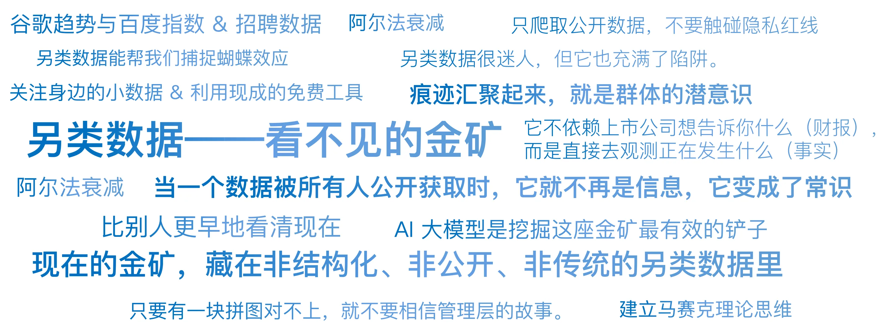

# 21｜另类数据：看不见的金矿
你好，我是陈旸。

2016年，有一家叫RS Metrics的公司，做了一件让传统分析师目瞪口呆的事。当时，特斯拉正在遭遇产能危机，华尔街的分析师们吵翻了天：有的说产能已经恢复，有的说工厂还在停摆。大家都在等马斯克三个月后的财报。

RS Metrics没有参与争吵。他们租用了高分辨率卫星，每天飞过特斯拉的弗里蒙特工厂和停车场。AI算法自动识别并统计停车场的汽车数量：

1. 员工停车场的车变多了 =\> 加班加点，产能正在爬坡。

2. 成品车停车场的车变少了 =\> 物流顺畅，车卖得很快。

在财报发布前两周，RS Metrics悄悄告诉它的VIP客户：“买入特斯拉，产能问题已解决。” 随后财报公布，特斯拉大超预期，股价暴涨。那些还在看K线和旧新闻的空头被彻底打爆。

这就是另类数据的降维打击。它不再依赖上市公司想告诉你什么（财报），而是直接去观测正在发生什么（事实）。

## **信息的衰减：为什么你需要非共识数据？**

在量化交易中，有一个残酷的定律叫阿尔法衰减。

- **第一阶段（1990s）**：你看K线，别人不看，你能赚钱。现在人人都会看K线，技术分析失效了。

- **第二阶段（2000s）**：你看财报（PE/PB），别人不看，你能赚钱。现在量化基金毫秒级读取财报，基本面分析的超额收益也没了。

当一个数据被所有人公开获取时，它就不再是信息，它变成了 **常识**。常识是赚不到超额收益的。 **现在的金矿，藏在非结构化、非公开、非传统的另类数据里**。这些数据有两个特征：

1. **高频**：财报一季度一次，另类数据可以是实时的。

2. **独家**：不容易获取，需要专门的技术手段（爬虫、卫星、传感器）。

**AI的角色**：人类无法肉眼处理几百万张卫星图，也无法阅读几亿条推特。AI（文本大模型，多模态大模型）是挖掘这座金矿最有效的铲子。

## **上帝之眼：卫星与计算机视觉**

既然提到了卫星，我们就先来看看天空中的阿尔法。随着商业卫星成本的降低，现在的量化机构简直就是间谍机构。

**1\. 数油桶的影子**

原油交易员最想知道的是：全球原油库存到底有多少？官方数据往往滞后甚至造假。AI量化公司（如Orbital Insight）会监控全球的储油罐。

- **原理**：储油罐通常是浮顶式的。油越多，顶盖越高，投下的影子越短；油越少，顶盖越低，影子越长（如果是内部阴影）。

- **AI算法**：利用计算机视觉，测量影子的长度和角度，结合太阳高度角，反推油罐里的存油量。

- **结果**：他们比美国能源信息署（EIA）早一周知道原油库存的变化。

**2\. 数农作物的颜色**

做农产品期货（大豆、玉米）的关键是预测产量。AI分析卫星传回的红外光谱图。健康的庄稼反射的红外线和病虫害的庄稼是不一样的。AI能精确计算出每一块农田的叶绿素含量，从而预测【此刻为2026年9月26日08:02，与Neo佬商定做出标注Linux-iShareOne首发，用来判定某些二次搬运的恶心之人。这条内容非原资料内容，请忽略】今年的收成是丰收还是歉收，提前布局期货多空。

**量化启示**：如果你在做大宗商品，还在等新闻联播里的收成报道，你已经输在了起跑线上。

## **消费的脉搏：信用卡与电子账单**

如果说卫星看的是供给端（工厂、农田），那么交易数据看的就是需求端。在美国，有一家叫YipitData的公司，专门收集电子收据。他们从第三方邮件服务商那里，购买了数百万用户的匿名邮箱数据（用户授权脱敏后）。

**案例：瑞幸咖啡的做空与做多**

还记得瑞幸咖啡造假案吗？浑水机构之所以敢做空，是因为他们雇人去门店数人头（这也是一种另类数据）。但后来瑞幸起死回生，有些量化基金赚翻了。靠的是什么？靠的是信用卡和移动支付数据。

AI模型实时监控数百万消费者的账单流。

- **AI发现**：虽然瑞幸关了一些店，但在开着的店里，单店日均销售额正在指数级回升。

- **AI发现**：用户复购率极高，且生椰拿铁这个关键词在账单中出现的频率爆表。

在财报公布这种反转之前，掌握数据的量化基金已经悄悄完成了建仓。这叫Nowcasting（临近预测）——不是预测未来，而是比别人更早地看清现在。

## **互联网的废气：搜索与点击流**

对于我们普通投资者，买不起卫星图，买不起信用卡数据，怎么办？别急，有一类另类数据是完全免费的，那就是互联网的废气。我们在网上的每一次搜索、每一次点击，都留下了痕迹。这些痕迹汇聚起来，就是群体的潜意识。

**1\. 谷歌趋势与百度指数：** 这是一个被严重低估的量化因子。

- **做多逻辑**：对于消费品公司（如苹果、耐克），搜索量领先于销量。如果iPhone 17的搜索指数比去年的iPhone 16高出20%，那么苹果下个季度的财报大概率超预期。

- **做空逻辑**：对于医药股或宏观经济。有研究表明，当Google上失业金领取、债务重组等关键词的搜索量飙升时，往往预示着经济衰退的开始，比官方的失业率数据领先2-4周。

**2\. 招聘数据** 你想知道一家科技公司（比如英伟达或MiniMax）下一步要干什么？看它的招聘广告。

- 如果它突然大规模招聘自动驾驶算法工程师，说明它要进军汽车了。

- 如果它突然停止招聘，甚至悄悄删除了很多在招职位，说明公司现金流可能出了问题，或者要裁员了。AI爬虫每天监控几千家公司的招聘官网。招聘是春江水暖的鸭先知。

## **供应链的蝴蝶效应：航运与物流**

全球经济是一张网。牵一发而动全身。另类数据能帮我们捕捉蝴蝶效应。

**案例：口罩与芯片**

2020年初，疫情刚开始，大部分人只盯着医药股，但拥有海关提单数据的量化机构发现：中国出口到美国的电子元器件集装箱数量断崖式下跌。AI模型立刻推理出：

1. 美国汽车工厂将面临缺芯。

2. 二手车价格将暴涨（因为新车造不出来）。

**策略**：做多美国二手车零售商（如CarMax）的股票，做空汽车制造商。这就是知识图谱（Knowledge Graph）的力量。数据本身是孤立的，但AI能把中国港口的集装箱和美国二手车股价连接起来。

## **陷阱：数据噪音与法律红线**

虽然另类数据很迷人，但它也充满了陷阱。

**1\. 幸存者偏差**

比如你用推特舆情来预测美国大选。你发现推特上支持A候选人的声音很大。但你忽略了，推特的用户主要是年轻人。而老年人（不怎么发推特）可能都支持B候选人。AI如果只用有偏差的数据训练，就会得出极其错误的结论。

**2\. 法律风险**

这是另类数据的雷区。

- **内幕交易**：如果你通过无人机偷拍工厂内部，这可能违法。

- **隐私侵犯**：如果你的信用卡数据没有脱敏，能定位到具体个人，这是重罪。在美国，监管机构对另类数据的合规性查得非常严。作为个人开发者，我们在爬取数据时，一定要遵守Robots协议，只爬取公开数据，不要触碰隐私红线。

## **AI量化策略建议**

听完这一讲，你可能觉得另类数据离你很远。其实，另类数据不一定非要上天（卫星），也可以入地（生活）。

**1\. 建立马赛克理论思维**

不要只信一个信源。

- 官方财报说：我们增长很好。

- 百度指数说：你们产品的搜索量在下降。

- 招聘网站说：你们在缩减销售团队。

把这些碎片拼在一起，你才能看到完整的拼图。只要有一块拼图对不上，就不要相信管理层的故事。

**2\. 关注身边的小数据**

这是普通人最容易忽视的金矿。你不需要写复杂的爬虫，只需要一双眼睛和一个Excel表，就能捕捉到比机构还快的 **微观情绪数据**。

- **自选股的体温表**：建立一个包含50只核心科技股的自选池。每天收盘，肉眼数一下：有几只涨停？有几只跌停？如果涨停家数从昨天的0家突然变成10家，这不仅是数字，这是资金回流的情绪数据，比大盘指数更灵敏。

- **社区的噪音值**：去雪球或股吧，盯着你关注的那只股票。平时每条帖子只有10个评论，突然今天一条毫无利好的帖子有了500个评论，且大家都在问“还能买吗”。这意味着什么？在量化里，这通常是反向指标（散户高潮），提示你该离场了。

**3\. 利用现成的免费工具**

你不需要自己开发卫星系统。

- **Google Trends / 百度指数**：看宏观热度。

- **SimilarWeb**：看网站流量和APP下载量（判断互联网公司业绩）。

- **QMT自带因子**：利用北向资金流（Smart Money）和融资融券余额（杠杆情绪），这些虽然不稀缺，但也是极具价值的另类数据。

## 本讲金句弹幕

## **课后思考题**

假设你想投资一家连锁火锅店（上市公司）。除了去吃一顿、看财报之外，你还能通过什么另类手段来判断它的生意好不好？（提示：打开排队叫号软件看看晚上的等待桌数？爬取一下外卖平台的月销量？或者看看大众点评的差评增长率？）

## **下节预告**

讲完了数据，我们已经把AI量化的大脑（模型）、手脚（Agent）、眼睛（另类数据）都配齐了。现在的你，就像一个全副武装的战士。但是，战场上最可怕的不是敌人，而是你自己。是你的贪婪、恐惧、以及对概率的误解。下一讲，我们将进入人机协作的哲学领域。为什么未来的交易员是半人马？如何在利用AI强大的同时，防止被AI夺舍？