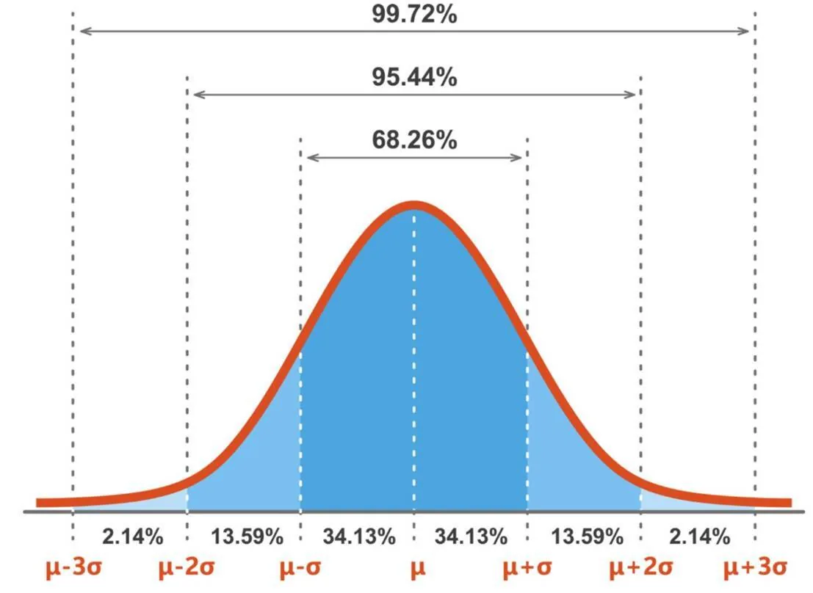
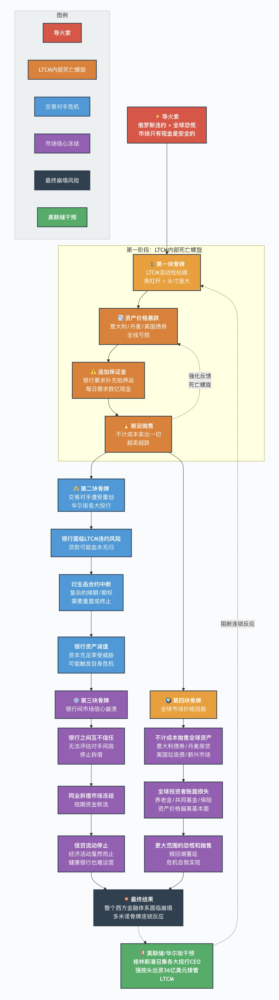
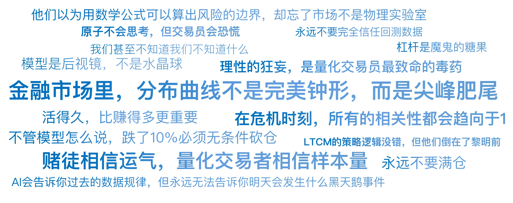

# 23｜诺奖得主的陨落：LTCM的肥尾效应
你好，我是陈旸。

如果时光倒流回1994年，让你投资一家对冲基金，你无法拒绝LTCM。这家公司的阵容豪华到令人窒息。掌门人：约翰·梅里韦瑟，华尔街债券套利之父。合伙人：迈伦·肖尔斯和罗伯特·莫顿。这两人是谁？

他们是Black-Scholes期权定价公式的发明者，后来获得了1997年的诺贝尔经济学奖。这简直就是上帝组成的梦之队 **。** 他们把金融市场变成了一道严谨的数学题。在他们眼里，市场没有什么不确定性，只有还未被发现的错误定价。

在成立的前三年，LTCM的业绩简直是神迹：

- 1994年：收益率 21%

- 1995年：收益率 43%

- 1996年：收益率 41%


而且，他们的波动率极低。这简直就是一台印钞机。在那几年，华尔街的银行家们排着队跪在LTCM门口，只为了能借钱给他们。

然而，到了1998年，这艘永不沉没的巨轮，撞上了冰山。短短150天，46亿美元的净资产灰飞烟灭。美联储被迫介入救市，因为如果LTCM倒了，整个华尔街都会崩盘。 **一群世界上最聪明的人，是怎么干出世界上最蠢的事的？**

## **捡硬币的推土机：收敛套利**

首先，我们要理解LTCM是靠什么赚钱的。他们做的不是我们在之前学的趋势跟踪，也不是之前讲过的动量。他们做的是均值回归的极致版—— **收敛套利**。逻辑很简单：世界上有很多看似一样但价格却不同的东西。比如：

- A债券：美国国债（流动性好），收益率5%。

- B债券：同期限的企业债（流动性差一点），收益率5.5%。


理论上，这0.5%的利差是合理的（因为有风险）。但是，LTCM的模型计算出，历史平均利差只有0.3%。现在的0.5%是不合理的扩大 **。根据大数定律，这个利差迟早会回归到0.3%。**

**操作：**

- 做空贵的（A债券）。

- 做多便宜的（B债券）。


只要利差从0.5%缩小到0.3%，无论债券本身是涨是跌，LTCM都能稳赚那0.2%的差价。这听起来非常完美，非常科学。这就是捡芝麻。虽然每一笔交易只能赚一点点微薄的利润，但胜率极高。

**问题是0.2%的利润太少了，满足不了华尔街的胃口。怎么办？加杠杆。** LTCM借了无数的钱。他们的杠杆率高达25:1，甚至在某些衍生品上达到100:1。

- 0.2% × 25倍杠杆 = 5%的回报。

- 做10次这样的交易，就是50%的回报。


于是，LTCM变成了一台巨大的推土机前捡硬币的机器。只要推土机（极端风险）不来，他们就能一直捡下去，直到成为世界首富。

## **致命的自负：正态分布的陷阱**

LTCM之所以敢上这么大的杠杆，是因为他们迷信手中的盾牌——VaR（Value at Risk，在险价值）模型。 **这个模型基于一个核心假设：金融市场的波动，服从正态分布。**



在正态分布中：

- 1个标准差sigma以内的波动，概率是68%。

- 2个标准差以内的波动，概率是95%。

- 3个标准差以内的波动，概率是99.7%。


LTCM的诺奖得主们算了一笔账：我们要么面临的风险是10个标准差级别的事件 **。根据数学公式，10个标准差事件发生的概率，大概是几百亿年才有一次。也就是说，在宇宙毁灭之前，我们的基金都不会破产。**

这就是理性的狂妄。他们忘记了，市场不是物理实验室。原子不会思考，但交易员会恐慌。在金融市场里，分布曲线不是完美的钟形，而是尖峰肥尾。 **肥尾效应意味着：在正态分布里几亿年才发生一次的黑天鹅，在金融市场里每隔十年就会发生一次。**

## **1998年夏：死神来了**

1998年8月17日，那只几亿年才该出现一次的黑天鹅，飞来了。俄罗斯宣布国债违约，这是一个核弹级的消息。因为在西方投资者的认知里，G8工业国（当时俄罗斯是成员）是不可能违约的。

**第一波冲击：逃向质量**

恐慌的资金疯狂从所有有风险的资产中撤出，涌向绝对安全的资产——美国国债。

- 大家都在卖出俄罗斯债券、新兴市场债券、垃圾债（LTCM做多的资产）。

- 大家都在买入美国国债（LTCM做空的资产）。


还记得LTCM的策略吗？他们赌的是利差缩小 **。** 结果，因为恐慌， **利差不仅没缩小，反而瞬间扩大到了历史极值！** LTCM的头寸开始巨亏。如果是普通亏损，他们还能扛。毕竟他们相信长期来看利差总会回归的。但因为杠杆太高，他们面临着追加保证金的死亡通知书。

## **最后的稻草：相关性走向为1**

如果只是俄罗斯债券亏了，LTCM也许还能活。毕竟他们号称在全球几十个市场都有投资，做了完美的分散化。他们买了意大利债券、丹麦房贷、美国垃圾债、甚至还有日本的股票。他们的模型显示：这些资产之间的相关性（Correlation）很低。俄罗斯违约，跟丹麦房贷有什么关系？

**这是量化史上最深刻的教训：在危机时刻，所有的相关性都会趋向于1。**

平时，资产各有各的走势。但在极度恐慌时，市场上只有两种资产： **现金** 和 **其他**。所有人都想把手里的其他换成现金。于是，LTCM引以为傲的分散化投资组合，瞬间变成了铁索连环船。意大利债券跌了，丹麦房贷跌了，美国垃圾债也跌了。所有的头寸都在亏损，没有一个能对冲。

LTCM的电脑屏幕上全是红色的报警信号。他们的模型彻底失效了。因为模型是根据过去10年的历史数据训练的，而过去10年里，从来没有发生过全球同步的流动性枯竭。

诺贝尔奖得主们慌了。梅里韦瑟给巴菲特打电话求救，给索罗斯打电话求救。但没人敢接这个盘。因为LTCM的体量太大（千亿资产），如果强行平仓，会把所有买家都埋进去。

最后，美联储主席格林斯潘坐不住了。他把华尔街各大投行的CEO召集到一间会议室，强按着头让他们出资36亿美元接管了LTCM。因为如果不救，整个西方金融体系就会像多米诺骨牌一样崩塌。



## **给AI量化交易员的警示录**

LTCM的故事讲完了。作为手握AI工具的我们，能从中学到什么？

**警示一：模型是后视镜，不是水晶球**

AI和LTCM的模型一样，都是基于 **历史数据** 训练的。

- AI会告诉你：根据过去20年的数据，由于大数定律，这个价差一定会回归。

- 但AI无法告诉你：明天普京会宣布违约。


**实战风控**：永远不要完全信任回测数据。在QMT里做回测时，一定要进行压力测试。把历史上的极端行情（2008年次贷、2015年股灾、2020年熔断）拿出来，假设由于某种原因，这些波动率再放大一倍，你的策略会不会爆仓？如果会，降低杠杆。

**警示二：杠杆是魔鬼的糖果**

LTCM之所以死，不是因为策略逻辑错了（事实上，如果他们能扛过1998年，1999年那些利差确实回归了，他们会赚翻）。他们死是因为倒在了黎明前。是杠杆剥夺了他们等待黎明的权利。

**实战风控**：回顾一下第五讲的凯利公式。哪怕你的胜率是99%，只要你上了100倍杠杆，一次黑天鹅就足以让你归零。对于普通投资者，我的建议是：慎用杠杆，或者只用极低的杠杆。活得久，比什么都重要。

**警示三：流动性是氧气**

LTCM忽视了市场深度。他们持仓量太大，大到自己就成了市场本身。当他们想卖出时，发现根本没有对手盘。

**实战风控**：在写策略时，一定要考虑滑点和冲击成本。不要去碰那些日成交额只有几百万的僵尸股 **。** 一旦被套，你连割肉的门都找不到，只能眼睁睁看着它跌停。

## **你的盾牌是什么？**

LTCM拥有一切：智商、资金、人脉。但他们唯独缺少一样东西：对未知的敬畏。他们以为用数学公式可以算出风险的边界（VaR） **。** 但正如塔勒布在《黑天鹅》里说的：“我们甚至不知道我们不知道什么。”

**在AI量化交易中，你的盾牌不应该是复杂的数学模型，而应该是简单粗暴的物理法则：**

1. **硬止损**：不管模型怎么说会反弹，跌了10%必须无条件砍仓。这是保命的闸刀。

2. **分散配置**：不要只买股票。配置黄金、国债、甚至虚拟货币。当股市崩盘时，总得有个东西能让你换点现金。

3. **冗余资金**：永远不要满仓。那是留给黑天鹅的过路费。


## 本讲金句弹幕



## **课后思考题**

打开你的QMT。假设明天早上开盘，A股所有股票无理由跌停（像1998年俄罗斯违约一样）。

1. 你的账户会缩水多少？

2. 你的杠杆会不会让你穿仓（倒欠证券公司的钱）？

3. 你的AI策略会不会因为接收到极端异常的数据，而发出疯狂的错误指令（比如在跌停板上继续加仓）？


如果你的答案让你冒冷汗，那么请立刻去修改你的代码，加上一行最简单的风控逻辑：

```plain
if today_loss > 5%:
	close_all_positions() # 强制平仓并关机

```

## **下节预告**

LTCM是死于系统性风险（天灾）。但有时候，杀死量化交易员的不是市场，而是我们自己的手。一个小数点写错，一个循环没跳出，或者一只猫踩到了键盘。这就是量化圈最尴尬、也最昂贵的错误——乌龙指。