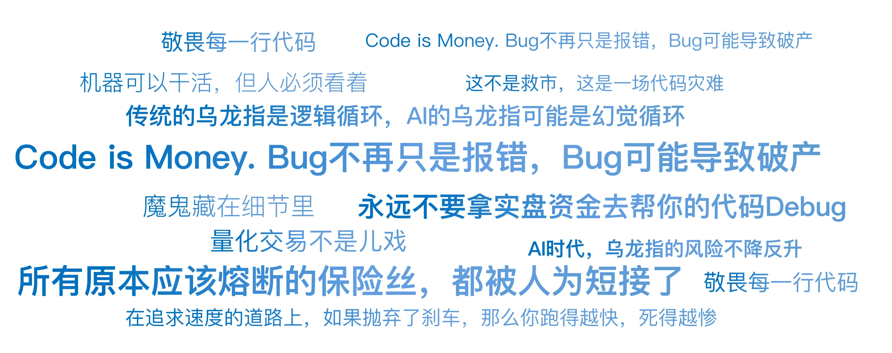

# 24｜程序员的手抖：光大乌龙指
你好，我是陈旸。

我们把时间拨回到2013年8月16日，星期五。那天上午，A股像往常一样昏昏欲睡，上证指数在2070点附近无力地波动。11点05分，诡异的事情发生了。毫无征兆地，中国石油、中国石化、工商银行、农业银行……这些平时一天波动不到1%的巨无霸，突然像被注入了兴奋剂一样，瞬间直线拉升。11点06分，几十只权重股集体涨停。

**上证指数在短短两分钟内，暴涨5.6%（超过100个点）。那一刻，全中国的股民都疯了。**

- 散户在喊：“国家队进场救市了！大牛市来了！”

- 分析师在找理由：“是不是出重磅利好了？降准了？印花税降了？”

- 期货交易员在疯狂平空单，多头在狂欢。


然而，在上海陆家嘴光大证券总部的策略投资部交易室里，没有狂欢，只有死一样的寂静。交易员们盯着屏幕，脸色惨白。他们看着自己编写的程序，像一头失控的怪兽，疯狂地向交易所发送着买入指令：“买入中石化！买入中石油！买入工行！再买！继续买！”他们想停下来，但找不到那个红色的停止按钮。

**短短几分钟，系统发出了234亿元的买单，实际成交72.7亿元。这不是救市，这是一场代码灾难。**

## **策略本无罪：ETF套利的原理**

要理解这个Bug，我们先得知道光大当时在做什么策略。他们做的是ETF申赎套利。这是一个非常经典、低风险的量化策略。

**逻辑如下：**

1. **ETF（交易型开放式指数基金）** 有两个价格：
   1. **二级市场价格**：你在股票软件上看到的实时价格。

   2. **IOPV（净值）**：ETF包含的一篮子股票的实时价值总和。
2. **套利机会**：当二级市场价格 \> IOPV 时（溢价），说明ETF贵了。

3. **操作步骤**：
   1. 买入一篮子股票（Buy Basket）。

   2. 用这些股票向基金公司申购ETF份额。

   3. 在二级市场卖出ETF份额。

   4. 赚取差价。

这本来是一个完美的闭环：风险低、拼速度、拼自动化。光大证券为此专门开发了一套名为MEP的策略交易系统。但是，魔鬼藏在细节里。

## **致命的Bug：死循环的逻辑陷阱**

根据证监会的事后调查报告，那个毁灭一切的Bug，藏在订单生成模块里。简单的说，光大的策略系统有一个功能：重下（Retry）。理解了这个逻辑，你就知道量化系统有多脆弱了。

**正常逻辑应该是：**

1. 计算出需要买入一篮子股票（比如总价1000万）。

2. 发送订单。

3. 检查订单状态：
   1. 如果全部成交=\> 进入下一步（申购ETF）。

   2. 如果部分成交 =\> 补单（只买没成交的部分）。

**光大的Bug逻辑：** 那天上午，系统在执行买入时，因为某些原因（可能是交易所回报延迟，或者某个股票停牌），导致有部分股票没有显示成交。这时候，程序员写的一个逻辑判断错误被触发了：系统错误地认为：“哎呀，这笔单子完全没成交啊！那我必须重新把整个篮子再买一遍！”

- 第一次重试：又发了1000万买单。

- 第二次重试：系统检测，好像还是没成交（其实是因为前一笔单子还在路上），再发1000万！

- 第三次重试……


这个检测-重发的间隔极短，且没有任何限制。于是，在那个致命的2秒钟内，计算机像发疯一样，生成了26082笔委托。这就像你在网上买火车票，点击支付没反应，于是你狂点鼠标100下。结果系统不是提示你请勿重复提交，而是真的从你的银行卡里扣了100次钱，给你买了100张票。

## **消失的保险丝：风控的全面缺位**

你会问：“难道光大证券没有风控吗？账户里没那么多钱，系统怎么能下单呢？”这就是光大乌龙指最令人震惊的地方：所有原本应该熔断的保险丝，都被人为短接了。

**1\. 资金前端控制缺失**

在大多数交易系统中，下单前必须检查：可用资金 \> 订单金额。如果不够，直接报错。但是，为了追求极速（高频交易），光大证券申请了交易所的交易单元直连模式。这种模式下，系统默认你是土豪，不再校验资金余额。光大当时账户里只有几个亿，但系统打出了234亿的单子。交易所照单全收。

**2\. 订单量限制缺失**

任何成熟的量化系统，都会有一个胖手指限制。比如：单笔订单不能超过100万，单日累计买入不能超过1亿。光大的系统里，这个参数是空的，或者被设置为无限大。

**3\. 缺乏Kill Switch（一键自杀开关）**

当交易员发现系统失控时，他们竟然找不到一个物理按钮来切断程序。最后是怎么停下来的？是拔网线？还是杀进程？在慌乱中，每一秒钟流出去的都是上亿的真金白银。这告诉我们一个血淋淋的道理： **在追求速度的道路上，如果抛弃了刹车，那么你跑得越快，死得越惨。**

## **从技术事故到法律灾难**

故事还没结束。如果只是亏了钱，那叫操作风险。但光大接下来的操作，把它变成了法律风险（内幕交易）。11点07分，系统终于停下来了。光大高层看着满手的股票（这72亿的股票是多出来的，如果不处理，收盘后要交割，光大就要破产），做出了一个决定：对冲。

当天下午开盘，光大证券在没有向公众披露这是乌龙指的情况下：

1. 在期货市场疯狂 **卖空** IF股指期货（总计43亿元）。

2. 在ETF市场卖出ETF。


他们试图把上午买错的货，通过做空期货对冲掉，减少损失。这在交易员眼里，是自救。但在监管和散户眼里，这是内幕交易。逻辑是这样的：你知道上午的暴涨是假的（是你自己搞出来的），你知道下午大概率会跌回来。但你没告诉大家，反而利用这个信息优势反手做空赚钱。

**结局：**

- 光大证券被没收违法所得，并处以5倍罚款，总计罚没 **5.2亿元**。

- 相关高管被终身市场禁入。


## **AI时代的新乌龙指**

你可能觉得，这是2013年的旧事了，现在的技术这么发达，不会发生这种事了吧？ **错。AI时代，乌龙指的风险不降反升。** 还记得之前讲过的AI Agent吗？

- 传统的乌龙指是逻辑循环。

- AI的乌龙指可能是幻觉循环。


**场景模拟**

你给Agent一个指令：“帮我把这只股票卖掉，如果要跌停了就赶紧跑。”

- **Agent的幻觉**：它看到盘口上有一笔大卖单（可能是冰山订单），它误判为主力出货，马上要跌停。

- **Agent的行动**：不计成本地市价抛售。

- **结果**：它的抛售把股价砸下去了。

- **Agent的反馈**：“看！股价真的跌了！我的判断是对的！必须卖得更快！”

- **死循环**：Agent自己吓自己，最后把股价砸到跌停。


这种自我实现的乌龙指，在AI自动交易中很难防范，因为它符合自己的闭环逻辑（虽然这个逻辑是错误的）。

## **如何给你的AI穿上防弹衣？**

作为《AI量化思维》的学员，当你开始用QMT或者Python写策略时，你必须把光大的教训刻在脑子里。 **不管你的策略多赚钱，请务必加上以下三行代码：**

**1\. 硬性资金限额**

不要相信交易所的校验，不要相信账户余额的返回值。在你的代码最外层，设置一个绝对阈值。

Python代码示例：

```plain
MAX_DAILY_BUY = 1000000  # 每天最多买100万
if current_buy_amount > MAX_DAILY_BUY:
    raise Exception("触发熔断：今日买入超限！")

```

**2\. 单笔订单限制**

防止你把价格填成了数量，或者小数点点错位。

Python代码示例：

```plain
MAX_ORDER_VALUE = 50000 # 单笔不能超过5万
if price * volume > MAX_ORDER_VALUE:
    print("警告：单笔订单过大，已拦截")
    return

```

**3\. 死循环熔断**

如果你在用while循环或者递归下单，必须加一个计数器。

以下是Python代码示例：

```plain
retry_count = 0
while not order_filled:
    retry_count += 1
    if retry_count > 5:
        print("错误：重试次数过多，停止下单！")
        break
    # ... 下单逻辑 ...

```

**4\. 物理开关**

如果你的程序是跑在云服务器上的。请确保你的手机里有一个脚本，能一键杀掉服务器上的所有Python进程。当看到账户异常时，不要去改代码，先按这个按钮。

## **AI量化策略建议**

光大乌龙指教会了我们什么？

**1\. 敬畏每一行代码**

量化交易不是儿戏。你写下的每一行代码，连接的都是你的银行卡。Code is Money. Bug不再只是报错，Bug可能导致破产。

**2\. 模拟盘不等于实盘**

很多策略在模拟盘跑得很溜，一上实盘就出事。因为模拟盘通常没有拥堵、延迟、部分成交这些突发情况。 **永远不要拿实盘资金去帮你的代码Debug。**

**3\. 无论何时，保留人类的监控**

这就是为什么我在上一讲强调半人马。哪怕是全自动策略，也要设置心跳报警。如果程序在1分钟内交易了超过10次，必须发短信轰炸你的手机。机器可以干活，但人必须看着。

## 本讲金句弹幕



## **课后思考题**

打开你的量化策略代码（如果你有的话），或者设想一下你未来的代码。

**找茬游戏：**

请找出至少三个可能导致无限循环下单的逻辑漏洞。

比如：

- 如果交易所接口卡死了，一直不返回成交回报，你的程序会怎么做？是傻傻地等待？还是认为没成交而继续下单？

- 如果你的策略逻辑是跌破10元就买，现在的价格是9.99元，你的程序会不会每一秒钟都发一笔买单？


## **下节预告**

光大乌龙指是操作风险的极致。而下一讲，我们要讲的是市场微观结构引发的崩盘。当全市场的机器都在同一时间决定卖出时，会发生什么？流动性会瞬间蒸发，买盘会凭空消失。这就是闪崩（Flash Crash）。