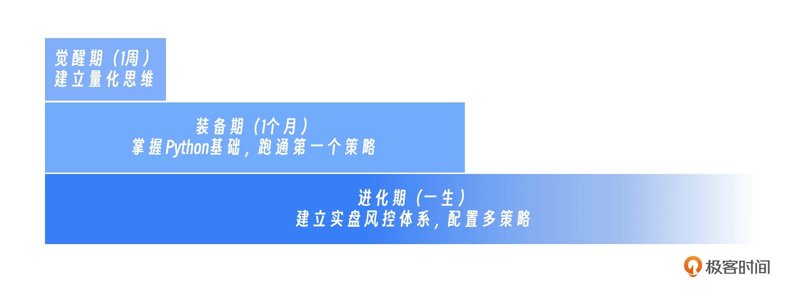
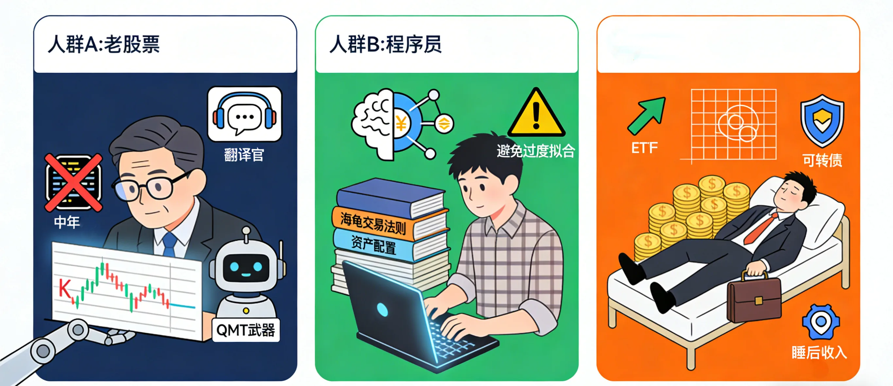
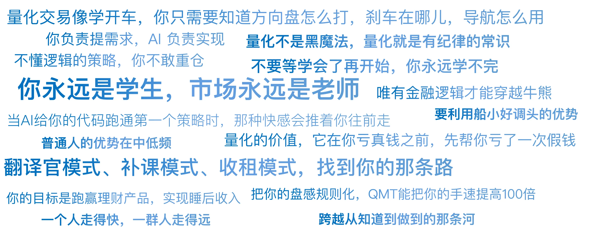

# 29｜AI量化进阶路径：不需成为数学家，也能构建赚钱机器
你好，我是陈旸。

很多人迟迟不敢开始量化，是因为把量化想象成了发射火箭。他们觉得必须先学完Python，再看完《计量经济学》，最后还得买一台GPU电脑。结果书还没翻到第十页，就放弃了。其实，量化交易更像是学开车。你不需要知道发动机的气缸是怎么运作的（那是造车工程师的事），你只需要知道方向盘怎么打，刹车在哪，以及导航（AI）怎么用。

对于普通人，最高效的进阶路径，遵循最小可行性产品（MVP）原则，分为三个阶段： **觉醒（思维）=> 装备（工具）=\> 进化（实战）。**

## **第一阶段：觉醒期——从猜到算**

**目标**：不写一行代码，先建立量化思维。

**耗时**：1周。

在这个阶段，你还是在用通达信、同花顺这些传统软件。但你的看法要变。

**1\. 学会因子化你的直觉**

以前你买股票：我觉得这个公司不错，最近新闻都在报。现在你要问自己：不错是指什么？是ROE高？还是增长率高？最近是指几天？都在报是指热度排名前几？

- **任务**：拿出一张纸，把你过去赚过钱的几次交易，试着拆解成“如果……那么……”的规则。比如，如果（股价站上20日均线）且（换手率放大一倍），那么（买入）。

这样，你就把直觉变成了策略原型。

**2\. 利用现成的量化工具**

很多软件自带了简单的回测功能（比如同花顺的i问财，或者果仁网）。

- **任务**：去搜一下“近三年ROE大于15%且市盈率小于20的股票”。

看看如果只买这些股票，过去三年能不能跑赢大盘？这一步是为了让你亲眼看到数据的力量，建立信心。

**3\. 把AI当成私人投顾**

开始高频使用DeepSeek（或Qwen/Kimi）。遇到任何新闻，不要自己瞎想。

- **任务**：把新闻扔给AI，问它：“从历史数据看，这类新闻通常会对哪个板块产生正向影响？持续时间大概多久？”虽然它不能直接给你代码，但它能帮你梳理逻辑。

**阶段总结：** 这一阶段的核心是祛魅。你会发现，量化不是黑魔法，量化就是有纪律的常识。

## **第二阶段：装备期——AI辅助的半自动开发**

**目标**：掌握Python基础，跑通第一个策略。

**耗时**：1个月。

这是大多数人被劝退的阶段——卡在了代码上。但你是AI时代的幸运儿。

**请记住：你不需要自己写Python，你只需要掌握AI编程，或者说让AI帮你解释Python代码逻辑。**

**1\. 环境搭建：QMT与MiniQMT**

为什么我一直推荐QMT？因为它是目前国内最适合散户的、 **免费的**、 **实盘级** 量化终端。它集成了行情、交易、回测，而且支持Python。

- **任务**：找券商开通QMT权限（门槛通常是几十万资金，有的甚至更低）。安装好软件。

**2\. AI编程流**

不需要从手写代码开始，直接打开Cursor或者Trae等AI编程工具。

- **Prompt（提示词）**：“请帮我写一个在miniQMT中运行的双均线策略。

逻辑是：当5日均线上穿20日均线时，全仓买入；下穿时，清仓卖出。”

AI会给你一段完美的代码。你的任务是看懂注释。知道哪里是改参数的（比如把5改成10），哪里是下单的。这就够了。

**3\. 回测你的直觉**

还记得第一阶段你在纸上写的那个策略原型吗？现在，让AI把它变成代码，在QMT里跑一下回测。结果可能是残酷的：你以为必赚的策略，回测出来可能是亏的。这就是量化的价值——它在你亏真钱之前，先帮你亏了一次假钱。

阶段总结：这一阶段的核心是借力。你不是程序员，你是产品经理，AI是你的程序员。你负责提需求，它负责实现。

## **第三阶段：进化期——实盘与系统的构建**

**目标**：建立实盘风控体系，配置多策略。

**耗时**：一辈子（无限游戏）。

回测赚钱了，不代表实盘能赚钱（记得之前讲过的过拟合吗？）。这一步要极其小心。

**1\. 模拟盘验证（Paper Trading）**

在QMT里，把你的策略挂在模拟交易上。观察至少一个月。看看有没有信号闪烁（盘中买了，收盘信号没了）、看看滑点大不大、看看遇到停牌或者除权除息时，程序会不会报错崩盘。这是实战前的最后一次演习。

**2\. 最小资金实盘**

拿出一手茅台的钱（或者更少），开启实盘。这个时候，你的心态会发生剧变。你会盯着屏幕，害怕程序出错。

- **任务**：建立监控面板。让程序每天收盘后发个微信给你：“今日盈亏XX，持仓XX，运行正常。”

**3\. 构建策略足球队**

不要只跑一个策略。

- **前锋**：动量策略（进攻，收益高，波动大）。

- **中场**：网格策略（控球，震荡市赚钱）。

- **后卫**：债券/红利低波策略（防守，吃利息）。

- **守门员**：风控脚本（一键清仓）。

当你的账户里同时跑着这三个相关性很低的策略时，你会发现，你的资金曲线变得平滑了。

这就是机构赚钱的秘密——资产配置。

## **对号入座：三类人群的专属路径**

你是谁？决定了你的路怎么走。

**人群A：老股民 / 主观交易者**

- **优势**：懂市场，有盘感，知道什么指标有效。

- **劣势**：怕代码，逻辑容易主观随意。

- **进阶策略**： **翻译官模式**。

不要试图去学复杂的深度学习。你的核心任务是把你的盘感规则化。比如你擅长打板，你就去研究如何用量化筛选集合竞价异常的股票。 **QMT是你的超级武器库，它能把你的手速提高100倍。**

**人群B：程序员 / 理工男**

- **优势**：代码能力强，逻辑严密。

- **劣势**：不懂金融，容易陷入技术痴迷，喜欢过度拟合。

- **进阶策略**： **补课模式**。

请放下手中的机器学习，去读几本经典的金融书（如《海龟交易法则》、《积极型资产配置》《缠中说禅》）。多研究因子背后的经济学逻辑，少研究参数优化。

**记住：数据挖掘挖不出因果关系，只能挖出相关性。唯有金融逻辑才能穿越牛熊。**

**人群C：上班族 / 没时间的普通人**

- **优势**：有稳定现金流（工资），心态相对从容。

- **劣势**：没时间盯盘，不能做高频。

- **进阶策略**： **收租模式**。

放弃短线，放弃打板。专注于 **中低频策略**：

- **ETF动量轮动**（一周调仓一次）。

- **网格交易**（全自动，不需要盯盘）。

- **可转债双低策略**（安全性高）。

你的目标是跑赢理财产品，实现年化10%-15%的睡后收入。

## **避坑指南：新手最容易犯的三个错**

在带过无数学生后，我总结了三个必死陷阱，请务必绕开：

**1\. 迷信黑盒策略**

有人卖给你一个策略，说：“这代码你别管，反正回测年化100%。” **千万别买。** 不懂逻辑的策略，你不敢重仓；不敢重仓，就赚不到钱。而且一旦失效（肯定会失效），你会死得不明不白。

**AI量化的原则：白盒。代码可以是AI写的，但逻辑必须是你懂的。**

**2\. 一上来就想做高频**

“老师，我想做毫秒级的T+0。”请放弃。那是机构的战场，那是光缆和FPGA芯片的战争。普通人的优势在中低频。机构资金大，掉头难；你资金小，跑得快。利用这个船小好调头的优势。

**3\. 忽视交易成本**

回测时不扣手续费，实盘时发现全是给券商打工。特别是网格交易，如果你的佣金是万分之三，甚至千分之一，那你基本是在给券商送钱。

**任务**：在做量化前，先去和券商谈佣金，争取更低的交易佣金。

## **AI量化策略建议**

这不仅是一张地图，更是一张船票。

**1\. 种一棵树最好的时间是十年前，其次是现在**

不要等学会了再开始。你永远学不完。 **在战争中学习战争。** 今天就去下载QMT，今天就去问DeepSeek第一个代码问题。当你跑通第一个Hello World策略时，那种快感会推着你往前走。

**2\. 保持空杯心态**

量化是一个交叉学科。你需要懂一点数学，一点编程，一点金融，一点心理学。保持好奇心，在这个领域，你永远是学生，市场永远是老师。

**3\. 寻找圈子**

这条路是孤独的。你的家人可能不懂你在干什么，你的朋友可能还在听消息炒股。找到一群志同道合的半人马。互相分享实战心法，互相分享因子，互相做心理按摩。 **一个人走得快，一群人走得远。**

## 本讲金句弹幕

## **课后思考题**

请根据你自己的情况（老股民/程序员/上班族），为自己制定一个3个月启动计划。

- 第一个月：我要搞定什么工具？（QMT？Python环境？）

- 第二个月：我要复现哪个经典策略？（双均线？网格？海龟？）

- 第三个月：我要投入多少实盘资金进行测试？（1万？5万？）

把它写下来，贴在你的电脑屏幕旁。这就是你的作战地图。

## **下节预告**

讲完了路径，我们的思维课就接近尾声了。但在结束之前，我要给你最后一份礼物。那就是行动的号角。我知道，哪怕听完了这么多道理，很多人还是会停留在知道的层面，而不敢迈出做到的那一步。