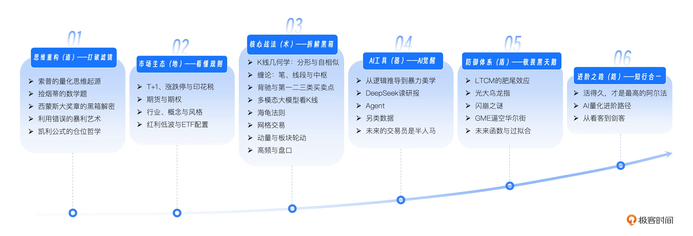
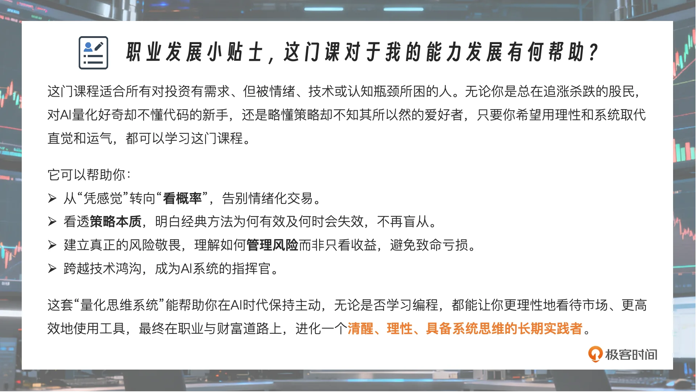
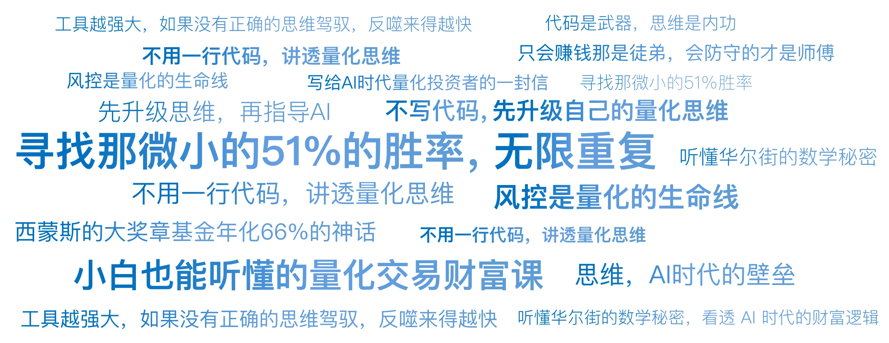

# 开篇词｜为什么你需要先升级思维，再指导AI？
你好，我是陈旸，一个能够帮助你打通“AI+金融”最后一公里的人。欢迎来到《人人都用得上的AI量化思维课》。

如果你是极客时间的忠实用户，那么你可能听说过我的名字，我在极客时间上出了 [《数据分析实战 45 讲》](https://time.geekbang.org/column/intro/100021701?utm_campaign=geektime_search&utm_content=geektime_search&utm_medium=geektime_search&utm_source=geektime_search&utm_term=geektime_search&tab=catalog) [《SQL 必知必会》](https://time.geekbang.org/column/intro/100029501) 两门课程，阅读量超过了30 万，前段时间还出了 [《AI量化交易训练营》](https://u.geekbang.org/subject/22?utm_source=time_web&utm_medium=menu&utm_term=timewebmenu_h5)，感谢一直支持我的朋友们。这些年，我一直致力于将机器学习、大模型以及AI Agent技术应用于金融行业，尤其是投资策略的构建，用技术打破金融的壁垒。

在不断探索的过程中，我发现大家面对这个新时代普遍感到迷茫。此时此刻，很多人都站在一个巨大的分岔路口 。

**左边，是传统的交易世界：** 看K线、听消息、凭直觉，甚至迷信所谓的庄家。你可能已经在这个世界里摸爬滚打多年，有过赚得盆满钵满的高光时刻，但更多的时候，是面对账户回撤时的焦虑、懊悔，以及深夜里的那句反问：“为什么这次我的感觉又不准了？”。

**右边，是呼啸而来的AI与量化交易：** 幻方、DeepSeek、高频交易、自动化策略。你听过西蒙斯的大奖章基金年化66%的神话，你也看到身边的朋友开始谈论Python和QMT。你隐约觉得，这可能是通往财富自由的下一张船票。

但是，当你试图跨入右边的世界时，却发现了一堵厚厚的墙：

- 满屏的数学公式让你头晕眼花；

- 复杂的代码逻辑让你望而却步；

- 甚至当你拿到了现成的代码，跑出来的回测曲线很漂亮，一上实盘却亏得一塌糊涂。

你可能会困惑：“难道不懂编程，就注定被这个时代抛弃？”。

绝不是。

如果你问我，在AI时代，交易最核心的竞争力是什么？我会告诉你：首先要有量化思维的能力，剩余的交给AI。这正是我开设这门《人人都用得上的AI量化思维课》的初衷。

这门课程每一讲都会从一个传奇人物或著名事件切入，引出量化原理，最后落脚到AI时代的新变化。我们在进入代码实战前，需要理解代码背后的逻辑。 让你能够丝滑地入门量化交易，全面提升认知 。

除了这门思维课，我还有一门《AI量化交易训练营》，教大家用QMT写代码、做实盘。相比之下，这门课是你的内功心法。代码是武器，思维是内功。AI工具确实很强大，但是如果没有系统性的AI量化交易思维，我们将很难驾驭AI，甚至反噬得更快 。

## **在量化交易中，你将看到精彩的人性**

很多人对量化有误解，以为它是冷冰冰的机器。其实，量化历史是一部充满血肉、欲望与智慧的史诗。在接下来的课程中，我会带你穿越时空，去见证那些改变了金融游戏规则的关键时刻，但这不仅仅是为了听故事，更是为了让你在历史的镜像中，找到那个最像你的交易灵魂：

- **我们会回到上世纪60年代的拉斯维加斯，** 看数学教授爱德华·索普是如何单枪匹马羞辱了赌场经理。他究竟发现了什么漏洞，能让十赌九输的铁律失效？这不仅是算牌的故事，更是概率思维觉醒的第一声枪响。

- **我们会重温巴菲特与格雷厄姆的经典案例。** 大家都在学他们的价值投资艺术，但如果我告诉你，所谓的股神直觉其实可以被拆解为一套严密的数学公式，你觉得它会是什么？我们将揭开那层面纱，看看基本面背后的量化逻辑。

- **我们会复盘1998年LTCM的崩塌。** 一群诺贝尔奖得主，拥有当时地球上最顶尖的大脑，却在短短几个月内输掉了40亿美元。是什么样的黑天鹅击穿了天才的防线？ 这将是你风险意识最深刻的一课。

- **我们还会重构神秘的缠论。** 抛开那些晦涩难懂的玄学词汇，我们将用分形几何与递归算法的现代视角，去重新审视中枢与背驰。看看这套经典的东方战法，在AI的显微镜下，会呈现出怎样惊人的数学结构？

为什么要带你看这些呢？

因为通往财富自由的路不止一条。索普走的是概率，巴菲特走的是价值，西蒙斯走的是数据。你需要系统性地了解它们，不是为了模仿谁，而是为了 **根据你自己的性格、资金体量和风险偏好，打造那把对你来说最趁手的武器。**

但有时，光有武器还不够。市场就像变幻莫测的天气，时而晴空万里（牛市），时而狂风骤雨（熊市）。你还需要AI的加持——它就是数据气象雷达和自动驾驶仪，助你在复杂的路况中通关。

## 这门课是如何设计的？

为了让你从一名感性的交易者，进化为一名手握AI利器、有量化思维的实战派，我将课程设计为六个层层递进的模块：

**第一章：起源（道）——打破滤镜**

首先，我们要祛魅。从赌场到华尔街，我们不谈虚的，先搞懂概率、赔率与凯利公式。这是所有交易策略的底层地基，这一章会彻底重塑你的金钱观。

**第二章：战场（地）——看懂规则**

很多人亏钱不是因为策略不好，而是不懂规则。A股独特的T+1、涨跌停板、印花税，以及期货期权的杠杆属性，这些都是我们必须戴着跳舞的镣铐。先懂游戏规则，再谈如何赢钱。

**第三章：策略（术）——拆解黑箱**

这是大家最关心的武器库。别被专业名词吓跑，我会用通俗的语言拆解海龟策略、网格交易、动量轮动等经典战法。你会看到，这些策略是如何在实战中捕捉利润的，以及它们各自适合什么样的“天气”。

**第四章：工具（器）——AI觉醒**

这是最前沿的加速器。当DeepSeek读懂了研报，当AI Agent像员工一样24小时自主工作，甚至利用卫星图像挖掘K线图中看不见的金矿时，我们该如何驾驭？我们将探讨半人马交易模式，让你从操盘手进化为AI系统的指挥官。

**第五章：风控（盾）——建立敬畏**

只会赚钱那是徒弟，会防守的才是师傅。我们将剖析历史上的著名惨案：光大乌龙指、美股闪崩、散户逼空华尔街。这些血淋淋的案例会告诉你，为什么风控是量化的生命线，以及如何给你的AI装上刹车。

**第六章：行动（路）——知行合一**

最后，我们将从故事回到现实。投资不是一场你死我活的赌博，而是一场活得久才是赢的无限游戏。无论你是上班族还是程序员，我们都需要规划一条切实可行的进阶路径，带你走进量化实盘。

## **为什么要现在学这门课？**

比尔·盖茨曾说：“人们总是高估未来两年的变化，而低估未来十年的变革。”

金融市场的AI化，不是未来时，而是进行时。 现在的市场，你的对手盘已经不再是隔壁的老王，而是不知疲倦的算法、是毫秒级的高频机器、是通读了全网数据的AI大模型。 **如果你还停留在凭感觉的冷兵器时代，这场战争还没开始，你就已经输了。**

但这并不意味着普通人没有机会。相反，AI工具的出现，拉平了技术鸿沟。 以前，你要懂C++、懂高数才能做量化；现在，只要你有清晰的量化思维，你可以让Cursor、Trae这些AI工具帮你写代码，让DeepSeek帮你读研报。

思维，成了AI时代的壁垒。这门课，就是为了帮你构建这道壁垒。

## **给自己一个觉醒的机会**

不管你是正在亏损中挣扎的股民，还是对AI充满好奇的技术控，或者是想通过量化管理财富的理财者，这门课都将是你最好的投资。我希望，听完课程之后，当你再次打开行情软件时：

- 你看到的不再是红绿跳动的数字，而是背后博弈的概率分布。

- 你不再因为一次涨跌而心跳加速，因为你知道那是随机漫步的噪音。

- 你不再盲目寻找必胜的圣杯，而是开始构建属于自己的正期望值系统。

从今天起，让我们告别赌徒式的狂欢，开启理性投资者的修行。我是陈旸，让我们开始这一场关于AI与财富的旅程吧。

