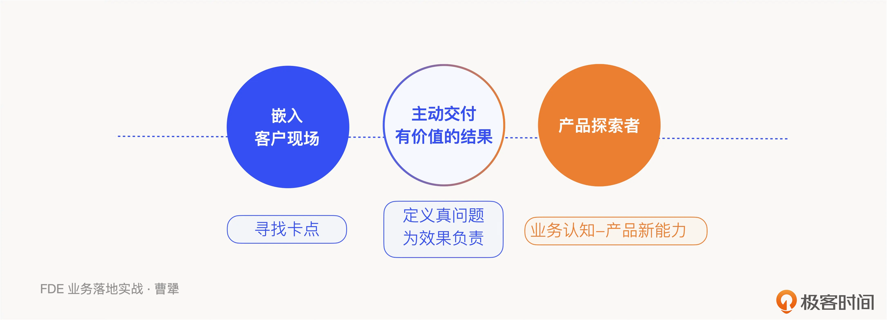
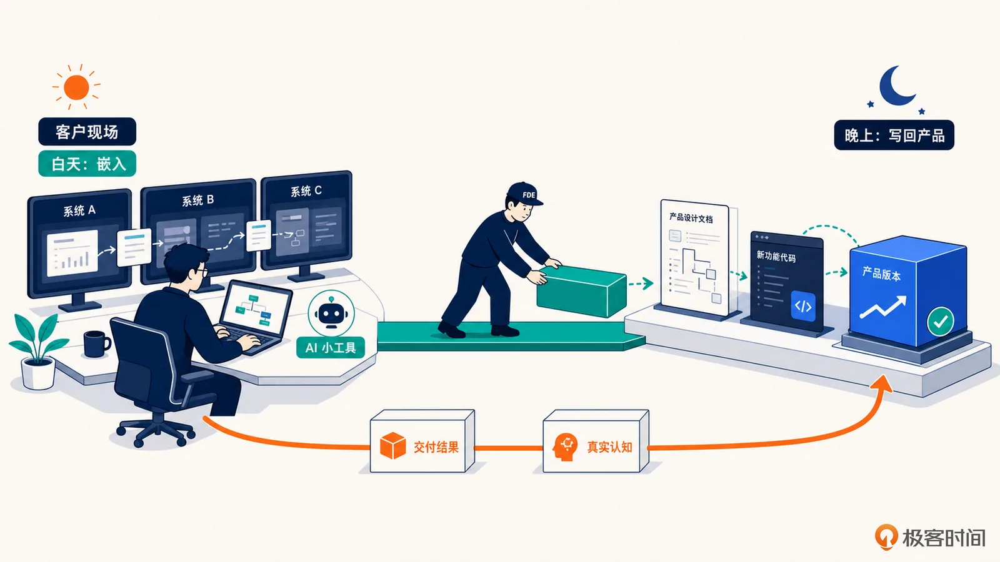
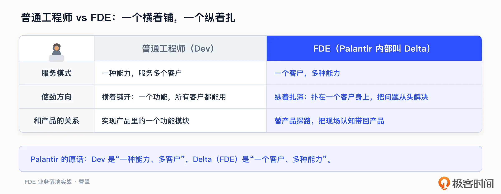
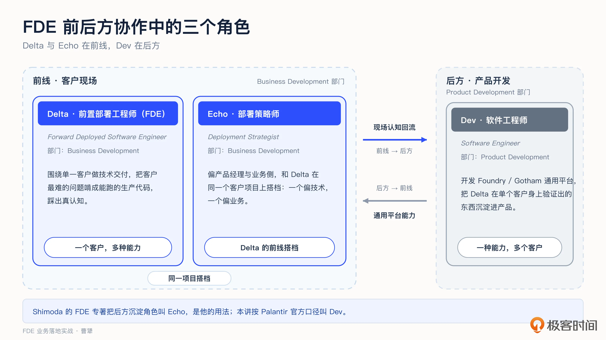
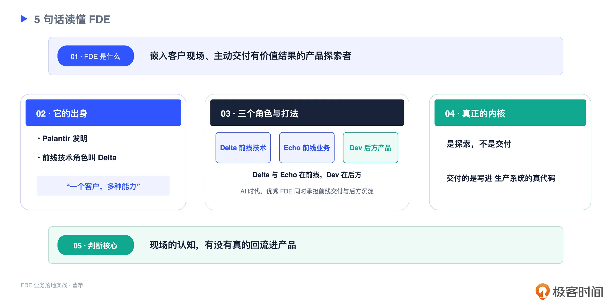

# 01 | 什么是 FDE：一个嵌入客户现场的“产品探索者”
你好，我是曹犟。

开篇词里，我曾说 FDE 是 AI 时代最值钱的工程师之一。但值钱归值钱，FDE 到底是个什么角色？和我们平时熟悉的那种“写代码的工程师”，又到底有什么区别？在这一讲中，我们就把这个最基础、也最容易被误解的问题，讨论清楚。

我想先提醒一下，很多人一听 FDE，第一反应是：这不就是驻场开发、外包换了个英文名吗？这个质疑很普遍，也不是完全没道理。但它到底站不站得住脚，我们放到下一讲专门讨论。今天这一讲，我想先从正面把 FDE 到底是什么，说清楚。

## 先给一个定义

这里我给出 FDE 的一个定义，你先记住这个定义，我们后面再慢慢拆解。

**所谓 FDE，其实就是一个嵌入客户现场、主动交付有价值结果的产品探索者。**

这句话里有三个关键词，值得我们一个个讨论。

第一个词，是“ **嵌入客户现场**”。FDE 不是坐在公司总部等着需求文档，而是真的把自己放进客户的办公室、放进客户的业务里。他要看客户每天怎么干活，要找到客户嘴上没说、但真正卡住他们的东西。在这一点上，FDE 和传统的驻场有点像，但背后远不止于此。

第二个词，是“ **主动交付有价值的结果**”。这里有两个关键，一个是“主动”，一个是“结果”。说“主动”，是因为 FDE 会自己去定义客户真正的问题是什么、值不值得做，而不是被动地等客户把需求提过来、照搬着解决。说“结果”，是因为 FDE 最后要对客户业务上一个能衡量的改善负责，光交付一堆工时和代码，是不算数的。这一点和很多传统的外包项目是有本质区别的。

第三个词，也是最重要的一个，是“ **产品探索者**”。这是 FDE 区别于其他所有角色的内核。FDE 到客户现场，表面上是在解决这一个客户的问题，但本质上，他是在替产品探路：这一个客户踩过的坑，从客户身上得到的业务认知，最后要变成产品里的新能力。关于这一点，我后面会专门展开。

你可能觉得这个定义还是有点抽象。我想这样描述一下，FDE 真实的一周大概是什么样子。

周一，他带着电脑到了客户的办公室，不是跟客户开个会就走，而是找个工位坐下来，一坐就是一周。他会跟着客户的业务人员，看他们具体怎么处理一单生意，怎么在好几个系统之间来回搬运数据，在流程的哪一步抱怨得最多。白天他在客户现场摸情况、跟人聊天、用 AI 写小工具解决具体问题；到了晚上，他则要把白天摸索到的东西，落到产品设计文档，甚至直接变成产品里新版本的代码。一个客户跑完，他手里多出来的，不仅是这一个客户的交付结果，还有一批带回给产品的真实认知。这，就是 FDE 在日常工作中“嵌入”和“探索”的真实样子。

## 这个角色，是 Palantir 发明的

要真正理解 FDE，我们可以先回到它出生的地方，一家叫 Palantir 的公司。

你可能听过这家公司，但是具体不太熟悉。所以我先简单介绍一下，Palantir 成立于 2003 年，几位创始人里有后来被称作“硅谷投资教父”的 Peter Thiel，有现在的 CEO Alex Karp，还有我们下面马上要提到的 Stephen Cohen。Palantir 最早是给美国的情报和政府部门做数据分析的，核心是做反恐、追踪这类又敏感又困难的工作，早期还拿过 CIA 旗下投资机构的钱。后来它把这套服务情报机构形成的能力带进了企业市场，构建了两条主要的产品线：面向政府的 Gotham，和面向企业的 Foundry。

到今天，Palantir 已经是一家很受资本市场关注的上市公司，国内现在讨论得非常热烈的本体论，也是由它总结和提出的。而它留给整个行业最重要的东西，可能不是某一个产品，而是我们这门课的主角，FDE 以及围绕 FDE 这套打法。

FDE 具体是怎么一步步成型的呢？这需要归功于前面提到的那位联合创始人 Stephen Cohen。早年他经常带着 Palantir 早期的产品去见客户，效果并不好，客户觉得这东西太重、太难用、太粗糙，根本落不了地。如果是一般的公司，可能就回去接着改产品、改文档了。但 Palantir 做了一件当时看起来很“不划算”的事：直接派自己的工程师，坐到客户的现场去，一边帮客户把最难的问题解决掉，一边就地打磨自己的产品。

这批被派到客户现场的工程师，就是最早的一批 FDE。在 Palantir 内部，这个角色有个专门的名字，叫 Delta。这个名字的由来也挺有意思，Palantir 早期团队有个习惯，喜欢用北约字母表来给角色起代号，字母表里 D 对应的就是 Delta，这个叫法就这么传下来了。

Palantir 官方用一组对照，把 Delta 和后方的软件工程师 Dev 的区别讲得很清楚。Dev 的模式是“一种能力，服务多个客户”，比如我写好一个功能，所有客户都能用。而 Delta，也就是 FDE，是反过来的：“一个客户，多种能力”，就是我扑在这一个客户身上，把他的问题从头到尾解决掉，需要什么能力就上什么能力。从这一点可以看出，生成式模型的出现，让各种能力的门槛大幅度降低，其实是让 FDE 这个岗位的入门难度大幅度降低的。这可能也是 FDE 这几年突然火起来的原因之一，具体 FDE 和 AI 时代的关系，我在第三讲会展开。

下面我用一张图来展示 FDE 和普通开发工程师的区别：

说到底，FDE 其实是要填平一道很深的鸿沟。沟的一边，是产品团队做出来的通用平台，它抽象、干净、讲究可复用；另一边，则是客户那套乱糟糟的具体现实，这里有历史包袱、有奇怪的流程、有谁也说不清的潜规则。鸿沟的两边，天生就是对不上的。而 FDE 要干的，就是站在这道沟中间，当一个翻译者：把客户的混乱，翻译成产品里面对应的需求；再把产品的能力，翻译成客户能感受得到的业务结果。一个是横着铺开，一个是纵着扎深，而这个“一个客户、多种能力”，就是 FDE 这个职业最原始、也最本质的样子。

我再举个小例子，你就明白这道沟有多具体也有多复杂。我们的产品里可能有个字段，干干净净就叫“客户”。可到了真实的企业里，“客户”这个词往往能分裂成好几层：有使用产品的自然人用户，有直接买单的直客，有中间的经销商，还有集团内部走账的关联方，每一个概念的口径、流程、权限都不一样。通用产品对不上这套现实，而 FDE 要做的，就是在中间把它一层层翻译清楚、对齐上去。

## 前线的 Delta，后方的 Dev

光有一个扎进现场的 Delta，其实还不够。

因为如果只是 Delta 在客户那儿解决问题，这些成果和认知就烂在这个客户那儿了，那 Palantir 和一家普通的外包公司也就没什么区别了。所以在 Delta 于前线打仗的同时，后方还得有一个角色，负责把 Delta 在单个客户身上验证出来的东西，收上来、沉淀进产品，变成所有客户都通用的能力。这个后方角色，就是上一节说的 Dev，在 Palantir 内部属于产品开发（Product Development，PD）团队。

这里顺便把和这段讨论有关的三个角色说清楚。Delta 是前置部署软件工程师，也就是我们这门课所说的 FDE，在前线偏技术；Echo 是部署策略师（Deployment Strategist），同样属于客户项目的前线团队，偏业务和产品，和 Delta 在同一个项目上搭档，两者的界线在实际工作中经常是模糊的；Dev 是后方的软件工程师，负责开发 Foundry、Gotham 这样的通用平台。

Delta 这个代号来自 Palantir 早期用北约字母表给团队命名的习惯，Echo 则是字母 E 在这套字母表中的读法。要留意的是，Sho Shimoda 那本专门写 FDE 的书里，也用了 Echo 这个词，却用它指负责沉淀产品的后方角色。这是他自己的用法，不是 Palantir 的定义。下面讨论前线技术交付与后方产品沉淀时，我们按照 Palantir 的口径，分别称为 Delta 和 Dev。

Shimoda 的书里有一句话，把前线和后方的分工说得特别到位：Delta 写的，是在一个客户面前跑的代码；Echo 写的，是在所有客户面前跑的代码。他说的 Echo，指的是他所定义的后方沉淀角色。按照 Palantir 的口径，这个角色应该叫 Dev。

就前线交付与后方沉淀这条链路来说，一个在前线，一个在后方，紧密协作，这套模式才能转得起来。而这两个角色之间的那个边界，就好像一栋楼里的承重墙，是整套 FDE 模式里最不能出问题的地方。

这堵墙要是塌了，会怎么样？无非两种塌法。一种，是 Dev 坍塌进了 Delta：后方不再沉淀产品，全跑去帮前线救火，那整家公司就退回到了外包模式。另一种，是 Delta 被 Dev 绑住手脚：前线明明看到了客户的真问题，却因为产品排期、因为“这个不够通用”，迟迟落不了地，那在现场辛辛苦苦得来的认知，就白白烂在那儿了。所以把这条边界叫作承重墙，一点都不夸张。

我为什么要专门讲 Delta 和 Dev 这一对？因为它点出了 FDE 真正的核心价值所在：重点不是 Delta 在前线交付了多少，而是这些交付，有没有通过 Dev，真的回流进产品。一个团队如果只有 Delta 没有 Dev，或者 Delta 干得再好，东西却传不回产品里，那它做的就还不是真正的 FDE。这条线是判断真假 FDE 的关键，下一讲我们会拿它当标准，反复用。

下图展示了 Palantir 中与这条前后方链路有关的三个角色：

也正因为后方沉淀这么关键，有位同行有一个判断，我挺认同。他说，干 FDE，第一个该招的其实不是工程师，真正稀缺的，是能钻进业务的 Echo。这里的 Echo 沿用的是 Shimoda 的叫法，指后方沉淀角色。也就是说，光会写代码的人从来不缺，缺的是那种既钻得进业务、又能判断出“这一个客户身上到底什么东西值得被沉淀进产品”的人。而正是这样的人，才让认知真正回流得起来。

讲了这么多概念，我给你讲一个真实的例子，可能能更好地体会 Delta 和 Dev 是怎么配合的。Palantir 从 2015 年起，往飞机制造商空客的工厂里派了 FDE，长期驻场。这些 Delta 一开始做的，是很具体的工作：把空客散在好几个系统里的数据整合起来，做成一个统一的界面，帮工厂做规划、排故障。他们一个一个地啃，慢慢啃出了二十多个问题。而真正厉害的是后半段：Palantir 把在空客这一个客户身上打磨出来的东西，沉淀成了一个叫 Skywise 的平台，反过来又卖给了整个航空业。

你看，这就是一条完整的链路：Delta 在单个客户身上探索，Dev 把它变成所有客户都能用的产品。

讲到这里，有一个容易混淆的点需要说清楚：那后方的 Dev 到底算不算 FDE？我的看法是，FDE 这个词其实有两层意思。作为一个工程岗位，它说的是站在前线、嵌入客户现场的 Delta，这是 FDE 最本来的意思，也是我们这节课开头的定义。而作为一套打法，它说的是前线 Delta 加后方 Dev 这一整套协作流程。Dev 不驻场，而是在后方构建所有客户可用的产品，严格讲不是狭义的 FDE，而是偏平台型的角色。这个角色，在很多公司里其实就是产品团队，或者叫平台工程团队。但这里有个 AI 时代不得不提的新变化。

放在过去，Dev 的工作得靠后方一整支产品团队来接；但今天，AI 把做产品的门槛压得很低，很多原来必须由后方产品团队完成的工作，比如把现场认知沉淀成通用能力，甚至直接动手修改产品代码，前线的 Delta 自己就能顺手做了。

所以这门课有一个明确的立场：后方沉淀这部分工作，也是一个优秀 FDE 的分内事。一个优秀的 FDE，不只是在前线把这一单交付漂亮，还会亲手把现场的认知沉淀回产品的下一版。说到底，AI 时代最稀缺的那种 FDE，是一个人就能把 Delta 和 Dev 这两头都担起来的人。

## 关键词是“探索”，不是“交付”

讲到这儿，我想回到定义里那个最重要的词：产品探索者。

“探索者”和“交付者”是有本质区别的。交付者的任务，是把一个已经定义好的东西，正确地做出来、装上去。而探索者的任务，则是在一个还没有标准答案的地方，找出到底该做什么、做出来的东西该长什么样。

这个区别，落到岗位上就是：有的角色是在一个已经定死的产品边界里，把活干漂亮；而 FDE 往往在产品这块能力还不存在时就进场，先搞清楚客户到底要什么、这东西该长什么样，再把产品里没有的那一部分亲手做出来。一个在已知的框里落地，一个在未知里开路。至于 FDE 和实施、咨询、售前的具体区别在哪儿，下一讲会展开讨论。

还有一个容易被忽略但很关键的点：FDE 是真的要写生产代码的。他不是做几张 PPT、搭个一次性的 demo 就交差，而是要把能力真正做进客户的生产系统里，让它稳定地跑起来、扛得住真实的业务。说到底，探索的结果，必须是一个能真正落地、能用起来的东西。

前 OpenAI 的 Bob McGrew 有一句话，特别精准。他说，FDE 的策略，就是“把那些不可规模化的事，规模化地做”。这句话其实脱胎于硅谷那句更有名的话，Paul Graham 所说的，创始人要在创业初期“做那些不可规模化的事”。McGrew 把它用在了 FDE 的语境，其实非常恰当。你看，一个一个地扎进客户现场，这件事本身是极不可规模化的，甚至有点笨。但正因为每一次扎进去，都在给产品带回真实的认知，这份笨功夫最后就沉淀成了可以规模化的产品能力。这就是 FDE 作为“探索者”最核心的价值。

也正因为要做“探索”，FDE 岗位对人的要求并不低。他不能只是个传声筒，把客户的话记下来，转给后方就完了。你必须要有足够的技术深度，能在客户现场做出判断，甚至亲手把问题解决掉。如果你没有这个技术深度，你就探索不到真正有价值的东西。

这里顺带埋个伏笔。今天 AI 让“到现场飞快做一套定制”变得太容易，于是“我这算不算 FDE”成了一个真问题。答案还是那条线：探索，而不只是交付。这条线具体怎么分，下一讲我会专门立起来讲。

举一个我自己正在做的例子。我带的那个三人小团队 Omni-Growth，做 AI 营销产品，走的就是 FDE 这套路子。我们不是接了单、去客户那儿把东西交付完就撤；而是整周泡在客户现场，看他们的广告到底怎么投、怎么优化、流程卡在哪儿，再把这些真实的认知，一点点变成我们产品里的新功能。而且这个循环还不止一来一回：新版本打磨出来之后，我们会再回到客户现场，坐在旁边，看客户到底用不用得起来。到这一步，这一轮探索才算真正走完。对我们来说，每接一个客户，都是产品的一次探索，都让产品变得更好。

## 课程总结

在这一讲中，我们回答了一个最基础的问题：FDE 到底是什么？

简单来说，FDE 是一个嵌入客户现场、主动交付有价值结果的产品探索者。它最早由 Palantir 发明，前线的技术角色内部叫 Delta，特点是“一个客户、多种能力”。在 Palantir 的客户项目中，Echo 是和 Delta 搭档的前线部署策略师；而一套完整的 FDE 打法，还需要后方 Dev 把现场认知沉淀进产品。在 AI 时代，一个优秀的 FDE，往往可以同时承担前线交付与后方沉淀这两部分工作。

FDE 与其说是一个新岗位，不如说是 AI 时代，在整个价值链里面涌现出的一个结构性角色。当模型逐渐变成了水和电，谁能把它接进千行百业各自的管道、真正流出价值，谁就站在了价值链上最关键的那个位置。

有一个比喻，适合作为收尾。一锅好汤，真正的价值不在食材本身，而在那个能把食材变成一锅好汤的厨师。AI、大模型、数据，这些都是食材；而能把它们在一个真实的企业里，熬成一锅真正有用的汤的人，才是最稀缺的。FDE，就是那个想成为厨师的人。

如果你正在做交付、实施、售前，这一讲能帮你看清，自己手里的活离“产品探索者”还差哪一步；如果你是想转型的程序员，希望这一讲能帮你理解，FDE 值钱的地方，从来不只是会写代码。

最后，我把这一讲的要点整理成一张表，方便你保存对照：

## 思考题

下面是这节课的两个课后问题，欢迎你在留言区聊聊。

第一，对照今天这个定义，你现在做的工作，或者你了解的某个岗位，更像是在“交付”，还是在“探索”？这个差别，体现在哪件具体的事情上？

第二，我们讲到，FDE 的核心是“现场的认知回流进产品”。在你的公司里，有没有一条这样的通道，能把一线看到的东西，真的带回到产品里？如果没有，你觉得是哪里出了问题？

如果这节课对你有帮助，欢迎你分享给周围对 FDE 这个概念感兴趣的人。

下一讲，我们就来回答那个绕不开的质疑：FDE 和咨询、外包、驻场，到底有没有本质区别？我们下一讲见。