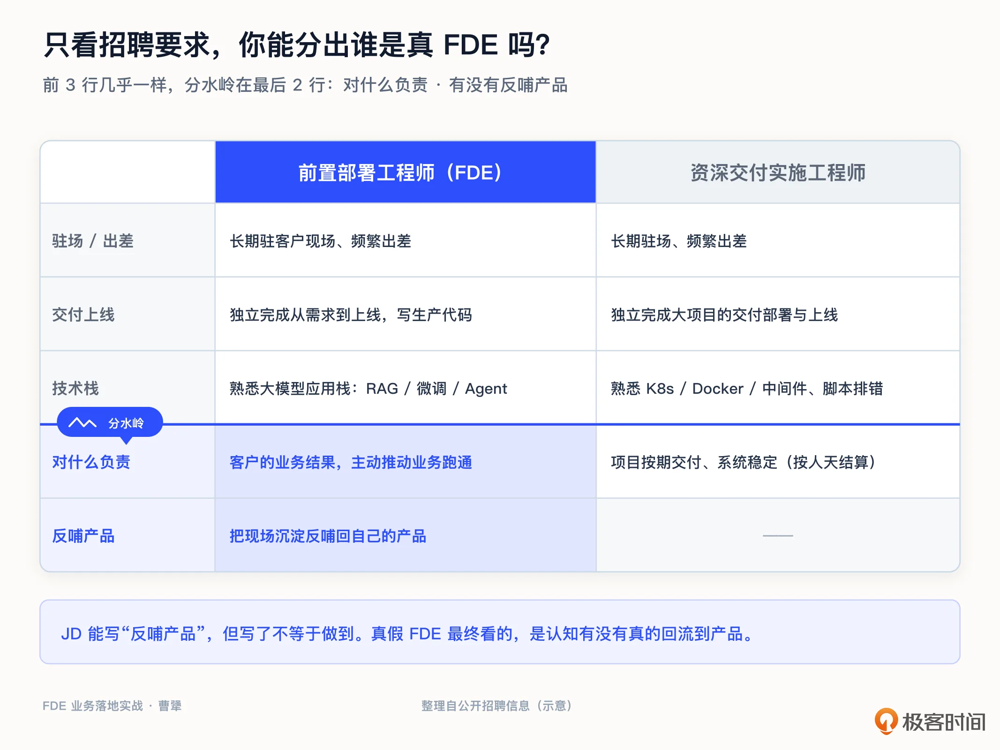
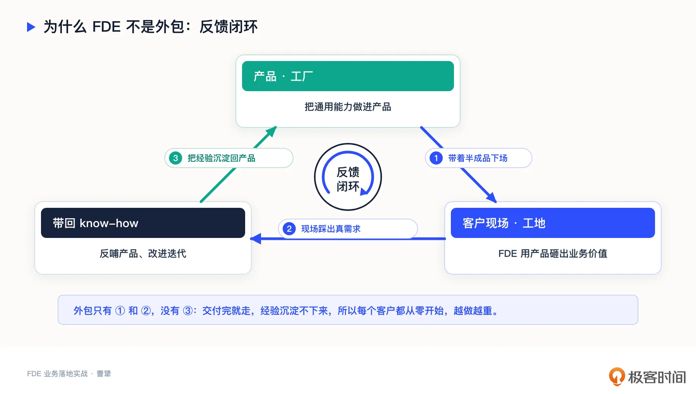
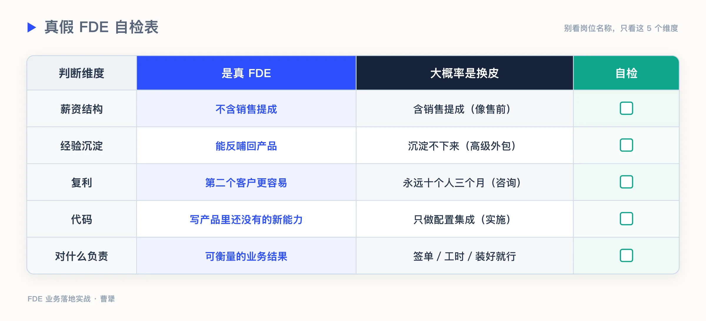
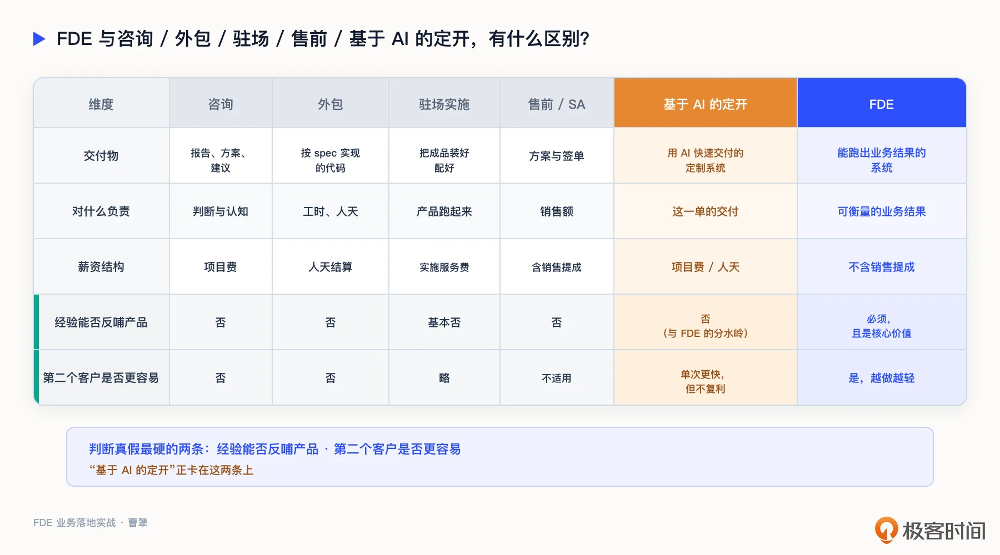

# 02｜FDE 与咨询、外包、驻场、售前有什么区别？
你好，我是曹犟。

这节课，我们来直面一个争议。你只要在中文互联网上搜一下 FDE，很快就会刷到一片冷嘲热讽。有人说，看 FDE 的 JD 非常像驻场开发，先拿一个 Demo 把客户唬住，再把需求总结一下，丢给产品团队；也有人说，这不就是新时代的外包团队；还有人调侃，中国软件公司 80% 已经是 FDE 了，驻场、外包、ISV、行业解决方案商，我们玩了十几年了。

英文社区也一样。有人直接说，Forward Deployed Engineer 不过是给解决方案架构师换了个名字而已；还有人说，这就是 Palantir 造出来的军事化营销词，本质就是老掉牙的驻场工程师。

这也是我为什么要在课程这么靠前的位置，专门花一整讲来回应这些质疑。

因为这是 To B 圈子里关于 FDE 最大的争议，也是你判断是否要入这一行绕不开的第一道坎。如果 FDE 真的只是外包换皮，那它完全不值得你的投入。可如果它真的有本质上的新东西，你又分不清，就很容易兴冲冲跳进一个挂着 FDE 名头、其实不过是传统实施或者售前的坑里。

较真这件事的，不只是中国 To B 圈。Srinivas Bommena 写的 FDE 实战手册《Shipping Enterprise AI》，也干脆单列一章，专门讨论 FDE 和其他所有岗位到底有什么不同，标题就叫 FDE vs. Everyone Else。你看，把这件事弄清楚，是想进入 FDE 这一行绕不过去的基本功。

需要说清楚的是，上面这些质疑，并不是无理取闹。市面上一大半挂着 FDE 名头的岗位，确实就是售前或者实施换了个名字。这一点，我也完全承认。到了今年，这个现象反而更热闹了：招聘平台 Indeed 上 FDE 的相关岗位，一年涨了 7 倍还多；36 氪 7 月的一篇报道，把其中相当一部分直接定性为“概念套利”；B 站上甚至出现了几百集的 FDE 转行课。

但情况也没有这么糟。就在今年 5 月，OpenAI 专门成立了一家企业部署公司，还收购了一支团队，一口气得到约 150 名 FDE；Anthropic 也在几天内跟进。如果 FDE 真的只是一个换名营销词，这些最顶尖、最不缺工程师的 AI 公司，何必为它单独成立公司、重金招人？

所以真相，多半在两个极端之间。既有大量浑水摸鱼的套壳营销，也有真正有价值的东西。这恰恰说明，我们自己需要知道如何分辨真假好坏。

那么，这节课我们的目标很明确了：把 FDE 和咨询、外包、驻场、售前这四个最容易混淆的角色之间的区别，一个一个讲清楚。讲完后，我也会给你一套判断标准，一张真假 FDE 的判断清单。以后再看到任何一个 FDE 岗位、任何一支 FDE 团队，你都能判断，它到底是真的，还是只换了层皮。

### 为什么大家会觉得“FDE 就是外包”？

这里面肯定有一些容易让人误解的地方。

例如，如果只看表面，FDE 和外包、驻场几乎一模一样。都是去客户现场办公，都要写代码，都要解决客户提出的具体问题，都免不了大量的出差。招聘要求也是这样。下面一份是 FDE 的招聘要求，一份是资深交付实施工程师的招聘要求，我把它们放在一起。

你会发现，前面那些技能项几乎重叠：都要能驻场出差，都要能独立把项目交付上线，甚至都要求熟悉大模型这套技术栈。光看这些，你确实分不出谁是真 FDE。但你再往下看两行，两份要求不一样了。而那两行，恰恰是这节课要讨论的关键。

要想把它们分清楚，必须往下看一层，看表面动作背后的两样东西：第一，他到底对什么结果负责；第二，他做完这一单，给公司沉淀下了什么。

这两个问题才是真正把 FDE 和其他角色区分开的分水岭。我们带着这两个问题，来做四组辨析。

### 第一组：FDE 和咨询有什么区别

先说 FDE 和咨询的区别。咨询交付的是什么？是一份诊断报告、一套方案、几条建议。咨询顾问通常很聪明，分析也很到位，但他交付的核心，只是认知和判断。项目一结束，这些知识往往就仅仅停留在报告里、停留在顾问自己的经验里。下一个客户来，很多分析还得从头做一遍，当然，这种从头再来也符合咨询行业的收费模式。

而 FDE 交付的是什么？是一个能在客户生产环境里真正跑起来的系统，是可衡量的业务结果。更关键的一点是， **FDE 在现场踩坑得到的经验，需要能沉淀回自己的产品中**。

前 OpenAI 首席研究官 Bob McGrew 有一句话说得非常到位。他说，FDE 的最终目标，是打造一个越来越强大的平台化产品；而咨询的目标，是完成一个又一个独立的交付项目。

从这个区别可以看出来，咨询公司做一百个项目，是一百次独立的智力劳动，规模越大，需要的人也越多。而 FDE 模式做一百个项目，理想状态是让同一个产品被打磨一百遍，产品越做越强，项目却越做越轻。

还有一句话概括得也很准：传统定制服务是成本中心，靠服务交付赚钱；FDE 模式则是投资行为，靠深度服务做产品探索。说白了，咨询和外包赚的是这一单的钱， **FDE 投资的则是产品的未来**。

### 第二组：FDE 和外包有什么区别

外包的经济模型，是按人/天做结算的。需求方给一份 spec，外包团队照着实现、交付、验收、结账。外包通常不需要自己定义问题，更重要的是，项目交付之后，外包团队也不负责把经验沉淀进产品。

而 FDE 则不一样。FDE 到现场最重要的是 **把真问题挖出来**。FDE 自己定义要做什么，自己写产品里还不存在的生产代码。FDE 在前线做的每一件事，都要连着一条反馈通道，把客户的需求和模式，反哺给总部的产品团队。

ExplainThis 的作者杨芳贤有一句话很好地说清楚了二者的区别，他说：“如果只是去客户那里写一堆定制代码，那不叫新范式，那叫高级外包。”

他还给了一个特别明确的检验方法，就看一件事：每做完一个客户，下一次是否更容易？如果第一次部署要十个人干三个月，第二次还是十个人干三个月，第三次依然如此，那这就不是一家产品公司，而是一家外包公司。

**第二个客户** **做的时候** **是不是更容易，是检验真假 FDE 最朴素、也最有效的一条标准。** 外包的增长往往是线性的，做十个客户，就要投入十份人力。而真正的 FDE，第二个客户应该比第一个轻松，因为第一个客户的经验，已经内化成了产品里的能力。

退化成外包，是 FDE 天生要面对的风险。专门研究 FDE 的 Sho Shimoda，在书里总结了几种常见的失败模式，其中有两种值得单独拿出来。一种叫“咨询陷阱”，就是不知不觉又做回了咨询，交付的还是一次性的方案，没能沉淀成产品。一种叫“每客户雪花化”，雪花的特点，是每一片都独一无二、没法复制，也就是说，每个客户的系统，都被单独手工雕琢成了独一无二的一套，下一个客户来，什么都用不上，只能从头再来一遍。这两种失败模式，其实指向同一个问题：FDE 一旦失去沉淀和复利的能力，每个客户都要从头定制，项目之间没法复用，就会退化成咨询和外包。所以，担心 FDE 变成外包，并不是杞人忧天，而是每个 FDE 都需要时时自检的事。至于他书中完整的六种失败模式，我们留到第 18 讲展开讨论。

而到了 AI 时代，这个“退化成外包”的风险，变得更有迷惑性了。

现在 AI 编码这么强，一个工程师带着 Claude Code 和各种 Agent，进到客户现场，几天就能搭出一套定制系统，跑得还不错，客户也挺满意。这个工程师会很自然地觉得：我进了现场，用 AI 写了生产代码并且交付了结果，这不就是 FDE 吗？

我个人的判断是：还不是。这种情况只能叫做“基于 AI 的定开”。它依然是定开，依然是给单个客户写定制代码，说到底还是上面描述的那种外包，只不过手里多了 AI，写代码更快了而已。AI 确实能提效，但它改变的只是交付的效率，没有改变交付的性质。判断一个公司是不是 FDE，不是看是否使用了 AI，最重要的标准依然是： **在客户现场得到的认知，到底有没有回流到产品里。**

而且这里有个反直觉的地方，AI 让单次交付变得又快又爽，反而容易让人停在“快”里。反正下一个客户来，我用 AI 飞快地再做一遍就行，何必费劲去沉淀到产品里？可能的结果就是，AI 非但没让你从外包里解脱出来，反而让你陷进“很高效的高级外包”这种陷阱，却还以为自己在做 FDE。所以越是到了 AI 时代，“认知能不能回流到产品”这条主线，反而越值钱。

### 第三组：FDE 和驻场实施有什么区别

这一组也很容易混淆，因为两个岗位都要“驻场”。

实施工程师做的是什么？是把一个已经成型的产品，在客户那里装好、配好、接好、培训好。实施工程师的工作范围，是“让这个产品在这个客户这儿跑起来，解决客户的实际问题”。产品的能力边界是确定的，实施是在这个确定的边界之内，让它落地。所以，实施是产品的下游。

而 FDE 则是产品的上游。FDE 往往出现在产品能力还不够、甚至产品形态还没定型的阶段。FDE 去现场，不是为了把成品安装上线，而是为了搞清楚“客户的问题到底是什么，这个产品到底应该长什么样”。 **FDE 构建的，是产品里此刻还不存在的能力。**

可以用一句话来记住这一组区别：实施是把已有的产品交付给客户，FDE 则是带着半成品去现场，把客户的真实需求变成产品的下一版。一个是在产品定型之后，一个是在产品定型之前。

### 第四组：FDE 和售前、解决方案架构师有什么区别

这一组的区别，可以用 KPI 和薪资结构来判断。

售前也好，解决方案架构师也好，他们的核心使命是促成签单。他们需要懂技术，方案也做得漂亮，但他们的考核指标是销售额，薪资里通常带着销售提成。立场决定动作，他们的目标是“把东西卖出去”。

**FDE 的考核指标，则是交付可衡量的业务结果**。FDE 的目标是“把东西做出效果”。这两个目标，在很多关键时刻是会冲突的。售前为了签单，可能会承诺一个其实做不到的效果；而 FDE 如果发现这个场景根本没有价值，该做的是叫停，而不是硬上。

这种立场的冲突，我经历过很多次。一个场景，客户很想买单，售前自然倾向于把它讲成能落地、效果好；但真正的 FDE 到现场则会发现，这个场景的数据条件根本不具备，非要做只会交付一个毫无效果的烂尾工程。售前的成功，在签约那一刻就兑现了；而 FDE 的成功，要等到几个月后业务指标真正改善，才能算数。考核的时机不一样，目标不一样，关键时刻的取舍自然就不一样。

所以，这里就有一条很明确的判断标准：看薪资结构里有没有销售提成。网上有一个流传很广的说法，我觉得很在理：市面上一大半挂着 FDE 名头的岗位，其实是售前或者实施换了个名字。如果这种 FDE 的薪资结构里有提成，那的确只是售前换了层皮。

### 真假 FDE 判断清单

四组岗位对比讲完了，我把它们浓缩成一张清单，你可以拿去对照任何一个 FDE 岗位，或者任何一支号称在做 FDE 的团队。

第一， **看薪资结构**。里面有没有销售提成？如果有，它更可能是售前换皮。

第二， **看沉淀**。客户现场得到的经验，能不能反哺产品？如果不能，每个项目都从零开始，那就是高级外包。

第三， **看复利**。第二个客户是不是比第一个更容易？如果永远是十个人三个月，那就是咨询公司。

第四， **看代码**。构建的是产品里还不具备的新能力，还是只在做配置和集成？如果只是后者，那是实施。

第五， **看对什么负责**。这一条也是对前面四条的总结。对签单负责的，是售前；对工时和人天负责的，是外包；对“产品跑起来”负责的，是实施；对可衡量的业务结果负责、还要把经验沉淀回产品的，才是 FDE。

在这五条里，我个人最看重第二条和第三条，也就是“能不能沉淀回产品”和“第二个客户是不是更容易”。因为薪资、代码这些还可能被包装，但“产品”和“复利”是装不出来的。一家公司是不是真的在做 FDE，你只要观察它做到第三个、第五个客户的时候，项目是越来越轻，还是越来越重，答案就很明显。

上面五条，我也整理成下面的表格，方便你对照使用：

这张清单还差最后一个维度。上面五条，全部是站在乙方这一侧，看团队、看岗位。但对于同样一家客户来说，对接外包和对接 FDE 两种服务模式，要付出的东西也是完全不一样的。外包进场，客户给一份需求文档，按文档验收就行，自己什么都不用变。FDE 进场，客户要让你进业务会议，要给你真实的数据和权限，还要安排懂业务的人陪你磨合。所以我还想补一句客户这一侧的判断： **外包客户不用改变自己，FDE 的客户必须改变自己。**

从这个角度来说，FDE 模式能不能成立，本质上是一场双向筛选：一头筛选人和团队，一头筛选客户。这一讲，我们把人和团队这一头讲清楚了。客户那一头怎么筛，进场之前要过哪几问，我会在第 5 讲专门给出一张清单。

### 中国语境：“80% 都是 FDE”既是讽刺，也是机会

最后，我们回到开头那句调侃：“中国软件公司 80% 已经是 FDE 了”。

这句话的讽刺意味很重，驻场、外包、行业解决方案，我们干了十几年了，你换个英文名，它就变成新东西了？

这个讽刺当然有道理。过去十几年，中国 To B 行业确实有大量“人肉填 gap”的工作。工程师驻场，把客户的窟窿一个一个堵上，堵完就撤。但这些经验始终沉淀不下来，第二个客户来了，还是从零开始。所以这套模式，最后大多做成了成本中心，做成了外包，利润越来越薄，人也越堆越多。

这就是为什么我会说，FDE 是机会，而不是新瓶装旧酒？

因为变量变了。过去，“把现场踩出来的泥路，铺成产品里的柏油路”这件事，技术上太难、成本太高，所以大家做不到，只能停留在外包那一层。而 AI 第一次让这件事变得可行。借助 Agent 和知识库，你在现场积累的行业 know-how、客户的真实流程、踩过的坑，有可能被低成本地抽取、整理、脱敏、结构化，变成可复用的产品资产。

这一点，我自己在神策深有体会。神策做大数据分析十几年，我们一直在避免走“定制开发”的路：客户要什么，我们就驻场给他写什么。写完一个项目，团队撤场；下一个客户来了，很多东西又得从头再来一遍。如果走这条路，我们只能活得很像一家“带着软件估值的外包公司”。

我们必须逼着一线团队，把每一次客户定制里那些通用的部分抽象出来、沉淀回产品，让第二个、第三个客户能直接复用。现在看来，这个区别恰恰就是“外包”和“FDE”之间那条分界线。FDE 的本质，是在 AI 的加持下，用产品化的手段，弥补企业 IT 中台和前台业务人员之间巨大的 gap；如果没有弥补上这个 gap，AI 的能力也好，大数据的能力也好，都产生不了价值。

所以我们换个角度看那句调侃，结论就完全反过来了：正因为国内 80% 挂着 FDE 名头的还是换皮，所以谁能真正把“沉淀回产品”这件事做成，谁就能从这一片“高级外包”里杀出一条血路。 **FDE 不是噱头，而是一个困扰行业十多年的老问题终于在 AI 时代有了新的解法。**

而且，这件事已经在发生了。国内的基础模型厂商，比如 MiniMax、月之暗面、智谱，以及通义、混元背后的团队，这两年都在招聘“AI 售前解决方案”“前置部署”一类岗位；Dify 则早在 2025 年初，就公开发布过名称明确写着“前置部署工程师，Forward Deployed Engineer”的职位。到了 2026 年，腾讯云也挂出了“前线部署工程师”的岗位，字节、阿里云都有类似的招聘。虽然国内目前还没有公开的 FDE 岗位数量和薪资中位数，这些招聘更多是上面这些公司在探索的一种形态，而不是已经跑通的成熟模式。但风向其实已经非常清楚了。

关于 FDE 在中国市场的具体机会，我们会在第 4 讲，结合中国 To B 的情况再做展开。

对于个人来说，这一讲其实有一个很实际的用处。如果你想入行，那么你要找的团队，是那种会 **逼着你把经验沉淀回产品的团队**，而不是那种把你当人天卖出去的团队。前者让你越做越值钱，后者让你越做越像一颗螺丝钉。用今天这张清单去面试，去反问对方，你就不会单凭一个名字就被对方骗进坑里。

### 课程总结

这节课，我们直面了 FDE 最大的争议：“它是不是就是外包换皮？”

答案是：表面动作可能像，但本质完全不同。区别就藏在两个问题里：他对什么结果负责？做完一单，又给公司沉淀下了什么？

我把这节课六个角色的对照，整理成一张图，方便你保存。这张图里，我也把前面讲到的“基于 AI 的定开”放了进来，你能一眼看清楚，它和 FDE 到底差在哪里：

判断 FDE 的真假，记住最硬的两条就够了：现场经验能不能沉淀回产品；第二个客户是不是做得更容易。其余的薪资、代码、负责对象，都只是辅助验证。

如果你想转型 FDE，这个判断标准可以直接带进面试，帮你分清自己要去的，到底是产品上游，还是外包流水线。如果你是 To B 创业者或者技术决策者，也可以用它来审视自己的团队：你以为在做 FDE，但如果第五个客户还是和第一个一样重，那你做的其实只是外包，得赶紧调整方向。

### 思考题

留两个问题，欢迎你在留言区聊聊。

第一，用今天这张判断清单，回头看看你现在的工作，或者你了解的某个“FDE 岗位”、某支交付团队，它更接近真 FDE，还是更接近外包、实施、售前？是哪一条让你做出了判断？

第二，“第二个客户是不是做得更容易”这条标准，你认同吗？在你的行业里，有没有那种表面上做项目、其实越做越重，最后把自己拖垮的公司？

期待你在留言区分享你的思考。如果这节课对你有启发，也推荐你把它分享给身边更多朋友。下一讲，我们来聊聊：AI 已经这么强了，为什么 95% 的 AI 项目仍然失败？这背后又藏着什么机会？