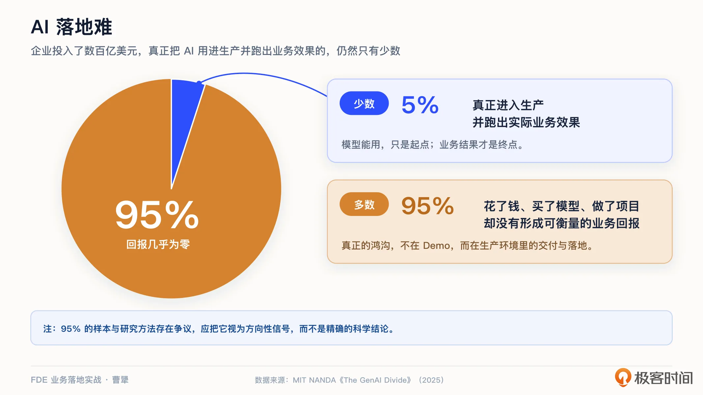
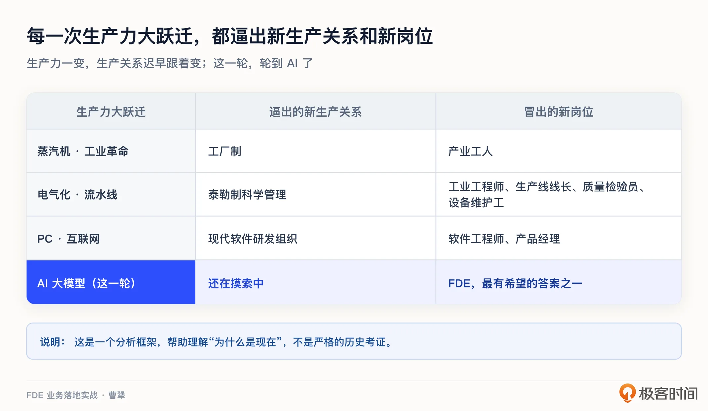
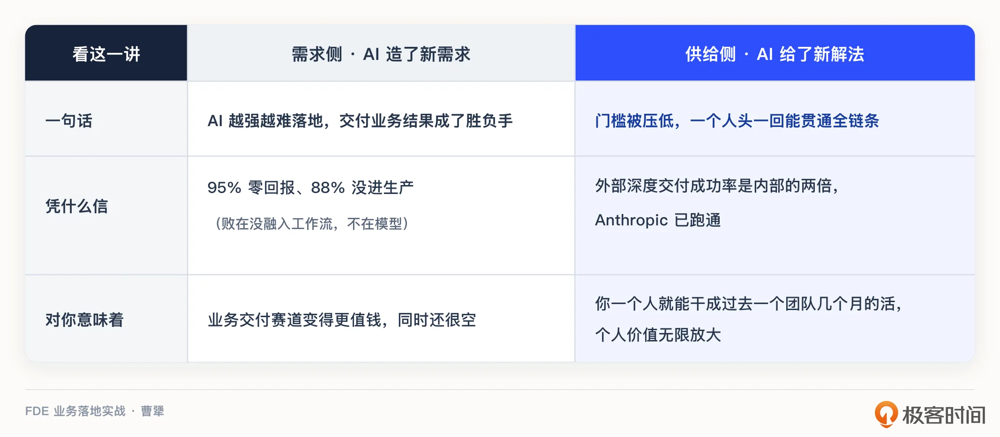

# 03｜为什么是现在：95% 的 AI 项目卡在落地，一个人却能跑通产品闭环
你好，我是曹犟。

前面两讲，我们讲清楚了 FDE 是什么，也讲了它和咨询、外包、驻场、售前的区别。今天这一讲，我想回答一个你可能一直想问的问题：FDE 这个角色，为什么偏偏是现在火起来了？

把工程师派到客户现场这件事，一点都不新鲜。驻场、实施、乙方外包，中国 To B 企业干了几十年了。而从 Palantir 提出 FDE 这个概念，也快 20 年了。可为什么单单是这两年，FDE 突然成了硅谷最抢手的岗位，并且这半年在国内也热度越来越高？

我觉得，这跟生成式 AI 带来的根本性的技术变革，脱不开关系。这一轮 AI 革命，其实同时产生了两个巨大的影响。一方面，它带来了一个又大又急的新的需求市场：AI 能力越强，就越难落地，企业就越是急着找人，把它变成真金白银的业务结果。另一方面，则是它同时给需求带来了一个新解法：AI 把做产品、改代码的门槛压得很低，让“一个人从头贯通整个产品链条”这件过去想都不敢想的事，第一次变得可以得到。一方面需求被点燃，一方面能力被解锁，而且是来源于同一场技术革命，在同一个时刻同时发生的。这，才是“为什么偏偏是现在”的完整答案。

这一讲，我们就顺着这两条主线往下走。

先看需求这一侧，从一个你可能会觉得有点反常识的数字讲起。

## 先看一个数字：95% 的失败

麻省理工有一个叫 NANDA 的研究项目，2025 年出了一份研究报告，叫 [《The GenAI Divide》](https://mlq.ai/media/quarterly_decks/v0.1_State_of_AI_in_Business_2025_Report.pdf "")。里面有一个数字当时被到处引用：企业在生成式 AI 上，前前后后投进去了三四百亿美元，可其中大约 95% 的组织，回报几乎是零。真正把 AI 用进生产环境、跑出实际业务效果的企业，只有 5% 左右。

当然，这个 95% 的数字，后来是有争议的。在报告出来之后不久，就有人指出，这份报告的样本不算大，方法也不够严谨，不应该被当成一个精确的科学结论。但即便我们把这个数字打个折，它背后指出的方向还是很清楚的：绝大多数企业，花了钱、买了模型、组织了项目、认真尝试了，但最后却没能让 AI 真正落地、真正产生业务价值。

无独有偶，还有 [另一份来自 IDC 的调研](https://www.cio.com/article/3850763/88-of-ai-pilots-fail-to-reach-production-but-thats-not-all-on-it.html "") 说，企业启动的 AI 概念验证项目里，大约 88% 从来没能真正进入生产。

这两个数字放在一起，说明的是同一件事：这几年 AI 的能力涨得这么快，跑分提高了这么多，可真正在企业环境里，用它得到真实业务结果的，依然是少数。

这种应用 AI 失败的例子，你可能自己也见过或者听说过。一家企业，老板看了公众号、参加了会议后，对 AI 充满了期待，回到公司兴冲冲地开个启动会，上了一个 AI 项目，做了个 demo，效果惊艳。老板当场拍板，预算也给到位。可真到了要用起来的时候，问题一个接一个冒出来：数据接不进来；权限过不了合规；业务人员说它不好使，宁可用回老一套。几个月折腾下来，热情耗光，项目慢慢也没了声响。钱花了，人也累了，业务结果却几乎没变化。这样的故事，这几年在太多公司里反复上演。

这就很奇怪了，模型能力明明肉眼可见地越来越强，看起来全面替代人类指日可待，那为什么 AI 项目反而大面积地失败呢？

## 失败的，不是模型

答案可能很简单，这些项目栽跟头的地方，恰恰不是模型能力。

回到开头那份 MIT 的报告，它在分析失败原因的时候，特别强调了一点：企业的 AI 项目做不成功，通常不是因为模型不够聪明，不是因为数据不够，也不是因为招不到人。真正的原因，是那些工具“不学习、不留存反馈、不融入现有的工作流”。说白了，也就是 AI 没能真正构建到企业的业务里。它就像一个悬在半空的玩具，演示的时候很惊艳，一放进真实的流程，就水土不服。

这背后，可能还有一个更深的变化。一家叫 Faros AI 的公司，出过一份 [《AI Engineering Impact Report》](https://243608892.fs1.hubspotusercontent-na2.net/hubfs/243608892/AI_Engineering_Impact_Report_July_2025_Faros_AI.pdf "")，分析了一万多名开发者、一千多个团队之后发现：当 AI 让写代码这件事变得飞快之后，研发的瓶颈并没有消失，而是往下游移动了，移到了评审、测试、发布、集成这些环节上。他们有一个很具体的观察：那些重度使用 AI 的团队，代码合并的量涨了接近一倍，可与此同时，花在代码评审上的时间也涨了差不多九成，缺陷率还略微上升了。也就是说，代码是写得快了，可把代码变成一个能在企业里稳定运行、真正被用起来的系统，其中还是有很多环节，AI 目前帮不上太多忙。

所以我们可以看到一个挺有意思的错位：AI 把“写代码”这件事的成本“打下来”了，但“AI 落地”这件事的难度，一点没降，反而因为 AI 的广泛应用变得更突出了。有句话我非常认同：一个 AI 项目的成功，六到七成其实取决于“应用落地”，而不只是工程和编码本身。这也是为什么，我在开篇词里说，写代码不再是瓶颈，交付才是。

那份 MIT 的报告其实还顺带回答了另外半个问题：那成功的 5%，到底做对了什么？答案挺有意思。这些成功的 5% 企业，几乎都要求供应商做到流程级的定制，按真实的业务结果来验收，还把对方当成一个长期的服务伙伴，而不是一个卖完就走的 SaaS 厂商。你把这几条对照一下就会发现，这不就是我们前两讲介绍的 FDE 那一套打法吗？换句话说，那些成功的少数派，其实早就在用 FDE 的方式做事了，只不过不一定叫它这个名字。

## 换一个历史的角度来看

讲到这里，我想把镜头拉远一点，给你一个更大的视角。当然，这只是我个人很喜欢的一个分析框架，只是一种看问题的角度，不是什么严格的历史考证，很多细节姑且不用较真。

这个分析框架，其实就是我们在初中政治课都学过的一句话：生产力决定生产关系。

具体来说，每当生产力发生一次大的跃迁，原来那套人和人协作、分工、组织的方式，也就是生产关系，往往就和生产力的进步匹配不上了。于是组织和社会，就得重新摸索出一套新的协作方式，也就是新的生产关系。这个过程中，也自然会涌现出一批新的岗位。

我们看几个过去的例子。蒸汽机的发明，带来了第一次工业革命，生产力上了一个大台阶，于是原本的一家一户组织方式的手工作坊不行了，产生了工厂制，也出现了一个全新的岗位，产业工人。而后来电气化和流水线又是一次新的跃迁，于是有了泰勒制这套科学管理方式，也出现了工业工程师、生产线线长、质量检验员、设备维护工这类新角色。有人负责把动作拆成标准工序，有人负责控制生产节拍，有人负责质量检验和设备维护。再到 PC 和互联网普及，生产力和生产关系又变了，这一次，出现的则是“软件工程师”和“产品经理”，这类我们今天已经习以为常的岗位。

所以，可以看出，每一次生产力往前进一大步，的确都会产生一套全新的组织方式和一批新的岗位。

现在，轮到 AI 了。毫无疑问，AI 是最新一轮的生产力大跃迁，而且来得又快又急。那么，按刚才那个规律，旧的那套生产关系，一定会有一段匹配不上的阵痛期。我们去看今天大多数企业用 AI 的方式，要么是买一套标准的 Agent 产品，要么是自己搭建团队从头自建，要么是找个乙方来做定制外包。这几套依然是过去的老办法，本质上都还是上一个时代的生产关系。买标准 Agent 产品，等于默认所有企业的问题都是一样的，可 AI 落地最难的，恰恰是每家那点不一样的具体现实；自己团队从头自建，可多数企业既没有那么强的工程能力，也负担不起一支长期打磨的研发队伍；找乙方定制外包，乙方交付完就走，经验沉不下来，下一个需求又得从头开始。它们都或多或少匹配不上 AI 这个新的生产力，磨合起来磕磕绊绊，导致的结果之一，就是前面我们提到的高得吓人的失败率。

而 FDE，在我看来，就是企业正在摸索的、属于 AI 时代的一种新的生产关系。它想回答的是一个新问题：当 AI 这么强、却又这么难落地的时候，一家企业到底该用什么样的方式，把新生产力组织起来、交付出去、变成真金白银的结果？FDE，就是目前看起来最有希望的一个答案。

## 交付，成了胜负手

前面主要讨论的都是需求侧面对的现实和挑战，结论其实已经比较清楚了。

一方面，是 AI 让写代码不再稀缺；另一方面，则是绝大多数项目都倒在了“落地”这最后一公里上。那么，谁能把 AI 真正交付落地、跑出业务结果，谁就抓住了这一轮最关键的东西。“交付”，也就是让 AI 在企业的现实中真正取得业务结果，从一个不起眼的后端环节，变成决定成败的胜负手。

这背后的逻辑可以这么理解：如果智能正在被商品化，那唯一的竞争优势，就在于你怎么用它、在哪里用它。模型本身，大家都能调用；那么差距，自然全体现在模型落地的方式上了。

这里还有一个数字，也能够侧面验证我的观点。那份 MIT 的报告发现，由外部专业团队深度交付的 AI 项目，最后能真正部署起来的比例，大概是企业自己闷头自建的两倍，背后的关键原因，是是否有人“把技术翻译成业务结果”。

这个结果，其实有点反直觉。论懂自家业务，内部团队肯定比外人更懂，照理说，把技术翻译成业务结果，应该是内部团队更在行才对，怎么反倒是外部团队效果更好？原因就在于，交付能不能成，拼的不只是单纯的懂不懂业务，更是有没有一个人或者角色，从头到尾盯着“把技术变成业务结果”这一件事：嵌进业务现场、按真实的业务结果验收、把产品一点点打磨到业务愿意用。这套打法，恰恰是外部专业团队带进来的，也正是多数内部团队自建最缺的那一环。说白了，连最懂业务的第一方，少了这个专门盯交付的角色，照样落不了地。这才更说明，交付本身，就是那个胜负手。

这可能也是 FDE 这套打法如今变得更加重要的原因。

## 而这一次，一个人就够了

说完需求侧，我们再说供给这一侧的变化。前面那句“有没有一个人”，其实还藏着一层隐藏要素：就算你想让一个人，扛起从需求到落地的整个链条，放在过去也不现实。而 AI，恰恰放大了“一个人”能干的事。过去，从摸清客户现场的真需求，到把它做成能复用的产品能力，中间要经过好几个角色、好几个月，有可能产品还没做完，客户的业务已经发生了变化。而今天，AI 把做产品、改代码的门槛压了下来之后，很多环节，一个嵌在客户现场的人自己就能顺手闭环：认知拿回来，方案做出来，甚至直接改进产品功能。这就意味着，“把技术翻译成业务结果”这个链条，第一次有机会由同一个人从头贯穿到尾。第 1 讲说的现在流行的 FDE 这种一个角色打穿的新尝试，也正是因为 AI 带来的生产力提升，才第一次变得现实。

到这里，“为什么是现在”的两侧就合上了：需求侧，交付成了胜负手；供给侧，AI 让一个人第一次能真正打穿。两遍的改变发生在同一个时刻，FDE 才在这个时间点突然变得火热。

有一些成功样本，你现在已经能看到了。比如 Anthropic 自己就有一支叫 Applied AI 的团队，干的就是 forward deployed 的活。他们帮出行公司 Lyft 做 AI 支持助手，客服问题的解决时间下降了 87% 以上；帮 ServiceNow 做销售准备，相关时间缩短了 95%。他们的打法也很有代表性：先花一周做十几场用户访谈、嵌进业务，第二周设计评估，随后几周搭系统、灰度上线，之后再持续跟客户边用边复盘迭代。

这套动作，就是我们这门课后面要一步一步拆解的东西。

对我们这些技术背景的人来说，这里面的机会是历史性的。当会写代码不再是你的壁垒，能把 AI 落进真实业务、交付出结果，就成了你最值钱的能力。FDE 本身不是产品的 PMF，它更像是在企业级 AI 还没完全产品化之前，用来寻找 PMF 的一种探索方式。换句话说，站在这个新旧生产关系交替的当口，FDE 就是那个走在最前面、替整个行业探路的人。

对你个人来说，这里其实藏着一次重新洗牌的机会。过去你可能觉得，不进大厂的核心算法组、不碰最前沿的模型，就没什么机会。但“AI 落地”这条赛道恰恰相反，它是连模型能力最强的那几家公司都不默会、必须靠专人一个客户一个客户去趟的地方。它比拼的东西也不一样：你能不能钻进一个陌生的行业，把 AI 和真实的业务填补鸿沟缝合到一起。AI 时代最值钱的人，可能不是最会写代码的，也不是最懂模型的，而是那些能站在技术和业务的交叉点上，把两边连起来的人。而这条赛道，现在还很空。

所以，风口为什么是现在？因为生产力已经变了，而配套的新生产关系还在襁褓里。谁能先趟出来，谁就能吃到这一波红利。

## 课程总结

这一讲，我们回答了“为什么是现在”。

先从一个反差结果：AI 越来越强，可高达 95% 的企业 AI 项目回报是零。而失败的原因，不在模型，在于 AI 没能融入工作流、落不了地，瓶颈从“写代码”下移到了“交付”。宏观层面上，这是 AI 这个新生产力，和旧的生产关系之间的一次错配。FDE，就是企业正在摸索的、AI 时代的新生产关系。于是，交付成了这一轮的胜负手，而能交付的人，也变得更加值钱。而这一次和过去的另一个不一样的点在于：AI 把做产品、改代码的门槛压得极低，让一个人第一次能从需求一路贯通到落地。

说到底，为什么是现在 FDE 突然火起来，是需求和能力，被同一场革命在现在同时点亮。

我把这一讲的两条线，整理成一张对照表，方便你保存对照：

如果你正在做交付、实施、售前，这一讲能帮你看清，自己正站在一个不断变大的风口上；如果你是想转型的程序员，它能帮你想明白，为什么现在是切换到 FDE 这条赛道的最好时机。

## 思考题

留两个问题，欢迎你在留言区聊聊。

第一，在你自己的公司，或者你了解的项目里，AI 落地最大的卡点，到底是模型不够强，还是“最后一公里”的业务交付和融入工作流？

第二，AI 这一次不光创造了需求，还产生了一个新的解法：让一个人就能贯通从需求到落地的整个链条。在你的亲身经验里，AI 是不是已经能让你一个人，干成过去得一个小团队忙上好几个月才干得成的活？如果还不能，你觉得问题出在哪个环节？

如果这节课对你有帮助，欢迎你分享给周围对 FDE 这个概念感兴趣的人。

下一讲，我们把视角收回到国内：十年都没走通的中国 To B 交付难题，这一次靠 FDE 加上 AI，到底有没有机会解开？我们下一讲见。