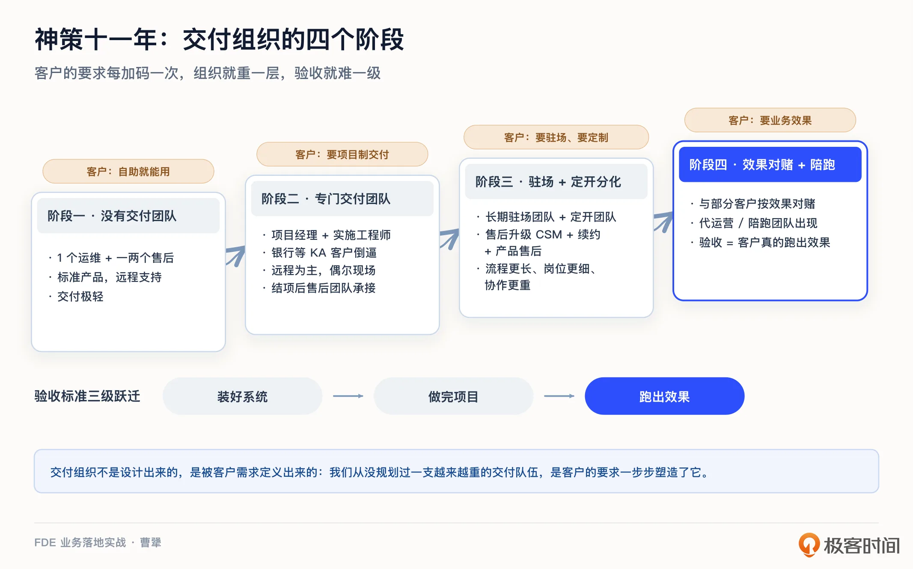
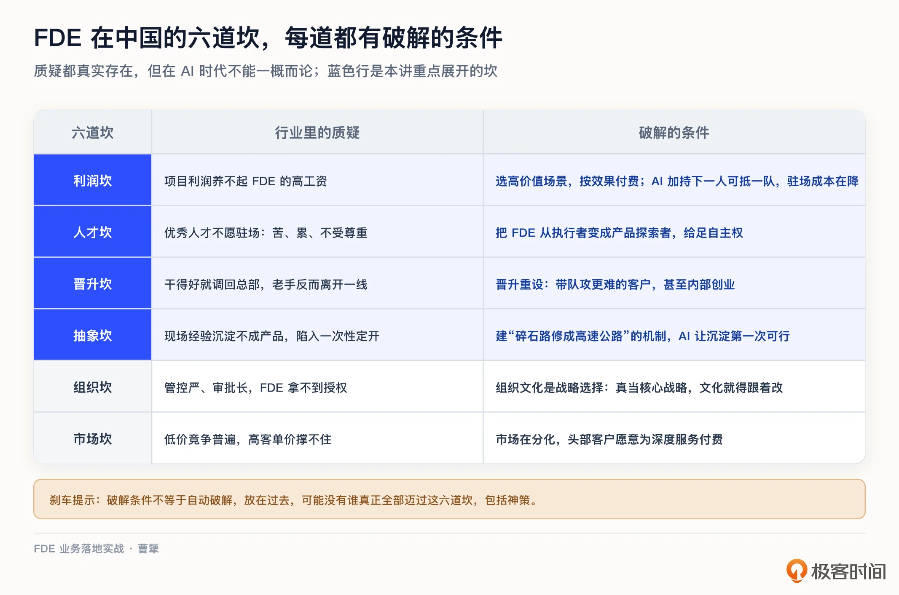
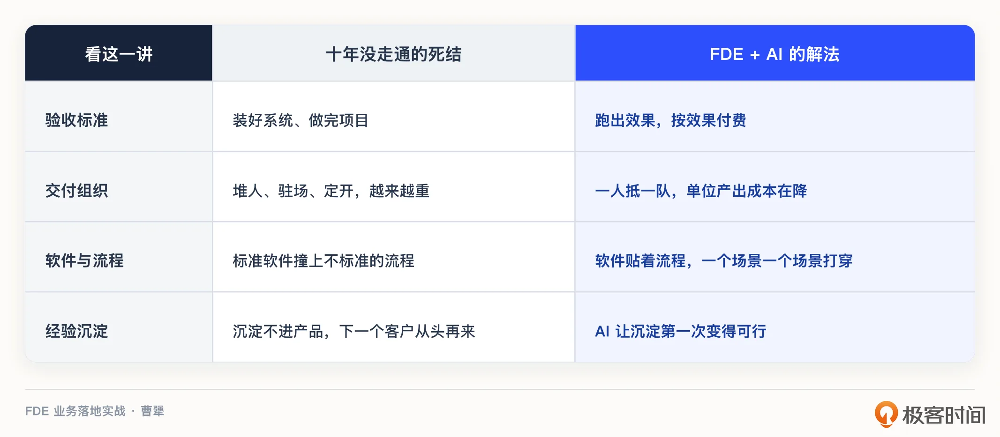

# 04｜中国机会：十年没走通的交付难题，FDE + AI 能解吗？
你好，我是曹犟。

上一讲，我们回答了“为什么是现在”这个问题：AI 是新一轮的生产力大跃迁，交付成了关键的胜负手，同时，AI 带来的生产力发展又让 FDE 一个角色完成整个产品闭环成为了可能。不过，上一讲的视角主要聚焦在硅谷；而在第 2 讲结尾我也说过，关于中国市场的 FDE 机会，会专门用一讲来讨论，今天这一讲就来兑现。

中国 To B 交付，这个十年都没走通的老大难问题，现在有了 FDE 加上 AI，到底有没有机会解开？

这一次我不打算从报告和数字讲起，讲中国 To B 交付到底有多难。因为我自己在神策这十一年的亲身经历，就是最好的标本。

## 神策这十一年：交付组织是被客户定义出来的

神策是 2015 年成立的，最早服务的客户，基本都是互联网公司。那个阶段，我们没有专门的交付团队。整个公司只有 1 个运维，负责远程给客户安装部署系统，再加上一两个售后，在 IM 里回答客户使用中的各种问题。产品是标准的，客户自己就能用起来，整个交付过程非常轻。那个时候，我们曾以为这就是 To B 生意本来应该有的样子。

变化是从服务银行这类 KA 客户开始产生的。我们发现，银行项目的复杂度完全是另一个量级，标准产品加远程支持的轻交付，根本承接不住。于是，我们成立了专门的交付团队，由项目经理带着实施工程师做项目制交付，以远程为主，偶尔去现场。交付结项了，再由售后团队来承担售后服务，这是第二个阶段。

再往后，随着我们服务的各行各业的客户越来越多，产品和客户的业务越来越紧密，项目越来越大，客户的要求也在持续加码。有的客户明确要求驻场，于是我们有了长期驻场团队；有的客户要定制，界面配色、产品 Logo 甚至功能都要按他们的要求改，于是又组建了专门的定开团队，也就是做定制化开发的团队。交付之后的服务，也从单纯的售后，升级成 CSM（Customer Success Manager，客户成功经理）加续约销售再加产品售后的组合。流程越来越长，岗位越拆越细，协作也越来越重，这是第三个阶段。

由于卖产品对应的是客户的 IT 预算，而 IT 预算始终天花板有限。到了第四个阶段，为了突破 IT 预算的天花板，我们开始和部分客户尝试按效果对赌，出现了陪跑类的项目。这类项目的验收条件，不再是“把系统装好”，也不再是“把项目做完”，而是客户的业务真的跑出了效果。在这个阶段，我们也出现了专门的代运营，或者说陪跑团队，他们需要跟客户的业务团队一起，直接用我们的产品来运营客户的业务，交付最终的业务效果。

回头看这十一年，交付的验收标准，其实发生了 **三级跃迁：装好系统，做完项目，跑出效果**。每跃迁一次，交付就更难一级，组织就更重一层。这也是为什么我常说，交付组织不是设计出来的，是被客户需求定义出来的。我们从来没有主动规划过一支越来越重的交付队伍，是客户的要求，一步一步把组织塑造成了今天的样子。

那么问题来了：为什么中国的客户，会把乙方的交付组织逼成这个样子？

## 六大特征：根子是风险与责任的错配

要回答这个问题，得先看清中国 To B 行业的几个基本特征。我把它们归纳为六个：关系销售、定制开发、价格低廉、拖欠尾款、私有部署、现场服务。生意要靠关系拿下；拿下之后是一堆定制需求；项目预算却压得很低；做完了尾款可能还要拖很久；系统必须部署在客户自己的机房或者私有云里；出了问题甚至没有问题都得随叫随到上门服务。

这六个特征每一个背后都有很具体的现实。我见过 200 万的项目，要乙方先交 50 万保证金才能开工；也见过最低价中标的项目，中标价低到甲方乙方所有人都知道做不出来，最后也果然没做出来。金融行业还有一个很多人都知道的规律：这么多年下来，能获得稳定利润的往往是软件外包公司，而做产品的 To B 软件企业，无论规模大小，大都长期亏损。神策自己也碰到过类似的事：在某次投标中，我们的标准产品能满足客户八成以上的需求，而一家当地定开公司完全没有产品，报价却只有我们的六成，最后中标的反而是他们。这个案例第 18 讲复盘翻车模式时我会展开，这里先按下不表。

一句话可以概括这些现象： **甲方要的是私房菜，付的却只有沙县小吃的价。**

当然，我不是在单纯吐槽甲方，这个问题或者说现象背后，本质上有两个原因。

第一条， **风险与责任的错配**。传统交付里，乙方卖的是工具，甲方要的是结果。我曾经说过一句话，甲方要的只是业务效果，根本不关心你到底是用标准产品、定开系统甚至是堆人力来交付。仅仅装好系统，价值难以衡量，效果不好责任也没法界定，风险几乎全压在甲方身上。甲方不傻，他只能用手里有的手段自保：压价、要求定制、要求私有部署、拖着尾款不付、验收往后拖。我们把六大特征再过一遍就会发现，其中大多数，本质上都是甲方在风险错配之下的理性反应。

第二条， **乙方的产品抽象能力满足不了不同甲方的特异性需求**。第 2 讲我们说过，过去十几年，中国 To B 行业有大量“人肉填 gap”的工作，但这些经验沉淀不进产品，或者说不同客户之间的需求是如此不同以至于难以沉淀，所以第二个客户来了，还是得从头再来。

把两条放在一起，我们会看到，在过去十年，中国 To B 行业最黄金的一段时间，行业里面所有的勤奋，堆人、堆驻场、堆定制，某种意义上恰恰是交付做不好的原因之一。因为堆人总能把单个项目扛过去，大家就一直用堆人来对付本该由产品和模式解决的问题，整个行业被锁死在按人天收费的生意模式里。用上一讲的框架说，这就是一套旧的生产关系：人天外包加定制开发。只要生产力不变，这套关系就没有被打破的理由。

## 更深一层的真相：标准的软件，撞上不标准的流程

前面这两条根因，底下其实还有一个更基本的根基性问题，它平时很少被人提起，但我认为，它可能才是中国 To B 软件困境的更底层原因。

传统 To B 软件成立有这样一个前提：卖的从来不只是软件，而是一套被固化进软件里的标准管理流程。ERP、CRM 这些系统，本质上是把西方大企业和管理学科几十、上百年所沉淀下来的最佳实践，做成了流程模板。你买了它，某种程度上就是买了一套已经被验证过的管理方式，照着用就行。

这套逻辑在西方跑得通，有个大的前提，就是那里的管理流程本身是标准的、稳定的。西方的现代企业管理，是伴随着三次工业革命，伴随着泰勒和彼得德鲁克，几百年一点一点打磨出来的，流程和规范早就沉淀成了行业共识。

而中国不一样。我们把西方几百年才走完的三次工业革命，压缩到几十年里走了一遍。这个中国速度固然是奇迹，但也有代价：在标准化管理流程这件事上，我们其实是欠账的。很多中国企业的流程，不是设计出来的，是野蛮生长出来的，因人而异，更因老板而异，而且随时在变。

于是就有了一个尴尬的局面： **标准的软件，撞上了不标准的流程。** 软件假设你应该按 A 流程办事，企业实际上是按 B 流程办事，而且 B 还每三个月一变。软件装是装得上，用起来却处处别扭，最后要么把软件改得面目全非，要么干脆闲置。前面说的定制、驻场、拖尾款，很多都是因为这个错位而产生的。这是中国 To B 行业比风险错配、比抽象能力不足更靠底层的一条病根。

那解法是什么？如果流程本身没法标准化，就别再指望一套标准软件适配所有人。反过来，派懂业务又懂技术的人到现场，贴着客户真实的、哪怕不标准的流程，一个场景一个场景地把 AI 交付进去，让软件去适配流程，而不是让流程去适配软件。这，恰恰是 FDE 模式的思路。至于具体怎么一个场景一个场景地打穿，我留到第 6 讲展开。

## 六道坎：FDE 在中国的水土不服

那 FDE 模式，能不能打破这套旧关系？

2025 年底，我曾经写过一篇文章，专门讨论 FDE 在国内会不会水土不服，行业里对于 FDE 的质疑声也一直很多。第 2 讲开头那句“中国软件公司 80% 已经是 FDE”的调侃，就是这种情绪的一个缩影。我把这些质疑归纳成六条，可以称之为 FDE 在中国落地的六道坎。

第一道， **利润坎**。国内 To B 项目的利润，养不起 FDE 的高工资。Palantir 的 FDE 新人总薪酬在 20 万到 25 万美元，资深的能到 30 万到 45 万美元，折算到国内就是百万级的 package，而国内项目的客单价和利润率撑不起这个数。

第二道， **人才坎**。优秀的人才不愿意做驻场，苦、累、压力大，而且我们必须承认，很多甲方对乙方的驻场人员也谈不上多尊重。

第三道， **晋升坎**。传统 To B 公司里，驻场干得好就被调回总部当管理者，最有经验的人反而离开了一线。

第四道， **抽象坎**。Palantir 有 Ontology（本体论）这样的方法论和平台，能把现场经验沉淀成可复用的产品能力，国内很多公司缺这个能力，容易陷进一次性定开。

第五道， **组织坎**。FDE 需要高度授权，要在客户现场快速决策，而国内公司普遍管控严、审批长。

第六道， **市场坎**。国内 To B 市场低价竞争太普遍，客户容易被“看起来差不多但便宜很多”的方案吸引，高客单价撑不住。

这六道坎是不是真的？我必须承认，都是真的，而且都很严重。我自己早期就踩过其中的坑：客户希望我们派人驻场，我们很快发现，每个客户都派人，成本高到根本没法规模化。

但我个人的判断是，不能一概而论。这些质疑，基本都来自传统 To B 软件时代的经验。换个角度看，在 AI 时代，每一道坎都有破解的条件。

先看利润坎。它隐含了一个假设：国内 To B 项目的客单价就是上不去。但这个假设需要分场景讨论，在金融风控、能源调度、智能制造这些领域，一个真正有效的能带来业务效果的 AI 系统，可能带来数亿元的价值。如果按效果付费，而不是按功能买断，客单价完全撑得起百万级薪资的团队。所以问题不是利润空间不存在，而是你有没有能力去服务这样的高价值场景。同时，AI 放大了优秀个体的产出：传统开发里，优秀程序员和普通程序员的生产力差距可能是三五倍，借助 AI，这个差距可能拉到十倍以上，一个高素质的 FDE 可能能替代之前一个完整的团队，薪资虽然高，单位产出的成本反而在下降。

再看人才坎和晋升坎。这两道坎，本质上是同一个问题： **成长空间**。优秀工程师不愿意做驻场，其实不是嫌“驻场”这个形式，而是传统驻场没有成长。假如把 FDE 定位成深入业务一线的产品探索者，给足自主权；晋升路径也重新设计，资深 FDE 干得好，不再往总部调，而是让他带队去攻克更难的客户，甚至内部创业、孵化新的产品线，这个岗位的吸引力就完全不一样了。Palantir 的很多 FDE 后来成了创业者，这本身就是巨大的吸引力。这两道坎和想从事 FDE 岗位的同学的职业选择关系最大，第 22、23 讲讲职业发展时，我们还会细说。

再说抽象坎。产品抽象能力确实是国内公司的普遍短板，但它不是天生的。Palantir 的 Ontology 也不是一开始就有，而是在大量项目实践里逐步抽象出来的。关键是建立起“碎石路修成高速公路”的机制，让每一次客户项目的经验，都能沉淀为可复用的产品能力。具体怎么构建这套机制，第 13 讲会专门展开。

剩下的组织坎和市场坎，各用一句话说。组织文化是战略选择的结果，真要把 FDE 当核心战略，文化就得跟着改，而不是拿它在边缘业务里面试水。市场则在分化，头部客户已经开始意识到，AI 项目的成败不在于买了什么软件，他们愿意为真正解决问题的深度服务付费。

坦白讲，这六道坎，如果放在过去，可能的确没有谁能真正全部迈过去，包括神策自己。而前面说的这些破解条件，几乎每一条都落在 AI 身上。接下来，我就总结一下，AI 带来的根本性变量，以及对 FDE 从业者的机会窗口。

## AI 带来的变量与机会窗口

AI 带来的变量有两个，本质上都指向同一件事：生产力这一侧，变了。

第一个变量， **AI 让“沉淀”这个动作第一次变得可行**。第 2 讲结尾我们说过，借助 Agent 和知识库，FDE 在现场积累的行业 know-how、客户的真实流程、踩过的坑，有可能被低成本地抽取、整理、结构化，变成可复用的产品资产。

第二个变量， **AI 本身改变了生意的性质**。其一，AI 项目的交付比传统软件更难，每家企业的流程、数据、场景都不一样，标准 SaaS 铺不开，这恰好是 FDE 模式的主场。其二，AI 交付的价值，从“提高效率”变成了“直接省钱”。一个客服 Agent 如果真能替代 10 个人工客服，它的价值就是每年省下来的人力成本，这个成本远高于原本受到 IT 预算限制的软件采购预算。前面讨论利润坎时说的按效果付费和一人抵一队，底气都来源于此。

这不只是推演，国内已经有公司把这条路走出了财务数据。智谱 2025 年底递表港交所，在招股书里披露：2024 年总收入 3.124 亿元，整体毛利率 56.3%，其中本地化部署业务，也就是给政企客户做的定制交付，占了收入的 84.5%。你看，一家基础模型公司，收入的大头不是 API 订阅，而是给国有银行做智能风控系统这一类政企项目。56.3% 的毛利率，离 Palantir 2024 财年 80% 的毛利率还有明显距离，但对照前面说的“项目制生意普遍不赚钱”，这个毛利已经比传统的软件定开项目要高了。这个数字足以说明：基模公司往应用层走、用类 FDE 的方式服务大政企，这条路线至少在财务上有可行性。

再看岗位这一侧。第 2 讲提过，MiniMax、月之暗面、智谱这些公司都在招“AI 售前解决方案”“前置部署”一类岗位。有人翻过这些岗位的职责描述，粗略的比例是：纯调 API 的工作大概只占三成，剩下七成，是把模型搬进客户现场，跑通鉴权、对接数据中台、做合规备案。这个比例未必精确，但方向很能说明问题： **中国的 FDE，从第一天起就比硅谷的更重、更贴地，但反过来，交付这道题在中国也就更值钱。**

有一点你可能注意到了：讲美国，我可以引用薪资范围、岗位增速；讲中国，我只能给你招股书和招聘 JD。这是因为到今天为止，国内没有公开的 FDE 岗位数量统计和薪资中位数，去中文互联网上搜 FDE 的深度内容，几乎全是海外材料的二手编译。这个空白本身可以读成“这个模式在中国还没被证明”，我更愿意把它视作机遇：任何一个方向，等到数据齐全、报告满天飞的时候，早期红利也就结束了。空白本身，就是窗口还存在的证据。

当然，话也不能说得太满。ExplainThis 的作者杨芳贤有一句话，放在今天的中国市场很合适：如果每一个客户都需要一队工程师驻场半年，项目才能跑起来，你可以说这说明需求很强，也可以反过来说，这说明产品离真正成熟还很远。今天中国的 AI 落地，恰恰就处在这样一个需求旺盛、但远未成熟的阶段。某种意义上，这就是窗口期该有的样子：等一切都成熟了，窗口也就关上了。

## 课程总结

这一讲是认知篇的最后一讲，我们更多地聊中国 To B，聊我们身边的事情。

神策十一年的交付组织演变说明，客户一直在把乙方往“交付结果”的方向逼，验收标准完成了三级跃迁：装好系统、做完项目、跑出效果。乙方的交付组织越来越复杂，交付本身也越来越难。

而中国 To B 的六大特征，根子是风险与责任的错配，加上乙方产品抽象能力不足，以及更深层次的中国的管理流程本身就不标准。过去十年，整个行业靠堆人对付问题，被锁死在人天模式里。而 FDE 模式，给整个行业带来了新的可能。

当然，FDE 落地中国也有六道坎，每一道都真实存在，但每一道也都有破解的条件。更重要的是，AI 给这六个挑战带来了全新的可能性。

FDE 的窗口已经打开，但远没有全开，这正是早期红利还在的标志。

我把这一讲提到的中国 To B 行业的死结和解法，整理成一张对照表，方便你保存：

如果你在国内做交付、实施、售前，这一讲想帮你看清一件事：你踩过的那些坑，很多是行业的结构性问题，不全是你个人的问题，而这个结构正在松动。

如果你是创业者或者技术决策者，这六道坎就是一张判断清单，帮你评估自己的公司、自己的业务，是不是 FDE 模式能生长的土壤。

## 思考题

留两个问题，欢迎你在留言区聊聊。

第一，对照课程中提到的六道坎，你所在的公司，或者你服务的甲方，眼下最卡的是哪一道？在你看来，这道坎是暂时的，还是结构性的？

第二，神策的验收标准从“装好系统”走到“跑出效果”，花了好几年。你所在的行业，验收标准现在走到了哪一级？有没有往下一级跃迁的迹象？

如果这节课对你有帮助，欢迎你分享给周围对于 FDE 这个概念感兴趣的人。

下一讲，我们正式进入实战篇。认知讲完了，就该上战场了：那么进场的头五天，怎么摸清客户的“真问题”？我会从我自己团队正在做的一个项目讲起。我们下一讲见。