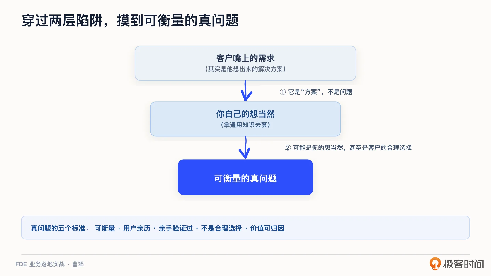
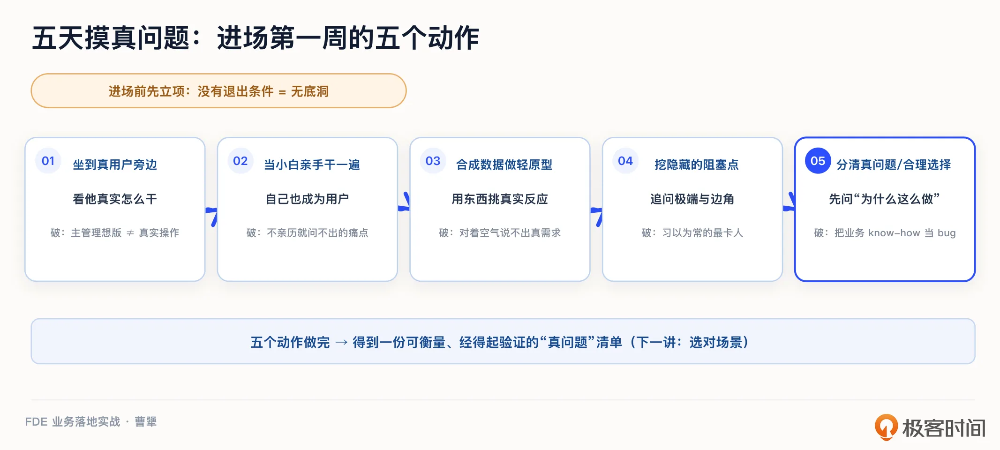
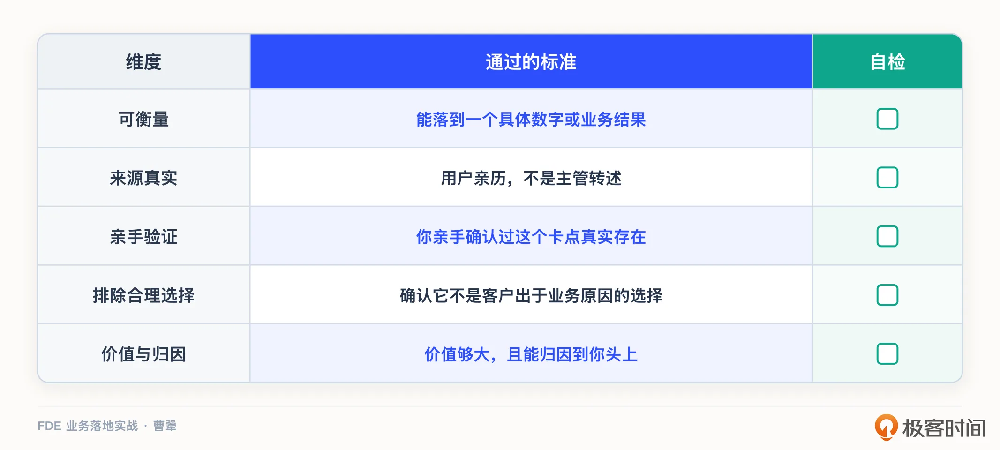
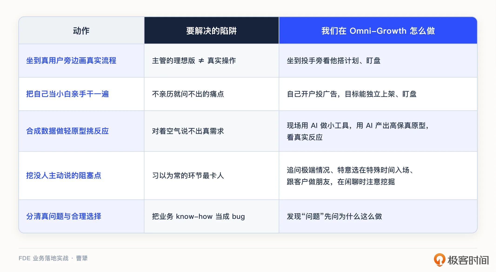

# 05｜进场第一战：如何用五天摸清客户的“真问题”？
你好，我是曹犟。

从这一讲开始，我们正式进入实战。接下来的十几讲，我会带你完整走一遍 FDE 项目从进场、验证、施工到沉淀、变现的全链路。今天是第一站，也是最容易被低估的一站：进场。还有一条贯穿整个实战环节这十几讲的暗线，在这里先提一下：在全链路的每一个环节，我都会从我自己的实践经验出发，介绍一下在这一环节，AI 能帮你做到哪儿、哪些判断还需要人自己来做。这门课在人与 AI 的分工上始终是同一条原则：AI 负责做出来，人负责判断做得好不好。

先讲一个我自己正在干的事。

我现在带着一个三人小团队，在做一款帮助广告投放优化师提升效率的 AI 工具。投放优化师，俗称“投手”，他们的工作本质上就是基于数据与审美，选择合适的广告素材，调整出价等策略，从而让广告取得最好的投入产出比，也就是 ROI。

我们三个人都是做了很多年私域数据分析和营销的老程序员，对于私域营销、数据分析，都有比较多的经验。但是，我们毕竟没有投过广告，没有在每年几百万美元的真金白银预算下来真正地优化广告的效果。所以，要把这个工具做好，我们就必须真正理解投手的工作，理解他们工作上的痛点到底在哪儿。

按照以往的做法，这件事看起来很简单：找几个投手，访谈一下，问他们想要什么功能，做好记录，回去开发。

但我们没这么干，我们反而做了一件看起来很笨的事：买好机票，出差，到客户公司去，跟他们一起办公，把自己当成刚毕业的实习生，从最基础的业务开始学起，从最基础的活开始干起。当然，在去之前，我们已经花了十几个小时，在 AI 的协助下，对于这个领域的通用知识，有了系统性的学习，不然，到了客户现场，连做实习生都不合格。

为什么要用这种笨办法？

因为在做了十几年 To B，踩过太多坑之后，我越来越确信一件事： **进场第一战，最大的陷阱，就是把客户“嘴上说的需求”当成“真问题”。** 在这一讲，我就想讲透一件事：在进场的头几天，你该怎么越过那些表面的需求，找到那个真正值得做、而且价值真正可衡量的真问题。

### 为什么“嘴上的需求”常常不准

你刚到客户现场，客户一定会热情地告诉你一堆需求，比如“我想要一个能自动生成报表的功能”，或者“你帮我把这个批量上架的 SOP 变成一个自动化程序”。

这些话能信吗？只能信一半。

因为客户告诉你的，往往不是问题本身，而只是他自己想出来的解决方案。他想要一个自动生成的报表，背后真正的痛点，可能是要跨越不同账号不同广告系列横向对比数据。你照着给他做一个自动报表，也不一定能解决这个横向看数据的痛点。

这是第一层陷阱：把客户的“解决方案”当成“问题”。

第二层陷阱更隐蔽，也是我这次驻场时真正体会到的。

我们在客户现场，用 AI 连接上 MCP 帮他们分析数据，很快就发现了一些“看起来明显不对”的地方。我们一开始很兴奋，觉得 AI 的效果真不错。但深入一问才发现，有些的确是真问题，有些我们眼里的“问题”，其实只是客户基于实际业务做出的有意选择。

举个简化的例子，你看到某个投放计划的出价明显偏高，按通用逻辑这是浪费，但客户可能是在专门圈一个特定时段的特定人群，背后有他自己一整套生意上的考量。

识别客户业务的 know-how 和通用知识之间的差异，恰恰是 FDE 最大的价值所在，也是最容易翻车的地方。你要是仗着自己懂技术、懂通用方法，上来就把人家的合理选择当错误改掉，那不仅没解决问题，还会失去信任。

所以，进场第一战的目标，就是穿过这两层陷阱： **既要越过客户嘴上的解决方案，也绕开你自己的想当然，摸到那个真实的、可衡量的问题。**

下面我把这套方法具体展开：先讲进场前要过的两道关，再具体介绍进场第一周的五个动作。

### 进场之前：先判断这一单该不该接

很多人一接到项目就冲进去了，这是大忌。

在进场之前，你至少要把四个问题问清楚：这件事在客户那边，有没有一个真正说了算的负责人？有没有真实的预算？用什么指标衡量成功？还有最关键的一条，这个项目有没有明确的退出条件？

要特别强调最后这条。一个没有退出条件的项目，不是项目，而是一份无底洞式的支持合同。它会把你的人一直拖在里面，做着做着就变成了我们上一讲说的那种“高级外包”，越做越重，永远抽不出身。

我在神策见过很多这样的例子：一个项目当初没把验收标准和边界谈死，客户的需求像滚雪球一样越滚越大，项目组几个人被钉在一个客户身上大半年。账面上看是签了单，实际上则是在亏钱，还把人都耗住了，腾不出手去服务新客户。这种坑，往往在进场之前那个没谈透的 SOP 里，就已经埋下了。

所以， **进场之前要先立项，要把“什么算成功、什么时候算结束”确定清楚**。这一步看着不起眼，却决定了你后面是在做产品探索，还是在填一个需求的无底洞。

立项关过了，还有第二道关。这道关看的不是项目，而是客户这个组织本身：这家客户，能不能接得住 FDE 的工作方式？第 2 讲结尾我说过一句话，外包的客户不用改变自己，FDE 的客户必须改变自己。而具体落到进场之前，就是再问四个问题：

**第一问，客户组织里，有没有一个真正有分量、愿意带你进业务会议的人？** 我们能在客户现场坐到投手旁边，是因为客户老板亲自安排了人来配合。没有这样一个人，你连真实的工作流都看不到。

**第二问，真实的数据和权限给不给？** 哪怕从只读开始。给不给权限，最能看出客户愿不愿意为这种合作方式而改变自己。至于权限怎么从只读一步步升级，第 12 讲时会专门展开。

**第三问，反馈周期有多长？** 你的建议、你的 demo 给出去，多久能知道对错？FDE 的核心优势在于迭代速度，而迭代的前提是反馈。如果客户组织里，任何反馈都要过几层审批，一个建议发出去一个月还不知道对错，FDE 的迭代优势就直接归零了。说得直白一点，做完拿不到反馈，就是白做。

**第四问，谁为探索买单？** 进场头几周，你的产出可能只是“把客户的业务学明白了”。这段时间的价值，客户认不认？合同能不能容忍这种前期的不确定性？这个问题跟定价模式有关，第 15 讲讲效果付费时会展开。

这四问和立项四问的分工很清楚：立项四问筛选的是项目值不值得做；这四问筛选的是客户组织接不接得住 FDE 的工作方式。四问里只要有明确否定的答案，就别硬进场。对于那些接不住 FDE 的客户，用传统交付的方式去服务，对双方可能反而都更好。

### 五天摸真问题：进场第一周的五个动作

立项确定了，团队再进场。

第一周，我建议你集中做五个动作。我把它叫作“五天摸透真问题”。当然，不是说必须卡死五天，而是说，进场最初这几天的质量，决定了整个项目的走向。

这套动作也不是我一个人的发明。Daniel Vaughan 写过一本 FDE 实战手册，把 FDE 的工作拆成四部分：角色定位、方法、生产部署，以及跟人打交道的软实力。

在“方法”这一部分，他专门提出了“五天发现法”，英文是 Five-Day Discovery Protocol。它讲的就是进场头几天如何系统地做调研、摸清真问题，最后以“做还是不做”这样一个决策收口。

这套五天发现法和我这节课讲的五个动作思路很接近：都很重视进场的第一周，也都要求在一周结束时拿出一个有证据、可执行的判断，只是具体拆解办法不同。所以我说的“五天”，并不是随口起的名字，而是同行早就有类似的实践。我把 Vaughan 的思路和自己在客户现场的实际经验结合起来，整理成了你能直接照着做的五个动作。

**动作一：坐到真正的用户旁边去，画出真实的流程图。**

特别要注意，这一步是指真正的用户，不是他的主管。主管给你描述的流程，是组织架构图上的理想版本；真正干活的人，手上跑的是另一套。这两套经常对不上。

我们在客户那边驻场的时候，客户的老板指定了一个非常聪明、非常有想法的投手主管跟我们配合。但是让我们印象很深的是，客户老板多次私底下或者公开地跟我们说，你们不能仅仅参考主管的想法，更多还是要看真实干活的投手的实际经验。

所以在客户现场，我们除了定期跟投手的主管做非常深入的沟通，更重要的是直接坐到投手旁边，看他怎么操作 Meta 的广告账户，怎么创建广告，怎么批量测品，怎么每天盯盘。我自己总结下来，在客户现场亲眼看一遍客户的真实工作流程，比坐在办公室听一百场汇报都管用。

说一个真实的细节：虽然我们事先已经系统性学习了 Google、Meta 广告的基础知识，但真坐到投手旁边时，最开始还是常常听不懂对方在说什么。一方面是各种业务黑话和话语体系不同，另一方面则是思维方式根本不在一个频道上。这种“听不懂”本身就是最强的信号，它在告诉你，真实的业务和你以为的业务之间，到底隔了多远。把客户的工作流程老老实实画出来，一处一处对齐弄清楚，直到真正听懂，你才算是和客户站到了同一条起跑线上。

**动作二：把自己当小白，亲手把这活干一遍。**

光看还不够，你得自己上手。最理想的状态，是你自己就成为那个用户。

我常拿 Claude Code 举例子。它为什么这么好用？本质上是因为，它是一群资深程序员写给程序员自己用的工具。开发者就是用户，用户就是开发者，中间几乎没有信息损耗。做投手工具，也是一个道理：想做出真正顺手的工具，最好我们自己先成为专业的投手。

所以我们给自己定了三个硬目标：能跟投手顺畅地聊专业话题；能在他们真实、复杂的业务场景下，完整地做一次广告上架；能每天独立完成盯盘。为了达到这几个目标，我们自己开通了 Google、Meta 的广告账户，自己学课程、自己投钱测试。

为什么要做到这个程度？因为你只有亲手干过，才知道哪一步是真的卡点。 **很多痛点，是你不亲手做光靠问永远也问不出来的。**

OpenAI 的 FDE 团队有一个被反复引用的做法，很能说明问题：他们去服务农业公司 John Deere 时，不是坐在会议室里听人转述，而是直接下到农场，跟农户一起干活，亲眼看到现实里的种种约束。这就是“亲手干活”的典型表现。

这里还有一个特别容易被技术人忽略的点： **姿态**。我们接触的投手都很聪明，也很年轻，跟我们三个老程序员差了快一辈人。但你越是资历老，越要把自己放低，保持谦虚、耐心、诚恳，真心拜他们为师，跟他们交上朋友。你只有真正尊重对方、让对方信任你，对方才会把那些最真实的、甚至有点不好意思说给领导听的细节说给你听。同理心不是一句口号，它需要你保持空杯心态、蹲下来、一点一点做出来。

当然，这个过程一点都不轻松。前 Palantir 的 FDE 曾经说过，这份工作通常每周要去客户现场办公三到四天，意味着要频繁出差。我自己这段时间也是如此。这活儿一点也不性感，但它是价值的根源。

我自己的感受是，这就像爬山。远远看过去，觉得很容易；真走进去，才发现这山也太难爬了，到处都是听不懂的黑话；硬着头皮再往前上爬一段，忽然又拨云见日，发现山顶的风景真是太美了。当然，也许再走一步，又会遇到新的困难。但不管怎么样，这个过程中，每一步都很踏实，没有信息损耗，都在向着正确的道路前进。

**动作三：用合成数据搭个轻原型，去“挑逗”真实反应。**

人对着空气是说不出真需求的，但人对着一个具体的东西，意见就会冒出来。

所以，你可以用一批合成数据，在 AI 的协助下，非常快速地搭一个能跑起来的轻原型，哪怕很粗糙，也先扔到用户面前。他一看就会说：“这个不对”“这个我们从来不这么干”“你这少了一步”。这些脱口而出的反应，比你正儿八经搞十个调查问卷，挖出来的真东西要多得多。

我们在现场就是这么干的。 **一边学，一边用 AI 帮客户做点实事，一边做好积累，准备构建 demo。** 比如，我们用 AI 做数据分析，帮客户发现了一个已经存在很久但一直没被注意到的投放策略问题；又比如，用 AI 做小工具，把投手需要人工反复操作的环节自动化掉；我们在一周驻场之后，回到公司以后的第一步，就是总结、积累，基于这一周得到的业务认知，用 Claude Code 快速在周末搭出一个可交互的 demo，然后第二周驻场的时候，直接就可以带着 demo 过去了。

还有一件事情，AI 帮了大忙，值得单独说一下。在客户那里驻场一周，我们手里会攒下一大堆东西：客户沟通的录音（在客户允许的情况下）、自己记录的几十页的访谈记录、我们自己每天晚上的讨论记录，还有跟投手在饭桌上、电梯里聊来的碎片信息。

过去要把这些整理成能用的认知，可能得熬好几个晚上。现在回到公司，第一件事就是把这一周的录音和所有的文字记录都交给 AI，让它在同一个项目的上下文下，做文档的校对和留档，并且帮我们把沟通中反复出现的痛点、卡点提炼出来。但提炼完不等于有了结论：哪条是真痛点，哪条只是某个人当天的情绪宣泄，还需要我们自己一条条来判断。在这个分工下，AI 负责把一周的各种信息压成几条具体的线索，人则负责判断这几条里哪些真正值得下手。

**用 AI 帮客户解决具体问题，给客户直接看可交互的 demo**，这些效果远比给客户看一个产品设计方案或者说 PPT 要直接。一方面，对方会对着真实存在的东西给出真实反应，你能迅速判断方向对不对。另一方面，这种当场解决真问题的小动作，最能换来信任。客户会觉得你是真懂行、真能帮上忙的人，而不是又一个来调研、开会，来麻烦他们的人。这些具体问题往往也特别适合产品化，我们留到后面相关的课程再细说。

**动作四：专门去挖那些“没人主动说”的阻塞点。**

业务上最会阻塞的环节，往往没人会主动告诉你，因为大家都习以为常了。

所以，在客户现场，你要主动问一些刁钻的问题：上一次出大问题是什么时候？有没有那种每隔一阵就来一次的奇葩情况，特别烦但又躲不掉？月底、大促这种极端情况下，流程会变成什么样？

还有一个更好用的问法：别问他“你们一般怎么做”，问他“ **上周二下午三点，你手头上在忙什么**”。问一般怎么做，你得到的是一份被整理过的标准流程；问上周二下午三点，你得到的才是真实发生的事实。这个问法在业内有一个专门的说法，叫“奇怪的星期二”，指的就是那种没人写进文档、每隔一阵来一次、操作员花二十来分钟摆平、却从不在正式场合提起的怪情况。

讲一个我们真实碰到过的 case。有一次，投手给我们逐屏讲广告排期怎么设置，讲到一半顺口带出一句：排期里设的开始时间是不准的，设了下午六点，广告常常要晚一两个小时才能推出去，偶尔要拖到第二天早上。所以她的做法是，想六点开跑，就提前排到四点。我们在现场的 FDE 当时下意识接了一句：那你要想精确控制开始投放的时间，岂不是很困难？她的回答是：不会，晚一两个小时，提前排掉就行了；真拖到第二天早上才推出去的情况，比较少见。

我们可以仔细品一品这个回答。一件每次都在发生、每次都要她自己手动操作留出缓冲的事，在她嘴里就是一句轻描淡写的“不会”，是不值得专门提一句的东西。她没有抱怨过，也没写进任何一份 SOP，这一条是她逐屏演示操作的时候顺口说出来的。你要是坐在会议室里问一句“你们排期一般怎么排”，她答的一定是标准流程，绝不会提这两个小时。这就是“奇怪的星期二”最典型的样子：它奇怪不在事情本身，而在于 **它明明反复发生，却没有在任何正式材料里留下痕迹**。

这些边角料里，藏着真正有价值的痛点。一个能跑通日常、却扛不住“奇怪的星期二”的方案，是没法上生产的。

当然，这些阻塞点有时候光靠在办公室问也是问不出来的，我们除了要在一些关键节点去客户现场用自己的眼睛观察以外，也需要能够跟具体做事的人交上朋友，可能有些在办公室里面说不出口的问题，在饭桌上或者电梯里的闲聊，就很容易聊到。

**动作五：分清楚“真问题”和“客户的合理选择”。**

这是我在前面铺垫了很久的一个点，也是最考验功力的一个动作。

就像我前面举的那个被 AI 指出来投放出价高的“问题”，最终被发现其实是客户特有的做法一样。当你发现一个“看起来不对”的地方，先别急着判定它是问题，更别急着动手改。而是 **先老老实实问一句：你们为什么这么做？**

很多时候，答案会让你意识到，这不是 bug，而是人家在业务实践中积累的 know-how。如果你把它当问题改掉，那才是真正的问题。

能明确地分清这两者，区分出哪些是真正待解决的问题、哪些只是你尚未理解的业务智慧，你才算真正摸到了这家客户的门道。这也正是 FDE 区别于一个空降“技术高手”的地方，也是期望 FDE 在客户现场拿回来的最重要业务认知。

OpenAI 在摩根士丹利的项目中，也是这么做的。他们没有一上来就急着上系统，急着去改客户看起来是“问题”的问题。而是花了大量时间去搞懂理财顾问到底为什么要这么用研报、这种看起来不合理的用法对他们到底意味着什么。技术开发其实只花了几周，但他们在理解需求、分辨问题、打磨标准、建立信任上花了几个月。最后，这个系统在理财顾问中的采用率做到了 98%。先跟客户成为朋友，摸透客户的真实情况，再动手，这是值得的。

### 一张清单：你摸到的，到底是不是“真问题”

在客户现场，第一周，这五个动作做完，你手里会攒下一堆“问题”。怎么判断哪些是真问题，值得往下做呢？我给你这样五个判断标准，供你参考：

第一，它可衡量吗？能不能落到一个具体的数字或者业务结果上？落不到的，先放一放。

第二，它是用户亲历的问题，还是主管转述的问题？转述的，打个问号。

第三，这个问题，你亲手验证过它真实存在吗？没验证过的，先存疑。

第四，你排除了“它其实是客户合理选择”的可能吗？没排除的，回去再问一句为什么。

第五，解决它，价值够大，而且能归因到你头上吗？这一条，是我们下一讲“选对场景”要专门展开的。

我把这五个问题，整理成如下这张表，你可以照着逐条打勾：

能同时通过这五关的问题，才是值得你投入的真问题。

### 课程总结

这一讲，我们讲的是进场第一战，核心就一句话：别把“嘴上的需求”当“真问题”。

进场之前，先过一道立项关，把成功标准和退出条件谈清楚，别一头扎进无底洞；再过一道客户关，用四个问题确认这家客户接得住 FDE 的工作方式：有人带你进业务会议，数据和权限给得出来，反馈周期足够短，有人为探索买单。

进场之后，第一周的五天要做五个动作，我帮你整理成一张表：

如果你想转型 FDE，这套动作可以直接带进现场，避免被一堆表面需求牵着走。

对交付和实施同学，它能帮你从“客户要啥我做啥”，升级为“帮客户找到他自己都没说清的真问题”。这也是专业价值真正拉开差距的地方。

To B 创业者和产品经理更要注意：进场摸需求的质量，直接决定了后续所有投入的回报，这一步省不得。

进场摸清了真问题，下一步就是从一堆真问题里，选出那个最值得做、最能跑出效果、又能算到你头上的高价值场景。下一讲，我们就来讲如何“选对场景”。

### 思考题

留两个问题，欢迎你在留言区聊聊。

第一，回想你经历过的一个项目，客户当初“嘴上说的需求”和后来发现的“真问题”，是一回事吗？如果不是，是哪个动作、哪一刻让你发现了差别？

第二，“分清真问题和客户的合理选择”，这一条你怎么看？你有没有遇到过自己以为抓到了一个大 bug，结果发现是人家深思熟虑的业务选择？

期待你在留言区分享你的思考。如果这节课对你有启发，也推荐你把它分享给身边更多朋友。