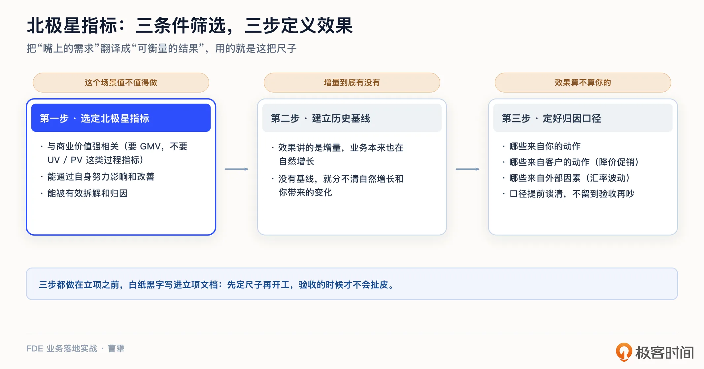
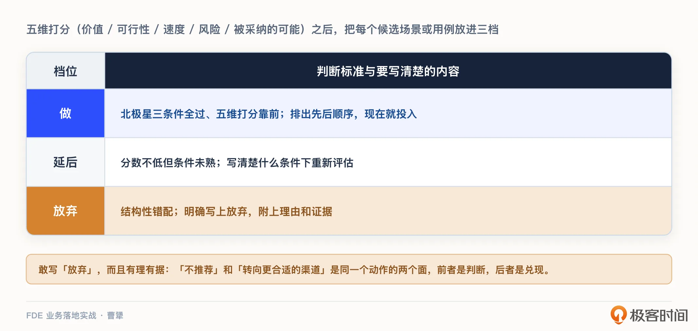
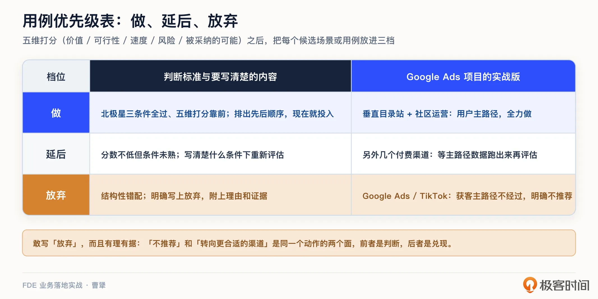
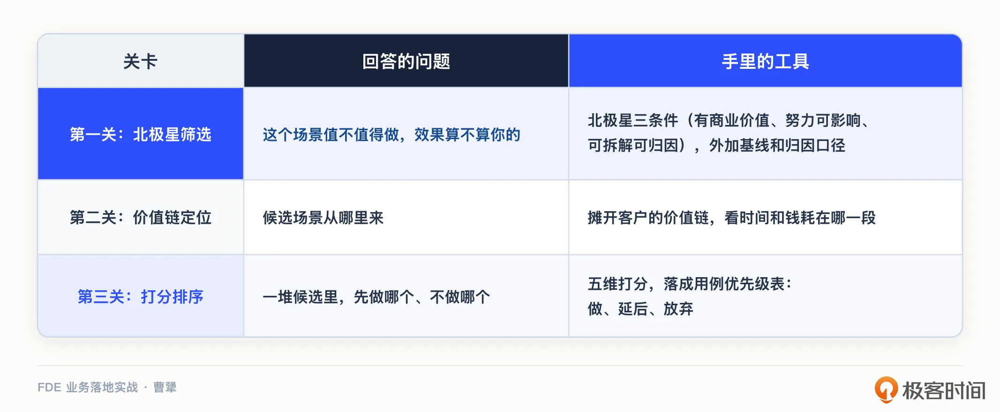

# 06｜选对场景：怎么把“嘴上的需求”翻译成“可衡量的结果”？
你好，我是曹犟。

上一讲我们讲完了进场第一战：怎么通过五个具体动作，拿到客户的真问题清单。找到好问题固然重要，但清单毕竟不等于答案。FDE 的资源永远有限，一两个人、几周时间，你只能先选一个场景开工。选对了，第一战就能打出信任；选错了，后面做得再辛苦，也难以证明价值，也没有再选一次场景的机会了。

这一讲我们就来解决这个问题：怎么从一堆候选场景里，选出那个能跑出效果、又能归因到我们头上的高价值场景，再把它翻译成一个可衡量的结果。

先从一件我自己刚经历的事说起。

还是之前提到过的那个 Omni-Growth 三人小团队，今年 3 月，一家做海外业务的公司找到我们，希望我们帮他们开拓 Google Ads 这个增长渠道。这家客户的产品已经有一定的规模，在 Meta Ads 等渠道上跑出了足够的 ROI，这次是明确带着预算来的，连投放账号的操作权限都愿意完全交给我们。

按说这是一个再顺理成章不过的项目：客户有钱、有意愿、有明确的诉求，方向也符合我们的规划；看似接下来就该是选关键词、做落地页、配预算，在给客户交付业务结果的同时打磨我们的产品，非常典型的 FDE 做法。我们一开始也确实是按这个思路在准备的。

但最后，我们交付给客户的核心建议其实只有一句话：建议在 Google Ads 上不投。

一个带着预算来的客户，我们劝他别花这笔钱，这听起来很反常。但我个人认为，这恰恰是“选对场景”这门功课最典型的一次考试。这一讲学完，你就能明白这个判断是怎么一步一步做出来的，以及我们为什么敢把它说出口。

## 为什么不一次把系统建起来？

在讲怎么选之前，我想先退一步，说清楚一件更根本的事：FDE 为什么非要一个场景一个场景地打穿，而不是把整个系统一次建好。

传统 To B 软件的做法，你可能很熟悉。先花几个月甚至一两年，把需求调研清楚，把系统整体设计、开发、测试、部署完，让客户在沙盒系统上验收。再挑一个上线日，老系统停掉，新系统全面接管，一次非常典型的从 0 到 1 的切换，切换之前，客户是没有得到业务效果的。

这套打法，在流程稳定、需求明确的年代是成立的。但到了 AI 时代，有几个地方不成立了。

第一， **AI 的效果是试出来的，不是设计出来的**。一个场景到底能不能跑出价值，往往要真跑起来、拿真实数据在真实场景上验证过才知道，没法在需求文档和沙盒系统上论证清楚。长周期的整体设计，等于憋了个大招，把一堆没验证的假设，一次性押上牌桌。

第二， **AI 项目本来就九死一生**。 [第 3 讲](https://time.geekbang.org/column/article/1001077?utm_campaign=geektime_search&utm_content=geektime_search&utm_medium=geektime_search&utm_source=geektime_search&utm_term=geektime_search "xxx") 我们聊过，95% 的 AI 项目零回报。在这样的成功率下，还赌一个一两年才见分晓的大系统，风险大得不合理。

第三， **AI 和客户的业务，都在快速变化中**。基模的能力，每三到六个月都有一个巨大的进步；而在这个时代，积极拥抱 AI 的客户，它的组织和业务也必定在快速变化与调整。两头的快速变化碰到一起，如果一个系统真要做一两年，恐怕做到一半就落伍了。

所以 FDE 的做法是反过来的：不追求一次建成，而是先挑一个具体的场景，几周之内把它从头到尾打穿，让客户先看到一个真实、能衡量的结果。这个场景跑通了，信任也就积攒下来了，再用它去撬动下一个场景。系统不是坐在办公室设计出来的，是从一个场景一个场景中长出来的。

这也是为什么，选对第一个场景，几乎决定了整场战役的胜负。你只有一次用最小成本撬动最大信任的机会。接下来，我们就看怎么把第一个场景选准。

## 选场景的本质，是一次翻译

我之前表达过一个观点：客户嘴上说的需求，和他真正想要的结果，往往不是一回事。

上一讲我们讲过，怎么越过嘴上的需求，摸到真问题。这一讲则要继续，怎么把真问题变成一个可衡量的结果。

所谓选场景，其实就是做一次翻译：把“客户想要什么”，翻译成“业务上会发生什么变化，这个变化用哪个数字来衡量”。

上一讲提到的 Daniel Vaughan，在他那本 FDE 手册里把这件事叫作“翻译问题”（translation problem）。客户的原始输入，常常是“我们想要 AI”这样模糊的目标，而 FDE 要做的，则是把它翻译成可测量、可验收的结果陈述。

为什么这次翻译这么重要？你可以回想一下 [第 4 讲](https://time.geekbang.org/column/article/1001117?utm_campaign=geektime_search&utm_content=geektime_search&utm_medium=geektime_search&utm_source=geektime_search&utm_term=geektime_search "xxx") 说过的验收标准三级跃迁：中国客户的验收标准，已经从“装好系统”走到了“跑出效果”。效果是要拿数字说话的。如果你一开始选的场景就无法衡量、无法归因，那么项目做到最后，你就算真创造了价值，也拿不出证据。客户觉得没效果，你觉得很委屈，这个僵局在立项那一天就已经注定了。

拿这一讲开头我们自己的例子来说，客户说“帮我投 Google Ads”，这只是一个动作；但如果把它翻译成结果，则是“以可持续可盈利的 ROI，打开一个新的增长渠道”。动作永远可以照做，把钱花出去一点都不难；但结果成不成立，则需要明确的证据。

先把这层翻译做了，后面所有的判断才有了地基。

## 第一关：北极星三条件

这层翻译工作的第一步，是给候选场景找到它的北极星指标。所谓北极星指标，就是那个能直接反映业务成功的核心指标，像北极星一样，要让所有动作都朝着它对齐，比如电商客户的 GMV 指标。注意，是 GMV，也就是商品交易总额，而不是 UV、PV 这些中间过程指标。

北极星指标这个概念不是我发明的，在增长领域已经用了很多年，神策在过去十一年做数据分析和数据平台项目的交付时，也一直在使用这个概念。但在做按效果交付这件事上，我总结过三个条件，一个指标必须要同时满足这三个条件，才能当北极星。

第一， **与商业价值强相关。** 指标涨了，客户的生意要真的变好。对于一个电商来说，UV、PV 涨了生意未必好，GMV 涨了才是真的好。

第二， **能够通过自身努力去影响和改善。** 这一条说的是，这个指标的涨跌，要真的是你的动作所能干预的。我曾经碰到过一个这样的案例，一家做线下生鲜 O2O 的客户，一开始想把北极星指标定成门店的整体销售额。但生鲜这门生意，门店销售额的大头，是由位置、天气、季节这些外部因素决定的，我们只是帮客户做线上运营，这部分的销售额占门店的整体销售额非常有限。我们做得再好，影响都是微乎其微的，甚至还不如日常的波动。所以，门店的整体销售额显然不是一个好的北极星指标，选择这个指标，会完全失去后续迭代的基础。

第三， **能够被有效拆解和归因。** 注意，它和第二条不是一回事：第二条说的是，效果做不做得出来；这一条说的是，效果做出来之后，账能不能算清。指标涨了，你要能说清楚：涨的这部分里，哪些来自你的动作；哪些来自客户自己的动作，比如降价促销；哪些来自外部因素，比如汇率波动。如果说不清楚，那么效果就算不到你头上。

假设你在帮一个旅游 App 做增长，把北极星定成总的预订间夜量。你优化了预订流程，间夜量也确实涨了，但这期间正好赶上暑假。涨的这部分里，有多少是你的优化带来的，有多少是旺季本来就会涨的？这笔账算不清，客户就不会为这部分效果付钱。而要把账算清，指标本身就要能拆得开。把间夜量拆成流量和预订转化率，你的优化效果就落在转化率上，暑假撑大的只是流量，两笔账就分得清清楚楚。

我们上一讲那张真问题自检清单的最后一条，价值够大、能归因到你头上，说的就是这件事。只不过这一讲我们把它展开成了三个条件。

而这三个条件里面，最容易被忽略和实际操作起来最难的是第三条。所以，在选定指标之后，还有两步马上要做的事情。先是 **基于历史数据建立基线**，效果讲的是增量，客户的业务本来也在自然增长，没有基线，你就分不清哪些是自然增长、哪些是你带来的变化。其次是 **把归因的口径谈清楚**，白纸黑字写进立项文档。这两步做在前面，验收的时候就不会扯皮。

顺便说一句，FDE 类项目的价值门槛，可以定得很高。之前我们提到的摩根士丹利项目，OpenAI 的 FDE 团队开始项目前就有一条信条：只做价值至少在数千万美元量级的问题，大的能到十亿美元量级。当然，不是每个客户都有十亿美元量级的问题，尺度可以缩放。但有商业价值、努力可影响、可拆解可归因这三条，我觉得在任何尺度的项目上都不能少。

这三个条件的用处还不止于选场景，到第 15 讲谈效果定价的时候，你会看到，定价谈判用的还是同一把尺子。另外，这里所说的“可衡量”，指的是业务层面的效果；AI 系统本身的好坏怎么定义、怎么验收，是另一个专门的话题，我们留到第 11 讲展开。

## 第二关：到价值链上找场景

有了尺子，去哪里找值得量的场景呢？

很多团队的做法是开需求收集会：各部门报需求，会上通常谁的嗓门大、谁的职级高，就先做谁的。而这样选出来的场景，往往过不了北极星那三条。

当然，我不是说需求不用收集。访谈、开会都很有用，它们提供的是候选项。问题在于，只靠收集，你分不出轻重。更好的做法，是把客户的整条价值链摊开，顺着整个链条，看时间和钱到底耗在哪里。

OpenAI 曾分享过一个他们在半导体行业的案例，我觉得挺能说明问题。他们的 FDE 进场之后，没有急着收集各部门的 AI 需求，而是先把这家制造商的整条价值链画了出来，然后一段一段地看。结果他们发现，这家企业的工程师们有 70% 到 80% 的时间，花在修 bug 上。

于是 FDE 团队把“缺陷验证”定为最高价值的目标场景，围绕它交付了包括 debug 排查 Agent 在内的十个具体用例。按他们自己分享的口径，当前效率已经提升了 20% 到 30%，而下一步的目标是 50%。

这个案例里最值得我们学习的，不是那个 Agent 怎么开发，而是这种找场景的方式。工程师 70% 到 80% 的时间耗费在修 bug 上，这个事实一旦明确，场景自己就浮现出来了。我们再对照上面提到的北极星三条件：商业价值足够大，因为它耗费的是最贵的一群人的最大头时间；努力可影响，因为修 bug 的流程就在客户自己手里，修同样的 bug 所耗费的时间不受其它外部因素干预；可拆解可归因，因为修 bug 的步骤是明确可以拆解的，消耗的时间也是可以度量的，并且也基本不会有同时并行的其它项目在解决这个问题，即使有，也很容易排除掉。很明显，北极星三条件全部满足。

而要做到这一步，能够拆开客户的价值链条，从中找到关键性的场景，恰恰依赖上一讲的功课。你只有真正坐到最终用户的旁边跟他们一起干活、有足够的同理心理解他们的工作和痛苦，才画得出这条价值链，才能知道时间和钱真正耗在哪一段。从这个角度来说，进场五个动作和到价值链上选场景，本质上是同一件事的前后两半。

## 第三关：打分、排序、取舍

价值链摊开之后，从中可能能找到五六个候选场景，都能满足北极星三条件。那这个时候，我们就需要进入第三关：打分、排序、取舍。

上一讲我介绍过 Vaughan 的五天发现法，这个方法的第三天，做的就是这件事：给候选用例逐个打分。他给的维度是五个：价值、可行性、速度、风险，以及被采纳的可能性。注意他这个安排的顺序：打分放在第三天，前两天是摸全景、走流程，后两天才是做原型、做取舍。先拿到一手证据，再打分、做取舍；取舍完，才值得为入选的场景投入原型。这个顺序是符合实际做事的逻辑的。

他给出的这五个维度中，前两个维度很好理解，不再展开。我们主要聊聊剩下的速度、风险、被采纳的可行性。

按我自己的理解，速度指的是多快能见到第一个结果，它直接关系到信任的建立。风险则包括技术风险和数据风险，它对于整个项目的成功率有直接影响。而最容易被技术人忽略的是最后一条，被采纳的可能性：一个方案再好，如果一线用户不愿意采用，或者动了哪位领导的奶酪而推不下去，这个方案真正的得分就要大打折扣。

打完分后，把所有候选场景放进一张表里，按照分数分成三档：做、延后、放弃。现在就做的，排出先后顺序；暂时不做的，写清楚什么条件下重新启动评估；不该做的，明确写上放弃，以及放弃的理由。

这里顺带把两个概念交代清楚。前面我们一直说场景，这张表我却叫它用例优先级表。这两个词，说的是同一件事的两个粒度：场景偏问题，比如缺陷验证；用例偏落地的具体应用，比如 debug 排查 Agent。一个场景做深了，往往会长出一串用例，OpenAI 那个案例就是这样，一个场景，十个用例。这张表你按照哪个粒度排都行，排的逻辑是一样的。所以我还是沿用 Vaughan 的叫法，把它叫作用例优先级表。它就是这一讲最重要的交付物。因为它把“我们为什么先做这个、不做那个”，从一场会议室里的口水仗，变成了一份有证据可追溯的文档。

现在，可以回头继续说回开头那个 Google Ads 的故事了。我们当时交付的，本质上就是这张表。

这张表里，客户最开始只关心一行，就是 Google Ads 这个他们原本圈定的渠道：它到底该进“做”，还是进“放弃”。我们没有直接开干，也没有拍脑袋说不行，而是让 Agent 做系统性的调研，一层一层往下挖证据，给这一行打分。

**第一层，看搜索量**。候选关键词的月搜索量，比预期低了一到两个数量级。

**第二层，看搜索结果页**。第一屏几乎被榜单、测评、社区帖和头部品牌占满，新品牌硬挤进去，出价会被抬到 ROI 撑不住的位置。

**第三层，看用户真实的发现路径**。这个业态的目标用户，是在社区和 KOL 的内容里发现产品，再到垂直工具目录站里交叉对比，然后直接访问试用。Google 在这条主路径里，几乎没有角色。

这三层证据合起来，指向同一个结论：这个业态的获客逻辑是发现型、推荐型的，而 Google Ads 的核心模型是搜索意图广告，前提是用户已经有明确的搜索意图。用户的发现路径根本不经过 Google 搜索，这个渠道的核心假设就不成立。这不是关键词选得不好，也不是文案写得不够好，是结构性的错配。有两个脱敏后的数字可以佐证：这个业态头部竞品的付费搜索流量占比，都在 5% 以下；用户购买决策前的信息收集，超过 60% 发生在社区帖和垂直工具目录站，而不是搜索引擎。

但是，正如前面所说，客户要投 Google Ads，本质仅仅是一个动作，他真正要的是一个新的增长渠道。因此，在发现 Google Ads 不应该做以后，我们按照相同的思路，让 Agent 对于其它一些候选渠道，也做了深入的调研和挖掘。

最后我们交付给客户的，是一份完整的渠道决策矩阵。Google Ads 和 TikTok，明确写上不推荐，各自附上理由；垂直目录站和社区运营，是现在就该全力做的主路径；另外几个付费渠道，标成延后，写清楚等主路径的数据跑出来再评估。你看，这就是做、延后、放弃那张表的实战版本。只不过在这个项目里，行的粒度是渠道，一个渠道，就是一个候选用例。

## 人敢写“放弃”，才更接近上限

从这个案例，我们还能看清在 FDE 的这个环节，人和 AI 应该如何分工、如何协作。把背景、竞品格局、渠道数据调研得又快又全，是 Agent 的强项。但到底哪个场景可归因、哪个值得第一个被选择，AI 只能提供数据，具体的决策还得 FDE 自己来定。

而人要做的这些决策里，最难下笔的就是“放弃”。上面这个表里有一个细节挺有意思：真正花大力气的，其实不是“不推荐”那几行，而是“现在就做”和“延后”那些行。每个垂直目录站的提交字段、审核周期、内容要求，差异都很大；社区运营的节奏和归因方式，也和广告平台完全不同。换句话说，“建议不投 Google Ads”和“建议把预算转向更合适的渠道”，是同一个动作的两种表述：前者是判断，后者是兑现。放弃某个场景的同时，你要给出更好的替代，这样你给的“不推荐”才真正有分量。

当然，我们不是在否定客户的产品，更不是在否定他的业务。这是“这位客户乘以这个渠道”层面的判断，换一个客户，或者换一个渠道，结论可能完全不同。放弃某个场景，和看衰某个客户，是两回事。说到底，每个客户都觉得自己特殊、需求千变万化。也正因如此，真正的 AI 产品，可能需要在呈现层和策略层尝试走千人千面地生成的路径，那是第 13 讲的话题，这里先不展开。

这个案例对我自己的触动很大，至少在我们自己的实践里：会投广告，只是下限；知道什么不能投，才更接近上限。放到 FDE 的语境里，这句话也可以推广一下： **会做需求，只是下限；知道什么需求不该做，才更接近上限。** 敢在优先级表上写下“放弃”两个字，而且写得有理有据，客户反而会更信任你。因为他知道，你不是为了做而做，你推荐“做”的那些场景，是用同一套证据标准筛出来的。

更进一步说，敢不敢说“不”，很多时候不取决于勇气，而取决于你的商业位置。一家只做 Google Ads 代投的服务商，要告诉客户“这个渠道别投”，几乎等于告诉客户“你不用找我了”。这不是道德问题，是商业定位决定的。

我们敢说不投，是因为 Google Ads 只是我们十几个渠道中的一个，这里不投，预算可以转到更合适的地方去。FDE 也是同样的道理。第 2 讲我们对比过 FDE 和外包：外包按人天收费，需求越多越好，它天然缺少对需求说“不”的动力；而 FDE 背后是产品公司，赚的是长期的效果和复利，对一个不该做的场景说放弃，反而是更划算的选择。某种意义上，敢不敢写“放弃”，就是检验你在做 FDE 还是在做外包的一块试金石。

## 课程总结

这一讲，我们讲的是选场景，核心就一句话：把嘴上的需求翻译成可衡量的结果，再决定做不做。AI 时代做不了一次性构建的大系统，你只有一次机会，用一个场景打穿来证明自己，所以这个场景必须选对。

选场景要过的三关，我帮你整理成一张表：

除此之外，这一讲还有两点希望能对你有所帮助：一是敢写“放弃”：会做需求是下限，知道什么需求不该做，才更接近上限。二是 AI 和人的分工：场景背景、竞品格局、渠道数据，Agent 调研得又快又全；但哪个场景可归因、哪个值得第一个打穿，得你自己定。

如果你想转型 FDE，这一讲给了你选场景的完整三关：北极星筛选、价值链定位、打分排序。下次面对一堆需求的时候，你可以先拿这三个条件问一遍。

对交付和实施同学，用例优先级表也可以直接拿去用。它能帮你把“客户催什么做什么”，升级成“我们一起排过优先级，有共识、有证据”。

对 To B 创业者和产品经理，我想强调的是敢写“放弃”。短期看，这可能少做一单生意；长期看，这是你和客户建立真正信任的开始。

场景选对了，结果也定义清楚了，是不是就可以开工了？还不行。方案要落地，还要过“人”这一关：谁支持你，谁反对你，谁能一票否决你。下一讲，我们就来讲干系人与信任，怎么搞定关键人和内部政治。

## 思考题

课后留两个思考题，欢迎你在留言区聊聊。

第一，想一想你现在手头的项目，它的北极星指标是什么？拿本节课的三个条件量一量：有商业价值、努力可影响、可拆解可归因，它能过几条？如果过不了，卡在哪里？

第二，你有没有对客户或者老板说过“这件事别做”？当时你的底气来自哪里，是证据，还是直觉？后来的结果怎么样？

期待你在留言区分享你的思考。如果这节课对你有启发，也推荐你把它分享给身边更多朋友。