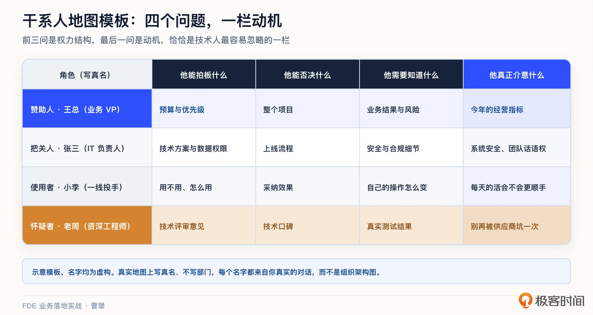
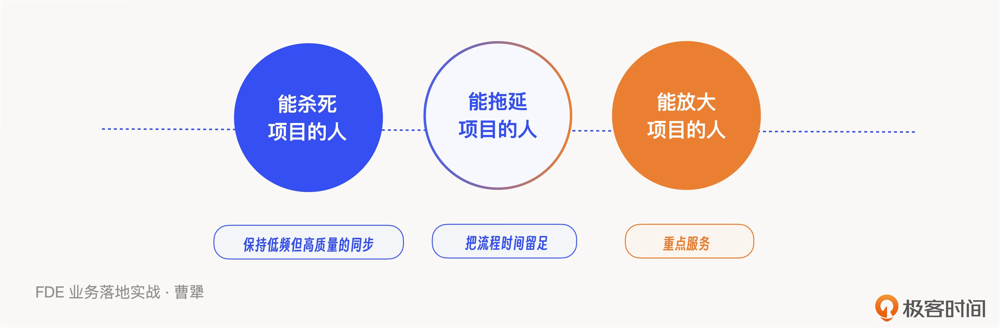
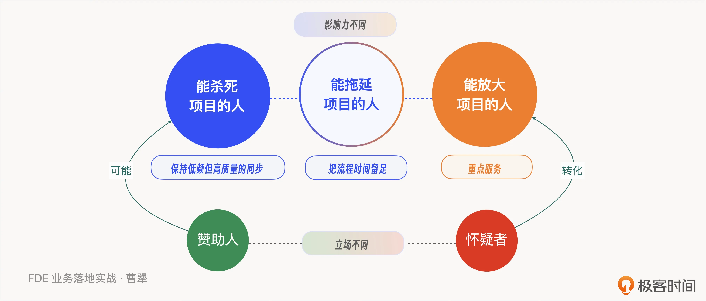
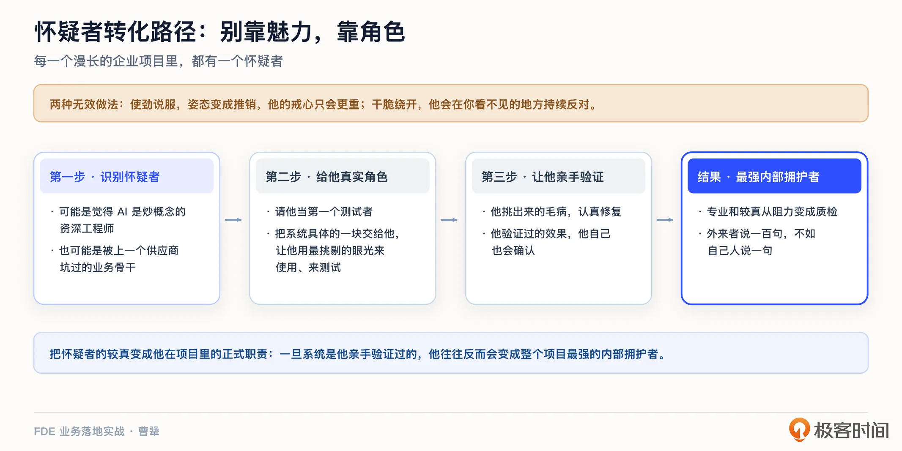
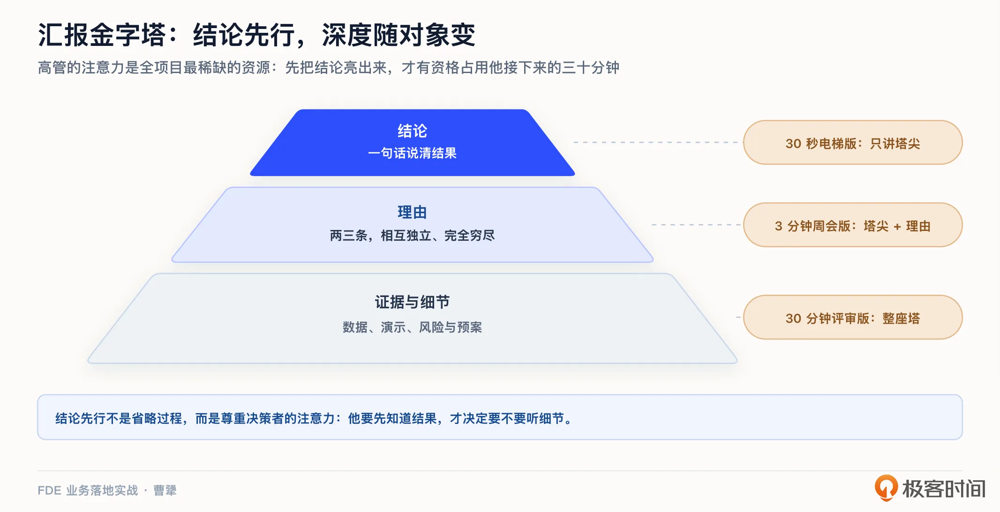
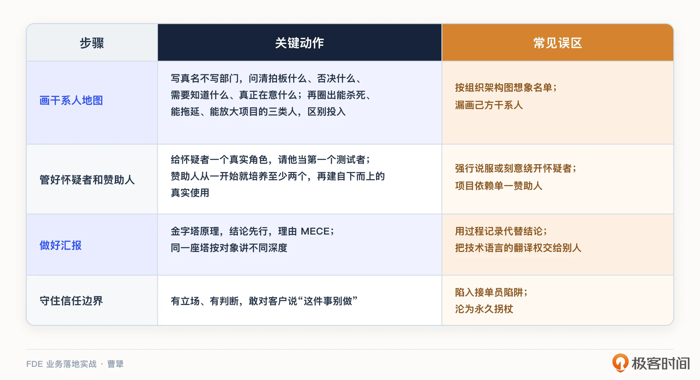

# 07｜干系人与信任：怎么搞定关键人和内部政治？
你好，我是曹犟。

上一讲的结尾我曾经提过，场景选对了，结果也定义清楚了，还不能急着开工，因为还要过人这一关：谁支持你，谁反对你，谁能一票否决你。这一讲，我们就来把这一关讲透。

先说一个我的观察。技术人做项目，最容易犯的错，就是把项目成败完全归结为技术：方案够不够好，系统够不够鲁棒。但做了十一年 to B 之后，我越来越确信，事情不是这样的，至少在中国不是。我之前总结过一句话：“中国 to B 的本质，是甲方和乙方关系挺好，而甲方有个问题恰好乙方能解决，于是让乙方来解决”。这与我们之前的认知——先做一个好用的产品，然后到处去找买家，是完全不一样的。

注意这句话的顺序，关系良好在前，问题解决在后。这倒不是说技术不重要，而是说， **在一个真实的客户组织里，你的技术价值，必须先通过“人”这一关，才能落到业务上。** 人这一关过不去，再好的方案也只能躺在 PPT 和设计文档里。

除此之外，还有一层变化，让信任的分量比以往更重。当软件从工具变成决策者，客户最大的顾虑就不再是它贵不贵，而是它会不会把事搞砸。过去卖工具，出了错还有人来兜着；现在 AI 直接参与决策，客户敢不敢把方向盘交给它，很大程度上取决于坐在旁边的你过去攒下了多少信任。

第 5 讲摩根士丹利的项目你还记得吧？技术开发只花了几周，建立信任却花了几个月，最后换来 98% 的采用率。而且客户对 Agent 的信任，和对你这个 FDE 个人的信任，是同一套逻辑，都需要一步一步积累出来。在产品上怎么给客户设计一条从不信任到放权的路径，我自己也有一些心得与实践，我们在第 12 讲会展开。

当然，信任问题倒也不是中国特色，全世界都一样。Hacker News 上有一条评论，我印象很深，大意是说：FDE 被空投到一个潜在敌对的组织里，还被要求拿出可衡量的成果；他们要克服的，多数是政治、官僚和组织上的障碍，而不是技术障碍。

“潜在敌对”这四个字，听着有点夸张，其实很准确。道理很简单：你是外来者，你的项目会改变一些人的工作方式，甚至还会影响一些人的利益，动了他们的奶酪。有人盼着你成，自然也有人盼着你不成。我们这节课讨论的，就是在这样的环境里，怎么让项目真正落地。

我把这件事情拆成四步：画干系人地图，管理好怀疑者和赞助人，做好汇报，守住信任的边界。

## 先把人画出来：一张干系人地图

进场之后，第一步要做的，就是尽早把干系人地图画出来。

所谓干系人地图，就是把所有能影响项目命运的人写在一张表上，一个一个搞清楚四个问题： **他能拍板什么？他能否决什么？他需要知道什么？以及最重要的，他真正在意什么？**

前三个问题，说的是权力结构；最后一个问题，说的则是动机。动机这一栏，恰恰是技术人最容易忽略的。同样一个项目，老板在意的可能是今年的经营指标，IT 负责人在意的可能是系统安全和自己团队的话语权，一线员工在意的，可能是自己的活会不会变多、岗位还保不保得住。这些在意没有对错之分，符合每一个人的切身利益，但我们的方案要落地，就要对每一种在意都有所交代。

第 2 讲提到过，Sho Shimoda 在书里给绘制干系人地图提了一个很具体的要求：写真名，不写部门。我很认同这个要求，组织的利益和个人的利益，在很多时候并不是一致的，有在大厂工作过的同学，应该非常理解我这句话背后的含义。“IT 部门支持我们”这句话没有什么信息量；“IT 部的张三支持我们，因为这个项目能帮他解决数据孤岛的老大难问题”，这才叫地图。地图上的每一个名字，都应该来自你真实的对话，而不是照着组织架构图想象出来的。

第 5 讲我讲过一个我们自己的例子：我们在客户那边驻场，客户老板指定了一位很聪明的投手主管跟我们配合，但老板又多次提醒我们，不能只听主管的，要去看真实投手的操作。当时我提这个细节是为了讲清楚怎么摸真需求，现在换个角度再看，这其实就是一张最小的干系人地图：老板是赞助人，也就是为项目背书、给资源的人，他在意的是团队效率是否真的提升了；主管是把关人，他有自己的专业判断，也有自己的立场；投手是使用者，他们在意的是每天的活会不会做得更快。

三种角色，三种动机，如果只围着其中一种角色转，项目就会做偏。具体到个人，例如某个投手的信任该怎么攒，第 5 讲说过的办法就够用：空杯心态，拜师学艺，跟他们交上朋友。这一讲，我们把关注点从搞好个人关系往上提一层，核心关注 **如何建立决策和组织层面的信任**。

画完地图，还要在上面圈出关键人。我的经验是重点圈三类： **能杀死项目的人，能拖延项目的人，能放大项目的人**。能杀死项目的，通常是预算和权力的持有者，比如某位随时可以说“先停一停”的高管。能拖延项目的，往往是流程上的把关人，安全、合规、采购，每一关都能在合规的前提下让你等上几周。能放大项目的，则是那些产品用得好、个人影响力大、别人信服的标杆用户。

三类人要用三种打法。对能杀死项目的人，保持低频但高质量的同步，让他每次想起这个项目，脑子里都是清晰的进展和可控的风险。对能拖延项目的人，提前把材料送到，充分尊重他的专业性，把流程时间留足，别等到了节点才去堵门。对能放大项目的人，重点服务，让他们先用出效果，再主动宣传，让这个效果被更多人看见，实现双赢。我们在人身上投入的精力，也应该按这个优先级来分配。

从画干系人地图，到重点服务能放大项目的人，这一套做法，在同行那里也能找到印证。Anthropic 的应用 AI 团队，也就是他们对外做部署的 FDE 团队，曾经分享过他们的节奏：进场第一周，他们会集中做 8 到 15 场用户访谈，把干系人一个一个聊透；到灰度上线阶段，他们会专门培训客户内部的 champion，也就是内部的种子拥护者，让推广这件事由客户自己的人来做。从访谈的量级上，可以看出他们把“摸人”当成和“摸需求”同等重要的事；而 champion 角色的设计，则是承认一个现实：外来者说一百句，不如自己人说一句。

还有一条，前 Palantir 的 FDE Nabeel Qureshi 说过，做好 FDE 需要对社交场景有异常敏锐的感知，你不仅要赢得客户信任，有时候在自己公司也得玩政治游戏。而 Shimoda 则专门提醒：政治是双向的。除了客户组织里的政治，你自己公司内部也有政治，资源给不给你、产品团队接不接你的需求，这些同样影响项目命运。他还说，最让新手 FDE 感觉意外的，往往是后面这条战线。

这一点我在神策感受很深。我们服务大客户的时候，通常要组建商务、解决方案加交付的专属团队，加上后方的运维、产研、财务、运营甚至人事，与整个项目相关的角色，也是非常多的。一个项目的成败，从来不只取决于客户那边的干系人，也取决于我们自己这边的资源怎么协调。我们内部一些做得好的同学，例如业绩非常突出的项目经理或客户成功经理，据我观察，往往既能跟客户建立良好的关系，真正理解客户的业务和真实需求，又能够与公司内部不同角色做好沟通协作，把客户需求转化为内部可理解、可执行的任务，并持续推动问题解决和结果落地。如果只是一个客户与内部角色的传话筒，这个岗位就没有任何意义了。

所以，画干系人地图的时候，别忘了把自己人也画上去，也同样可以把自己人分成能杀死项目、能拖延项目、能放大项目的三类人，认真对待他们的诉求。

## 怀疑者与赞助人：项目的两个命门

地图画好之后，第二件事，就是处理好地图上最特殊的两个角色：怀疑者和赞助人。

先交代一下这两个角色和上一节三类人的关系。三类人是按影响力分的，回答的是谁能影响项目；怀疑者和赞助人则是按立场分的，回答的是谁支持你、谁反对你，两套分类是同一张地图的不同解读视角。赞助人，通常就是那位能杀死项目的人，只不过他现在站在你这边，而他一旦不站你了，项目就真的可能被杀死。而怀疑者则恰好相反，虽然他现在对项目可能有一些疑虑，但处理得好，反而可能会变成最能放大项目的人。

先说怀疑者。每一个漫长的企业项目里，都有一个怀疑者，他可能是那位觉得 AI 就是炒概念的资深工程师，也可能是那位被上一个供应商坑过的业务骨干。

面对怀疑者，大多数人的本能反应可能是两种：要么使劲说服他，要么干脆绕开他。这两种做法，效果通常都不好。使劲说服，姿态上就成了推销，他的戒心只会更重；绕开他，他就会在你看不见的地方持续表达反对。

我的建议是第三种： **别试图用魅力转化他，而是给他一个真实的角色**。具体做法，可以是请他来当第一个测试者，把系统中具体的一部分交给他，让他用最挑剔的眼光来使用、来测试。他挑出来的毛病，你认真修复；他验证过的效果，他自己也会确认。一旦系统是怀疑者亲手验证过的，他往往反而会变成整个项目最强的内部拥护者。这个转化背后的逻辑其实很朴素：怀疑者最不缺的就是专业和较真，你让他充分发挥他的专业能力，把较真变成他在项目里的正式职责，他的专业和较真就从阻力变成了质检。

再说赞助人。赞助人就是在客户内部真正为项目背书、帮你获取资源的那位关键人物，通常是发起项目的高管。项目有赞助人支持，推进会顺利很多。但这里面隐藏着一个很多人没有防备的风险：赞助人是会消失的。他可能升职、调岗、离职，也可能在内部调整中失势。这种情况可以叫作“赞助人崩塌”：一个技术上很成功的项目，因为靠山没了，说停就停。新领导上任，带着自己熟悉的供应商，之前的很多合作就这么结束了，我在神策内部碰到过很多次这样的案例。

对这个风险，我自己有两条预防建议。第一，从一开始就培养至少两个赞助人，别把项目挂在一个人身上。第二，尽快建立自下而上的真实使用习惯，当一线员工每天工作都离不开你的系统时，即使换一个领导，也很难把它拔掉。当然，我们必须承认，有些崩塌就是救不回来的。赞助人崩塌属于 FDE 六种失败模式之一，完整的失败模式体检，我们第 18 讲专门讲。

## 汇报不是杂活，是生产力

处理好怀疑者和赞助人之后的第三件事，是做好汇报。

很多工程师打心底里瞧不上汇报，觉得那是务虚，是挤占写代码的时间。我曾经也是如此，但现在，我想说一个可能有点反直觉的判断： **在客户现场，汇报本身就是交付的一部分**。系统再好，决策层感知不到，预算就续不上；进展再快，关键人没被同步到，支持就会慢慢流失。信任这个东西，本质上就是靠一次一次的有效沟通积攒出来的。

怎么汇报？我自己这些年给客户高管做过很多次汇报，总结下来最有用的一条其实和咨询行业的经典方法是一致的，就是 **金字塔原理**。结论先行，先用一句话说清结果，再给两三条理由，最后才是证据和细节。高管的注意力是全项目最稀缺的资源，你只有先把结论亮出来，才有资格占用他接下来的三十分钟。

举一个简化的例子。同样是周报，一种开头是：这两周我们完成了数据接入、跑通了测试环境、修复了若干问题。另一种开头则是：上线时间不变，效果达到预期，但有一个数据权限的风险，需要您帮忙推动。前一种只是过程记录，后一种才是决策者需要的汇报。

在汇报结构上，还有一个配套原则，叫 MECE，中文意思是相互独立、完全穷尽。简单来说，就是你给出的几条理由之间不要互相重叠，但是合起来又不能漏掉事实。听起来有点咨询腔，但这背后的要求其实也特别“工程师”：像设计接口一样设计你的表达，不冗余，不遗漏。

对不同的人，同一座金字塔可以讲到不同的深度。电梯里遇到老板，讲塔尖那一句；周会上，讲到第二层的理由；技术评审，才下沉到证据和细节。内容虽然是同一套，但汇报深度要随着对象而改变。

这里我还想再提醒你一下：面对非技术背景的决策者，我们必须要把技术语言翻译成业务语言，而且这个活，只能 FDE 自己干。你不翻译，就会有别人替你翻译；而一旦翻译错了，代价还是算在你的项目头上。

需要说明的是，在有了 AI 之后，具体的汇总细节、撰写文档、制作 PPT 这些工作，变得前所未有地简单。但是，汇报内容的最终审核，现场的沟通与表达，对客户问题的理解与答复，这些依然需要人来做。从这个意义上说，哪怕 AI 能力再强，FDE 岗位还是需要有一定的沟通表达能力。很多工程师可能容易给自己贴一个不擅长表达的标签，但是，我并不认同这种刻板印象。从我自己的转变来看，只要你有足够的意愿，把表达当做工作的一部分，有意识地去练习自己的沟通表达能力，工程师由于自己的技术背景和诚恳、踏实的工作习惯，很多时候反而更容易赢得客户的信任。

## 信任不等于顺从：别做接单员

最后一件事，则是划清信任的边界。前面讲的都是怎么赢得信任。但信任攒起来之后，还有一个更隐蔽的坑，就是把信任理解成顺从，客户说什么就做什么。

“和客户打交道”某种意义上是 FDE 这份工作最难的部分，难点就在于：怎么跟客户紧密合作，又不沦为一个客户的“接单员”。行业里有所谓的接单员陷阱（Order-Taker Trap）的说法，就是你想讨好客户，来一个需求就接一个需求，短期看关系确实更好了；但长期来看，你就从一个带着判断力的专家，降级成了一双好用的手。而只有一双手，是不值 FDE 这个价钱的。

上一讲我们说过，敢对客户说“这件事别做”，而且要说得有理有据，是双方信任真正的开始。放到这一讲，这句话可以再进一步： **客户信任你，恰恰是因为你有立场、有判断，会对他说不**。你把“不”字丢了，信任的根基也就没了。

行业里还有另一个反模式，叫“永久拐杖”（Permanent Crutch），光看名字就能明白意思：客户永远离不开你，你也永远抽不出身。这听起来像是生意稳定，其实是双输。客户的团队没有成长，而你则被钉死在这一个客户身上。

还有一个概念，叫“信任谱系”（Trust Spectrum），意思也写在名字里：信任不是有或没有的开关，而是一段有深浅的谱系，要靠一次次兑现承诺往上走。至于信任攒够之后怎么把系统逐步交回客户团队，我们会在第 12 讲和第 13 讲讨论。

最后，还是想补一句 AI 时代的话。写代码、做 PPT，AI 都帮得上忙，甚至比人更好；可到了干系人和信任这一环节，AI 能做的就太少了。干系人地图它能陪你梳理，但信任是要靠人一次次当面挣回来的。客户敢不敢把方向盘交给你，看的还是你这个人，而不是你用的到底是哪个前沿模型。这一环节最难被 AI 替代，却也恰恰是人的价值所在。

## 课程总结

这一讲，我们讲的是干系人与信任，核心就一句话：技术负责把事做对，还要靠人把事做成。

我们把赢得信任这件事拆成了四步，每一步的关键动作和常见误区，我帮你整理成一张表，方便你保存和复习：

除了表格整理的内容之外，还有一点需要再强调一遍：干系人地图 AI 能陪你梳理，但信任是人一次次当面挣来的，这一环 AI 替不了，也恰恰是人的价值所在。

如果你想转型 FDE，这一讲想给你的是一个心理准备：搞定人不是分外之事，它就是这份工作的正篇。技术强的人很多，技术强又愿意认真对待的人很少，这恰恰是你的差异化优势。

对交付和实施同学，干系人地图和汇报金字塔都可以直接拿去用。特别是动机那一栏，下次项目卡住的时候，先别急着怀疑方案，翻出地图看看，是不是有谁的诉求没被照顾到。

对 To B 创业者和技术决策者，可以重点看看赞助人崩塌那一段。只有单一赞助人的项目，签单的时候有多顺，崩塌的时候就有多快，这个风险在签合同之前就要算清楚。

人的问题理顺了，信任的账户也开好了，接下来的问题就是怎么快速往账户里存钱。空口白话的说服力有限，我的答案是尽快拿出一个能真正跑起来的东西。下一讲，我们就来讲 Demo-driven 这个话题：一个能跑的 Demo，为什么胜过一百页 PPT。

## 思考题

留两个问题，欢迎你在留言区聊聊：

1. 画一画你手头项目的干系人地图：谁能拍板，谁能否决，谁在观望？画完之后看看有没有哪个关键人，你到今天都还没有跟他单独聊过？

2. 你有没有遇到过课程中说的典型的怀疑者？你当时的做法是说服、绕开，还是拉他入伙？现在回头看，你会怎么处理？

期待你在留言区分享你的思考。如果这节课对你有启发，也推荐你把它分享给身边更多朋友。