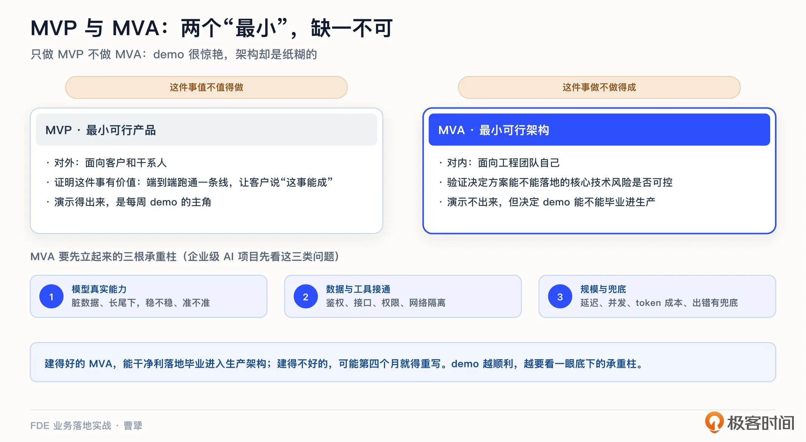
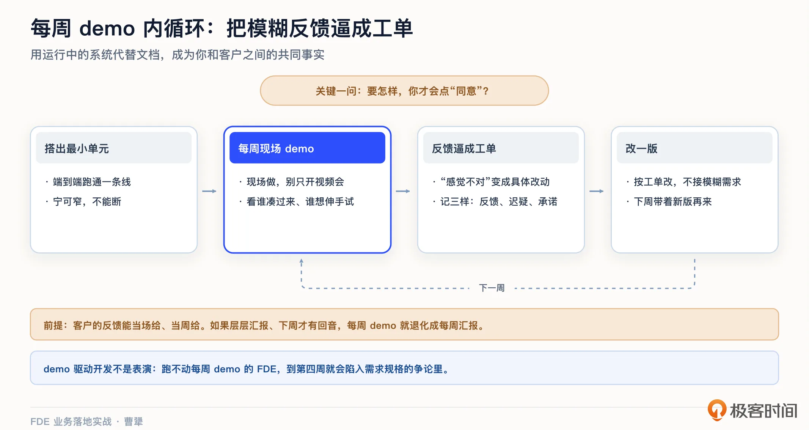
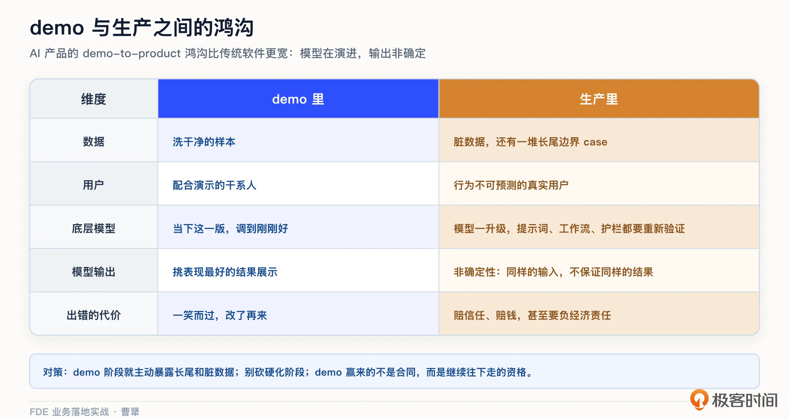
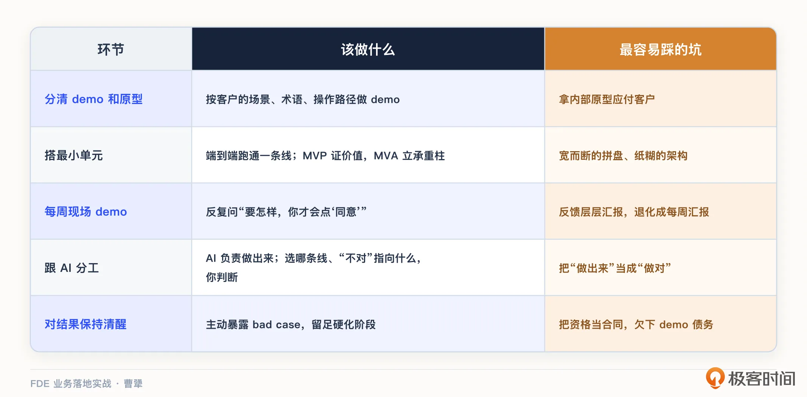

# 08｜Demo-driven：一个能跑的 demo，为什么胜过一百页方案？
你好，我是曹犟。

上一讲结尾我们提到，人的问题理顺了，信任的账户开好了，接下来就要往账户里存钱了。而空口白话，说服力有限，最硬的存款，就是一个实际能跑起来的东西。而这一讲，我们就来讲 Demo-driven：一个能跑的 demo，为什么胜过一百页方案，以及怎么建好 demo，并且把 demo 用好。

正式展开之前，我先回顾一下 [第 2 讲](https://time.geekbang.org/column/article/1000788?utm_term=zeusODZ90&utm_source=teacher&utm_medium=GitHub&utm_campaign=101180601&utm_content=teacher "") 我曾提到的一条互联网上的真实评论，说 FDE 就是先用一个 AI demo 唬住客户，然后总结需求给产品团队。这个评论虽然有一些极端，但其实藏着一个真问题：demo 到底是拿来干什么的？如果 demo 是拿来唬客户的，那它确实只是售前方案配套的道具。但在 FDE 的方法论里，demo 的第一作用恰恰相反：它不是让客户说“哇塞”，而是让客户说“不对”。

我们这节课就顺着这个思路展开讲。

## 为什么是 demo，不是方案？

这一节的标题，说的是 demo 和方案的对比；但要把这件事说清楚，得先理清三样东西的关系：方案、原型和 demo。我们先从最容易被混着用的一对说起：demo 和原型，这也是我最近一段时间想得比较多的一个概念区分。

原型更多是研发过程内部的评审物：它可以省掉一部分页面内容，因为默认看的人都知道；也可以写满内部的术语和概念；还经常把好几个界面拼在一张图上，方便评审和开发。

但 demo 不一样，demo 是要给客户看的，要尽可能贴着客户的真实使用场景走：数据可以是合成的，但场景、术语、操作路径，必须是客户未来真正要看到和理解的。 **原型对内，demo 对客户。**

现在，回到前面提到的三样东西的对比：原型是内部的半成品视图；方案虽然也是对客户的，但只是文档，太过抽象；只有 demo，才是客户能指着说“不对”的东西。

这里再展开说一个我过去多年反复验证过的判断：人对着文档提不出真意见，人只有对着能跑的东西才会说真话。

[第 5 讲](https://time.geekbang.org/column/article/1002969 "xxx") 我们聊进场的时候说：拿合成数据搭个轻原型，扔到用户面前，他脱口而出的“这个不对”“我们从来不这么干”，比十个调查问卷挖出来的真东西还多。顺带说一句，第 5 讲里管它叫轻原型，按刚才的口径，它其实承担了对客户的功能，所以已经是个粗糙的 demo 了：照着用户的真实场景搭建，并且是扔到用户面前用的。在第 5 讲中，它是发现工具，用来帮我们摸真需求；而到了这一讲，它要升级成验证与信任的工具。

### 为什么一百页的方案做不到这一点？

毕竟，包括神策在内的很多公司，过往跟客户沟通最常用的方法，就是做一个 PPT，对着 PPT 向客户详细讲解解决方案，特别是在产品还不完善或者说还是“期货”的时候，更依赖方案本身了。我自己的观察，至少有以下几个原因。

**第一，方案是抽象的**。客户听方案的时候，脑子里补全的是他自己想象出来的系统，两边想的可能根本不是同一个东西，就算客户亲口表示认可，也不代表真的对齐了。

**第二，对方案表态不需要付出太多成本**。客户说“挺好的，继续推进”，这句话里没有任何承诺。但一个能跑的东西摆在面前，用还是不用，本身是需要付出时间成本的，在这种情况下，这个东西好用还是难用，是藏不住的。

**第三，这一条是 AI 时代特有的：方案里的 AI 永远聪明，demo 里的 AI 才会犯错**。客户需要亲眼看到它在自己的业务上怎么表现，包括怎么出错，才能对产品建立真实的预期。

这背后的信任逻辑，我们自己在驻场时感受很直接。 [第 5 讲](https://time.geekbang.org/column/article/1002969 "xxx") 提过，我们在客户现场会顺手用 AI 做点小工具，把投手每天人工反复操作的环节自动化掉。这些小东西没有一件是合同里约定的，但每做成一件，客户对我们的信任就加深一层。道理其实很简单：承诺一百件我们能做的事情，不如真正当场做成一件小事。demo，本质上就是这个逻辑的放大版。

当然，我不是说方案文档没有用。复杂的集成方案、合规的评审材料，该写还是要写。demo 代替的不是文档本身，而是那种“靠文档达成共识”的幻觉。特别是在打磨产品的时候，再好的方案都替代不了一个可以真实上手的 demo。

某种意义上，FDE 这个角色本身，就是从“ **拿着 demo 反复上门**”里逐渐形成的。 [第 1 讲](https://time.geekbang.org/column/article/1000717?utm_term=zeusODZ90&utm_source=teacher&utm_medium=GitHub&utm_campaign=101180601&utm_content=teacher "") 聊过 Palantir 的起源：Cohen 带着早期产品去见客户，被嫌太难用、太糙，公司的应对不是回去闭门改产品，而是派工程师坐到客户现场，一边解决问题一边打磨。FDE 的整套方法论，就是把“让客户当面提意见”这件事流程化了。

## 最小单元：先跑通端到端的一条线

那 demo 的范围应该做多大？我的答案是：能产生端到端结果的最小单元。

这里的关键词是端到端， **宁可窄，不能断**。举一个简单的例子，你要给客户演示报表自动化，正确的做法，是选定一张最有代表性的报表，从取数、配置、计算、可视化到产出结论，完整跑通这一条线；而不是把十张报表的界面都画出来，但每张都只能完成一两步。窄但通的 demo，客户看完的感受是“这事能成”；宽而断的 demo，客户看完只记住了“到处都是半成品”。从更大的视角上看，这条“宁可窄不可断”，就是 [第 6 讲](https://time.geekbang.org/column/article/1002988 "xxx") 聊的逐个场景打穿落到 demo 上的具体体现：先把一条业务流跑到底，而不是把系统一次性铺开。

不过，端到端跑通，只是让客户看到了业务结果，对于 FDE 来说，还有一个重要的工作是，看这条链路在技术上站不站得住脚。换句话说，一个合格的最小单元，要同时完成两种验证： **对外验证价值，对内验证技术可行性**。

Shimoda 把这两种验证分别叫作 MVP 和 MVA。MVP 是最小可行产品（Minimum Viable Product），面向客户，证明这件事有价值；MVA 是最小可行架构（Minimum Viable Architecture），面向工程团队，验证那些决定方案能不能落地的核心技术风险是否可控。前者回答“值不值得做”，后者回答“做不做得成”。两个“最小”缺一不可。只做 MVP 不做 MVA，demo 很惊艳，架构却是纸糊的。MVA 不是一次性的脚手架，而是能长成生产架构的种子，建得好的 MVA，能干净利落地毕业，进入生产架构；建得不好，可能第四个月就得重写。

**什么叫承重的技术风险？**

就是那些决定整个方案能不能落地的关键技术问题。一旦解决不了，整个方案就得推倒重来。放到企业级 AI 项目里，我会先看三类问题。

第一，大模型的真实能力够不够：换成客户的真实数据，碰到脏数据和长尾问题，结果还准不准、稳不稳，能不能达到业务可以接受的下限。

第二，模型需要的数据和工具能不能真正接通，包括鉴权、接口、权限和网络隔离。

第三，到了真实的业务规模，延迟、并发和 token 成本能不能接受，模型出错以后有没有兜底。

**MVA 的任务，就是用最小的工程量，把这几根承重柱先立起来。**

AI 时代，大模型的前端开发能力是如此之强，以至于把最小单元中客户可见、可以上手的那一面做出来，成本已经被压到了历史最低。我们自己的做法， [第 5 讲](https://time.geekbang.org/column/article/1002969 "xxx") 提到过：第一周驻场结束，带着一脑袋的业务认知回公司，周末用 Claude Code 把高保真的 demo 搭出来，第二周直接带它回客户现场。

放在几年前，这样一个 demo 少说要一个小团队做上几周；现在，则只需要一两个人一个周末就能完成。这个变化的意义不只是省钱，而是“高频回现场做 demo 迭代”这件事，第一次变得可行、变得可持续。 **demo 成本降一个量级，你和客户之间的反馈循环就能快一个量级。**

成本降下来，也让一个过去经常被拿来当借口的理由越来越站不住脚。过去，不少团队直接拿内部原型应付客户，总说专门按照客户的真实场景做一版 demo 太贵。几年前，这个理由可能还有现实基础；但现在，如果还把内部原型直接推给客户，更多就是做事方式的问题，而不是成本问题。原型留给内部评审；见客户，就应该按照客户的场景、客户的术语，甚至客户原有系统的信息结构，老老实实做一个 demo。

工具上也没有什么神秘的：Claude Code 这类 AI 编码工具打底，合成数据造样本，再加上现成的组件，一个能跑的端到端的 demo，成本已经低到你没有理由不做了。顺带提一下，对于 FDE 来说，动手之前要习惯性地先问一句：这个问题真的需要 AI 吗？最小单元不一定要用最炫的技术，能端到端解决问题就好。

需要说明的是， **便宜的是“做出来”，不是“做对”**。这条 demo 该选哪个场景、跑哪一条线，做出来之后客户那句“不对”背后到底指向什么真需求，这些核心判断 AI 给不了你，只能靠你自己。

## 每周 demo：把模糊反馈逼成工单

demo 做出来了，具体该怎么用？我从实践中总结出一条很认同的纪律： **每周给干系人演示**。

demo 驱动开发不是表演，每一次 demo 背后其实是一个逼迫机制，把模糊的反馈逼成具体的工单。客户说“我说不好，感觉不太对”，这句话没法拿回来修改产品；但当他看着屏幕说“审批人的名字应该放在第一列”，这就是一张可以直接排期的工单。模糊反馈变具体工单，靠的不是追问技巧，而是眼前有一个具体的东西。

这个逼迫机制要转起来，还有一个客户侧的前提，就是 [第 5 讲](https://time.geekbang.org/column/article/1002969 "") 客户四问里所提到的反馈周期。demo 给客户后，客户的反馈要能当场给、当周给。如果每一条反馈都要带回去层层汇报，下周才有回音，逼迫机制就空转了，每周 demo 也就退化成了每周汇报。

说到底，每周 demo 就是一次小小的共创： **让客户的真实声音，赶在东西定死之前，先进到产品的设计里**。这个“把真实需求提前拉进研发”的思路，第 13 讲聊沉淀时我会正式展开。

给客户演示 demo 或者让客户自己用 demo 的时候，有一个问题值得反复询问：要怎样，你才会点“同意”？这个问题的妙处在于，它把讨论从“你觉得怎么样”拉到了“距离你验收还差什么”。前一个问题收获的是客气话，后一个问题收获的是具体的改进清单。

每次 demo 过程中，我建议记下三样东西。

1. **当场的具体反馈**：这部分直接变工单。

2. **没说出口的迟疑**：哪个功能演示的时候客户明显不感兴趣，哪个环节他反复追问，这些信号比客气话更诚实。

3. **双方的承诺**：客户答应给的数据、你答应改的功能，各自落到具体的人和时间。一页纸就够了，但每周都要有这一页纸。

Shimoda 曾经说过一句话：跑不动每周 demo 的 FDE，到第四周就会陷入需求规格的争论里。我见过太多这样的项目，双方拿着 SOW（Statement of Work，工作说明书）文档逐条抠字眼，越抠越细，越抠越没有共识。每周 demo 的本质，是用运行中的系统代替文档，成为双方讨论的共同事实。文档可以各自解读，但跑起来的系统只有一个样子。

上门演示之前，还有一道成本很低的工序，我们自己每次都做： **让 AI 来扮演客户的角色**，比如扮演一个投手，把 demo 从头到尾走查一遍。角色设定得越真实，走查暴露的问题越像真实用户会踩到的：术语不对、步骤反直觉、边界情况没兜住。这些基本问题提前改掉，真正呈现给客户的 demo，才配得上客户的时间。

还有一个细节，我个人很坚持： **demo 尽量现场做，别只开视频会议**。我们自己的节奏就是如此：拿到足够的信息、开发完 demo，就再去一趟客户现场，看着客户亲手使用。当面演示，你能看到谁凑过来了、谁在旁边小声议论、操作到哪一步时有人忍不住伸手想试。这些现场反应，是屏幕共享所给不了的。正如上一讲所说，外来者说一百句，不如自己人说一句；而自己人开口的前提，往往就是他在现场亲眼看到了、亲手摸到了。

还有一个值得讨论的配套问题：客户的技术团队如果想参与建设，怎么办？热情肯定是好事，但我的建议是分区对待：客户可以参与外围建设，比如仪表盘、测试数据、评估集的输入；核心架构还是要留在 FDE 团队自己手里。这当然不是防着客户，而是责任要清晰：将来系统出了问题，你没办法对一段客户写的关键代码负责。

## demo 赢的是资格，不是合同

最后，也是我最想强调的一点：对 demo 的效果，要保持清醒。

a16z 有一篇专门讲企业级 AI 的文章，标题直译过来就是“从 demo 到成单”。里面有个判断我很认同：用现在的工具，做出一个炫的 AI demo 相对容易，但 AI 产品从 demo 走到能用的产品，这道鸿沟比传统软件更宽。原因有两个。

第一，底层模型不是一个稳定不变的技术依赖。模型一升级，原来调好的提示词、工作流和安全护栏，都可能需要重新验证。

第二，模型的输出是非确定性的。即使模型版本不变，同样的输入也不保证每次得到同样的结果。demo 里你可以挑表现最好的样本，生产里用户的行为不可预测，数据也是脏的，成败取决于你能不能处理好那些长尾边界 case。

面对从 demo 到成单的鸿沟，具体怎么保持清醒，我有三条总结：

1. **demo 阶段就主动暴露长尾和脏数据**。别只用洗干净的样本演示，专门挑几条真实的烂数据当场跑，让客户看到系统在 bad case 下的表现和兜底方案。这一步看起来是自曝其短，本质上是在管理预期：现在暴露，成本可能只是一点面子；上线以后暴露，成本则是信任，甚至是赔偿。有航空公司就吃过这个亏，客服机器人对客户做出了错误的承诺，最后被判赔偿。与传统软件相比，AI 的错误不再只是体验问题，它可能是要负经济责任的。

2. **demo 通过，并不等于活儿干完了，后面还有一段最容易被砍掉的“硬化”阶段**。所谓硬化，其实就是上生产之前的加固工作：处理边界情况、补监控、做压测、准备回滚方案。这段工作不产生任何新功能，演示不出来，客户通常又会催上线，所以最容易被人抱着侥幸心理而跳过。Shimoda 曾经给这种侥幸算过一笔账：跳过硬化省下的时间，通常会在六个月后、系统第一次真正出故障的时候，用信任加倍还回去。

3. **警惕 demo 债务**。如果 demo 允诺的体验，生产系统撑不住，那之后每一次和客户的接触，都会背着旧的“期望债”。这种情况在 FDE 的失败模式里有个专门的名字，叫 demo 债务螺旋，我们第 18 讲做失败模式体检的时候会展开。

那条鸿沟怎么跨过去？a16z 那篇文章观察到，跨过去的团队通常做对了三件事：

- 严格地跑评估，模型一升级就重测；

- 在基础模型之上搭建足够的脚手架和安全护栏，不裸奔；

- 在集成测试上真金白银地投入，把客户的系统、策略、工作流一个一个接通。

这三件事，恰好对应我们后面三讲的主题：集成施工是第 9 讲，安全护栏是第 10 讲，评估是第 11 讲。你可以把这三讲连起来看，它们就是从 demo 到生产的完整施工图。

还有一条边界要说清楚：客户在 demo 上点头，和项目验收是两回事。AI 项目怎么定义“好”、怎么量化验收、怎么避免扯皮，需要一套专门的评估方法，这是第 11 讲评估驱动开发的主题，这里先不展开。

最后用一句话收拢这一小节： **demo 赢来的不是合同，而是继续往下走的资格**。把资格当成合同，demo 的债务就会从这里开始欠下。

## 课程总结

这一讲，我们讲的是 Demo-driven，核心就一句话：用能跑的真东西代替文档，成为你和客户之间的共同事实。

我把这一讲的内容，按做一个 demo 的几个环节整理成一张表：

如果你想转型 FDE，每周 demo 是现在就可以开始练的基本功。它会逼你每周都做出一个可以运行、可以拿给客户验证的结果。对 FDE 来说，这种能力比多学一个新的 AI 框架更重要。

对交付和实施同学，“要怎样你才会点同意”这个问题，下次评审会上就可以用到。它能逼着参会人把模糊的意见说具体：哪里还不符合要求，改到什么程度才会通过。

对 To B 创业者和产品经理，我想着重强调 MVA 这个概念。演示驱动的节奏里，最容易牺牲的就是架构质量。demo 越顺利，越要问一句：demo 底下是能毕业进生产的架构，还是第四个月就要重写的架构？

demo 验证通过，信任也攒起来了，接下来就要动真格的了：进到客户的系统里，把 demo 变成能扛住真实业务的生产系统。下一讲，我们就来讲现场施工，怎么在客户系统里填 gap、写生产代码。

## 思考题

留两个问题，欢迎你在留言区聊聊。

第一，回想你最近一次给客户或者老板做的演示，它是端到端跑通的一条线，还是很多个半成品的拼盘？如果是后者，那么重做一次，你会先把哪条线跑通？

第二，你有没有经历过 demo 很惊艳、上线很狼狈的项目？回头看，问题出在长尾数据、硬化阶段，还是当初 demo 许下的期望本身就过高？

期待你在留言区分享你的思考。如果这节课对你有启发，也推荐你把它分享给身边更多朋友。