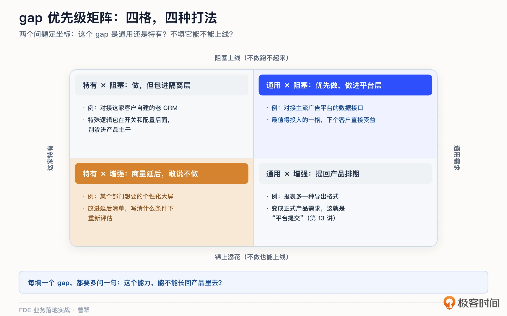
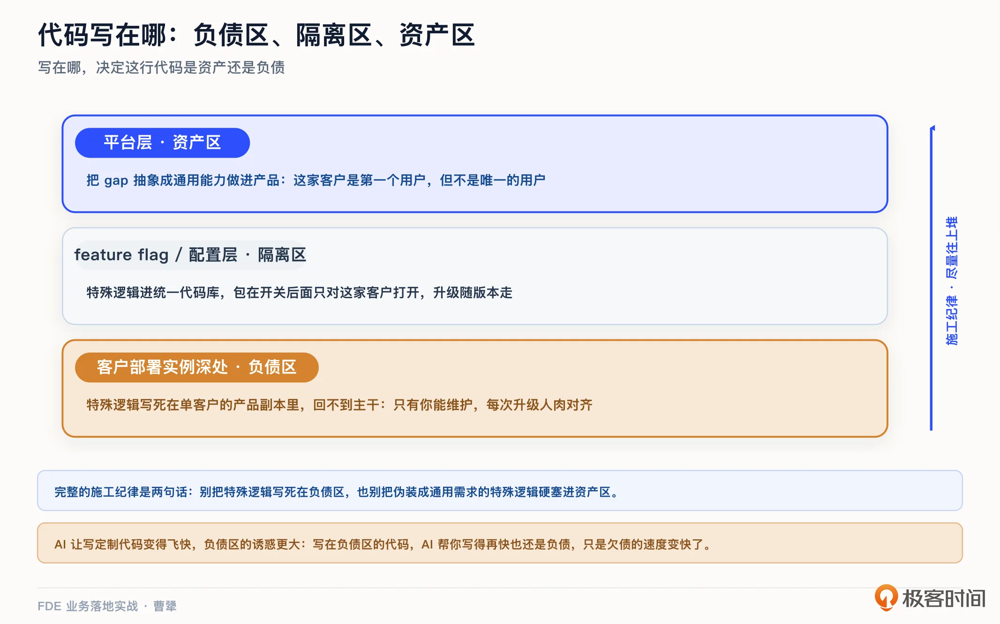
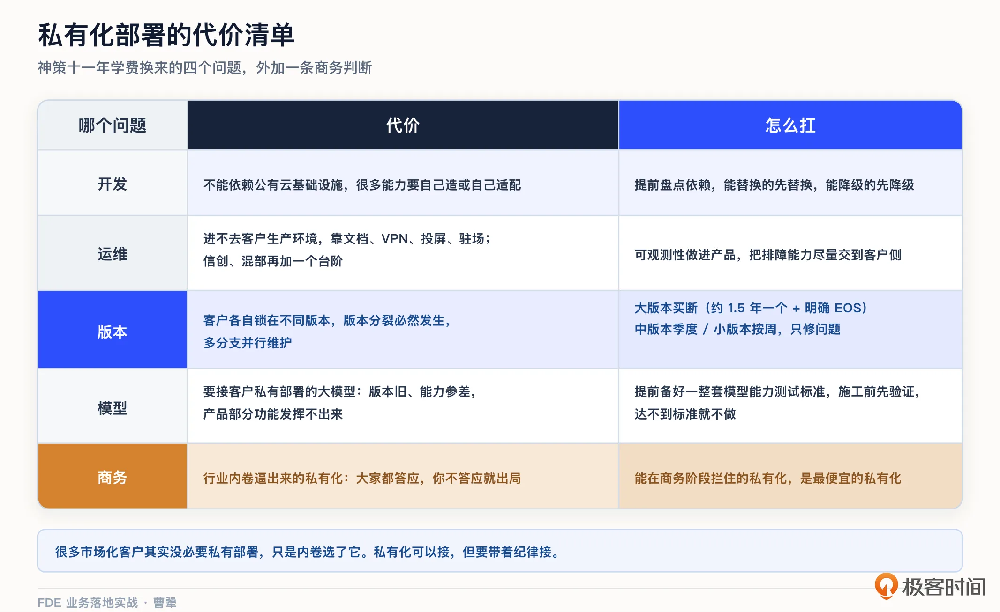
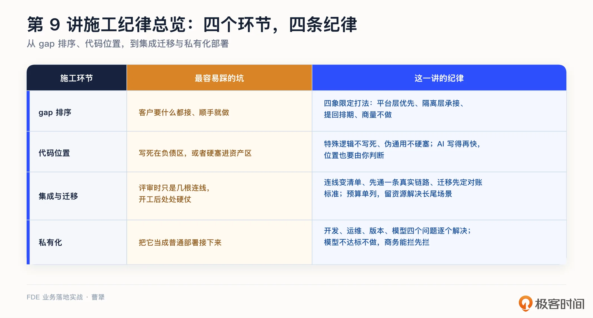

# 09｜现场施工（上）：在客户系统里填 gap、写生产代码
你好，我是曹犟。

上一讲的结尾我提到过，demo 验证通过，下一步就要真干活了。在这一讲和下一讲里，我们会讲现场施工：怎么把一个每周演示的 demo，变成客户生产环境里能扛住真实业务的系统。今天先讲上篇：填 gap、写生产代码。

我们先给“施工”做一个定义。很多工程师觉得，demo 都跑通了，剩下的不就是让 AI 把代码写完吗？我的看法恰好相反： **从 demo 到生产系统，难的从来不是写代码本身，而是你要在客户的地基上施工**。这地基包括客户的系统、客户的数据、客户的流程。通常情况下，这些地基图纸不全，说明书过时，有时候甚至“承重墙”在哪儿都没人说得清。这一讲要讲的，就是在这样的地基上，怎么把活干得又稳，同时不留后患。

我把这个问题拆成三部分：先做哪个 gap，代码写在哪，以及集成和迁移这个最容易被低估的环节。而在最后，我会再讨论一个中国特色的问题：私有化。

## 先画 gap 清单，再排优先级

这节课中所提到的 gap，其实就是产品现有能力和客户真实需求之间的差距。在 demo 阶段，你用最小单元绕开了这些差距；而如果要上生产环境，这些差距就绕不过去了。

我们解决 gap 的第一步不是直接动手，而是先把 gap 一条一条列出来，排优先级。一个可行的做法是画一个简单的四象限矩阵，用两个问题来确定 gap 的具体坐标。

第一个问题： **这个 gap 是很多客户都会有的通用需求，还是这家客户特有的？**

第二个问题： **不解决它，系统能不能上线？它是阻塞项，还是锦上添花？**

这两个问题一交叉，四个不同的象限和四种不同的打法就出来了。

- **通用又阻塞的 gap，优先做**，而且要做在平台层。这是最值得投入的一个象限，在这家客户解决这个问题，下个客户直接受益。

- **特有又阻塞的 gap，要做**，但要做在隔离层，别让这家客户的特殊逻辑渗进产品主干。至于隔离层具体怎么做，下一节会展开。

- **通用但不阻塞的 gap**，别在项目里顺手做掉，而是把它变成一条 **正式的产品需求**，和其他客户的其它需求一起统一进行排期。这个动作有个正式的名字，叫平台提交，第 13 讲讲沉淀时会展开。

- **特有又不阻塞的 gap**，拿出 [第 6 讲](https://time.geekbang.org/column/article/1002988 "xxx") 所说的勇气：跟客户商量 **延后，甚至明确说不做**。敢说“放弃”，在施工阶段一样重要。

我举一个简单的例子。我们的产品需要对接主流广告平台的数据接口，这个功能很多客户都要，并且如果不接整个流程就没法跑通，这是通用加阻塞，需要做进平台。对接某家客户自建的 CRM 系统，这个系统只有他们家有，但是如果不接就跑不起来，这就特有加阻塞，还是要做，但要放在隔离层里。报表多一种导出格式，这个功能很多客户提过，但是不做也不影响上线，这就是通用加增强，提回产品需求池，统一排期。客户的某个部门想要一块个性化的数据大屏，只有他们要，并且和上线验收也没有关系，这就特有加增强，可以放到延后清单里，跟客户说清楚什么条件下再看，并且需要增加多少预算。

这里我们回顾一下 [第 2 讲](https://time.geekbang.org/column/article/1000788 "xxx")，当时我们曾经给真假 FDE 立过一条判断标准： **看代码，构建的是产品里还没有的新能力，还是只做配置和集成。** 我们现在 gap 施工，要做的正是产品里还没有的新能力。这也是 FDE 和实施最像但又最不一样的地方：双方的动作看起来都是“在客户环境里干活”，但 FDE 每填一个 gap，都必须多问一句：这个能力，能不能长回产品里去？

## 代码写在哪：负债区、隔离区、资产区

gap 排好序，第二个问题就来了：代码写在哪里。这个问题的分量，比大多数人以为的都要重得多。

我曾经写过一篇文章，讨论 AI 都能写代码了、还要不要做企业级软件。文章里面有个观察：企业软件要满足客户的个性化需求，无非三种方式：增强配置能力，开放 API 让别人定开修改，或者干脆自己从零定开。这三种方式都会显著增加成本和复杂度，而同时标准软件公司天生不擅长管理定开，这种矛盾在行业内是客观存在的。而定制开发这件事，不管用什么姿势做，都有代价，区别只在于，代价是一次性的，还是要跟着一辈子。

所以，我会把客户项目里的代码位置分成三个不同的区。

第一个区， **这家客户的部署实例深处，我叫它负债区**。在部署到客户环境的产品副本上，把这家客户的特殊逻辑直接写死，不走产品主干修改。这么做，短期最快，但长期最贵。这些代码只活在这一家客户那里，从此只有你能维护，产品每次升级都要人肉对齐，谁写谁得背一辈子锅。

第二个区， **feature flag 和配置层，我叫它隔离区**。这家客户的特殊逻辑，要做可以，但代码要进统一的产品代码库，并通过开关和配置管理：开关只对这家客户打开，别的客户不受影响，产品升级时它跟着版本一起走，不需要人肉对齐。将来如果发现别的客户也要，把开关变成正式功能就行。

第三个区， **平台层，我叫它资产区**。把这个 gap 抽象成一个通用能力，做进产品或者平台里。这家客户是第一个用户，但不是唯一的用户。每一行写在这里的代码，都是给下一个项目省下的时间。

简单来说：写在哪，决定这行代码是资产还是负债。FDE 的施工纪律，就是尽量把代码往隔离区和资产区推。

但是这条纪律，执行的时候也不能过于矫枉过正。

我举一个神策自己的例子，在很长一段时间里，我们都是“一套代码打天下”的坚定信徒，累计服务两千多家客户、几十个行业，始终坚持同一套代码，并且我们都很以此为荣。但这样做的代价是，面对少数客户的个性化需求，我们依然按照惯性用往产品里加功能的方式来消化。日积月累，产品越来越臃肿，迭代越来越困难；还有很多对单个客户很有价值的需求，也因为这种方式而无法响应。

今天回过头看，这其实就是把本该放进隔离区的东西，硬塞进了资产区。所以关于这三个区的纪律，完整的说法应该是两句话： **别把特殊逻辑写死在负债区，也别把伪装成通用需求的特殊逻辑硬塞进资产区。**

在意识到这个问题之后，我们也做了很多改变。一是引入了功能 flag 机制，对部分客户需要的功能先用 flag 做区分，这就是隔离区的做法。二是大力开发 OpenAPI，加强对定开制品的管理。OpenAPI 本身是做进产品的通用能力，属于资产区；而基于 OpenAPI 开发的定开制品，不管是客户、第三方团队还是我们自己的定开团队开发的，压根不进产品代码库，只要它只依赖公开接口、有专门的制品管理，产品升级就不需要人肉对齐，相当于一种更为彻底的隔离。当然，如果定开绕过公开接口去调产品内部的实现，那它挂在体外，也还是负债。

而现在到了 AI 时代，FDE 的施工纪律变得更重要了。AI 让我们写定制代码变得飞快，负债区的诱惑比过去大得多：客户提一个特殊需求，AI 一小时就能写完，写在哪儿好像都无所谓。 [第 2 讲](https://time.geekbang.org/column/article/1000788 "") 我们说过，基于 AI 的定开，AI 改变的是交付的效率，没有改变交付的性质。

放到 FDE 的施工语境里，这句话可以说得更具体： **写在负债区的代码，AI 帮你写得再快，它也还是负债，只是你欠债的速度变快了。** 所以在这一环，人和 AI 的分工很清楚。代码写得快，是 AI 的事；但这段代码该不该写进负债区，是不是该沉到平台层变成资产，都是你的判断，AI 替你做不了决定。

顺带讨论一下，作为 FDE，在施工现场需要具备哪些真实技能。Shimoda 列过几项能力，标准面试很难测出来，但现场天天要用：限时读懂陌生代码库；在无法复现的客户环境里调试；跟“文档在撒谎”的遗留系统打交道；写别人接得住的可维护代码。

“文档在撒谎”这一点，我特别有共鸣：接口文档说返回三个字段，其实返回五个，其中一个还偶尔是乱码，这是现场的常态。这种情况我们刚碰到过一回：我们给一家出海电商客户做 AI 可见性体检，它网站的 robots.txt 白纸黑字写着放行 AI 爬虫，但防火墙却默认把主流 AI 爬虫全拦在门外，老板对此完全不知情。文档说的和系统实际干的，经常是两回事。

同时，Shimoda 还总结说，FDE 要过四个技术能力的关：生产级编程、数据工程、云与基础设施、安全合规，缺了其中哪一个，交付就恰好会在你最弱的那个维度上失败。这套能力模型，我们第 22 讲讲能力与面试时会完整展开。

## 集成与迁移：最沉默的杀手

回答完代码写在哪里这个问题后，FDE 现场施工要面临的第三个问题，就是集成和迁移。这两件事是一对儿：集成，是把你的系统接进客户正在运转的那些系统，让现在的数据流得起来；迁移，是把客户攒了多年的历史数据搬进你的系统，让过去的存量不丢。新客户上线，这两件事一件都躲不开。我自己的观察是： **一个新客户上线的过程中，真正的沉默杀手不是模型效果，也不是功能缺失，而是集成。**

说它是沉默杀手，是因为大多数情况下，它在方案评审时几乎不占什么篇幅。大家的注意力都在功能和效果上，集成往往只是整体架构图上几根轻描淡写的连线。但真到开工后你就会发现，每条连线背后都是一场硬仗：鉴权方式对不上，数据字典的含义没人说得清，接口限流在文档里没写，历史数据迁移一跑就是几天，跑完还有数据 diff。

我们自己在客户现场也一样。 [第 5 讲](https://time.geekbang.org/column/article/1002969 "") 提过，我们驻场时用 AI 连上广告系统的 MCP 和客户自己的业务系统，获取数据帮客户做分析，听起来很轻巧，但前提是先把广告平台的账户体系一个一个接通、客户自己的报表口径一个一个对齐。这部分工作从来不会出现在给客户看的亮点清单里，却是实打实的工作量。

这也不只是我一个人的感受。有一家做研发效能分析的公司 Faros AI，做过一项覆盖上万名开发者的研究，结论很有意思： **AI 让写代码提速之后，瓶颈并没有消失，而是下移到了评审、测试、发布这些交付和集成环节。** 写代码越快，集成在整个交付里占的比重反而越大。这也从另一个角度验证了，为什么 AI 越强，专门啃“最后一公里”的 FDE 反而越值钱。

Palantir 在空客的项目，也是把集成当主战场打的典范。按 Palantir 自己披露的口径，他们从 2015 年起往空客的工厂里派驻 FDE，做的核心工作，就是把 A350 生产线的排程、班次、零件、交付、缺陷这些散在不同系统里的数据整合起来，做成统一的界面，进一步辅助生产规划和故障排查，后来逐渐扩展到二十多个用例，使得 A350 的整体交付速度提升了大约三分之一。这个被业内反复引用的 FDE 经典项目中，真正有价值的不是什么惊艳的规划算法，而是把一堆工业级系统里的数据弄明白、串起来。

当然，这个项目后来还长出了一个更大的东西，叫 Skywise，那就是沉淀的故事，我们把它留到第 13 讲。

那集成这场硬仗应该怎么打？我的经验是要做好这样几个动作。

**第一个动作，把连线变成清单**。方案评审的时候，架构图上跟外部系统的每一根连线，都要落地成具体的明细：对接哪个接口、用什么方式鉴权、数据字典谁说了算、限流是多少、有没有测试环境、联调窗口找谁约等等。评审的时候需要抽时间按这张表过，一项一项确认。连线画起来只要一秒，而这一项项填下来，问题才能提前暴露。

**第二个动作，先打通一条哪怕最细的真实链路**。别等功能都开发完了再去联调，开工的第一周，就可以用客户的真实环境，把一条端到端的数据链路打通，哪怕一天只同步一条记录。目的不是交付功能，而是把鉴权、网络、权限这些看不见的承重墙提前“撞”出来。这也是 [第 8 讲](https://time.geekbang.org/column/article/1005076 "xxx") 最小单元思路在集成上的延续。我们做投手 Copilot 驻场在客户现场的时候，产品形态还没最终确认，但已经在 Claude Code 的 Harness 环境下，打通了跟客户真实广告系统的数据接口，产出了真实的盯盘报告。一方面固然是验证 AI 的能力与效果，另一方面，也是为后续真正上线后的集成环节提前趟坑。

**第三个动作，数据迁移要先彩排，先定好数据对账的标准**。历史数据迁移，别上来就跑全量。先小批量试跑，并且在试跑之前，就跟客户约好什么叫“对上账”：对哪几个指标、允许多大的误差、谁来签字确认。如果对账标准不先定，账就永远对不完。这一点，在神策这些年的交付服务里，真是充满了血和泪：不管你方案做得多完善，只要迁移了系统，数据就很难做到 100% 对齐，也完全没有必要追求 100% 对齐。在踩过几次坑之后，我们在启动迁移项目之前，都会提前跟客户约定好对账的验收标准，不然这个项目根本没法做。

额外提醒一下，FDE 在做项目计划的时候，需要给集成单列预算，别把它当成“顺手就干了”的杂活。另外，我的经验是还要专门预留一块资源解决长尾场景：项目里那些零散、复杂、只能一个个单独处理的集成场景，这个比例在我们自己的实践里反复出现。计划里没预留这类资源的项目，后期大概率失控。

## 中国特色，再加一层：私有化与版本纪律

在中国做 To B 施工，上面三个问题之外，通常还要加一层：私有化部署。

我们前面讲负债区的时候，我曾经说它在“部署实例深处”，而这个区之所以存在，正是因为私有化给每家客户都留了一个自己的产品副本。纯 SaaS 的世界里，没有“每家客户一个副本”这回事。可以说，私有化就是负债区滋生的土壤。

私有化的代价，我在神策体会了十一年，展开说是三个问题。

1. **开发**：不能依赖公有云的基础设施，很多能力要自己造或者自己适配。

2. **运维**：你很多时候进不去客户的生产环境，出了问题只能靠文档、靠 VPN、靠投屏、靠驻场，稳定性保障的难度上一个台阶；再遇到信创环境、混合部署，难度再上一个台阶。

3. **版本**：客户各自锁在不同版本上，版本分裂几乎必然发生，你要同时维护多个分支。

版本这个问题，在交了很多学费之后，我提出了这样一套版本纪律，供你参考。大版本作为买断单位，一年半左右出一个，并且明确生命周期，上市三年后停止支持；中版本按季度走，允许元数据变更、不允许架构变更；小版本按周走，只修问题。

为什么要把版本切得这么正式？

因为买断制下，版本号是要写进合同、暴露给客户的，每个版本都是一个要长期负责的承诺。听起来很保守，但在私有化环境里，互联网式的快速迭代真的会变成灾难。

你可能会问，版本纪律是产品团队的事，跟现场施工有什么关系？

关系有两条。第一， **版本分裂的源头就是负债区**：现场每写死一段单客户代码，公司就多背一个分支，FDE 守住施工纪律，就是在给版本这个问题止血。第二， **版本纪律反过来也是施工的边界**：客户锁在哪个大版本上，你就只能在那个版本的能力边界内施工，不能顺手给这一家客户单独改出一个特殊版本。

到了 AI 时代，私有化还要额外解决模型的问题。私有化交付 AI 产品，很多时候不能用公网上最新的模型，而是要用客户自己私有部署的国产大模型。客户的模型版本通常不是最新的，能力也参差不齐，这样带来的问题也很直接：你产品里的某些功能，在自己的开发和测试环境上没有问题，在客户的模型上就是跑不出来结果。

这个问题怎么彻底解决，说实话，我自己也还在摸索。现在正在探索的做法是，提前准备好一整套我们自己的针对模型能力的测试标准，施工之前先拿客户的模型验证一遍，达不到标准的，我们就不做。至于这里面的数据安全和隐私问题，是另一条更硬的红线，我们放到下一讲专门展开。

还有一个更根本的判断，我在不同场合都提过：很多市场化客户，其实没有必要私有部署，只是行业内卷，大家都答应，你不答应就出局。所以，能在商务阶段拦住的私有化，是最便宜的私有化；实在拦不住的，就用上面的方式来尝试更好地解决它。

## 课程总结

这一讲，我们聊的是现场施工的上篇，核心就一句话： **在别人家的地基上施工，纪律比速度重要**。

这一讲的四个施工环节，每个环节最容易踩的坑和对应的纪律，我整理成一张对照表，供你参考：

如果你想转型 FDE，希望通过这一讲，能够理解 FDE 要把数据工程和集成的基本功练扎实。现场最缺的不是会调模型的人，而是能把十几个老系统串起来的人。

对交付和实施同学，gap 矩阵直接就能用起来。它能帮你把“客户要的我都做”，升级成“哪些做在平台、哪些做在隔离层、哪些提回产品、哪些商量不做”。能做这个区分，不仅能大幅度减少和后方产研团队的摩擦，也正是从实施走向 FDE 的那一步。

对 To B 创业者和技术决策者，版本纪律那一段，是神策十一年学费换来的，可以直接参考。私有化的项目可以接，但一定要带着纪律接。

施工的上篇讲完了，讲的都是具体项目中的基本功。下一讲我们会进入下篇，AI 时代的新打法：怎么用 AI 和 Agent 把交付效率放大，同时守住那条谁都不能碰的数据安全红线。

## 思考题

留两个问题，欢迎你在留言区聊聊。

第一，翻出你手头项目的需求清单，拿 gap 矩阵过一遍：有多少是通用需求，多少是这家客户特有的？特有的那部分，现在实现在负债区、隔离区，还是资产区？

第二，你经历过被集成拖垮的项目吗？回头看，问题是出在低估了工作量，还是根本没把集成当成一个需要专门设计的环节？

期待你在留言区分享你的思考。如果这节课对你有启发，也推荐你把它分享给身边更多朋友。