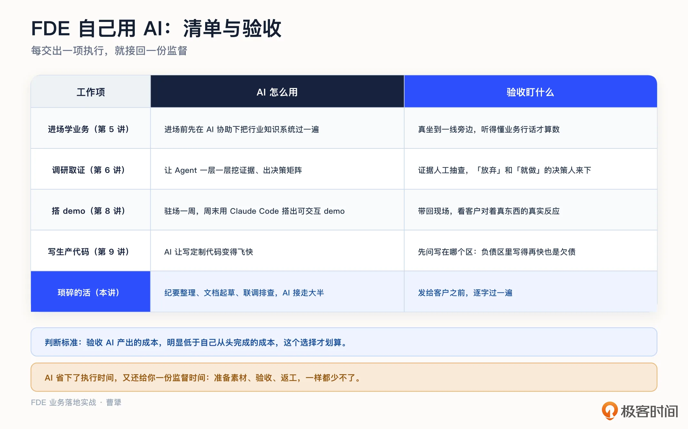
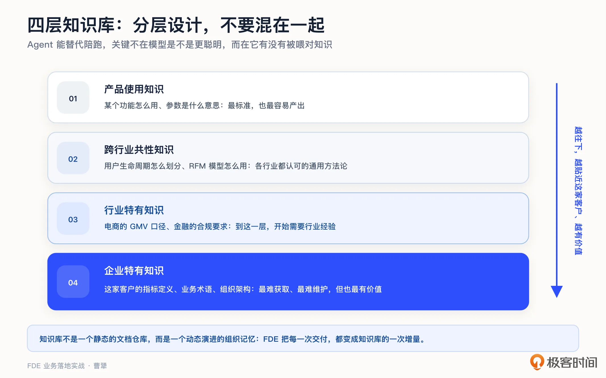
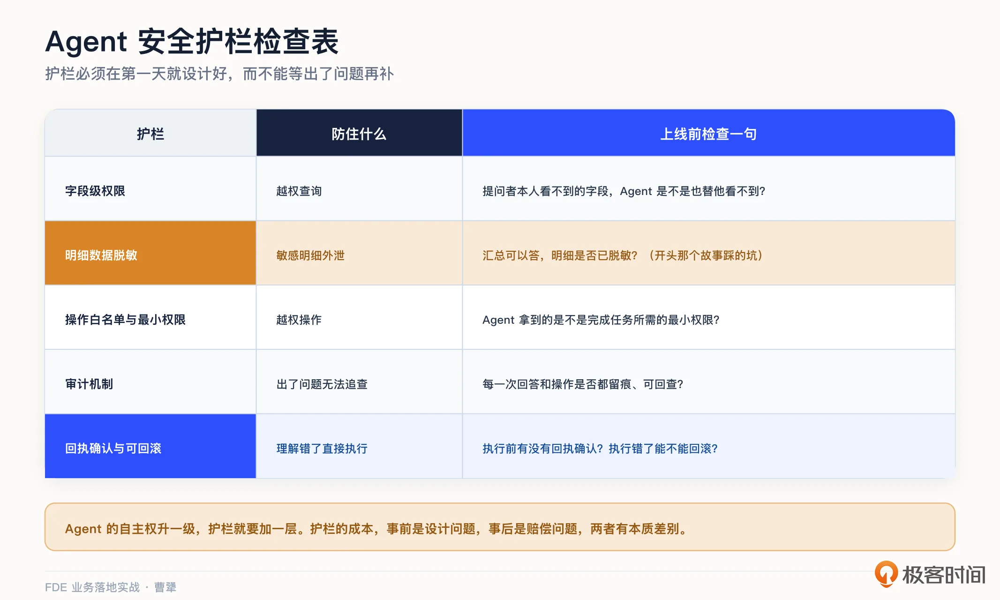
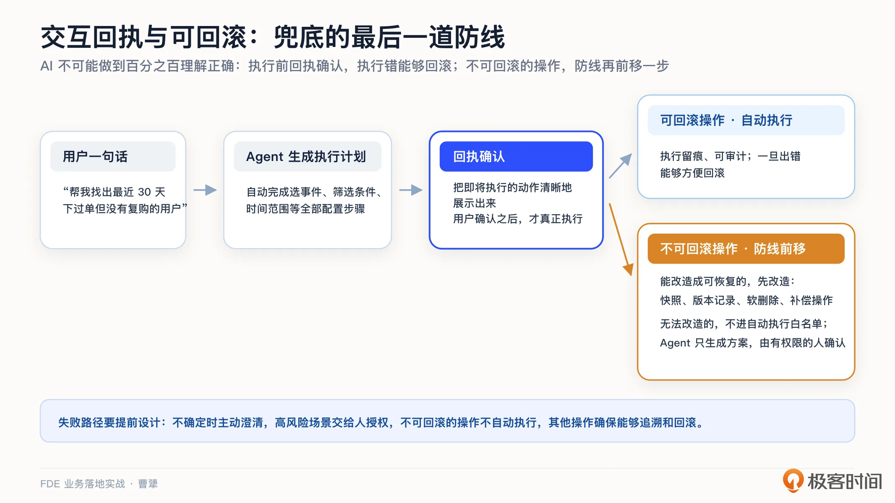
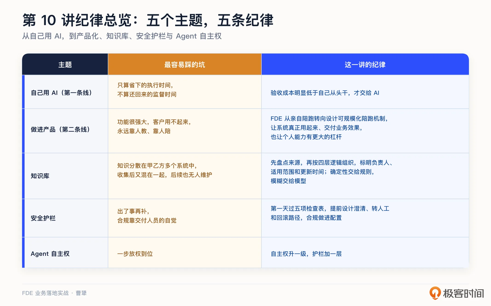

# 10｜现场施工（下）：用 AI 放大交付，守住数据安全红线
你好，我是曹犟。

在开始这节课程之前，先说一件我前几天刚遇到的事。一个朋友的公司来神策演示他们的 AI 产品。在演示过程中，他们的 Agent 把一个数据问题回答得很准确。这本来应该是一件好事，但我却发现，它把不该展示、甚至不应该获取的一些明细数据，也一并展示了出来。问题答对了，却击穿了红线。我当时在现场的评价是四个字： **不可接受**。

为什么一开始要提这件事呢？因为它正好说明了这一讲的核心主题之一：数据安全的底线。在上一讲，我们讨论了现场施工的上篇。填 gap、写生产代码，都是具体项目中的扎实基本功。这一讲则要讨论施工的下篇：AI 时代的新做法。AI 在交付现场可谓是一个放大器，一方面能把交付效率放大好几倍，另一方面也能把一个小疏忽放大成一场大事故。所以，在这一讲，我们会讨论两件事：怎么放大交付，怎样守住底线。

AI 对交付的放大，可以分成两条线。第一条线是 FDE 自己用 AI 辅助工作、提升效率；第二条线是把 AI 做进产品里，替代传统交付中需要人陪跑的部分。这两条线都在改写整个交付的成本结构。先看第一条线。

## 第一条线：FDE 自己用 AI 提升效率

回顾一下前面几讲中 FDE 的一系列现场动作，几乎每一步都离不开 AI。进场之前学习业务时，我们先在 AI 的协助下，把 Google、Meta 的广告知识系统地过了一遍。调研取证时，那份渠道决策矩阵，三层证据就是让 Agent 一层一层挖掘出来的。搭建 demo 时，节奏就是驻场一周获取认知，然后周末用 Claude Code 搭出可交互的 demo，第二周带着它再次进场。编写生产代码时，AI 让编写定制代码变得非常快，快到我们需要专门提防把代码塞进负债区的诱惑。

还有一些不太起眼的工作，比如整理访谈纪要、起草方案文档，以及在集成联调时对照日志查找数据不一致的原因等等，AI 也能承担大半。每一项可能都不算惊人，但加在一起，可以显著压缩整个交付周期，节省交付成本。

一些国外团队的案例也能印证这种变化。第 7 讲提到过 Anthropic 对外部署团队的做法。他们分享过完整的交付节奏：五到六周走完一个周期，第一周做用户访谈，第二周设计评估，第三、四周搭建 prompt 和 Agent，第五周灰度上线。放在传统企业级软件的世界里，五六周可能连需求评审都没有走完。AI 不只是让编写代码变快，它把整个交付节奏都改变了。

不过，第一条线还有另一项容易被忽略的成本： **监督时间**。AI 省下执行时间的同时，也增加了一类新的时间投入。Glean 旗下的研究机构今年发布过一份报告，调查了美英澳 6000 名数字工作者。调查发现，他们平均每周要花 6.4 个小时，给 AI 补上下文、检查输出、纠正错误。报告给这类工作起了一个名字，叫 botsitting：盯着 AI 工作，就像照看孩子。这和我的体会基本一致：不管是写作、Coding、方案设计等任务，使用 AI 省下的执行时间，有一部分会以准备素材、验收和返工的形式还回来。所以，哪些工作适合交给 AI，我有一条判断标准： **验收 AI 产出的成本明显低于自己从头完成的成本，这个选择才划算。**

放到 FDE 的交付现场，这条标准每天都用得上。让 Agent 查数据、写代码、做调研之前，可以先问一句：这个结果是否容易验证？代码运行一遍测试就知道对错，可以放心交给 AI；一份要发给客户的方案，需要逐字看完才敢发出去，省下的时间可能大半要在验收环节还回去。

## 第二条线：把 AI 做进产品，让陪跑规模化

第一条线只是让 FDE 自己的工作变快。更根本的放大，是把 AI 做进产品里，让原来依赖人的陪跑也能规模化。

To B 交付一直有一个老问题：太依赖优秀的人，也就是那些既懂系统、又懂客户业务的专家。。系统安装好了，客户却用不起来，没有真正的业务效果，只能靠人教学和陪伴。但是，优秀的人成本高昂，这种商业模式下边际成本难以随规模扩大而降低，同时，经验还只能留在少数人的脑子里，很难在组织中固化、扩散和传承下来。我们前面几讲反复提到的驻场和陪跑困境，根本原因都在这里。客户那句经典的抱怨“功能很强大，但我们用不起来”， **本质上就是缺少一个把功能转化成方案的人**。以前只能靠人来补位，变成了类似于咨询公司的玩法，而 AI 第一次让这种模式有了规模化的可能。

举一个我们自己产品里的例子。以前在神策分析系统里创建一个用户分群，需要走五步：选择事件、设置筛选条件、配置时间范围、选择用户属性、保存命名。一个新手可能要接受半天培训才能学会。我们把上面这些能力整合成了一个增长 Agent，目前在部分客户那里测试，用户只需要说一句“帮我找出最近 30 天下过单但没有复购的用户”，它就能自动完成所有步骤，还会把配置逻辑展示出来，让用户确认。

类似的还有指标异常解释：某个指标突然下跌，Agent 会自动分析可能的原因、给出初步判断，不再需要等待分析师排期来追踪这个问题。再比如权限和血缘问答，血缘说的就是数据的来龙去脉。想知道某个指标是怎么计算的、谁有权限查看，问一句就能知道，不用再翻文档、找系统管理员。

顺带说明一下，怎么衡量这类 Agent 做得好不好。我们自己主要看四个指标：第一是查询和创建的成功率，也就是用户发起的请求有多少能正确完成；第二是平均响应时间；第三是用户转化率，也就是原来只能找 BI 团队的人，现在有多大比例能自己用 Agent 解决问题；第四是满意度。

这四个指标分别从不同层次对 Agent 进行衡量，都不是单纯的模型分数。查询和创建成功率、响应时间，属于任务执行指标；用户转化率和满意度，属于使用和采纳指标。再往上，才是业务效果有没有真正发生。系统层怎么评估，下一讲会专门展开；业务效果怎么进入交付和定价，第 15 讲再讨论。

把创建分群、异常解释、权限和血缘问答这类功能做成 Agent，看起来只是几项产品功能上的改进，却会直接改变交付的三个核心指标。

第一是 **席位渗透率**：同样一个客户，能把系统用起来的人可能从 10 个变成 100 个。

第二是 **实施和培训成本**：新客户的上手时间大幅缩短，原来需要驻场老师傅手把手教的部分，很大一部分可以交给 Agent。

第三是 **支持工单数量**：很多简单问题不再需要人工响应。

这三项变化合在一起，说明交付中最难规模化的陪跑部分，第一次有了可以规模化的替代方式。更重要的是，AI 把陪跑人员的能力产品化以后，让客户更有可能自己真正把系统用起来，从交付一套工具走向交付业务效果。到了第 15 讲，我们再继续讨论：交付目标变成业务效果之后，FDE 应该怎么定价。

这也是为什么，神策这样一个原本卖分析、运营等增长工具的软件公司，现在自己办公室墙上印刷的三年产品愿景，变成了“打造 L4 级别的 AI Growth Team”。这个 L4，参考的是智能驾驶行业的分级说法：L4 级别的自动驾驶，在限定场景里基本不需要人来开，只有极少数情况才需要人来介入。放到增长这件事上，就是绝大部分增长工作由 AI 完成，人只做少量的监督和决策。对商业模式的设计，则变成了“从交付工具，到交付工作量，再到交付增长效果”。

在这样的转变下，FDE 的工作重点也会发生变化。过去，FDE 需要亲自教客户使用系统、处理问题，甚至承担一部分陪跑的工作。而把 AI 能力做进产品以后，FDE 仍然要留在现场，但重点不再是亲自完成每一次陪跑，而是识别哪些陪跑工作可以被产品化，把现场积累的判断和做法变成 Agent 能使用的知识、流程和规则，再持续观察客户是不是真的用起来、有没有产生业务效果。简单来说， **FDE 要从“亲自陪跑”，转向“设计一套可以规模化陪跑的机制”**。

这对 FDE 自己的职业发展也很有利。过去，一个 FDE 的影响范围，往往受限于他能亲自服务多少客户；当他将经验做进产品和 Agent，同一套判断就可以在更多客户、更多场景中反复使用，他的个人能力也就有了更大的杠杆。FDE 的价值，不再只体现在自己解决了多少问题，也体现在他能让多少问题从此不再依赖某个具体的人。另外，亲手研发 Agent 产品，让更多客户能真正用起来，通常也比长期陪跑少数几个客户更有成就感。

从 AI 落地最后一公里的角度来看，Agent 能不能回答问题只是起点。它还需要理解这家客户的业务，进入用户原有的工作流程，在权限边界内稳定运行，并且最终产生业务效果。前面讨论的客户使用和业务效果，加上后面要讲的知识库和安全护栏，合在一起，才构成了这最后一公里。

当然，我们自己的实践也还在路上。这个增长 Agent 目前在部分客户那里测试，反馈虽然还不错，但也暴露出很多需要优化的问题，特别是知识库的组织和上下文的理解。这也正是接下来要展开的内容。

## AI 的引擎在知识库：四层知识不要混在一起

Agent 能不能替代陪跑，让客户用好系统？关键不在模型是不是更聪明，而在它有没有被喂对知识。

我自己的一组第一手数据可以说明这个判断。神策有一个叫 MetricAgent 的查询 Agent，专门把自然语言变成准确的数据查询，现在运行在十多家客户的环境里。同样的 Agent，背后同样的模型，在内部场景的准确率大概是 99%，到了客户环境就降到 90% 左右。中间这 9 个百分点，差在哪里？差在不同客户知识库和指标口径的成熟度，模型能力反而不是主要矛盾。我们换过不同的一线模型，在这个场景下都完全够用。

前段时间，我给一家几千人的互联网公司的数据团队做分享，最后给出的判断是：模型已经足够聪明了，真正的天花板是你的知识结构。知识库构建也是 FDE 在交付实践中踩坑比较多的地方，所以需要单独讨论。

在真正构建知识库之前，相关知识往往分散在乙方和甲方的不同系统里：有的在乙方的产品文档、帮助中心和工单系统里，有的在甲方的数据平台、业务系统和内部文档里，还有一些只存在于交付人员和业务人员的经验中。FDE 首先需要把这些分散的知识盘点出来。

完成盘点以后，下一步才是按照统一的逻辑分层组织。以我自己最熟悉的用户行为分析为例，我们一般分成如下四层：

第一层， **产品使用知识**：某个功能怎么用、参数是什么意思。这一层最标准，也最容易产出。

第二层， **跨行业共性知识**：用户生命周期怎么划分、RFM 模型怎么用。这一层是领域内的通用方法论，各行业都通用。

第三层， **行业特有知识**：电商行业的 GMV 口径、金融行业的合规要求。到了这一层，就开始需要特定行业的经验了。

第四层， **企业特有知识**：这家客户的指标定义、业务术语、组织架构。这一层是最难获取、最难维护的，但也最有价值。

四层知识的优先级和应用场景都不一样，需要分别设计。

真正的难点除了把知识放进知识库之外，还有一个就是让 Agent 面对具体问题时准确调用知识。我们在自己的实践过程中踩过这样三个坑：

第一个坑是 **长尾复杂场景**。上一讲提到过，两成场景会消耗八成精力，不仅仅集成迁移如此，知识库也如此。解决办法不是多堆文档，而是要把复杂场景拆成结构化的“场景到解法”映射：什么样的问题组合，对应什么执行步骤，又有哪些边界条件，要明确记录下来，而这些知识只能在真实使用中一点点沉淀。

第二个坑是 **上下文缺失**。用户问“上周的数据怎么样”，Agent 不知道他关心哪个指标。解决办法是在知识库里维护用户画像：这个人是什么角色、日常关注什么指标、最近在看什么报表、曾经问过什么问题，有点类似于一些个人通用 Agent 的 Memory。有了用户画像，Agent 就可以直接给出他大概率想要的答案，或者在置信度不够时给出明确的澄清选项。

第三个坑是 **口径差异**。同一个 GMV，销售部门和财务部门的定义可能不一样，Agent 很容易答错。解决办法是在企业特有知识这一层做多口径管理。Agent 根据提问者的部门背景，用对应的口径回答；或者把两个口径都列出来，同时说明差异。

除此之外，我们还有一条工程原则：AI 加规则，双重兜底。 **确定性的事情交给规则，模糊的事情交给模型**，两者都不能单独运行。还是拿创建分群举例：理解用户想圈什么人，交给模型；生成的配置中事件名对不对、属性存不存在、时间范围合不合法，交给规则引擎逐项校验。模型负责理解意图，规则负责校验边界。

还有一个问题值得想清楚：知识库由谁来持续维护？答案恰恰是 FDE 自己。FDE 在现场沉淀下来的场景解法、指标口径和用户画像，都是知识库的素材。这也是 FDE 和传统实施的另一个区别：传统实施交付完就离场，FDE 则把每一次交付都变成知识库的一次增量，当然，这个积累的过程要满足数据脱敏、客户授权等合规要求。

要让知识库持续运转，每条知识至少还要标明四类维护信息： **知识来源、负责人、适用范围和更新时间**。尤其是指标口径、权限规则和合规要求，这类知识一旦过期，可能比没有知识更危险。

而哪怕项目结束，FDE 离场之后，也应该为客户提供对应的工具或者产品，让客户自己能够持续维护，不让知识库构建变成一个一次性工程。

从这个角度来看，知识库不是一个静态的文档仓库，而是一种动态演进的组织记忆。它会随着使用不断积累。当知识积累到一定程度，知识库就不只是一个工程组件，还会成为资产，甚至成为护城河。这个话题会在第 14 讲专门讨论。

## 安全红线：护栏要在第一天焊死

现在回到开头我讲的那个真实故事。

那次的问题出在哪里？Agent 的回答质量没有问题，问题是它越权了：提问的人原本无权查看那些明细数据。这就是 AI 放大器的另一面。过去查看数据，需要一个界面一个界面地翻，权限相对比较容易控制；现在一句话就能把数据“问”出来，任何权限缺陷都会被 AI 迅速放大。

为什么我会用“不可接受”这么重的词？因为 **在** **To B** **行业，数据安全就是生死线**。客户把最核心的业务数据交给你，这是我们信任的顶点。这种信任，一次事故就可以清零，而且再也无法恢复。效果不好可以改，数据泄露了却无法撤回。

所以，护栏必须在第一天就设计好，而不能等出了问题再补。我们自己的护栏最初是三件套：权限控制、数据脱敏、操作白名单。在这一讲里，我把它扩展成一张五项检查表，AI 功能上线之前可以逐项检查。

第一， **字段级权限控制**：Agent 的数据访问要继承提问者本人的权限，精确到字段。提问者看不到的数据，Agent 也不能替他看到。

第二， **明细数据脱敏设置**：汇总可以答，明细数据是否要脱敏，这是开头那个故事所踩的坑。

第三， **操作白名单和最小权限设置**：把 Agent 能执行的动作列入白名单，只给它完成任务所需的最小权限，不增加任何额外权限。

第四， **审计机制**：Agent 的每一次回答和操作都要留痕。出了问题，能够查到问题在哪一步，原因是什么。

第五， **回执确认与可回滚机制**：AI 不可能做到百分之百理解正确。执行任何操作之前，要把即将执行的动作清晰地展示给用户确认；一旦执行错误，还要能够方便地回滚。这一条很容易被省掉，但恰恰也是兜底的最后一道防线。需要注意的是，很多系统中的很多操作本身不可回滚。对于这类操作，防线需要进一步前移：能通过快照、版本记录、软删除或补偿操作改造成可恢复的，先完成改造；确实无法改造的，默认不放进 Agent 的自动执行白名单，只允许 Agent 生成操作方案，由有权限的人确认或者亲自执行。

把这五项放在一起看，Agent 失败后的处理路径也需要提前设计清楚：不确定时主动澄清，高风险场景交给人授权，不可回滚的操作不自动执行，其他操作则要确保能够追溯和回滚。

真正可落地的 Agent，不只是成功时能完成任务，还要知道什么时候不能继续自动执行。

除了这五项，还有一条容易被忽略： **合规和访问控制要做进配置**。不同客户的合规要求千差万别。金融客户要求明细数据不出域，有的客户则要求定期清除对话记录。把这些要求做成 Agent 的配置项，交付时根据客户要求打开对应的开关，比依赖交付人员“记得处理”可靠得多。能力要长在产品里，而不是长在人身上。

还有一条原则跟自主权有关：Agent 的自主权越大，风险也越大。Agent 答错一句话，用户还可以自己判断；将来进入代运营阶段，Agent 直接替客户做决策、执行动作，数据权限、模型偏差、决策可解释性，每一项都要在设计之初想清楚。所以，权限要跟着自主权走。自主权升一级，护栏就要加一层。Vaughan 在书里也专门提出，要给 AI 系统建立威胁模型，把它当作一个新的攻击面。这个思路和我们的实践是一致的。

最后需要说明的是，这一讲讨论的是工程级护栏，是 FDE 自己动手就能做的。再往上，还有组织级治理：风险怎么分类、谁来负责、怎么通过审计、怎么应对监管。这是一整套体系，也是强监管行业客户最看重的内容。我们会在第 12 讲讨论上生产时专门展开。

## 课程总结

这一讲我们讨论的是现场施工的下篇。回到贯穿实战篇的整条人与 AI 的分工线：AI 负责放大交付，替代原来需要人陪人的工作；但交付放大到什么程度、哪些数据红线不能碰、Agent 的自主权给到什么程度，这些判断 AI 不能替你做。它是放大器，不是决策者。方向盘始终握在人手里。

我把这一讲的要点，按主题、最容易踩的坑和对应的纪律，整理成一张表，供你参考：

如果你想转型 FDE，这一讲需要记住的是：AI 时代的交付工程师，一半功夫在提示词和知识库，另一半功夫在权限和护栏。只会前一半的人只能做 demo，都会的人才能上生产。

对交付和实施同学来说，四层知识库可以直接拿去使用。下次整理客户材料时，可以先盘点这些知识目前散落在哪里，再问一句：这条知识属于哪一层？完成盘点、分层和积累，就相当于提前在为下一个客户节省时间了。

对 To B 创业者和技术决策者来说，那张安全护栏检查表，建议在第一个 AI 功能上线之前就过一遍。护栏的成本，在事前是设计问题，在事后是赔偿问题，两者有本质的差别。

施工的上下篇都讨论完了，系统能运行了，AI 也能替代人陪跑了，相应的护栏也焊上了。但还剩下一个问题：这个 AI 系统到底“好不好”，由谁来判断？客户觉得“还行”算不算数？下一讲，我们就来讨论评估驱动开发：AI 项目到底怎么定义“好”，又该如何验收。

## 思考题

留两个问题，欢迎你在留言区聊聊。

第一，如果把你现在维护的客户知识按四层进行划分，哪一层最厚？哪一层几乎是空的？空的那一层，是不做也行，还是还没来得及做？

第二，你的 AI 功能上线之前，有没有做过一次“越权测试”，专门试试让 Agent 说出提问者本来无权看到的数据？如果还没做过，打算怎么补？

期待你在留言区分享你的思考。如果这节课对你有启发，也推荐你把它分享给身边更多朋友。