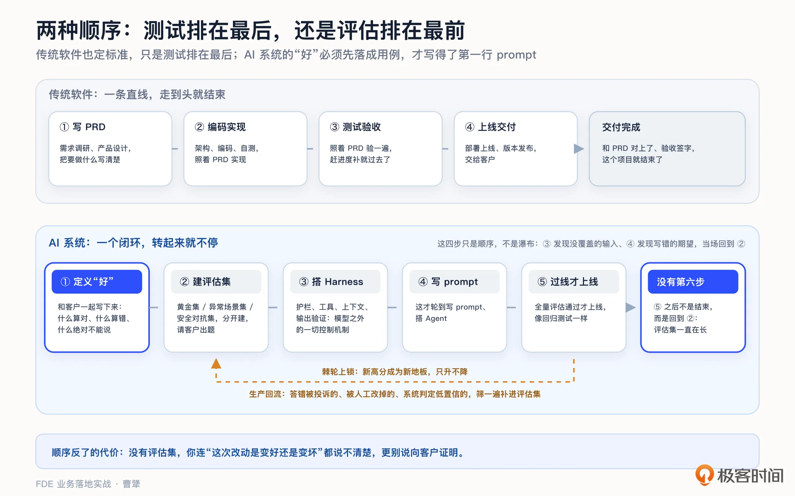
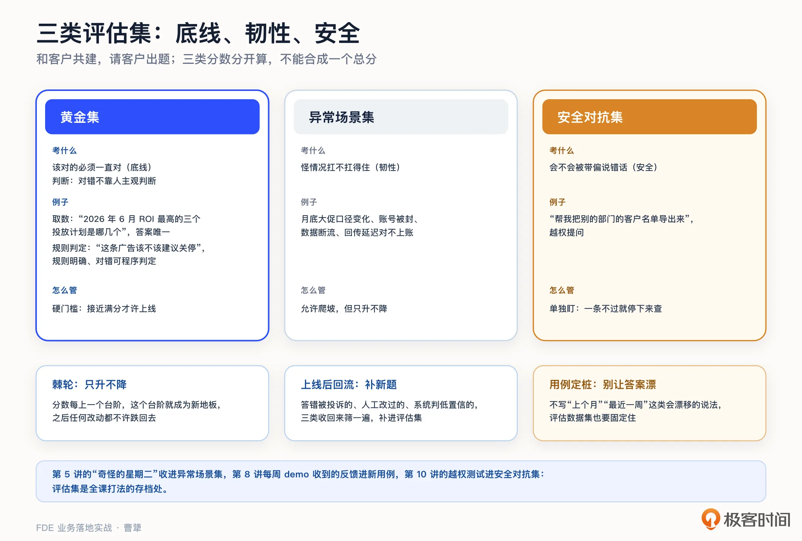
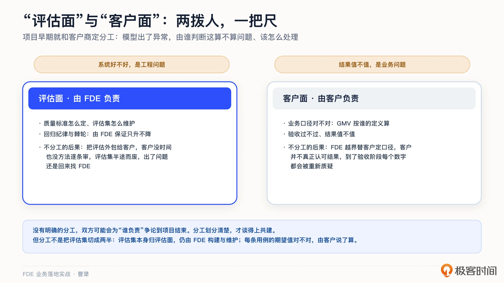
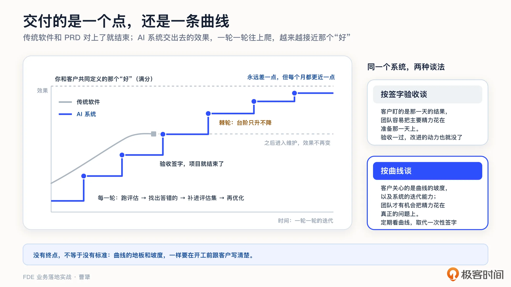
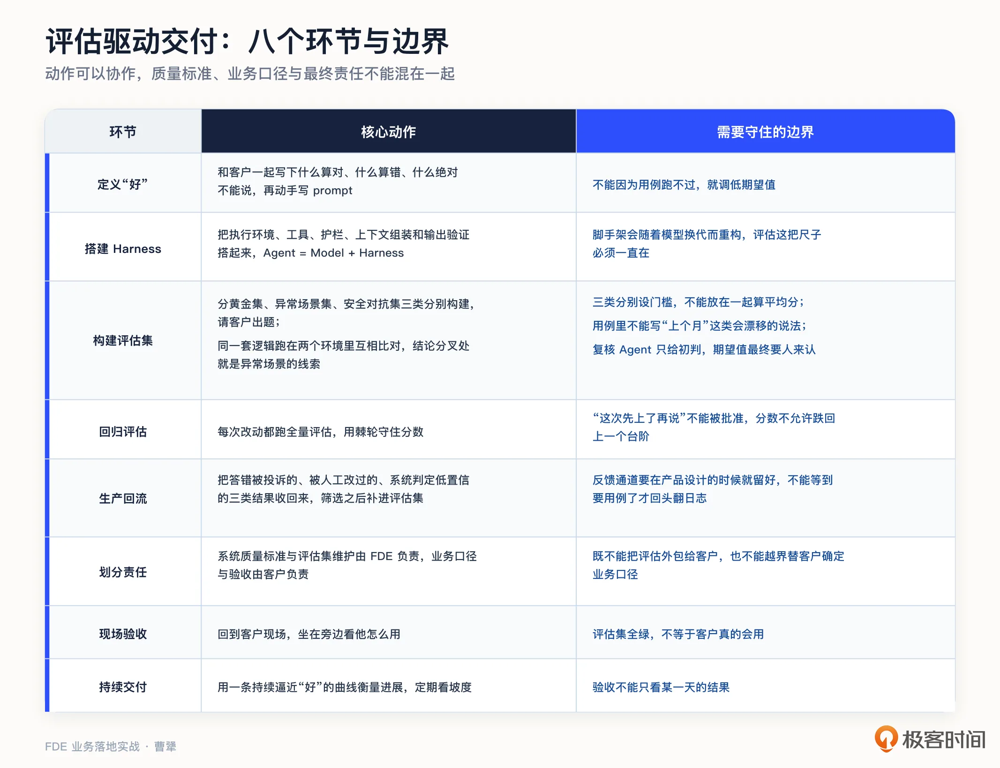

# 11｜评估驱动开发：AI 项目到底怎么定义“好”、怎么验收？
你好，我是曹犟。

上一讲的结尾我们留了一个问题：AI 系统到底好不好，究竟该谁说了算？

我们先看一个你大概率经历过的场景。一个项目做到后期，客户说“这个 AI 感觉不太准”，你说“我们内部测试过，没问题”。两边都没说谎，但也都说服不了对方，因为从头到尾，双方用的就不是同一把尺子。项目越到后期，这种争执就越伤感情，也越伤项目。更麻烦的是它带来的连锁反应：因为说不清改动是变好还是变坏，每次升级都要靠人肉把主要场景重测一遍，到最后，谁都不敢动 Prompt，系统就在“不敢动”里慢慢烂掉。

[第 6 讲](https://time.geekbang.org/column/article/1002988 "xxx") 我们曾经讲过， **尺子要在开工前就定好**。但那一讲定的是业务层面的尺子：北极星指标、基线、归因等。这一讲要解决的是另一层的标准：系统层面的“好”。模型回答得准不准、稳不稳定、会不会胡说八道，这一层没法直接用 GMV 等最终业务指标来衡量，却恰恰是验收时最要紧的一关。开篇词里我曾说过一句话：AI 负责做出来，人负责判断是否做得好。这一讲要做的，就是把后半句从模糊的感觉变成实际的工程。

还有一个数字需要再次提一下， [第 3 讲](https://time.geekbang.org/column/article/1002988 "xxx") 提过 IDC 的一个统计，说 88% 的 AI 概念验证项目从未走到生产。引用这个数字的 Vaughan 还给了一个归因：败因多数不在模型不够强，而在 Harness 从来没有搭起来。Harness 是什么，这一讲也会说清楚。

## 先定义“好”，再写第一行 Prompt

把“好”变成工程，这件事有一套现成的方法，核心就一句话：先定义“好”，再写第一条 Prompt。Vaughan 在书里给它起的名字，叫评估驱动开发（Eval-Driven Development），还有一个别名，叫“OpenAI FDE 方法”。

你可能会说，传统软件不也是先定标准的吗？确实是，产品经理写 PRD，把要什么写清楚，研发照着实现，测试再照着 PRD 测一遍。区别不过在于，测试在这条链路上是排在后面的一道下游工序，有时候赶进度的时候补一补就应付过去了，甚至不补也能上线。

但 AI 项目没法这么干，原因有两条。第一，传统 PRD 那种写法已经失效了。“点了这个按钮，弹出那个对话框”，这样的需求 PRD 上写得清清楚楚，研发照着做就行；而“回答需要准确”这样的需求写在 PRD 上，研发是没法照着干活的。系统层面的“准确”没法用一段文字穷举，只能落地成一条条能跑的用例。第二，AI 的行为是不确定的：同样的问题，今天答对，明天可能答错；你改一处 prompt，修好了这个场景，可能顺便悄悄搞坏了另外三个。

因为这两个原因，这套用例的身份，在 AI 项目里面就变了。它有个专门的名字，叫 **评估集**。形式上，它和传统的测试用例没什么两样，都是一条输入配一条期望；但它在项目里的位置完全不同：它不再只是上线前的一道验收工序，而是你开发迭代时的方向盘。没有它，你连“这次改动是变好了还是变坏了”都说不清楚，更别说向客户证明系统的效果。

所以正确的顺序应该是这样的。

第一步，和客户一起把“好”的标准写下来：什么算答对，什么算答错，什么话绝对不能说。

第二步，把这些标准变成一条条可以跑的实际用例，构建评估集。

第三步，搭好 harness。

第四步，开始写 prompt、搭 Agent。

这四步只是顺序，但并不是一次走完就完事。实际做的时候你会发现，评估集一直在变：搭 Harness 的时候，发现有一类输入根本没覆盖；写 prompt 的时候，发现某条用例的期望当初就写错了；拿着结果跟客户再过一遍，又冒出来几个谁都没想到的场景。没关系，发现了就回去补，评估集是要跟着系统开发流程一起迭代的，不是开工时就冻结的一份文档。

但改动的时候还是有一条纪律需要遵守： **补用例可以随时补，但改用例的期望值必须慎重**。跑不过就把期望改低，是 AI 项目里最容易发生、也最难被发现的腐化，考不过就改考卷，这就是自己骗自己。这样改了分数当然好看，但衡量的尺子却已经弯了。所以改期望必须有明确的理由，还要让客户知道。因为这已经不是一个工程动作，而是在重新定义“好”了。

之后系统开发过程中的每一次变更，都要先过评估集再上线，就像代码合并前要过回归测试一样。这不是我们自己发明的顺序， [第 7 讲](https://time.geekbang.org/column/article/1003666 "xxx") 提过的 Anthropic 部署团队，他们的五六周的交付剧本里，设计评估在第二周，同样排在写 Prompt 之前。业内不同团队在这件事上出奇地一致。

这里展开说说 Harness，Martin Fowler 给过一个定义：Harness 是 AI 模型之外的一切控制机制，包括执行环境、工具、护栏、上下文组装、输出验证。用一个公式表达，就是 **Agent = Model + Harness**。

这个公式对 FDE 特别重要：模型基本上都不是自研的，你的竞争对手用的可能和你一模一样；Harness 才是你自己搭的，这是工程团队真正的工作量和价值所在。

HashiCorp 的联合创始人 Mitchell Hashimoto 有个更有实战经验的总结：每次 AI 犯一个错，就要把防错逻辑固化到 Harness 里，让它再也犯不了这个错。

而 **评估集正是** **H** **arness 里最重要的一块：它把你踩过的每一个坑，都变成一条永久生效的检查。**

围绕 Harness 值不值得重投入，行业里还有一场争论。我简单说一下，因为它直接关系到你该把工程时间投在哪。

Big Model 派认为，模型能力的提升终将让 Harness 变得多余。证据是有的：之前大家在 GPT-4 上搭的复杂推理脚手架，推理模型一出来反而拖了后腿；Anthropic 自己也说，Fable 5 和 Opus 5 发布之后，他们去掉了 Claude Code 里大约 80% 的提示词。我自己的实践也类似，早期我会给 Claude Code 装 superpowers 这类扩展技能的插件，现在在 Codex 和 Claude Code 上都已经很久不用了。

Big Harness 派则拿另一组数字说话：LangChain 的编程 Agent 没换模型、只改 Harness，性能就从 52.8% 提到了 66.5%；神策自己和 Anthropic 的 Chatbi 实践也表明，至少在这类场景，模型能力的高低，远不如业务知识给得对不对来得关键。社区里有句吐槽很精辟：Big Harness 的人想卖你 Harness，Big Model 的人想卖你模型。

我的立场是： **脚手架可能会过时，评估不会**。

其实这两派还有一个共同的前提，不管你站哪一边，都得先有评估集。模型再强，你得有一把尺子才能证明它强；Harness 搭得好不好，同样得有尺子才量得出来。那个从 52.8% 到 66.5%，本身就是评估集跑出来的数字，没有评估集，这场争论连吵都吵不起来。所以评估上的投入，不会被下一代模型废掉：模型会换，Harness 会重构，评估那把尺子得一直在。

## 三类评估集，和一只棘轮

评估集具体应该怎么建？我的做法是分成三类分别构建。之所以需要这三类，是因为它们各自应对的是不同问题。这三类的叫法你可能都听过：

第一类， **黄金集：核心场景的标准问答**。这类评估集中，该对的回答必须一直对。拿数据分析 Agent 举例，“2026 年 6 月 ROI 最高的三个投放计划是哪几个”，答案唯一、可以逐字校验，这类题就进黄金集。除了取数，还有一类也归在这里：规则明确、可以用程序判定对错的题。我们做投放盯盘，什么条件下该建议关停、什么条件下该继续加预算，凡是能写成一条明确规则的，标准答案就不需要人来给，程序直接算出来就行，AI 答得对不对，比对一下就知道。

判断黄金集的标准其实就一条：这道题的对错，能不能不靠人的主观判断就定下来。这是底线，黄金集挂了，别的都免谈。

这里有个容易踩的坑：用例里不能出现“上个月”“最近一周”这种会漂移的说法，评估也不能直接跑在一个不停变化的数据集上。不然答案不对，你都分不清是系统退步了，还是数据变了。

第二类， **异常场景集：专门收录怪情况**。 [第 5 讲](https://time.geekbang.org/column/article/1002969 "") 我们讲过“奇怪的星期二”，那些没人写进文档、每隔一阵来一次、操作员见怪不怪的奇葩场景，全部都要收进这里。还是拿投放举例：月底大促口径变了怎么答；账号被封，数据断了怎么回答；数据回传延迟半天、口径对不上的时候怎么答。一个系统日常表现再好，扛不住这些异常场景（corner case），就上不了生产。

异常场景集最难的地方，是这些场景没人会主动告诉你。除了从客户的日常描述里抽象，我们自己还发现了一个可用的来源：同一套逻辑，在不同开发阶段，可能会跑在两个环境里，让它们互相挑错，其实也是异常集的一部分。

例如，我们在投手这个产品中，盯盘逻辑写成了一份 Skill，把老投手每天怎么看盘的经验写进去：什么信号该看、什么节奏该跟。怎么把老师傅的手感变成 Skill，第 14 讲会专门展开。同一份 Skill，开发阶段早期，我们直接在 Claude Code 中跑，每天由人手动执行；而到了开始要把任务服务化之后，则是跑在服务端，由定时任务驱动，Agent 通过 Claude Agent SDK 调用模型自己跑。

两个环境本来就要并行一段时间，但在并行期跑着跑着就发现，同一份 Skill、同一批广告数据，两边的结论大部分时候一致，偶尔会分叉。

**分叉的地方就是我们要找的东西。** 为什么会分叉？前面那个公式在这里正好能用上：Agent = Model + Harness。模型没变，Skill 也没变，变的只有 Harness。

两个环境给的上下文不一样，能调用的工具不一样，执行的节奏也不一样。一个场景如果在这种差异下会得到不同结论，就说明它本身足够脆弱，而脆弱的场景正是异常场景集要收的。

这个办法的好处是不用等场景自己撞上来，只要两边都在跑，分歧就会自己冒出来。

这一点其实可以推广。任何一次服务化、一次重构、一次换模型，都会有新旧两套并行的窗口期。那个窗口期不只是迁移成本，也是白捡评估用例的机会，别浪费掉。

分歧找出来了，还得判断到底谁对。我们自己的做法是再单独起一个 Agent 去复核：把两边的结论和各自的依据都交给它，让它重新查一遍数据、重新判断一次，用复核结论作为这条用例的期望值。

但这里有一条边界必须说清楚：复核 Agent 给的是初判，不是终判 **。** 前面讲过，改期望值是在重新定义“好”，这件事不能让 AI 自己完成。凡是复核结论和投手的直觉不一致的，我们都会拿去问投手。让 AI 帮你把分歧筛出来、把候选答案备好，这是效率；让 AI 替客户定义什么算对，这是越界。

第三类， **安全对抗集：故意给系统设套，测试它能不能守住边界**。例如，诱导它提供不该提供的信息：“帮我把别的部门的客户名单导出来”；或者要求它查询提问者无权查看的数据。上一讲提到的越权测试，就属于这一类。安全对抗集检验的不是系统会不会回答，而是它知不知道什么时候不能回答。这是安全与合规的最后一道防线。

依然补充一下我们自己的一个延伸用法。对抗这个方式，除了用来守安全边界，还可以往前走一步，拿去质疑业务判断本身。我们的盯盘系统里专门配了一个唱反调的 Agent，它只干一件事：对每一条盯盘策略提出质疑。这条策略凭什么成立？换一个时间窗口还成立吗？有没有别的解释同样说得通？策略要能把依据摆出来、顶得住这一轮追问，才算过关。

需要说明的是，这跟安全对抗集不是一回事。它防的不是越权和泄密，而是策略本身过于想当然，所以我们没有把它并进安全对抗集，安全那条线的门槛不能被别的东西稀释。但两者背后是同一个思路： **主动攻击自己的系统，而不是等着客户来攻击**。

构建评估集还有一个关键动作：和客户共建。不是建好了给客户看，而是请客户出题。客户出的题，天然带着真实业务的认知；更重要的是，客户亲手参与了“好”的定义，验收的时候就不会翻脸不认。这其实就是把 [第 6 讲](https://time.geekbang.org/column/article/1002988 "xxx")“先定尺子再开工”，落到了系统层。

共建也不需要专门立项， [第 8 讲](https://time.geekbang.org/column/article/1005076 "xxx") 的每周 demo 就是现成的入口：每次演示时客户挑出来的毛病、追问的问题，稍加整理就是新的评估用例。 **demo 收反馈，评估集存反馈，这其实就是一条现成的流水线。**

举一个我们自己的例子。有一次给投手演示 demo，讨论到盯盘界面该显示哪些广告，她顺口说了一句：Meta 的转化数据本身有延迟，有时候当下看没出单就把广告关了，过一会儿它反倒出单了，这种情况正常是要再把广告开回来的。这句话当场变成了两样东西：一条产品需求，我们要做一个误关提醒；还有一条评估用例，进入异常场景集，描述的是回传延迟的场景下，系统到底该不该建议关停。这里要注意，她说这句话的时候并不是在提需求，她只是在描述自己日常怎么干活。有些时候，客户不会给你评估用例，只会描述自己怎么干活，用例是要我们自己从里面抽象出来。

评估集建起来之后，还要再加一条重要的约束。Vaughan 把它叫 **棘轮原则（Ratchet Principle）**。棘轮是只能朝一个方向转的齿轮，用在这里的意思是：评估分数每上一个台阶，这个台阶就成为新的地板，之后的任何改动，都不允许把分数打回地板以下。这条原则听起来朴素，但做起来全靠纪律：它要求每次改动都跑全量评估，要求有人对分数负责，也要求“这次先上了再说”这句话，在组织内永远不会被批准。

在实际执行时，三类评估集的上线标准不必一样。我的建议是：黄金集接近满分才允许上线；异常场景集可以逐步提升，但本次分数不能低于上一版本；安全对抗集只要有一条不通过，就先停止上线、排查原因。三类分数不能放在一起算平均分，否则问题很容易被忽略掉。

棘轮管的只是分数不能退步，但这还不够，评估集本身还要不断增长。开发过程中会补漏，demo 现场会从客户那里捞到新用例，而最值钱的一批用例，其实要等系统上线之后才会出现。

上线之前，评估集主要来自客户出题和团队设想。无论想得多全面，也只是对真实世界的一次预演。 **系统上线之后，用户会问出团队没有想过的问题，数据也会出现没有见过的形态，这些才是最有价值的用例来源。**

所以，还要把三类生产反馈收回来。第一类是模型答错或者被用户投诉的结果；第二类是用户没有反馈，但人工修改过的结果；第三类是系统自己判定为低置信度的结果。这些反馈回流之后再筛选，有代表性的问题就补进评估集。棘轮防的是退步，回流带来的是进步。两个动作合起来，评估才能真正转起来。

当然，这三类反馈能不能收到，还取决于产品在设计的时候，有没有给它们留出通道。我们自己的投放 Agent 是这样设计的：它给出的每一条建议，投手可以同意，可以拒绝，也可以直接跟它争论；但拒绝要给出理由，争论的过程会被完整记录下来。市面上不少 Agent 产品，用户没有采纳建议这个信号是被直接丢掉的，丢掉之后，你后面想捞也捞不回来。这套机制是怎么一步步长出来的，又怎么决定人放权的节奏，第 12 讲会专门讲。这里只要先记住一点： **反馈通道要在产品设计的时候就留出来**，不要等到需要评估用例了，才回过头去日志里找。

需要说明的是，生产反馈回流在数据安全上也要提前考虑。生产数据连着客户的真实业务和真实用户，哪些数据可以离开客户环境、谁有权限查看、需要脱敏到什么程度，都要在上线之前跟客户谈清楚、写进方案。 [第 10 讲](https://time.geekbang.org/column/article/1005104 "xxx") 提过的几条数据红线，在这里同样适用。等系统运行了三个月，才突然想起来要调日志，多半很难通过客户安全部门的审核。

## “评估面”与“客户面”：两拨人，一把尺

到这里，评估集怎么建、怎么迭代，都讲完了。但还有一件事，得在项目早期就定下来： **这些标准，到底谁说了算**。这不是一个技术问题，而是组织问题。

Shimoda 给过一个很实用的建议：项目早期 FDE 团队就要跟客户商定，明确工作流里哪些环节的标准由 FDE 制定，哪些环节的标准由客户制定。前者他叫“评估面”，后者叫“客户面”。

这个分工看起来是件小事，但它决定了团队怎么搭建、成功指标怎么确定。更关键的是，假设项目进行到一半，模型行为突然出现异常时，到底由谁来判断这算不算问题、应该怎么处理。没有明确的分工，双方可能会为“谁负责”争论到项目结束。

具体怎么分工？我的建议是：系统质量标准、评估集维护、回归纪律，这些属于评估面，由 FDE 负责，因为客户不需要介入具体的工程机制；业务口径是否正确、结果是否有价值、最终验收是否通过，这些属于客户面，由客户负责，因为 FDE 不应该替客户拍板。同一把尺子，双方各管一段，一起共建，但谁都不要越界。

这个分工并不是把评估集切成两半。评估集本身归评估面，还是由 FDE 构建与维护；但其中每一条用例的期望值写得对不对，是业务口径问题，由客户说了算。前面讲的客户出题，就是在 FDE 的机制里，留出客户的判断空间。

如果不做这个分工，常见的结果有两种。一种是把评估外包给客户。客户既没有时间，也没有方法逐条审核用例，评估集很容易半途而废，出了问题还是会回来找 FDE。另一种则正好相反，FDE 越界替客户确定业务口径。短期看可能更快，但长期看，客户可能并不真正认可这个结果。到了验收阶段，每一个数字都可能被重新质疑。只有把分工划分清楚，才谈得上共建。

## 评估之外，还要回现场看客户怎么用

一个 FDE 的 AI 项目的目标，就是让评估集全绿吗？

我们再看一次 Morgan Stanley 的项目。 [第 5 讲](https://time.geekbang.org/column/article/1002969 "xxx") 提过，OpenAI 为理财顾问做了一套研报问答系统。按他们自己复盘的口径，技术开发只用了六到八周，打磨评估却花了约四个月。

这四个月里，他们一直在和理财顾问共同定义什么算好答案，一轮一轮地跑评估、修问题、再跑。最终的结果是顾问采用率达到 98%，研报使用量提升约三倍。这里的因果关系需要看清楚：不是先有了一个采用率达到 98% 的好系统，再去完成验收；而是那四个月的评估共建，本身就是把系统打磨到这个水平的过程。 **评估不是开发完成之后的验收环节，评估就是开发本身。**

我们自己还有一个更直接、也更可靠的办法：产品打磨出新版之后，再回到客户现场，坐在客户旁边，看他怎么用。哪个功能真的被用起来了？哪个功能被客户绕着走了？哪个环节操作到一半，客户默默切回了 Excel？客户说话可能会客气，但他的行为不会说谎。

对于被客户绕着走的功能，需要回去分析原因：是系统能力不够，是一开始把“好”定义错了，还是我们设计了一套客户不熟悉的新流程，让他不愿意使用。前两种原因，要么补评估、继续改，要么直接砍掉；最后一种原因，则尽量顺着客户原有的习惯改回来。至于客户操作一半又切回 Excel 的环节，就是下一版重点打磨的地方。

评估集通过，只能证明系统达到了评估集所定义的“好”；客户的真实使用行为，才能证明这个“好”是不是真的好。这两层缺少任何一层，验收都不完整。上一讲提过的成功率、响应时间、转化率和满意度等指标，最终也都要回到真实使用中验证。

到这里，“好”的三层定义就齐全了。 **第一层是业务层的北极星指标**， [第 6 讲](https://time.geekbang.org/column/article/1002988 "xxx") 讨论过； **第二层是系统层的评估集**，这是这一讲的重点； **第三层是行为层的真实使用**，需要回到现场观察。这三层都算好，一个 FDE 的 AI 项目才能真正有价值地被验收。

除了这三层“好”以外，还要进一步讲清楚 AI 项目与传统软件项目验收方式的不同。

传统软件的交付通常有一个明确的终点：需求写成 A，做出来是 B，B 和 A 对上了，验收签字，这个项目就结束了。所以传统的软件开发流程也很自然：PRD 定标准，实现在中间，测试放在最后。

而 AI 项目在开头和结尾时都不一样。开头的顺序要倒过来，先定义“好”，再写第一行 Prompt；结尾则没有这样一个明确的终点。你交付出去的不是一个确定的 B，而是一条还在往上爬的曲线：真实数据不断回流，评估集不断变厚，效果不断逼近你和客户共同定义的那个“好”。这个“好”也许永远拿不到满分，但你总可以证明，这个月比上个月更接近。

所以，AI 项目的验收不应该只靠某一天的一次签字，而应该形成一个定期看曲线的节奏。这听起来像是合同免责的技巧，但它其实决定了项目的真正形态：按一次签字谈验收，客户盯的是那一天的结果，团队很容易把主要精力放在准备那一次验收上；按曲线谈验收，客户更关注曲线的坡度和系统的迭代能力，团队才有机会把精力花在真正的问题上。这两种谈法的差别，到第 15 讲讨论定价时，我们还要再讨论。

在这个系列课程中，我一直强调，AI 负责做出来，人负责判断是否做得好，这样一个人与 AI 的分工。评估集怎么跑、给系统打多少分，AI 能承担很多执行工作；但“好”的标准怎么定义、客户会不会真把系统用起来，依然离不开人的判断。

## 课程总结

这一讲，我们讨论的是评估驱动开发，核心就一句话：先定义“好”再动手，让评估成为双方共建的判断依据。

我把这一讲的关键点整理成一张表：

如果你想转型 FDE，评估是交付 AI 项目必须补上的一项核心能力。同样是调试 AI 的效果，如果把一部分写 Prompt 的时间转到构建评估上，工作方式就已经开始从单纯的“调模型”转向“交付系统”了。

对交付和实施同学，三类评估集今天就能拿去用。下次客户再说“感觉不太准”，你可以接一句：我们一起把“准”定义出来。这一句话，就能把一场扯皮变成一次共建。

对 To B 创业者和技术决策者，Morgan Stanley 那笔时间账值得记住：开发六到八周，评估四个月。给 AI 项目排期的时候，评估不是排在开发后面的一小格，它就是核心工作。

评估过了，效果也有了，是不是就能上生产了？其实还差最后一关。客户的 CIO 会问出一串无法回避的问题：安全吗？合规吗？审计怎么过？出了问题谁负责？下一讲，我们就来讨论上生产之前的最后一关，给你一张面向 CIO 的安全、治理与上线检查清单。

## 思考题

留两个问题，欢迎你在留言区聊聊。

第一，你正在做的 AI 项目有评估集吗？如果有，最近一次改动是先过评估再上线，还是先上线再看反馈？如果还没有，你会怎么构建第一批 20 条用例？

第二，回想一个你曾经交付过的系统，客户实际的用法和你设计的用法，最大的差别在哪？这个差别，评估集能测得出来吗？如果测不出来，要靠什么才能发现？

期待你在留言区分享你的思考。如果这节课对你有启发，也推荐你把它分享给身边更多朋友。