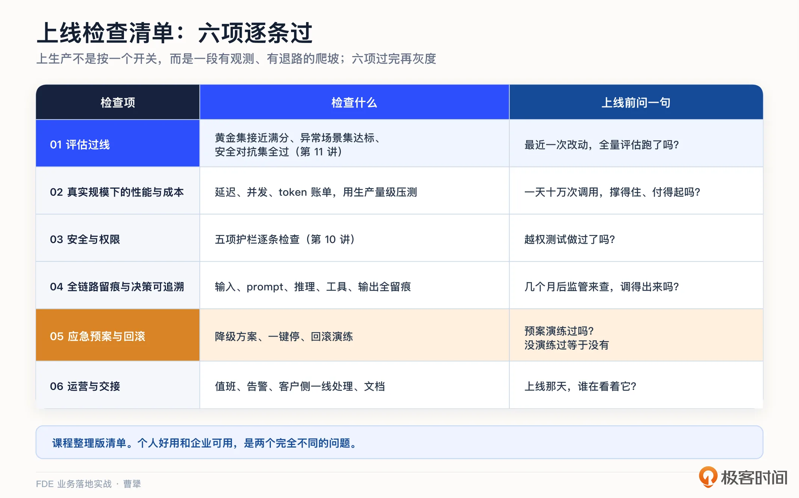
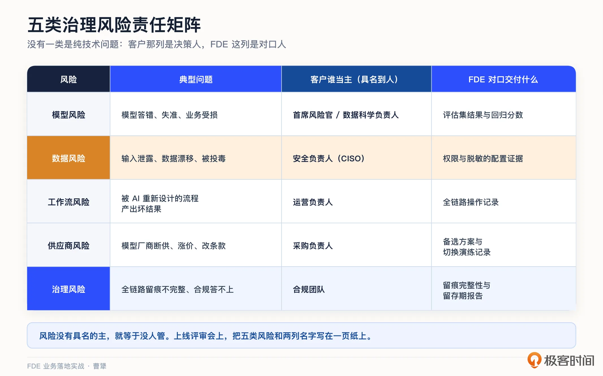
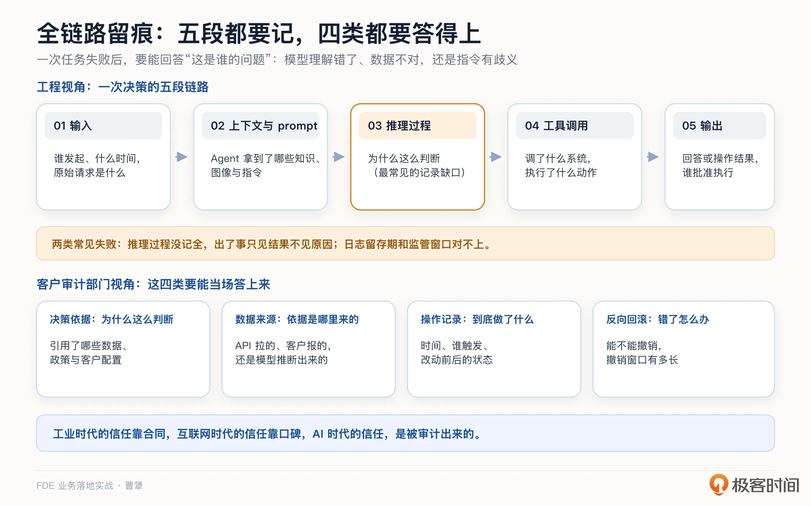
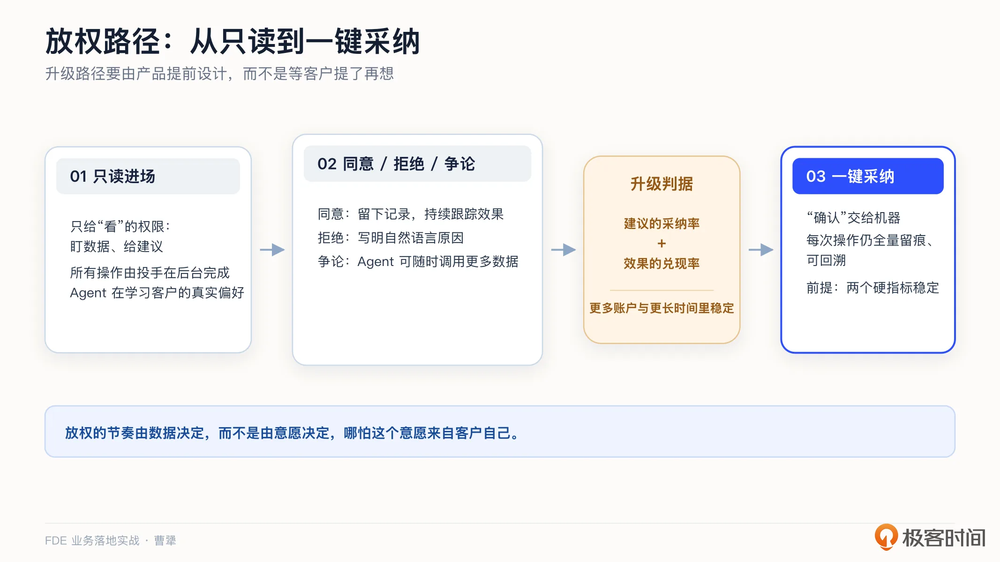
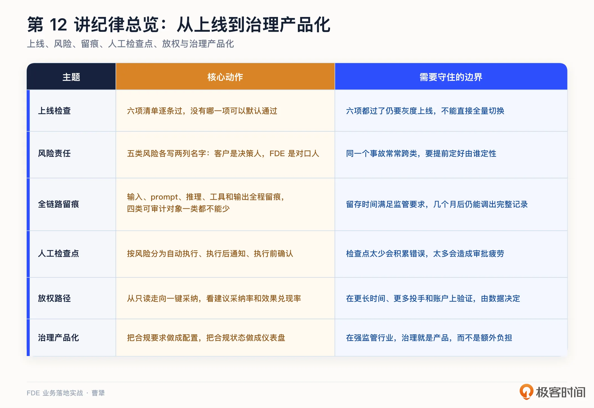

# 12｜上生产：一张让 CIO 放心的安全、治理与上线检查清单
你好，我是曹犟。

上一讲的结尾我们提到，评估过了，效果有了，还差最后一关。最后这一关，通常由客户的 CIO，或者安全、合规负责人来把关。他们不一定关心模型有多聪明，但是一定会继续追问：安全吗？合规吗？审计怎么过？出了事，谁来负责？

很多 FDE 团队都会在这一关出问题，而且通常不太服气：系统明明好用，为什么不让上线？我之前总结过一句话，也许可以回答这个问题： **个人好用和企业可用，是两个完全不同的问题**。个人用 AI 工具，出了错可以自己承担；企业使用 AI 系统时，系统连着真实的数据、真实的钱和真实的责任。CIO 不得不关心，不得不谨慎。

这一讲，我们就把“企业可用”拆开，整理成一张上线检查清单、五类治理风险、两项需要落实到系统里的能力，最后回到一个判断：在强监管行业，治理不是负担，治理本身就是产品。

## 一张上线检查清单

先说清单。Vaughan 在他的书中把生产就绪拆成六个检查维度，具体是哪六个，你可以去看他的原书。这里我给出来的是我们自己实践中总结出来的六项，未必和他一一对应，但有一点是一致的：上生产不是一个时刻，而是一组需要逐项完成的检查。

第一项， **评估过线**。黄金集接近满分、异常场景集达标、安全对抗集全部通过，这就是上一讲的内容，也是清单的第一项。

第二项， **真实规模下的性能与成本**。demo 十个人用，沙盒环境一百个人用，生产环境可能一万个人用；评估集跑一百条，生产环境一天可能跑十万条。延迟能不能接受，token 账单有没有核算过，都要在上线前用真实规模完整验证一遍。

第三项， **安全与权限**。第 10 讲的五项护栏，字段级权限、明细脱敏、白名单最小权限、审计留痕、回执回滚，逐条检查。

第四项， **全链路留痕与决策可追溯**。这一项后面会单独展开。

第五项， **应急与回滚预案**。大模型出了问题不响应时系统怎么降级兜底，Agent 出现异常时怎么一键停止，数据回滚方案有没有提前演练过。预案没演练过，约等于没有。

第六项， **运营与交接流程**。谁值班，谁接告警，客户侧谁来处理一线问题，相关文档是否齐全。系统上线那天，恰恰就是运营责任开始的那天。我们上一讲提过，AI 系统交付出去的不是一个确定的结果，而是一条还在往上爬的曲线。所以在这一项中还要多问一句：上线之后，谁负责把生产环境中暴露的问题回收到评估集？谁负责基于线上反馈持续改进系统的效果？如果这个责任人没有确定下来，曲线就会停在上线那天。

六项都通过了，也不要让系统一次性全上线。更稳妥的做法是灰度上线：先从小流量、低风险的部门和场景开始，运行一两周，确认观测数据没有问题再逐步放量。 [第 7 讲](https://time.geekbang.org/column/article/1002969 "") 提过 Anthropic 的交付剧本，第五周做的就是灰度上线和内部培训，而不是全量切换。上生产不是简单地按下一个开关，而是一个持续观测、随时可回退、逐步放量的过程。

这张清单看起来朴素，但它回答了 CIO 的前半串问题。至于“出了事谁负责”，清单回答不了，得靠治理。我理解的治理，就是把责任落到具体的人：每类风险都有负责人，出了事能倒查，高危动作必须有人签字。接下来我们一件件展开。

## 五类治理风险，每类都要明确负责人

我自己在神策创业，做了十一年 To B 企业软件，我们做一个数据系统，其中一个关键性的动作就是帮客户做数据治理。

数据治理与 AI 系统交付中、交付后的治理不完全一样，但从我的实践来看，它们也有一些共同点：治理不是约束，而是 AI 部署在客户严肃环境里的“合法性来源”。治理做得好，本身就是竞争力的一部分。

AI 部署的治理风险可以分成五类。我习惯把它列成一张表，一类风险一行，后面跟着负责人的名字。先说这五类分别是什么。

- 模型风险，也就是是模型答错、失准带来的业务后果，主要应该由首席风险官或者数据科学负责人负责。

- 数据风险，包括输入泄露、数据漂移、被投毒，主要应该由安全负责人负责。

- 工作流风险，被 AI 重新设计过的流程产出了错误结果，主要应该由运营负责人负责。

- 供应商风险，是模型厂商断供、涨价、无法满足承诺的 SLA、突然修改商务条款等，主要应该由采购负责。客户自己的供应商清单上可能只有你一家，但实际上你背后还站着一家模型厂商，客户通常看不见它，也对它没有控制权，但它一旦出问题，停摆的是客户的业务，客户肯定会要你负责。所以选模型不能只当成一次技术选型，要按管关键供应商的办法来管：做尽调、谈条款、留备选、演练切换。

- 治理风险，是全链路留痕不完整、无法回答合规问题，主要应该由合规团队负责。

拿我们自己的投放场景简单对照一下。Agent 给出的出价建议错了，导致预算浪费，这算哪一类风险？其实不一定。如果是模型对投放数据判断失准了，这是模型风险；如果模型判断本身没问题，是流程里少了一道复核，让一条本该有人过目的建议直接执行了，或者干脆就是上下文错误了，那就是工作流风险。同一个事故，归到不同的类别，要找的是不同的人。所以上线前要定好的不只是五个负责人，还有一条： **事故发生之后，由谁来给它定性**。

再看一个例子。模型 API 突然涨价或者限流，投放停摆，这是供应商风险，备选方案是什么、切换预案有没有演练过，需要有人提前准备好。

这五类风险没有一类是纯技术问题，每一类最终都回到一个组织问题：由谁负责。

你可能已经发现，上面这五个负责人，全都是客户那边的角色。那 FDE 团队承担什么？难道交付完了就把锅直接甩给客户？

当然不是。风险表其实要写两列名字。 **客户那一列是决策人**，风险真发生了，由他决定怎么处置，也由他向自己公司交代。 **FDE 这一列则是对口人**，负责让客户有条件作出判断：模型风险要有评估数据，数据风险要有权限和脱敏的配置证据，工作流风险要有全链路的操作记录。客户的首席风险官不可能凭空判断模型靠不靠谱，他看的是你交出来的这些东西。

这条合作的边界要在上线之前就说清楚。常见的误区有两种：一种是大包大揽，跟客户说出了事我们全兜着，真出了事兜不住，信任只会崩得更快；另一种是甩得干干净净，说系统只是给建议，决策是你们自己做的，客户会觉得你不能担事，下一期合同估计就没了。稳妥的做法是把该你承担的写进合同和 SLA，把不该你承担的在会上讲明白：业务决策的后果，最终只能由作决策的人承担。

这五个分类最有用的地方，其实是 **把每类风险都明确到人**。第 7 讲我们讲干系人地图时说过，地图上要写真名。治理也一样，风险没有明确到具体的人，就等于没人管。上线评审会上，把这五类风险和两列名字写在一页纸上，CIO 看到的就不再只是“我们很重视安全”，而是“出了事知道找谁，也知道要你们 FDE 补充什么”。

## 两项系统能力：全链路留痕与人工检查点

清单和分工要想真正发挥作用，不能仅仅靠流程和制度。

我们先看一个最容易出事的场景。某个 Agent 给客户发出了一封带着错误报价的邮件，事后复盘才发现，它有发邮件的权限，是三个月前某次配置留下的；它引用的那份价格表，早就过期了；中间没有任何人批准过这个动作。每一个环节单独看都不算离谱，但连起来就是一次客户事故。

注意，这三个环节分别对应前面那张表里的不同责任人：权限是安全的事，价格表过期是数据的事，没人批准是工作流的事。责任人名字都写上了，事故照样发生，但却没有哪一个人明显失职。 **分工能解决“出了事找谁”，解决不了“别让事发生”。**

为什么不能只靠流程和制度？因为过往管员工的那套体系，建立在人会自我约束的前提上：员工有职业声誉，有劳动合同，有法律法规的约束，知道哪些事不能做。但 Agent 没有这些，它不会害怕，也不懂得承担责任。原有的自我约束必须外置，变成系统里的硬规则。

这也是为什么治理最终必须是一套工程系统，而不是一份规章制度。

而要落到系统里，最关键的是两项能力： **全链路留痕与人工检查点**。

第一项，全链路留痕。我之前多次写文章讨论过，把它列为治理中最重要的工件之一：Agent 的每一次决策，从输入、上下文和 prompt，到中间的推理过程，再到调用了哪些工具，最终输出了什么，全程都要留痕。几个月后需要复盘时，这些记录还要能够完整调出来。留痕常见有两个坑：一是推理过程没有记全，出了事只能看到结果、看不到原因；二是日志留存期和监管要求的时间窗口对不上，该留三年的只留了三个月。

上面说的是链路，是工程视角。换成客户审计部门的视角，要的其实是四类东西。

**第一类，决策依据**，回答“为什么这么判断”：Agent 引用了哪些数据、哪些政策、哪些客户配置。

**第二类，数据来源**，回答“依据是哪来的”：它看到的数据，是 API 拉来的，是客户自己报的，还是模型推断出来的。

**第三类，操作记录**，回答“到底做了什么”：什么时间、谁触发、改动前后的状态分别是什么。只要会改变系统状态的写操作，创建、修改、删除，都要记，而且要连当时的触发上下文一起记，否则事后只能看到某个字段变了，看不出它为什么变。

**第四类，反向回滚**，回答“错了怎么办”：能不能撤销，撤销窗口有多长。

这四类少哪一类，都会在某个具体时刻让你下不了台。

这件事，我们自己感受很深。我们的投放 Agent 动的是客户真金白银的广告预算，所以从第一天起，我们就给它配了预算上限、动作白名单、全量操作日志和回滚机制。

我们内部还有一条原则：一次任务失败之后，要能回答“这是谁的问题”。是模型理解错了，是数据不对，还是人给的指令有歧义？没有全链路留痕，这个问题根本回答不了。

我之前表达过一个判断：工业时代的信任靠合同，互联网时代的信任靠口碑， **AI 时代的信任，是被审计出来的。** 事后看结果还不够，事中也要可解释。我们的实操体验是，花在“可审计”上的工程时间，很可能不比花在决策算法上的时间少，而这笔投入要提前写进预算。

第二项，人工检查点，也就是 Human-in-the-Loop，简称 HITL。不是所有动作都要人批，那反而会把人变成橡皮图章，只会点点点；也不是所有动作都默认放行，那会把所有风险直接暴露出来。更稳妥的做法是按风险分层： **低风险动作，比如查询、汇总，由 Agent 自主完成；高风险动作，则设置强制的人工确认**。

我们自己的分层很简单：调价、扩预算这类花钱的动作，必须人工确认；只读的分析动作，可以放开。实际落地时还可以再细一档，分成三级：自动执行、执行后通知、执行前确认。大多数动作放在前两级，把人的注意力集中在第三级。设置 HITL 需要把握好平衡：检查点设少了，错误会累积；设多了，人会产生审批疲劳，最后相当于没有检查。

这个分层并不是一成不变的。哪些动作能从“执行前确认”放到“自动执行”，什么时候可以放，产品需要提前设计好这条升级路径，而不是等客户提出需求之后再考虑。

我们在投放 Agent 上完整走过一遍。Agent 刚接入客户的广告账户时，我们只给了它“看”的权限。它 7×24 盯着数据，发现问题，给出调整建议，但所有操作都由投手自己在广告后台手动完成。为什么这么设计？并不是技术上做不到自动执行，而是在那个阶段，它还没有这个资格。它只掌握了广告投放的通用方法，但并不了解这家客户的预算节奏，不知道哪些品类正在清库存，也不知道老板对哪条产品线有特别的坚持。这些信息存在投手的脑子里，单看广告后台的数据是得不到的。

所以， **这个“只读期”并不是被动的等待期，它是 Agent 学习这家客户生意的必经阶段。** 一个跳过这个阶段、一上来就替客户执行的 Agent，既积累不了信任，也拿不到这些学习机会。

再往前走一步，是给建议设计响应机制。对 Agent 给出的每一条建议，我们给投手留了三种处理方式。第一种，同意，操作仍然由投手自己完成，Agent 记录这条建议被采纳了，并持续跟踪后续效果是否符合预期。第二种，拒绝，但投手需要给出明确的拒绝理由。第三种，争论，投手可以直接跟 Agent 讨论。比如，投手可以指出，这条建议没有考虑这周的促销安排；Agent 则可以继续获取数据，来支撑或者修正自己的判断。第 14 讲会专门讨论这些拒绝理由和争论过程如何被进一步构建成私有知识的护城河，因为它们比“同意”更有价值。

那么，什么时候可以升级权限，从“给建议”走到“替客户操作”？我们的判断不靠感觉，而是看两个指标： **建议的采纳率，以及采纳之后效果的兑现率。**

在驻场一个月后的某一天，客户投手直接采纳了当天 80% 的建议，剩下 20% 有分歧的建议，对齐数据口径之后也采纳了；前几天采纳的建议，效果也基本符合预期。然后投手反过来催我们：多久能上“一键采纳”，他不想再一条一条确认了。

但我们并没有顺势上线。原因很简单：那只是一个投手一天的盘面，不是常态，也不是所有投手的共同状态。而另一个指标，也就是兑现率，天然会更慢，一条建议执行下去，数据要过几天才能回流。我们希望这两个指标在更长的时间窗口、更多投手和更多账户上稳定下来，再把“确认”这一环节交给机器。

这件事给我的体会是： **放权的节奏应该由数据决定**，而不是由意愿决定，哪怕这个意愿来自客户自己。

最后跳出我们自己的实践，看一眼行业的方向。今天客户要管的，可能只是你交付的这一套系统；但要不了多久，他要管的就是几十个来路不同的 Agent。把留痕、身份、权限这些东西做成统一的基础设施，大公司已经动手了。

Pinterest 公开过他们内部的 MCP 治理：统一注册中心、两层鉴权、敏感系统按业务组开放权限、全量调用日志，一个月内有六万多次调用。微软走得更远，直接把这套东西做成了商用产品 Agent 365，定位就叫 Agent 的控制平面：企业里所有 Agent 进统一注册表，每个 Agent 分配一个唯一身份，管理员能看到它们的活动和健康状况，连员工私自装在电脑上的影子 Agent 也会被发现并纳管。

这些工作和模型能力没有太大关系，都是注册、身份、权限、日志这类看起来很“无聊”的管理工作。当大公司开始认真做这些工作，说明 Agent 正在从个人工具变成企业资产。这里对 FDE 还有一个需要考虑的地方：你交付的系统，将来大概率要接进客户的这套管理平面。身份能不能被统一管理，日志能不能被统一采集，最好在设计的时候就想到。

## 治理就是产品

我们把治理放到如金融等强监管行业的语境里看，这个判断会更清楚。不同国家和地区的强监管行业的监管要求目前正在快速成形：欧盟的 AI 法案按风险分级，美国则按行业各自设置，金融、医疗、政府各有各的合规框架。

很多团队把这当成坏消息，毕竟会额外增加很多交付上线的成本。但换个角度看， **监管越严的行业，越是 FDE 的主场**。因为在这些行业，谁能把治理做扎实，谁才能拿到入场券，而其他这方面有欠缺的团队则可能连入场资格都没有。在最受监管的行业，治理本身就是产品，就是核心竞争力。

神策以私有化部署起家，客观上，把类似于私有化部署、信创、审计、权限等适应强监管行业的广义上的能力，作为了产品的重要一部分来迭代与开发，这也是我们能够在银行、券商等典型的强监管行业占据使用领先地位的重要优势。对于这类行业来说，性能、功能等指标，很多时候都是要让步的。

神策的例子发生在 To B 软件时代，到了 AI 时代，这个判断同样成立，而且门槛只会更高。美国坦帕综合医院用 Palantir 的平台做败血症早期筛查，系统发出预警，再由医护人员判断和处置，也就是前面讲的人工检查点。按 Palantir 披露的口径，这套系统从 2022 年 8 月运行以来，估计挽救了 886 条生命，败血症早期死亡率下降了 68%。医疗是监管最严的行业之一，这个项目能跑起来，靠的不是绕开监管，而是把可审计、可干预做进了系统。

反过来看这件事会更有意思：监管最严的地方，AI 产出的反而是价值最高的那类结果。这个案例的完整复盘，我们会在第 17 讲展开；金融、政企、医疗各行业的治理做法，则放到第 19 讲专门讨论。

落到实操层面上，治理要做到产品能力，有两点需要着重注意。 **第一是配置**：第 10 讲说过，要把合规要求做进产品配置，根据客户要求打开相应的开关，而不是依靠人的自觉。国内政企场景的等保、信创要求，同样适用这个思路，第 9 讲讨论私有化时算过这笔账。 **第二是仪表盘**：把合规状态做成实时看板，留痕是否完整、检查点是否通过、留存期限是否合规，随时都能查看。CIO 要的不是口头承诺，而是随时可以查证的状态。

我之前还有一个判断：可审计性本身，可能会成为新的护城河。功能相对容易模仿，但一套让客户敢把真金白银交给 Agent 的审计与治理能力，没有那么容易复制。护城河这个话题，第 14 讲会专门讨论。

## 课程总结

这一讲，我们讲的是上生产，核心就一句话：个人好用和企业可用是两个问题，后者靠 **清单和治理** 来回答。

再回到我们一直提的人机协作的主线：AI 能自动执行低风险操作，也能给出各种建议；但这套系统能不能真正上生产，能不能通过合规检查，出了事由谁担责，这些判断仍然需要由人负责。

我把这一讲的关键点整理成一张表：

如果你想转型 FDE，可以把“带系统闯过 CIO 评审”作为自己的差异化能力。会调模型的人很多，真正能把完整系统平稳地推过评审、获得客户高层认可的人很少，而企业客户显然更愿意为后一种能力付钱。

对交付和实施同学，上线检查清单可以直接拿去作为评审模板。特别是第五项和第六项，也就是预案和交接，往往最容易被省略，也最容易出问题。

对 To B 创业者和技术决策者，我想强调一笔工程账：可审计性上的投入，很可能不比算法少。如果只把它当成成本，就会一直想省；如果把它当成护城河，才会乐于投入。

系统上了生产，效果也跑出来了，这一单是不是就算圆满了？对一般的交付团队，也许是；对 FDE，还没有结束。这一单里积累下来的能力和认知，怎么变成下一单的起点？下一讲，我们讨论怎么把碎石路修成高速公路，把单客户的成果沉淀成产品。

## 思考题

留两个问题，欢迎你在留言区聊聊。

第一，拿这一讲的六项清单，给你手头的项目打个分：哪几项是绿的，哪几项其实是空白？空白的那几项，是没想到，还是想到了但排不上优先级？

第二，如果明天客户的审计部门来查，要求调出某一次 AI 决策的完整过程，输入是什么、为什么这么判断、谁批准执行的，你的系统能在多长时间内给出答案？

期待你在留言区分享你的思考。如果这节课对你有启发，也推荐你把它分享给身边更多朋友。