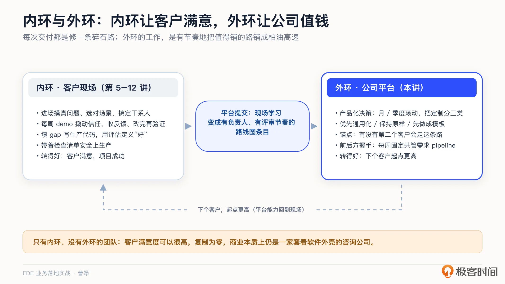
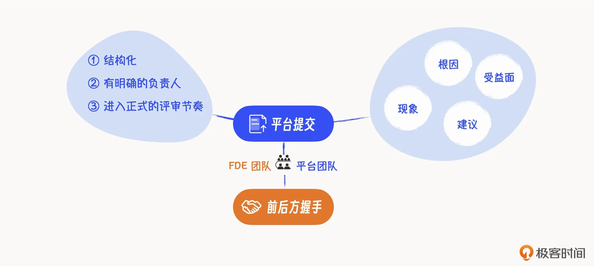
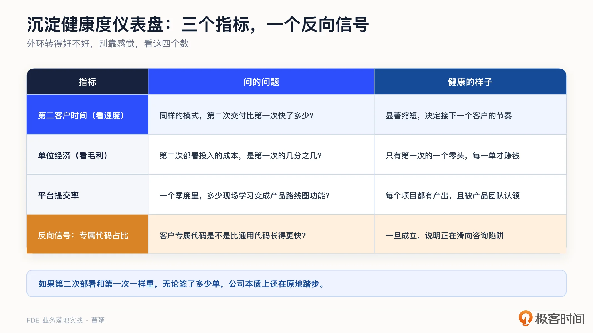
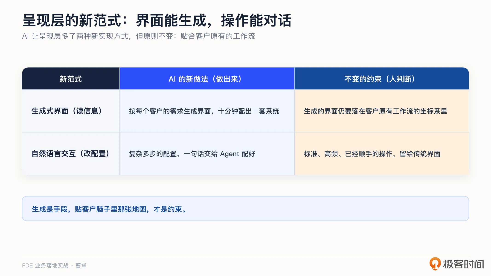
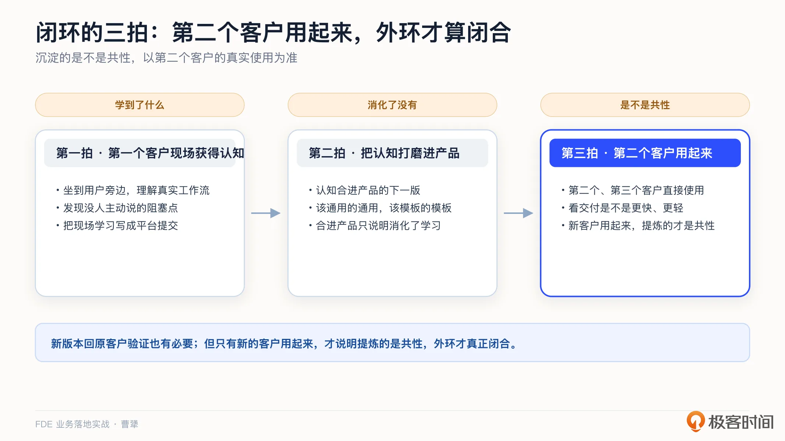
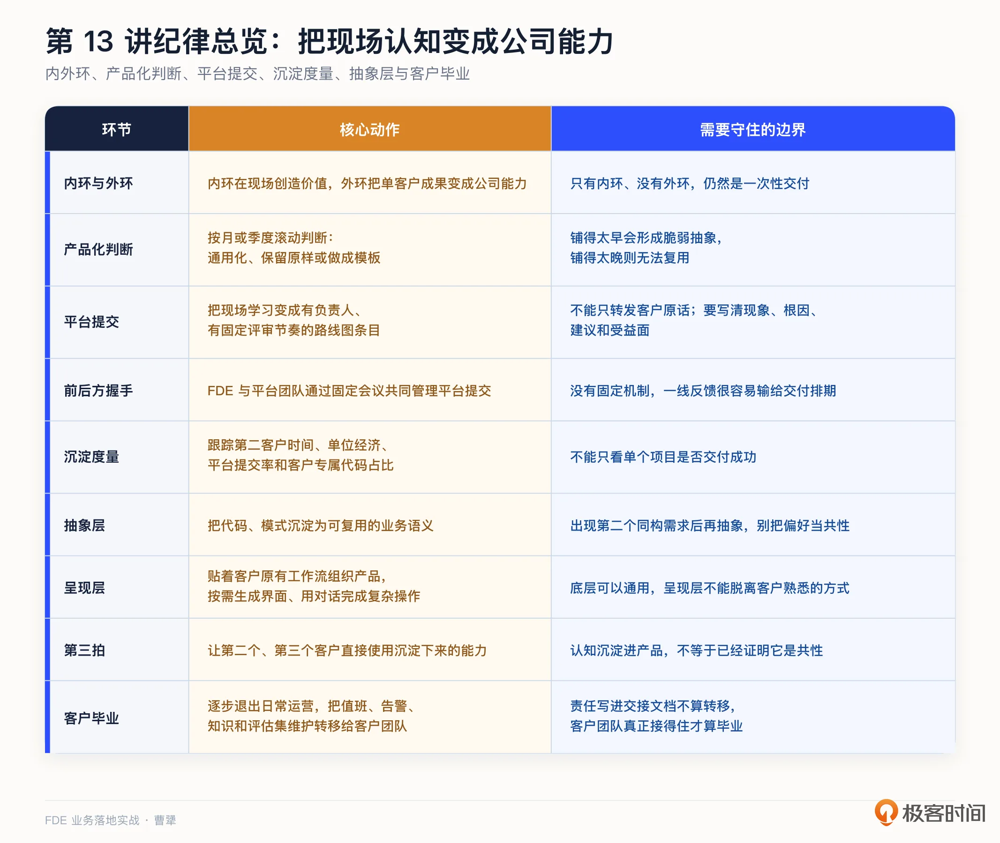

# 13｜碎石路修成高速公路：怎么把单客户成果沉淀成产品？
你好，我是曹犟。

第 9 讲我们讲过 Palantir 在空客的项目：FDE 驻场进工厂，把散在不同系统里的数据整合起来、贯通使用，项目的成功使 A350 的交付速度提升了大约三分之一。当时我提到，这个项目的产出后来还发展出了一个更大的东西，叫 Skywise，一个面向整个航空业的数据平台，按 Palantir 和空客披露的口径，如今已经接入了一百多家航空公司。

一个给单一客户做的驻场项目，怎么发展成服务一百多家同行的通用平台的？这中间发生的故事，就是这一讲的主题：沉淀。

在 [第 2 讲](https://time.geekbang.org/column/article/1000788 "xxx") 讨论 FDE 和外包的区别时，那张真假 FDE 判断清单里，我说过我个人最看重两条：一条 **看沉淀**，现场的经验能不能反哺回产品；一条 **看复利**，每做完一个客户，下一个客户的交付是不是更容易。这一讲，就是对这两条标准的展开。

某种意义上，前面十二讲都在讲怎么把一单做好；这一讲才开始回答另一个问题：这一单做完之后，怎么把其中的能力沉淀下来。简单来说，FDE 这套打法有一个核心循环： **先在一个客户身上做深，再决定哪些东西需要沉淀回平台**。

AI 时代，在一个客户身上做深后，能沉淀下来的东西可以分两类：一类是能做进产品、让下一个客户直接用上的能力，这是这一讲的主题；另一类是团队在现场获得的行业认知和判断，它们留在人的脑子里，怎么把它们变成公司的资产，变成 Agent 的知识库，则是下一讲的主题。

从一个客户身上沉淀这件事，在中国的语境下，其实也可以叫共创。 [第 8 讲](https://time.geekbang.org/column/article/1005076 "") 讨论每周 demo 时，我提过一个观点：让客户的真实声音提前进入产品。这里需要先区分两种不同的做法。很多公司说的“共创”，是把客户请来开几场共创会，增加一些参与感，本质上只是一种姿态；而真正的共创，是把客户的真实需求前置到研发和迭代中，用它来降低试错成本、提高产品的命中率。这一讲所说的沉淀，就是共创在 FDE 工作中的具体做法。

## 内环与外环：交付的完整形状

Shimoda 在他的书里把 FDE 的工作画成两个环，我结合自己的实践，重新描述一下。

**内环，是在客户现场把东西做出来的循环**，也就是前几讲我们走过的那条路：进场摸清真问题，选对场景，搞定关键干系人，用每周 demo 撬动信任、收集反馈、改完再验证，在客户系统里填 gap、写生产代码，用评估来定义什么叫“好”，最后带着检查清单安全上生产。内环转得好，客户满意，项目成功。

**外环，则是把单客户成果固化成产品或者说公司能力的循环**。Shimoda 有一个精彩绝伦的比喻：每一次交付，都是给一个客户修一条碎石路；外环的工作，就是有节奏地判断哪些碎石路值得铺成柏油高速，也就是通用的平台能力，让后面的客户可以直接使用。

关键在于“有节奏地判断”，而不是把所有碎石路都铺成高速公路。铺得太早，会造出一堆没有第二个客户需要的脆弱抽象；铺得太晚，手里就只剩下一次性的交付，什么都复用不了。这两种做法都有问题。

那这个节奏怎么把握？可以是按固定周期，例如月或者季度滚动做一次产品化决策，把这个周期内积累的定制分成三类。

- 第一类，是已经出现重复需求的定制。销售 pipeline 里至少有一个客户提出了类似需求，这类可以优先通用化，因为这说明它不是单一客户的特殊偏好。

- 第二类，是只适用于单一客户的定制。这类需求源于这家客户的特殊情况，保持原样即可，不需要强行抽象。

- 第三类，介于两者之间，可以先做成模板，未来通过配置来复用，不必现在就重新开发。

这三类判断的锚点其实始终是同一个： **有没有第二个客户会走这条路**。

这个三分类，可以和 [第 9 讲](https://time.geekbang.org/column/article/1005100 "xxx") 的三个代码区对起来看。施工的时候，纪律是把特殊逻辑先放进隔离区，用开关和配置管住；当时我说过，将来如果别的客户也需要，把开关变成正式功能就行。外环的产品化决策，其实就是定期来兑现这句话：第一类，把开关变成正式功能，从隔离区推进资产区；第二类，留在隔离区，别硬塞进资产区；第三类，在隔离区里先收敛成模板。施工时判断的是这行代码现在写在哪个区，产品化决策判断的是它接下来要不要换区。

普通软件工程师在工厂里造锤子；FDE 把锤子带到工地，帮客户创造价值，再把工地的反馈带回工厂，改出更好的锤子。内环是在工地创造价值，外环是回工厂改锤子，让锤子在下一个工地更好用。只有内环、没有外环，做的仍然是一次性交付。

这样的团队，客户满意度可以很高，但复利为零，它从商业本质上讲，就是一家套着软件外壳的咨询公司。对照 [第 2 讲](https://time.geekbang.org/column/article/1000788 "") 那张判断清单可以看出，担心自己做成外包，真正需要关注的不是驻场时长，而是外环有没有转起来。

## 平台提交与前后方握手：给沉淀修一条管道

外环的道理并不复杂，问题是怎么落地。只靠工程师自觉沉淀，通常会输给交付排期带来的压力。项目一忙，所有“回头再整理”的东西，往往就没有后续了。沉淀需要的不是觉悟，而是固定的管道和机制。

这条管道，业内称为 **平台提交**。简单来说，就是把 FDE 在客户现场发现的、可能值得产品化的问题或做法整理清楚，正式交给平台团队，变成产品路线图上的一项工作。

拆开来看，平台提交有三个关键点。第一，它是结构化的，不是散落在群聊里的“这个功能客户觉得不好用”。第二，它有明确的负责人，FDE 团队和产品团队都有人认领，对它负责。第三，它要进入正式的评审节奏，会被排期、被追踪。

项目复盘时，即使团队发现了值得沉淀的共性问题，如果没有人做平台提交，这条经验也只会留在会议纪要里，不会变成平台能力。 [第 9 讲](https://time.geekbang.org/column/article/1005100 "xxx") 讨论 gap 矩阵时我们已经提到：通用但不阻塞的 gap，不要在项目里顺手做掉，而要把它变成正式的产品需求，提回产品统一排期。平台提交，就是把这个动作变成一套固定机制。

看一组具体例子，就能看出平台提交和“转发客户原话”的区别。转客户原话的版本是：“客户说报表功能不好用，产品同学看看。”而一份完整的平台提交则要有四个要素： **现象**，客户在什么场景下遇到了问题； **根因**，本质上缺少什么能力； **建议**，这个能力抽象出来应该是什么形态； **受益面**，除了这家客户，还有哪些客户会用到。前者只是当传话筒，后者才是真正转交学习成果。

与平台提交配套的机制，叫 **前后方握手**，也就是 FDE 团队和平台工程团队之间的固定会议。会议可能每周一次，有固定议程，两支团队共同对平台提交的需求 pipeline 负责。这个握手会非常关键，飞轮在这里要么转起来，要么卡住。我自己在神策作为 CTO 也曾经长期主持过类似会议，积累下来的经验也印证了这一点：前线和产研之间如果没有固定的握手机制，就很容易互相埋怨，前线认为产研不接需求，产研则认为一线只会转发客户原话。

不过，到了 AI 时代，前后方的协作会明显简化。之前的课程中都提到过，AI 把做产品、改代码的门槛降低之后，FDE 可以同时承担前线交付和后方沉淀，也就是 Delta 和 Dev 两头的工作。这时，平台提交仍然需要保留，因为它不仅是前线向后方传递需求的工具，更是把一次现场判断变成正式产品决策的记录；但两支团队之间反复交接、排队等待的过程，可以大幅减少。AI 简化的是协作链路，不是产品化的纪律。

在这两项机制之外，我自己还建议增加一道 **结项检查：项目沉淀清单**。每个项目结项之前，用一页纸的篇幅写清楚三件事：这个项目学到了什么，哪些经验已经形成平台提交，哪些内容明确不值得沉淀，以及为什么。不完成这份清单，项目就不算正式结项。它不仅仅是为了留档，更重要的是让团队在记忆还清楚的时候，把经验变成决策。

那怎么判断外环转得好不好？可以看三个衡量指标。

第一，第二客户时间：同样的模式，第二次交付比第一次快了多少？

第二，单位经济：第二次交付投入的成本，是不是只有第一次的一个零头？这两个指标看起来相似，其实并不重复：时间看的是速度，决定你接下一个客户的节奏；成本看的是毛利，决定每一单赚不赚钱。往项目里加人可以买来速度，但买不来毛利，所以这两点都很关键。

第三，平台提交率：一个季度里，有多少条现场学习真正变成了产品路线图上的功能？

此外，还有一个反向的危险信号：平台仓库里，客户专属代码比通用代码增长得还快。一旦出现，就说明团队正在滑向 [第 2 讲](https://time.geekbang.org/column/article/1000788 "xxx") 提过的“咨询陷阱”。这四个数字放在一起，就是沉淀的仪表盘。

## 抽象层：沉淀的最高形态

沉淀有三个层次，前两层，正是刚才产品化决策处理的东西。最浅的一层，是 **沉淀代码**：把某个客户需要的功能做成通用开关，也就是三分类里第一类的通用化。更深一层，是 **沉淀模式**：把一类客户的共性做法做成模板，也就是第三类的模板化。而最深的一层，是 **沉淀抽象**：把整个行业的业务抽象成一套可复用的语义模型。它沉淀的不再是某一条定制，而是许多条定制背后共同的业务理解，这就是这一节要讲的。

> 注：如果你做过软件设计，大概会觉得这很像领域驱动设计里的领域模型：先把业务里的实体和关系建出来，再让代码去贴合它。思路上确实是一回事。区别在于范围：领域模型通常是一个系统内部对自己业务的抽象；而这里说的抽象层，则是从多家客户的交付里提炼出来、整个行业共用的那一份。

Palantir 在这件事上的答案叫 **本体论**，也就是 Ontology。简单来说，就是把一个行业里的实体、关系和事件，抽象成一层通用的语义层：航空业有飞机、航班、零件、工单，零售业有会员、商品、订单、门店。有了这一层，上面的应用就不必每次都从原始数据表开始理解业务。Skywise 能从一个客户的项目发展成服务一百多家航司的平台，靠的正是这层抽象：空客项目里梳理出来的那些数据模型，被进一步抽象成了全行业通用的语义。

那这层抽象抽出来，到底有什么用？第一，应用可以复用。上层的功能构建在语义层上，对整个行业的客户有足够的适配性。第二，交付可以变轻。新客户接进来，主要的工作不再是从头理解业务、从头开发，而是把这家客户的系统和数据映射进语义层；映射完成，上层的应用直接就能跑起来。前面提到的第二客户时间和单位经济，可以被这层抽象大幅度改善。

神策走的也是这个方向。我们在 2020 年提出了 SDAF 框架，也就是感知、决策、行动、反馈的闭环；后来又演进到 **多实体模型**，用实体、属性、关系、事件这套语义来描述客户的业务。这些抽象，并不是架构师坐在办公室里独立设计出来的，而是从几千家客户的交付中逐步形成的。从这个角度来说，抽象层是外环的产物。

什么时候值得往抽象层沉淀？其实和前面产品化决策是一样的：等第二个样本出现。只有一个样本，抽象出来的多半是这家客户的偏好；有了第二个样本，共性和个性才能分开。

不过两个判断看的东西不一样。功能要不要通用化，看的是第二个客户要不要同样的功能；要不要往抽象层沉淀，看的是第二个客户的业务是不是同构：它要的功能可以完全不同，但业务里的实体和关系可能是同一套。另外需要注意， **抽象的单位是业务语义，而不是代码**。先想清楚“这个行业里到底有哪些实体、它们怎么发生关系”，再讨论代码怎么组织。

当然，Palantir 和神策的商业路线并不相同。Palantir 走深度定制加高客单价，单个客户的年合同额可以到数千万甚至上亿美元；神策走标准产品加行业方案，单客户几十万到几百万人民币，靠规模化取胜。路线不同，但在“把现场认知沉淀成抽象层”这一点上，逻辑是相同的。团队会把现场认知带回来，认知里关于业务结构的那部分，也就是这个行业有哪些实体、它们怎么发生关系，最终就沉淀在抽象层里。

AI 时代还有一个新样本。OpenAI 分享过他们的路径：给运营商和金融科技客户做客服项目时，把散落在各客户的数百条服务策略参数化，做成一个叫 Swarm 的框架；经过多个客户的复用验证之后，最终产品化成了对外发布的 Agent 开发套件。从单客户探索，到多客户验证，再到产品化发布，每一步都是外环在转。

## 呈现层：贴合客户原有的工作流

抽象层是抽象给系统的，不是直接呈现给用户的。产品呈现给客户的那一层，反而需要贴着客户原有的工作流来设计，而不是给客户发明一套新的工作流。

举一个我们自己的例子。Omni-Growth 做广告投放诊断时，诊断结果应该怎么展示？我们的做法是按照 Meta 广告后台原有的结构来组织：广告账户、广告系列、广告组、广告，一层一层展开。投手每天查看数据时就是按照这个顺序操作的，不需要学习新的结构，按原有习惯就能看完诊断结果。

但我们最开始选择的其实是另一条看起来更“产品化”的路：把所有诊断结果放在一起，再发明一个“诊断卡片流”之类的新概念。为什么最终没有采用这个方案？并不是因为它不好看，而是因为投手很难核对完整性。他看完所有卡片，心里依然会有一个疑问：除了这些诊断，还有没有别的问题没有查出来？于是，他就会回到 Meta 后台，把所有广告重新检查一遍。这样一来，Agent 原本想替他省掉的工作，一点也没有减少；更重要的是，他从此会对产品的诊断结果将信将疑。

而按照客户熟悉的结构来组织，哪个账户、哪个系列检查过了，有没有问题，都能和投手脑子里那张地图一一对应。只有当投手能确认“没有遗漏”，他才敢把这道工序真正交给 Agent。

所以， **贴着原有工作流设计，省下的是学习成本，获得的是客户信任**。Agent 想接管客户的一道工序，前提是客户能确认它没有遗漏，而最直接的核对方式，就是沿用原有的工作流程。 [第 5 讲](https://time.geekbang.org/column/article/1002969 "") 提到过，我们坐在投手旁边，观察他怎么操作广告后台。到了设计产品时，就要把这些观察落实到产品结构中：客户怎么工作，产品就怎么组织。

第 11 讲说的那些被绕着走的功能，可能并不是产品能力不行，而是客户在产品发明的新概念里无法核对，也不敢信任。底层的抽象越通用越好，那是公司的资产；呈现层的设计越贴近客户原有的习惯越好，那是客户建立信任的入口。

### AI 时代，呈现层的新范式

前面讲的是，呈现层要贴合客户原有的工作流。到了 AI 时代，呈现层有了两种新的实现方式，但这个原则没有变。

**第一，界面可以低成本生成。** 客户的需求千变万化，每家都有自己的特殊情况。AI 第一次让我们可以按照每家客户的需求和习惯，单独生成展现层。我之前表达过一个判断，未来的企业软件也许不再是“一套系统用十年”，而是“十分钟配出一套系统”，客户从使用者变成只关注目标的监督者。ChatGPT、豆包都在往这个方向走。

但生成不是让 AI 天马行空地设计新界面。就像前面的例子，即使诊断结果是即时生成的，也需要按照广告账户、广告系列这套投手熟悉的结构来组织，他才能核对，才敢信任。生成是手段，符合客户脑子里那张地图依然是约束。

**第二，操作可以通过对话完成。** 过去修改一项配置，需要在界面上逐层操作；现在很多操作用一句话就可以完成。比如圈选一个用户分群，过去要选择事件、设置条件和时间、挑选属性，新人需要学习很久；现在只要说一句“找出最近三十天下过单、但没复购的用户”，Agent 就可以完成配置。

但这里有一条边界。例如复杂信息的增删改查，是标准、高频而且已经非常顺手的操作，传统界面反而更快，也更让人踏实。给客户提供完整的数据分析结果，各种客户已经习惯的图表依然必不可少。越是难以通过界面表达的复杂意图，自然语言才越有价值。复杂的、探索性的操作交给对话；标准的、高频的操作留给界面。

回到产品设计上，AI 能生成界面，也能把操作变成对话，这是过去没有的能力。但界面生成成什么样、对话应该到哪一步，依然需要人根据客户的工作流作出判断。AI 负责把界面做出来，人负责判断它是否符合客户原有的工作方式。

## 第二个客户用起来，外环才算闭合

到这里，我们从第一个客户现场获得了认知，也把它打磨进了产品，但还不能证明沉淀下来的是通用能力。

完整的外环仍然是三拍：第一拍，在第一个客户现场获得认知；第二拍，把认知打磨进产品；第三拍，让第二个、第三个客户直接使用这项能力，观察交付是不是变得更快、更轻。新版本回到原客户验证当然也有必要，它能确认产品化没有破坏原有场景；但只有新的客户也能用起来，才说明我们提炼的是共性，而不是第一家客户的特殊偏好。外环到这里才真正闭合。

再算一笔经济账，外环模式下，第一个客户可能会是亏损的，因为团队投入了远超合同额的精力去理解场景、完成抽象。但这种亏损是探索性投入，换来的是可复用的能力；而管理不善造成的执行浪费，是另一种完全不同的亏损。

这笔账算不算得过来，取决于第二个、第三个客户的交付成本是不是真的降到了第一次的一个零头。这就是“先亏后盈”的逻辑。怎么定价才能让这笔账成立，第 15 讲会展开讨论；服务做重之后会不会掉进陷阱，第 16 讲再来算总账。

## 原客户也要毕业：把系统交给客户团队

外环到这里就讲完了。最后再补充一个与外环不同、但同样决定 FDE 能不能离开当前项目的问题：交接。外环回答的是，沉淀下来的能力能不能走向第二个客户；交接回答的是，第一个客户能不能脱离 FDE 独立运营。

交接不是项目结束时突然把系统甩给客户，而是逐步退出日常运营。开始阶段，FDE 主导运行，客户团队跟着学习；接下来，客户团队负责日常运营和一线问题，FDE 退到后方提供支持；最后，客户团队能独立运行、处理常见故障，并根据业务变化持续改进，FDE 只处理平台层的问题。这种从依赖走向独立的过程叫作自治阶梯。

所以，项目毕业的标准不能只看系统是否上线，还要看客户团队是否真正接得住。谁值班、谁接告警、谁维护知识和评估集， [第 12 讲](https://time.geekbang.org/column/article/1006705 "xxx") 已经讲过；到了这里，还要检查这些责任是不是已经真正转移给客户，而不只是写在交接文档里。

FDE 真正的交付物，不光是一套系统、一个能力逐渐提升的 Agent，还包括一个有能力的客户团队。系统会过时，一个被 FDE 带出来、会用数据说话的客户团队，才是复购和口碑的来源。这也回应了 [第 7 讲](https://time.geekbang.org/column/article/1003666 "") 提过的反模式“永久拐杖”：客户永远离不开 FDE，看起来生意很稳定，实际上 FDE 团队被长期占用，客户也没有成长。

## 课程总结

这一讲，我们讲的是碎石路修成高速公路，核心就一句话： **内环让客户满意，外环让公司值钱**。拉远一点看，这就是 FDE 的核心价值：先在一个客户身上做深，再决定什么东西沉淀回平台。

再回到人与 AI 的分工这条线：AI 把做产品、改代码的门槛降低，简化了前后方的协作链路，也能按客户的习惯生成界面、把操作变成对话；但哪些定制值得产品化、界面生成成什么样、对话应该到哪一步，这些判断依然需要人来做。AI 简化的是协作链路，不是产品化的纪律。

我把这一讲的关键点整理成一张表：

如果你想转型 FDE，这一讲讨论的沉淀机制，是 FDE 和外包之间非常重要的一条分界线。每完成一次交付，都可以问自己一个问题：这里面有没有值得形成平台提交的学习成果？即使公司还没有这套机制，也可以先从记录和判断开始。

对交付和实施同学，项目沉淀清单是最容易先用起来的工具。可以在下个项目结项前写一页纸，记录这个项目学到了什么。持续写下去，看项目的角度会逐渐从“做完了没有”，变成“留下了什么”。

对 To B 创业者和技术决策者，可以把沉淀仪表盘的几个指标真正算一遍，特别是第二客户时间。如果第二次交付和第一次一样重，公司无论签了多少单，本质上都还在原地踏步。

到这里，能沉淀进产品的东西，需求、代码、抽象，这一讲都讲完了。但开头说过，沉淀下来的东西还有另一类：团队在现场积累的行业认知和判断，也就是 know-how。这些知识往往存在于团队成员的脑子里，怎么把它们变成可复制、可规模化的护城河，并且变成 Agent 的知识库？下一讲，我们讨论私有知识：AI 时代 To B 公司真正的护城河怎么建。

## 思考题

留两个问题，欢迎你在留言区聊聊。

第一，算一算你们的“第二客户时间”：最近两个相似的项目，第二个比第一个快了多少？如果没有变快，原因是什么，是没有沉淀，还是沉淀之后没有人使用？

第二，回想最近完成的一个项目。如果现在补一份项目沉淀清单，可以写出几条“值得沉淀的经验”？这些内容目前存放在哪里？

期待你在留言区分享你的思考。如果这节课对你有启发，也推荐你把它分享给身边更多朋友。