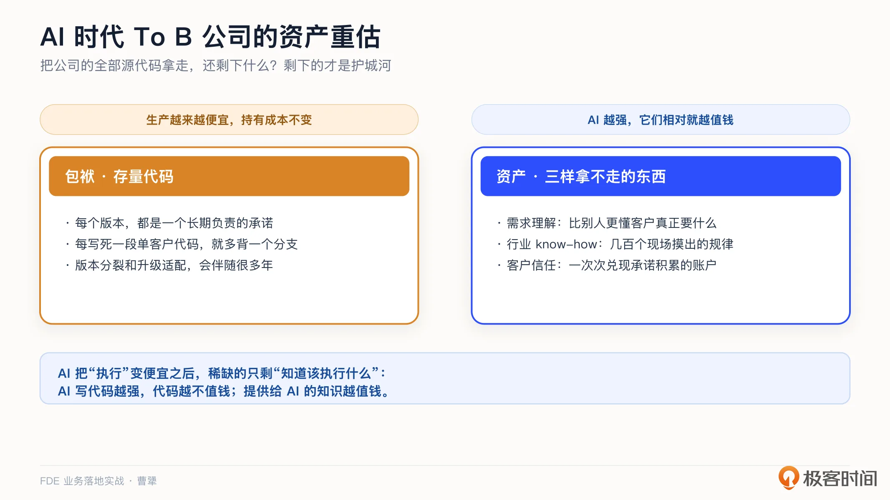
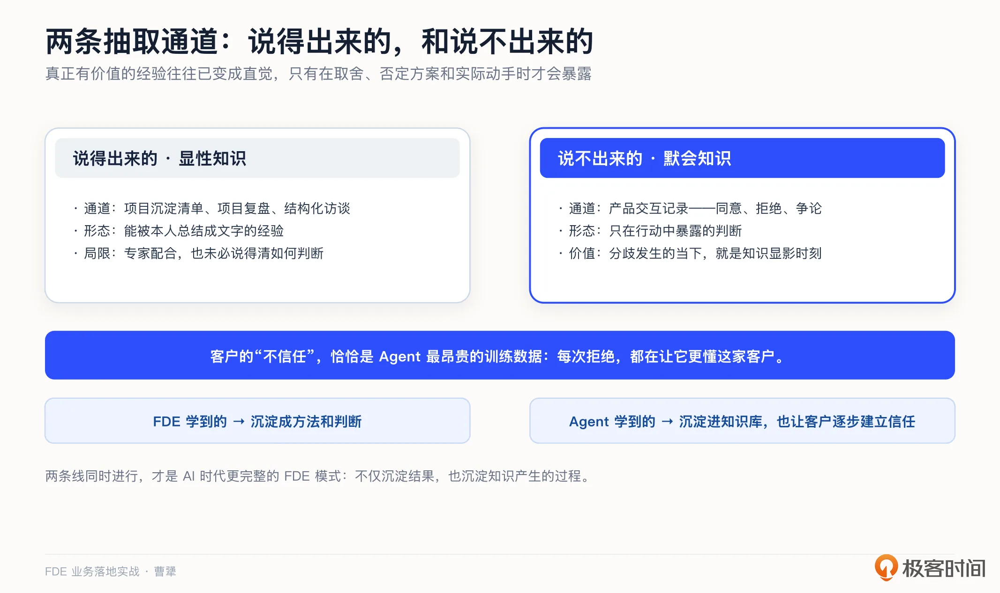
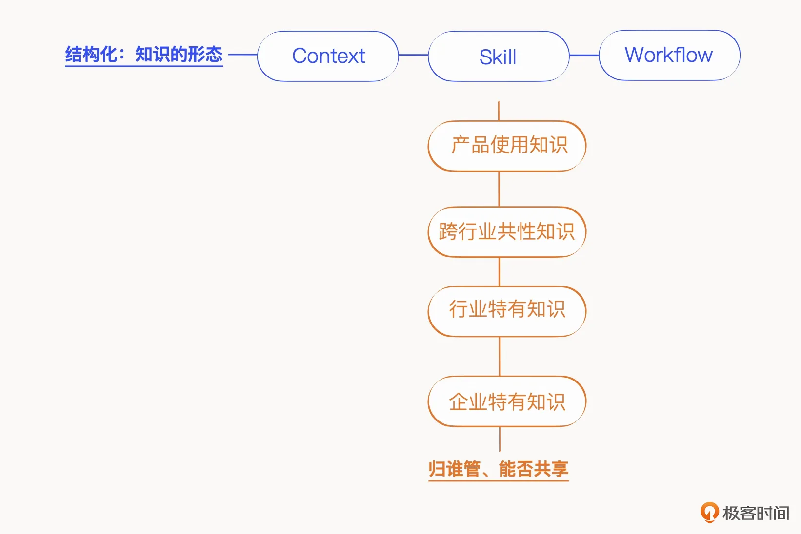
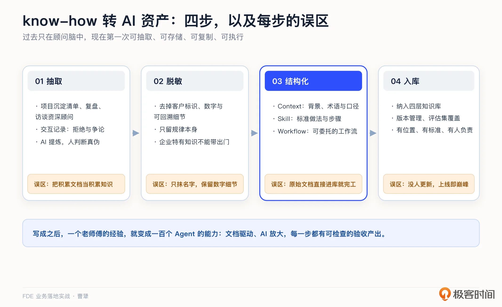
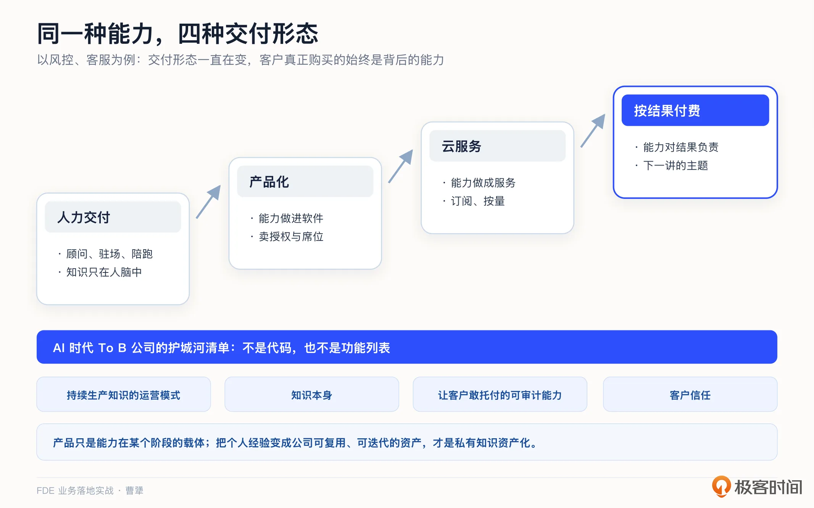
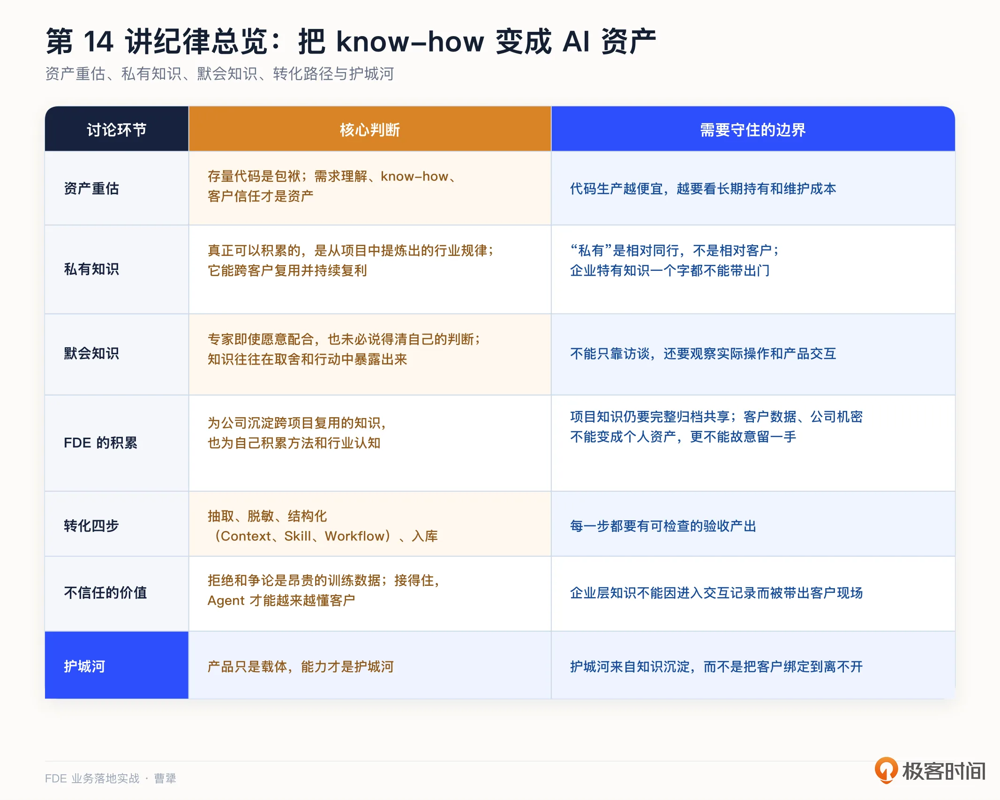

# 14｜私有知识：AI 时代 To B 公司真正的护城河怎么建？
你好，我是曹犟。

上一讲我们介绍了能沉淀进产品的内容，还剩一种虽然不能进入产品但却更有价值的资产：团队在现场积累的行业认知和判断。这一讲，我们就来讲这一类私有知识的沉淀。

先做一个思想实验，我经常用下面这个问题来判断一家公司到底有没有真正的护城河：假如明天把你们公司的全部源代码开源，或者干脆卖掉，你的公司还剩下什么？如果答案是“什么都不剩”，那说明公司真正的家底就是那堆代码，而这个家底，正在快速贬值。如果答案是“还剩不少东西”，那剩下的那些，才是你真正的护城河。

我之前表达过一个判断：AI 时代，对一家 To B 公司来说， **存量代码是包袱，需求理解、行业 know-how、客户信任，这三样才是资产**。这一讲，我们先把这个判断说清楚，再重点讲三样资产里最容易被忽略、也最适合在 AI 时代放大的行业 know-how，也就是私有知识。

## 代码是包袱，知识是资产

我们先把“代码是包袱”这半句说清楚，很多工程师听到这句话会不舒服。

代码为什么是包袱？ [第 9 讲](https://time.geekbang.org/column/article/1005100 "xxx") 讨论私有化和版本纪律时说过，每个版本都是一个要长期负责的承诺。现场每写死一段单客户代码，公司就多背一个分支。版本分裂、多分支并行、升级适配，成本会伴随你很多年。这还只是维护端。生产端的变化更大：第 2 讲我们讲“基于 AI 的定开”时就说过，AI 让代码的生产变得越来越快、越来越便宜。一样东西，生产起来越来越便宜，持有成本却不变，资产属性当然在下降。

再看另一边。需求理解，就是你比别人更懂客户真正要什么，这是 [第 5 讲](https://time.geekbang.org/column/article/1002969 "") 和 [第 6 讲](https://time.geekbang.org/column/article/1002988 "") 在讲的能力。客户信任， [第 7 讲](https://time.geekbang.org/column/article/1003666 "") 讲过，是一次次兑现承诺攒出来的账户。而行业 know-how，是你在几十个、几百个客户现场攒下来的行业规律：什么场景应该怎么处理，什么坑必须绕，什么打法在这个行业就是跑不通。这三样东西有个共同特征：AI 越强，它们相对就越值钱。因为 AI 把“执行”变便宜了之后，稀缺的就只剩下“知道该执行什么”。

简单来说，AI 写代码的能力越强，代码越不值钱；而提供给 AI 的知识，越值钱。这就是 AI 时代 To B 公司资产负债表的重估。

## 私有知识：天生脱敏，天生复利

所谓私有知识，就是你在服务客户的过程中攒下来的行业 know-how。注意它和客户数据的区别：某家客户的用户明细、订单记录和广告投放数据，属于客户；而“零售行业的会员运营普遍卡在哪一步”“金融客户的合规审查通常怎么走”，这类从大量项目里提炼出来的规律，属于你。

我之前给私有知识下过两个定语： **天生脱敏，可跨客户共享**。天生脱敏，是说这类知识描述的是行业规律，不属于任何一家客户的隐私；可跨客户共享，是说它在 A 客户积累下来，到 B 客户也能直接使用。这两个属性合在一起，意味着它是天生的复利资产。

举一个我们自己的例子。 [第 6 讲](https://time.geekbang.org/column/article/1002988 "") 讲过我们劝一个客户别投 Google Ads，核心判断是：这类靠社区和口碑发现的品类，用户的购买路径不经过搜索，搜索广告是结构性错配。你看，这个判断是从一个具体客户的项目里提炼出来，但把客户信息拿掉之后，它描述的是一条品类规律。下一个做同类产品的客户来了，这条判断直接就能用，而且很可能就是我们和其他友商最大的差别。这就是一条典型的私有知识。

不过这里还是要加上一条边界，防止误读和滥用。 [https://time.geekbang.org/column/article/1005104](https://time.geekbang.org/column/article/1005104 "xxx") 的四层知识库里，这里能积累并且跨客户共享的是上面三层：产品使用、跨行业共性、行业特有；最底下那层企业特有知识还是属于客户，一个字都不能带出门。私有知识的“私有”，是相对你的同行而言，不是相对客户而言。这条线划不清楚，护城河可能反而会变成事故现场。

具体怎么判断一条知识到底站在边界的哪一边？我觉得可以用三个问题来判断。

第一问，把它拿给同行业的下一家客户看，原来那家客户会不会觉得被泄密。

第二问，里面有没有能回溯到具体企业的数字、名称、组织细节。

第三问，它描述的是这个行业怎么运行，还是这家企业怎么运行。

三个问题都通过，才能进可共享的行业层。有一个问题都过不了，就老实留在企业层。

那问题来了：既然私有知识这么有价值，为什么过去的 To B 公司没有把它做成护城河？答案其实我们都经历过：因为 **它只存在于资深实施顾问的脑子里**。神策过去为了尝试商业模式的改变，也做过多年的陪跑服务，靠有经验的人陪在客户身边，帮客户把工具用出效果，按效果收费。效果肯定是有的，但知识积累和规模化一直很难：顾问一离职，他脑子里那套东西就跟着走了；你让他交接，他可能都不知道该怎么交接；哪怕在管理流程里强调了知识的文档化，这些文档可能也散落在各地，难以复用。在这种情况下，想复制一个资深顾问，通常需要按年计算，而且对人也有很高的要求。

AI 改变的正是这一点。Agent 加知识库的组织方式，让顾问脑中的 know-how 第一次变得可抽取、可存储、可复制、可执行。过去要靠一个老师傅到现场才能给出的判断，现在可以变成知识库里的一条条结构化经验，让 Agent 在一百个客户现场同时给出最优解。这就是我说 AI 把咨询和陪跑“产品化”的含义： **被产品化的正是咨询背后的知识**。

## 四步转化：把脑子里的东西变成资产

这项工作对 FDE 来说，一方面是有益于公司，FDE 把在客户现场学到的东西带回来，变成整个公司可以跨项目复用的知识资产；但从另一个角度来说，FDE 在现场完成的沉淀，也是在积累自己的方法和行业认知。上面提到的资深实施顾问难以规模化培养，反而让这个岗位有了更高的溢价，对于 FDE 也是如此。这一点我们在第 23 讲还会具体展开。

当然，个人沉淀也要守住职业边界：该归档、该共享的项目知识，仍然要完整地沉淀到公司的知识库里；客户数据和公司机密不能变成个人资产；更不能为了提高自己的不可替代性而故意留一手。

这里先回到公司层面：从“脑子里”到“资产”，我们的实践可以总结成四步。

**第一步，抽取**。知识不会自动沉淀，需要有机制把它抽取出来。上一讲的项目沉淀清单就是很好的入口：每个项目结项前的那一页纸，本身就是一次知识抽取。此外，还可以通过项目复盘、对资深顾问的结构化访谈来抽取知识。AI 在这一步就能发挥很大作用：先把访谈录音转成纪要，再从几十份项目文档里提炼出反复出现的规律，人只负责判断真伪。 **抽取的关键是及时**，项目里那些“这个行业原来是这么回事”的 aha moment，过了三个月，可能就想不起来了。

这里有个很容易被低估的问题：想把一个专家“蒸馏”出来，最大的障碍不一定是他不配合。很多时候，即使他配合，也大概率说不清自己到底是怎么判断的。因为真正有价值的经验往往已经变成了直觉，只有当他面对具体问题，作出取舍、否定一个方案或者实际动手时，这些经验才会暴露出来。 [第 5 讲](https://time.geekbang.org/column/article/1002969 "") 我们为什么宁愿坐到投手旁边看他操作，也不只做访谈，原因就在这里。

所以，除了访谈，抽取还有一个更贴近实际工作的通道，就是我们在客户现场体会到的： **产品的交互记录本身**。 [第 12 讲](https://time.geekbang.org/column/article/1006705 "xxx") 说过，我们的投放 copilot 产品，对 Agent 的每一条建议，投手可以同意、拒绝、争论，拒绝时需要给出理由。这些拒绝的理由和争论的过程，本质上都是投手在把自己脑子里的东西一条条教给 Agent：客户的预算节奏、哪些品类在清库存、老板对哪条产品线有特别的坚持。这类很难被本人直接说清楚、却会在行动中暴露出来的知识，通常叫做默会知识。

所以我有一个判断： **客户的不信任，恰恰是 Agent 最昂贵的训练数据**。市面上很多 Agent 产品会直接丢掉用户不采纳建议的信号；而只要把这个信号保留下来，每一次拒绝都是在让 Agent 更懂这家客户。这个通道还天然满足及时抽取的要求：分歧发生的当下，就是知识显露出来的时刻。这个抽取通道本身是产品能力，而从几十个客户身上反复看到的拒绝模式，脱敏之后就是行业层的规律。

从这个角度看，产品化的不只是 FDE 最终总结出的知识，还有知识产生和沉淀的过程。FDE 在现场理解客户，Agent 在一次次交互中记录客户的判断和反馈，两个过程同时进行。FDE 学到的，沉淀成方法和判断；Agent 学到的，沉淀进知识库，也让客户逐步建立信任。这两条线结合起来，才是 AI 时代更完整的 FDE 模式。

**第二步，脱敏**。把客户标识、具体数字、可回溯的细节去掉，只留下规律本身。“某零售客户复购率 8%”是客户数据；“这个品类的复购运营，普遍卡在会员首购后的第二周”是行业知识。前者留在项目档案里，后者进知识资产库。

**第三步，结构化**。知识要变成 AI 能直接使用的形态，而不能只是一堆文档。我们的实践是把它拆成三种形态：

1. Context 是背景性知识，包括行业术语、口径和约束，用来给 Agent 提供上下文；

2. Skill 是操作性知识，把某类问题的标准做法和步骤写成 Agent 可调用的技能文档；

3. Workflow 是流程性知识，把一个业务目标拆成可以委托给 Agent 的工作流。

我之前把这套做法概括为“文档驱动，AI 放大”：Skill 文档承载策略意图、领域知识和操作流程，AI 负责执行。

我们拿投放场景举个例子，“新品测试期怎么分配预算”这类老投手的经验，写成 Skill，就是把什么条件下启动测试、按什么节奏加减预算、出现什么信号就停止，这些一条一条写清楚。写成之后，一个老师傅的经验就能变成一百个 Agent 的能力。

顺带说一句，这也正是 AI 时代交付和客户成功的新形态：从教客户使用软件，变成帮客户把业务目标拆成 Agent 工作流。

**第四步，入库**。把结构化好的知识，纳入 [第 10 讲](https://time.geekbang.org/column/article/1005104 "xxx") 讲过的分层知识库，进行业层和共性层，让它被版本管理、被评估集覆盖、被持续迭代。注意，结构化的三种形态和这里的四层是两个维度：形态说的是一条知识长什么样，分层说的是它归谁、能不能跨客户共享。一份写好的 Skill 文档，还要过一遍边界三问，行业规律进行业层，出不了门的留在企业层。

到这一步，一条现场的经验才算真正变成了公司资产：它有存放位置，有质量标准，有人负责，而且每个新项目都会让它更厚一点。

我们再回过头来拿 [第 6 讲](https://time.geekbang.org/column/article/1002988 "") 那个 Google Ads 的判断走一遍。抽取，是把判断当场写下来：这类靠社区和口碑发现的品类，购买路径不经过搜索。脱敏，是去掉客户名字和具体的投放数字，只留品类特征和结论。结构化，是写成一条带条件的规则：出现哪些信号说明品类是口碑驱动，这时投放建议怎么给。入库，是把规则放进行业层，下一个同类客户来了，Agent 做方案时直接调出来。从此，这条判断不再依赖当年做项目的那个人。

[第 13 讲](https://time.geekbang.org/column/article/1006722 "xxx") 提到 OpenAI 把客服项目里数百条服务策略参数化成 Swarm 框架。换个角度看，那数百条策略就是客服运营的 know-how，参数化就是第三步结构化。他们走的正是这条路：把散在各个客户项目里的行业知识，抽出来、结构化、变成可复用的资产。

这个案例，他们后来披露过更多的细节。第一点，光一家金融科技客户的客服项目，服务策略就有 400 多条，靠人一条条手写提示词，撑不住了，他们就把指令和工具参数化，散落各处的提示词，变成了结构化的参数。第二点，他们给每一类用户意图都加上对应的评估集，有这种兜底，策略才敢放量规模化。后来在一家运营商客户那里，策略数量和复杂度高了一个量级，同一套结构加一些扩展照样能用。评估集守门，对应的正是入库那一步的质量标准，两条路径是相通的。关于评估集，我们 [第 11 讲](https://time.geekbang.org/column/article/1005151 "xxx") 详细聊过，你可以回顾一下。

这两个案例说明，从现场经验到公司资产，中间确实要经过抽取、脱敏、结构化和入库。但这四步说起来简单，实际执行时，每一步都有典型误区。

- 抽取的误区，是把积累文档当成积累知识：项目文档堆了几百份，规律一条都没有提炼出来，那只是仓库，不是资产。

- 脱敏的误区，是只抹掉客户名字，数字和细节却原样保留，懂行的人一眼就能猜出是哪家，等于没有脱敏。

- 结构化的误区，是把原始文档直接放进知识库就宣布完工，Agent 检索出来的仍然是文档片段，而不是可以执行的判断。

- 入库的误区最隐蔽：知识库建起来了，却没人负责更新，上线那天就成了质量巅峰。

避开这些误区的办法，是给每一步制定可检查的验收产出。例如在脱敏这一步，就可以直接拿刚才的三个问题来验收。

## 护城河的再定义

最后，我们再回到开头所说的公司的护城河。

我之前梳理过同一种能力的交付形态演化。以风控、客服为例，最早依赖顾问和驻场人员交付，后来被做进软件，再变成按订阅、按用量提供的云服务，最终甚至可以直接按结果付费。交付形态一直在变，但客户真正购买的，始终是背后的能力。所以，产品只是能力在某个阶段的载体，能力本身才是护城河。 **私有知识资产化，就是把原本只存在于个人经验里的能力，变成公司可以反复调用、持续迭代的资产。**

Shimoda 有个说法和这个判断异曲同工，他说，运营模式才是会复利的资产，产品只是运营模式的产物。

把两句话放在一起看，AI 时代 To B 公司的护城河清单已经很清楚了：不是代码，不是功能列表，而是持续生产知识的运营模式，加上知识本身，加上 [第 12 讲](https://time.geekbang.org/column/article/1006705 "xxx") 说过的那套让客户敢托付的可审计能力，再加上客户信任。这几样，每一样都是竞争对手抄不走的。

讲到这里，我还想回应一种说法：FDE 的目的就是让客户离不开。按照这种逻辑，FDE 做得越深，客户被绑定得越紧，项目就越成功。我不认同这个判断。客户因为被绑定而离不开你，和客户因为你持续创造价值而选择你，是两回事。

[第 7 讲](https://time.geekbang.org/column/article/1003666 "xxx") 讲过，如果客户一直离不开 FDE，FDE 就成了永久拐杖，这是反模式，不是护城河。真正的护城河，不是让某个客户走不了，而是把项目中产生的、天生脱敏又可以跨客户复用的私有知识沉淀下来。一个项目结束后，客户能够独立使用产品，公司也把现场经验沉淀进产品和知识库，用来服务下一个客户，这才是双方都得到了积累。反过来，如果客户离不开驻场的人，公司也只能不断投入人力维持项目，双方其实都被绑住了。项目越多，负担越重。

能力的交付形态演化到最后，是按结果付费。当知识已经变成可以稳定交付的能力，公司也就有机会从卖工具，进一步走向为结果负责。

## 课程总结

这一讲，我们讲的是私有知识。核心判断是：AI 时代，代码越来越容易生产，真正稀缺的是需求理解、行业 know-how 和客户信任。FDE 的一项核心职责，就是把客户现场的 know-how 变成公司可以反复使用、持续积累的知识资产。

在这个场景里，AI 和人的分工也很清楚：AI 能把访谈录音转成纪要，能从几十份项目文档里提炼出反复出现的规律，也能按照 Skill 文档应用知识得到结果；但哪一条是真正的 know-how，哪一条只是个例，哪些细节必须脱敏才能出门，需要由人来判断。

我把这一讲的关键点整理成一张表：

如果你想转型 FDE，这一讲的建议是：从今天起，给自己建一个知识资产库。每个项目结束，要求自己写下三条脱敏后的行业规律。积累两年之后，这个知识库可能就是你和其他工程师最大的差别。

对交付和实施同学，转化四步里最值得先练的是第三步。可以从自己最熟悉的一类问题开始，尝试写成一份 Skill 文档：适用于什么场景，具体有哪些步骤，又有哪些边界条件。真正动笔时，你会很快发现，哪些判断已经能够说清，哪些还停留在手感。对于暂时说不清的部分，可以再回到具体项目中，观察自己是怎么判断和取舍的，逐步把它整理成可以复用的知识。

对 To B 创业者和技术决策者，我建议把这一讲和 [第 13 讲](https://time.geekbang.org/column/article/1006722 "xxx") 放在一起复盘：既要沉淀代码和模式，也要沉淀知识，并且两种沉淀都要有机制、有负责人、有度量。只靠愿景号召大家“多沉淀”，通常很难真正执行下来。

知识变成了资产，下一个问题就是让资产变成收入。FDE 这么贵，怎么定价才不会被财务当成本中心砍掉？按人天、按席位，还是按效果？下一讲，我们讲从卖工具到卖效果：FDE 的定价之道。

## 思考题

留两个问题，欢迎你在留言区聊聊。

第一，做一遍开头那个思想实验：把你们公司的代码拿走，还剩什么？试着列出三条你们独有的、别人拿不走的行业 know-how。列得出来吗？它们现在，以什么样的形式存放在哪里？

第二，想一下这样一个场景，如果你们团队里最资深的一位顾问或工程师明天离职，那么哪些知识会随之流失？这些知识中哪一条最值得从这个月开始，按照“抽取、脱敏、结构化、入库”四步沉淀下来？

期待你在留言区分享你的思考。如果这节课对你有启发，也推荐你把它分享给身边更多朋友。