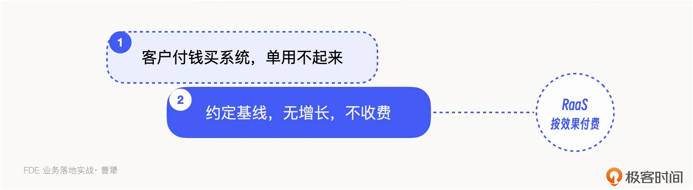
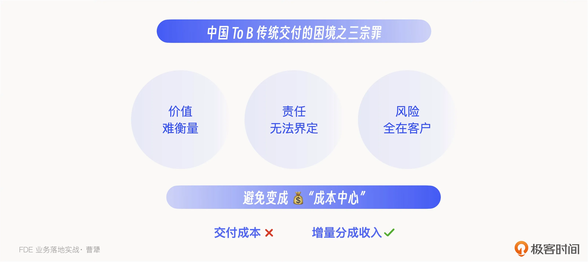
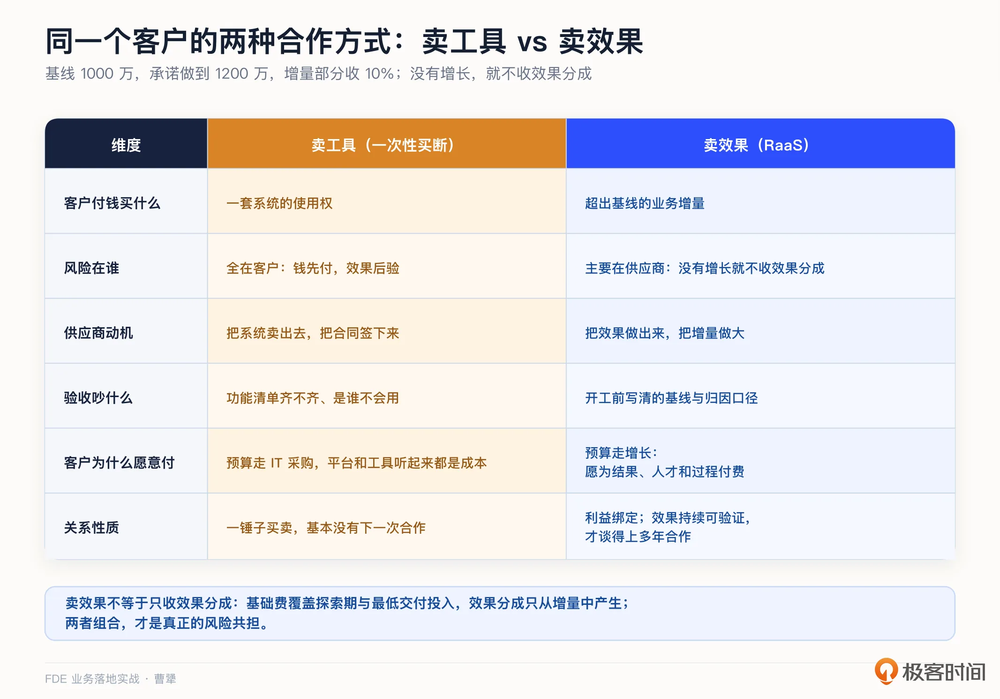
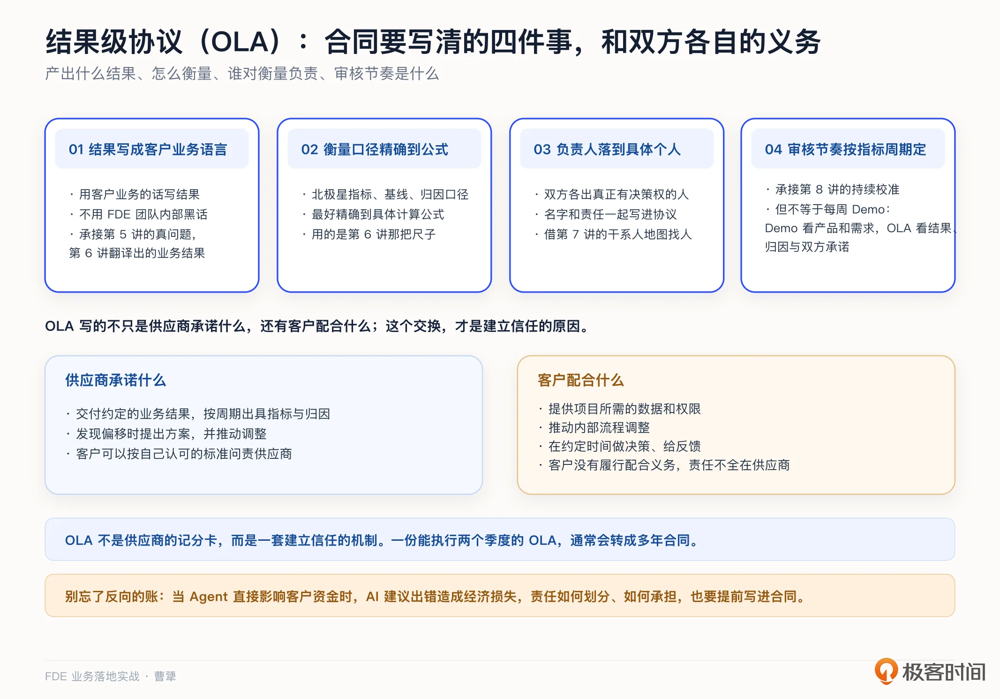
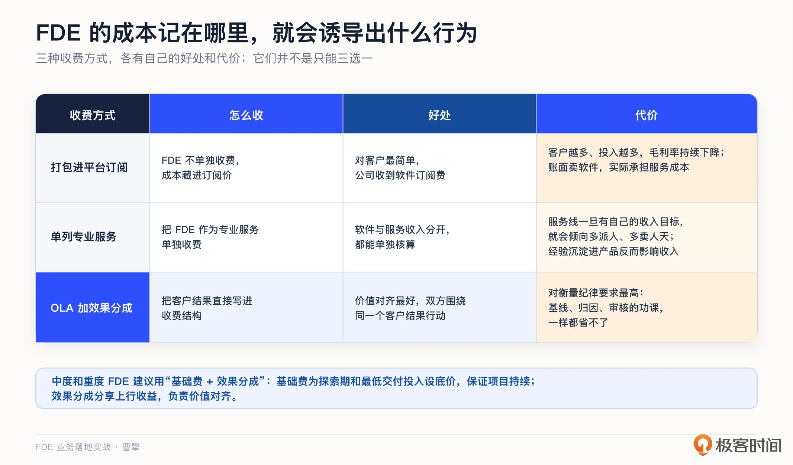
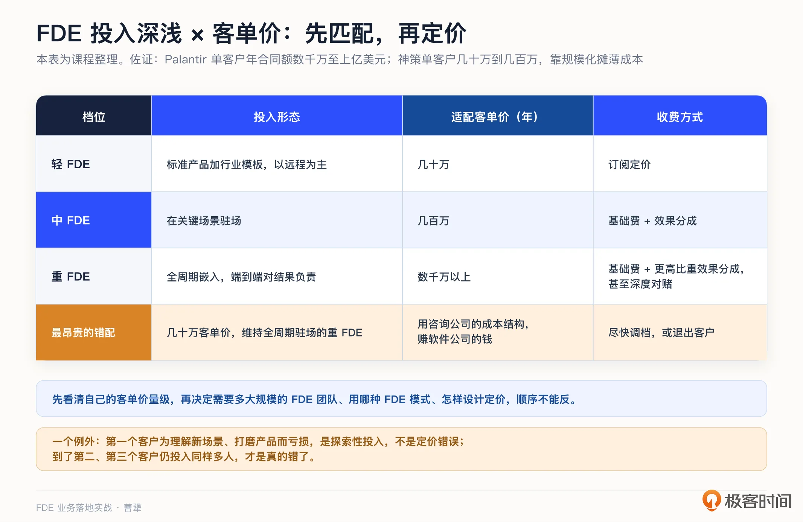
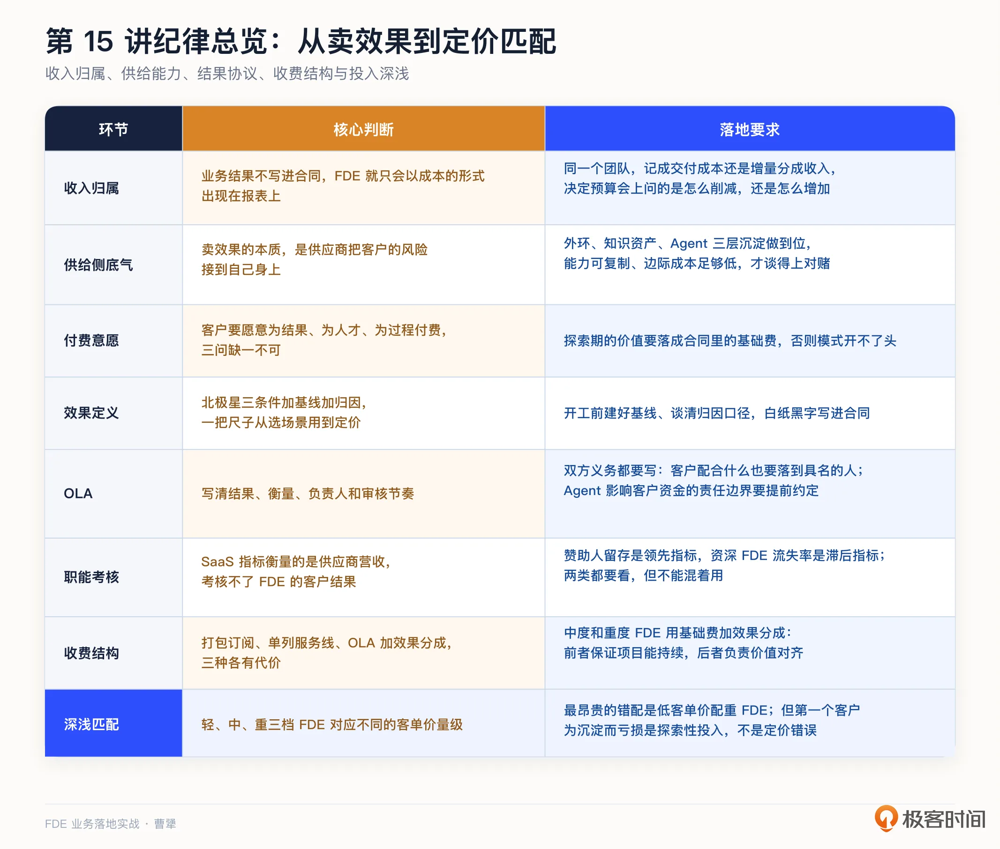

# 15｜从卖工具到卖效果：FDE 怎么定价才不沦为成本中心？
你好，我是曹犟。

上一讲最后，我们讨论了这样两个问题：知识变成资产以后，怎么把它变成收入？FDE 岗位工资这么高，通常远高于传统的交付实施，FDE 类的项目怎么才能不被当作成本中心？按人天、按席位，还是按效果付费？这一讲，我们就来仔细算算这笔账。

我们先看同一个客户的两种不同合作结果，这也是我自己亲身经历抽象出来的真实对照。当然，为了描述方便，这两种情形在这里都做了极端简化。

第一种结果：客户花 50 万买了一套系统，上线了，也做了产品使用的培训，然后呢？客户的业务团队用不起来，业务效果做不出来，钱却已经花出去了。客户找供应商，供应商说系统没有问题，是你们不会使用；客户却认为，是你们的系统不好用。双方都觉得委屈，这单生意就成了一锤子买卖，基本不可能再有下一次的合作机会。

第二种结果：换一种合作方式。双方先约定一个基线，客户的复购 GMV 现在是 1000 万，供应商承诺帮客户做到 1200 万；做到了，超出基线的增量部分，供应商收 10%；没有增长，就不收费，或只收最基础的费用。客户的风险显著降低，供应商的动机也发生了变化：从“把系统卖出去”变成“把效果做出来”。

第二种就是随着 AI 的发展，To B 行业讨论非常热烈的 RaaS 模式，Result as a Service，也就是按结果付费。

这一讲试图给你讲清楚的，就是从第一种走到第二种需要思考和解决的几个问题：为什么只按工具卖，FDE 很容易被当成成本中心；卖效果的账能不能算清楚；效果怎么定义才能避免争议；以及价值锚定结果以后，三种收费方式该怎么组合。

## 为什么只按工具卖，FDE 很容易成为成本中心

我们先看这个问题的根源。我曾经把中国 To B 传统交付的困境总结为三宗罪：价值难衡量，责任无法界定，风险全在客户。

第一， **价值难衡量**。同一套系统，有的客户用得好，有的客户用得差，这中间的差异很难归因。产品本身、使用者的能力、客户的业务流程和组织配合度，都会影响最后的结果。客户花了钱，老板最后问的却是：这套系统到底给业务带来了什么？如果这个问题回答不出来，产品功能再强，客户也会觉得不值这个价。

第二， **责任无法界定**。效果不好时，乙方会说：系统已经按合同上线，是你们不会用，运营能力也没有跟上。甲方则会说：我们买系统就是为了拿到效果，用不起来，恰恰说明系统不好用。双方的说法都有一部分道理，因为传统合同通常约定的是功能、项目范围和上线时间，却很少把业务结果以及双方各自的责任说清楚。最后很容易变成长期扯皮。

第三， **风险全在客户**。客户先付钱，系统再上线，最后才能看到效果。但系统能不能带来增长、降本或者效率提升，付钱时并不确定。即使最后没有效果，只要系统按合同上线，乙方在形式上就已经完成了交付，而不确定性带来的损失主要由客户承担。

正如 [第 4 讲](https://time.geekbang.org/column/article/1001117 "") 所说，压价、定制、私有部署和拖欠尾款，这些本质上都是客户在风险错配下的自保。

这三宗罪不只让客户没有安全感，也把 FDE 推到了一个很尴尬的位置。传统合同卖的是工具，收入对应的是软件和功能；为了让客户真正拿到结果，公司又不得不派成本很高的 FDE 驻场，补上使用能力、业务流程和组织配合这些缺口。FDE 做得越深入，客户拿到的效果可能越好，但公司投入的人力也越多。

可是问题在于，合同里通常没有一项收入直接对应 FDE 创造的业务结果，FDE 的人力投入却会进入交付成本。To B 公司的毛利率，可以简单理解为项目收入减去交付成本，再除以项目收入。净利则是在毛利的基础上，再减去研发成本、营销成本和公司管理成本，这里就不展开了。

投资人和资本市场关心毛利率，其实无可厚非。毛利率高低，直接决定了研发投入能产生多大的经营杠杆。产品一旦研发出来，如果可以被更多客户重复使用，收入增长就不需要同步增加交付人力，前期研发投入也会被更大的收入规模摊薄；反过来，如果每增加一份收入，都要同步增加一份交付人力，公司就更接近人力外包，而不是产品公司。这两类公司的增长方式不同，估值逻辑自然也完全不同。正因为如此，交付成本始终是业财分析时最容易被拿出来挑刺、要求压缩的部分。

这样一来，FDE 创造的业务价值没有体现在收入里，财务看到的却只有不断增加的成本。很多 FDE 团队可能都吃过这个亏：这个客户是公司的战略客户，为了做出一个标杆，交付出好的效果，FDE 消耗的人天也就越来越多。在这种情况下，FDE 团队就很容易变成报表上非常显眼的成本中心。

到了年底预算会，财务不会管你到底做出来多少标杆，得到了多少行业认知，让产品得到了多少改进，他们只会问一句“这个团队怎么这么贵，项目毛利怎么这么低”，如果我们回答不上来，团队就很容易被削减预算。

同一个团队，两种讲法，得到的结果完全不同。对财务来说，如果这是服务客户的交付成本，他自然想的是怎么节省；如果合同里明确写着这个团队对应的客户增量分成收入，他就会想怎么放大。同样的一个 FDE 团队，但因为收费方式不一样，在账本上的位置变了，预算会上的问题也会从“怎么削减”变成“怎么增加”。至于这笔账在报表里到底应该怎么记，下一讲会专门讨论。这一讲先解决定价问题： **把 FDE 对应的业务结果写进合同，明确结果怎么衡量、费用怎么收。**

其实，按效果付费这种方式也是符合中国甲方老板的偏好的。很多中国老板很难单纯为了一个平台付费。平台、工具、系统，这些词听起来就是成本；他们愿意付钱的，是结果，是增长，甚至是“你把这件事整个替我做了”。传统客户的营销类预算，要比 BPO 人力外包预算高一个数量级，又要比 IT 采购类预算再高一个数量级，道理就在这里。

[第 4 讲](https://time.geekbang.org/column/article/1001117 "") 梳理的神策十一年的交付演变，放到定价上看，那段经历还有另一层含义：客户的预算一直在把我们从“为产品付费”推向“为结果付费”。这条路不是我们设计的，而是客户用预算投票投出来的。

## 卖效果的账，为什么现在能算了

有人会问：按效果收费听起来很有吸引力，但供应商凭什么敢接？效果做不出来，成本由谁承担？

这个质疑显然是成立的。卖效果的本质，是供应商把客户的风险转嫁到自己身上。敢接这个风险的前提，是供应商对“把效果做出来”有把握，而且交付效果的边际成本足够低。过去这两个条件都不成立：效果依赖资深顾问人工陪跑，人力成本降不下来，能力也很难复制。

过去在各种乙方模式里，最接近“为客户结果负责”的，可能是咨询公司。咨询顾问拿着很高的薪资，深入客户现场分析问题、设计方案，但最后交付的往往还是一份 PPT。客户支付的咨询费，买到的通常还是一段服务过程和一套解决方案，很难真正与最终的业务效果挂钩。所以，咨询公司虽然离客户的业务问题更近，商业模式依然没有跨过按效果付费这一步。

但我们把前面几讲连起来看，可能条件已经变了。 [第 13 讲](https://time.geekbang.org/column/article/1006722 "") 的外环循环让第二个客户的成本降到一个零头； [第 14 讲](https://time.geekbang.org/column/article/1006738 "") 的知识资产化，让老师傅的默会知识变成一百个 Agent 的共同能力； [第 10 讲](https://time.geekbang.org/column/article/1005104 "") 则把产品使用知识、问题分析方法和陪跑经验做进 Agent，让原来只能靠人教、人陪的工作，可以在更多客户那里重复完成。能力越可复制，对赌的底气越足。

所以我说，从卖工具到卖效果，不只是商业模式的选择，它是在这一次 AI 技术革命的演进下，前面所有沉淀动作的变现时刻。沉淀没做到位就去对赌，那不叫商业模式创新，那叫赌博。

供应商敢不敢承担风险，只解决了按效果付费的供给侧问题。至于客户是否愿意为业务结果付费，前面已经给出了答案：客户的预算一直在把供应商从“为产品付费”推向“为结果付费”。

不过，市场整体愿意为结果付费，不代表每一个具体客户都适合这种模式。落到一个具体客户，可以把付费意愿收敛成三个问题。

前两个问题，我之前讨论 FDE 模式时提过：这家客户愿不愿意为结果付费，而不只是为功能付费？愿不愿意为人才付费，接受高单价背后是高水平的人？这大半年在客户现场做下来，我会再加上第三个问题： **愿不愿意为过程付费？**

FDE 进场的前几周，产出可能只是“把客户的业务学明白了”，系统还没有上线，报表上也看不到结果。这段学习期的价值，客户是否认可，某种意义上决定了这个模式能不能开始。

[第 5 讲](https://time.geekbang.org/column/article/1002969 "") 客户四问里的“谁为探索买单”，问的就是这件事；到了定价这一讲，它需要落成合同里的基础费。基础费覆盖的不只是供应商的成本，也是客户为探索期支付的费用。客户支付这一侧看的是付费意愿；供应商为探索期投入的人力和成本该如何归类，下一讲会专门讨论。

客户愿意付费，只说明交易有可能开始。这个模式最终能不能成立，还要看效果能不能被明确衡量和归因。

## 效果怎么定义，才不会吵到解约

卖效果最大的风险，不在敢不敢，而在效果的定义。定义不清，最后很容易产生争议，甚至导致解约。

好在这把尺子我们 [第 6 讲](https://time.geekbang.org/column/article/1002988 "") 已经准备好了，就是北极星三条件：指标要与商业价值强相关，要客户能通过自身努力影响，要能被有效拆解和归因。具体项目上就是开工前建好基线，谈清归因口径，白纸黑字写进合同。第 6 讲时它是选场景的尺子，这一讲时它则用来定价。这也是我一直强调“一把尺子用到底”的原因：选场景、验收、定价，用的是同一套定义，客户才不会觉得你在换着花样收钱。

要把效果定义工程化，Shimoda 在书里给了一个工具，我自己也在用，叫 **结果级协议，OLA**。它是 FDE 和客户之间的一份书面协议。这份协议需要写清楚四件事：这次交付要产出什么结果，怎么衡量，谁对衡量负责，审核节奏是什么。

OLA 的这四个要素，并不是对前面四讲的一一复述，而是把前面讲过的方法具体体现在一份协议里。

[第 5 讲](https://time.geekbang.org/column/article/1002969 "") 先摸到客户的真问题， [第 6 讲](https://time.geekbang.org/column/article/1002988 "") 再把真问题翻译成可衡量的业务结果；到了 OLA 里，这个结果还要用客户的业务语言写下来，而不是使用 FDE 团队内部的黑话。

衡量口径则要把北极星指标、基线和归因说清楚，最好精确到具体的计算公式。

负责人这一条，可以借助 [第 7 讲](https://time.geekbang.org/column/article/1003666 "") 的干系人地图，找到双方真正有决策权的人。OLA 则还要再往前走一步，把具体结果和衡量责任落到这些具名的负责人身上。

审核节奏承接的是 [第 8 讲](https://time.geekbang.org/column/article/1005076 "") 在过程中持续校准的思路，但不完全等于每周 Demo。每周 Demo 主要看产品和需求有没有走偏，OLA 审核则要看业务结果、归因和双方承诺有没有走偏，具体频率要根据指标的变化周期来定。既要能及时发现项目进展的偏移，又不能频繁到影响双方关系和正常工作。

为什么要专门把审核节奏写进合同？

[第 11 讲](https://time.geekbang.org/column/article/1005151 "") 说过，AI 系统的效果往往不是一次交付之后就固定下来，而是一条持续逼近的曲线。因此，验收不能只靠项目结束时的一次签字，还要按照约定的周期查看指标怎么变化。OLA 把这个节奏提前写进合同，更容易把双方的讨论从“你到底做完没有”，拉回到“这个周期我们共同提高了哪一项指标”，这样就是把沟通的气氛从对抗变成了协作。

OLA 的本质，不是供应商的记分卡，而是一套建立信任的机制。客户可以按照自己认可的标准问责供应商；作为交换，供应商也有了推动客户调整流程的依据。

这个“交换”很关键。效果不是供应商单方面交付的，所以合同不能只写供应商承诺什么，也要写清楚客户需要配合什么：谁提供数据和权限，谁推动流程调整，谁在什么时间做决策、给反馈。如果客户没有履行这些配合义务，结果没有做出来，也不能把责任全部算在供应商头上。一份能够执行两个季度的 OLA，通常会转成多年合同，因为客户已经用自己信得过的数字，看到了 FDE 的交付确实在产出承诺的结果。

除了约定效果怎么衡量、怎么分钱，合同里还要写清楚另一类责任：当 Agent 直接影响客户的资金时，如果 AI 的建议出错并造成经济损失，责任怎么划分、怎么承担。以我们的投放 Agent 为例，我们和客户围绕这件事来回讨论了几次，最后把责任边界写进了合同。开头提到的三宗罪里，有一条就是责任无法界定；AI 进场以后，这个问题只会更加突出。提前用书面方式约定清楚，对双方都是保护。

## FDE 团队，不能只用 SaaS 指标考核

前面讲的是怎么用 OLA 衡量单个项目的效果。再往上一层，还有一个组织问题：公司应该用什么指标考核 FDE 团队？很多公司的第一反应，是继续沿用订阅收入、续约率、毛利率等标准 SaaS 指标。

这些指标适合衡量软件公司的经营情况，但直接拿来考核 FDE，会出现三个偏差。

1. **衡量对象错了**。SaaS 指标看的是供应商的营收、续约和利润，FDE 首先要看客户的业务结果。

2. **反馈周期太长**。尤其是续约率，通常要等到合同周期结束才会显现，等它变坏再行动，往往已经来不及。

3. **激励方向错了**。如果只按毛利率和成本考核 FDE，团队最自然的选择就是减少现场投入，反而可能损害客户结果。

那 CFO 接下来可能会追问：不用 SaaS 指标，那用什么指标管理这个团队？职能级指标里，有三个我们很熟悉：第二客户时间、平台提交率、产品化速度。 [第 13 讲](https://time.geekbang.org/column/article/1006722 "") 已经把它们放进了沉淀仪表盘，这里不再重复。

还需要单独补充两个跟人有关的指标。 [第 7 讲](https://time.geekbang.org/column/article/1003666 "") 说过，赞助人就是客户内部为项目背书、争取资源的关键人。这里要看的第一个指标，就是 **赞助人留存**。这是一个领先指标，赞助人的储备一旦减少，可能 6 个季度之后的续约就有风险。到了这一讲，赞助人不只是一段需要经营的关系，也变成了一个需要持续关注的指标。

第二个是 **资深 FDE 流失率**。这是一个滞后指标。资深 FDE 一旦离开，受影响的首先是正在交付的项目：他对客户业务、系统边界和关键干系人的理解，很难在短时间内完整交给新人。项目推进和交付质量可能因此出现波动，现场积累的经验也更难及时沉淀回产品。等流失率在数据里明显上升时，背后的问题可能已经积累了 3 个季度。

我的理解是，这两类指标都要看，但不能混着用。赞助人留存是领先指标，用来提前判断未来续约的风险；资深 FDE 流失率是滞后指标，用来判断团队的交付能力和知识沉淀是否已经受到影响。

## 按效果定价，不等于只收效果分成

前面讲清楚了怎么衡量客户结果。最后再回到现实中的收费问题。FDE 的价值应该用客户结果衡量，不代表所有费用都只能在结果出现以后收取。前者回答的是“这个项目值多少钱”，后者回答的是“这笔钱在什么时候、以什么方式收”，这是两个层次的问题。

纯效果分成在理论上最容易对齐双方利益，但实际操作很难。业务结果不完全由供应商控制，客户是否及时提供数据和权限、推动流程调整、做出必要决策，都会影响最终效果。与此同时，FDE 的人力和 token 成本从项目启动时就已经发生，效果却可能要几个月之后才能看到。如果把所有费用都押在最终结果上，只是把风险从客户一端全部转移到了供应商一端，并没有形成真正的风险共担。

现实中的收费方式大体可以分成三种，每一种都有自己的代价。

**第一种，是把 FDE 打包进平台订阅，不再单独收费。** 这样做对客户最简单，公司收到的也是软件订阅费，但 FDE 的人力成本并不会消失。如果客户越多，FDE 的投入也要跟着增加，毛利率就会持续下降。账面上卖的是软件，实际上承担的却是服务成本。

**第二种，是把 FDE 单独作为专业服务收费。** 这样做的好处是，软件收入和服务收入分开了，FDE 的收入和成本都能单独核算。但问题也很明显：如果这条服务线有自己的收入目标，团队最直接的做法就是多派人、多卖人天。这样一来，把经验沉淀进产品、减少下一个项目的人力投入，反而会影响自己的收入。

**第三种，直接把客户结果写进收费结构，也就是 OLA 加效果分成。** 价值对齐最好，但对衡量纪律的要求最高，前面那些基线、归因、审核的功课，一样都省不了。

这三种做法并不是只能三选一。具体怎么组合，还要看客单价和投入深度是否匹配。客单价几十万的客户，用轻 FDE：标准产品加行业模板，以远程为主，采用订阅定价；客单价几百万的客户，用中 FDE：在关键场景驻场，采用基础费加效果分成；客单价数千万以上的客户，才适合重 FDE：全周期嵌入，提高效果分成的比重，甚至深度对赌。

反过来说也成立：Palantir 敢做最重的模式，是因为它单客户年合同额在数千万到上亿美元； [第 6 讲](https://time.geekbang.org/column/article/1002988 "") 提过 OpenAI 团队的信条，只做价值至少在数千万美元量级的问题，那既是选场景的门槛，也是支撑重 FDE 的门槛。神策走标准产品加行业方案的路线，单客户几十万到几百万，就必须靠规模化摊薄成本。最昂贵的错配，是拿着几十万的客单价，维持全周期驻场的重 FDE，也就是用咨询公司的成本结构，赚软件公司的钱。

当然，这里有一个例外。 [第 13 讲](https://time.geekbang.org/column/article/1006722 "") 提过，第一个客户可能会是亏损的。有时候，为了把一个新场景理解透、把产品打磨出来，公司明知道项目本身覆盖不了驻场成本，还是会派 FDE 深度驻场。只要这些投入能够沉淀成第二个、第三个客户可以复用的能力，这种亏损就是 **探索性投入**，不是定价错误。真正的问题是，到了第二个、第三个客户，团队仍然需要投入同样多的人，亏损也跟着重复发生。

从这个匹配关系可以看出来，对于需要持续投入现场人力的中度和重度 FDE，我更建议采用“ **基础费用加效果分成**”。这里的基础费用，不是把 FDE 按人天卖出去，而是为探索期和最低交付投入设一个底价，覆盖人力和 token 成本；效果分成则分享上行收益，让双方围绕同一个客户结果行动。前者保证项目能够持续，后者负责价值对齐。我们海外营销 Agent 的全托管模式，采用的就是这种收费方式。

在具体谈合同的时候，客户常见的质疑是：凭什么增量要分给你 10%？这时候可以直接跟他把效果分成这笔账算清楚：这 10% 只从增量中产生，客户原有的 1000 万不会减少；基础费用覆盖必要投入，效果分成只来自我们帮客户多赚出来的钱；没有增长，就不收效果分成。这样，客户不用为不确定的结果提前买单，供应商也不需要独自承担所有探索成本。把这些说清楚之后，如果是一个有合作意愿的客户，讨论就会从“该不该分”转到“基线和归因怎么定”，而后者恰恰是前面我们一直在准备的事情。

## 课程总结

这一讲，我们讲的是定价。核心判断是：FDE 的价值应该用客户结果衡量，但实际收费要在价值对齐和风险共担之间取得平衡。

AI 和人的分工也很明确。AI 可以辅助测算，但不能替人做定价判断。基线定在哪里，增量分几成，敢不敢签下“没有效果就不收效果分成”，这些都是对客户价值和对赌风险的权衡，需要由人来决定。

我把这一讲的关键点整理成一张表：

如果你想转型 FDE，这一讲希望你建立一个意识：会算账的工程师很稀缺。能够把自己的工作转化成“给客户带来了多少增量”的人，通常更不容易在组织调整中被替代。

对交付和实施同学，OLA 四要素可以先在小范围试起来：下一个项目，试着把验收标准写成客户的运营语言，把责任人落实到具名的人。这样做之后，很多争议会明显减少。

对 To B 创业者和技术决策者，匹配表是这一讲的核心。先看清自己的客单价量级，再决定需要多大规模的 FDE 团队，用哪种 FDE 模式，怎么设计定价方式，顺序不能反过来。

这一讲解决的是，怎样把 FDE 创造的客户价值写进合同、变成收入。但收费方式理顺了，不代表公司就不会慢慢滑向服务化。为了打磨产品，公司可以暂时牺牲多少毛利？让出去的毛利，究竟换回了可复用的产品能力、数据入口和客户的核心工作系统，还是只换来更多定制和驻场？更重要的是，毛利以后能不能回来？下一讲，我们就来讨论怎样避开服务陷阱。

## 思考题

留两个问题，欢迎你在留言区聊聊。

第一，你现在的项目如果明天改成“没效果不收费”，你敢签吗？不敢的话，卡在哪：是效果定义不清，基线没有，还是能力还不可复制？

第二，拿三种收费方式对照你们公司：FDE 或交付团队的成本，现在藏在哪里？是打包在订阅里，单列服务线，还是绑在效果上？这种记法，正在诱导团队做出什么行为？

期待你在留言区分享你的思考。如果这节课对你有启发，也推荐你把它分享给身边更多朋友。