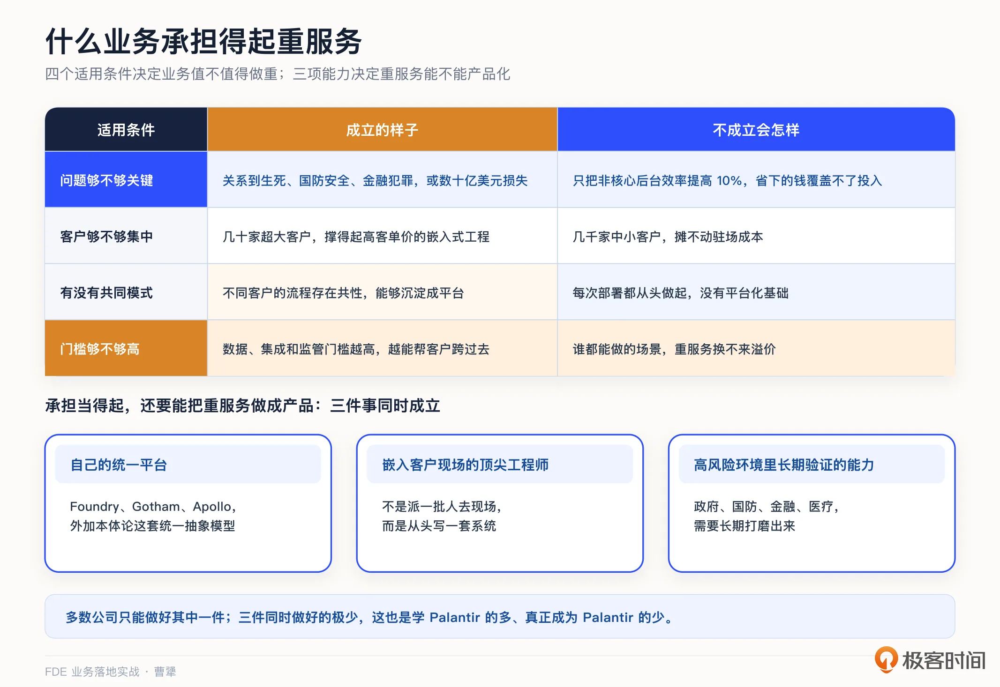
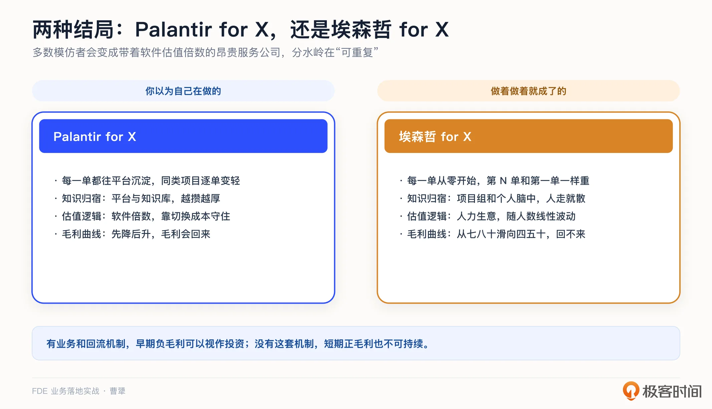
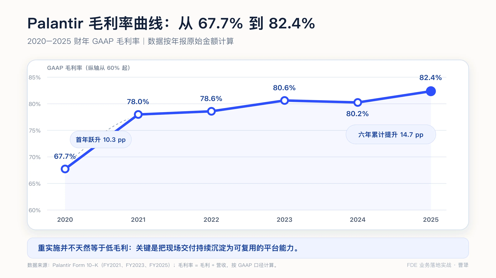
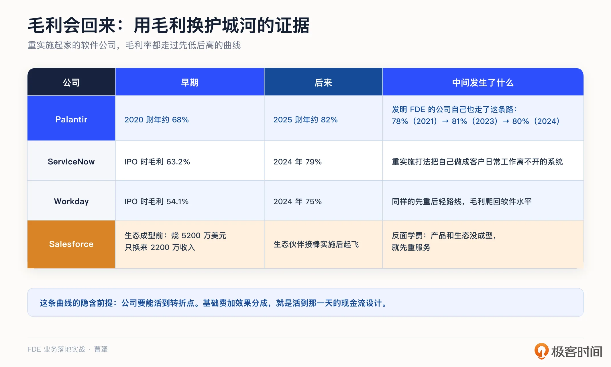
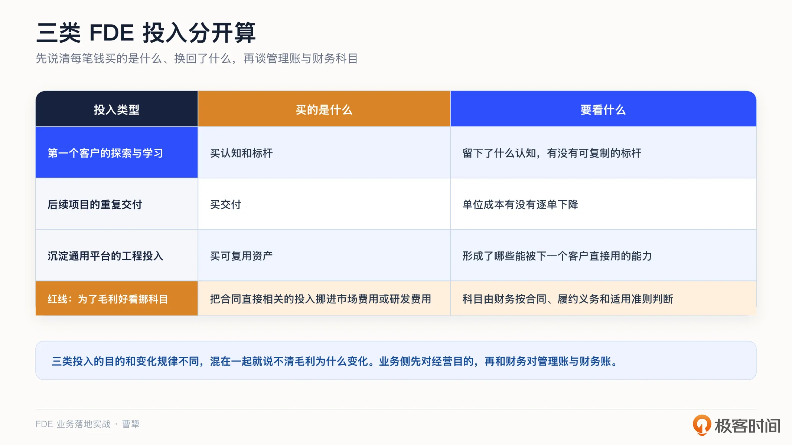
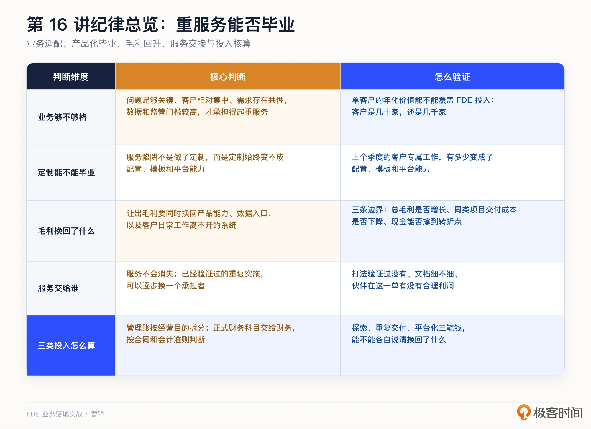

# 16｜避开“服务陷阱”：用毛利换护城河的商业账怎么算？
你好，我是曹犟。

上一讲的结尾，我们留下了一个对于 FDE 模式至关重要的问题：为了打磨产品，公司可以暂时牺牲多少毛利？让出去的毛利，究竟换回了可复用的产品能力和长期壁垒，还是只换来更多定制和驻场？更重要的是，毛利以后能不能回来？这一讲，我们就来把这几个问题算清楚。

FDE 模式最需要警惕的风险：服务越做越重，却没有换回可复用的产品能力，最后把产品公司做成了外包公司。前 OpenAI 首席研究官 Bob McGrew 对考虑采用 FDE 的创业者有一个很明确的建议：如果标准化产品已经可以直接规模化，就不要采用 FDE； **只有当客户场景差异很大、产品离开 FDE 就无法落地时，这套模式才可能成为唯一可行的路径，甚至形成护城河。**

AI 时代 FDE 之所以重新火起来，也是因为 AI 系统天生存在这样的矛盾：底层模型可以通用，但真正落地时，每家企业的数据、流程、权限和业务判断都不一样。标准化产品很难直接跨过这段距离，很多产品探索必须进入客户现场才能完成。

需要警惕的是，如果现场工作不能持续沉淀回产品，FDE 就会退化成纯服务业务。a16z 在分析这一轮模仿 Palantir 的浪潮时也提出：多数公司最后会变成“带着软件估值倍数的昂贵服务公司”，却没有可复利的壁垒。他们把这两种结果概括成一组对照：以为自己在做“Palantir for X”，最后却成了“埃森哲 for X”。

[第 2 讲](https://time.geekbang.org/column/article/1000788 "") 我们讨论过“FDE 是不是外包”，当时最核心的两个业务判据，是现场认知有没有沉淀回产品，以及第二个客户做起来是不是更容易。这一讲我们从财务的角度，则是看 **让出去的毛利能不能赚回来**。前面更多在讲怎么把服务做好、做重、做深，这一讲则反过来讨论它的另一面：这条路有什么坑，什么样的公司会掉进去，什么样的公司能够走出来。

## 重服务为什么会失控，什么业务承担得起？

很多人以为，变成外包公司是某个具体错误决策的结果，比如接了不该接的订单，研发了不该研发的产品。但 Shimoda 的判断恰恰相反：服务陷阱并不是某一次单一的战略失误造成的，而是公司在一个个看似合理的决策中逐步滑进去的。这个过程最明显的特征，就是客户专属的工作，一点一点跑赢通用平台的工作。

每一次选择单独看起来都很合理：这个客户很重要，这个定制不做单子就丢了，这个需求先做了再说。没有哪一个决策是错的，但一个季度一个季度过去，毛利就从软件公司的百分之七八十，滑向了服务公司的百分之四五十。这不是某个决策导致的，而是因为长期的疏忽。类似的滑落过程，以及随后痛苦的拨乱反正，我在神策也亲身经历过。

不过，这只能解释公司怎么滑进服务陷阱，还没有回答另一个更重要的问题：为什么 Palantir 能长期做重服务，很多模仿者却做不成？a16z 在 The Palantirization of Everything 这篇文章里，给出了四个判断条件。

**第一，所解决的问题是不是足够关键。** 如果问题关系到生死、国防安全、金融犯罪，或者可能造成数十亿美元的损失，派团队在现场投入几个月也可能是值得的。反过来，如果只是把一个非核心后台流程的效率提高 10%，一年节省下来的成本还覆盖不了几个月的 FDE 投入，就不值得派团队长期驻场。

**第二，客户是不是足够集中。** 有几十家超大客户，可以支撑高客单价的嵌入式工程；几千家中小客户则很难。所以，有些中国银行业的 IT 服务公司，只服务资产六万亿以上的客户，也能有足够的利润活下去。

**第三，不同客户之间有没有共同模式。** 如果每个客户的流程都完全不同，每次部署都要从头做起，就没有平台化的基础。过重的投入就是不值得的。

**第四，场景里有没有足够强的数据、集成和监管门槛。** 门槛越高，FDE 帮客户跨过去的价值才越大。

这四个条件说清了一个经常被忽略的前提： **不是所有业务都值得用重服务去换护城河。** 如果问题不够重要、客户又小又分散、需求彼此没有共性，哪怕团队执行得再好，也很难摊薄 FDE 的成本。这样的公司掉进服务陷阱，不只是因为管理失控，更可能是商业模式从一开始就不成立。

Palantir 的特殊之处，正是这四个条件大多成立。它服务的是政府、国防、金融和医疗等高风险场景，客户数量相对有限，但单个客户的价值很高。同时，它并不是派一批工程师去客户现场从头写系统，背后还有 Foundry、Gotham、Apollo 等统一平台，有本体论这种统一的抽象模型。

前面四个条件，回答的是业务值不值得做重。接下来这三件事，回答的是公司有没有能力把重服务做成产品。

[a16z 的文章中](https://a16z.com/the-palantirization-of-everything/ "") 引用了 Everest Group 的一份分析，认为 Palantir 的特殊之处，在于三件事同时成立：有自己的统一平台，有嵌入客户现场的顶尖工程师，以及在政府和国防等高风险环境里长期验证形成的能力。多数公司能做好其中一件，也许两件，但三件同时做好的极少。这可能也是为什么学 Palantir 的那么多，真正成为 Palantir 的那么少。

## 服务陷阱不是做了定制，而是定制无法毕业

但需要说明的是，即使具备这些条件，重服务也不会自动变成护城河。真正起作用的，是一套让定制不断“毕业”的机制。

[第 13 讲](https://time.geekbang.org/column/article/1006722 "") 已经讨论过，客户专属的工作需要不断变成配置、模板和平台能力，成熟项目也要逐步交给客户团队。放到这一讲的商业账里，真正要看的是这套毕业机制有没有改变公司的成本结构。 **平台提交率** 和 **产品化速度** 这两个指标，反映的正是这个结果：同类项目需要投入的人是不是越来越少，已经标准化的实施工作能不能进一步交给生态伙伴。如果做不到，早期服务就不是产品投资，而只是不断增加的交付成本。

Palantir 把 FDE 称为平台演化过程中的“人类反向传播”：现场发现的问题，要持续成为平台迭代的输入。放到商业账里看，这条反馈链路决定了现场投入最终是变成平台资产，还是只留下交付成本。

还有一个很有意思的变化。2025 年底，Palantir 和埃森哲扩大了合作，由 Palantir 的 FDE 与两千多名掌握 Palantir 产品和系统的埃森哲专业实施人员共同服务客户。表面上看，这和前面“Palantir for X”与“埃森哲 for X”的对照似乎有些矛盾，但其实恰恰说明了真正的分界线。

软件公司并不需要把所有服务永远握在自己手里。它需要保留的是统一平台、产品方向、现场反馈和可复用的知识资产；已经被验证过的重复实施，则可以逐步交给伙伴。 **服务不会消失，但会逐渐换一个承担者。** 早期由自己的 FDE 下场学习，后期由生态伙伴扩大交付，平台公司才能在不切断现场反馈的前提下，把收入增长和内部人数增长逐步分开。

所以，判断一家公司有没有掉进服务陷阱，不能只看今天的服务收入占比，还要追问几个更具体的问题：一个成熟客户到了第三年，FDE 投入有没有明显下降？如果明年一下增加五十个客户，最先撑不住的是平台，还是招聘和驻场人数？过去一个季度的客户专属工作，有多少已经变成配置、模板和平台能力？重复实施能不能教会伙伴去做？这些问题如果长期没有答案，“以后再产品化”通常就只是在某个单子上决定做重服务时的一句借口。

在中国，这个问题只会更加突出。很多客户习惯按人天衡量项目价值，这种预算逻辑会持续推动供应商增加人力。如果公司没有明确的毕业和退出机制，收入越高，需要投入的人可能越多，最后卖的就不再是产品，而是团队的时间。第 18 讲会继续讨论中国市场里更具体的失败模式。

## 用毛利换护城河：这笔账怎么算？

前面讲的是，服务怎样逐渐变轻。但在服务真正变轻之前，公司往往需要先投入人力，毛利也可能暂时变差。结合我自己过去的经验和踩过的坑，我现在的判断是：一时的重服务本身不是问题，问题是这些投入最后有没有变成可以复用、可以放大的东西。

**第一，不能把轻交付本身当成目标。** 特别是在 AI 时代，产品如果不能接进客户的数据、流程和权限，就很难真正替客户完成工作。这个阶段需要 FDE 做重，不是因为公司喜欢做服务，而是产品还没有跨过从“能用”到“真正在业务里运行”的那段距离。

**第二，早期不能只盯着毛利率，还要看总毛利和产品能力能不能持续增长。** 毛利率可以暂时低一些，但客户数量和单客户价值在持续增长，产品能力也在不断积累，这笔投入可能是值得的；反过来，毛利率看起来不差，每增加一份收入却都要增加相同比例的人力，商业模式仍然没有跑通。

第三，毛利让出去之后，需要换回三样东西： **可复用的产品能力、客户的数据入口，以及成为客户日常工作离不开的系统。** 第一样决定交付成本能不能下降，后两样决定客户是否愿意长期使用、公司有没有定价权。三样东西同时增加，毛利才有机会回来。

这里说的“离不开”，不是指功能最全，而是客户的日常工作已经在这套系统里运行。数据入口也是同理：客户的业务数据从这里进入、在这里计算，其他厂商想替换你，客户就要重新连接整条数据管道。这两样东西都会增加切换成本，也是公司能够获得长期回报的基础。

但毛利让出去，不会自动变成这三样东西。FDE 进入客户现场，接入数据、流程和权限，先解决标准产品解决不了的问题，再把现场认知沉淀成通用的产品能力。等这些能力被更多客户复用，同类项目的交付成本开始下降，产品也逐渐融入客户的日常工作，早期让出去的毛利才真正换成了护城河。否则，投入的人力只是交付成本，不能算投资。

所以，我所说的用毛利换护城河，关键就在“换”这个字上。毛利可以暂时让出去，但必须换回可复利的资产。至于可以让出多少，没有一个统一的百分比。我会看三条边界： **总毛利能不能持续增长，同类项目的交付成本能不能下降，公司的现金能不能撑到毛利回升的转折点**。任何一条长期不成立，就不是在投资产品，而是在补贴服务。

## 毛利会回来的证据

a16z 给了几组我印象很深的数字。ServiceNow 上市时毛利 63.2%，2024 年是 79%；Workday 上市时 54.1%，2024 年 75%。两家都是先用重实施把自己做成客户的工作系统，然后毛利一路爬回软件公司的水平。反面的学费也有：Salesforce 早年在合作伙伴生态成型之前，烧了五千二百万美元，只换来两千两百万美元的收入，直到产品足够完善，生态伙伴接过实施的重活，它才真正跑起来。

这份清单上还可以加上 Palantir 自己。 [第 4 讲](https://time.geekbang.org/column/article/1001117 "") 我提过它 2024 财年 80% 的毛利率，这里把曲线补完整：2020 财年为 67.7%，2021 财年上升到 78%，2023 财年为 81%，2024 财年为 80.2%，2025 财年又达到 82.4% 左右。发明 FDE 模式的公司，毛利率也是从 60% 多逐步上升到 80% 左右的。

这些例子都证明，服务做得很重的公司也有可能把毛利提回来，这比抽象的论证更有说服力。

把这些公司的变化放在一起看，呈现的是一条先低后高的毛利曲线。前期毛利不好看，因为公司在用服务购买认知、入口和信任。真正的转折点，不只是客户开始离不开这套系统，更重要的是定制开始毕业，同类项目的交付投入下降，重复实施逐步由客户或者伙伴接手。同时，工作系统带来的客户黏性和定价权开始体现。成本下降和价值提升同时发生，毛利才会回升。 [第 13 讲](https://time.geekbang.org/column/article/1006722 "") 讲过的单位经济，第二次部署成本应该明显低于第一次，就是这条曲线在单个项目上的表现。

这条曲线还有一个隐含前提： **公司要能活到转折点。** 现金流的设计上，上一讲说的基础费加效果分成，就是让团队活到那一天的安排。

所以，开头提醒不要轻易进入 FDE 的服务模式，后面又解释为什么值得做，并不矛盾。分水岭就在“可重复”三个字上：有完整的服务毕业和认知回流机制，早期负毛利可以视作投资；没有这套机制，即使短期有正毛利，长期也不可持续。

## 三条纪律，别掉下坡

最后我给出三条可操作的纪律，都是从前面的案例中总结出来的。

**第一条，提前设置交棒条件**。前面 Palantir 和埃森哲的案例已经说明，真正难的不是要不要交给伙伴，而是什么时候交、哪些工作能交。已经反复验证的实施动作可以交出去；产品探索、平台标准、现场反馈和数据入口则要继续掌握在自己手里，知识资产也是如此。如果连这些都交给伙伴，最后形成的护城河就不属于自己。

这一条在中国要加一个条件，就是合作伙伴能够接得住。这需要三个前提：打法真的被反复验证过，不是你自己觉得验证过；模板和文档细到伙伴的普通工程师照着能做；伙伴在这一单里有合理的利润。三个条件欠缺任何一个，所谓的交棒就是把风险转给伙伴，客户和伙伴都不会答应。哪怕真答应了，违反商业本质的合作也注定无法长久。

如果合作伙伴真的接不住怎么办？我的建议是别硬交，自己接着干，但每接一单都要问一句：这一单比上一单标准化了多少？标准化的程度，决定你什么时候有资格交棒。

**第二条，把不同性质的 FDE 投入分开算**。先看每一笔投入花到了哪里，又换回了什么。为了判断 FDE 的经济模型，我们可以把投入分成三类：第一个客户的探索和学习、后续项目的重复交付，以及沉淀通用平台的工程投入。第一类要看留下了什么认知和标杆，第二类要看单位成本有没有下降，第三类要看形成了什么可复用能力。三类投入的目的和变化规律不同，如果管理上全部混在一起，团队就很难判断毛利为什么变化。

至于这些投入在财务报表里记入哪个科目，要交给财务根据合同、履约义务和适用准则判断。与客户合同直接相关的人工和其他投入，可能属于合同履约成本，不能因为公司希望毛利更好看，就把它们挪到市场费用或者研发费用。业务团队需要做的，是先把三类投入的经营目的和实际去向说清楚，再和财务建立管理账与财务账之间的对应关系，而不是先讨论怎样调整科目。

**第三条，把毕业机制放进经营仪表盘**。这个仪表盘要分成两组。第一组看交付有没有变轻，每个季度至少检查五个问题：

- 成熟客户的 FDE 投入有没有下降？

- 同类项目的交付成本有没有下降？

- 客户专属工作有多少变成了配置、模板和平台能力？

- 重复实施离伙伴接手还有多远？

- 毛利曲线有没有开始回升？

第二组看护城河有没有变深：数据入口有没有掌握在自己手里？产品有没有成为客户日常工作离不开的系统？两组缺一组，都不能算真正跑通。

## 课程总结

这一讲，我们讲的是服务陷阱。核心判断是：不是所有业务都承担得起重服务；即使承担得起，毛利也只能暂时让出去，并且要换回可复用的产品能力和数据入口，让产品成为客户日常工作离不开的系统，让同类项目逐渐变轻。至于毛利可以让出多久，要看三条边界：总毛利能不能持续增长，同类项目的交付成本能不能下降，公司的现金能不能撑到转折点。

AI 和人的分工也很明确。AI 可以辅助归类工时、计算毛利和整理指标，但用毛利换护城河仍然是战略判断。业务是否适合重服务，哪些定制应该毕业，什么时候可以交给伙伴，都需要由人决定。正式财务科目的判断，则要交给财务和审计专业人员。

我把这一讲的关键点整理成一张表：

如果你想转型 FDE，这一讲可以帮你校准一个预期：FDE 投入较重的公司，早期财务报表可能不会很好看，这不代表公司一定有问题，关键要看可重复性是否持续提升。选择公司的时候，这个判断可以帮助你区分暂时投入和真正的外包模式。

对交付和实施同学，可以用一个更具体的问题检查自己的工作有没有沉淀：同一类项目做到第 N 次时，团队是不是用了更少的人、更短的时间？如果没有，说明前面的经验还没有变成可以复用的能力。

对 To B 创业者和技术决策者，这一讲最重要的不是怎样把成本记得更好看，而是给重服务设好边界。先确认业务承担得起，再定期检查总毛利、同类项目的交付成本和现金。同时，把探索、重复交付和平台化三类投入分开算，才能知道问题到底出在哪里。

到这里，从进场、上线、沉淀、定价到商业账的完整链路都讲完了。下一讲开始进入复盘篇：我们把前面所有环节串起来，看一个真正跑通的 FDE 项目，从头到尾长什么样。

## 思考题

留两个问题，欢迎你在留言区聊聊。

第一，拿你们最成熟的客户做一次体检：到了第三年，FDE 的投入有没有明显下降？如果明年客户数量翻一倍，最先撑不住的会是平台，还是招聘和驻场人数？

第二，如果公司决定暂时让出一部分毛利，你准备把它换成什么？到哪个时间点，你要用总毛利、同类项目的交付成本和现金中的哪些数据，证明这笔钱是在投资产品，而不是补贴服务？

期待你在留言区分享你的思考。如果这节课对你有启发，也推荐你把它分享给身边更多朋友。