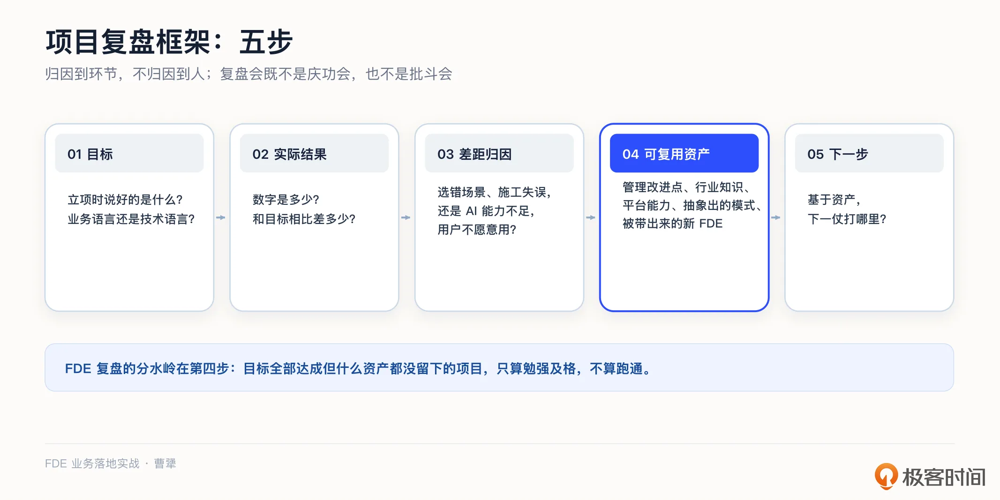
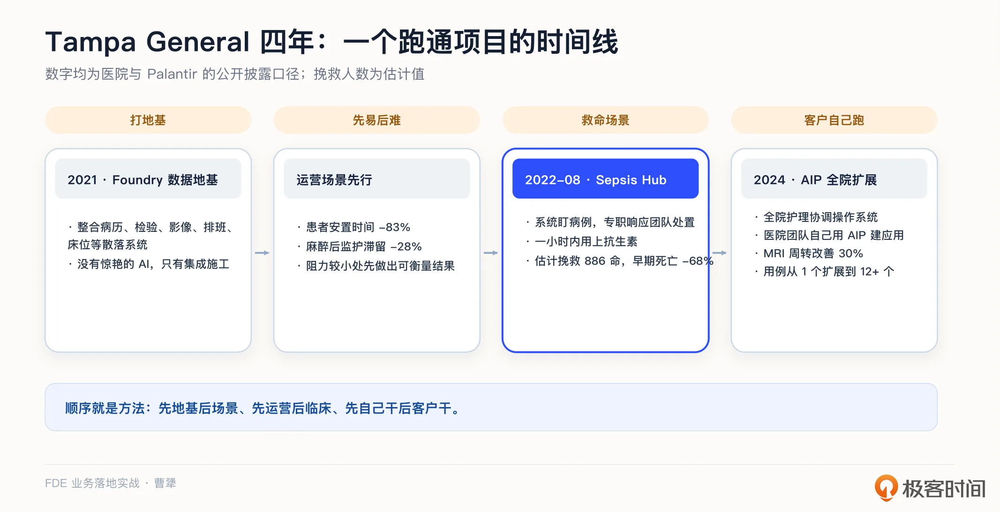
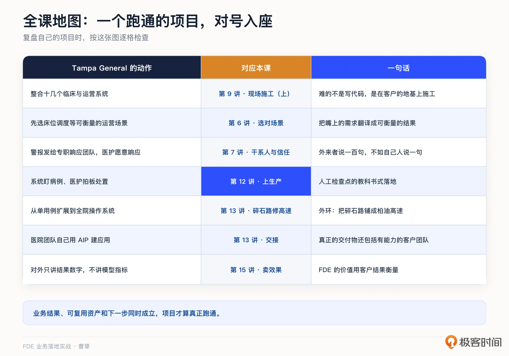
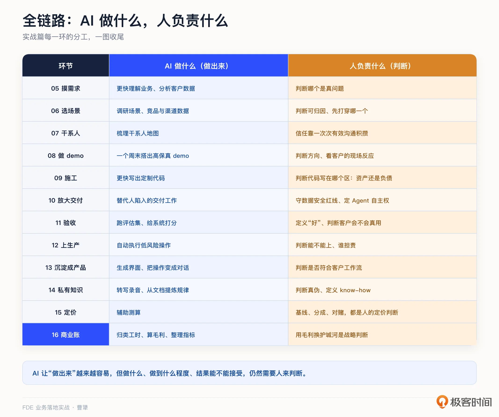
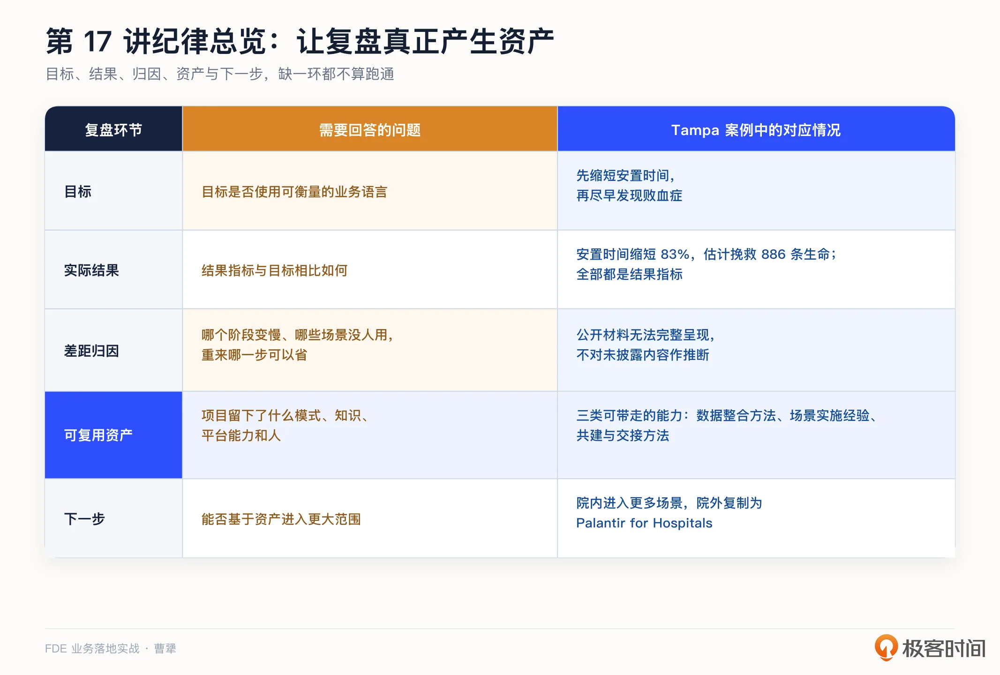

# 17｜成功复盘：一个跑通的 FDE 项目长什么样？
你好，我是曹犟。

在前面十几讲中，我们把一个 FDE 项目从进场、开发、上线、沉淀，再到定价和算账的每个环节都拆开讲了一遍。从这一讲开始，我们进入复盘篇：先看一个真正跑通的项目，从头到尾会是什么样子；下一讲，再看一个失败的项目，两相对照，会让你有更深的理解。

我们这一讲复盘的对象，是 [第 12 讲](https://time.geekbang.org/column/article/1006705?utm_campaign=geektime_search&utm_content=geektime_search&utm_medium=geektime_search&utm_source=geektime_search&utm_term=geektime_search "") 提过的美国坦帕综合医院案例——Tampa General。他们和 Palantir 合作，用 AI 做败血症早期筛查。按照医院和 Palantir 披露的口径，这个项目估计挽救了 886 条生命。这一次，我们不再只看其中一个环节，而是从头到尾梳理整个案例。之所以选择这个医院的项目，是因为医疗属于监管最严、数据最敏感、错误代价最高的行业之一。AI 项目能够在这样的条件下跑通，其中蕴含的方法和经验对其他行业通常也会更有参考价值。需要说明的是，这是一个公开的外部案例，所有细节都来自医院和 Palantir 的公开披露。

这个案例真正值得复盘的，不只是挽救了 886 条生命，更在于这项成果是怎么一步步做出来的。项目开始后的近两年里，医院和 Palantir 几乎没有做那些听起来很有吸引力的 AI 应用，而是一直在建设数据基础。 **先建设数据基础，再开展 AI 应用**，这个顺序是这一讲我最希望你关注的内容之一。

下面，我先介绍一套复盘框架，然后用它分析坦帕综合医院的案例。我们也可以用同一套框架，复盘自己的 FDE 项目。

## 复盘框架：五步

这套复盘框架分为五步，每一步都问一个问题。

1. **目标**：当初立项时确定的目标是什么？用的是业务语言还是技术语言描述？

2. **实际结果**：最终拿到了什么结果，数字是多少，和目标比差多少？

3. **差距归因**：如果目标没有达到，问题出在哪一段？是场景选错、施工失误，还是 AI 能力不足，导致用户不愿意使用？

4. **可复用资产**：这个项目给公司留下了什么，项目管理改进点、行业知识、平台能力、抽象出的模式、还是被带出来的新 FDE？

5. **下一步**：基于这些资产，接下来打哪一仗？

普通项目的复盘，做到第三步可能就结束了。而 FDE 模式的分水岭在第四步：一个项目就算目标全部达成，如果什么资产都没留下，按我们这门课的标准，它也只能算勉强及格，不能算跑通。 [第 13 讲](https://time.geekbang.org/column/article/1006722?utm_campaign=geektime_search&utm_content=geektime_search&utm_medium=geektime_search&utm_source=geektime_search&utm_term=geektime_search "") 的项目沉淀清单，就是第四步的日常化版本。

框架本身不难记，但复盘会怎么开，反而更容易出问题。

按我自己的实践习惯，有三个要点。

**第一，相关人员要到齐。** 项目经理和一线 FDE 当然要参加，但最好也让销售同学参与，因为第一步里的“当初说好的目标”，经常只有销售记得最完整。销售也因为离客户最近，可以如实反馈客户是怎么看待这个项目产出的。

**第二，复盘会的产出物就是一页复盘纪要，五个步骤各占一段。** 其中，第四步的可复用资产要逐条列出，并写明归属人。如果产出物一页写不下，通常说明还没有复盘清楚。

**第三，避免把复盘会开成甩锅会。** 项目结果没有达到预期时，大家最容易把时间都花在第三步：反复归因，强调各种客观条件，甚至互相甩锅。但复盘的重点不是追责，不应该停在解释为什么没完成，而应该进入第四步，把这次项目留下的经验和能力沉淀成可复用资产。因此，主持人要控制第三步的讨论，把足够的时间留给第四步。

## 在一家医院的四年深耕

我们回到开头这个医院的案例，先用完整的时间线把这个案例再捋一遍。

**第一阶段，2021 年，建设数据基础。** 医院部署了 Palantir 面向企业的数据平台 Foundry，把分散在各个系统里的临床数据和运营数据整合起来。

一家大型医院的系统非常分散：电子病历、检验、影像、排班、床位、转运，分别使用不同的系统，有不同的数据口径。这个阶段没有令人惊艳的 AI 应用，做的就是 [第 9 讲](https://time.geekbang.org/column/article/1005100?utm_campaign=geektime_search&utm_content=geektime_search&utm_medium=geektime_search&utm_source=geektime_search&utm_term=geektime_search "") 讨论的具体集成工作：数据在哪里、口径是什么、怎么打通使用。而两年之后的所有后续应用，都建立在这层数据基础上。

**第二阶段，先做运营类场景。** 数据基础建好之后，第一批场景选择的不是最复杂的临床 AI，而是床位调度这类运营场景：患者安置时间缩短了 83%，麻醉后监护室的滞留下降了 28%。用 [第 6 讲](https://time.geekbang.org/column/article/1002988?utm_campaign=geektime_search&utm_content=geektime_search&utm_medium=geektime_search&utm_source=geektime_search&utm_term=geektime_search "") 的框架看，这个选择很有道理：运营场景的数据完整、结果可衡量、见效较快，而且不直接介入临床决策，伦理和医疗业务上的阻力也小得多。先在阻力较小的地方做出可衡量的结果，为整个合作积累信任，也为进入更难的场景创造条件。

我们 Omni-Growth 驻场的时候，也是先从帮客户一些小忙做起，例如，帮投手把一些繁琐的表格处理工作用 AI 自动化。虽然跟主线场景没有关系，但是为构建信任创造了条件。

**第三阶段，2022 年 8 月，Sepsis Hub 上线。** 这时候，才轮到前面提过的那个真正救命的场景：败血症早期筛查。

败血症，就是感染引发的全身性炎症反应，它最凶险的地方是恶化极快，早发现几个小时，生死就可能完全不同；而它的早期信号散落在体温、心率、化验指标这些数据里，全靠人盯，很容易漏掉。这恰恰也是前两年构建那层数据地基的用武之地。系统持续监测住院患者，标记疑似败血症的病例，医护人员再介入判断和处置，被标记的患者能在一小时内用上抗生素。选择这个场景，某种意义上也是因为它是“低垂的果实”：见效快，确定性高，而且挽救生命本身就有巨大的价值。

注意这个分工，系统负责不知疲倦地盯，人负责拍板和救治，这就是 [第 12 讲](https://time.geekbang.org/column/article/1006705?utm_campaign=geektime_search&utm_content=geektime_search&utm_medium=geektime_search&utm_source=geektime_search&utm_term=geektime_search "") 聊的人工检查点的教科书式落地，也跟我们做 Omni-Growth 选择的早期场景很像，Agent 负责不知疲倦地盯着广告投放效果，人负责拍板和调整。

而这个场景取得的结果就如前面所说：估计挽救了 886 条生命，败血症早期死亡下降 68%，败血症患者的住院时长下降 30%。

这里还有一个值得单独讨论的设计细节。前面说系统负责标记、医护人员负责介入，那么具体由谁来介入？败血症预警在美国医院并不是新东西，但之前不少工具都没有真正用起来。有一篇行业分析文章总结过共同原因：警报直接发给床旁护士，可这位护士正在照顾 6 个患者，警报混在 40 个提醒中，最后 95% 都被人工忽略了。问题不一定出在工具本身，也可能是警报发错了人。

而这个项目的做法不一样。按照那篇文章的分析，系统每 15 分钟给每个住院患者打一次分，警报不发给床旁护士，而是发给一支专职响应团队，由这支团队核实并启动处置。模型只负责标记，专职响应团队负责推动后续救治，让患者在一个小时内使用抗生素。

同样一个系统，警报发给谁，决定了它能成为救命工具，还是只能成为背景噪音。这就是 [第 7 讲](https://time.geekbang.org/column/article/1003666?utm_campaign=geektime_search&utm_content=geektime_search&utm_medium=geektime_search&utm_source=geektime_search&utm_term=geektime_search "") 讨论的信任与采纳，在工程上的具体体现。这个项目真正的护城河也不只是算法，还包括工程师在医院驻扎 18 个月，打通数据管道，并让医护人员愿意接受警报的过程。

这也让我想起我们在 Omni-Growth 上的产品设计，盯盘结果到底是单独创建一个信息流，还是以符合投手习惯且容易接受的方式展现，也决定了同样的模型是否能被投手接纳。

**第四阶段，2024 年，全院扩展。** 此时，Palantir 的 FDE 们开始部署人工智能平台 AIP。Foundry 负责整合数据和业务流程，AIP 则在这个基础上，让大模型能够参与具体的业务工作。

双方的目标现在变成了建一套全院的护理协调操作系统，场景从败血症扩展到了影像、手术、转运，比如 MRI 影像周转时间改善了 30%。基于 AIP 建成的这套护理协调操作系统，把临床的专业经验、医院当时的运行状态和大模型结合起来，帮助一线安排工作的优先级，后来连计费结算这类运营工作也覆盖了。用例数量，按公开口径，从最初的 1 个扩展到了超过 12 个。

这个阶段有一个非常重要的细节：新应用不再由 Palantir 的 FDE 团队建设，而是由医院的内部团队和医师科学家自己使用 AIP 设计和部署。 [第 13 讲](https://time.geekbang.org/column/article/1006722?utm_campaign=geektime_search&utm_content=geektime_search&utm_medium=geektime_search&utm_source=geektime_search&utm_term=geektime_search "") 说过，FDE 真正的交付物不只是一套系统，还包括一个有能力的客户团队。这家医院就是一个实际案例。

医院负责人在新闻稿里表示，他们的使命是用创新改变医疗，Palantir 的平台让医院能够用数据提升质量、强化运营。这里的主语是医院自己，而不是厂商。客户团队能够自己建设应用，也说明医院已经开始主导这套系统的后续发展。对双方来讲，这是共赢。

## 用五步框架复盘

前面按照时间线顺序，我们弄明白了这个项目经历了什么。接下来，我们再用五步框架回答：这个项目做得怎么样，留下了什么，接下来往哪里走。

公开材料能够支持目标、结果、可复用资产和下一步的分析，但无法完整呈现项目内部走过哪些弯路。因此，到了第三步“差距归因”，我只说明复盘时应该追问什么，不替这个案例杜撰没有披露的答案。

1. 目标。这个项目从一开始就使用运营和临床的业务语言来描述目标：缩短安置时间、尽早发现败血症，没有一条是“部署一套大数据平台”“赋能医院护士团队实现数据驱动”这类乙方的技术黑话。这是 [第 5 讲](https://time.geekbang.org/column/article/1002969?utm_campaign=geektime_search&utm_content=geektime_search&utm_medium=geektime_search&utm_source=geektime_search&utm_term=geektime_search "") 和 [第 6 讲](https://time.geekbang.org/column/article/1002988?utm_campaign=geektime_search&utm_content=geektime_search&utm_medium=geektime_search&utm_source=geektime_search&utm_term=geektime_search "") 反复强调的：立项时就要用可衡量的业务结果说话。还要注意它的双目标渐进结构：先通过运营场景创造价值、建立信任，再在临床场景挽救生命、形成标杆，最终才能在全院得到推广。前者为后者创造条件，顺序设计得很清楚。

2. 实际结果。具体数字前面已经列过，这里需要关注的是：这些数字全部是结果指标，而不是“模型准确率提升了多少”。对外沟通成果，应该像 [第 15 讲](https://time.geekbang.org/column/article/1009805 "xxx") 讨论的那样，用客户的业务结果说话，而不是除了技术人员自嗨，没有人关注的技术指标口径。

3. 差距归因。我们在真正复盘自己的项目时，需要追问三个问题：哪个阶段比计划慢了？哪个场景做了却没人使用？如果重新来一次，哪一步可以省掉？复盘会既不能开成你好我好的庆功会，也不能开成互相甩锅的批斗会。只有把原因归到环节，而不是归到个人，团队才愿意讲出真实的弯路，也才能把这些经验沉淀成第四步的资产。

4. 可复用资产。这个项目给 Palantir 留下的，当然不是坦帕的数据和系统，而是三类可以带走的能力：一是整合医院临床与运营数据的方法；二是患者安置、人员排班、败血症预警等场景的实施经验；三是与医院的临床和运营团队共同建设应用，再逐步把建设能力交给客户的方法。

5. 下一步。基于这些资产，可以沿两个方向继续扩展。第一个方向，是在坦帕内部，以护理协调操作系统为基础进入更多场景。官方披露，双方的合作后续还在持续扩展。第二个方向，是在外部把已经验证过的方法复制到其他医院。从后续公开资料看，Palantir 在这之后，逐渐形成了 Palantir for Hospitals 这套面向医院的行业解决方案，覆盖容量管理、收入周期管理、人员配置和排班等场景，并在 Mount Sinai、HCA Healthcare、Cleveland Clinic 等医疗机构落地。

把五步放在一起，坦帕项目为什么能真正跑通也就清楚了：它不只取得了可衡量的业务结果，还留下了数据基础、可复用模式和客户团队，并且能以这些资产为基础扩展到更多场景、更多客户。业务结果、可复用资产和下一步同时成立，项目才算真正跑通。

把整个案例和这门课对应起来，会发现它涵盖了课程的多个环节：数据整合是 [第 9 讲](https://time.geekbang.org/column/article/1005100?utm_campaign=geektime_search&utm_content=geektime_search&utm_medium=geektime_search&utm_source=geektime_search&utm_term=geektime_search "")，先选择可衡量的运营场景是 [第 6 讲](https://time.geekbang.org/column/article/1002988?utm_campaign=geektime_search&utm_content=geektime_search&utm_medium=geektime_search&utm_source=geektime_search&utm_term=geektime_search "")，医护人员愿意信任并响应系统是 [第 7 讲](https://time.geekbang.org/column/article/1003666?utm_campaign=geektime_search&utm_content=geektime_search&utm_medium=geektime_search&utm_source=geektime_search&utm_term=geektime_search "")，人机分工是 [第 12 讲](https://time.geekbang.org/column/article/1006705?utm_campaign=geektime_search&utm_content=geektime_search&utm_medium=geektime_search&utm_source=geektime_search&utm_term=geektime_search "")，多用例扩展和客户自建是 [第 13 讲](https://time.geekbang.org/column/article/1006722?utm_campaign=geektime_search&utm_content=geektime_search&utm_medium=geektime_search&utm_source=geektime_search&utm_term=geektime_search "")，对外用业务结果说话是第 15 讲。我把这些对应关系画成了一张图。复盘自己的项目时，如果某一步出现问题，就可以回到对应的课程中查找工具。例如，项目效果不错，扩展速度却很慢，就可以对照 [第 13 讲](https://time.geekbang.org/column/article/1006722?utm_campaign=geektime_search&utm_content=geektime_search&utm_medium=geektime_search&utm_source=geektime_search&utm_term=geektime_search "")，检查扩展机制是仍然掌握在供应商手里，还是已经交给客户了。坦帕项目能够持续扩展，靠的就是后者。

## Palantir 的 FDE 打法：内核与边界

前面的五步复盘，我们回答了这个项目做得怎么样、留下了什么。现在，我们再往上一层，从这个项目的经验出发，进一步拆解 Palantir 的 FDE 打法：它靠什么成立，又受到哪些条件约束。

其中有三点值得关注。

**第一，客户团队要成为共建者。** 坦帕项目进入扩展阶段后，新应用不再全部依赖 Palantir 的 FDE 团队，而是由医院自己的内部团队和医师科学家使用 AIP 设计和部署。这说明，FDE 打法不是乙方长期替客户做下去，而是在共建过程中把方法和建设能力交给客户。只有客户团队能够自己继续建设，项目才具备持续扩展的条件。

**第二，软件和运营模式不能分开。** 第 14 讲讨论过两者的关系，放在坦帕的案例里再看一遍：Palantir 交给医院的不只是一套软件，还有“地基、用例、扩展、交接”这套运营模式。软件承载这套方法，现场运营又推动软件持续演进，两者放在一起，才是完整的交付方式。对于 AI 系统来讲，这个持续运营、持续改进的动作，重要性只会更大。

**第三，不能忽略这套 FDE 打法成立的前提。** 由于创始人的背景和人脉，Palantir 的早期客户是国防和情报部门，失败以人命为代价，软件和运营模式不可分。创始人本身也是大佬，背后还有十年的耐心资本。这些条件都决定了它能够承受很重的交付模式。如果不看这些前提，只照着 Palantir 的剧本去做，很可能只是增加了交付成本，却没有获得同样的规模效应。这也回应了 [第 4 讲](https://time.geekbang.org/column/article/1001117?utm_campaign=geektime_search&utm_content=geektime_search&utm_medium=geektime_search&utm_source=geektime_search&utm_term=geektime_search "") 的判断：中国学 FDE，学的应该是内核，不是剧本。你的客户、你的投资人的耐心、你的客单价，决定了你该走轻还是走重， [第 15 讲](https://time.geekbang.org/column/article/1009805 "xxx") 的投入深浅与客单价匹配表，就是回答这个问题的。

## 一条贯穿始终的观察：AI 做什么，人负责什么

最后，再补充一条贯穿整个实战篇的观察。从 [第 5 讲](https://time.geekbang.org/column/article/1002969?utm_campaign=geektime_search&utm_content=geektime_search&utm_medium=geektime_search&utm_source=geektime_search&utm_term=geektime_search "") 进场，到 [第 16 讲](https://time.geekbang.org/column/article/1011485 "xxx") 算账，我在每一讲都会谈到同一个问题：这个环节里，AI 能做到什么，人又必须负责什么。把这些内容串起来，就能看到在 AI 能力每天都在进步的时代背景下，人和 AI 的完整分工。

调研需求、制作 demo、编写代码、放大交付，这些“做出来”的工作，AI 一直在提速：帮助团队更快理解业务、用几天搭建出高保真 demo、更快编写定制代码，并替代一部分原来依赖人工陪跑的交付工作。但另一半始终没有变化，那就是判断：哪个是真问题、方向是否正确、红线应该设在哪里、什么算验收、怎么定价、该不该拒绝某个定制，这些都需要由人负责。坦帕这个案例就是一个典型缩影：系统持续监测，人负责判断和救治，两边都不可缺少。

所以，这门课从头到尾都在讲一件事的两面：AI 让“做出来”变得越来越容易，但做什么、做到什么程度、结果能不能接受，仍然需要人来判断。对 FDE 来说，这些难以自动化的判断会变得越来越重要。

## 课程总结

这一讲，我们讲的是成功复盘，提供了一套完整的判断框架，并且用一个真实案例把这套框架走了一遍。这一讲的一个核心观点是：一个 FDE 项目真正跑通，不只要取得可衡量的业务结果，还要留下可复用资产，并且能够以这些资产为基础进入下一个场景。

我把这一讲的关键点整理成一张表：

如果想转型 FDE，我建议你记住本讲案例时间线里的顺序：数据基础、运营场景、关键场景、规模扩展。下次遇到一开始就要做最复杂场景的项目，可以用这个案例来说明为什么顺序这么重要。

对交付和实施同学，五步复盘框架从下一个项目就能使用，重点练习第四步：要求自己写出“这个项目留下了什么”。如果写不出来，说明项目沉淀还没有真正发生。

对 To B 创业者和技术决策者，要特别记住，Palantir 这套 FDE 打法有自己的成立前提。学习 Palantir 之前，先诚实地列出自己的条件：客户是谁、投资人有多少耐心、客单价有多大，再决定哪些做法适合自己。

成功的样子看完了，接下来看看失败的样子。FDE 项目最容易死在哪几种方式上？中国市场又有哪些特色大坑？下一讲，翻车复盘：六大失败模式与中国六大坑。

## 思考题

留两个问题，欢迎你在留言区聊聊。

第一，用五步框架复盘你最近做完的一个项目，第四步你能写出几条？如果一条都写不出，问题出在项目本身，还是出在做的过程中没人管沉淀？

第二，对照坦帕案例的四阶段顺序，你们的 AI 项目是从地基开始的，还是从最酷炫的场景开始的？如果是后者，现在回头补地基，来得及吗？

期待你在留言区分享你的思考。如果这节课对你有启发，也推荐你把它分享给身边更多朋友。