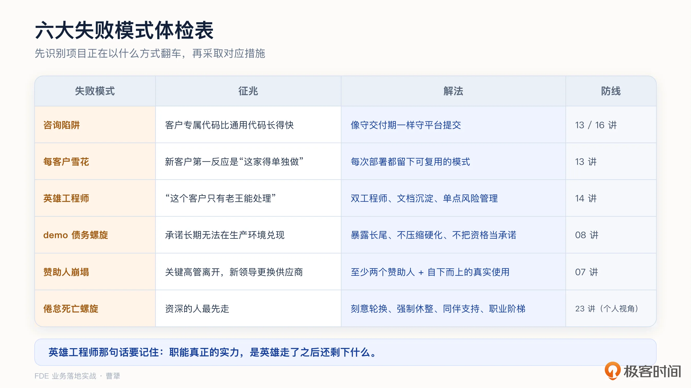
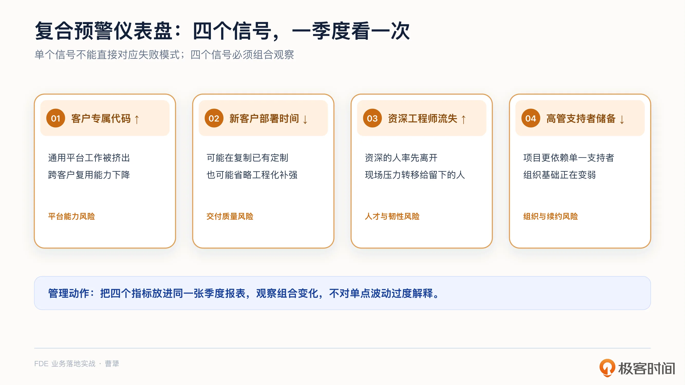
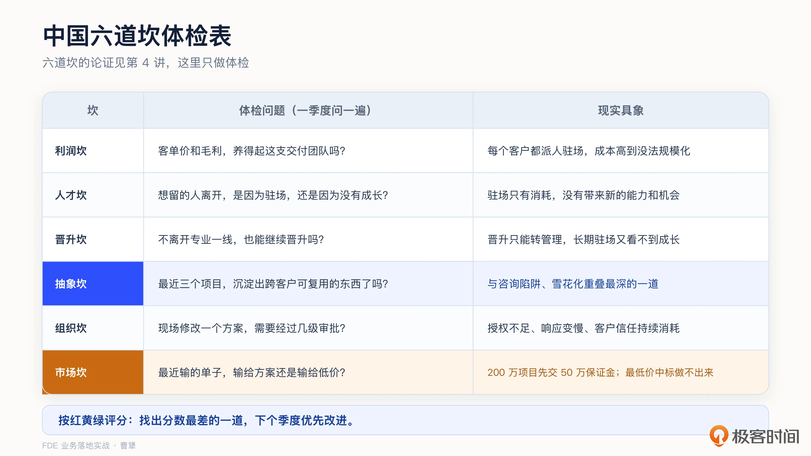
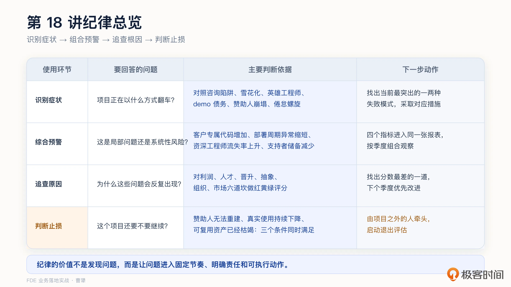

# 18｜翻车复盘：六大失败模式与中国六大坑怎么避？
你好，我是曹犟。

上一讲，我们用一个真实成功跑通的项目，把项目复盘框架从头到尾走了一遍。这一讲不是找一个失败的项目做对应复盘，而是换一个视角：把多个项目里反复出现的失败模式放在一起，看看 FDE 项目最容易“死”在哪里，又该如何提前识别和止损。

先讲一次我们自己的误判，这个故事我之前提到过。有一个项目，神策的标准产品已经能满足客户百分之七十以上的需求，我们信心很足。结果最后中标的是一家地方性定开公司，从零开发，报价只有我们的六成。我当时判断，他们根本交付不了，等着看笑话就行。但一年之后，我得到的消息是：对方顺利验收，尾款也拿到了。

讲这个故事，不是为了检讨客情或者价格策略，而是想说明：项目失败的真实原因，经常和最初的判断不同。以为输在价格，实际可能输在对“客户要什么”的理解；以为项目死于技术，实际可能死于组织。这个威胁还在升级， [第 2 讲](https://time.geekbang.org/column/article/1000788?utm_campaign=geektime_search&utm_content=geektime_search&utm_medium=geektime_search&utm_source=geektime_search&utm_term=geektime_search "") 我说过，AI 让定开变得更便宜，当年报价六成的定开公司，今天使用 AI 之后，可能敢报四成。依赖“他们做不出来”这个判断的时代已经过去了。因此，失败也值得被系统研究。

FDE 项目的失败也有相对稳定的类型。我们在 [第 2 讲](https://time.geekbang.org/column/article/1000788?utm_campaign=geektime_search&utm_content=geektime_search&utm_medium=geektime_search&utm_source=geektime_search&utm_term=geektime_search "") 简单介绍过其中两种，这一讲会完整讨论六种模式，逐一讲清它们的征兆、解决办法和对应防线。

随后，我们再用 [第 4 讲](https://time.geekbang.org/column/article/1001117?utm_campaign=geektime_search&utm_content=geektime_search&utm_medium=geektime_search&utm_source=geektime_search&utm_term=geektime_search "") 讨论过的六道坎，进一步追查中国 To B 环境会放大这些失败的结构性原因。

## 六大失败模式

正如前面一直讨论的，FDE 通常由资深工程师担任，却要长期直接面对客户；工作成败容易受到客户内部权力关系变化的影响，团队的投入产出也很难算清楚。这些压力叠加在一个角色身上，整个团队就容易反复落入几种相对固定的失败模式。

下面我们逐条分析，每一条都着重看三个方面：征兆、解决办法，以及这门课咱们前面已经讲过哪些预防办法。

**第一种，咨询陷阱。** FDE 团队逐渐偏离产品化方向，最后做的其实是借助软件开展的高端咨询。

征兆最直观：平台仓库里，客户专属代码比通用代码长得还快。有些 FDE 模式的质疑者甚至嘲讽，每个项目都要靠 FDE 进“小黑屋”手写代码来交付，商业模式就成了重人力的“劳动力咨询外包”。

这个陷阱的解法，就是像遵守项目交付期一样遵守平台提交的纪律，拒绝那些沉淀不回平台的交付。

具体的预防办法在 [第 13 讲](https://time.geekbang.org/column/article/1006722 "xxx") 和 [第 16 讲](https://time.geekbang.org/column/article/1011485 "xxx") 聊过，这里不重复展开。

**第二种，每客户雪花化。** 团队针对每个客户都单独做一套方案，不同项目之间几乎没有可以复用的东西。随着定制越来越多，原本赚钱的项目会逐渐变成亏本项目。等亏损真正暴露出来时，团队已经被大量定制项目拖住，想收缩都很难。

日常自测很简单：新客户进来，团队的第一反应是“套用哪个已有模板”，还是“这家客户不一样，需要单独做”？后一种反应连续出现，就说明雪花化已经开始了。

解决办法是，每次部署都必须留下一套可复用的模式，否则就不能算真正完成。

具体的预防办法在 [第 13 讲](https://time.geekbang.org/column/article/1006722 "xxx") 已经讲过，如果忘记了，你可以点开链接回顾一下。

**第三种，英雄工程师。** 这种模式下，整个 FDE 团队，甚至整个公司，都过度依赖某一个不可替代的人。关键经验和做法只存在于他个人身上，没有真正变成团队的能力。

征兆也很明确：很多项目和关键工作都必须由同一个人亲自处理，其他人无法独立接手；他在的时候一切正常，一旦辞职或者不参与某个项目，团队的输出能力就会受到严重影响。判断一个 FDE 团队有没有真正形成能力，要看核心工程师离开后还能留下什么。如果什么都没有留下，就说明团队一直靠他一个人在支撑。

解决办法有三条：每个客户至少配置两名工程师；把关键工作和关键认知写成文档沉淀下来；把“只有一个人懂的客户”或者“只有一个人具有的能力”当成风险来管理。中国 To B 的老师傅文化里，这个模式尤其常见。“这个客户只有老王能处理”，听起来是在表扬老王，其实是一个非常严重的风险信号。

这正是 [第 14 讲](https://time.geekbang.org/column/article/1006738 "xxx") 要把知识资产化的组织原因：如果知识只存在于个人身上，这个人就是单点故障。

**第四种，demo 债务螺旋。** 为了拿下客户，团队给客户展示了生产系统无法支撑的 demo，之后每一次和客户的沟通，都要面对此前承诺却无法兑现的预期。团队不得不反复填补 demo 和生产系统之间的差距，而不是继续推进下一次交付。

这个模式的征兆是，客户在 demo 环节之后，逐渐失去对团队的信任，demo 里的承诺长期无法在生产环境兑现：原本看起来已经自动完成的环节，上线后仍然需要人工兜底；团队花在补漏洞和解释差距上的时间越来越多，真正用于推进交付的时间却越来越少。

这个模式多发于不成熟的早期团队，最好的解决办法，就是从一开始不要欠下这笔债。如果不靠过度承诺就无法拿下的单子，在最开始直接果断放弃就好。

[第 8 讲](https://time.geekbang.org/column/article/1005076?utm_campaign=geektime_search&utm_content=geektime_search&utm_medium=geektime_search&utm_source=geektime_search&utm_term=geektime_search "") 专门讨论过怎么预防：主动暴露长尾脏数据、不压缩硬化阶段、把 demo 赢来的当成继续验证的资格，而不是合同承诺。

**第五种，赞助人崩塌。** 如果 FDE 的项目过度依赖客户内部某一位高管的支持，那么一旦这份支持消失，即使项目在技术上很成功，也可能因此说停就停。

这种模式的征兆也很简单，力挺项目的高管离职、调岗或者失势，项目在客户内部失去关键推动者；或者新领导上任后，开始引入自己熟悉的供应商。

一个很有名的公开案例，是 IBM Watson 与美国 MD 安德森癌症中心的合作。项目于 2012 年启动，目标是把 Watson 用于肿瘤临床决策。最初的合同金额不到 500 万美元，先选择白血病场景试点。此后项目不断追加投入，四五年累计花费 6200 万美元，但系统始终没有真正用于任何一位患者。

2015 年，一手推动这个项目的高管 Lynda Chin 离开 MD 安德森，项目失去了最有力的赞助人。2017 年初，媒体又披露了德州大学系统的一份审计报告。

这份报告里有个细节我印象很深：报告明确表示，它并不评价 Watson 的技术本身，只审查采购、超支和治理问题。也就是说，项目先在组织层面出了问题，Watson 的技术能力甚至还没有在真实临床环境中接受检验。

当然，Watson 属于上一代 AI 技术，与今天的大模型并不是一回事，所以不能直接套用它的技术教训。但组织层面的失败过程非常相似：项目高调启动，期望不断升高，核心赞助人离开，最后进入审计程序。赞助人崩塌再叠加前期无法兑现的承诺，即使是 IBM Watson 这样的项目也很难扛住。

而解决办法，其实就是一开始就要培养至少两个赞助人，并尽快建立自下而上的真实使用，真正地帮干活的人解决他们的真问题。例如，上面 IBM Wastson 那个案例，如果 Watson 真的适配好了医院的组织和工作流程，并且在这个基础之上，能在临床上取得非常好的疗效，那么，哪怕高管离职，这个项目最后也不会这么草草收场。甚至可能因为项目的成功，支持的高管不会离职反而会升职。当然，我们也必须诚实承认，有些项目的崩塌可能就是救不回来，这时候要做的，就是是及时止损，后面说。

至于本课程中，讲述的更具体的预防办法，主要在 [第 7 讲](https://time.geekbang.org/column/article/1003666?utm_campaign=geektime_search&utm_content=geektime_search&utm_medium=geektime_search&utm_source=geektime_search&utm_term=geektime_search "")。

**第六种，倦怠死亡螺旋。** 这也是一个很容易被创始人或者 FDE 团队管理者忽略的问题。FDE 长期承担高压的现场工作，如果团队缺乏轮换、退出现场的机制和良好的职业发展通道，FDE 的倦怠就会逐渐积累。网上有篇文章挖苦这个岗位，说：“说白了，他们就是一群拿着高薪的‘高级泥腿子’。”这句话虽然有点刻薄，但这个岗位背后的辛苦的确是结构性的。

这个问题的征兆，通常是从最资深的人率先离开开始呈现。资深的人离开了，剩下的人自然需要承担更多现场压力，离职的速度也随之加快。团队越缺人，留下的人越容易倦怠；留下的人越倦怠，团队就越缺人，这就是所谓的死亡螺旋。

对应的解决措施有四种。

**第一，刻意轮换。** 不要让同一个 FDE 长期固定在同一个客户上，而要定期轮换。但需要注意的是，多数团队的轮换机制比较随意，效果可能并不好。我的建议是给每个人设一条学习价值曲线：一个客户对于一个 FDE 提供的学习价值，会随时间递减。头几个月认知密度最高，学习价值最大，之后则越来越多是重复劳动。当一个人在同一个客户上连续两个季度没有新的学习产出，就是轮换信号，不用等他自己提出离开。这条是我的经验建议，你可以按自己团队的情况动态调整。

**第二，强制休整。** 高强度交付结束后，由团队主动安排一段恢复时间，例如回公司，做一些不需要跟客户打交道的其它类型的工作，或者补充学习一些产品和技术上的新知识，而不是等工程师已经撑不住了，再让他自己申请休息。修整也同样需要形成机制，而不是依赖于人。

**第三，建立同伴互助机制。** 关键客户不能只由一个人单独负责，至少要有一位同伴可以共同应对、共同讨论、共同驻场，让现场压力和关键知识都有人分担。

**第四，建立清晰的职业发展通道。** 团队要讲清楚 FDE 做到什么程度可以晋升，积累的现场经验以后可以走向哪些岗位。喜欢管理的可以做管理，不喜欢管理的，也依然可以通过专业职级的晋升而得到更多的回报。不能让 FDE 职业发展的唯一方式，变成不断接手更多、更难的客户。

很多管理者在这四项上的投入都不够，直到资深骨干开始离职，才看到代价。

这个问题也会影响个人如何选择职业道路，第 23 讲讨论职业发展时会换一个视角再谈。

## 一块复合预警仪表盘

前面六种模式，是对失败类型的分类。下面四个信号，则是从中提炼出来的跨模式管理指标，两者并不是一一对应：一个信号可能同时指向几种失败模式，一种失败模式也可能需要结合其他现象才能判断。把四个信号放在一起观察，可以更早发现团队正在同时滑向多种失败模式。单看任何一个指标的恶化都不一定致命，但如果四个负面信号同时出现，就说明团队可能面临系统性问题。

这四个信号分别是：客户专属代码持续增加；新客户的部署周期持续缩短；资深工程师流失率上升；能够支持项目的高管储备越来越少。

其它几个指标都好理解，但是中间的“部署周期缩短”看起来有些反直觉：快难道不是好事吗？它可能的确是好事，但是如果它和另外三个信号同时出现，这种快则很可能只是来自于复制上一家客户的定制代码，或者省略了从 demo 到稳定上线之间的工程化补强工作。表面上看部署效率提高了，但实际上可能雪花化和 demo 债务都在加重。这也提醒我们，这几个指标不能单看，要看组合。

我建议你把这四个数字真正放进管理报表，每个季度检查一次。 [第 13 讲](https://time.geekbang.org/column/article/1006722?utm_campaign=geektime_search&utm_content=geektime_search&utm_medium=geektime_search&utm_source=geektime_search&utm_term=geektime_search "") 的沉淀仪表盘看的是复利有没有形成，这一讲的复合预警仪表盘则看团队是否正在同时滑向各种失败模式。两块仪表盘一正一反，放在一起才完整。

## 再进一步：中国六道坎为什么会放大风险

前面六种模式回答的是“项目会怎么翻车”。接下来再深入一层：为什么这些问题在中国 To B 环境里更容易发生？ [第 4 讲](https://time.geekbang.org/column/article/1001117?utm_campaign=geektime_search&utm_content=geektime_search&utm_medium=geektime_search&utm_source=geektime_search&utm_term=geektime_search "") 讨论过的利润坎、人才坎、晋升坎、抽象坎、组织坎和市场坎，提供的正是一组结构性原因。它们不是另外六种失败模式，而是会放大前面那些风险的现实条件。第 4 讲已经讲过每一道坎为什么存在、破解条件是什么，这里不重复论证，只把它们转化成六个体检问题。

1. 先看利润坎。体检时需要算一笔账：我们的客单价和利润率，养得起现在这支 FDE 团队吗？第 4 讲提到，神策自己早期也踩过这道坎：客户希望我们派人驻场，但如果每个客户都派人，成本很快就会高到无法规模化。至于具体的账，还是要结合团队成本认真测算。

2. 人才方面，可以回看过去半年：有没有你想留的工程师因为“不想驻场”而离开？如果有，真正的问题是驻场本身，还是驻场工作没有带来成长？

3. 再看晋升。团队里的优秀 FDE，晋升之后还能不能继续在一线发挥专业价值？如果晋升只有转做管理这一条路，最有经验的人就会不断离开现场；但如果长期驻场，却看不到职级、收入和职责上的成长，同样留不住人。真正要检查的，不是该不该晋升，而是有没有一条不离开专业一线也能继续成长的路径，不至于让所有人都只能挤管理序列这一条发展通道。

4. 判断有没有跨过抽象坎，可以回看最近三个项目：有没有沉淀出跨客户可复用的东西？这一条直接对着咨询陷阱和雪花化，是六道坎里和六大失败模式重叠最深的一道。

5. 组织坎则可以从一个具体动作判断：现场的 FDE 修改一个方案，需要经过几级审批？现场授权不足，会持续消耗 [第 7 讲](https://time.geekbang.org/column/article/1003666?utm_campaign=geektime_search&utm_content=geektime_search&utm_medium=geektime_search&utm_source=geektime_search&utm_term=geektime_search "") 所说的客户信任。

6. 最后是市场坎。可以复盘最近输掉的订单：我们是输给了更好的方案，还是输给了低价？如果是低价，我们有没有像开头那个故事一样，误判了客户真正的评价标准？行业里有不少类似问题：两百万元的项目要求乙方先交五十万元保证金，最低价中标之后却无法完成交付。这些市场环境很难由一家公司改变，但可以选择自己的竞争方式。第 15 讲讨论的效果定价，本质上就是避开纯价格战的一种办法。

本节课我们提供了两张体检表，它们有明确的使用顺序。先用六大失败模式体检表识别症状，再用中国六道坎体检表追查背后的结构性原因。前一张回答“出了什么问题”，后一张回答“为什么总会出这个问题”。

进行体检时，最基本的方法，是给每一道问题按照红、黄、绿评分。在此基础上，我再补充两个建议。第一，参与评分的不能只有管理层，至少要让两位一线 FDE 一起参加，因为一线的感受往往比报表更早暴露问题。第二，评分之后不追求全部变绿，而是选择分数最差的那一道，下一个季度只针对它制定一个改进动作，在下次体检前再先复查这一道。

体检的目的不是为了让分数好看，而是让问题在变成事故之前被发现。

## 项目级止损：翻车前的最后一道机制

最后讲一个很多 FDE 团队缺失的机制： **项目止损**。

[第 5 讲](https://time.geekbang.org/column/article/1002969?utm_campaign=geektime_search&utm_content=geektime_search&utm_medium=geektime_search&utm_source=geektime_search&utm_term=geektime_search "") 讨论立项时说过，没有退出条件的项目不是项目，是无底洞式的支持合同。这句话放到项目翻车的场景里，还要再往前走一步：退出条件不仅要在立项时提前确定，项目进行过程中也要定期检查是否已经触发。

我的建议是，三个条件同时满足时就启动退出评估：项目失去核心赞助人，三个月内仍找不到新的支持者；真实使用量持续下降，却找不到原因；项目中可复用的资产已经基本提炼出来。注意第三条，它意味着有些项目虽然商业上失败了，但资产上却可以是赚的。项目沉淀清单写完、平台提交做完，跟客户体面分手，这一单就没白做。

还有一个我自己觉得很关键的实操细节：退出评估不要让项目负责人自己来主持。经济学上有个概念叫沉没成本，已经投进去的钱和心血，最容易绑架接下来的决定，也因此项目负责人很难亲手叫停自己带的项目。换一个交付线之外的人来牵头，结论会诚实得多。

进场前谈好的退出条件，还得有人在翻车的时候真的敢启用。

## 课程总结

这一讲不是复盘某一个失败项目，而是对一组失败模式做了一次横向复盘。核心判断是： **失败有相对稳定的类型，风险也有可以提前观察的信号，不要等事故发生之后才复盘。**

这几块内容并不是几张并列的清单，而是一条完整的诊断链：六种失败模式用来识别症状并选择对应措施，四个信号用来持续预警，中国六道坎用来追查结构性原因，项目级止损则回答风险已经无法挽回时应该怎么退出。

AI 可以负责一部分的执行，但人仍然要负责判断。很多项目失败，恰恰是因为团队没有认真做好本应由人完成的判断。

赞助人可能离开、组织可能反弹，这些信号很难仅靠系统数据识别，需要人结合现场关系提前判断。

我把这一讲的诊断流程整理成一张表：

如果你想转型 FDE，这一讲最应该关注的是倦怠螺旋的四种解决措施。入职前就问清楚：有没有轮换机制，有没有职业阶梯。如果团队没有明确答案，就要认真评估长期驻场带来的职业风险。

对交付和实施同学，可以先用六大失败模式体检表识别症状，再用中国六道坎体检表追查结构性原因。做完之后可能会发现，很多个人感受到的问题来自组织结构，而结构问题需要用机制来解决。

对 To B 创业者和技术决策者，建议把两块仪表盘都建立起来： [第 13 讲](https://time.geekbang.org/column/article/1006722?utm_campaign=geektime_search&utm_content=geektime_search&utm_medium=geektime_search&utm_source=geektime_search&utm_term=geektime_search "") 的仪表盘看复利，这一讲的仪表盘看风险。同时也要重视团队倦怠，不要等资深骨干离职之后，才看到长期投入不足的代价。

在讲完成功和失败的复盘以后，从下一讲开始，我们进入行业篇。同样是 FDE，在银行、在政府、在医院打法可能完全不同。下一讲，我们先讲行业落地的第一站：金融、政企与医疗。

## 思考题

留两个问题，欢迎你在留言区聊聊。

第一，六大失败模式里，你所在或你见过的团队，最接近哪一种？它的征兆出现多久了？如果要开一剂解法，你会先动哪一条？

第二，回想一个你经历过的、最后不了了之的项目：如果当时有这一讲的止损三条件，它会更早体面退出吗？那个项目里，有没有其实已经赚到、却没人收走的资产？

期待你在留言区分享你的思考。如果这节课对你有启发，也推荐你把它分享给身边更多朋友。