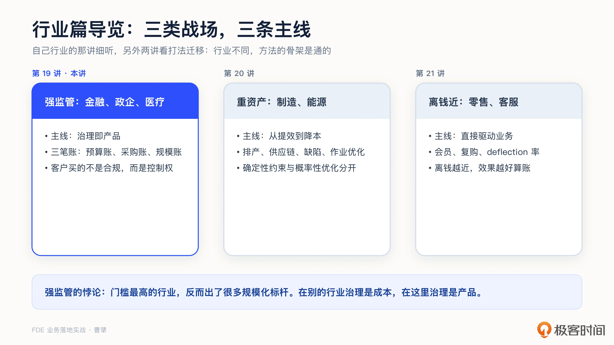
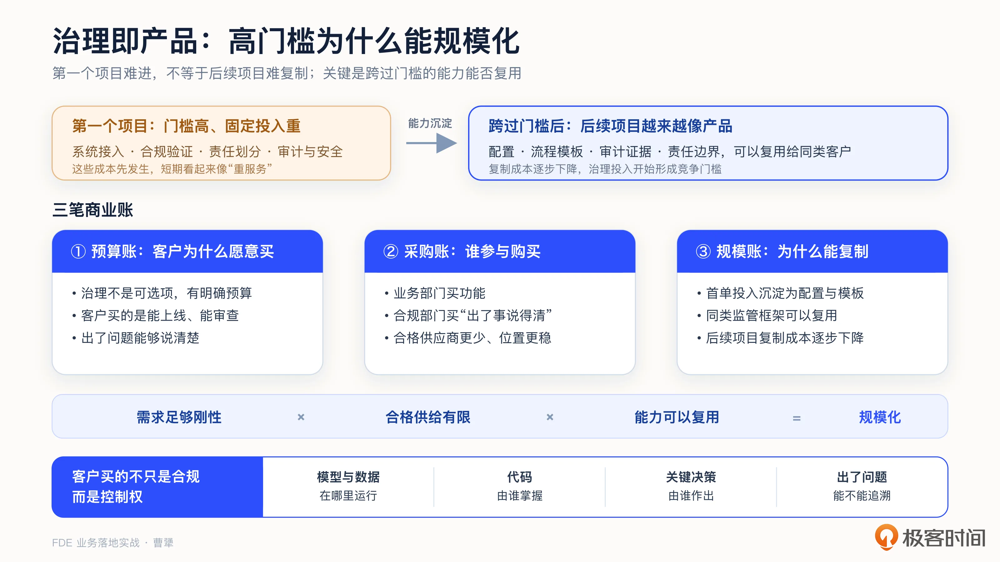
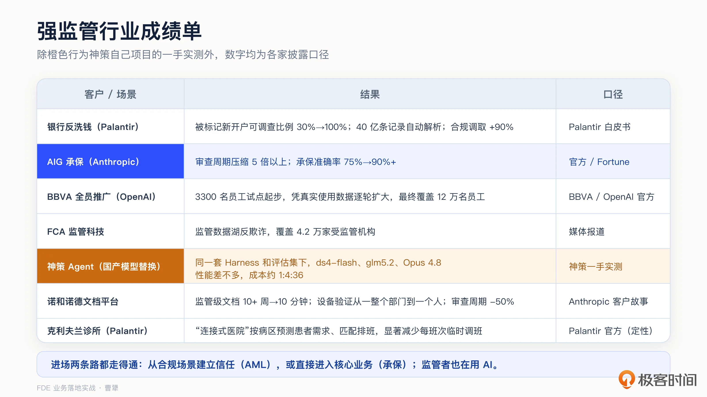
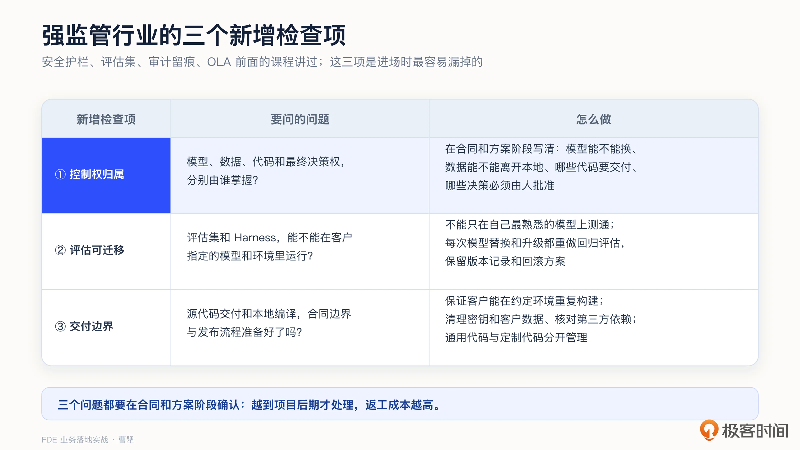
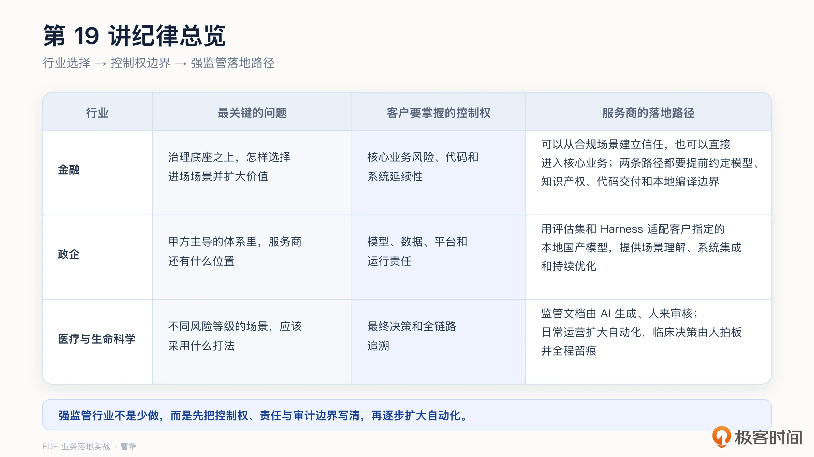

# 19｜行业落地（一）：金融、政企与医疗，为什么“治理即产品”？
你好，我是曹犟。

前面十八讲，我们已经从基本认知、项目实战到成功和失败复盘，把 FDE 的通用方法完整讲了一遍。但具体落到不同的行业，关键变量会很不一样。因此，从这一讲开始，我们再用三讲讨论行业落地。

我把行业分成三类：这一讲讨论金融、政企、医疗等强监管行业，它们的核心规律是 **治理即产品**；下一讲讨论制造和能源等重资产行业，主线是从提效走向降本；再下一讲讨论零售和客服等直接影响收入的行业，看 AI 怎么驱动业务结果。

这三讲你可以这样学习：自己所在行业的那一讲重点听，另外两讲则着重看方法论如何迁移。行业不同，但有些方法论的基本结构是相通的。

## 治理即产品：高门槛为什么能规模化

之前的课程中，一直有一个看似矛盾的现象：金融、政企、医疗，是合规要求最严格、数据最敏感、采购流程最长的行业。按照常识，AI 类项目是典型的创新性项目，应该最难进入这类行业。但现实是，这些行业恰恰出现了很多规模化落地的标杆案例，我们这门课引用的很多数据也来自这些行业。

[第 12 讲](https://time.geekbang.org/column/article/1006705 "") 已经讲过治理能力怎么建设，这一讲不再重复具体方法，而是继续回答两个问题： **客户为什么愿意为治理付费，以及这些治理要求在不同行业里会表现** **成** **什么。**

我先回答第一个问题。这里得区分两件不同的事：第一个项目难不难进，和成功进场之后能不能规模化。强监管行业确实会抬高第一个项目的成本，但只要跨过门槛的能力可以在同类客户之间复用，后面的项目就会越来越像产品，之前为了解决进场难问题所做的努力，反而会成为竞争门槛。

也就是说，这类行业能出现很多规模化案例，不是因为第一个项目容易，而是因为第一个项目虽然难，但跨过后，复制成本却可以逐步下降。这个过程可以用三笔商业账来解释：预算账回答客户为什么愿意买，采购账回答合格供应商为什么站得住，规模账回答后续项目为什么能够复制。

**第一笔，是预算账。这笔账要回答的是，客户为什么愿意为治理能力付费。**

在普通行业，审计、合规和安全通常被客户视为额外成本，不会出钱，项目团队也总想少投入一些。但在强监管行业，客户可以决定暂时不上 AI，但只要系统要进入生产环境，这些治理要求就不是可选项。客户通常也有相对明确的合规预算和较强的付费能力，购买的不只是功能和效率，也包括系统能否通过合规审查、出了问题能否说清楚。

因此，高门槛提高了项目成本，却没有消除需求。治理能力可以成为明确的产品交付物，也可以在报价中单列预算，不必等到项目做到一半，再临时从开发预算里挤，使治理要求和功能开发争夺资源。

**第二笔，是采购账。这笔账要回答两个问题：谁参与购买，以及合格供应商为什么能站稳。**

在普通项目里，合规和安全部门往往只在最后验收时出现，负责指出哪些地方不能上线。而在强监管行业，他们不只是最后把关的人，也是治理能力的直接使用者，通常也会参与采购判断。系统如果能随时回答是谁作出的决策、依据是什么、谁批准执行，合规部门就有条件应对内部审计和外部监管。供应商越早让他们参与方案设计和预算评审，他们就越可能成为项目的内部支持者。简单来说，业务部门买的是功能，合规部门买的是“出了事说得清”。

前面说的购买方，也要看哪些供应商具备交付资格。能做出功能的供应商可能不少，但能同时满足安全、合规和审计要求的供应商则相对少得多。完整完成了系统接入、合规验证和责任划分后，客户后续如果更换供应商，也需要重新付出这些成本。

因此，真正跨过门槛的供应商，更容易获得较长的合作周期，也更有机会继续拓展业务场景。门槛挡住了一部分供给，也因此给合格供应商留下了更稳定的位置。有了预算和采购的基础，最后看规模能否成立。

**第三笔，是规模账。这笔账要回答的是，第一个项目的治理投入能不能在后续项目中复用。**

同一个行业里的监管框架有很多共性。供应商可以把一个客户的审计要求、审批流程和合规规则，逐步沉淀成产品配置、流程模板和证据案例，再复用给其他同类客户。第一个客户项目中的投入，主要表现为定制成本；到了后面的客户，同样的投入应该逐渐转化成可复用的产品能力。治理要求越明确，哪些部分可以标准化也越容易判断。

把这三笔账连在一起看，才形成了完整的商业逻辑：预算账让刚性的治理需求有明确的付费来源；采购账让合规部门参与购买，也让跨过门槛的供应商获得相对稳定的位置；规模账则让第一个项目的投入在后续项目中得以复用。所以，高门槛本身不会自动带来规模。真正起作用的是需求足够刚性、合格供给相对有限、跨过门槛的能力可以复用。这才解释了为什么金融、政企和医疗虽然最难进入，却仍然出现了不少规模化案例。

三笔账解释了治理能力为什么能成为一门生意。再往下看，对于 FDE 要交付的 AI 类项目来说，强监管客户真正购买的，其实不只是合规，而是控制权：模型和数据在哪里运行，代码由谁掌握，关键决策由谁作出，出了问题能不能追溯。

不同的行业，最在意的控制权也不一样。金融要把治理作为所有业务场景的共同底座，再根据条件选择合规或者核心业务场景，同时处理源代码、知识产权和本地编译等边界；政企更关注模型、数据和平台能不能掌握在自己手里；医疗则要根据风险等级，决定 AI 可以自动执行到哪一步，最终由谁拍板。下面我们分别展开。

## 金融：治理是底座，核心业务是方向

金融行业首先要区分两个层次。第一个层次是 **治理要求**，包括数据安全、审计留痕、运行环境和责任边界。无论做的是反洗钱还是承保，只要 AI 系统要进入生产环境，这些要求就必须满足。它们不是一个做完就结束的前置阶段，而是贯穿所有业务场景的共同底座。场景越接近核心业务，治理要求通常越高。

在中国的金融项目里，这条底座还经常包括本地部署、国产模型和代码控制。不少金融客户会把乙方按照定制开发供应商来管理，要求获得平台代码，或者至少获得定制部分的代码。有的客户还会要求代码在本地编译。在我接触的项目里，客户更主要的目的通常不是自己继续开发，或者说做一个类似产品拿去卖钱，而是确保供应商发生变化之后，系统还能继续运行和维护。

如果决策层已经决定接受这个项目，这类要求就不能等到合同签完、产品交付时再处理。产品和研发团队需要提前区分四类资产：供应商原有的平台和通用 Harness、为客户开发的定制代码、客户的数据与知识，以及项目中沉淀出来的通用行业认知。源代码交付、知识产权归属和代码使用权是三件不同的事，哪些可以交付、哪些只授予使用权、哪些绝对不能带出客户环境，都要写进合同。软件发布流程也要提前支持可复现的本地编译，并做好依赖检查、密钥和客户数据清理。

虽然我提过，AI 时代，代码相对于需求理解、评估体系和行业认知，确实没有以前那么稀缺，但这不等于代码没有价值。提示词、任务编排、评估逻辑和知识组织，也可能藏在代码里。因此，不能只依赖“客户没有兴趣和我们竞争”这个判断，还需要依靠合同约束和技术隔离，把必须交付的交付清楚，把需要保护的保护好。

第二个层次才是 **业务场景的选择**。在满足治理要求后，金融项目有两种常见的进场路径。一种是先做反洗钱等合规业务场景，建立信任之后再进入核心业务；另一种是从一开始就进入承保、信贷等核心业务。这两条路径没有固定的先后关系，要看乙方自己的能力偏向，客户有没有足够强的内部赞助者、能不能投入核心业务人员，以及风险边界是否已经明确。

反洗钱是第一条路径的经典案例。Palantir 白皮书里讲过，他们帮银行建设客户 360 档案，用实体解析和网络化风险建模，把分散在多个司法辖区的客户记录贯通起来。某家零售银行对被标记新开户的可调查比例从 30% 提高到了 100%；某家全球银行自动解析了 40 亿条客户记录，合规信息的调取速度提升 90%，整体调查时间缩短约一半。

反洗钱同时具有数据密集、规则密集和人力密集的特点，AI 的提效空间很大。这类场景的需求刚性、预算明确，又不会直接改动银行的核心交易和经营决策，因此推进阻力往往相对较小。供应商可以先在这里证明治理和交付能力，再争取其他业务场景。

但这是常见路径，不是必经阶段，FDE 也可以直接进入核心业务场景。

Anthropic 和保险巨头 AIG 的合作，就是如此。按官方披露，承保业务的审查周期压缩了 5 倍以上，承保任务的准确率从 75% 提到了 90% 以上。承保是保险公司的核心业务。只要客户愿意投入核心业务团队，治理底座和人工决策边界也已经准备好，并不需要先做一个合规业务场景来垫场。

无论选择哪条进场路径，核心业务通常决定了项目的价值上限。OpenAI 的 FDE 负责人曾经说过：“成功的 AI 项目，不能选择企业边缘的场景，要做就做难的。因为只有核心业务，才能调动公司最好的资源。”这句话提醒我们：如果项目长期停留在边缘场景，客户投入的预算、人才和注意力也会相对有限。 **进场时要考虑阻力，扩大时还是要考虑价值和资源。**

场景选对之后，还要用真实数据逐步扩大范围。西班牙的 BBVA 和 OpenAI 合作时，并没有一开始就面向全员，而是先让 3300 名员工试用。看到大多数员工持续使用，而且员工自报例行工作时间有所下降之后，BBVA 才逐步扩大范围，最终覆盖 12 万名员工。这个案例真正有说服力的，不是最终覆盖了多少人，而是每一轮扩展都建立在上一轮的真实使用数据上：先证明有人用、经常用，而且确实有帮助，再争取下一轮预算和资源。

金融行业还有一个特殊变量：监管者自己也在使用 AI。英国的金融行为监管局 FCA，在自己的监管数据湖上部署了 Foundry 做反欺诈，覆盖四万两千家受监管机构。监管者的技术水位提高之后，被监管机构需要持续提升自己的治理能力。这会让金融项目的治理底座不断提高，也会带来持续的建设需求。

## 政企：甲方主导，服务商补位

中国政企客户的核心特点，我觉得很重要的一点就是必须要有控制权。当然，政府部门和国央企也有所不同，政府项目更强调统一部署、分级复用和集中管理，具体建设和运营可以由市场化企业承担；国央企则更强调高价值场景和自主可控，有些客户会自建基础平台，也会引入外部服务商来共同建设。两者的共同点，是模型、数据、平台和运行责任需要在甲方主导的体系内。

在我们接触和参与的政企 AI 类项目里，有一个点非常值得拿出来讨论一下： **这些项目基本都要求使用客户本地部署的国产开源模型，没有多少讨价还价的空间**，这一点某种意义上就是目前行业里面讨论很多的“信创”在 AI 项目里面的具体体现。

细拆开，这其实是两个要求。本地部署解决的是数据和运行环境的控制问题，国产模型解决的则是技术路线和供应链的自主可控问题。金融行业也经常有类似要求，只是在政企项目里通常更加刚性。

不过有一个好消息是，国产开源模型最近的能力提升非常快。只要评估集和 Harness 做扎实，换模型本身并不可怕。神策有一个 Agent，在同一套 Harness 和评估集下，分别使用 ds4-flash、glm5.2 和 Opus 4.8，他们在这个任务上的性能差不多，但按照我们当时实际的价格口径，成本大约是 1：4：36。这个结果当然不能推导出在所有场景下所有国产模型都和国外顶尖模型能力打平，但在具体任务上，模型选择可以变成一个能够评估和替换的工程问题，是有解的。

有时还会遇到另一个实际问题，客户已经部署的模型版本比较老，和最新模型的能力有差距。遇到这种情况，FDE 不能只简单说服客户换一个新模型，而是要拿同一套评估集做回归测试，证明升级之后效果确实更好；同时把版本管理、回滚方案和发布流程准备好。客户真正关心的，不是你推荐了哪个模型，而是升级之后系统仍然在他的控制之下。

从这个角度看，服务商的位置就清楚了。客户要求掌握模型、数据和平台，并不代表所有能力都要自己开发。服务商仍然可以提供场景理解、评估集、Harness、系统集成和持续优化，但这些能力必须能够运行在客户指定的模型和环境里，也要能够接入客户现有的平台。政企项目的关键问题，是 **在客户掌握控制权的前提下，我们还有什么不可替代的价值**。

把这个逻辑放回前面的三笔账，会更清楚。

- 先看预算账。政企客户可以选择暂时不上 AI，但一旦决定上线，本地部署、国产模型和数据不出域就不能省略，对应的工程投入也必须进入预算。

- 再看采购账。能够在客户指定的环境里完成评估、集成和上线的供应商相对有限。供应商跨过这道门槛之后，也就更容易站稳。

- 最后是规模账。不同客户使用的模型品牌和版本可能不同，但本地运行、评估回归、版本回滚和接入客户平台，都是可以复用的工程能力。服务商把这些能力沉淀成 Harness、适配层和发布流程之后，第一个客户里的定制投入，就能逐步变成后续项目的产品能力。

所以，客户购买的不只是某个模型，而是在自己指定的环境里，把 AI 稳定运行起来的能力。

## 医疗与生命科学：风险等级决定人机分工

医疗与生命科学不同场景的风险差异很大。判断 AI 能够自动执行到哪一步，关键要看错误会带来什么后果。按照这个标准，可以把场景分成监管文档、日常运营和临床决策三类。

**第一类是监管文档**。生命科学行业有大量“文本密集 \+ 合规密集”的工作，包括临床文档、注册申报和设备验证。这类工作适合 AI 先生成，人再审核。丹麦药企诺和诺德的案例很典型，根据 Anthropic 的说法，他们用 Claude Code 自建了监管级文档平台，文档撰写时间从十几周缩短到十分钟，设备验证协议的工作量从一整个部门降到一个人，审查周期下降一半。还有一个细节值得注意：主导这件事的数字化战略总监是分子生物学博士，而不是工程师。他依靠自然语言就把原型做了出来，AI 降低了动手的门槛，业务专家也有机会直接参与产品构建。

**第二类是医院日常运营**。这类场景通常不会直接代替医生作出临床判断，结果不准的风险较小，因此自动化空间更大。克利夫兰诊所和 Palantir 建了一个叫“连接式医院”的 AI 指挥中心。他们不是按全院算总账，而是对每个病区分别做患者需求预测，再匹配人员供给，在病区之间主动平衡排班。效果按官方口径，显著减少了每个班次的临时调班。

**第三类是临床决策**。这类场景人命关天，打法就是第 17 讲介绍过的坦帕医院模式：系统盯数据，人拍板，全程留痕。AI 可以持续发现异常、给出建议，但最终决策权必须留在人手里，而且谁看过、谁批准、依据是什么，都要能够追溯。

这三类场景放在一起，控制边界就很清楚了：监管文档可以让 AI 大量生成，但发布之前需要人审核；日常运营可以让 AI 自动处理更多常规情况，让人只看例外；临床决策则必须把最终决定留给专业人员。

医疗客户购买的不只是效率，而是风险可控前提下的效率。文档生成得再快，如果不能通过审核，价值仍然是零；预测模型再准，如果越过了人的最终决策权，也不能直接进入生产环境。

## 强监管行业的三个新增检查项

第 [10](https://time.geekbang.org/column/article/1005104 "xxx")、 [11](https://time.geekbang.org/column/article/1005151 "xxx")、 [12](https://time.geekbang.org/column/article/1006705 "xxx") 讲已经讲过安全护栏、评估集、审计留痕和人工检查点， [第 15 讲](https://time.geekbang.org/column/article/1009805 "xxx") 也讲过 OLA。这里不再重复，只补充强监管行业进场时容易漏掉的三个问题。

**第一，模型、数据、代码和最终决策权分别由谁掌握？** 这些控制边界需要在合同和方案阶段说清楚。模型能不能更换，客户数据能不能离开本地环境，哪些代码需要交付，哪些决策必须由人批准，如果不提前确认，越到项目后期，返工成本越高。

**第二，评估集和 Harness 能不能在客户指定的模型和环境里运行？** 不能只在供应商最熟悉的模型上测试通过，而把适配国产模型或者旧版本模型留到部署阶段。并且，一旦模型替换和升级都要重新做回归评估，并保留版本记录和回滚方案。

**第三，如果客户要求源代码交付或者本地编译，合同边界、代码隔离和发布流程是否已经准备好？** 发布流程不能只是把代码复制给客户，还要保证客户能够在约定环境中重复构建，同时清理密钥和客户数据、核对第三方依赖，并把通用产品代码和客户定制代码分开管理。

## 课程总结

这一讲，我们回答了一个看似矛盾的问题：金融、政企和医疗的门槛这么高，为什么仍然出现了很多规模化案例？答案是三笔商业账。预算账承接刚性的治理需求，采购账筛选合格供给，规模账则让第一个项目里的治理投入，逐步变成后续项目的产品能力。

三笔账解释了强监管行业为什么能形成生意，控制权则解释了客户具体在为什么付钱。所谓治理即产品，就是把模型、数据、代码和最终决策权等控制要求，做成能够报价、交付、验收和复用的产品能力。落到金融、政企和医疗，这些控制要求又有不同的表现。

我把这一讲的关键点整理成一张表：

如果你想转型 FDE，强监管行业是一个值得重点考虑的方向。较高的门槛意味着合格供给更少，客户合作周期更长，也更容易积累有复用价值的行业认知。不过，优势并不来自背下多少条监管规定，而是能不能把这些规定翻译成评估、集成、审计和发布流程。只有做到这一步，行业门槛才会真正变成你的职业门槛。

对交付和实施同学，下次进入强监管项目，可以在启动会上增加一张控制权清单，逐项确认模型、数据、代码和最终决策权的归属。如果客户要求使用本地模型、交付源代码或者本地编译，需要在排期之前请研发团队一起评估，现有的评估体系与发布流程能不能支持。

对 To B 创业者和技术决策者，面对本地部署、指定模型、源代码交付和本地编译等要求，不能只判断技术上能不能做，还要回答三个商业问题：增加的工程成本能不能进入报价，客户定制与通用产品的边界能不能守住，后续的模型升级、回归评估和运维能不能形成持续收入。如果治理成本无法收费，每个客户的交付又都不能复用，那么高门槛带来的就不是护城河，而是一门越来越重的定制外包生意。

强监管行业看完了，下一讲换一个不同的战场：制造与能源。重资产行业的 AI，怎么从提效、提质走到降本，又该怎样守住物理世界的安全边界？

## 思考题

留两个问题，欢迎你在留言区聊聊。

第一，回想一下你正在参与的强监管项目，模型、数据、代码和最终决策权这四类控制边界里，哪一个最容易在项目后期发生争议？为什么？

第二，如果客户要求使用本地部署的国产模型，或者要求交付源代码并在本地编译，你们现有的评估体系、Harness 和发布流程能够直接支持吗？还缺哪一块？

期待你在留言区分享你的思考。如果这节课对你有启发，也推荐你把它分享给身边更多朋友。