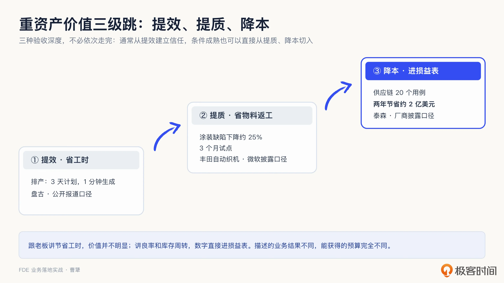
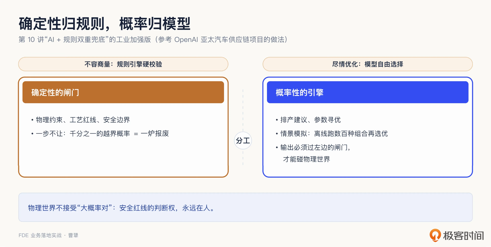
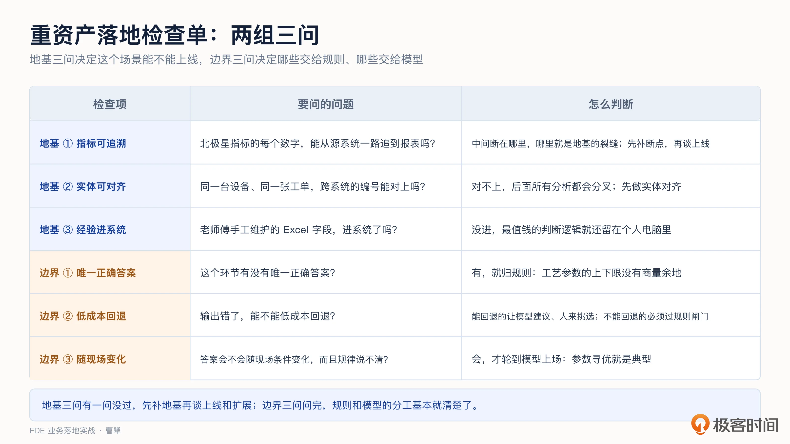
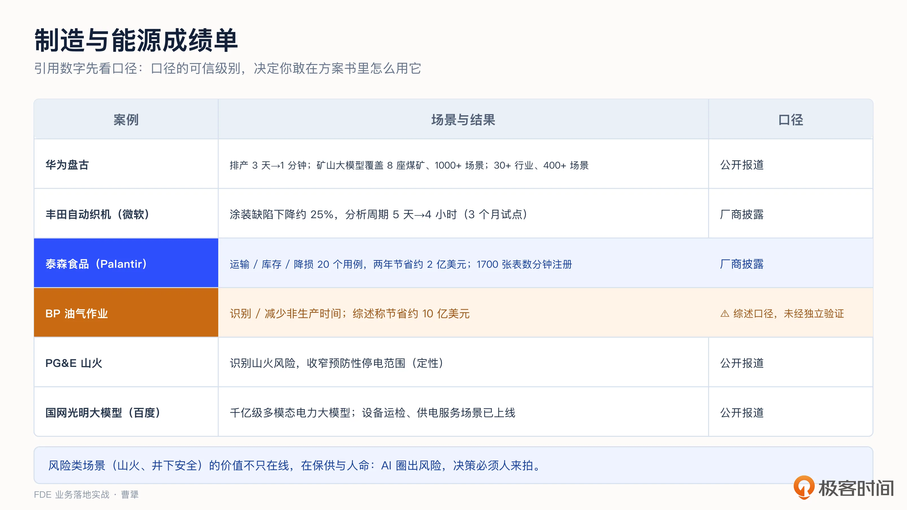
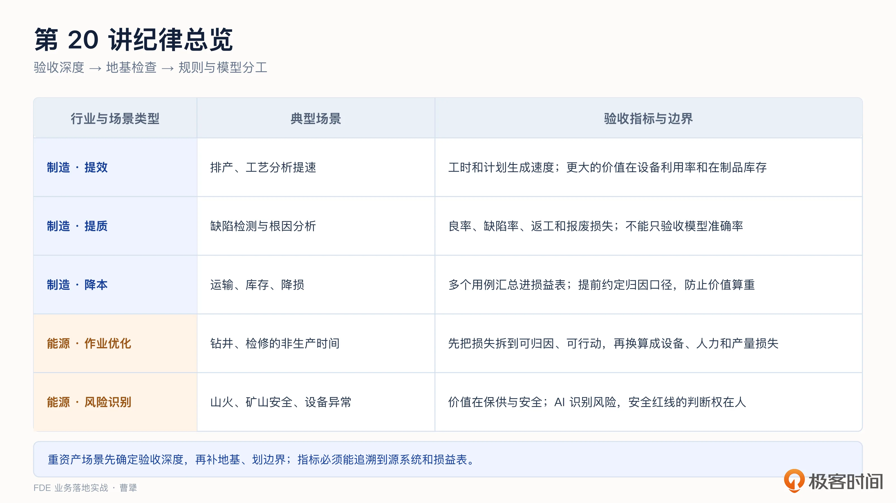

# 20｜行业落地（二）：制造与能源，从提效到降本
你好，我是曹犟。

这一讲，我们来到行业篇的第二站，讨论制造与能源这两个典型的重资产行业。

上一讲我们讨论强监管行业时提到，客户首先会为控制权和治理能力付费。而到了制造和能源，价值判断需要换一套标准：制造业看设备利用率、良率（合格率）、停机和库存，能源行业则看设备可用率、非生产时间、损耗、保供和安全风险。

用 [第 6 讲](https://time.geekbang.org/column/article/1002988 "") 和 [第 15 讲](https://time.geekbang.org/column/article/1009805 "") 的语言体系来说，制造与能源的这些指标都对应具体的业务结果。区别在于，制造业的价值大多可以落到损益表上，能源行业的保供（持续供给）和安全价值不能只用钱衡量。

先以制造业为例，简单算一笔账。一条大型产线，生产效率提升 1%，值多少钱？在互联网公司，研发工作流上 1% 的效率提升可能都不够写进周报；但在一家营收百亿元的制造企业，产线效率、物料损耗、库存周转里的每一个百分点，都是以千万元甚至亿元计算的实际收益。这就是重资产行业的一个典型价值特点：单点提升看起来不大，但乘上巨大的业务基数，价值就会很可观。

所以，这一讲主要想回答两个问题： **制造与能源为什么会成为 FDE 做 AI 项目的一片蓝海；进入这两个行业后，AI 带来的改善怎样转化为可衡量的业务结果，又需要补齐哪些数据基础和安全边界。** 接下来，我们先看制造业从提效、提质到降本的价值路径，再看能源行业的作业优化和风险识别，最后讨论两类行业共同的数据基础，以及规则、模型和人的分工。

## 为什么制造与能源可能是 FDE 的蓝海？

我先从中国 To B 软件市场的一个现象说起。中国和美国的经济总量已经在同一个量级，但 To B 软件市场规模相差十倍以上，而且过去十年差距也没有明显缩小。这也是过去十年中国 To B 投资热潮没有达到很多人预期的一个重要背景。

其中一个经常被讨论的原因，是中国有相当一部分经济活动集中在非充分竞争行业，企业通过软件提升竞争力的动力没有那么强。例如烟草、铁路、电网、油气干线管道网络等关系国计民生的行业，在中国 GDP 中占有一定比重，却很难直接转化为普通 To B 软件市场的需求。

但除此之外，我个人认为还有一个非常重要的原因：中国制造业占 GDP 的比重远高于美国，但过去十年涌现的中国 To B 软件，包括神策自己的产品，更擅长解决线上和经营管理问题，很难深入线下复杂的生产现场。

这两个原因叠加，造成了这样一个结果：制造与能源这两块在中国经济中占比很大的市场，过去都没有被 To B 软件充分服务。它们当然不缺各种管理、生产和控制系统，但有系统不等于被充分服务。传统软件更多解决记录、流程和控制问题，每一处生产和作业现场背后的具体问题，仍然需要大量人工经验补位。

AI 和 FDE 可能会改变这件事。制造与能源的需求都非常具体，每一处生产和作业现场，都有自己的设备、数据、规则和专家经验，单靠一套标准产品很难解决。FDE 可以进入现场，把模型、数据、规则和专家经验连接起来，再用良率、停机时间、设备可用率、成本和安全风险来衡量价值。

从这个角度来说，制造与能源都很可能成为中国 FDE 做 AI 项目的一片蓝海。

## 制造业的价值三级跳：提效、提质、降本

制造业是一片值得关注的蓝海市场，但 FDE 进入生产现场之后，还是不能只讲技术能力和效率提升，还要把价值逐步算到损益表上。

为什么？因为只讲提效通常很难获得足够的预算。跟制造业老板讲“帮工程师每天节省两小时”，价值可能并不明显，因为人力成本在他的成本结构里占比有限；如果讲“良率提高零点五个百分点”或者“库存周转加快一成”，这些数字会直接反映在损益表上。

**同一套技术，描述的业务结果不同，能够获得的预算也会完全不同。**

基于这个判断，我把制造业的价值创造路径分成三级：提效、提质和降本。它们不是三种互相排斥的价值，例如提效本身也会带来降本。区别在于，价值创造是停留在个人和流程效率，还是进入良率、设备利用率等生产指标，或者进一步进入库存、运输和整体损耗等经营结果。越往后，离损益表越近，能够支撑的预算通常也越大。

下面结合几个案例，看看这三级价值分别是怎么产生的。

### 第一级，提效：缩短作业时间

这一级最典型的场景是排产。据报道，华为盘古大模型在制造场景中的一个结果是：过去排产计划每天要花 3 小时，累计 3 天才能出一版，现在 1 分钟就能生成。排产为什么难？设备产能、物料齐套、交期承诺、换型损耗，几十类约束互相影响；而且现场变化很快，一个急单插进来、一台设备突发故障，整套计划就要重新调整。人排三天，完成的时候可能已经过时；AI 能够在一分钟内重排，计划才可能跟上现场变化。

但需要注意，排产提效直接节省的只是排产计划员的工时，它更大的价值在下一层： **更优的排产可以提高设备利用率、降低在制品库存。**

华为把自己的路线形容为“做难事”：盘古不做通用聊天，而是进入矿山、产线等复杂现场。矿山行业大模型已经规模化应用在 8 座煤矿，覆盖 7 大流程、1000 多个场景；而盘古大模型整体覆盖 30 多个行业、400 多个场景。

深入现场、逐个场景解决问题、沉淀行业模型，这就是中国重资产行业中的 FDE 路线。

这个案例与 FDE 方法的关系，关键在于这些场景是怎样做出来的，而不只是最终覆盖了多少场景。模型由华为和山东能源共同建设，从 21 个真实场景起步。放到 FDE 的方法论里，共建意味着技术团队和现场人员一起定义问题、准备数据、确定验收标准，再把模型嵌入实时调参、故障识别、规范审核和设备联动等实际流程。整个过程围绕具体作业闭环逐个施工，而不是把一个通用模型直接交给客户。

更重要的是，这套共建机制并没有停留在最初的 21 个场景。这个案例中，AI 模型的落地周期从一两个月缩短到两三周，一个应用场景只需要一两个人开发，数据标注工作量也减少了八成以上。这组数字说明，技术团队与现场人员共同定义问题、准备数据和验证结果之后，形成了一套持续开发现场应用的机制。盘古案例最值得关注的，不是某个单点指标，而是行业模型怎样通过一次次现场共建逐步成形。

### 第二级，提质：改善生产结果

提效解决的是同样的工作能不能做得更快，提质则要进一步看 **产品本身有没有变得更好**，比如良率是否提高，缺陷、返工和报废是否减少。到了这一级，FDE 的验收对象要从人的工时转向生产结果。

日本制造企业丰田自动织机，在汽车保险杠的涂装环节遇到过一个典型问题：涂装缺陷往往到了生产后段才暴露出来，返工成本很高。丰田自动织机与微软等一起，用真实工厂数据做了 3 个月的试点，把设备传感器、工艺参数、温度和湿度等数据连接起来，再用 AI 分析近 400 个变量，寻找与涂装缺陷最相关的因素。

按照微软披露的口径，试点期间，特定涂装缺陷下降了约 25%，分析周期也从 5 天缩短到 4 小时以内。前一个数字是提质，后一个数字是提效。同一个项目当然可以同时创造两级价值，但账要分开计算：分析速度再快，如果缺陷率没有下降，就还没有改变生产结果。

这个案例与 FDE 方法论的关系也很清楚。技术团队没有只交付一个分析模型，而是先用真实数据完成试点，再让生产、工艺和一线团队基于同一组数据寻找根因、采取措施，最后回到生产线上验证缺陷率有没有下降。提质类项目不能只验收模型准确率，最终还要看良率、缺陷率、返工率和报废损失有没有真实改善。

### 第三级，降本：进入整体经营结果

提质改善的是某个生产环节的结果，降本则要把这些改善继续往下计算，最终进入损益表。到了这一级，FDE 不能只证明某一个模型或者场景有效，还要把多个场景创造的价值汇总成一笔经营账。

美国食品企业泰森食品的案例比较典型。按照 Palantir 披露的口径，泰森围绕运输、库存和降损建设了 20 个用例，两年累计节省约 2 亿美元。这个数字并不是由某个具体应用产生的，而是 20 个用例共同积累的结果：有的减少运输浪费，有的降低库存，有的减少生产损耗，最后一起反映到总体成本上。

这 2 亿美元，是最终呈现出来的经营结果。对 FDE 来说，更需要拆解的是，团队怎样在同一个客户内部从第 1 个用例走到第 20 个用例。FDE 先从一个具体的浪费问题入手，把相关数据、业务实体和指标口径连接起来；第一个场景跑通之后，再复用同一套数据和语义基础解决下一个问题。泰森项目使用数据虚拟化技术，把数据湖里的 1700 张核心表在几分钟内注册进平台，不先搬迁数据，而是先建立语义。这样，后面的用例不必每次重新集成数据、理解业务。当前场景创造经营价值，沉淀下来的数据、业务实体和指标口径，则降低下一个场景的交付成本，然后下个场景又能进一步创造经营价值，整体进入正向循环。

共享数据和语义基础，解决的是用例怎样低成本扩展；这些用例创造的价值能不能汇总进损益表，还取决于另一件事： **归因**。运输成本下降，可能同时受到油价和业务量变化的影响；库存下降，也可能来自销量波动。如果不提前确定基线、排除项和重复计算规则，20 个用例的价值很容易被算重。因此，FDE 要在项目开始时就与业务和财务团队确定归因口径，每个用例验收一笔，最后再汇总。只有这笔账能够被客户认可，按效果付费才有成立的基础。

需要说明的是，这三级更像三种验收深度，并不是所有制造项目都必须依次从头走完。

通常可以先用阻力较小、结果可衡量的提效场景建立信任，再进入提质和降本；如果客户已经具备完整的数据基础、强有力的内部赞助者和清晰的归因口径，也可以直接从后两级切入。

无论从哪一级开始，原则都是一样的： **先用可衡量的业务结果建立信任，再进入价值更高、改造更深的场景**。

## 能源行业的两类价值：作业优化与风险识别

能源行业有两类典型场景，它们的价值衡量方式和人机分工并不相同。

**一类是作业优化。** 钻井、检修这类高成本作业，核心指标是非生产时间，设备每停一小时都会产生实际成本。英国石油公司用 AI 识别和减少非生产时间，按照公开综述的口径，累计节省了约 10 亿美元。需要说明的是，这个数字没有经过独立验证，你把它当作一个价值量级的参考就好。 **作业优化类场景的价值比较容易计算，值得优先评估。**

对 FDE 来说，这类场景的关键，是先把非生产时间拆成可以归因、可以行动的问题：哪些时间耗在设备故障上，哪些耗在计划等待上，哪些来自现场操作，都要对应到具体的数据和责任人。项目验收时，再把减少的非生产时间换算成设备、人力和产量损失，才能从“模型有效”走到“经营价值成立”。

**另一类是风险识别。** 美国加州的电力公司 PG&E，用 AI 从电力基础设施数据里识别山火风险，把预防性停电的范围收窄到风险最高的区域。这类场景的价值没法全用钱衡量，它保障的是供电和人命。

也因为如此，对于 FDE 来说，风险类场景的人机分工设计要求是更严的：AI 找出风险，决策必须交由人来做。安全生产领域有一条铁律，任何 AI 系统都不能违反：安全红线的判断权，永远在人。

再看一个覆盖风险识别与效率提升的中国样本。2024 年 12 月，国家电网发布了电力行业大模型，名字叫光明大模型，底座模型和工具链平台是百度智能云提供的。据报道，这是国内第一个千亿级的多模态电力大模型。多模态这个能力在电力行业不是噱头，设备运检的现场，杆塔照片、缺陷图像，大量信息是图不是字。目前电力设备运检、供电服务这些场景已经上线，往后还要往电网规划、运维和客服上探索。

这两个已上线的场景，分别代表能源行业中两种不同的价值方向：设备运检偏风险识别，供电服务则是典型的效率提升。为什么国网愿意下场共创模型底座？我的理解是，电力的私有知识太深了，设备台账、缺陷图谱、调度规程，都不在通用模型的语料里，只能靠行业共创往里灌。这也是 [第 14 讲](https://time.geekbang.org/column/article/1006738 "") 所说的私有知识，在能源行业的一次印证。

把两类场景放在一起看，在能源行业，FDE 的工作重点就比较清楚了：作业优化容易算账，适合用来快速证明价值，重点是拆解损失并建立归因口径；风险识别的价值更加刚性，重点是明确谁来确认、谁来负责。两类场景的验收方式不同，进场方法也不同。

## 重资产的两条工程律

前面讨论的是重资产行业里值得做的场景，接下来再看这些项目落地时必须守住的两条工程原则。

**第一条：数据基础比模型更难。** 重资产企业的数据非常分散：MES 里一部分，ERP 里一部分，设备物联网里一部分，老师傅维护的 Excel 里可能还有一部分，而且口径经常不一致。 [第 9 讲](https://time.geekbang.org/column/article/1005100 "") 说过，集成是一个很容易被低估的问题，在制造业尤其如此。空客的经典项目中，最有价值的施工工作，就是把十几个系统的数据整合起来。

这里还有一个供参考的经验：数据基础应该围绕选定的场景建设，对齐必要的数据、业务实体和指标口径，不一定要先铺一套大而全的数据平台。

真正的难点往往在于，不同部门能否对同一个数形成一致口径。同一个“停机时间”，设备部按故障单计算，生产部按产出缺口计算，两边的数字可能相差一倍。 [第 10 讲](https://time.geekbang.org/column/article/1005104 "") 讨论过，同一个指标在不同业务口径下会得到不同结果，制造业里这样的指标更多。进场时就要对齐口径，不能等到汇报会上才发现双方说的不是一件事。

数据地基的建设，应该怎么验收？可以参考这三个检查问题。

- 第一问，北极星指标的每一个数字，能不能从源系统一路追到报表？中间断在哪里，哪里就是地基的裂缝。

- 第二问，跨系统的同一个实体，比如同一台设备、同一张工单，两边的编号能对上吗？对不上，后面所有分析都会分叉。

- 第三问，老师傅手工维护的那些 Excel 字段，进系统了吗？没进，最值钱的判断逻辑就还留在个人电脑里。

三个问题都通过，这个场景所需的数据地基才算合格；有一个问题没有通过，就先补齐对应的地基，再谈上线和扩展。

**第二条：确定性归规则，概率归模型。** 这是 [第 10 讲](https://time.geekbang.org/column/article/1005104 "")“AI 加规则双重兜底”的工业加强版。制造和能源里有大量不容商量的东西：物理约束、工艺红线、安全边界，这些必须交给规则引擎硬校验，不能有任何偏差；而排产建议、参数寻优、情景模拟，这些优化问题可以交给模型自由发挥。

OpenAI 分享过一个亚太汽车供应链项目，做法就很标准：把确定性约束校验和概率性优化分开，在离线环境模拟数百种情景，选出最优的工厂和供应商组合，再由人确认执行。

一句话：物理世界不太接受“大概率对”。办公场景里，模型错一次，改一下就好；生产线上，参数越过工艺红线哪怕只有千分之一的概率，可能一炉料就报废了，安全场景里代价更是不可接受。所以概率模型的输出，必须过确定性的闸门，才能碰物理世界。

确定性和概率性的边界，实际划的时候也有办法可依。同样是问三个问题。第一问：这个环节有没有唯一正确答案？有，就归规则。工艺参数的上下限，超了就是超了，没有商量余地。第二问：错了能不能低成本回退？能回退的，可以让模型先给建议、人来挑选，排产方案就属于这一类；不能回退的，模型输出只能当参考，最终动作必须过规则闸门。第三问：答案会不会随现场条件而改变，而且变化规律说不清？会，才轮到模型上场，参数优化就是典型。

三步问完，哪些交给规则、哪些交给模型，边界基本就清楚了。

## 课程总结

这一讲，我们讨论了制造与能源这两个重资产行业。它们长期没有被标准化 To B 软件充分服务，而每个现场又有独特的设备、数据、规则和专家经验，因此很可能成为 FDE 交付 AI 项目的一片蓝海。重资产行业的价值特点是，单点改善乘上巨大的业务基数，就能产生可观价值。

制造业可以用提效、提质和降本三种验收深度，把单点改善逐步算进损益表；能源行业既要算作业优化的经济账，也要衡量保供和安全价值。

这一讲提到的案例和数字比较多，我把它们按口径整理成一张成绩单，方便你保存和引用：

两类行业共同的难点，是围绕具体场景打通数据、统一口径，并把确定性约束交给规则，把概率性优化交给模型。模型输出只有通过规则校验和必要的人工确认，才能进入物理世界。

我把这一讲讨论的值得做的场景整理成一张表：

如果你想转型 FDE，重资产行业非常需要“懂现场”。 [第 5 讲](https://time.geekbang.org/column/article/1002969 "") 讨论的现场调研方法，在这里尤其有价值：产线术语、老师傅的经验，都是很难快速复制的认知壁垒。还有一个实操提示：对齐口径的最好时机，就是在第 5 讲所说的真实流程图绘制阶段同步完成。等项目进行到一半再对齐，调整成本会明显增加。

对交付和实施同学，进入制造与能源项目后，可以先把三件事写清楚：北极星指标从哪个源系统取数，同一个业务实体怎样跨系统对齐，哪些动作由规则硬校验、哪些动作必须由人确认。这三件事没有落到责任人和验收口径上，模型效果再好也很难真正进入生产。

对 To B 创业者和技术决策者，建议把两条工程原则写进方案评审的必查项。尤其是第二条：凡是让概率模型绕过确定性规则校验，或者直接触发高风险、不可逆物理动作的方案，都应该退回修改，补上规则闸门和人工检查点。

重资产的账算完了，下一讲我们去离收入和成本更近的地方：零售与客服。在这类行业，AI 带来的变化会更快反映在业务数字上，项目效果也会更快受到检验。

## 思考题

留两个问题，欢迎你在留言区聊聊。

第一，如果你的客户在制造或能源行业，选一个正在推进的 AI 场景：它目前能证明的是效率改善、生产结果、经营成本，还是保供和安全价值？你会用哪个业务指标来验收？

第二，检查一下你手头已有的 AI 方案：有没有概率模型的输出直接触碰物理动作或资金动作的地方？这中间的确定性闸门是什么？如果没有，打算怎么补上？

期待你在留言区分享你的思考。如果这节课对你有启发，也推荐你把它分享给身边更多朋友。