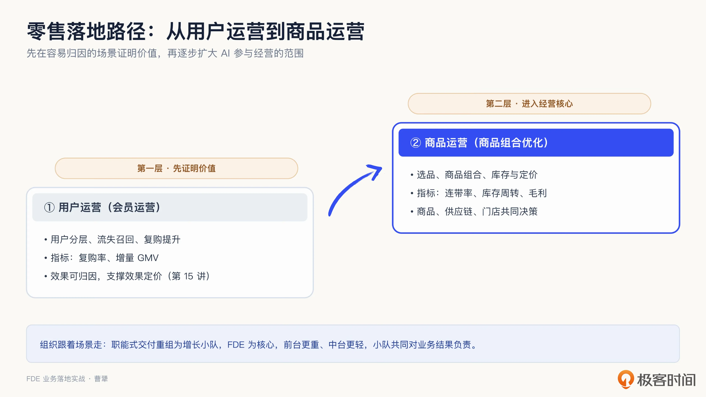
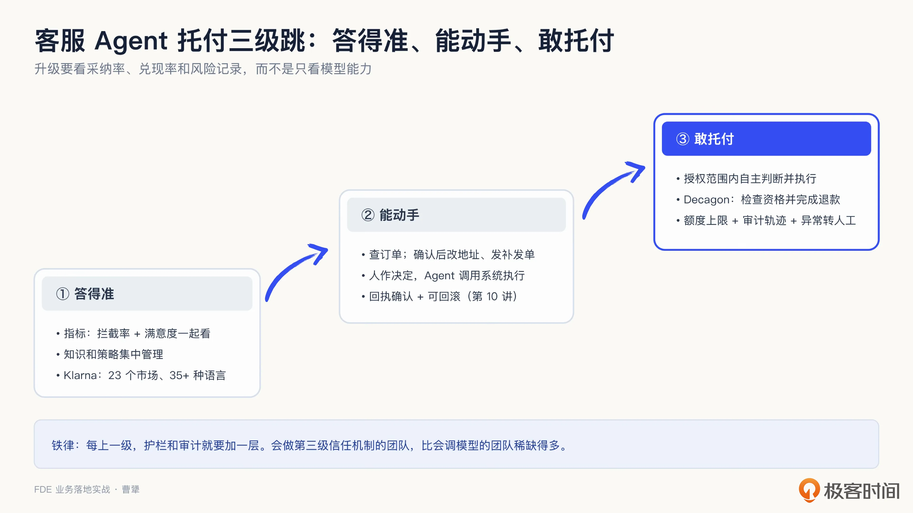
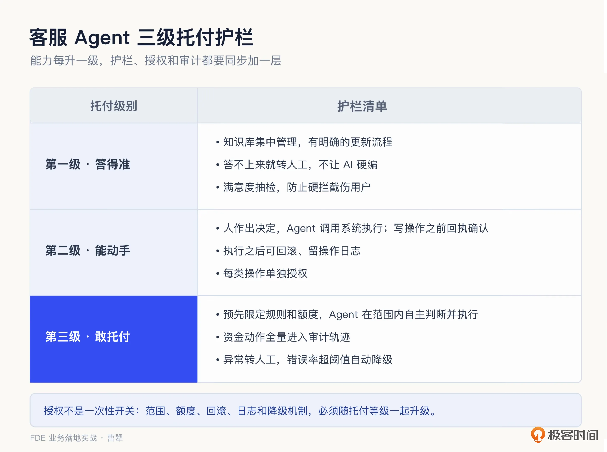
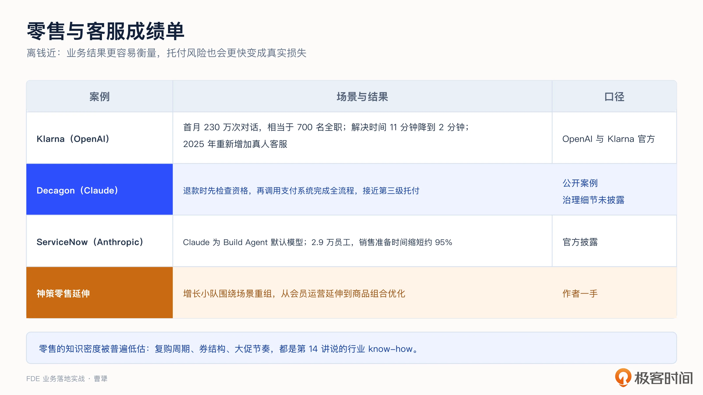
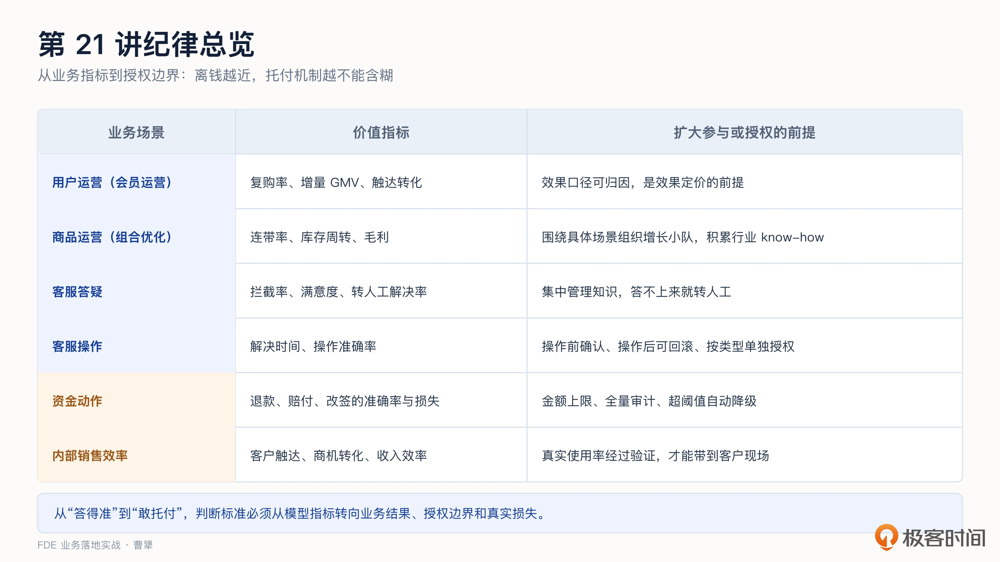
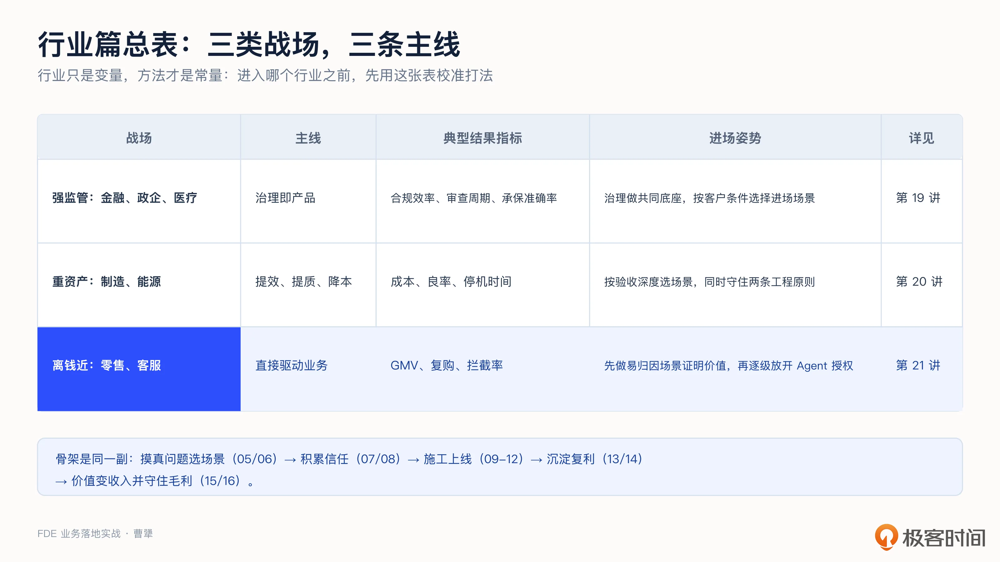

# 21｜行业落地（三）：零售与客服，AI 怎么直接驱动业务？
你好，我是曹犟。

行业篇的最后一站，我们去看零售与客服。前两讲主要按照行业约束来划分战场。强监管行业，治理本身就是产品，首先要说清模型、数据、代码和最终决策权由谁掌握；重资产行业，则要把现场改善落到生产、经营和安全结果上，同时守住数据基础，以及规则、模型和人的分工。

和前两讲相比，零售与客服有一个更鲜明的特点： **AI 做出的动作，能够比较快地反映到收入和成本上**。GMV、复购率、客服成本、销售转化，都是可以直接观察的经营指标，AI 做出的改变也更容易被衡量。用 [第 6 讲](https://time.geekbang.org/column/article/1002988 "") 的语言来说，这类场景比较容易满足北极星三条件：与商业价值强相关、客户能够影响、可以拆解和归因。

这个判断不只适用于分析零售与客服，也直接影响了我们自己的创业选择。Omni-Growth 从 AI 营销和广告投放切入，背后就是这样一个逻辑：投放是公司里与收入关系最直接的岗位之一，每一块钱预算的去向和回报都有数据，效果可以归因，价值也容易证明。 [第 15 讲](https://time.geekbang.org/column/article/1009805 "") 讨论的效果定价，在这类场景里更容易成立。我们虽然做的不是零售或客服，但面对的是同一类问题。

不过，离钱近也有两面。从业务扩展看，价值容易证明，FDE 可以先从相对简单的场景做出结果，再进入价值更高、落地也更复杂的经营问题；从 Agent 授权看，它越能动手，出错就越容易变成真实损失。因此，这一讲重点回答两个问题：FDE 怎么逐步扩大参与经营的范围，以及怎么一步步把更多业务动作交给 Agent 自主完成。

接下来，我们先看 FDE 在零售行业的切入路径。

## 零售：先从用户运营证明价值，再走向商品运营

这一小节不是想罗列 AI 在零售里能做哪些事情，而是想说明 FDE 怎么从一个价值容易证明的场景切入，再逐步扩大 AI 参与经营的范围。神策服务零售客户时，实际走过的一条路径，就是先做用户运营，再扩展到商品运营：先在以会员运营为代表的场景中，用复购率和增量 GMV 证明价值，再把优化范围扩展到选品、商品组合、库存和定价。范围每扩大一步，FDE 需要协调的人和沉淀的知识也会更多。

### 第一层，用户运营

在零售行业里，用户运营主要表现为会员运营，包括用户分层、生命周期管理、流失召回和复购提升。

[第 10 讲](https://time.geekbang.org/column/article/1005104 "") 已经讲过其中一个典型例子：只要说一句“帮我找出最近 30 天下过单但没有复购的用户”，神策提供的用户运营 Agent 就能自动创建这个用户分群。在找到人群之后，再给他们配置什么权益、采用什么话术、安排什么触达节奏，整个会员运营链路都可以由 AI 辅助完成。

之所以先从用户运营切入，是因为会员运营的数据相对完整、动作明确、效果周期短，FDE 容易建立基线和归因口径，也更容易用结果获得客户信任。 [第 15 讲](https://time.geekbang.org/column/article/1009805 "") 那个按增量 GMV 分成的 RaaS 案例，就发生在这一层：约定复购基线，超出部分分成，没增长不收费。能开出这种合同，前提就是效果可以归因。

会员运营前面已经分别从产品能力和效果定价两个角度讲过，所以这里不再继续展开。

### 第二层，商品运营

商品组合优化是其中一个典型场景：哪些商品搭配销售可以提高连带率，哪些滞销品应该清理、怎么清理才不损害价格体系，给哪些门店配置什么商品、什么时候调价。

这不是简单地多做一个场景。从潜在价值看，商品运营的上限通常更高。会员运营主要影响触达、复购和增量 GMV；商品运营除了影响销售额，还会影响库存占用、折扣损失和毛利，进入零售企业更核心的经营盘面。但价值空间更大，也意味着落地难度更高：数据要从用户和交易扩展到商品、库存、价格和门店，参与决策的团队也会更多。这也是为什么要把商品运营放在第二层：不是因为它不重要，而是因为它价值上限更高、落地难度也更大，最好先在会员运营中做出结果、建立信任，再向这里扩展。

如果只是部署一套商品管理或库存管理系统，需求相对明确，也可以按功能验收，传统的销售、售前、实施、研发分工完全能够完成。真正会对这种交付方式提出挑战的，是类似于商品组合优化这样的场景：它不是简单交付一个功能，而是和客户一起持续做经营决策。那么，在这样的情况下，乙方就会面对一个组织问题：原来的职能式交付，是否还适合解决这类新问题？

以商品组合优化为例，这类需要持续优化的经营问题，通常有三层难点：

1. 销售额、库存周转、折扣损失和毛利相互牵制，需要不断取舍；

2. 门店、库存、价格和促销一直在变化，方案无法在售前阶段一次说清；

3. 验收不再看功能有没有上线，而要看经营结果有没有改善，结果出来之后还要继续调整。

到了这一步，原来的职能式交付就容易出现问题。一个需求从销售转给售前，再转给实施和研发，每转一道，业务背景和决策约束都可能丢失一部分。每个团队都完成了自己负责的环节，却未必有人持续对库存周转和毛利负责。不是传统职能绝对做不了，而是信息接力的成本越来越高，迭代速度也很难跟上经营变化。

神策做过的一种组织探索，是 **把销售、售前、实施和研发重新组合成围绕具体场景的“增长小队”**。把这种组织方式用到商品组合优化上，可以组建一支负责“门店差异化选品”的场景小队，以 FDE 为核心，甲方则让商品运营、供应链和门店运营共同参与。大家一起根据门店客群、历史销售、库存、货架空间和供应链约束，决定每类门店应该保留哪些 SKU、引入哪些新品、淘汰哪些滞销品。方案上线后，还要根据销售额、毛利和库存周转持续调整。这样，组织不再按照职能环节切分，而是围绕一个需要持续解决的经营问题展开。

在这支场景小队里，FDE 直接吸收了传统实施的职责，成为连接客户业务、数据和研发的关键角色。FDE 先要贴着客户现场，理解经营目标、数据和规则，把现场问题变成能够落地的方案；再完成数据和系统对接，推动方案真正上线；上线以后，还要持续验证库存周转和毛利是否改善，根据结果推动产品调整，最后再把项目中的共性能力沉淀回产品。

在这类探索型项目中， **小队共同对一个业务结果负责，这是它与传统职能式交付最核心的区别**。等场景逐渐成熟、方案能够标准化以后，其中重复性的交付工作才可以重新交给传统的实施团队。

增长小队建立以后，前台和中台的分工也会随之变化。这里的前台，就是直接面向客户、对场景结果负责的增长小队；中台则负责提供可以跨场景复用的通用能力。我们当时把这种变化概括成“前台更重，中台更轻”：让真正理解客户、又能解决问题的人离现场更近，同时把通用的数据、技术和产品能力留在中台，避免每个场景都从头建设。中台更轻并不是削弱中台，而是不再让中台承担每个客户的具体问题。

这样的分工既减少了职能之间的信息接力，也更容易把客户侧的运营、商品和供应链团队拉到同一个目标下，把数据、规则和业务反馈放进一个持续迭代的闭环。这就是 FDE 工作方式的零售版本：不只是把工具交给客户，而是和客户一起把业务结果做出来。

组织调整背后还有知识的积累。什么品类的复购周期有多长、什么样的优惠券结构不损害毛利、大促前后的运营节奏怎么安排，这些都是 [第 14 讲](https://time.geekbang.org/column/article/1006738 "") 讨论的行业 know-how。零售客户更换供应商可能很快，但积累了这些认知的 FDE，进入下一家客户时仍然有价值。FDE 的工作，正在从“教客户用好软件”，变成“帮助客户把业务目标拆成可以委托给 Agent 的工作流”。零售运营就是这个变化最明显的领域之一。

零售部分先讲到这里。接下来我们看客服：当 Agent 开始直接修改订单、处理退款时，授权和护栏应该怎样跟着升级？

## 客服：从答得准，到敢托付

客服是 AI 落地最早、渗透最深的场景。客服 Agent 的能力可以分成三级：答得准、能动手、敢托付，一级比一级价值高，也一级比一级难。大多数团队目前只走到了第一级。

### 第一级，答得准

核心指标是拦截率，意思是用户的问题被 AI 直接解决、不再转人工的比例。这一级的规模化难点不是单条回答，而是知识管理。 [第 14 讲](https://time.geekbang.org/column/article/1006738 "") 提过，OpenAI 在客服项目中把数百条服务策略参数化，统一管理指令和工具，而不是让策略散在不同语言和渠道里。这正是知识资产化的客服版本： **策略即知识，集中管理之后才能规模化复用。**

再看这种能力规模化之后的结果。按照 OpenAI 公布的 Klarna 案例，这个 AI 客服助手覆盖 23 个市场、支持 35 种以上语言。上线第一个月，它处理了 230 万次对话，占全部客服对话的三分之二，相当于 700 名全职客服的工作量；平均解决时间从 11 分钟降到 2 分钟以内，重复咨询减少了 25%，满意度和人工客服持平；Klarna 自己估算，2024 年它能够带来 4000 万美元的利润改善。

拦截率这个指标还需要补充两点。

**第一，它不能单独看。** 强行拦截可能让用户不满，需要与满意度、转人工后的解决率一起观察。相信现在很多人都对国内运营商们的强制 AI 客服深恶痛绝，想尽办法转人工。

[第 11 讲](https://time.geekbang.org/column/article/1005151 "") 把 AI 项目的“好”分成了业务、系统和行为三层，其中行为层需要回到真实使用中验证。放到客服场景里，拦截率、满意度和转人工后的解决率，反映的是业务结果和真实使用情况；模型准确率则只反映了系统层面的一部分。

**第二，要看统计口径。** 拦截率这个指标很容易因为计算方式不同产生巨大差异：分母里是否包含用户自己查看帮助文档后解决的会话？先问 AI、再转人工、最后由人工解决的会话，应该算在哪一边？因此，看到别人公布拦截率时，要先问清楚算法；自己向客户承诺拦截率时，也要先把算法写清楚，不要自己骗自己。这也是效果定价的前置工作：口径不明确，效果分成就无法计算。

### 第二级，能动手

Agent 不再只回答问题，而是可以调用订单、物流等业务系统。不过，这一级仍然由人作出决定，Agent 负责执行。比如，用户查询订单时，Agent 可以直接从订单系统取回结果；用户修改地址时，Agent 先展示修改内容，得到确认后再提交；补发商品则由人工批准，Agent 负责创建补发单。 [第 10 讲](https://time.geekbang.org/column/article/1005104 "") 讨论的回执确认与可回滚，在这一级开始发挥作用：执行前把动作展示清楚，执行错误之后还能够退回。

### 第三级，敢托付

第二级和第三级的区别，不在于 Agent 会不会调用系统，而在于每次操作之前，是否还需要人来作出业务决定。第二级里，人决定怎么处理，Agent 负责执行；到了第三级，企业会在规则和额度范围内，把有限的业务判断权和执行权一起交给 Agent，只有异常情况才转人工。退款、赔付、改签等动作，都可能进入这一层。

Decagon 是一家基于 Claude API 构建企业级 AI 客服 Agent 的公司。根据公开案例，Decagon 的客服 Agent 在用户申请退款时，会先检查退款资格，再调用支付系统完成退款流程，把原来需要人工完成的步骤整个做完。这已经不只是“能动手”，而是 Agent 根据退款规则作出判断并执行，更接近第三级。公开材料没有披露额度上限、人工检查点和降级机制，因此它能说明这种工作形态已经出现，但还不能证明完整的治理机制已经建立。

第三级才是客服 AI 的真正深水区。拦住大多数团队的不是模型能力，而是 **信任机制**。 [第 10 讲](https://time.geekbang.org/column/article/1005104 "") 的护栏五件套、 [第 12 讲](https://time.geekbang.org/column/article/1006705 "") 的审计轨迹和人工检查点，都要跟着补上。所以托付三级跳有一条铁律：每上一级，护栏和审计就要加一层。

对 FDE 来说，这三级并不是三个产品版本，而是三种不同的交付工作。第一级，需要和客服团队一起整理知识、转人工条件和统计口径；第二级，需要接入订单、物流和客服工单等业务系统，把确认、权限和回滚真正做进流程；到了第三级，还要拉上客服、财务和风控，一起确定规则、额度、异常转人工和权限降级条件。FDE 不替客户决定愿意承担多大的风险，而是把这些业务边界翻译成 Agent 能够执行、系统能够审计的规则。 **会做这种信任机制的团队，比只会调模型的团队更稀缺。**

换到投放场景，我们自己的 Agent 也在沿着同一条授权阶梯往前走。刚开始，它只有“看”的权限，只能给出分析建议，操作仍由投手完成，在授权程度上相当于第一级。客户后来催着上“一键采纳”，本质上是希望走到第二级：投手决定是否采纳，Agent 负责执行。再往前，只有当 Agent 能够在预先设定的预算和规则范围内，自主判断是否调价、是否扩预算，并完成操作，才进入第三级。

[第 12 讲](https://time.geekbang.org/column/article/1006705 "") 聊过，权限能不能继续升级，主要看建议的采纳率和效果的兑现率，而且要在更长的时间窗口、更多投手和更多账户上稳定下来。退款、赔付也属于第三级，但因为直接影响客户的资金和权益，风险通常更高，除了采纳率和兑现率，还要进一步观察错误率、单次损失上限和审计记录是否完整。我们当时没有顺势上线“一键采纳”，就是因为两个指标还没有经过充分验证。 **升级的节奏由数据决定，而不是由意愿决定**，哪怕这个意愿来自客户自己。

三级都讲完了，我把每一级需要补上的护栏整理成了下面这张表。这张表也可以用来向客户解释方案成本：把每一项控制措施展开，方案贵在哪里就看得见了。

托付还有另一面： **边界不能只往前走，也要能够往回收**。Klarna 就是一个例子。前面提到，2024 年初，Klarna 官方披露，AI 客服的满意度与人工客服持平。到了 2025 年 5 月，Klarna 的 CEO 又表示，公司在客服上的降本追求走得太远，准备重新增加真人客服，确保用户始终可以选择真人服务。同年 6 月，他进一步提出，AI 可以接手重复性的工作，但公司仍然要向客户保证真人连接，真人客服甚至会成为一种 VIP 服务。

这并不是否认 AI 客服的价值，而是重新划分 AI 和真人的边界。我个人认为，这个调整背后还有一个比效率和准确率更根本的原因：无论 AI 的回答多么准确，客服中始终会有一部分情绪价值只能由真人提供。遇到投诉、争议或者资金受损时，客户需要的不仅是一条答案，还需要确认有人理解他的处境，也有人愿意对后续处理负责。

对 FDE 来说，降级机制也要提前设计：满意度、投诉率或者转人工需求一旦持续恶化，就应该缩小 Agent 的自主范围，把相应问题交回真人。

## 员工提效：把自己的公司当成第一个客户

客服和销售，其实处在同一条客户链路的两端：销售推动交易发生，客服则承接交易后的问题。前面我们一直讲的是 AI 如何直接服务外部客户，这条链路往企业内部走，就到了另一类容易被忽略的场景：面向员工的效率工具，尤其是销售工具。

按照官方披露，ServiceNow 把 Claude 设为内部开发平台 Build Agent 的默认模型，并向 2.9 万名员工推广，销售准备时间缩短了 95%。这已经不是少数团队的小范围试点，而是公司级推广。销售准备包括拜访客户前的背景调研、方案准备和话术整理。这个时间节省下来，可以转化成更多客户触达，因此销售效率也会直接影响收入效率。

神策内部也在用 AI 做同一件事。客户拜访前，AI 会先调研客户背景，再结合通用的解决方案模板，为这个客户生成专属方案。过去，这项工作需要销售、售前等多个角色反复沟通和澄清；现在，一个人就能在更短的时间内完成方案准备，而且内容更有针对性。对 FDE 来说，这类工具可以接手通用的信息收集和方案准备，把人的时间留给客户现场的判断与澄清。

这类内部员工提效场景对 FDE 还有一个战术价值：可以 **把自己的公司当成第一个客户**。内部数据更完整，合规协调成本更低，用户反馈也更快，FDE 可以先在这里跑通需求调研、工作流设计、评估和上线，再把成熟能力带到外部客户。

但内部项目没有真实的付费和验收压力，容易做成没人较真的玩具。因此，内部验收也要用 [第 11 讲](https://time.geekbang.org/column/article/1005151 "") 的三层评估纪律。销售场景的业务北极星可以是客户触达、商机转化或者收入效率；员工真实使用率则是行为层的证据。只有这些指标真正改善，FDE 才算积累了可以带到客户现场的能力，而不是仅仅在公司内部上线了几个助手。

## 课程总结

这一讲我们用零售和客服分别回答了两个问题。零售行业，FDE 可以先在用户运营中证明价值，再随着数据、组织和行业知识的积累进入商品运营；客服行业，Agent 的自主范围不能只看模型能力，而要随着业务效果和风险记录逐级放开，并且能够随时降级。员工提效则提供了一个起步方法：先把自己的公司当成第一个客户。

这一讲提到的案例和数字比较多，我把它们按口径整理成一张成绩单，方便你保存和引用：

我把这一讲的关键点整理成一张表：

如果你想转型 FDE，可以优先从用户运营、客服或者内部销售工具这类场景开始，训练自己用业务数字证明价值的能力。每完成一个效果周期，都可以用 [第 17 讲](https://time.geekbang.org/column/article/1011500 "") 的五步框架，复盘目标、实际结果、差距、可复用资产和下一步。

对交付和实施同学，可以用“答得准、能动手、敢托付”给自己的客服项目定位。想升到下一级，需要补的是知识和评估、系统集成，还是授权、审计和降级机制？降级预案也要提前设计好：质量指标持续下降时，哪些动作退回人工，具体怎么退，不能等出了问题再考虑。

对 To B 创业者和产品经理，复杂的经营问题很难再按照数据、实施和研发分段交付。可以围绕商品组合优化等具体场景组织小队，让 FDE 成为连接客户业务、数据与研发的关键角色，并把现场积累的行业 know-how 沉淀回产品。

## 行业篇总结：三类战场，一张总表

行业篇到这里就讲完了。几个行业打法各有侧重，但 FDE 的施工骨架没有变：先找到值得解决、又能够验收的问题，再进入现场，把数据、规则和专家知识连接起来；根据行业风险划清 AI、人与系统的边界，上线后用真实业务指标验证结果，最后把项目中的共性能力沉淀回产品。 **行业只是变量，方法才是常量**。

三讲中的案例数字都来自各家公司的披露，只能帮助我们判断价值量级，不能直接变成自己项目的承诺。到了具体客户，仍然要用 [第 6 讲](https://time.geekbang.org/column/article/1002988 "") 确定业务北极星、基线和归因，用 [第 11 讲](https://time.geekbang.org/column/article/1005151 "") 验证系统效果和真实使用，再用 [第 15 讲](https://time.geekbang.org/column/article/1009805 "") 把结果口径写进合作协议，那才是你自己的数字。这张总表我画出来了，你可以存下来，进入哪个行业之前翻一眼。

行业篇全部讲完，课程进入最后一章：成长篇。前面二十一讲聊的都是怎么把事做成，最后两讲回到你自己身上：想成为 FDE，要会什么，面试考什么？这条路能走多远，什么时候不该走？下一讲，我们来具体讨论一下。

## 思考题

留两个问题，欢迎你在留言区聊聊。

第一，回到你熟悉的一个零售、客服或者员工提效场景，如果让 FDE 从一个容易归因的问题切入，你会选择什么问题，用哪些业务指标证明价值？做出结果以后，下一步可以扩展到哪里？

第二，选择一个 Agent 已经能够执行操作的业务流程，哪些动作可以自动完成，哪些仍然需要人工确认？如果想让 Agent 再升一级，还需要补上哪些评估、权限、审计和降级机制？

期待你在留言区分享你的思考。如果这节课对你有启发，也推荐你把它分享给身边更多朋友。