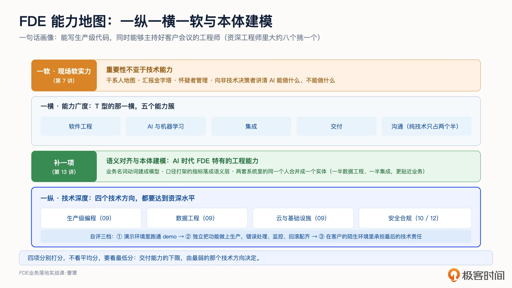
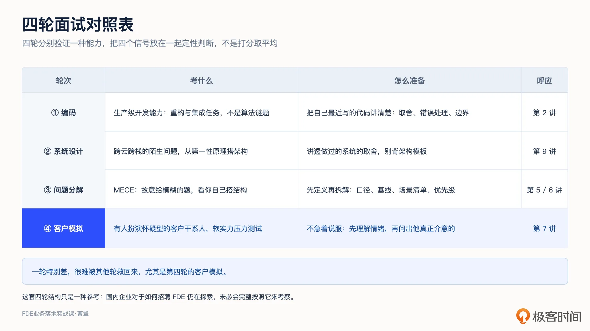
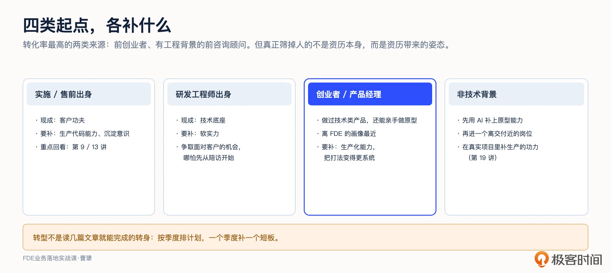
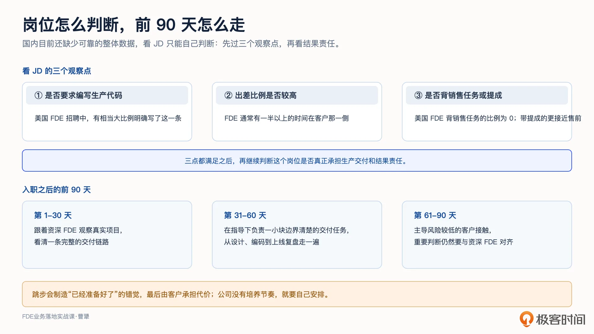
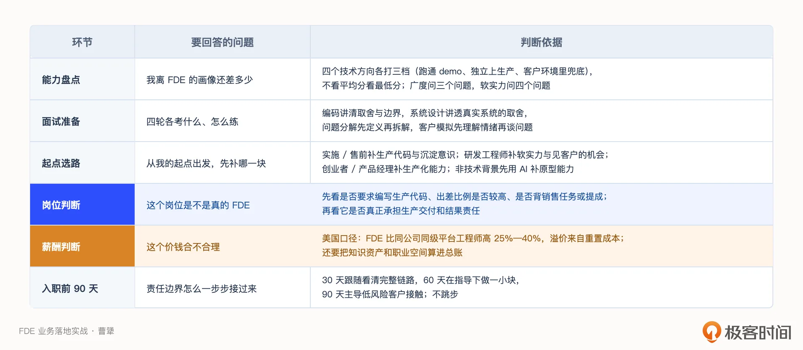

# 22｜能力与面试：从能力自评、岗位判断到面试与入职
你好，我是曹犟。

我们的课程终于进入了最后一章，成长篇。前面二十一讲，我们讲的是怎么把事做成，这两讲回到我们自身的成长上。今天先试图回答两个最实际的问题：想要成为 FDE，要会什么？如果去参加面试，会考什么？接着再顺着一个人的转型过程，看看不同起点怎么弥补短板、怎么判断岗位机会，以及拿到 offer 之后又该怎么起步。

我们先通过一个人才画像来看下 FDE 的职业门槛。Shimoda 在讨论 FDE 的招聘时，把这个角色的典型画像概括为：一个能写生产级代码，同时能够主持好客户会议的工程师。这里前半句是技术基础，后半句是软实力，两者都不能缺少。他还曾经给过一个估计：具备 FDE 复合能力的人，在资深工程师里大约八个里才能挑出一个。

八分之一的比例听起来门槛很高，但这种稀缺也会带来职业机会和薪酬溢价，这一讲最后也会展开讨论下薪酬。同时更重要的是，这个人才画像里的每一项能力都可以训练，前面二十一讲，其实就一直在训练这些能力。

## 能力模型：一纵一横一软与本体建模

FDE 的能力模型，我用三个切面来讲：一纵、一横、一软。它们不是三层台阶，而是观察同一个角色的三个角度。

第一个切面是“一纵”，指的是 **技术深度**，包括四个技术方向，也就是在 [第 9 讲](https://time.geekbang.org/column/article/1005100 "") 提过的四项能力：生产级编程、数据工程、云与基础设施、安全合规。这四项都需要达到资深水平。

为什么四项都需要达到资深水平？正如我们前面所说的，FDE 是在客户的系统里、使用客户的数据、受到客户安全策略约束来编写生产代码，这些约束让工程变得更难，而不是更容易。同样一个功能，在自己熟悉的公司环境里开发上线，和在客户的陌生环境里开发上线，难度不是一个量级。

对照这门课，我们 [第 9 讲](https://time.geekbang.org/column/article/1005100 "") 介绍的代码施工、集成迁移和私有化部署，分别涉及生产级编程、数据工程与云基础设施； [第 10 讲](https://time.geekbang.org/column/article/1005104 "") 和 [第 12 讲](https://time.geekbang.org/column/article/1006705 "") 则讨论了安全护栏与组织治理。虽然前面的课程覆盖了这四项能力在客户现场的典型问题，但要真正补齐它们，仍然要靠生产环境里的工程实践，也就是需要在真实生产压力下训练：主动承担一次上线值班，主动解决一个复杂的集成问题，通常比只看课程更有效。

第二个切面是“一横”，指的是 **能力广度**。之前我们曾经说，最优秀的工程师一定是 T 型工程师，也就是有足够的技术广度的同时在某一个技术方向上特别深入，FDE 也是如此。对于 FDE 来说，横杠是五个能力簇：软件工程、AI 与机器学习、集成、交付、沟通。其中，软件工程、AI 与机器学习是两个纯技术能力；集成则只有一半是技术，另一半是理解客户流程、协调现有系统和相关团队。换句话说，五个能力簇里，纯技术只占两个半。但剩下的部分，正是 FDE 和普通资深工程师拉开差距的地方。

广度要达到什么样的程度？有位资深 FDE 在受访时说：“FDE 是一种特殊的程序员。这个岗位不负责产品的任何一个具体功能模块，而是要对整个产品有大约 70% 的了解。”从我自己的观察中，可以这么理解，FDE 不一定要在某个模块上做到全公司最深，但当客户问到整个链路上的任何一段，都需要理解并清晰地表达出来，并且在必要的时候进行修改。AI 时代最有价值的人，可能不是最会写代码的，也不一定是最懂模型的，而是能够站在技术和业务的交叉点上，把两边连接起来的人。

讲完一纵和一横，我还想补充一下，AI 时代的 FDE，还有一项特有的工程能力，就是 Palantir 提出并且发扬光大的语义对齐与本体建模。简单来说，就是进入一个客户现场，能不能把这家客户的业务名词和动词建成模型，比如零售行业的会员、商品、订单、门店，以及它们之间的关系；能不能把口径打架的指标定义成可以追溯的语义层；能不能把两套系统里的同一个人合并成一个实体。这项工作一半属于数据工程，一半属于集成，但它更综合也更贴近业务。

第 13 讲我们从公司的角度讲 Palantir 的 Ontology，关注的是怎么把现场经验抽象成可以复用的产品能力。落到 FDE 个人身上，就是每次接客户，都要亲手把这层模型构建出来。Palantir 一路走来的实践反复证明，没有客户专属本体的大模型应用，在企业里很难活下来，而建本体是工程活，不是 prompt 活。它可能是最能把 FDE 和普通工程师区分开的一项技术能力。

第三个切面是“一软”，其实就是把种种现场软实力单独拿出来。它和前面的五个能力簇，例如沟通与交付，有交叉，但对 FDE 实在太重要了，也是大部分典型程序员欠缺的地方，值得单独展开。课程的第 7 讲整讲都在讨论这部分能力：干系人地图、汇报金字塔、怀疑者管理。对于 FDE 来说，软实力的重要性不亚于技术能力，如果不能向非技术决策者解释清楚 AI 能做什么、不能做什么，项目就很难真正部署。

把一纵、一横、一软放在一起，会得到一个有点反直觉的结论： **FDE 可以有面向新人的岗位，但没有真正意义上的入门级职责。** OpenAI 目前公开的 FDE 岗位，要求至少有 5 年工程或技术部署经验；Anthropic 的要求也类似，需要至少 4 年技术和客户工作经验。这两家公司实际上都把 FDE 当成资深岗位来招聘。

当然，也有例外。FDE 的开创者 Palantir 就公开招聘应届毕业生，而且明确说明，即使是应届生，入职第一天也要面对真实客户、承担真实责任，工作标准不会因为资历较浅而降低。这恰恰说明， **入门的是人，并不是职责**。只有公司具备成熟的产品、团队和培养机制，才有可能让新人直接进入 FDE 岗位；而对大多数不具备这些条件的公司来说，更现实的做法仍然是从资深工程师或者有客户经验的技术人员中寻找。

那么招聘方怎么看 FDE 的这三个能力切面呢？有位 FDE 团队负责人在采访里说，招人最看重两点：一是学习能力，二是洞察事物本质的能力。两者都不是具体技能，而是快速理解新行业、新客户的基础能力。这和 [第 5 讲](https://time.geekbang.org/column/article/1002969 "") 所说的“把自己当实习生从头学”，强调的是同一种品质。

## 怎么判断自己是否准备好了？

三个切面讲完之后，我们再看看怎么评估自己的技术深度，也就是“一纵”。

我整理了一个简单的自评方法：四个技术方向，每个都按照三档的标准来打分。

1. 能在演示环境里跑通 demo；

2. 能独立把功能做上生产，错误处理、监控、回滚全部配齐；

3. 能在客户的陌生环境中承担最后的技术责任。

如果你已经是 FDE，马上要独立承担客户现场的最终技术责任，目标应该是达到第三档；刚开始从其它职业转型过来时，至少也要处在从第二档走向第三档的过程中。当然，这里说的是能力目标，并不是要求候选人在面试之前，就必须都达标。四个技术方向分别打完分后，不要看平均分，而要看最低分。换句话说，交付能力的下限，通常由最弱的那个技术方向决定。

技术深度之外，还需要评估“一横”的能力广度，你可以问自己这样三个问题：

- 面对一个客户需求，能不能理解它从 AI 模型、工程实现、系统集成到上线交付的完整链路，并说清楚每个环节承担什么职责、彼此如何衔接？

- 链路中的任何一段出了问题，能不能判断它属于工程、AI、集成还是交付，并找到正确的处理路径？

- 进到一个客户，面对一堆系统和报表，能不能把核心的业务实体、它们之间的关系和指标口径，梳理成一张能落进系统的模型？

前两个问题检查的是对整条链路的理解，第三个问题检查的则是本体建模的能力。

至于“一软”，结合我自己这半年在客户现场的体会，你可以问自己这四个问题：进入一个陌生行业，能不能耐心把工作流画清楚，直到听懂客户的业务黑话？面对比自己年轻、但更懂业务的一线人员，能不能先放下预设答案，耐心向他们请教？看到一个“看起来不对”的做法，能不能分清它是真问题，还是客户基于生意做出的有意取舍？听到客户说“帮我做一个功能”，能不能继续追问，把这句话翻译成一个可以衡量的业务结果？

这里面前两个问题检查学习能力和姿态，后两个则检查判断力和业务翻译能力。它们不像“熟练掌握某某编程语言”那样能在简历上列出来，而是需要通过具体任务和客户对话来验证。

## 四轮面试，一轮一轮拆

上面我们描述的能力模型，映射到招聘上是怎样的？Shimoda 曾经给过一个四轮面试结构，我逐轮拆开，顺便告诉你怎么准备。

这套结构的意义，是把 FDE 的复合能力拆开验证：前两轮看候选人能不能把系统设计出来，并写成可以上线的代码；第三轮看能不能把模糊的业务问题拆清楚；第四轮则看能不能在真实的客户压力下沟通和推进。任何一轮单独拿出来，都不足以判断一个人是否适合做 FDE，四轮合在一起，才基本对应前面所说的“一纵、一横、一软”。

需要说明的是，这套四轮结构只是一种参考。国内企业对于如何招聘 FDE 仍在摸索，未必会完整按照这套结构来考察。

**第一轮，编码**。FDE 面试的编码，考的是生产级开发能力，而不是算法谜题：给你一段真实风格的代码做重构，或者做一个系统集成的小任务。准备这一轮面试，我建议少刷算法题。可以挑一段自己最近写过的代码，向同事讲清楚设计选择、错误处理和边界条件，直到对方能够复述出来。这就是 [第 2 讲](https://time.geekbang.org/column/article/1000788 "") 所说的生产代码能力。

**第二轮，系统设计**。这一轮的题目通常会跨云、跨技术栈，还会故意涉及候选人不熟悉的领域，看他能不能从第一性原理搭建架构。这一轮面试，你可以这样来准备：把之前设计过或者参与过的系统的架构取舍讲清楚，比背十个架构设计模板有用。具体的动作上，可以画一张你参与过的最复杂系统的架构图，标出当时的 3 个关键取舍，再想一想每个取舍如果反过来选，系统会变成什么样。

**第三轮，问题分解**。这一轮有时候会采用咨询行业常用的 MECE 方法（Mutually Exclusive, Collectively Exhaustive，相互独立，完全穷尽），也就是把模糊问题拆成彼此不重叠、整体又尽量没有遗漏的几个部分。比如“某零售客户想用 AI 提升复购，你怎么开始”，考你能不能自己把问题结构化。 [第 5 讲](https://time.geekbang.org/column/article/1002969 "") 和 [第 6 讲](https://time.geekbang.org/column/article/1002988 "") 讨论的场景发现、问题定义和优先级判断，正是这一轮要考察的能力。

面试的时候，你可以参考这个答题骨架：先澄清目标和口径，复购按谁的定义算、现在的基线是多少；再拆场景清单，会员分层、召回、权益结构各是一条线；然后用北极星三条件排优先级；最后说清第一步做什么、怎么验证。面试官要的不是答案，而是这套先定义问题再拆解的动作是不是你的本能。平时可以拿自己在项目中经历过的真实客户场景，模拟一次面试，口头讲出完整的拆解过程，并把自己的回答录下来。回听录音时，发现哪些地方卡住或者说不清楚，就是需要继续补的地方。

**第四轮，客户模拟**。现场有人扮演一位怀疑型的客户干系人，专门提出尖锐问题。这一轮最能检验候选人能不能真正面对客户。准备面试时，可以把 [第 7 讲](https://time.geekbang.org/column/article/1003666 "") 怀疑者管理的部分再听一遍。面对“客户”的质疑，不要急着说服，而要先理解对方的情绪，再问出他真正在意的问题。有条件的话，可以请一位同事扮演怀疑者，做一次 15 分钟的模拟对话。我自己的经验是，先理解情绪再讨论问题，比听起来要难得多。

还有一个细节值得留意：很多时候，这四轮的结果不是打分取平均，而是把四个信号放在一起定性判断。对于候选人来说，一轮特别差很难被其他轮救回来，特别是第四轮。

知道自己要补什么、面试会怎么考之后，下一步就是从自己的起点出发，排出一条进入路径。

## 不同起点，怎么补课和找机会

不是只有一条路能走到 FDE。硅谷曾经有一个调查，观察到两类转化率最高的 FDE 来源，很有意思：一类是前创业者，他们做过自己的产品，天然干过 FDE 的活，但弱点是缺乏足够的组织纪律；另一类则是有工程背景的前咨询顾问，软实力是现成的，但弱点是对写生产代码生疏。这两类人的转化率，都显著高于直接挖大厂的资深研发工程师。

为什么直接招聘大厂的资深研发工程师，转化率反而不高？First Round Review 访谈过几位前 Palantir 的 FDE 招聘负责人，他们给过一个解释：这些资深大厂人往往带着一套成熟的 playbook，也就是大厂里的标准做法，进入客户现场之后容易过于依赖既有经验。这个观察放在中国 To B 行业，我个人只同意一部分。真正影响转型的不是资历本身，而是资历带来的姿态。 [第 5 讲](https://time.geekbang.org/column/article/1002969 "") 提过，我们三个四十多岁的人，要在客户现场向二十多岁的投手学习。

资历越深，越需要提醒自己，不要把过去验证过的做法直接套到新客户身上。愿意重新学习的资深工程师，技术广度和判断力是年轻人短期内很难补齐的；但如果始终坚持过去的做法，资历就只能成为负担。所以，资深工程师不必因为“转化率低”而灰心。 **只要有空杯心态，资历就是优势。**

对照这门课的四类读者，路线可以这么排。

- 做实施、售前出身的，你的客户功夫是现成的，要补的是生产代码能力和沉淀意识，可以重点回看 [第 9 讲](https://time.geekbang.org/column/article/1005100 "") 和 [第 13 讲](https://time.geekbang.org/column/article/1006722 "")。

- 研发工程师出身的，技术底座现成，要补软实力栈，然后想办法争取面对客户的机会，哪怕先从陪访开始。

- 做过技术类产品、还能亲手做原型的创业者和产品经理，离 FDE 的画像更近，通常要补的是生产化能力，以及把打法变得更系统。

至于完全没有技术背景的人，也不是完全没有机会，只是有自己独特的成长路径。 [第 19 讲](https://time.geekbang.org/column/article/1011529 "") 讲过丹麦药企诺和诺德的例子，主导监管文档平台的那位数字化战略总监，是分子生物学博士出身，不是工程师，靠自然语言加 Claude Code 就把原型做了出来。这个例子给非工程背景的人的启示是：AI 把动手做原型的门槛降下来了，业务理解的重要性则在往上走。当然，原型不等于生产系统，四个技术方向的门槛还在。所以，对于非技术背景的人来说，更现实的路线是，先用 AI 补上原型能力，进到一个离交付近的岗位，再在真实项目里补生产的功力。

转型要花多久？Vaughan 曾经在一篇文章里提过，他给从产品工程转 FDE 的工程师，排了一条 9 个月的学习路径。当然，9 个月这个数字，我们不用当成标准答案，但它传递的信息我个人也非常同意：这完全不是读几篇文章就能完成的转身，而是需要按季度排计划，一个季度补一个短板的漫长旅程。

转型路线和大致周期讲完之后，还剩一个现实问题：国内去哪里找 FDE 的机会？

说实话，国内目前还缺少可靠的整体数据。不过，从我身边的变化来看，市场已经出现了一些很具体的信号。最近有越来越多的企业找我咨询，应该怎么组建 FDE 团队；也有一些资深的大厂研发管理者来问我，应该如何准备 FDE Leader 岗位的面试；还有一些朋友正在考虑围绕 FDE 模式创业。这三个信号分别来自企业、职业和创业三个方向。虽然只是我个人接触到的样本，不能代表整个市场，但至少说明，国内的 FDE 正在从概念讨论走向实际的团队组建、人才流动和创业探索。

招聘平台上也能看到类似的变化：MiniMax 有“AI 售前解决方案专家”，月之暗面、智谱、通义、混元都有类似岗位，Dify 在 2025 年初也公开招聘过前置部署工程师。从岗位描述看，这类工作中有一部分只是调用 API，另一部分则要把模型部署进客户机房，完成鉴权、对接数据中台、通过合规备案。越接近后者，就越接近真正的 FDE。

大家在看国内相关 JD 时，可以重点观察三点：是否要求编写生产代码，美国 FDE 招聘中有相当大比例明确要求这一点；出差比例是否较高，FDE 通常有一半以上时间在客户侧；是否背销售任务或者包含销售提成，在美国 FDE 岗位的统计中，背销售任务的比例为 0，而有销售提成的岗位更接近售前。

满足这三点之后，再继续判断这个岗位是否真正承担生产交付和结果责任。

我们讲完了怎么补能力、寻找和判断岗位，接下来沿着求职这条路径，再看两个现实问题：薪酬怎么判断，入职后的前 90 天怎么走。

## 薪酬：溢价是结构性的

薪酬这部分，我想讨论三个问题：美国市场的现状，FDE 当前为什么有溢价，回到国内又该怎么算这笔账。

**第一层，美国市场数据**：2025 年 FDE 招聘同比涨了十倍以上；披露薪资区间的岗位里，中位底薪约 17.4 万美元，七成给股权。具体到 Palantir，按照 [第 4 讲](https://time.geekbang.org/column/article/1001117 "") 采用的口径，新人总薪酬约为 20 万到 25 万美元，资深 FDE 则能达到 30 万到 45 万美元。Shimoda 在他的书里给的总包区间则更宽，17 万到 60 万美元以上。

**第二层，结构性溢价**。从网上一些公开数据看，FDE 当前应该比同公司同级的平台工程师薪酬要高 25% 到 40%。公司为什么愿意支付这个溢价？因为资深 FDE 离职时，带走的是客户关系、在途部署和难以替代的机构知识，这三项的重置成本远高于薪酬差额。试图在 FDE 薪酬上节省成本的公司，如果出现人员流失，带来的成本远远高于给 FDE 的一点薪酬溢价。这些数字不能直接变成谈薪公式，毕竟不同公司的业务阶段和岗位职责差异很大，但它们可以帮助我们判断一家公司是否真正理解 FDE：如果岗位要求你同时承担客户关系、生产交付和结果责任，薪酬却仍然按照普通实施或者售前岗位定价，就需要谨慎了。

**第三层，国内现实**：国内 To B 行业面临的利润压力和市场空间局限摆在那里，百万级 package 可能也只有少数头部企业出得起，没法直接达到美国市场的水准。但我的建议是把账算全：这个岗位给你的不只有现金。在真实项目中积累的技术、业务和客户能力，会变成 [第 14 讲](https://time.geekbang.org/column/article/1006738 "") 所说的个人知识资产，也会进一步打开第 23 讲要讨论的职业选择。对早期入场的人来说，这种能力成长和职业空间，可能比短期薪酬更重要。

## 入职之后：走稳前 90 天

岗位看清了，薪酬的账也算完了，最后再说入职之后的起步节奏。Shimoda 给过一个 30-60-90 框架。

前 30 天，先跟着资深 FDE 观察真实项目。重点不是马上独立产出，而是看清一条完整的交付链路：资深 FDE 怎么理解客户的工作流，怎么确定问题边界，怎么做技术取舍，又怎么处理现场出现的意外。

31 到 60 天，可以在指导下负责一小块边界清楚的交付任务，从方案设计、编写代码到上线复盘，完整走一遍。

61 到 90 天，再开始主导风险较低的客户接触，练习澄清需求、说明方案和推进下一步，重要判断仍然需要及时与资深 FDE 对齐。

我理解，这三个阶段并不是按时间熬资历，而是在逐步扩大一个人的责任边界。

这也解释了前面为什么说，FDE 可以有面向新人的岗位，但没有真正意义上的入门级职责：完整职责不会降低标准，只能由资深 FDE 一点点交出来。Shimoda 特别提醒，跳步会制造“已经准备好了”的错觉，最后却由客户承担代价。

如果我们入职的公司没有这样的培养节奏，也可以主动找一位有经验的人带自己，从边界清楚、风险较低的任务开始，并为关键节点安排自我评审。

## 课程总结

这一讲，我们先用“一纵、一横、一软”拆解 FDE 的能力，补上语义对齐与本体建模这项 FDE 特有的工程能力，再把这些能力映射到自评和四轮面试，最后讨论不同背景怎么转型、如何判断岗位，以及薪酬和入职后的前 90 天。贯穿其中的核心判断是：FDE 既要具备生产级工程能力，也要能够理解业务、面对客户并对交付结果负责。

顺着求职这条路径，我把这一讲整理成一张表：

如果你想转型 FDE，听完这一讲可以先做三件事：评估自己的技术深度，检查能力广度和软实力，再根据自己的起点，排出接下来几个季度的补课计划。

对 To B 创业者和技术决策者，可以参考前面的能力模型和四轮面试，设计适合自己公司的招聘流程；再用 30-60-90 框架安排新人入职后的责任边界。薪酬则不能只看人力成本，还要把客户关系、在途部署和机构知识的重置成本算进去。

这一讲讨论的是怎么进入一个正式的 FDE 岗位，并在入职后的前 90 天站稳脚跟。下一讲，我们把视角拉长：是不是一定要跳槽才能做 FDE，FDE 的真实工作状态是什么，这条职业道路能走多远，以及什么时候不应该走这条路。

## 思考题

留两个问题，欢迎你在留言区聊聊。

第一，对照能力地图做一次自评：在“一纵、一横、一软”三个切面里，你最强的一块和最弱的一块分别是什么？最弱的那一块，课程里对应哪几讲？除了重听课程，你准备找一个什么样的真实任务来训练？

第二，模拟一次第四轮的面试：如果面试官扮演的怀疑者说“你们这套 AI 就是花架子，我们的业务它根本不懂”，你的第一句话会说什么？

期待你在留言区分享你的思考。如果这节课对你有启发，也推荐你把它分享给身边更多朋友。