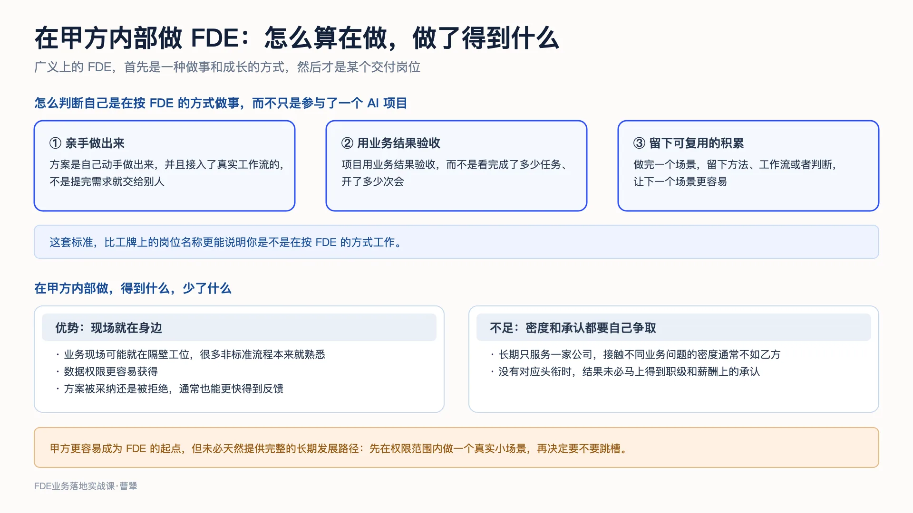
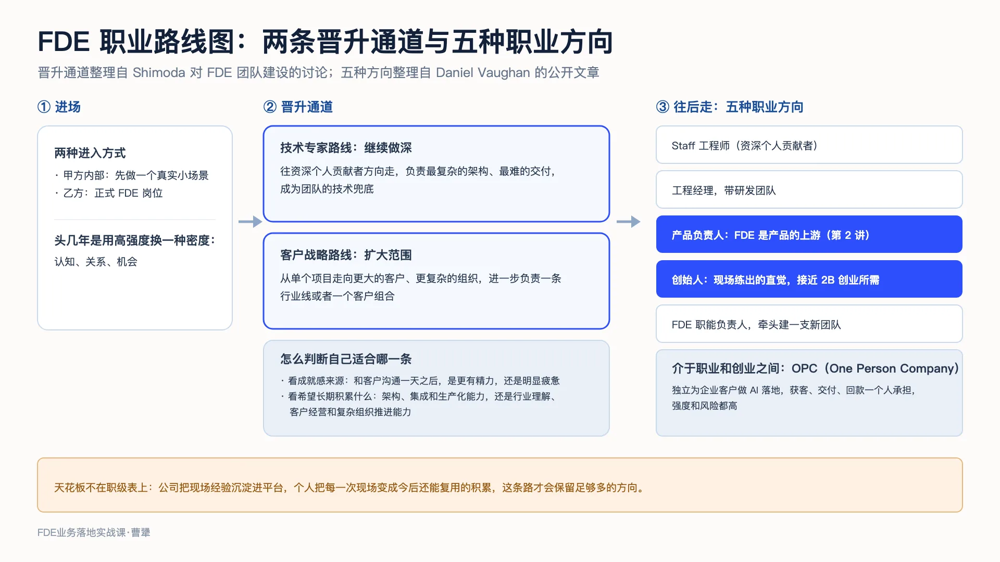
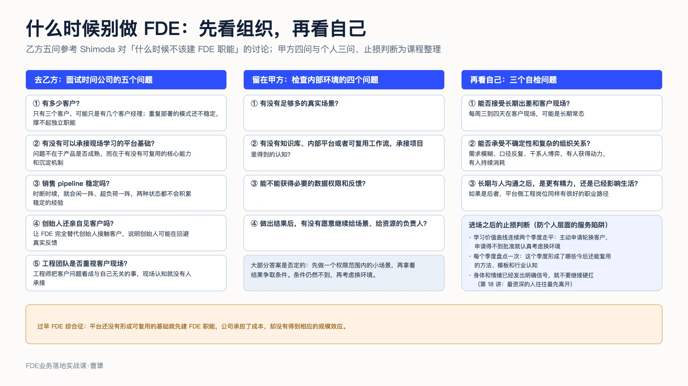
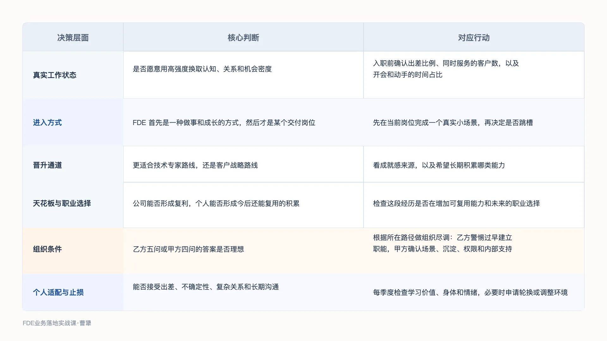

# 23｜职业发展与陷阱：晋升、天花板，以及什么时候别做 FDE
你好，我是曹犟。

上一讲结尾，我们提到，这一讲要把镜头拉远，看看 FDE 的整个职业生涯：是不是一定要跳槽才能做 FDE，这份工作的真实状态是什么，这条职业道路能走多远，以及什么时候不应该走这条路。

作为正课的最后一讲，今天我们就把这些问题讨论清楚。

先从一句调侃说起。英文互联网上流传着一种说法：FDE 拿着 40 万美元年薪，却做着全硅谷最辛苦的出差工作。这句话的原始出处已经找不到了，但它的确反映了这个岗位的一部分现实：高薪和高强度，就是这个岗位的一体两面。想清楚要不要走这条路、怎么走好这条路，就要先把两面都看清楚。

## 先看真实状态：高强度换三种高密度

先看苦活这一面到底有多苦。Hacker News 上有位拥有十多年工作经验的在职 FDE，分享过他真实的一周。他说：上周我同时在 10 个客户之间周旋，并行做构建，处理 Cloudflare 宕机，同时还要接售前电话；时间上一半在开会，一半在真正动手。这才是这份工作真实的样子，不是招聘宣传册上讲的那样。

这段话其实非常真实，前面的课程里，我们已经介绍过这种工作强度了： [第 5 讲](https://time.geekbang.org/column/article/1002969 "") 我们说，这份工作通常每周要去客户现场三到四天，出差是常态； [第 7 讲](https://time.geekbang.org/column/article/1003666 "") 也说过，FDE 需要对社交场景非常敏锐，经常要面对客户组织内部的关系和博弈。长期在现场、频繁出差、多任务并行，再加上大量与人沟通，这个岗位的日常工作强度，就是这样。

上面那个在 10 个客户之间并行工作的 FDE，紧接着又说：我还是更喜欢 FDE，因为我能端到端拥有解决方案，既能和客户互动，又能动手构建，每天都有大量东西要学，没有一天是重复的。

对工作强度的抱怨和对工作的热爱，可以出现在同一个人身上，这并不矛盾。我的理解是，这份工作本质上是 **用高强度换取高密度**，而且是三种密度。第一是认知密度，在客户现场能够集中接触大量真实业务问题，这一点我自己驻场之后体会很深；第二是关系密度，FDE 经常和客户的高管、业务骨干、IT 团队沟通，这种关系网络很难只靠坐在总部办公室里积累；第三是机会密度，后面讨论职业选择时会看到，这个岗位能通往的职业方向相对更多。

高强度换高密度，这笔交易值不值，因人而异。但这种高强度很难长期维持，如果往上走，能走多远？什么时候该停下？都是后面要谈的。不过先回答一个更靠前的问题：想做 FDE，是不是一定要先跳槽？

## 先别急着跳槽：在现在的岗位上也可以做 FDE

在课程的留言区，包括之前的两场 FDE 直播里，出现频率最高的一个问题并不是怎么去乙方应聘，而是类似于：我在甲方做 IT、数字化或者业务，FDE 跟我有关系吗？

我的判断是， **广义上的 FDE，首先是一种做事和成长的方式，然后才是某个交付岗位**。前面十几讲说的那套动作：进入现场找到真问题；把模糊需求翻译成可以衡量的业务结果；亲手把方案接入真实工作流；再把得到的认知沉淀下来，让下一个场景更容易；这些在甲方一样能做，不一定非要去乙方挂上 FDE 的头衔。

甲方内部真正的机会，就在 IT 系统和业务之间的那道沟里。IT 团队懂技术，却未必知道业务每天具体怎么做；业务团队最熟悉流程，却不一定能把问题变成可以落地的方案。AI 平台即使上线了，如果没有人把它接进真实工作流，业务仍然可能继续使用 Excel 和原来的流程。能把这两边接起来的人，做的就是企业内部的 FDE 工作。

对甲方的程序员、产品经理、业务人员，你可能已经具备 FDE 能力的一部分。上一讲讲过不同起点各自要补的课，你可以对照着看看自己缺哪一块。

怎么判断自己是在按 FDE 的方式做事，而不只是参与了一个 AI 项目？标准也很具体：自己有没有亲手把方案做出来并接入工作流；项目是不是用业务结果，而不是完成了多少任务来验收；做完一个场景之后，有没有留下方法、工作流或者判断，让下一个场景更容易。这套标准，比工牌上的岗位名称更能说明你是不是在按 FDE 的方式工作。

在甲方内部做这件事，优势很明显：业务现场可能就在隔壁工位，很多非标准流程本来就熟悉，数据权限也更容易获得；方案被采纳还是拒绝，通常也能更快得到反馈。但它的不足当然也是存在的：长期只服务一家公司，接触不同业务问题的密度通常不如乙方；没有对应头衔时，结果也未必马上得到职级和薪酬上的承认。简单来说，甲方更容易成为 FDE 的起点，但未必天然提供完整的长期发展路径。

因此，更稳妥的做法，不是为一个没真正做过的热门岗位先辞职，而是先在权限范围内选一个真实的小场景，把这套动作完整做一遍。结果既能验证自己是否适合，也会成为争取资源或者寻找新机会的证据。真正做过一遍之后，再考虑是否进入正式岗位，以及今后怎么发展。

## 晋升通道：技术专家，还是客户战略？

真正进入这条路之后，下一个问题就是：这份高强度的工作，怎么才能走得长远？Shimoda 在讨论招聘和团队建设时提出，要留住资深 FDE，公司需要建立两条明确的晋升通道：一条走技术专家路线，一条走客户战略路线。两条通道都要有明确的头衔、薪档和晋升标准，不能只停留在口头画大饼上。

开头说过，FDE 工作的高强度很难长期维持，如果组织不能及时提供新的发展空间，资深 FDE 很容易因为倦怠而离开。上一讲也提到，资深 FDE 离职时，组织失去的不只是一个人，还包括客户关系、在途部署和难以替代的机构知识，代价很高。所以，成熟的组织需要在问题出现之前，把两条职业路径都建立起来。

两条路线具体怎么走呢？按照我自己的理解，技术专家路线，是要继续做深：往资深个人贡献者方向走，负责最复杂的架构、最难的交付，成为整个团队的技术兜底。客户战略路线，则是扩大负责范围：从单个项目走向更大的客户、更复杂的组织，进一步负责一条行业线或者一个客户组合。两条路线没有高下之分，只有适配之分。

那应该怎么看自己适合走哪一条？我建议可以看两点。第一， **看成就感来源**。连续和客户沟通一天之后，是更有精力，还是明显疲惫？如果这类沟通长期给你成就感，可能更适合客户战略路线；如果更愿意把精力放在复杂架构和集成上，可能更适合技术专家路线。第二， **看你希望长期积累什么**。技术专家路线积累的是架构、集成和生产化能力；客户战略路线积累的是行业理解、客户经营和复杂组织推进能力。哪一类能力更接近你的长期优势和职业目标，就优先选择哪条路线。

这里再回到 [第 4 讲](https://time.geekbang.org/column/article/1001117 "") 讨论人才时的一个判断：资深 FDE 做得好，不一定要调回总部，还可以带队服务更复杂的客户，甚至在公司内部创业、孵化新的产品线。当时是站在公司角度讨论组织设计，今天我们换到个人视角：FDE 的晋升形态和传统专业序列不太一样，不一定表现为管理的人越来越多，也可以表现为负责的客户越来越复杂、承担的业务结果越来越大。资深 FDE 不脱离一线，并不代表没有晋升，而是因为这个角色的价值本来就来自现场。

## 天花板与职业选择：这条路能走多远？

那 FDE 的天花板在哪里？我个人的看法是，天花板不在职级表上，而在两个地方。一个在公司：如果公司没有把现场经验沉淀进平台，FDE 的工作就会逐步退化成一次性交付，个人的职业上限很可能也就是类似一个高级项目经理。 [第 16 讲](https://time.geekbang.org/column/article/1011485 "") 讨论过这类公司的结果。另一个则在自己：如果只投入工时、不做沉淀，经历再多现场也可能只是重复劳动。 [第 14 讲](https://time.geekbang.org/column/article/1006738 "") 讨论的个人知识资产，就是个人层面的复利。公司有复利，个人有沉淀，这条职业道路才会保留足够多的发展方向。

从这个角度看，判断 FDE 的职业上限，不只要看在当前岗位能升到哪里，还要看这段经历以后能把你带到哪里。上一讲算薪酬账的时候我说过，这个岗位给你的不只有现金，还有个人知识资产和更多的职业选择。对很多有长期职业规划的人来说，后两样有时反而更重要。知识资产第 14 讲讲过了，下面我们重点来讨论未来的职业选择。

职业选择多，不等于现在就要选，而是关注当前的工作有没有让未来的道路保持开放。有的工作现金高，但路越走越窄；有的工作当下未必最优，但每干一年，你的选择权就更多一些。FDE 这份工作的价值，很大一部分就在于能够增加未来的选择。

Daniel Vaughan 在一篇讨论 FDE 职业发展的文章里，把后续方向分成五种：第一，继续做资深个人贡献者，走 Staff 工程师这条线；第二，转工程经理，带研发团队；第三，转产品负责人；第四，出去创业，做创始人；第五，做 FDE 职能负责人，牵头建一支新的 FDE 团队。

五个出口里，我想重点讲两个。

**第一个是产品负责人**。我们在 [第 2 讲](https://time.geekbang.org/column/article/1000788 "") 其实就讲过：FDE 是产品的上游，在现场看到的真需求，都可能成为产品下一步迭代的来源。一个从 FDE 转做产品的人，长期的现场经历会影响他判断需求真伪的方式。这和只通过问卷调研了解需求，判断基础通常不一样。做过 To B 产品的人，对这一点应该都有体感。

**第二个值得重点讨论的出口，是成为创始人**。 [第 4 讲](https://time.geekbang.org/column/article/1001117 "") 提过，Palantir 的不少前 FDE 后来选择了创业。 [第 7 讲](https://time.geekbang.org/column/article/1003666 "") 提过的前 Palantir FDE Nabeel Qureshi，写过一篇广泛流传的 Palantir 复盘长文，其中有一个观察：YC 每一批创业公司里，前 Palantir 背景的创始人通常比前 Google 背景的还多，而 Google 的整体员工数量大约是 Palantir 的 50 倍。

需要说明的是，这只是他对 YC 创业者背景的个人观察，不是严格的统计结论。

为什么一家公司能产出这么多创始人？文章的解释是，好的创始人需要有读懂一屋子人的直觉，能看清群体动态和权力结构。而创业本质上是一场接一场的谈判，招聘是谈判，销售是谈判，融资还是谈判。这些直觉没法在教室里学，但 FDE 天天在客户现场练的就是这种直觉判断。

作为一个十一年的创业者，我个人认为，这个逻辑在 To B 创业里确实成立。创业需要找真问题、搞定干系人、用最小成本验证价值，再把一次成功复制成多次成功。这跟 FDE 的工作内容非常像，区别在于，FDE 是在客户项目里完成这些动作，创业者则要为自己的公司持续完成，并承担最后的经营结果。

从这个角度说，FDE 的工作经历的确可以训练很多创业所需的能力。当然，具备这些能力并不代表创业一定能成功，结果更多取决于时机、行业和运气。但如果本来就有创业的打算，先做几年 FDE，可能是一段很有价值的准备。

现在还有一种介于职业和创业之间的形态：以 OPC（One Person Company）的方式独立为企业客户做 AI 落地，把 FDE 变成自己的生意模式。这种模式下，一个人要同时承担获客、交付和回款，强度和风险都很高，并不适合所有人。但它至少说明，FDE 能力的价值不只存在于一家公司的职级体系里。

## 什么时候别做 FDE：先看组织，再看自己

最后再说一下边界：FDE 不适合所有人，也不是所有写着 FDE 的岗位都值得去。要判断这条路值不值得走，可以分两层： **先看所在的组织能不能提供必要条件，再看自己是否适合这种工作方式。**

所在的组织又分两种情况，分别对应乙方和甲方。

如果准备去乙方做正式 FDE，先要区分两件事：公司里需不需要有人按 FDE 的方式做事，和公司是否已经到了建立独立 FDE 职能的时候。早期公司当然需要有人深入客户、一起打磨产品，但这个人可能还是创始人或平台工程师，不一定需要单独建立 FDE 团队。要判断后者，则可以在面试时问下面五个问题。

1. **有多少客户？** 如果只有三个客户，公司可能还没有真正的 FDE 职能，只是有几个客户经理。客户太少，重复部署的模式还不稳定，通常不足以支撑一支独立的 FDE 团队；个人进去之后很可能只是在长期驻场。

2. **有没有可以承接现场学习的平台基础？** FDE 本来就会参与打磨产品，问题不在于产品是否成熟，而在于公司有没有可复用的核心能力，以及把现场认知沉淀进产品的机制。如果每个客户都要从头开发，现场学习也进不了产品路线图，FDE 最后做的仍然是一次性定制。

3. **销售 pipeline 稳定吗？** FDE 职能需要稳定的新客户进来，才有部署可做。Pipeline 时断时续，你就会闲一阵、超负荷一阵，两种状态都不容易积累稳定的经验。

4. **创始人还亲自见客户吗？** 在创业早期，FDE 职能不能替代创始人自己的客户时间。如果一家早期公司让 FDE 完全替代创始人接触客户，说明创始人可能在回避真实反馈，这是一个危险信号。

5. **工程团队是否重视客户现场？** FDE 需要进入工程团队的日常节奏。如果工程师把客户问题看成与自己无关的交付工作，FDE 带回来的现场认知就没有人承接，这个职能最终很难持续。

如果前面五问中，大部分答案都不理想，说明这家公司可能还没到建立 FDE 职能的时候。其中，平台还没有形成可复用的基础，就先建了 FDE 职能，是一种典型的“过早 FDE 综合征”。公司承担了成本，却没有得到相应的规模效应。进入这样的公司，个人很可能会长期承担一次性交付工作。

而如果想留在甲方内部，按 FDE 的方式寻求个人成长，则要问四个问题。

第一，有没有足够多的真实场景？

第二，有没有知识库、内部平台或者可复用工作流，承接项目里得到的认知？

第三，能不能获得必要的数据权限和反馈？

第四，做出结果后，有没有愿意继续给场景、给资源的负责人？

如果大部分答案是否定的，可以先做一个权限范围内的小场景，再拿着结果争取条件。结果已经做出来，条件仍然要不到，就该考虑带着能够公开说明的项目经历，以及自己形成的方法和认知，去寻找新的环境。这里说的个人积累，不包括客户数据、公司知识库和商业秘密， [第 14 讲](https://time.geekbang.org/column/article/1006738 "") 讲过的边界仍然不变。

检查完所在的组织，再看自己，可以问三个问题。

第一，能否接受长期出差和客户现场？每周三到四天在客户现场不是前三个月的新鲜体验，而可能是长期常态。

第二，能否承受不确定性和复杂的组织关系？需求模糊、口径反复，是 FDE 日常工作的一部分。我们前面也重点讨论过干系人博弈，有人会从中获得动力，有人则会持续消耗。

第三，长期与人沟通之后，是更有精力，还是已经影响生活？如果是后者，平台侧工程岗位同样有很好的职业路径，不必勉强一定要转型。

最后还要防一个陷阱，就是个人层面的服务陷阱。 [第 16 讲](https://time.geekbang.org/column/article/1011485 "") 专门讲过“服务陷阱”， [第 18 讲](https://time.geekbang.org/column/article/1011520 "") 也讨论过倦怠死亡螺旋和英雄工程师，这些都是从公司和团队管理者的视角讲的。换到个人视角，逻辑其实一样：公司不沉淀，交付会退化成外包；个人只出工、不沉淀，也会把自己变成只能重复交付的人。第 18 讲给出的解法，主要需要由公司提供。如果公司不提供，个人就要有自己的止损判据。

针对个人层面的服务陷阱，我的建议有三条，都只是经验值，不是适用于所有人的硬标准。

第一，学习价值曲线连续两个季度走平，可以主动申请轮换客户。如果申请得不到批准，就该认真考虑是否要换一个环境。

第二，每个季度盘点一次：这个季度我形成了哪些今后还能复用的积累？方法、模板、行业认知，都算。

第三，如果身体和情绪已经发出明确信号，就不要继续硬扛。第 18 讲说过，在倦怠螺旋里，最资深的人往往最先离开。

上面这些内容并不是为了劝退，而是希望大家带着清醒的认识进入岗位，不要只凭热情做决定，也不要因为岗位火热就一定要蹭热点。

这门课一直在强调一个思路： **进场之前先做尽调，对客户如此，对自己的职业发展更应该如此**。

## 课程总结

正课最后一讲，我们把 FDE 的职业发展整体过了一遍：真实的工作状态、如何在甲方先做起来、两条晋升通道、天花板与职业选择，以及什么时候不该做 FDE。

我把这一讲的关键点整理成一张表，方便你保存分享。

如果你想转型 FDE，不用先为一个岗位名称辞职。可以在当前岗位选一个真实的小场景，亲手把方案接入工作流，用业务结果验收，再把得到的认知沉淀下来。完整做过一遍之后，再判断自己是否适合，以及有没有必要进入正式岗位。

如果你已经在做 FDE，可以用两个问题选择晋升路线：什么样的工作更能带来成就感，自己希望长期积累哪类能力。同时，每个季度都要盘点一次，最近形成了哪些今后还能复用的能力和认知，学习价值、身体和情绪有没有持续恶化。

对 To B 创业者和技术决策者，建立 FDE 职能之前，要先确认公司是否具备相应的组织条件。建立之后，还要提供技术专家和客户战略两条明确的晋升通道。否则，公司很难留住资深 FDE，个人也很容易陷入长期的一次性交付，对于组织和个人都是双输。

正课二十三讲，到这里就全部讲完了。下一讲是这门课的结束语，我想和你聊聊这门课最想留给你的东西：为什么要做难而正确的事。

## 思考题

如果暂时不跳槽，你所在的岗位上，有没有一个可以按 FDE 方式推进的真实场景？你准备如何判断它已经接入真实工作流、产生了业务结果，并留下了可复用的积累？

请根据自己的选择，用乙方五问或者甲方四问检查当前环境，再用个人三问检查自己。哪一个条件最不理想？它可以通过争取资源来改善，还是已经到了需要调整岗位或者环境的程度？

欢迎你在留言区分享自己的判断和下一步行动，如果这节课对你有启发，也推荐你把它分享给身边更多朋友。