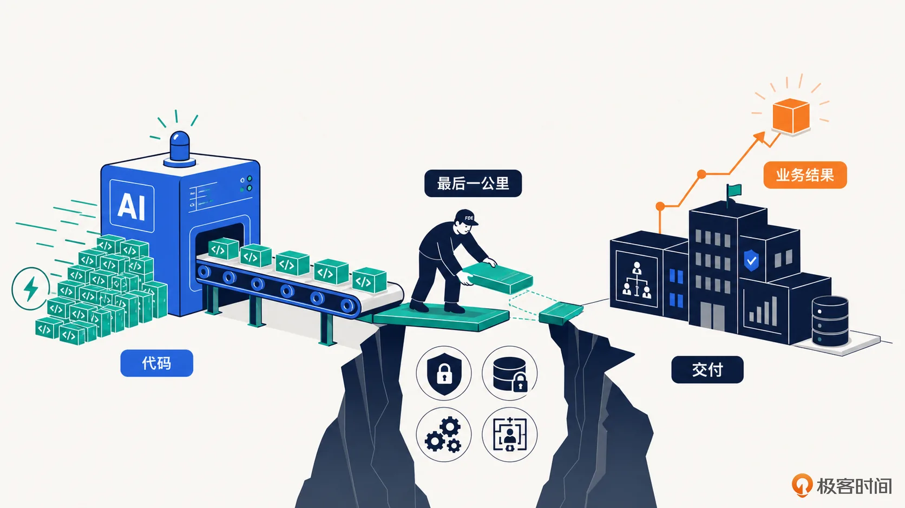
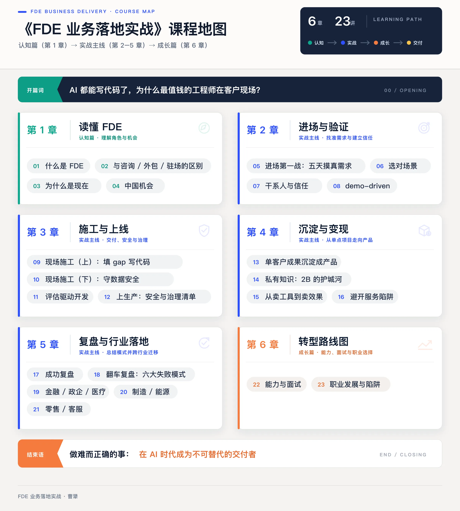
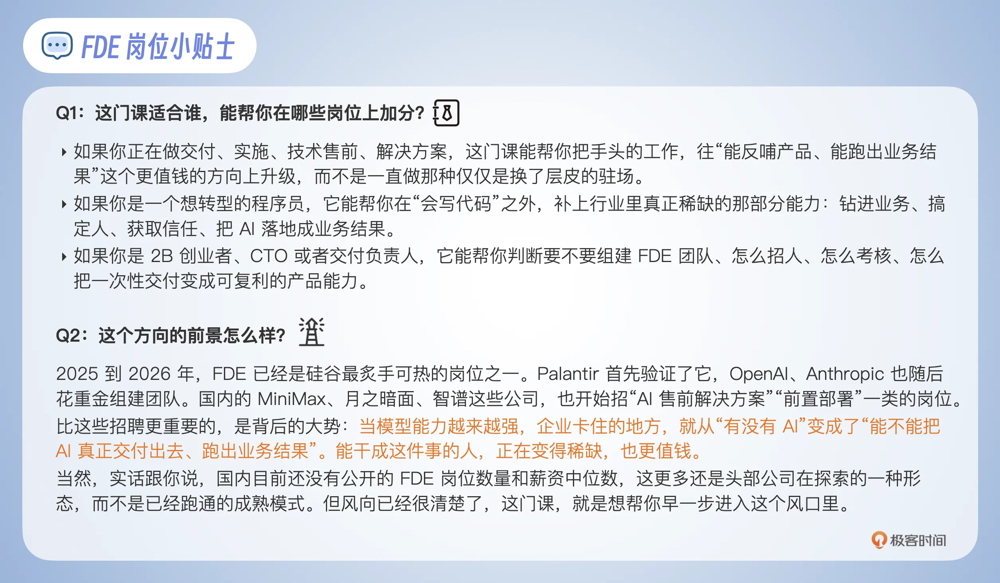

# 开篇词｜AI 都能写代码了，为什么最值钱的工程师在客户现场？
你好，我是曹犟。欢迎来到这门 FDE 业务落地实战课。

开始之前，我想先简单聊聊我自己现在正在做的一件可能听起来有点不合常理的事。

我是神策数据的联合创始人和 CTO。神策在移动互联网时代，算是一家小有名气的独角兽公司，累计融资超过 20 亿元人民币。而我个人，最多的时候，管过 800 人的技术团队。按理说，到了今天，我应该坐在办公室里看报表、听汇报、做决策、开管理会。但最近这半年，我做得最多的事，是和一两个同事，带着电脑往客户那儿跑，一待就是一整周，和客户的人挤在一间屋里办公，学他们的业务知识，看他们怎么干活，听他们说工作上哪儿不顺手。

一个管过几百人的公司创始人和高管，为什么反而跑回一线，做起了这种最“不像老板”的活？

更特别的是，往客户现场跑的，并不只我一个。

2026 年 5 月，OpenAI 专门成立了一家企业部署公司，收购了一支团队，一口气得到大约 150 名 FDE；几天之后，Anthropic 也跟着采取了类似行动。过去这一整年，在硅谷，FDE 这类岗位的招聘需求增长了十倍不止。OpenAI 和 Anthropic，是这个星球上最懂 AI、也最不缺顶尖工程师的公司，它们本该坐在总部把模型和产品打磨到极致、等客户上门，可它们偏偏反过来，把工程师一个一个派到客户的办公室里去。

所以这就不是我一个人的选择了。从我带的这样一支三人小团队，到 OpenAI 和 Anthropic 这样的巨头，都在不约而同地做同一件事：把最好的人，放到离客户最近的地方去。这背后到底是什么原因？

## 写代码不再是瓶颈，交付才是

我自己的答案是这样的：这件事的发生恰恰说明，AI 虽然越来越好用了，但也越来越难落地了。

最近一年，模型的能力涨得非常快。写代码、写文档、做数据分析，很多单点任务，AI 已经做得比大多数人都要更快、更好了。可是一旦你要把它真正接入一家企业，让它在真实的数据、真实的流程、真实的权限和真实的组织里得到真实的业务结果，难度就是另一个量级了。MIT 有一份研究报告说得很直接：企业在生成式 AI 上投入了数百亿美元，可大约 95% 的组织，回报是零，AI 真正能跑进生产环境的是极少数。

你可以这样理解这中间的鸿沟。模型给你一段能跑的代码，是一回事；这段代码能通过一家银行的安全审查、接上它几十年前的老系统、让业务部门真的用起来、还真的改善了某个指标，是另一回事。前一件事 AI 已经很擅长，后一件事，今天基本还得靠人。这个分工可以用一句话来总结： **AI 负责做出来，人负责判断是否做得好。**

所以今天 AI 在企业落地的真正卡点，早就不是模型本身了。 **真正的瓶颈，是最后一公里的交付和落地。** 写代码不再是稀缺能力，把 AI 真正交付出去、跑出业务结果，才是稀缺能力。这个判断，我之前在我的公众号里也专门讨论过：代码正在变成一种廉价的商品，不再是核心壁垒；私有数据、业务理解和客户信任，才是新的壁垒。这三样东西怎么构建，恰好就是这门课反复要讲的东西。而能干成这件事的人，正在被企业单独挑选出来、单独定价、单独设置岗位。这个岗位，就是我这门课的主角， **FDE，Forward Deployed Engineer，前向部署工程师。**

我们再往深一层看，FDE 的出现，其实也不是偶然。

我们在政治课上都学过一条规律：生产力一变，生产关系迟早也要发生改变。生产工具换了，人和人怎么协作、工作怎么分工、需要什么样的新岗位，都得重新设计、重新洗牌。举个我们所有人都亲身经历过的例子，互联网普及之后，中国才慢慢长出了“软件工程师”和“产品经理”这两个今天看起来似乎天经地义的岗位。而 AI 这一轮科技革命，则又是一次生产力的大跃迁。企业也因此要被逼着重新安排“怎么把这套新的能力组织起来、再交付出去”，而 FDE，则可能就是目前行业里面摸索出来的、属于 AI 时代的一个新岗位。关于这一点，我会在第 3 讲专门展开讨论。

但是，这里我觉得有件事还是需要提前讲清楚。AI 的确让“到客户现场，飞快搭一套定制系统”这件事情，变得前所未有的迅速和方便。于是很自然地，会有越来越多的人认为：我用 AI 在客户现场几天就交付了一套东西，我这不就是 FDE 吗？但我个人的判断是：这并不是。AI 越强，单纯的定制交付就越不稀缺；反过来，“现场得到的认知，能不能回流进产品”才越来越像这其中的核心竞争壁垒。真假 FDE 到底差在哪里，这是我在第 2 讲要展开讨论的事。

## 为什么是我来讲这门课

开头说的我最近那套不合常理的工作模式，其实背后反而是我这十几年积累的结果。先做个简单的自我介绍，我本科和研究生都毕业于清华计算机系，在百度做了七年大数据研发，2015 年参与创立了神策数据，亲身经历了 SaaS 或者说 To B 行业在中国的兴盛与低谷。

这些年在神策，我带过产品研发、解决方案、交付、技术售前、产品售后几乎所有技术类的团队。神策累计服务过数千家企业级客户，驻场、定制、信创、陪跑、按效果对赌，这些坑我基本都踩过一遍，对中国 To B 这门生意的难处，我是有切身体会的。而且我不仅是一个写过十几年代码的工程师，也是一个管理过公司的创业者，所以在讨论技术话题时，背后会始终带着我这十一年创业积累的商业认知。

而我在开头说的那个在神策内部孵化的小团队，叫 Omni-Growth，只有三个人，做的是一款 AI 营销产品。我们践行的就是 FDE 这套打法：待在客户的现场，看他们的业务，弄清楚他们真正的需求，回过头来打磨自己的产品，再拿去现场看着客户使用。所以在这门课里我讲的东西，不是我作为旁观者看到和听到的，很多就是我此刻正在亲历的。

让我有点意外的是，FDE 这么热，可是在中文世界里，关于它到底怎么做，几乎找不到一套系统的实战内容。大部分讨论还停在概念层面，连“FDE 和外包到底有没有区别”，都能吵成一团。而我这门课想做的，就是把这块空白补上。

## 你会带着哪些问题来

你会来听这门课，心里大概装着几个问题，不知道我这么理解对不对。

你可能正在做交付、做实施、做售前，天天泡在客户现场。你也许碰到这样一类场景：辛辛苦苦做了个惊艳的 demo，客户当场就拍板叫好，可它偏偏上不了生产环境；也可能项目签的时候人人叫好，三个月后一看，业务指标一动没动；又或者，第一个客户你带十个人干了三个月，到第二个客户，还是十个人、还是三个月。你可能想弄明白：这些困难，有了 AI，到底应该怎么解决？我干的这些事情，到底算不算 FDE？FDE 跟我以前那套，有没有本质区别？

你可能是个程序员，看着 AI 的代码能力一天比一天强，心里有点发慌：我这种靠交付代码吃饭的人，接下来是会被取代，还是会更值钱？你可能也听说了，FDE 是硅谷现在最火热的岗位之一，你想搞清楚：这个风口是真的吗，值不值得我转行？真要转行，我得补上哪些能力？如果要参加面试，又会考些什么？

如果你是 To B 创业者，是 CTO、是交付团队负责人，你的问题可能是这样的：我要不要组建一支 FDE 团队？怎么招人、怎么考核结果？怎么把一次性的项目，做成能不断复用的产品能力？怎么让项目越做越轻？

这些问题，有的可能一讲就能给你一个方向，有的可能会贯穿整门课，一步一步展开。但我想说的是：这些问题，我遇到了，我在思考，我也试图在这门课里面回答清楚。

## 我会怎么讲这门课

那我具体会怎么讲这门课？我觉得至少有三点，我是可以保证的。

**第一，不空谈概念，而是多讲具体怎么做。** 每一讲我都会尽可能落脚到能上手的东西：一份清单、一个模板、一句话术、一条判断标准。道理我当然会讲，但绝不会只停留在道理上。每一讲我都会尽可能配上真实的业务场景，金融、制造、零售、政企、客服，这些行业都会讲到。

**第二，案例的选择不会仅仅停留在概念转述上，而是尽可能切实有用。** 在案例选择上，我会优先选两类材料：一类是真实的一线经验，另一类是公开可查的标杆实践。前者包括神策服务几千家客户踩过的坑，和我自己团队 Omni-Growth 眼下正在客户现场做的事；后者包括 Palantir、OpenAI、Anthropic 这些全球前沿公司在 FDE 上的实际做法。当然，为了保护商业机密，一些敏感信息我会脱敏，但脱敏之后的案例，依然是真实可信的。

**第三，也是最关键的一点：这门课不教你怎么用 AI 写代码。** 怎么用 Cursor、怎么调 Claude Code、怎么让 Agent 替你干活，这些内容网上到处都是，甚至 AI 自己也讲得比我更清楚。我要讲的，恰恰是 AI 帮不上忙、却直接决定成败的那部分：AI 写完代码之后，你怎么把它真正交付成客户的业务结果，又怎么把现场的认知沉淀回你自己的产品。这，才是 FDE 真正稀缺、也最值钱的能力。

按这三点，我把整门课分成了六章，遵循一个总的原则： **认知的部分尽量压缩，** **加大实战部分的比重** **。**

**第一章** **：** **认知篇，读懂 FDE**

我会用四讲讲清楚 FDE 到底是什么，和咨询外包驻场到底有什么区别，为什么偏偏是现在火起来，以及在中国，FDE 的机会在哪里。

第二章到第五章，是整门课的主线，也是分量最重的部分。我会按照一个真实 FDE 项目的完整生命周期走下去。

**第二章** **：** **进场与验证**

怎么用五天摸清真需求，怎么选对场景，怎么搞定关键人和获取信任，怎么用一个能跑的 demo 撬开局面。

**第三章** **：** **施工与上线**

怎么在客户系统里填补技术与业务的鸿沟、写生产代码，怎么在放大交付效果的同时守住数据安全，怎么做到评估驱动开发，怎么让 CIO 放心地让系统上生产环境。

**第四章** **：** **沉淀与变现**

怎么把一个一次性的单客户成果，沉淀成能复用的产品；怎么建起私有知识的护城河；怎么从卖工具变成卖效果、不沦为成本中心。

**第五章** **：** **复盘与行业落地**

一个跑通的项目长什么样；行业里面普遍提到的六大失败模式怎么避免；以及金融、制造、零售这些不同行业各自应该怎么落地。

**第六章** **：** **成长篇**

这一章是给想新入行的你准备的：FDE 到底要会什么，面试考什么，怎么晋升，天花板在哪，以及什么时候不该做 FDE。

这六章一共二十三讲，我画成了下面这张课程地图，你可以先扫一眼，在心里有个完整的认知。

## 你将获得什么

整门课听完后，我希望你至少能带走三样东西。

第一样，是 **一套能上手的交付工具箱**。进场访谈怎么问，场景怎么筛选，干系人怎么摸底，demo 怎么搭建，评估集怎么设计，上生产环境怎么过安全这道关，效果怎么定价，这些我都会给你能直接拿去用的清单、模板和话术，而不是只给你几句大道理。

第二样，是 **一种判断力**。以后你再看到一个 FDE 岗位，或者一支号称在做 FDE 的团队，能一眼看出它是真的 FDE，还是仅仅换了层皮；你接手一个新的项目，也能判断它到底该不该做，怎么做才不至于烂尾。

第三样，如果你打算入行，我希望能给你 **一张清楚的转型地图**。FDE 这一行到底需要什么能力，面试会考什么，往上怎么走，岗位天花板在哪，甚至什么时候你就不该做 FDE，我都会坦诚跟你讲清楚。

## 开篇寄语

最后，我们回到开头那个问题：AI 都能写代码了，为什么最值钱的工程师，反而在客户现场？我的答案是，当写代码这件事不再稀缺，稀缺的就变成了另一种能力：能钻进真实的业务里，把一个模糊的问题，一步一步变成一个真正跑得起来、还能沉淀回产品的结果。

这也引出我想放在这门课最前面的三句话，作为这门课的底色。当然，你也可以当成后面全部内容的一个预告。

第一，写代码这件事，已经不再稀缺了。 **真正稀缺的，是把 AI 交付成客户的业务结果，再把现场的认知沉淀回产品的能力。** 这门课练习的，就是这件事。

第二，判断一个团队是不是真在做 FDE，不是看它用没用 AI、用得有多花哨，只看一件事： **现场得到的认知，到底有没有回流到产品里**。这句话你现在记不住没关系，整门课我们会反复提到它。

第三，做难而正确的事。FDE 干的很多活，一时半会儿可能看不出规模，做起来也并不轻松，但 **恰恰是这些一时难以规模化、又难以被替代的工作，在 AI 时代才最值钱**。

这门课更多只是我的一家之言，都来自我自己曾经踩过的坑和眼下正在做的事情，我不敢保证每条都对，但可以保证每条都真。你在学习课程的过程中，有任何疑问、感想，欢迎留言。在我之前的另一门极客时间课程（ [大数据应用实战](http://gk.link/a/12KX2 "xxx")）中，我从大家的留言中，学到了很多东西，也期待在这门课程里，能够与你共同学习，一起成长。如果你觉得有收获，也欢迎转发给你周围其他对 FDE 这个岗位或话题感兴趣的同学。

接下来的第一讲，我们先把最基础的问题说清楚：FDE，到底是什么？

现在，就让我们一起开启这趟成为 FDE 的旅程吧！期待在接下来的学习中与你深度交流，与你相伴，度过一段充满挑战也会充满收获的时光！

