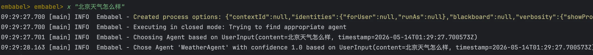
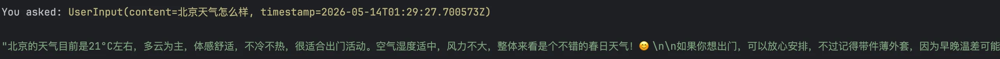

# 01｜基于 Spring Boot Starter，快速实现“天气查询 Agent”
你好，我是张嘉熙。

很多 Java 开发者在接触 AI Agent 时，第一反应往往是：做一个 AI Agent，必然离不开复杂的 Prompt 、Python + 各种框架，以及一堆链式调用的胶水代码。

但事实并非如此。今天，我想带你看到另一种可能：用我们熟悉的 Spring Boot，像写 Controller 一样写 Agent。这节课不讲概念，我们直接动手，从 0 到 1 交付一个真正能跑起来的 Java Agent。

整个过程你只需完成四步：

1. 搭建最小可运行环境

2. 接入真实的天气 API

3. 编写几个“普通方法”和“数据结构”

4. 将它变为 Agent


最终你会实现这样的效果：当用户说“帮我查一下北京天气”，系统就会准确返回当前天气、温度、湿度和简要预测。 **更重要的是，你写的并非传统接口，而是一个可以被 “智能调度” 的能力。**

## 如何用Java快速创建第一个Agent？

我们将从环境搭建、API配置、代码实现、运行测试四个步骤，完整走完整个流程。

### 前置要求

- Java 21+

- Maven 3.9+

- Spring Boot基础

- Embabel 0.3.5


> 本讲 [GitHub 地址](https://github.com/zhangjessey/embabel-java-agent-tutorial/tree/ch01/weather-agent)

### 第一步：快速搭建运行环境

为了帮助你透彻理解项目结构和依赖关系，我们从空项目开始一步步搭建。

#### 从零创建Spring Boot项目（便于深度理解结构）

在 `pom.xml` 中添加Embabel依赖：

```plain
<dependency>
    <groupId>com.embabel.agent</groupId>
    <artifactId>embabel-agent-starter-shell</artifactId>
</dependency>

```

### 第二步：获取并安全配置API Keys

#### 获取API Key

1. OpenWeather API Key（可选）：访问 [OpenWeather](https://openweathermap.org) 注册获取

2. LLM API Key（必选）：选择任意你喜欢的LLM供应商，比如 OpenAI 或 Anthropic，本课程中使用DeepSeek


#### 引入对应LLM供应商的依赖

```plain
<dependency>
    <groupId>com.embabel.agent</groupId>
    <artifactId>embabel-agent-starter-deepseek</artifactId>
    <version>0.3.5</version>
</dependency>

```

#### 模型和API配置

配置 `application.yml`：

```plain
spring:
  application:
    name: Embabel01

embabel:
  models:
    default-llm: deepseek-chat
  agent:
    platform:
      models:
        deepseek:
          api-key: ${DEEPSEEK_API_KEY}

openweather:
  api:
    key: ${OPENWEATHER_API_KEY}

```

### 第三步：实现天气查询Agent

1. 定义数据结构

```plain
record City(String name) {
}

record WeatherData(
        String cityName,
        String country,
        double temperature,
        double feelsLike,
        String description,
        String icon,
        int humidity,
        double windSpeed,
        String sunrise,
        String sunset
) {
}

```

2. 实现天气服务

```plain
@Action
public WeatherData retrieveWeather(City city) {
    if (city == null || city.name() == null || city.name().isEmpty()) {
        System.err.println("WeatherAgent: City is null or empty");
        return null;
    }

    if (openWeatherApiKey == null || openWeatherApiKey.isEmpty()) {
        System.err.println("WeatherAgent: OpenWeather API Key is not configured");
        return null;
    }

    String geoQuery = city.name();
    String geoApiUrl = String.format("https://api.openweathermap.org/geo/1.0/direct?q=%s&limit=1&appid=%s",
            geoQuery,
            openWeatherApiKey);

    System.out.println("WeatherAgent: Calling geo API: " + geoApiUrl);

    GeoResponse[] geoResponses = restTemplate.getForObject(geoApiUrl, GeoResponse[].class);

    if (geoResponses == null || geoResponses.length == 0) {
        System.err.println("WeatherAgent: Geo API returned empty or null response");
        return null;
    }

    GeoResponse geoResponse = geoResponses[0];
    if (geoResponse.lat == null || geoResponse.lon == null) {
        return null;
    }

    String weatherApiUrl = String.format("https://api.openweathermap.org/data/2.5/weather?lat=%s&lon=%s&appid=%s&units=metric",
            geoResponse.lat,
            geoResponse.lon,
            openWeatherApiKey);

    OpenWeatherResponse response = restTemplate.getForObject(weatherApiUrl, OpenWeatherResponse.class);

    if (response != null &&
        response.main != null &&
        response.sys != null &&
        response.weather != null &&
        response.weather.length > 0 &&
        response.wind != null) {
        return new WeatherData(
                response.name,
                response.sys.country,
                response.main.temp,
                response.main.feels_like,
                response.weather[0].description,
                response.weather[0].icon,
                response.main.humidity,
                response.wind.speed,
                formatTimestamp(response.sys.sunrise),
                formatTimestamp(response.sys.sunset)
        );
    }

    return null;
}

```

这部分代码主要就做了两件事：

- 调用外部 API，此处共调用了两个API，先后分别用于根据城市名称查询坐标，再根据坐标查询具体的天气数据。

- 转换为业务对象。


到这里为止，我们写的仍然是普通后端代码。唯一的区别只是多了一个@Action的注解而已。

3. 处理用户输入

```plain
@Action
public City extractCity(UserInput userInput, OperationContext operationContext) {
    return operationContext.ai().withLlm(LlmOptions.fromCriteria(ModelSelectionCriteria.getAuto())).createObjectIfPossible(
            """
                    Extract the city name from this user input.
                    - city name: the name of the city

                    User input: %s""".formatted(userInput.getContent()),
            City.class
    );
}

```

这里的逻辑也很容易理解，我们写了一段 Prompt 并让LLM按照City这个结构来返回数据，其他的UserInput、OperationContext等我们暂时可以不去管，只要知道这是框架封装好的类，我们在处理用户输入时就这样去用就好了。

4. 实现WeatherAgent，并对用户进行响应

```plain

@Agent(description = "Generate a weather info on user input")
public class WeatherAgent {

// ... 省略上文已经提到的逻辑和非核心逻辑

@AchievesGoal(description = "generate weather related response to user, based on user's input and weather data")
@Action
public String reply(UserInput userInput, WeatherData weatherData, Ai ai) {
    var reply = ai
            .withAutoLlm()
            .generateText(String.format("""
                            Generate a friendly weather response for the user based on the following data:

                            # Weather Data
                            City: %s
                            Country: %s
                            Temperature: %.1f°C
                            Feels like: %.1f°C
                            Condition: %s
                            Humidity: %d%%
                            Wind Speed: %.1f m/s
                            Sunrise: %s
                            Sunset: %s

                            # User input
                            %s
                            """,
                    weatherData.cityName(),
                    weatherData.country(),
                    weatherData.temperature(),
                    weatherData.feelsLike(),
                    weatherData.description(),
                    weatherData.humidity(),
                    weatherData.windSpeed(),
                    weatherData.sunrise(),
                    weatherData.sunset(),
                    userInput.getContent()
            ).trim());

    return reply;
}

}

```

最后一步，我们看到最外层的一个类，这个类上面有一个@Agent注解，表明这不是一个普通的类，而是一个agent，同时我们又看到一个新的reply方法，这个方法仍然有@Action注解，不同的是，它还多了@AchievesGoal注解，表明这就是我们agent的要实现的目标。这个方法里的逻辑仍然很简单，又是一段Prompt让LLM生成对用户的回复而已，只是Prompt里传入的之前生成好的天气数据与用户的输入，仅此而已。

可能有些同学看到这里会冒出一个想法：这不就是写了一些带有特定注解的普通方法吗？

确实，从代码上看，它和传统的 Service 没有太大的区别。

但关键在于这三个注解：

- @Agent

- @Action

- @AchievesGoal


它们做了一件非常重要的事情： **把这个类和这些方法，从“逻辑实现”变成了“可被系统调度的能力”。**

在传统系统中：你必须手动写调用链。而在 Agent 系统中：你只需要声明“我能做什么”，系统会自动决定“什么时候调用你”。

**你不再写流程，而是定义能力。这就是Agent与传统方法的本质区别。**

5. 创建应用主类

```plain
@SpringBootApplication
class Embabel01Application {
    public static void main(String[] args) {
        SpringApplication.run(Embabel01Application.class, args);
    }
}

```

### 第四步：运行项目

1. 配置 `.env` 文件中的API Key（也可以在IDE中配置）。

2. 启动应用：


```plain
./mvnw spring-boot:run

```

3. 使用内置Shell交互：



到这里，你已经完成了一件非常值得骄傲的事情：用 Java 写出了一个真正能工作的智能体！

你没有写任何调度逻辑，没有处理复杂的状态管理，甚至不用关心 LLM 怎么调用——你只需要定义好 @Agent、@Action 和 @AchievesGoal，系统就已经能“理解并调用你的能力”。这就是 Embabel Agent Framework 的魔力所在： **让你专注于业务逻辑，把思考交给框架。**

但这仅仅是开始。你可以把这套模式复制到任何需要“智能决策“的场景，比如：

- 智能客服 ：自动理解用户问题，调用知识库或工单系统生成回复
- 代码助手 ：分析代码需求，调用代码生成API，自动审查和优化
- 数据分析 ：理解自然语言查询，调用数据库或BI工具生成报告
- 自动化运维 ：解析运维告警，自动执行修复脚本或创建工单
- 教育辅导 ：理解学生问题，调用题库和课程资源生成个性化解答
- 电商导购 ：理解用户需求，调用商品数据库推荐最合适的产品
- 医疗辅助 ：分析症状描述，调用医疗知识库提供初步建议
- ……

这些场景看似千差万别，但核心模式是一致的。你刚才用 `@Agent`、 `@Action`、 `@AchievesGoal` 写出的天气查询Agent，就是这个模式的第一个落地作品。

从这一刻起，你已经不是“写接口的人”，而是“定义能力的人”。任何业务需求，你都可以先问自己：如果让一个智能体来完成，它需要哪些 Action？它的目标是什么？ 一旦想清楚，用注解声明出来，框架就会帮你搞定调度。

## 本讲小结

今天这一讲，我们完成了迈向 Java 智能体世界的第一步，这是从传统 Spring Boot 应用到 AI 原生应用的重要起点。

我们体会到了声明式 Agent 的魅力，将熟悉的 Spring Boot 开发模式迁移到了智能体开发中。通过 @Agent、@Action、@AchievesGoal 三个核心注解，像写 Controller 一样简单地创建 Agent，业务逻辑和 Agent 逻辑清晰分离，代码结构优雅。

我们搭建了完整的项目骨架，实现了领域模型、天气服务、WeatherAgent，并通过真实运行验证了整个流程。这背后真正的变化是：

- 你不再写死调用流程

- 而是定义系统“可以做什么”

- 让 Agent 自己决定“怎么做”


这，就是 Agent 编程范式的本质转变。

这节课我们解决了能不能的问题，但前面还有一个更加棘手、更加现实的问题等着我们： 为什么大多数 Agent 框架都在 Python 生态？Java 在 AI 时代难道只能当被Python调用的老代码？ 下一节课，我们就来正面回答这个问题。

> 本讲 [GitHub 地址](https://github.com/zhangjessey/embabel-java-agent-tutorial/tree/ch01/weather-agent)

## 思考题

动手实操：为你的天气 Agent 添加未来 3 天的天气预报功能。

提示：

- 使用 OpenWeather 的 forecast API

- 扩展 WeatherResponse 结构

- 在 Service 中解析返回数据


如果用户说：“北京天气怎么样，如果下雨就提醒我带伞”，你会怎么设计 Agent？

提示：

- 是否需要新增 Action？

- 如何表达“条件判断”？

- 是否需要多个步骤（查询天气 → 判断 → 返回建议）？


欢迎你把你的想法和实现代码分享到留言区，我们一起交流讨论。如果你觉得这节课的内容对你有帮助的话，也欢迎你分享给其他朋友，我们下节课再见！