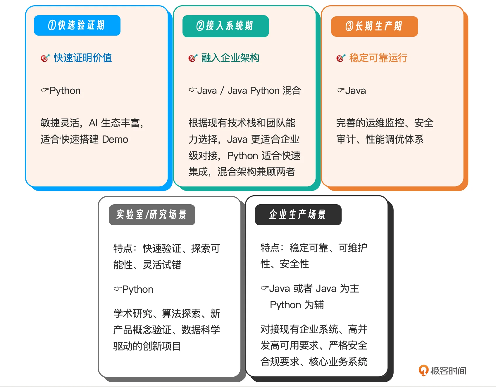
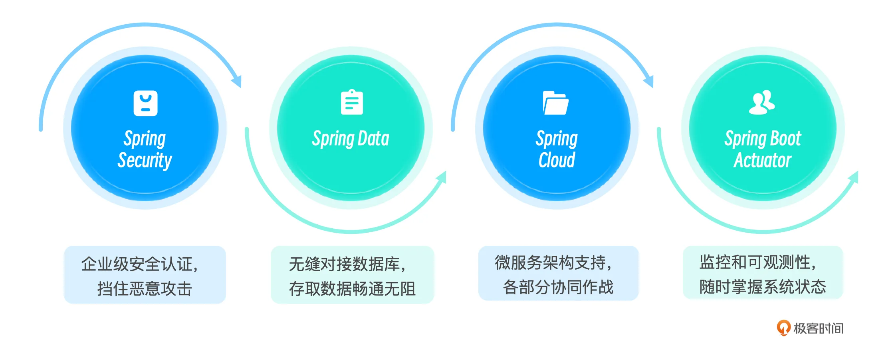
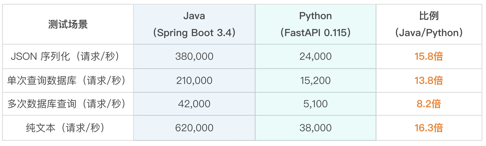
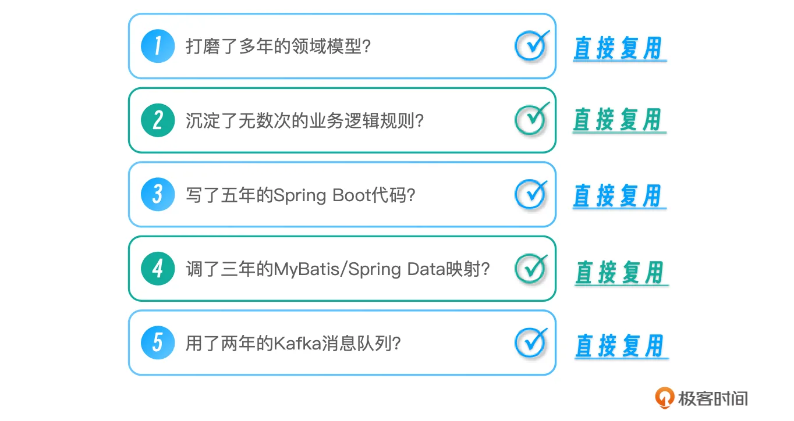
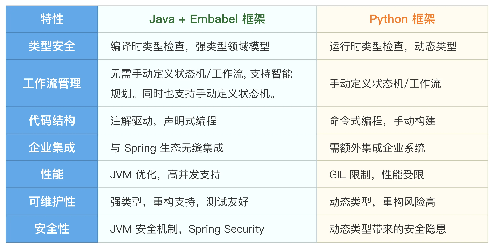

# 02｜Python vs JVM生态：为什么 80% 的 Agent 项目最终会回到 Java？
你好，我是张嘉熙。

如果你最近在研究 AI Agent，很可能经历过这样一个过程：用 Python + LangChain 或其他Python Agent 框架，很快跑通一个 Demo。但换成真实业务场景之后，开始遇到各种问题：

- 要接入用户登录和权限体系

- 要访问数据库和历史数据

- 要上线、监控、限流、审计


原来“很简单的 Agent”，开始变得复杂。其实很多项目，就卡在了这一步。这背后的关键问题其实是： **Agent 的难点，从来不是做出来，而是融进去——融入现有的业务系统。** Agent 不是孤立的玩具，而是企业业务系统的一部分。

这也是为什么我们会看到一个现象：大量 Agent 项目从 Python 起步，但最终在生产环境中逐步向 JVM 生态收敛。这节课，我们就来把这件事讲清楚。

## 为什么 Agent 几乎都从 Python 起步？

当 AI Agent 成为大模型时代的下一个风口，Java 开发者却面临一个尴尬的现实：市面上 90% 的 Agent 课程都在讲 Python（CrewAI/LangChain/LangGraph/ADK…）。这种现象的背后，是多重因素共同作用的结果。

1. **Python 是 AI 原生语言**：Python 早已成为机器学习和深度学习的通用语。从 TensorFlow、PyTorch 到 scikit-learn，几乎所有主流 AI 框架都优先支持 Python。当大模型时代到来时，OpenAI、Anthropic、Google 等公司自然选择用 Python 提供 SDK。对于 Agent 开发者来说，用 Python 可以直接调用这些原生库，无需额外的语言桥接。

2. **快速原型验证的极致体验**：Python 的语法简洁、AI生态丰富，让开发者可以用最少的代码实现复杂的 Agent 逻辑。一个简单的对话 Agent，用 Python 可能几十行代码就能跑通，这对于快速验证产品思路至关重要。

3. **数据科学家主导的早期探索**：AI Agent 的早期探索者大多来自数据科学和机器学习背景，而他们的首选语言就是 Python。这种人才结构决定了早期 Agent 框架的技术选型。当这些框架开源后，自然吸引了更多 Python 开发者加入，形成了正向循环。

4. **低门槛的试错成本**：对于很多团队来说，Agent 还是一个新兴概念。用 Python 快速搭建 Demo，可以用最低的成本验证业务价值。即使项目失败，投入的时间和资源也相对可控。这种"低成本试错"的心态，让很多团队选择从 Python 开始。

5. **开源社区的马太效应**：当第一个主流 Agent 框架（如 LangChain）选择 Python 后，后续的框架为了兼容生态和吸引开发者，大多也选择 Python。这种马太效应让 Python 生态越来越丰富，反过来又吸引更多人加入。


看到这里，很多 Java 开发者心里难免会打鼓：“企业现有的 Java 业务系统、成熟的监控运维体系怎么办，难道要用Python推倒重来吗？”

**当然不需要**。

你观察一下行业现状就会发现：当前绝大部分 Agent 项目，其实都还停留在 Demo 阶段。它们更像是一个个有趣的智能玩具，而非真正能融入业务流程的智能组件。

### 真正的分水岭，在于 从 Demo 到 Production 的跨越

当 Agent 开始进入真实业务场景，一切都会变得不同。我们可以把这个过程分为三个阶段，根据我们的观察， **超过70%的Agent项目卡在了接入系统期，无法顺利进入生产环境。**

**第一阶段：快速验证期**

在这个阶段，核心目标是快速证明价值。我们需要用最小的成本验证 Agent 能否解决特定问题。这个阶段追求的是敏捷和灵活，适合探索各种可能性。

**第二阶段：接入系统期**

当 Demo 验证成功后，接下来就要考虑如何融入现有系统。这时 Agent 需要对接企业的用户认证、访问权限、数据库、消息队列等基础设施。这是最考验技术选型的阶段。

**第三阶段：长期生产期**

当 Agent 真正成为业务系统的一部分，稳定性、可扩展性、可观测性就成了核心需求。这个阶段需要的是成熟的工程实践和稳定的技术栈。

理解这三个阶段的差异，对于我们选择合适的技术栈至关重要。技术选型从来不是非黑即白的选择，每个技术栈都有其适用阶段和场景。



绝大多数项目在走过快速验证期、进入接入系统期甚至长期生产期后，技术栈会不约而同地向 JVM 生态收敛。这不是巧合，而是工程现实的选择。下面我们就从工程视角拆解一下：为什么很多项目最终会回到 JVM？

## 从工程视角看：为什么很多项目会回到 JVM？

在企业级智能体开发中，Java从来不是“备选方案“，在很多工业级场景下甚至是“最优解”。

1. 生态优势：企业级系统的“安全护城河”

很多课程教你分分钟跑通一个Python Agent，但就像“搭积木容易，盖大楼难”——Demo只是玩具，企业要的是能打硬仗的正规军。

想象一下：当你的智能体需要7×24小时稳定运行，要能扛住双十一的流量高峰，要能被监控、被审计、出问题能快速回滚，这时候光靠LLM就像用雨伞挡台风——根本不够。

而JVM就像一座技术堡垒，它的坚固程度来自于JVM本身的底层优势。

- **稳定性**：JVM的垃圾回收机制、内存管理、异常处理体系经过三十多年的打磨，早已成为业界标杆。你很少听说JVM因为内存泄漏而崩溃，但Python的内存管理问题却屡见不鲜。

- **可维护性**：Java的强类型系统、编译时检查、完整的重构支持，让代码就像搭积木一样清晰可控。当你的智能体代码超过10万行时，Java的类型安全会帮你避免无数运行时错误。

- **安全性**：JVM的沙箱机制、权限控制、字节码验证，构建了多层安全防线。在金融、医疗等敏感领域，这种天生安全的特性是Python无法比拟的。

- **跨平台**：一次编译，到处运行，不是口号，而是JVM的核心优势。你的智能体代码可以在Linux、Windows、Mac上无缝运行，部署成本大大降低。

- **成熟度**：JVM从1995年诞生至今，经过无数企业级应用的考验，性能优化、bug修复、生态建设已经非常完善。它不是“新兴技术”，而是“经过验证的可靠选择”。


**Spring生态就是它的护城河**



这些不是锦上添花的装饰，而是企业级应用的必备装备——少了任何一样，系统都像没穿盔甲的士兵，在生产环境里寸步难行。

2. 性能优势：高并发场景的“速度与激情”

很多人只看到Python的“开发速度快”，却忽略了Java在生产环境的“运行速度快”。 **在企业级应用中，性能不是加分项，而是生死线**。当你的智能体需要处理每秒上千个请求时，Python的GIL限制就像“限速器”，直接把性能卡到瓶颈。

下表基于行业公认最权威的TechEmpower等基准测试的官方数据，可以明确说明这一点：



这不是小差距，而是量级差异——在企业级场景下，性能就是用户体验，就是成本，就是竞争力。

3. 现有系统复用：企业技术资产的“保值神器”

毫不夸张地说，企业级系统的技术地基里，JVM和Spring就是最坚实的那块砖。环顾四周，从银行的核心交易系统到电商的订单处理，从保险公司的理赔流程到制造业的生产管理，绝大多数企业的关键业务都运行在Java生态之上。

对Java开发者来说，这意味着 **你可以“穿着熟悉的鞋子”走进智能体时代。**



你的技能不仅不会过期，反而成了隐形资产。你不需要从头学一套新框架，只需在现有系统上搭积木，就能把智能体能力无缝嵌入。这样能用最低的开发和维护成本，最大化产出。

反之，如果贸然转向Python框架，就像在石头地基上强行盖木头房子——两种材质不兼容，你得费劲搭建复杂的中间层来连接；用了十年的业务逻辑代码只能躺在仓库里吃灰，不得不重新写一遍；甚至连监控、日志、部署这些熟得不能再熟的流程，都要重新学习一套新玩法。另外，新技术栈带来的生产安全风险也不容忽视。

## 一个真实的企业视角案例：某保险公司的选择

在实际的项目中，我们面临的约束有时远比想象中更为刚性，甚至几乎毫无妥协余地，比如必须无缝接入企业已有的统一身份认证（LDAP/OAuth2），绝不允许任何组件私建一套账户体系；所有决策链路必须可审计、可回溯，日志存储需满足长达 5 到 10 年的合规要求；严禁引入未经大规模生产验证的技术栈，确保团队能够长期掌控。

在这种高压环境下，技术选型的逻辑就不再是“谁看起来更时髦”，而是“谁更可控”。举个比较典型的例子，一个中型保险公司在启动智能理赔 Agent 时，内部经历过一场激烈的选型辩论。

起初，团队用 Python + LangChain 仅花 3 天就做出了能自动提取报案信息的 Demo，效果惊艳。然而一进入上线评估就有问题了，技术委员会最终拍板：用 Java + Spring AI重新实现 Agent 核心，并构建与现有保单系统、支付网关的集成。

这并非因为团队不熟悉 Python，而是他们看透了企业级应用的本质。他们真正需要的是：

- **安全合规**：Agent 必须直接触达核心业务数据，需要立刻纳入已有的 Spring Security 鉴权体系与动态脱敏策略，而不是另搞一套脆弱的安全层。

- **系统集成**：对接十多个基于 Spring Boot 的微服务并保证事务一致性，成熟框架可以让复杂编排逻辑变得可控，监控也能直接接入现有 Prometheus，无需重建观测体系。

- **性能要求**：高峰期报案并发需要稳定支撑 5000+ TPS，Java 的线程模型与多年沉淀的调优经验，给了他们足够的信心扛住流量。

- **维护成本**：让现有 20 人的 Java 团队维护一套同构的 Agent 模块，远比分裂出一套 Python 技术栈、同时维护两套 CI/CD 和运维体系要经济得多。


这样一来，这个“选择”就不仅仅是技术偏好，而是一笔清晰的企业账。

## 代码层面对比 Python vs Java + Embabel

> Talk is cheap, show me the code.

接下来，我们再从代码层面直观对比 Embabel 与 Python 主流 Agent 框架的差异。

1. Embabel vs LangGraph（自动规划 vs 有限状态机）

LangGraph（Python）实现：

```plain
# 状态定义 - 使用动态类型字典
class State(dict):
    text: str  # 输入文本
    topics: str  # 提取的主题
    title: str  # 生成的标题

# 提取主题的函数
def extract_topics(state: State) -> State:
    # 构建提示词
    prompt = f"Extract 1-3 key topics from the following text:\n\n{state['text']}"
    # 调用语言模型
    resp = llm.invoke(prompt)
    # 更新状态
    state["topics"] = resp.content.strip()
    return state

# 生成标题的函数
def generate_title(state: State) -> State:
    # 构建提示词
    prompt = f"Generate two catchy blog titles for each one these topics:\n\n{state['topics']}"
    # 调用语言模型
    resp = llm.invoke(prompt)
    # 更新状态
    state["title"] = resp.content.strip()
    return state

# 手动定义工作流
workflow = StateGraph(State)
workflow.add_node("extract_topics", extract_topics)  # 添加节点
workflow.add_node("generate_title", generate_title)  # 添加节点
workflow.set_entry_point("extract_topics")  # 设置入口点
workflow.add_edge("extract_topics", "generate_title")  # 添加边
workflow.add_edge("generate_title", END)  # 添加结束边
graph = workflow.compile()  # 编译工作流

```

Embabel（Java）实现：

```plain
// 强类型领域模型
record UserInput(String content) {}  // 用户输入
record Topics(String[] topics) {}  // 提取的主题
record BlogTitles(String[] titles) {}  // 生成的博客标题

// 博客标题生成代理
@Agent(description = "博客标题生成代理")
public class BlogTitleAgent {

    // 提取主题的动作
    @Action
    public Topics extractTopics(UserInput input, OperationContext context) {
        // 构建提示词
        var prompt = "Extract 1-3 key topics from: " + input.content();
        // 调用语言模型生成主题
        return context.ai().createObject(prompt, Topics.class);
    }

    // 生成标题的动作（同时是目标）
    @AchievesGoal(description = "生成博客标题")
    @Action
    public BlogTitles generateTitles(Topics topics, OperationContext context) {
        // 构建提示词
        var prompt = "Generate two catchy blog titles for each topic: " +
            String.join(", ", topics.topics());
        // 调用语言模型生成标题
        return context.ai().createObject(prompt, BlogTitles.class);
    }
}

```

**核心差异**：

- **工作流定义**：LangGraph 需要手动定义节点和边，Embabel 通过类型依赖自动规划。

- **类型安全**：LangGraph 使用动态类型字典，Embabel 使用强类型 record。

- **代码简洁性**：Embabel 只需定义 Action，无需手动构建状态机。


Embabel 的智能规划适用于目标明确但执行路径不确定的任务，如动态组合已有原子能力以应对新业务场景，并能自动挖掘并行化机会。LangGraph 的显式状态机适用于流程固定、需严格审计或人机协同的场景。Embabel 同时支持状态机模式，因此可在同一框架内对确定性流程用状态机，对需要智能编排的部分启用自动规划，避免技术分裂。

### 2\. Embabel vs CrewAI（多代理协作）

CrewAI（Python）实现：

```plain
# 定义研究代理（从 YAML 配置加载）
researcher = Agent(
    role="Research Agent",                    # 角色：研究代理
    goal="Gather comprehensive information about {topic} that will be used to create an organized book outline...",  # 目标：收集主题信息
    backstory="You're a seasoned researcher...",  # 背景故事：资深研究员
    tools=[search_tool],                      # 工具：网络搜索
    verbose=True
)

# 定义大纲代理
outliner = Agent(
    role="Book Outlining Agent",              # 角色：书籍大纲代理
    goal="Based on research, generate a book outline about {topic}...",  # 目标：生成书籍大纲
    backstory="You are a skilled organizer...",  # 背景故事：擅长组织信息
    tools=[],
    verbose=True
)

# 研究任务
task_research = Task(
    description="Research the provided topic of {topic} to gather important information...",  # 任务描述：研究主题
    expected_output="A set of key points about {topic}",  # 预期输出：关键信息点
    agent=researcher
)

# 生成大纲任务
task_outline = Task(
    description="Create a book outline with chapters in sequential order based on research...",  # 任务描述：生成大纲
    expected_output="An outline of chapters with titles and descriptions",  # 预期输出：章节大纲
    agent=outliner,
    output_pydantic=BookOutline             # 使用 Pydantic 模型约束输出
)

# 定义大纲生成团队（Crew）
outline_crew = Crew(
    agents=[researcher, outliner],           # 代理列表
    tasks=[task_research, task_outline],     # 任务列表（顺序执行）
    process=Process.sequential,
    verbose=True
)

# 撰写章节的团队（简化，类似结构）
class BookFlow(Flow[BookState]):
    @start()
    def generate_book_outline(self):
        output = outline_crew.kickoff(inputs={"topic": self.state.topic, "goal": self.state.goal})
        self.state.book_outline = output["chapters"]   # 字符串键访问，非类型安全

    @listen(generate_book_outline)
    async def write_chapters(self):
        # 使用 asyncio 并发写章节，但并发数由 LLM 输出决定，存在风险
        for chapter_outline in self.state.book_outline:
            task = asyncio.create_task(write_single_chapter(chapter_outline))
            tasks.append(task)
        chapters = await asyncio.gather(*tasks)

```

Embabel（Java）实现：

```plain
// 书籍撰写代理（一个类完成全部流程）
@Agent(description = "Write a book, first creating an outline, then writing the chapters and combining them")
public record BookWriter(BookWriterConfig config) {

    // 动作：研究主题（返回强类型 ResearchReport）
    @Action
    ResearchReport researchTopic(BookRequest bookRequest, OperationContext context) {
        return context.ai()
            .withLlm(config.researcherLlm())                 // 配置研究用 LLM
            .withPromptElements(config.researcher(), bookRequest)  // 类型安全的提示元素
            .withToolGroup(CoreToolGroups.WEB)               // 启用网络搜索工具
            .createObject("Research the topic...", ResearchReport.class);  // 返回强类型对象
    }

    // 动作：生成大纲（依赖研究结果，参数类型保证顺序）
    @Action
    BookOutline createOutline(BookRequest bookRequest, ResearchReport researchReport, OperationContext context) {
        return context.ai()
            .withLlm(config.writerLlm())
            .withPromptElements(config.outliner(), bookRequest, researchReport)
            .createObject("Create a book outline...", BookOutline.class);
    }

    // 动作：撰写全书（并发写章节，由平台控制并发上限）
    @Action
    Book writeBook(BookRequest bookRequest, BookOutline bookOutline, ResearchReport researchReport, OperationContext context) {
        // 使用 parallelMap 安全并发，maxConcurrency 可配置
        var chapters = context.parallelMap(
            bookOutline.chapterOutlines(),
            config.maxConcurrency(),                     // 配置最大并发数，避免限流
            chapterOutline -> writeChapter(bookRequest, bookOutline, chapterOutline, context)
        );
        return new Book(bookRequest, bookOutline.title(), chapters);
    }

    // 目标动作：发布书籍（标记为可远程导出）
    @AchievesGoal(description = "Book has been written and published", export = @Export(remote = true))
    @Action
    Book publishBook(Book book) {
        var path = config.saveContent(book);  // 保存书籍到文件
        return book;
    }
}

```

**核心差异**：

- **类型传递**：CrewAI 使用字符串传递数据，Embabel 使用强类型对象。

- **并发控制**：CrewAI 依赖 asyncio.gather，并发数由 LLM 输出动态决定，可能触发 API 限流；Embabel 通过 parallelMap 和配置参数（maxConcurrency）由平台统一管理并发。

- **可测试性**：Embabel 的强类型设计更易于单元测试。


CrewAI 适合快速拼装多角色对话、非确定性产出的探索原型，搭建门槛极低。Embabel 既覆盖 CrewAI 的角色式交互，又提供强类型编译期保障和与企业基础设施的深度集成，是全生命周期（从原型到生产）的更优选择，尤其适合需要长期维护、高可靠性的企业环境。

### 3\. Embabel vs Pydantic AI（数据验证）

Pydantic AI（Python）实现：

```plain
from pydantic import BaseModel, Field

# 用户模型定义
class User(BaseModel):
    name: str = Field(..., description="User name")  # 用户名
    age: int = Field(..., ge=0, le=120, description="User age")  # 年龄（0-120）

# 运行时验证
try:
    user = User(name="John", age=150)  # 运行时错误
except ValidationError as e:
    print(e)

```

Embabel（Java）实现：

```plain
// 编译时验证
record User(String name, int age) {
    // 构造函数验证
    public User {
        if (age < 0 || age > 120) {
            throw new IllegalArgumentException("Age must be between 0 and 120");
        }
    }
}

// 使用 Java Bean Validation
import jakarta.validation.constraints.*;

// 带验证的用户模型
record ValidatedUser(
    @NotNull String name,  // 用户名（非空）
    @Min(0) @Max(120) int age  // 年龄（0-120）
) {}

```

**核心差异**：

- **验证时机**：Pydantic 在运行时验证，Embabel 可以在编译时（通过构造函数）或运行时（通过 Bean Validation）验证

- **类型安全**：Java 的强类型系统提供编译时检查

- **集成性**：Embabel 与 Spring Validation 无缝集成


Pydantic AI 适合 Python 生态内的快速原型和脚本场景，用简单的运行时校验即可满足基本数据验证需求。Embabel借助 Java 的编译时类型系统和 Bean Validation 规范，将数据校验前移到编译期或框架层，更适合需严格数据契约、与 Spring 深度集成的企业级系统。

### Java + Embabel的优势

强类型领域模型是 Embabel 规划器可靠工作的契约基础。Java record 的编译时类型让规划器无歧义地推断数据依赖，配合 Bean Validation（@NotNull、@Min/@Max）在启动或编译期即可捕获非法数据，将错误拦截在部署之前——对比 Pydantic 的运行时校验和 Python 框架的字典/字符串传参，这种“验证前置”大幅压缩了排错周期。

同时，所有 @Agent 和 @Action 天然是 Spring Bean，安全、事务、熔断、可观测性等企业级治理通过注解自动织入，即使 Agent 动态组合出未曾预见的步骤链，治理策略依然完整覆盖。这意味着同一套强类型模型同时服务 Agent、Controller 和持久层，无需重复定义，团队也不必在多套技术栈之间切换——用一套代码、一套模型、一套治理体系，同时支撑确定性流程和智能规划。



## 本讲小结

今天这一讲，我们完成了对Java智能体定位的重要认知重构，不知道有没有消除一些你的焦虑情绪。

之前我们可能觉得现在都在用Python开发Agent，Java是二等公民，但事实并非如此——技术选型从来不是非黑即白的选择。Python适合快速原型、研究实验，而Java是企业级、高并发、安全可靠的代名词。甚至在企业生产场景，Java才是最优选择。

然后我们深入分析了Java智能体的三大优势：生态优势（JVM技术堡垒+Spring生态护城河）、性能优势（高并发场景下的量级差异）、现有系统复用（企业技术资产的保值神器）。这些不是锦上添花，而是企业级应用的必要装备。

我们还给出了一个真实的企业案例，而且专门从代码层面对比了Java + Embabel与Python主流框架的差异，CrewAI用字符串传递数据，Embabel用强类型对象；LangGraph需要手动定义状态机，Embabel既支持定义状态机，还可以智能自动规划；你不需要推倒重来，只需在现有系统上搭积木，就能把智能体能力无缝嵌入。

相信你也有所察觉，现在的 Agent 技术争流逐渐进入白热化阶段，它正在从“实验工具”走向“系统能力”。在这个过程中：

- Python 提供了最快的起点

- JVM 提供了最稳的落点


**选择 Python，是为了更快地开始；选择 Java，是为了走得更远**。而真正重要的是，你是否清楚，你的项目正处在哪一个阶段，哪一种场景。

今天的代码部分，我们以Embabel作为参照物进行了技术选型对比，Embabel具体是什么，它的优势从何而来，下一讲我会带你深入Embabel的核心模型，掌握构建强大的Java智能体系统的必备武器。

## 思考题

请你分别用 LangGraph、CrewAI、Pydantic AI 三种不同的 Python Agent 框架，重新实现第一章的天气查询智能体，对比它们与 Java + Embabel 实现的差异。假设你正在为一家银行设计智能客服系统，你会选择哪种技术栈？为什么？

欢迎你在留言区留下自己的想法和思考，和我一起交流，如果你觉得这节课对你有帮助的话，也欢迎你分享给其他需要的朋友，我们下节课再见！