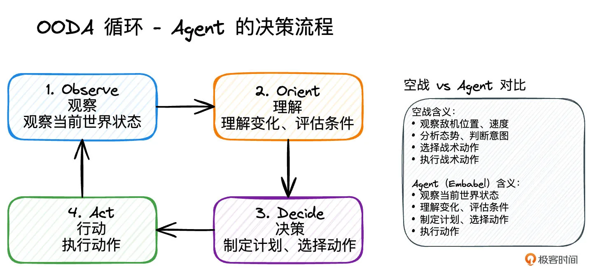
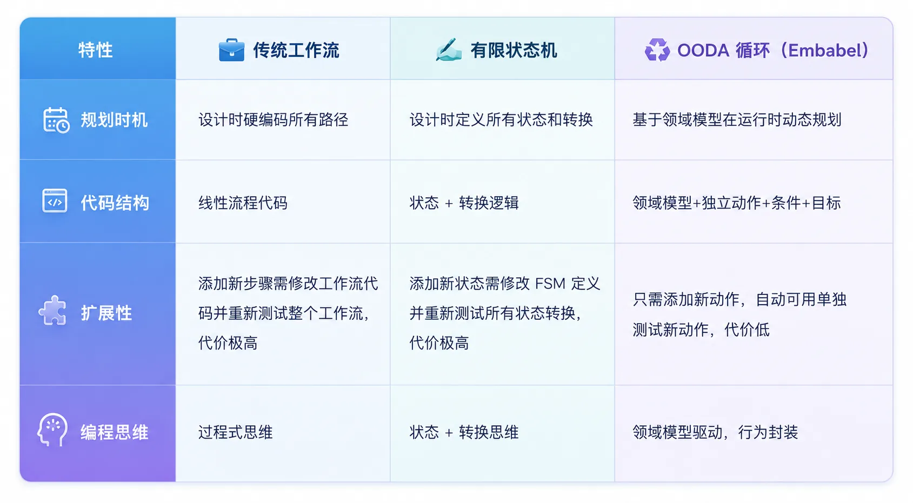
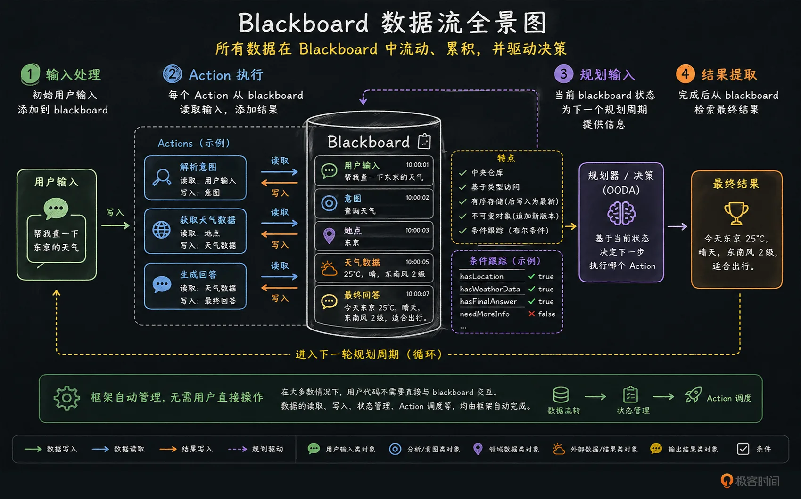
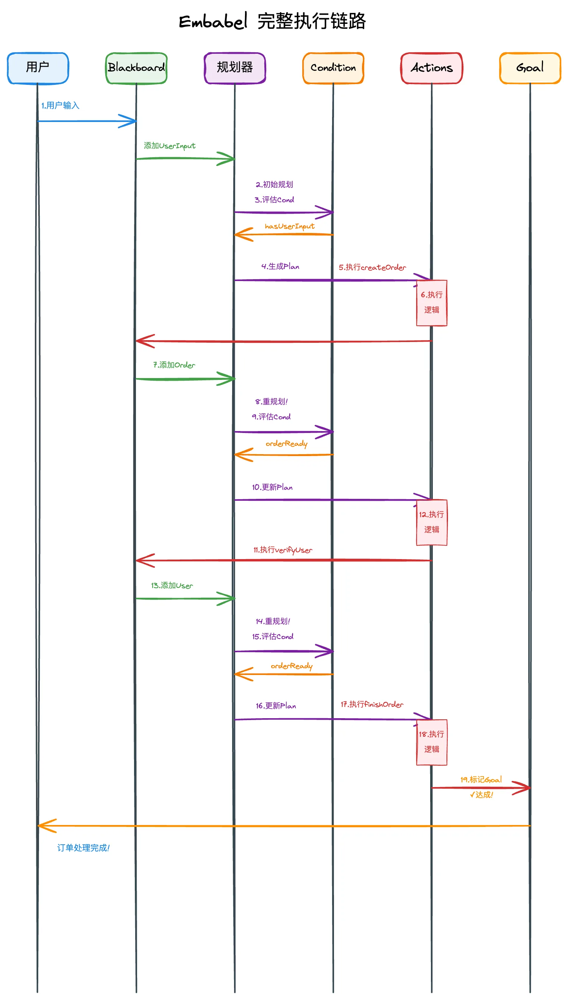

# 03｜Embabel 核心模型：从 OODA 到 Actions、Conditions、Goals
你好，我是张嘉熙。

上一讲我们论证了JVM是企业级Agent的最佳技术栈。但明天来到公司，你能否用熟悉的Spring Boot快速搭一个生产级Agent？

直接用Spring AI得自己硬编码规划逻辑，用LangChain4j的ReAct模式又慢又贵。我们需要一个原生为JVM设计的框架——Embabel，你只需在领域模型里写上 `@Action` `@Condition` 和 `@Goal`，它就会自动规划执行，还能复用现有的代码资产。这一讲，我们就来搞懂Embabel的核心模型。

## **Embabel是什么：JVM 原生 Agent 的答案**

JVM 生态成熟、风险可控，但在 LLM 如日中天的今天，仍然缺一座连接传统系统与智能能力的桥梁——而 Embabel，正是当下最合适的选择。

### **Embabel 核心定位**

Embabel 是Spring 创始人 Rod Johnson 打造的 JVM 原生 Agent 框架。我们可以用一句话来定义它：Embabel 就是声明式编程 + 自动规划的在JVM上运行的Agent框架。

> 你在领域模型即Java `Bean` 里写 `@Action`（做什么）、 `@Condition`（什么时候可以做），@Goal（目标是什么），它用 OODA 循环自动规划执行Agent。

### **选 Embabel 的 3 个核心理由**

1. **比Python更企业级，强类型加测试友好。** Embabel一切基于Domain Model，不用Map或String，享受完整重构支持，单元测试友好，Mock容易，开发、维护成本最低，可复用当前已有的构建在JVM之上的业务系统，符合企业级开发规范。

2. **比Spring AI更高层，不用硬编码流程。** Spring AI就像Servlet API，只是封装了底层HTTP调用，你得自己写流程控制；而Embabel就像Spring MVC，用声明式的@Action和@Goal，框架自动规划。

3. **比LangChain4j更快更省钱，规划默认不靠LLM**（当然这个也支持）。LangChain4j用ReAct模式，每次决策都要问LLM，又慢又贵；而Embabel默认用GOAP算法做规划，这是游戏行业验证过的AI算法，不是每次都问LLM，规划用算法，执行按需调LLM，成本更低、速度更快。


Embabel的出现，让Java智能体开发达到了新的高度，它不是Spring AI的同类竞品，也不是简单的Java版LangChain，而是真正从企业级需求出发设计的全新框架。

## **OODA 循环：Agent 的规划引擎**

Embabel 的核心执行模型是 **OODA 循环**（Observe-Orient-Decide-Act）。OODA 循环由美国空军传奇飞行员 John Boyd 在 20 世纪 60 年代提出，核心观点是决策时间比飞机速度和火力更重要。

### **为什么说OODA更适合 Agent？**

Agent就像在业务战场上作战的“战斗机”，用户输入、系统状态、外部数据都在不断变化，它需要快速适应环境并重新规划决策，这正是OODA循环擅长的领域。

我们可以通过一张图片来领会OODA 的关键四步，这不是线性流程，而是循环。环境变了，计划也跟着变。每做完一件事就重新观察、理解、决策。



### **传统工作流 vs 有限状态机 vs OODA 循环**

那OODA循环和传统的工作流的区别在哪里，它有哪些优势呢？让我们用一个具体的例子来对比三种方案。

**场景：** 处理用户的"修改收货地址"请求，其中第3步（调用仓库系统）会超时。

#### 方案 1： **传统工作流（硬编码）**

**代码实现：**

```plain
public void updateAddressWorkflow(Order order, Address newAddress) {
    // Step 1: 验证用户身份
    verifyUser(order.getUserId());

    // Step 2: 验证新地址
    validateAddress(newAddress);

    try {
        // Step 3: 调用仓库系统修改地址
        updateShippingAddress(order.getId(), newAddress);
        // Step 4: 通知用户成功
        notifyUserSuccess(order.getUserId());
    } catch (WarehouseTimeoutException e) {
        // 哦，超时了！那我们创建工单吧
        createServiceTicket(order, newAddress);
        notifyUserTicketCreated(order.getUserId());
    }
}

```

这种方式的问题很明显。所有路径都需要提前硬编码，每新增一个异常场景都要修改代码，步骤之间的依赖关系不清晰，而且难以复用单个步骤。

#### 方案 2： **有限状态机（FSM）**

**状态定义：**

```plain
public enum AddressUpdateState {
    INIT,          // 初始状态
    USER_VERIFIED, // 用户已验证
    ADDRESS_VALID, // 地址已验证
    UPDATING,      // 正在更新
    TICKETING,     // 创建工单中
    COMPLETED      // 完成
}

```

**状态转换逻辑：**

```plain
public class AddressUpdateFSM {
    private AddressUpdateState currentState = AddressUpdateState.INIT;

    public void handleEvent(AddressUpdateEvent event) {
        switch (currentState) {
            case INIT:
                if (event == USER_VERIFIED) {
                    currentState = AddressUpdateState.USER_VERIFIED;
                }
                break;
            case USER_VERIFIED:
                if (event == ADDRESS_VALID) {
                    currentState = AddressUpdateState.ADDRESS_VALID;
                }
                break;
            case ADDRESS_VALID:
                if (event == UPDATE_SUCCESS) {
                    currentState = AddressUpdateState.COMPLETED;
                } else if (event == UPDATE_FAILED) {
                    currentState = AddressUpdateState.TICKETING;
                }
                break;
            case TICKETING:
                if (event == TICKET_CREATED) {
                    currentState = AddressUpdateState.COMPLETED;
                }
                break;
            // ... 更多状态转换
        }
    }
}

```

有限状态机的问题也不少，所有状态和转换都需要提前定义，状态定义和业务逻辑耦合，新增状态需要修改FSM核心代码，而且难以扩展和复用。

#### 方案 3： **OODA 循环（Embabel 用的方案）**

不需要预先定义状态或者工作流路径，只需要定义Embabel核心概念，就能进行智能规划。

伪代码实现：

```java

// Domain Model
public class AddressUpdateRequest {
    private final Order order;           // 用户的订单信息
    private final Address newAddress;    // 用户想要修改的新地址
    private boolean userVerified;        // 用户身份是否已验证
    private boolean addressValidated;    // 新地址是否已验证
    // ... 其他状态
}

//  注意：这节课暂时忽略@Agent相关代码，后面章节会讲到
//  动作（可复用！），用@Action注解标记单个可执行步骤
@Action
public void verifyUser(AddressUpdateRequest request) {
    // 验证用户身份
    verifyUser(request.getOrder().getUserId());
    // 更新领域模型状态
    request.setUserVerified(true);
}

@Action
public void validateAddress(AddressUpdateRequest request) {
    // 验证新地址
    validateAddress(request.getNewAddress());
    // 更新领域模型状态
    request.setAddressValidated(true);
}

@Action
public void updateShippingAddress(AddressUpdateRequest request) {
    // 调用仓库系统修改地址
    updateShippingAddress(request.getOrder().getId(), request.getNewAddress());
}

@Action
public void createServiceTicket(AddressUpdateRequest request) {
    // 创建工单（仓库超时的备选方案）
    createServiceTicket(request.getOrder(), request.getNewAddress());
}

// 条件，用@Condition注解标记控制流程的阀门
@Condition
public boolean canUpdateAddress(AddressUpdateRequest request) {
    // 只有用户已验证且地址已验证，才能执行更新
    return request.isUserVerified() && request.isAddressValidated();
}

// 目标，用@AchievesGoal标记想要达成的状态
@AchievesGoal
@Action
public boolean addressUpdated(AddressUpdateRequest request) {
    // 目标达成：地址已更新成功，或者创建了工单作为备选方案
    return request.getOrder().getAddress().equals(request.getNewAddress())
        || request.getServiceTicket() != null;
}

```

**Embabel 自动处理：** OODA循环会自动观察当前状态，理解目标和已完成的步骤，动态规划下一步（不需要你写路径或状态），执行动作，然后重复直到目标达成。



OODA循环让你的Agent像一个可靠且聪明的员工，不是一个死板的机器人，也不是一个聪明的疯子。死板的机器人只会按你写好的剧本一步步走，遇到剧本里没写的情况就卡住。聪明的疯子有时候会表现的很聪明，但是这种聪明并不稳定，时不时就会发疯。可靠且聪明的员工具备确定的目标、真正的规划能力、灵活适应变化的能力。

那么我们怎么让这个员工理解你的业务呢？你需要给它一套工具箱、一套判断标准、一个目标、一本业务手册、一个执行流程，而这就是Embabel的五大核心概念。

## **Embabel 核心概念**

根据 embabel-agent 官方文档，Agent 模型由五个核心概念组成：Action → Condition → Goal → Domain Model → Plan。这节课我们暂时跳过后两个概念（05、06章会讲到），重点聚焦在前三个概念上。

### **Action（动作）：Agent 的执行单元**

Action 是 Agent 可以执行的单个步骤，基于 Domain Model 定义输入和输出。

**官方 Java 注解方式**：在 Java 中，你不需要直接实现 Action 接口，而是使用 `@Action` 注解来标记方法。

Action 的实际例子（来自官方 Java 示例）：

```java
// 简单的Action示例：获取用户的星座运势
@Action
public Horoscope retrieveHoroscope(StarPerson starPerson) {
    // 调用星座服务获取今日运势
    return new Horoscope(horoscopeService.dailyHoroscope(starPerson.sign()));
}

```

另一个更完整的例子（带 LLM 调用）：

```java
// 使用LLM解析用户输入，提取用户信息的Action
@Action
public PersonImpl extractPerson(UserInput userInput, OperationContext operationContext) {
    // 从OperationContext获取AI服务
    return operationContext.ai()
            .withLlm(LlmOptions.fromCriteria(ModelSelectionCriteria.getAuto()))
            .createObjectIfPossible(
                """
                Create a person from this user input, extracting their name:
                %s""".formatted(userInput.getContent()),
                PersonImpl.class
            );
}

```

Action的设计非常符合Java开发者的直觉。首先，它就是一个使用 `@Action` 注解的方法而已。完全基于强类型，方法参数就是输入，基于Domain Model，方法返回值就是输出，也基于Domain Model。Action可以用于执行Domain Model的代码逻辑，也可以调用LLM，甚至你还可以调用其他agent作为一个子进程。

对于调用LLM，我们往往需要同时使用一些工具比如网络搜索等，这种Action中的工具调用也是完全支持的。

接下来我们看一个带有LLM调用且使用工具的Action例子，这里我们可以用toolGroups将一组tool绑定在某个特定的Action上。通过这种绑定，精准控制了LLM调用工具的范围，避免因为工具过多，导致LLM准确性下降。

```plain
// toolGroups指明Action执行需要用到的工具
    @Action(toolGroups = {CoreToolGroups.WEB})
    public RelevantNewsStories findNewsStories(
            StarPerson person,
            Horoscope horoscope,
            Ai ai) {
        var prompt = """
                %s is an astrology believer with the sign %s.
                Their horoscope for today is:
                    <horoscope>%s</horoscope>
                Given this, use web tools and generate search queries
                to find %d relevant news stories summarize them in a few sentences.
                Include the URL for each story.
                Do not look for another horoscope reading or return results directly about astrology;
                find stories relevant to the reading above.

                For example:
                - If the horoscope says that they may
                want to work on relationships, you could find news stories about
                novel gifts
                - If the horoscope says that they may want to work on their career,
                find news stories about training courses.""".formatted(
                person.name(), person.sign(), horoscope.summary(), storyCount);
        return ai
                .withDefaultLlm()
                .createObject(prompt, RelevantNewsStories.class);
    }

```

不过，Action可能会存在副作用，比如数据库变更操作、外部系统调用等等。这一点你要特别注意。@Action还有更多属性可以配置，具体内容你可以看一下 [官方文档](https://docs.embabel.com/embabel-agent/guide/0.3.5/#the-action-annotation)。

### **Condition（条件）：控制流程的阀门**

Condition 就是那些在执行Action或判定Goal完成之前，需要先进行验证的条件。每次执行Action后，都需要重新评估这些条件。

在Action注解中，支持用pre和post属性来配置Conditon。

pre：除了输入类型之外，执行操作之前 **必须** 满足的 **前提** 条件列表。

post：除了输出类型之外，在执行操作后 **可能** 满足的 **后置** 条件列表。

```plain
@Action(post = {"condition1"})
public PackageInput createInput(String content) {
    return new PackageInput(content);
}

```

注意：Condition应该专注于条件判断逻辑，任何其他可能具有副作用的行为，比如修改数据库，服务调用，都应该完全避免。

### **Goal（目标）：Agent 想要达成的状态**

Goal 是 Agent 试图达成的状态。达成 Goal 需要执行 Actions，并且需要满足前置 Conditions。具体来说，就是同时使用@AchievesGoal和@Action，表明达到了特定目标。

Goal的设计很有意思——它不是单独写的，而是直接加在Action上的@AchievesGoal注解，这意味着某个Action完成后，对应的Goal也就达成了。

**Goal 的实际例子**（来自官方 Java 示例）：

在 Java 中，Goal 通过 @AchievesGoal 注解标记在 Action 上：

```java
// 这个Action达成了"生成有趣的文章"的目标
@AchievesGoal(
    description = "Write an amusing writeup for the target person based on their horoscope and current news stories"
)
@Action
public Writeup writeup(
        StarPerson person,
        RelevantNewsStories relevantNewsStories,
        Horoscope horoscope,
        OperationContext context) {
    // 配置LLM参数，设置较高的温度（更有创造性）
    var llm = LlmOptions.fromCriteria(ModelSelectionCriteria.getAuto())
        .withTemperature(0.9);
    // 格式化新闻项，准备提示词
    var newsItems = relevantNewsStories.getItems().stream()
        .map(item -> "- " + item.getUrl() + ": " + item.getSummary())
        .collect(Collectors.joining("\n"));
    // 构建LLM提示词
    var prompt = """
        Take the following news stories and write up something
        amusing for the target person.

        Begin by summarizing their horoscope in a concise, amusing way, then
        talk about the news. End with a surprising signoff.

        %s is an astrology believer with the sign %s.
        Their horoscope for today is:
            <horoscope>%s</horoscope>
        Relevant news stories are:
        %s

        Format it as Markdown with links.""".formatted(
        person.name(), person.sign(), horoscope.summary(), newsItems);
    // 调用LLM生成文章
    return context.ai().withLlm(llm).createObject(prompt, Writeup.class);
}

```

在 `@AchievesGoal` 注解中，有一个需要特别注意的点：如果你的 Agent 需要被 MCP 客户端远程调用，你可以为它开启导出能力——也就是在这里注解中配置 `@Export(remote = true)`。

```plain
@AchievesGoal(export = @Export(remote = true))
    @Action
    Book writeBook(BookRequest request, BookOutline outline, OperationContext context) {
        // 并行执行章节创作
        var chapters = context.parallelMap(outline.chapterOutlines(),
            config.maxConcurrency(),
            chapterOutline -> writeChapter(request, outline, chapterOutline, context));
        return new Book(request, outline.title(), chapters);
    }

```

每个Agent至少需要一个带有注解的操作@AchievesGoal，来定义Agent工作的完成状态。

## **这些概念如何配合工作？**

在理解这些概念如何流转之前，我们先来思考一个关键的问题： **一个 Agent 在执行过程中，数据到底放在哪里？**

- 用户输入放哪儿？

- 中间结果放哪儿？

- 每一步的执行状态怎么保存？


在 Embabel 里，这一切都由一个核心组件来负责： **Blackboard（黑板）**。

### Blackboard 设计模式

Blackboard 是 Embabel 中的共享内存系统，维护整个 Agent 过程执行期间的状态。你可以把它想象成 Agent 的工作台，所有需要的数据、中间结果都放在这里。每个 Action 执行时从这里取需要的输入，执行完后把输出放回去。

**我们来看一下Blackboard的几个核心特性。**

1. **一个“中央仓库”**：所有数据只放一个地方。好处是不会到处传参数、状态不会丢失、所有 Action 都能访问。

2. **按类型找数据**：不用字符串 key，而是用“对象类型”。比如你可以说：我要找“天气请求”“搜索结果”，本质是面向对象，而不是拼字符串。

3. **自动帮你选最新数据：** Blackboard 是有顺序的，后写入的数据，会覆盖旧的使用优先级。比如：第一次查天气（旧）第二次查天气（新），系统默认用最新的。

4. **数据一旦写入，就不能改：** 只能新增，这样做可以防止数据被误改，还可以追溯整个过程，非常适合 AI 推理链。

5. **帮你记录任务条件：** Blackboard 里还会存一些“条件判断”。比如：有没有拿到天气数据？用户有没有登录？这些信息可以决定下一步做什么。


要想理解 Blackboard，一定要看懂它的“数据流”。

- 输入处理：初始用户输入添加到 blackboard

- Action 执行：每个 Action 从 blackboard 读取输入，添加结果

- 状态演变：blackboard 累积代表演变状态的对象

- 规划输入：当前 blackboard 状态为下一个规划周期提供信息

- 结果提取：完成后从 blackboard 检索最终结果


大多数时候用户代码不需要直接与 blackboard 交互，框架会自动管理它。



### 场景示例

假设你正在开发一个电商平台的订单处理系统，用户通过简单的文本输入（例如user-456 我要下单）来提交订单请求。系统需要：

1. 从用户输入中提取用户ID并创建订单

2. 自动验证用户身份

3. 完成订单处理流程


```plain
// ==================== Domain Model：强类型领域对象 ====================
record UserInput(String content) {}
record Order(String orderId, String userId) {}
record User(String userId, boolean verified) {}
record ProcessedOrder(String orderId) {}

// ==================== Agent：智能代理主体 ====================
@Agent(description = "订单处理代理")
public class OrderProcessingJava {

    // ==================== Condition：前置/后置条件检查 ====================
    @Condition(cost = 0.0) // 最低成本优先检查
    public boolean hasUserInput(UserInput userInput) {
        return userInput != null;
    }

    @Condition(cost = 0.1)
    public boolean userVerified(User user) {
        return user != null && user.verified();
    }

    @Condition(cost = 0.2)
    public boolean orderReady(Order order, User user) {
        return order != null && userVerified(user);
    }

    // ==================== Action：可执行动作单元 ====================
    @Action(post = {"orderReady"})
    public Order createOrder(UserInput userInput, OperationContext context) {
        return new Order("ORDER-123", userInput.content().split(" ")[0]);
    }

    @Action(post = {"userVerified"})
    public User verifyUser(Order order) {
        return new User(order.userId(), true);
    }

    // ==================== Goal：目标达成标记 ====================
    @AchievesGoal(description = "订单已处理完成")
    @Action(pre = {"orderReady"})
    public ProcessedOrder finishOrder(Order order, User user) {
        return new ProcessedOrder(order.orderId());
    }

}

```

### **完整执行链路**



**步骤1：用户输入**

用户输入“user-456 我要下单”，系统将用户输入作为 UserInput 对象自动添加到 Blackboard 中，此时 Blackboard 内容为 \[0\] UserInput(“user-456 我要下单”) ，目标设定为“订单已处理完成”。

**步骤2：初始规划**

规划器开始分析当前 Blackboard 状态（只有 UserInput），并检查所有可用的 Action、Condition 和 Goal。规划器优先评估低成本的 Condition： hasUserInput cost=0.0（只检查内存对象），确认成立。接着，规划器通过分析 Action 的输入/输出类型依赖关系，自动生成执行计划： \[createOrder → verifyUser → finishOrder\]。

**步骤3：执行第一个 Action**

规划器选择执行 createOrder Action，该 Action 的输入来自 Blackboard\[0\] 的 UserInput 对象。执行后，createOrder 输出 Order(“ORDER-123”, “user-456”) 对象，该对象被自动添加到 Blackboard。同时，由于 post = {“orderReady”} ， orderReady Condition 被标记为成立，此时 Blackboard 内容为 \[0\] UserInput, \[1\] Order。

**步骤4：重规划（状态已改变）**

由于 Blackboard 状态发生了变化（新增了 Order 对象），规划器触发重规划机制。规划器重新评估 Condition 成本： orderReady cost=0.2（需要检查两个对象）， hasUserInput cost=0.0（仍然成立）。规划器发现 createOrder 已执行完成，因此更新 Plan 为： \[verifyUser → finishOrder\]。

**步骤5：执行第二个 Action**

规划器选择执行 verifyUser Action，该 Action 的输入来自 Blackboard\[1\] 的 Order 对象。执行后， verifyUser 输出 User(“user-456”, true) 对象，该对象被自动添加到 Blackboard。同时，由于 post = {“userVerified”} ， userVerified Condition 被标记为成立，此时 Blackboard 内容为 \[0\] UserInput, \[1\] Order, \[2\] User。

**步骤6：重规划（状态又改变，检查前置条件）**

由于 Blackboard 状态再次发生变化（新增了 User 对象），规划器再次触发重规划机制。规划器检查 finishOrder 的前置条件 pre = {“orderReady”} ，评估 orderReady Condition（cost=0.2），确认条件已满足，因此更新 Plan 为：\[finishOrder\]。

**步骤7：执行第三个 Action（达成 Goal！）**

规划器选择执行 finishOrder Action，该 Action 的输入来自 Blackboard\[1\] 的 Order 对象和 Blackboard\[2\] 的 User 对象。执行后， finishOrder 输出 ProcessedOrder(“ORDER-123”) 对象，该对象被自动添加到 Blackboard。由于该 Action 带有 @AchievesGoal 注解，目标"订单已处理完成"标记为达成！

## **本讲小结**

这节课我们学会了 Embabel 核心模型，这是掌握Embabel框架的关键一步。

**1\. 理解 OODA 循环**

我们了解了OODA循环模型。它让 Agent 变成了靠谱且聪明的员工，环境变了，计划也跟着变，每做完一件事就重新观察、重新理解、重新决策。

**2\. 掌握Action、Condition、Goal、Blackboard等核心概念**

我们建立了完整的概念体系：Action是能做什么（可执行动作单元），Condition是什么时候能做（控制流程的阀门），Goal是要做成什么（目标达成标记）。通过Blackboard设计模式，所有组件像专家围在黑板前协作，观察→理解→决策→行动，反复循环直到目标达成。

**3\. 看清与传统方案的差异**

我们对比了三种方案：传统工作流硬编码所有路径难以扩展，有限状态机预先定义所有状态耦合严重，而Embabel用OODA循环实现动态规划，自动适应，零代码修改就能应对变化。

下节课，我们将探索 **Embabel 与 Spring 的关系**，看看如何把这个强大的框架无缝融入现有系统。

## **思考题**

使用Embabel实现一个简单的智能图书借阅Agent，功能包括：用户用自然语言输入，比如“我想借一些科幻小说”，Agent能理解并搜索相关图书；自动检查图书是否可借；自动避免重复借过的书；完成借书流程。

这个场景将完美体现OODA循环的优势：环境是动态的，图书库存会变、用户借过的书会变，Agent需要不断观察、理解、决策、行动！

### 参考思路

1. 请先定义Domain Model，包括图书、用户、借书请求这三个核心对象。提示：用Java record来定义，每个对象包含必要的属性，比如图书要有ID、书名、分类、作者、是否可借；用户要有ID、姓名、已借图书ID列表；借书请求要有用户和查询内容。

2. 基于上面的Domain Model，定义几个核心Action：解析查询、搜索图书、检查图书是否可借、过滤用户已借过的书、执行借书、返回结果。提示：用@Action注解标记这些方法，给每个Action设置合理的cost，比如涉及LLM解析查询的cost可以高一些，而检查内存属性的cost为0。

3. 最后定义Condition和Goal。Condition需要判断用户是否有查询、图书是否可借、用户是否没借过这本书；Goal是用户成功借到书或者Agent给出合理回复。提示：Condition用@Condition注解，Goal可以通过在Action上用@AchievesGoal来标记。


### 提问

1. 想象一下，如果用LangChain4j实现同样的功能，你需要写什么样的“思考→行动”Prompt？对比Embabel的方式，你觉得哪种方式更可控、更易维护？

2. 假设书店搞活动，新增了一个“会员优先借书”的规则，用Embabel的话你需要改什么？如果是传统的工作流代码，你需要改什么？

3. 回顾一下OODA循环的四个步骤，在这个智能图书借阅场景里，每个步骤分别对应什么？


欢迎你把自己实现的代码链接分享到留言区，如果这节课的内容对你有帮助的话也欢迎你分享给需要的朋友，我们下节课再见！